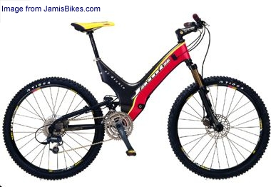
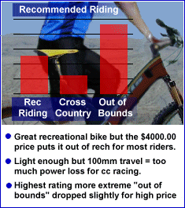

Looking for a high performance long travel screamer? Look no further!

Jamis' El Diablo brings "cross country" weights to the "out of bounds" rider!

Before you scramble to find a dealer keep in mind this kind of technology and componentry doesn't come cheap. The 25.75 lb 100mm travel El Diablo has a Suggested Retail of $3999.00.

To find out more about this bike or other more wallet friendly Jamis models check out their web site at [www.jamisbikes.com](http://www.jamisbikes.com/).

## **The Bike**

## 

The El Diablo is an awesome long travel mountain bike which is well worth it's $4000.00 price tag.

The frame and swingarm are Vacuum Resin Transfer Mold carbon fiber (VRTM is a process which eliminates voids and loose fibers in the mold).

A spec list on the El Diablo reads like a wish list for anyone wanting to upgrade a bike. A three ring Shimano XTR crank spins the 9 speed M952 freewheel connected to a Mavic Cross Max Disc [wheelset](https://mtbnz.com/best-mountain-bike-wheels/). Shifting is done with XTR front/rear derailleurs and XTR Rapidfire shifters.

Ground contact is managed by a Fox Air Vanilla R controlled fully active 100mm travel swingarm, a Rock Shox SID 100 fork, and Tioga XC Kevlar tires.

The BB placement and swingarm geometry do a great job minimizing biopage and bounce. Braking is responsive and reliable with the front and rear Hayes hydraulic disc brakes and Hays levers.

## **The Ride**

I rode this bike at the Interbike On-Dirt Demo in Las Vegas.  The Diablo’s awesome looking carbon fiber frame is the first thing that caught my eye.  It’s just sweet to ride and thrash a bike that sounds like a paper towel roll when you thump it!

You can thrash all you want on this bike too!  It really takes the terrain without transferring much of anything to the rider.

I rode this thing on some pretty rough and loose terrain out there which I wasn’t used to and it really adjusted the learning curve in my favor.

The Fox and SID suspension is really plush. Throw in the Hayes discs and an XTR component setup and you start to really appreciate the work that designer Tom Watson has put into this bike.  Jamis shoots and they score!

## **The Rider**

It's an all around great mountan bike but the price limits it to more extreme trail and "out of bounds" type riding where it's well worth the cost.
