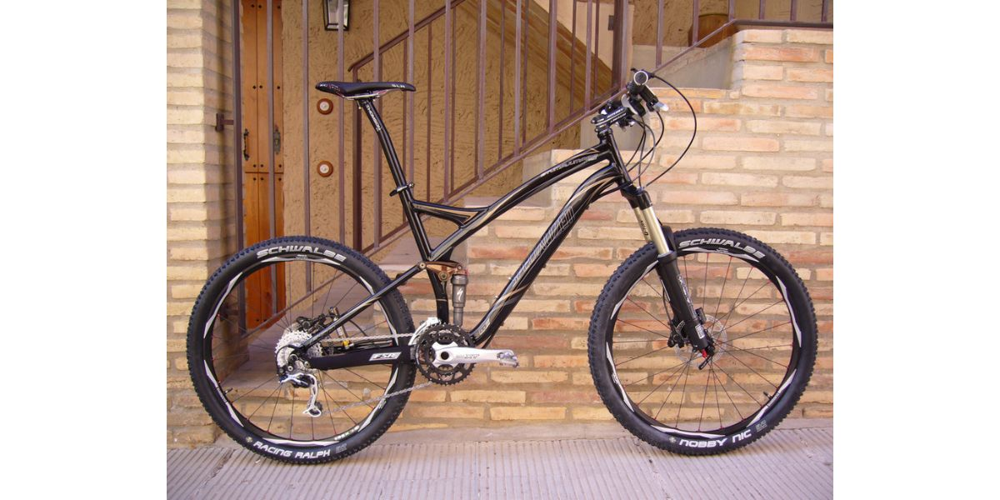
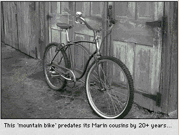
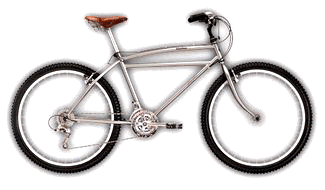

I can't believe I get to share the fascinating history behind one of my favorite hobbies - mountain biking! As an avid mountain biker myself, learning about how this exhilarating sport came to be was truly an inspiration. 

## The Early Origins

Believe it or not, mountain biking traces its roots all the way back to the late 1800s!

Back then, roads were unpaved, so riding off-road was common for those adventurous cyclists. In 1896, a group of Buffalo Soldiers (African American servicemen) even customized bikes to carry gear over rough terrain on an expedition through Yellowstone.

However, mountain biking as we know it today originated in the 1970s in Northern California. A group of friends, including legends like Joe Breeze, Otis Guy, and Charlie Kelly, started racing down Mt. Tamalpais on old cruiser bikes called "klunkers."

These fat-tired beasts were heavy at 50 pounds, but they sparked an innovative spirit.

## The First Mountain Bikes

The invention of the modern mountain bike is attributed to a group of friends in Marin County, California, in the mid-1970s. This group included Joe Breeze, Otis Guy, Charlie Kelly, and Gary Fisher.

They began by racing their bikes down the rough dirt paths on Mount Tamalpais and soon realized the toll these trails took on their bikes. To tackle these tough trails, they started experimenting with different types of bikes, using old, pre-World War II single-speed bikes with heavy frames and big tires, which they called "klunkers".

Joe Breeze is credited with creating the first purpose-built mountain bike in 1977. He welded the first custom heavy frame intended for downhill racing, thereby successfully producing the first true mountain bike. This bike was made for his friend Charlie Kelly, who is usually considered the person to coin the term "mountain bike".

After coining the term "mountain bike," Kelly with partners like Gary Fisher, started selling the first true mountain bikes from frame-builder Tom Ritchey.

In 1981, Specialized launched the Stumpjumper, the first mass-produced mountain bike. This commercial release marked a critical step in legitimizing mountain biking as more than just a fringe hobby.

\[caption id="attachment\_5970" align="aligncenter" width="1200"\] The first mass-produced mountain bike was the Specialized Stumpjumper in 1980.\[/caption\]

Companies such as Trek and Giant quickly caught onto this trend, launching their own models to cater to the growing community of off-road enthusiasts

It was a total game-changer for cycling!

Major technological leaps came in the 1990s and beyond - we're talking sophisticated front and rear suspension systems, powerful disc brakes, and durable composite frames.

Mountain biking was firmly established, allowing the sport to eventually debut at the 1996 Atlanta Olympics.

### Where Did Mountain Biking Start?

Mountain biking as we know it today traces its beginnings to Marin County, California in the early 1970s. A group of young cycling enthusiasts, including Joe Breeze, Gary Fisher, and Otis Guy, started racing old cruiser bicycles with balloon tires down the fire roads and trails of Mount Tamalpais just north of San Francisco.

Dubbed “klunkers,” these vintage 1930s-50s bikes were customized with better brakes, stronger frames and motorcycle-style handlebars to handle the rugged terrain. The riders organized downhill races called “Repacks,” named after the post-race hub repacking needed from the heat of braking.

https://www.perplexity.ai/search/Using-a-friendly-VYc2xuxZQD6yT.CAYR5afg?s=c

### When Did Mountain Bikes Become Popular?

Mountain biking went mainstream throughout the 1980s and saw huge growth as a popular sport from the 1990s onwards.

The popularity of mountain biking began to rise significantly towards the end of the 1970s and the beginning of the 1980s. This surge in interest was noticed by manufacturers of road bikes, leading to the creation of the first mountain bike designed for mass production.

The popularity of mountain biking continued to grow throughout the 1980s, largely due to extensive media coverage of major mountain bike races. These events were watched by millions of people worldwide, leading to significant sponsorship deals for athletes and fierce competition among top competitors. This high-level competition and extensive media coverage compelled top-tier bicycle manufacturers to create novel mountain bikes and broaden their selection of mountain bike equipment and components.

Since then, mountain biking has evolved into a continually changing sport with numerous subcategories, each with its own thriving subculture and specific bike requirements. Over the past decade, the use of mountain bike trails has increased annually by an average of 100%, indicating a continued growth in the sport’s popularity.

Because the "Mountain Bike" is as popular in the flatlands as it is in the mountains, little wonder it is also called "All Terrain Bike" (ATB) and "Off Road Bike." Let's visit its origins.

<table><tbody><tr><td></td><td>Recent evidence has emerged which suggests and, quite frankly, proves through old photographs that the Mountain Bike was first used by those rascals in the Kentucky and Tennessee hills to tend their secluded moonshine stills. I'll buy that. It is said that the balloon-tired vehicle was a quick, quiet and effecient way to tend the stills and keep one-step-ahead of the "revenuers."</td></tr><tr><th>Bike may be old, but Tires aren't!</th></tr></tbody></table>

Exactly what, if anything, was done to those early "Mountain bikes," to make them work on the mountainous hillsides is not known to me at this writing. It's safe to assume that something was modified. It's also safe to assume that whatever the modification was, it was kept among the moonshining in-crowd.

That having been said, I'll turn the focus Westward, and to those young men and women who weren't afraid to both ride in the daylight, _and_ share their back-yard engineering with anyone who would listen.

The commercial Mountain Bike evolution didn't start until 1974 and its first production bikes didn't appear in stores until about 10 years later. In other words, it's a relatively new machine and sport. Not surprisingly, California commercialized, if not started it all. There, a band of reckless young men started racing down the root-strewn trails of the Northern California mountains atop home-made bicycles. They rode balloon-tired, coaster-braked, spring-seated bikes with motorcycle brake levers and old 10-speed thumb-shifters. Gary Fisher was one of those bike-makers and has become somewhat the commercial "Father" of Mountain Bikes for his early efforts.

<table><tbody><tr><td>Fisher's mountain was Mount Tamalpis in Marin County, (read San Francisco) California. Its most challenging trail dropped 1200 feet in elevation in just 1.8 miles. At the end of the run, the coaster brakes heated up enough to need repacking with grease and the hill was named "Repack."</td><td></td></tr><tr><td>&nbsp;</td><th>Fisher's "Klunker" (re-issued in 1996)</th></tr></tbody></table>

Four years later, in 1978, Gary rode his original bike down Repack Hill in 4 minutes, 22 seconds. Gary survived and at this writing, his record still stands.Because those early bikes had inadequate low gear ratios, Gary and his fellow riders had to push their bikes back up the hill, like sleds, for another ride down.

## **MEANWHILE, BACK EAST...**

While the Californians refined their downhill bicycles, a group of East Coast riders were building their own version of the Mountain Bike for the rocky wooded trails of New England. The most promising work being done by a young cyclist named Chris Chance.

His first bike design, dubbed the "Fat Chance," was outfitted with fat tires, of course, but Chris also re-welded the frame incorporating some radical geometric changes he thought would help him stay in the saddle while negotiating the single-lane paths snaking up, over, down and around the rocks, stumps and streams in the New England woods. His design used shortened chainstays, (horizontal tubes holding the rear wheel) which placed the rider more squarely over the back tire where climbing traction was needed. He used steeper head angles (the angle of the front fork) for quicker steering response. The result was a compact, responsive bicycle made for the woods. He didn't stop there. Chance raised the bottom bracket which holds the crank/bearing assembly to give his bikes more ground clearance for rocks and stumps and he added a third front chainring for more low climbing gears.

## **EAST MEETS WEST**

Heck, it was bound to happen. In the summer of 1983, Chris Chance and Gary Fisher met at a closed-for-the-summer Ski Resort in Crested Butte, Montana and a year later, in 1984, the Mountain Bike as we know it was being delivered to bike stores. A new sport had arrived. There were undoubtedly scores of other design contributors whose names, rightly or wrongly, have been overshadowed by the fame of Chance and Fisher. I acknowledge and salute them too. Forgive me, this is the Readers Digest version.

## Mountain Biking in the 1990s

The first mass-produced mountain bike was the specialized Stumpjumper in 1980 and throughout the 1980's the development of mountain bikes was rapid.

Major savings in weight were achieved by using new Japanese aluminium rims and properly deigned thin-walled knobbly-tread tyres. These developments brought the weight of the best mountain bikes to below 30lbs.

Mountain biking had now spread world wide and became extremely popular in Europe where mountain bike sales far exceeded that of any other type of bike. The majority of mountain bike frames were being produced in the far East, and Shimano became the main producer of the components. They made massive developments in gear shifting mechanisms and braking systems.

Many of the top end developments continued to filter through to the cheaper bike. Other developments included clipless pedals, which replaced toe clips, in which the pedal clipped to the soles of shoes in a similar way to ski cleats. Another major development was the introduction of motocross, and this inspired front suspension forks which made bikes ever quicker.

### Mountain Bikes by the 1990s

By the 1990's mountain bike development had spread to the rear of the bikes with the introduction of rear suspension which made riding over rough terrain faster and more comfortable.

Bikes were now much faster but the brakes were clearly lacking in power. V-brakes and hydraulic rim brakes were better but were eclipsed by the far superior English developed disc brakes. These were better because they offered superior power and a better feel to the rider. Also, because they were in the middle of the wheel, they did not get affected by mud and other debris on the trail.

## Downhill Racing

Downhill mountain bike racing is a time trial event that has many similarities to downhill skiing. Riders start their runs at intervals that can vary from 30 seconds to up to three minutes, depending on the level of the competition.

The rider who completes the course in the shortest time wins. As the name of this type of riding implies, downhill races are staged on steep, downhill terrain, resulting in higher speed than in cross-country racing. The terrain is also often somewhat rougher than in cross-country mountain bike racing.

The bikes used in downhill tend to be heavier and much stronger than cross-country bikes, and almost always feature long travel dual-suspension (usually around 6-8 inches) whereas cross-country bikes are generally hardtails (4-5 inches of travel at the front).

Downhill mountain bikes have powerful disc brakes, which is mainly to allow the rider to only use one finger for braking, so that the rest of the hand can be on the bar and the rider can have better control.

The bikes also tend to have a single ring, as opposed to triple ring, because a large range of gears simply isn't necessary. The single ring will also have a chain device to prevent the chain from derailing.

Safety Factors For Downhill Mountain Bike Racing  
Downhill riders almost always wear a full-face helmet and often wear full-body armour. This is because the speeds achieved on downhill tracks is high and you are riding in close proximity to trees and rocks etc.

Downhill is regarded to be the 'Formula 1' of the sport of mountain biking because the technology is more advanced than any other part of the sport and it is the riders skill that is tested rather than the riders fitness or endurance.

## **IS IT THE BIKE OR THE RIDE?**

For some, Mountain Biking's principal pleasure is a love affair with the machine itself. For others, the machine is merely the means to a different end: getting deeper into the woods and further from the routine drudgery called responsibility and its oft-associated predictable boredom.

It can be both too, with magazines to suit both tastes. Mountain Bike, Mountain Bike Action and Mountain Biking all have the machine as a primary focus, whereas Bike highlights the experience of the ride. Bicycling is principally a road-bike magazine with an almost reluctantly patronizing Mountain Bike mention of some kind each issue along with heavy doses of Health & Fitness articles and related ads.

## **MOUNTAIN or ROAD BIKE?**

Telling the difference between a Mountain Bike and a Road Bike is easy. The Road bike has droopy handlebars and skinny tires. Mountain bikes don't. Simple enough.

It had been over 20 years since I had ridden any kind of current- model bicycle and the advances in everything mechanical were astounding. I bought the first I saw that was in my price range. I loved the color and the bike looked just great. It rode and stopped good, shifted smoothly and had a front shock absorber instead of a fork. The bike almost pedaled itself. Sadly, I bought the wrong bike.

Now this isn't a bicycle review and I'm not going to slam the manufacturer and model by telling you which bike it was--that's not important. The lesson learned is this: had I not been so blasted curious I might still be peddling that first bike as happy as a clam. So be warned that what you are about to read may infect you with a lust to upgrade some components at best, or your whole bike at worst. Skip this section if you're one of those people who doesn't know when to put the brakes on the charge card.

Okay, you asked for it. Use your present bike or your imagination, and let's go exploring. Of course, each of the components we're studying is already part of an assembled bike. Building custom bikes is too expensive an ordeal for plain folks. Let's start with the frame.
