Ever feel overwhelmed by the sea of mountain bike accessories out there, each promising to revolutionize your ride? I get it. We've all been there. But fear not, because I'm here to guide you through the maze.

This isn't your typical MTB upgrade guide where you swap out one bike component for another. No, this article zeroes in on the best accessories for MTB that you **must have** that didn't come bundled with your bike but can elevate your riding experience to new heights.

I'll spill the beans on what I've personally tried, how it's worked wonders for me, and what's still on my wishlist. And to make your life easier, I'll also share where I stumbled upon these gems.

## 1\. SMITH Forefront 2 MTB Helmet

- A top-notch MTB helmet doesn't just add a cool factor to your gear; it's a guardian angel for your noggin. Whether you're shredding down steep slopes or cruising through rocky paths, the helmet is your first line of defense against unforeseen obstacles and, let's face it, gravity!

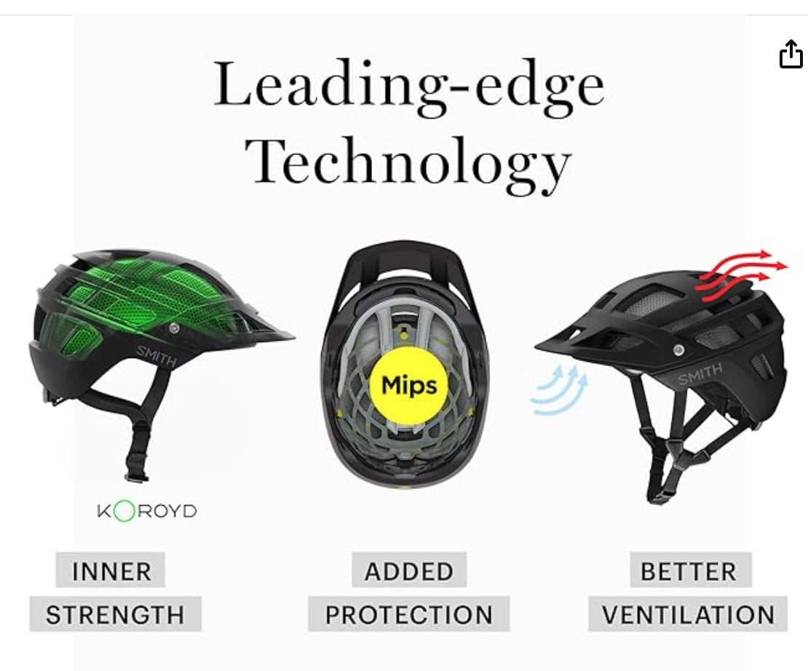

The SMITH Forefront 2 MTB Helmet is a game-changer in the world of mountain biking accessories. This helmet is not just a piece of safety gear, it's a must-have for any serious mountain biker. 

Firstly, the SMITH Forefront 2 MTB Helmet is a product of Smith Optics, a company renowned for its award-winning designs. This helmet is the next generation of their acclaimed Forefront mountain bike helmet, and it's designed to protect you from all angles - front, back, and sides.

But it's not just about safety. The SMITH Forefront 2 MTB Helmet is also designed for comfort and convenience. It's lightweight, weighing just 13.5 oz. for a medium size, and it's designed to fit comfortably on your head.

The helmet is also designed to work with [MTB goggles or sunglasses](https://mtbnz.org/best-cycling-sunglasses/), venting warm air to prevent your lenses from fogging up. This means you can maintain clear vision even in less-than-ideal conditions. Plus, the visor is goggle-friendly and offers a wide range of adjustments.

However, it's worth noting that while the SMITH Forefront 2 MTB Helmet has many premium features, it's not a value leader. The helmet is priced at $240, which is on the higher end of the spectrum for [mountain](https://mtbnz.org/best-mountain-bike-helmets/) [bike helmets](https://mtbnz.org/best-mountain-bike-helmets/).

## 2\. Shimano PD-M520 Pedals

<figure>

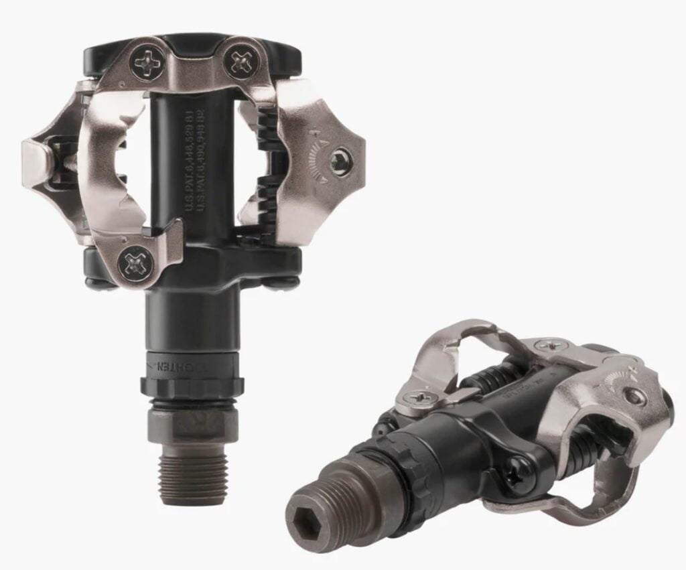

<figcaption>

MTB pedals optimize the transfer of energy from your legs to the pedals, giving you that extra oomph when you need to power through climbs or accelerate on flat stretches.

</figcaption>

</figure>

- Your connection to the bike is crucial, and that's where MTB pedals step in. These bad boys offer a secure and efficient link between your feet and the bike, enhancing your control and power transfer.

[Check Price on Amazon](https://amzn.to/3GbIu6t)

The Shimano PD-M520 MTB pedals are known for their incredible performance and durability. These pedals feature a double-sided entry system, which means you can easily clip in and out of the pedals from either side. This feature is perfect for those tricky mountain biking situations where you need to quickly disengage from your bike.

One of the standout features of the Shimano PD-M520 MTB pedals is the adjustable tension system. This system allows you to fine-tune the release tension to your preference, giving you the perfect balance between security and ease of use. Whether you're a seasoned mountain biker or just starting, you'll appreciate the ability to customize the feel of your pedals to match your riding style and skill level.

- The PD-M520 pedals are built with a sealed cartridge bearing spindle, which keeps out dirt, mud, and water, ensuring smooth and consistent performance even in the harshest conditions. You'll be amazed at how these pedals can withstand the test of time and keep you riding confidently on the trails.

What surprised me the most about these pedals is how incredibly lightweight they are, weighing in at just 380 grams per pair. This lightweight design ensures that you won't be weighed down on the trails, allowing you to ride faster and more efficiently. Plus, the compact design of these pedals means they won't take up much space on your bike, leaving you with more room for other essential mountain bike accessories.

The Shimano PD-M520 MTB pedals offer exceptional value for money. These high-quality pedals deliver top-notch performance and durability at a fraction of the cost of other high-end mountain bike pedals. You'll be hard-pressed to find a better deal on such a reliable and well-designed set of pedals.

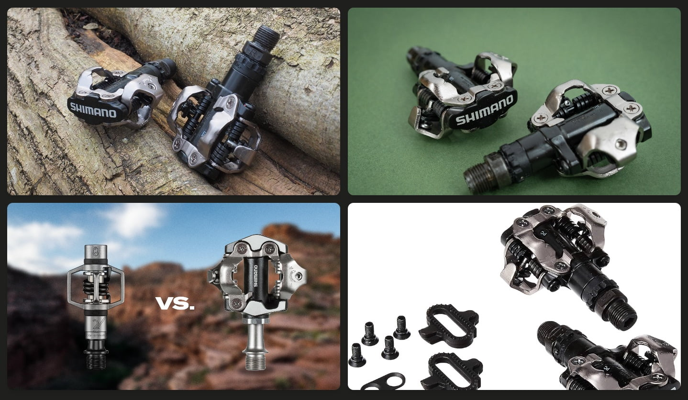

When compared to other Shimano models, the Shimano PD-M520 pedals are similar in performance to the more expensive [Shimano XTR M9120](https://amzn.to/49PcYsI) and [Shimano M530 pedals](https://amzn.to/3QRTQRT), but they lack the mini platform surrounding the clipping mechanism found in the M530 model. And also, the Shimano XTR M9100 Race pedals are lighter and have a larger platform, but they are also significantly more expensive.

## 3\. Fox Racing Ranger Mountain Bike Glove

<figure>

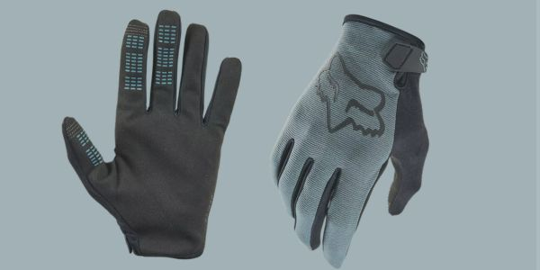

<figcaption>

MTB gloves are a must-have accessory for any serious rider.

</figcaption>

</figure>

- MTB gloves not only provide a layer of protection against abrasions and blisters but also offer a crucial grip enhancement, ensuring your hands stay firmly in control.

[Check Price on Amazon](https://amzn.to/47BUHxa)

You know you've found something special when an accessory piece seamlessly becomes an extension of your riding experience. If you're serious about your mountain biking adventures, these gloves are a non-negotiable addition to your kit.

I'll tell you why.

First off, the comfort. The moment you slip your hand into the Fox Racing Ranger Glove, you'll notice the difference. The glove is made from a blend of polyester and polyamide, which gives it a soft, flexible feel. It's like a second skin, but better. The fabric is breathable, keeping your hands cool and dry even during the most intense rides.

But comfort is just the beginning. The Fox Racing Ranger Glove offers unparalleled protection. The double-layer Clarino palm is both durable and shock-absorbent, protecting your hands from the rough and tumble of the trail. The gloves also feature conductive threads on the thumb and index finger, allowing you to use your touchscreen devices without removing your gloves. No more fumbling with your gloves when you need to check your route or take a quick photo.

And let's not forget about style. The Fox Racing Ranger Glove comes in a variety of colors, so you can match your gloves to your bike, your helmet, or your mood. The sleek design and Fox Racing logo give the gloves a professional look that says you're serious about your sport.

But don't just take my word for it. [Try the Fox Racing Ranger Mountain Bike Glove](https://amzn.to/46pnKmw) for yourself. Once you've experienced the comfort, protection, and style of these gloves, you'll wonder how you ever rode without them. Trust me, this is one mountain biking accessory you don't want to miss out on.

- Durability is where the Ranger truly shines. Trail after trail, rock after rock, these gloves held up like champions. The tough construction and reinforced palms shrugged off abrasions and kept my hands shielded, even in the most demanding conditions. It's the kind of reliability that gives you the confidence to push your limits without worrying about your gear.

The Fox Racing Ranger MTB Gloves offer excellent value for money, especially when considering their performance, fit, and quality. Priced between $15-$25, they are both comfortable and durable, providing a great balance between cost and quality. They also feature touchscreen compatibility, which is a nice bonus.

[Buy on Amazon](https://amzn.to/46pnKmw)

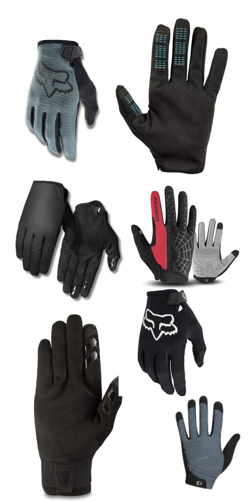

Several mountain biking gloves in the market are comparable to the Fox Racing Ranger gloves in terms of durability. The [Fox Racing Defend gloves](https://amzn.to/47LTmnc), for instance, are designed with durability in mind, featuring D3O® impact absorbing armor, durable fabrics, and TPR plated armor.  
  
Another example is the [Giro DND gloves](https://amzn.to/3sOUTdt), which are known for their durability and toughness, featuring a reinforced palm and flex zones at the knuckles for added longevity.  
  
The [Dakine Covert gloves](https://amzn.to/3QKFx1A) also offer durability with a synthetic suede palm that's designed to resist wear. These gloves, like the Fox Racing Ranger gloves, are designed to withstand the rigors of mountain biking and offer a balance of comfort, protection, and durability.

## 4\. [Smith Wildcat Sunglasses](#)

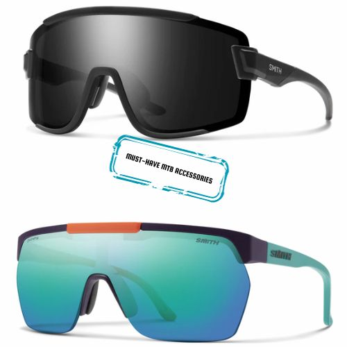

- When you're tearing down a trail, the last thing you want is dust, debris, or harsh sunlight messing with your vision. The Smith Wildcat Sunglasses offer full coverage and a wraparound design that keeps your eyes safe and secure.

- The Smith Wildcat Sunglasses feature ChromaPop lenses. These lenses enhance contrast and natural color to make the details of the trail pop. Whether you're riding in bright sunlight or low light conditions, these glasses ensure you see every rock, root, and rut.

[Check Price on Amazon](https://amzn.to/47pF0cC)

As an avid mountain biker, having [high-quality sunglasses](https://mtbnz.org/best-cycling-sunglasses/) is essential for protecting your eyes and seeing the trail ahead clearly. And let me tell you, these sunglasses really shine!

From the moment I slipped them on, it was clear that these shades were more than just a _cool MTB accessory_ – they were a performance powerhouse. The lenses are extremely clear and seem to make colors pop. They also have an adjustable nose piece and non-slip temple pads, so they stay securely in place even when bombing down rocky descents. No more having to push my sunglasses back up my sweaty nose!

- The Wildcats compare well to premium MTB sunglasses from Oakley and 100% in terms of performance and features like interchangeable lenses and anti-fog coatings.

But one of my favorite things about the Smith Wildcats is how well they handle changes in light conditions. The photochromic lenses adjust quickly from low light to bright sunlight. So whether you're riding through dense woods or open meadows, you can trust these sunglasses to keep your vision crisp. No more squinting!

I've tested them in all conditions - bright sun, overcast days, and even light rain. They continue to impress me with their versatility and durability. After many miles on the trail, the lenses still look brand new with no scratches or damage.

**_About the fit_**. The Wildcat hugs your face without feeling restrictive. The lightweight design adds to the comfort, making them barely noticeable during those long rides. They feature a flexible frame that fits a variety of face shapes, an adjustable nose piece, and a design that prevents contact at pressure points on the head

I've tried several other MTB sunglasses, and while some come close, the Wildcat remains in a league of its own. Its combination of style, performance, and durability sets it apart. The adjustable nose piece and temple arms contribute to a customizable fit that many competitors struggle to match.

[Buy on Amazon](https://amzn.to/47pF0cC)

Compared to other popular MTB sunglasses, the Smith Wildcat Sunglasses stand out for their lens quality, comfort, and performance. They are hands down best all-around cycling sunglasses, performing well across all test metrics. They are also stand out for their stylish design and compatibility with helmets.  
  
However, they are not without their drawbacks. The high price point is a downside, and changing the lenses can be a bit of a hassle.  
  
However, despite these minor issues, the Smith Wildcat Sunglasses will be a worthwhile MTB accessory for most for mountain bikers.

Benefits of Mountain Biking Glasses

Wearing the [best MTB sunglasses](https://mtbnz.org/best-cycling-sunglasses/) while mountain biking offers several benefits:

1. **Optical Protection**: Sunglasses protect your eyes from potential damage caused by overhanging branches, debris, dust, and other materials that can be kicked up while riding.
2. **Improved Vision**: Sunglasses designed for mountain biking can enhance your vision by reducing glare, enhancing contrast, and providing clear vision in varying light conditions. Some sunglasses come with photochromic lenses that automatically adjust to changing light conditions, which is beneficial for riders who frequently switch between sunny and shaded areas.
3. **UV Protection**: Sunglasses shield your eyes from harmful UV rays, which can cause issues such as cataracts and macular degeneration.
4. **Enhanced Performance**: By reducing eye strain and fatigue, sunglasses can help you stay focused and ride longer, thereby improving your overall performance
5. **Fog Reduction**: Modern MTB sunglasses are designed to allow enough airflow to reduce fogging, which is a common issue for many riders.

## 5\. [Arundel Mandible Water Bottle Cage](#)

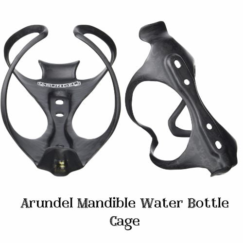

- If you're looking for must-have mtb accessories, don't overlook the Arundel Mandible Water Bottle Cage. This is not just a bottle cage; it's a piece of engineering brilliance that's designed to keep your hydration secure, no matter how rough the trail gets.

[Check Price on Amazon](https://amzn.to/3SYIIFP)

- #### Why You Need it
    
    A water bottle cage allows you to carry a water bottle on your bike, providing easy access to hydration during your ride.

I know you might be thinking, "Why do I need a high-end bottle cage like the Arundel Mandible?" Well, as any seasoned mountain biker will tell you, losing your water bottle halfway down a descent is not just annoying; it can also be dangerous. The Arundel Mandible ensures that this doesn't happen, giving you one less thing to worry about when you're tackling those challenging trails.

This water bottle cage is designed with two slim pieces that grasp your water bottle like jaws, securely holding your bottle in place even on the roughest terrains. No more worrying about your water bottle bouncing out of the cage when you're tackling those challenging trails!

But don't let the strong grip worry you. While it's true that the Arundel Mandible holds your bottle tightly, it's also designed to allow easy access to your hydration. The flexible and curved mandible arms expand around the base of the bottle, allowing it to slide in easily from the top. And when you need a drink, a firm but consistent pull releases the bottle.

What's more, this bottle cage is made from carbon fiber with a foam core, which means it's incredibly lightweight. You won't even notice it's there! But don't let its low mass fool you. This cage has a high-grip design that ensures your water bottle stays put. And like many carbon cage designs, it features a bottom tab to prevent the bottle from sliding downwards, wrapping arms to cradle your bottle, and a lip to lock the bottle in place.

And if you're worried about compatibility, don't be. The Arundel Mandible Water Bottle Cage comes with two sets of mounting holes, making it easy to install on any mountain bike.

The Installation is a piece of cake too, thanks to the included stainless steel mounting bolts. Just make sure to check your frame's bottle cage mounts first, as older bikes may need an adapter. But most [modern mountain bikes](https://mtbnz.org/best-hardtail-under-2000-comparison-of-7-top-mtbs/) have standard mounts ready for awesome upgrades like this.

The Arundel Mandible is one of the best bottle cages that money can buy; thanks to its unmatched grip, low weight, durability, and looks. However, it does demand a premium price. More affordable options like the [Elite Custom Race](https://amzn.to/3GbYLs5) or the[Tacx Ciro Bottle Cage](https://amzn.to/3GczTR6) offer great alternatives depending on your priorities.  
  
The [Elite Vico Carbon cage](https://amzn.to/46ohprj) is slightly lighter than the Mandible, weighing 27.9 grams. However, it struggles to hold heavier 750ml bottles securely, unlike the Mandible, which is known for its strong grip.

## 6\. [NiteRider Lumina 1100 Boost Headlight](#)

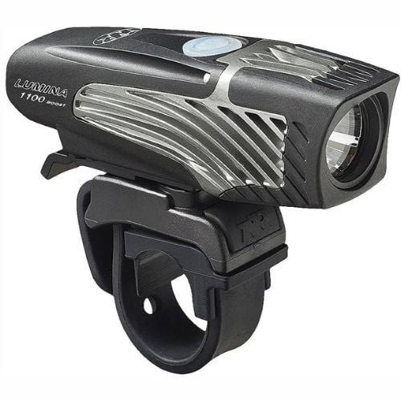

- The NiteRider Lumina 1100 Boost doesn't mess around when it comes to brightness. With a whopping 1100 lumens, this bad boy turns night into day, revealing every twist, turn, and obstacle in your path. It's like having a miniature sun attached to your bike.

[Check Price on Amazon](https://amzn.to/40MXjG9)

#### Why a Headlight is a Must-Have MTB Accessory

A headlight is an absolute game-changer when it comes to must-have mountain biking accessories! It not only helps you see the path ahead but also makes you visible to others. It's a two-way street – literally! Avoid collisions and let others know you're tearing up the trails.

Mountain biking is all about embracing the elements, and the Lumina 1100 Boost is up for the challenge. This robust [MTB headlight](https://mtbnz.org/best-mountain-biking-lights/) is weather-resistant, ready to tackle rain, mud, or whatever surprises Mother Nature throws your way. Your adventures won't be dictated by the weather forecast.

One of the standout features of this headlight is its Boost mode, which pumps out up to 1100 lumens. This mode is accessed via a double tap of a button and is perfect for situations where you really need an extra boost of light. By default, the light cycles through low (225 lumens), medium (450 lumens), and high (900 lumens) settings.

In terms of battery life, this headlight offers impressive run times. You can expect about 1 hour at 1100 lumens in Boost mode, 1.5 hours at 900 lumens in High mode, 3 hours at 450 lumens in Medium mode, and 6 hours at 225 lumens in Low mode.

- The Lumina 1100 is designed with the user in mind. It comes with a low battery indicator and is micro USB rechargeable, ensuring you're never left in the dark. 
- The headlight is designed with a well-seated rubber cover over the charging port, providing good sealed protection against the elements.
- It comes with a **_Travel Lock Out Mode_** feature, designed to save battery power by preventing the headlight from accidentally turning on while in storage.

#### How Much Should You Spend on a Headlight?

If you’re only riding around your neighborhood, an inexpensive light will do fine. Actually, the street lights do most of the work, and your headlight is just to “be seen.” However, be advised that a lot of [$20 MTB headlights](https://amzn.to/47OKsFP) don't do a great job of illuminating hazards like broken glass when you’re pedalling fast.  
  
If you’re hoping to ride fast through the woods at night, you’ll need more than the $20 headlight. You’re going to need one of the more serious lighting systems like the NiteRider Lumina 1100 or even the [NiteRider Lumina Dual 1800](https://amzn.to/47w1k4s). These can range in price from about $60 to better than $250. 
  
I personally opted for a mixture of lighting systems. For trail stuff, I have a helmet-mounted [Light & Motion Vis Pro 1000](https://amzn.to/49LxSJ7), which offers high power, fast charging, and comes with three helmet/bar mount options included.  
  
In addition, I carry an inexpensive [Magicshine MJ 900](https://amzn.to/3MV3wde) on the handlebars. This is a wonderful low-cost light. It offers a maximum output of 1500 lumens and has multiple beam and brightness settings designed for various riding scenarios, including mountain, road, and trail riding.

## 7\. [Muc Off Puncture Plug Repair Kit](#)

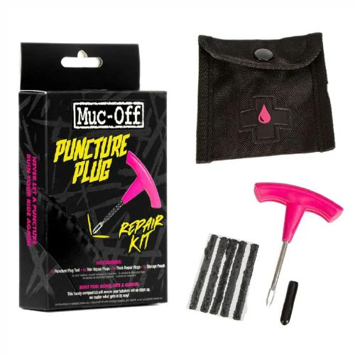

- The Muc Off Puncture Plug Repair Kit is one of those must-have MTB accessories that can save your ride and get you back on the trails in no time. It is designed to repair tubeless tire systems when the hole is too large for the sealant to cope.

[Check Price on Amazon](https://amzn.to/3QN3yoR)

#### [Why It is a Must-Have MTB Accessory](https://amzn.to/3QN3yoR)

If you get a puncture and don't have a repair kit, you may find yourself stranded. Depending on where you are and the time of day, you might have to call a taxi or a friend to pick you up, which can be inconvenient and potentially expensive. If you're far from home or in a remote area, you might even have to walk your bike back, which can be a long and exhausting process.

The Muc Off Puncture Plug Repair Kit is a trailside essential that every mountain biker should carry. As an experienced MTB rider, I never hit the trails without this compact yet durable tubeless tire repair kit stashed in my pack or saddle bag. It is a moderately priced solution to big punctures in tubeless systems.

Here's why it's earned a permanent spot among my must-have MTB accessories:

1. **It can plug holes up to 6-7mm wide** - This kit carries plugs in two sizes, thin and thick, allowing you to tackle a variety of punctures. For most MTB tire gashes caused by rocks or debris, it has you covered.
2. **The reamer preps the hole for a tight seal** - No need to roughen edges with a knife or your bare hands. The stainless steel puncture plug tool doubles as a reamer, quickly clearing debris and scuffing the hole so plugs adhere securely.
3. **Plugs sit flush inside knobby MTB tires** - Unlike road tires, MTB knobs and grooves conceal plug ends, preventing them snagging on rocks or roots once installed. The repair is reliable and unobtrusive.
4. **It's incredibly easy to use** - Simply push the reamer end into the gash, twist back and forth, then insert your plug of choice and snip off any excess. The whole process takes just minutes, even for beginners.
5. **The kit is lightweight and packable** - Weighing just 32g, the tough Cordura pouch fits in jersey pockets or packs without weighing you down. It's always there when you need it, on rides of any length.

The kit includes a 2-in-1 puncture plug/reamer tool with a tough and durable handle, making it easy to repair punctures on the go. It also comes with 10 refill plugs (5x thin and 5x thick) to ensure you're covered for a variety of different-sized punctures.  All of these components are packed together in a handy storage pouch, making it easy to carry with you on your rides.

#### If you take your MTB rides seriously, the Muc Off Puncture Plug Repair Kit deserves a spot in your repair arsenal. Flat tires are no joke out on the trail, but this crafty plugging system gets you rolling again in no time. Add it to your must-have mountain bike accessories today!

[Buy it on Amazon](https://amzn.to/3QN3yoR)

## 8\. [FIFTY-FIFTY Bike Bar Ends](#)

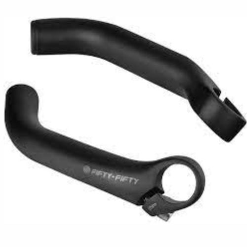

- The FIFTY-FIFTY Bike Bar Ends are a fantastic addition to your mountain biking gear. They're strong, durable, lightweight, and ergonomically designed for comfort and reduced fatigue.They feel great in the hands, and the anodized black finish is sleek, tough, and resistant to scratches.

[Check Price on Amazon](https://amzn.to/47pWkho)

#### [Why It is a Must-Have MTB Accessory](https://amzn.to/47pWkho)

Bar ends are small extensions that go beyond the end of your handlebars, providing extra leverage when riding your bike. They offer additional hand positions, allowing you to shift your weight forward during uphill climbs and reduce the risk of carpal tunnel syndrome by offering a different hand position during long rides.

These bar ends are a game-changer for any mountain biker. Made from 6061 T6 aluminum alloy, they're optimized for lightweight and high-strength. This means they're strong, durable, and won't add unnecessary weight to your ride.

The FIFTY-FIFTY Bike Bar Ends are also designed with an ergonomic shape. This design can help reduce vibrations and minimize hand, arm, and shoulder fatigue during long rides. This is a feature that is shared with other bar ends like the [Profile Design's Brief](https://amzn.to/3uyzntQ) and [Boxer Bar Ends](https://amzn.to/3usGwvR), which also aim to improve leverage and reduce hand fatigue by increasing hand position versatility.

One of the best things about the FIFTY-FIFTY Bike Bar Ends is their versatility. Whether you're planning on rock climbing, trail riding, bunny hopping, or doing freeride/downhill, these bar ends can help enhance your capabilities and make your experience even more exciting.

But don't just take my word for it. Customers who have used these bar ends have nothing but praise for them. They love the high quality, the sleek design, and the fact that they don't scratch easily.

#### If your bike didn’t come with bar-ends already in place, consider buying a pair. Although principally designed for additional leverage while climbing, the bar-ends give you numerous places to grasp the handlebar when hand and wrist fatigue begin to set in.  
  
Of course, when my hands are on the bar-ends instead of the handlebar grips, I can’t reach the brakes, so I don’t use them in traffic or when the trail gets tricky. Choices include all sorts of colors, shapes, and the lightness (and expense) of exotic metals.

[Buy it on Amazon](https://amzn.to/47pWkho)

## 9\. [Garmin Edge® 130 Plus MTB Computer](#)

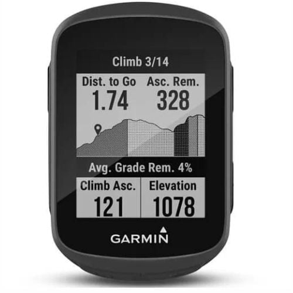

- The Garmin Edge® 130 Plus is a small but mighty device. Its diminutive size makes it one of the smallest bike computers available on the market, but don't let that fool you. This little gadget is packed with features that make it a versatile companion for any ride, whether it's a daily commute or a 100km adventure.

[Check Price on Amazon](https://amzn.to/3GvW8lf)

#### [Why It is a Must-Have MTB Accessory](https://amzn.to/3RdInOd)

Mountain bike trails can be complex, with numerous twists, turns, and intersections. Without a GPS device, it's easier to lose your way on unfamiliar trails, which can be dangerous and time-consuming. Additionally, in case of an emergency or injury, a GPS device can help you share your location with others, making it easier for them to find and assist you.

A GPS bike computer is not only a fun MTB accesspry but also gives you lots of useful information. Even inexpensive models ($20) will tell you a lot more than just how fast you’re going.

These little gems also tell you how long you’ve been riding, what your maximum speed was, your average speed for the trip, how long the trip was, how many miles you’ve accumulated on your bike, and what time it is.

For a few dollars more, the GPS bike computer will display your cadence (RPM of your pedals), your present altitude, your total altitude gain/loss, and your heart rate. Not only that, but by pre-setting the limits of your desired heart-rate training zone, you can see how much pedaling time was spent below, in, or above your target heart rate. Pretty slick.

You'll love how compact and lightweight the 130 Plus is. It practically disappears on your handlebars, so it never feels bulky or gets in the way, even when navigating technical trails.

- The device offers MTB dynamics, which record your mountain bike metrics including Grit (overall difficulty), Flow (how well you maintained speed), and Jump metrics (jump count, jump distance, hang time, and jump speed). These features allow you to analyze your performance in detail and identify areas for improvement.
-  It is incredibly user-friendly, with a power button on the left-hand side, menu and scrolling buttons on the right, and a start/stop button and back button on the bottom. All the buttons have a good click and depress nicely, so they are easy to operate even with gloves on.
- Garmin Edge® 130 Plus connects to GPS, GLONASS, and Galileo satellite signals, ensuring accurate tracking of your rides. It also features a barometric altimeter and accelerometer. Bluetooth and ANT+ connectivity mean that all manner of devices and accessories can be connected to the Edge 130 Plus, from smartphones to heart rate monitors and smart turbo trainers.
- It is considerably more compact than almost any other GPS computer. Measuring just 41mm x 63mm x 16mm, it’s around 25 percent smaller than the Garmin 530, and it’s also feather-light, tipping the scales at just 34g

One of the standout features of the Garmin Edge® 130 Plus is its performance monitoring capabilities. It provides dynamic performance insights such as VO2 max, heart rate, and more. This means you can track your fitness progress and push your limits with precision.

#### When compared to other GPS cycling computers on the market, the Garmin Edge 130 Plus stands out for its compact size, feature set, and affordability. For example, the [Garmin Edge 530](https://amzn.to/3MQQuxC) and [Wahoo BOLT (V2)](https://amzn.to/49P3rS9) are considered the best all-around bike GPS devices, but they are more expensive and have larger form factors. The [Lezyne Mega-XL](https://amzn.to/40Ob9bi) is another budget-friendly option, but it is larger than the Edge 130 Plus and does not have full mapping capabilities.

[Best Bike Computer for Touring](https://amzn.to/47pWkho)

## 10\. [GIYO Mini Bike Pump](#)

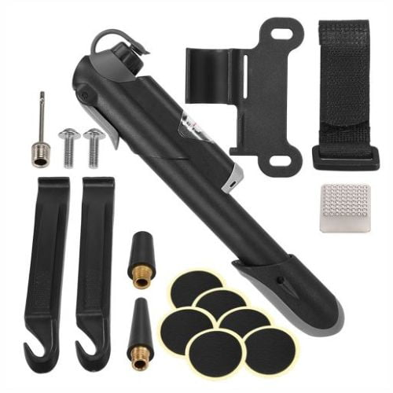

- Among the must-have MTB accessories, a reliable, compact, and efficient bike pump is a non-negotiable. And when it comes to bike pumps, the GIYO Mini Bike Pump stands out as a top choice.

[Check Price on Amazon](https://amzn.to/3GbwEsZ)

#### [Why It is a Must-Have MTB Accessory](https://amzn.to/3GbwEsZ)

A bike pump allows you to maintain optimal tire pressure, reducing the risk of flats and ensuring better performance on the trails. Getting stranded far out on the MTB trail with a flat tire and no way to inflate it leaves you vulnerable and needing rescue. This could be dangerous if you are alone without cell service or late in the day when daylight is fading. In this respect, a bike pump is not just a must-have MTB accessory, it's a safety essential.

The GIYO Mini Bike Pump is a portable, compact bicycle pump that's perfect for on-the-go inflation needs. It's lightweight and sturdy, making it easy to carry on your mountain biking adventures.

But despite its small size, it packs a punch when it comes to performance. It's capable of delivering a high volume of air quickly, reaching about 65 psi in under a minute, and about 100 psi in under two minutes. This rapid inflation capability can be a real lifesaver when you're out on the trails and need to fix a flat tire quickly.

The pump is automatically compatible with both Presta and Schrader valves, which means you don't have to worry about valve compatibility. This feature alone makes it an essential MTB accessory that can cater to different types of bikes.

In terms of durability, the GIYO Mini Bike Pump doesn't disappoint. It features a high-quality alloy body with durable and precise parts, ensuring it can withstand regular use and last a long time.

#### Riding with underinflated tires can compromise your bike's handling, making it harder to control and increasing the risk of accidents. Proper tire inflation is crucial for optimal traction and control, especially on challenging terrains

[Best MTB Bike Pumps for the Money](https://mtbnz.org/best-bike-pumps/)

## 11\. [Ultraverse Bike Inner Tube](#)

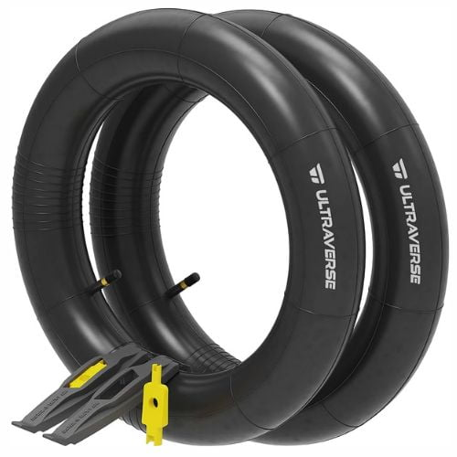

- The Ultraverse Bike Inner Tube is a must-have mtb accessory for trail riding. Its durable construction, easy installation, and compatibility with various tire sizes make it an essential addition to your mountain biking gear.

[Check Price on Amazon](https://amzn.to/3QQSaYX)

#### [Why It is a Must-Have MTB Accessory](https://amzn.to/3GbwEsZ)

Someday, when it’s least convenient, you’ll snakebite a tube on a poorly bunny-hopped rock, or granite curbstone. Properly done, the tube will be history. Patches won’t help. This is where the spare tube is worth the trouble. Again, leaks on bike tubes are often hard to find, especially when you're seated among the ferns or rocks of critter and insectdom. It'd be better to check the tire for the culprit, remove it, mount up the spare tube, pack up the leaky one and fix it when you get home.

Having a spare inner tube on hand is an absolute must for hitting the trails. And I've found the [Ultraverse tube](https://amzn.to/3QQSaYX) to be one of the best out there!

- The Ultraverse Inner Tube is incredibly lightweight and doesn't take up much space. Pop it in your backpack, and you won't even notice it's there until you need it. 

Made from butyl rubber, the Ultraverse Bike Inner Tube is known for its excellent resistance to ozone cracking, weathering, and aging. This means you can trust it to last through countless rides, even in harsh conditions.

And installation couldn't be easier thanks to the included tire levers. Just pop them under the bead of the tire and you'll have that new tube in place with barely any effort.

Plus, Ultraverse offers the tubes in tons of sizes to fit most mountain bike wheels and tires. The sizes available include 26, 27.5 X 1.75/1.95/2.10/2.125-inch bicycle tires, and comes with both Presta and Schrader valves, making it suitable for mountain and trail bikes, cruisers, MTB, and all-terrain bikes.

- Make sure to check the type of valve (Presta or Schrader) on your bike's wheel, as Ultraverse Bike Inner Tubes are available with both valve types.

#### I never hit the trails without an Ultraverse tube in my pack now. Having the reassurance that I can quickly get rolling again if I get unlucky with a flat makes all the difference. And the price is so reasonable too - they make great inexpensive insurance for keeping the mountain biking good times going all day!

[Buy it on Amazon](https://amzn.to/49P8Vwd/)
