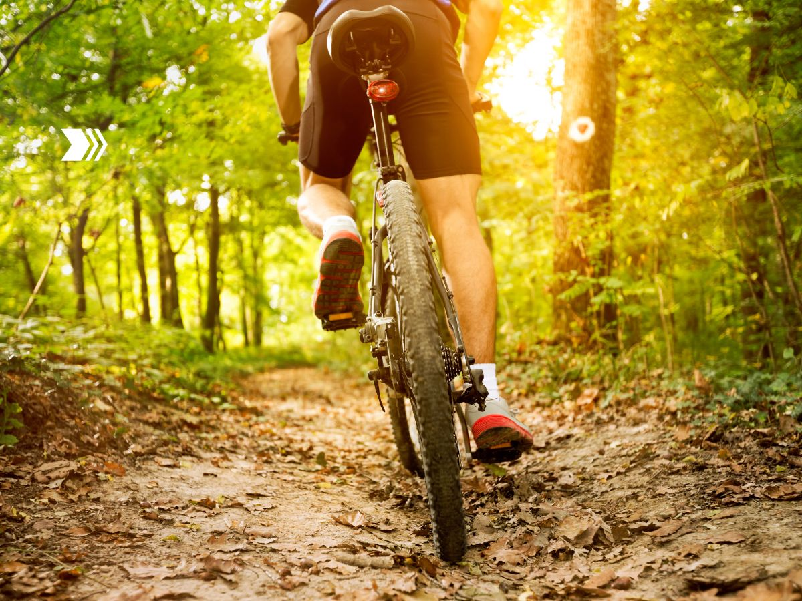
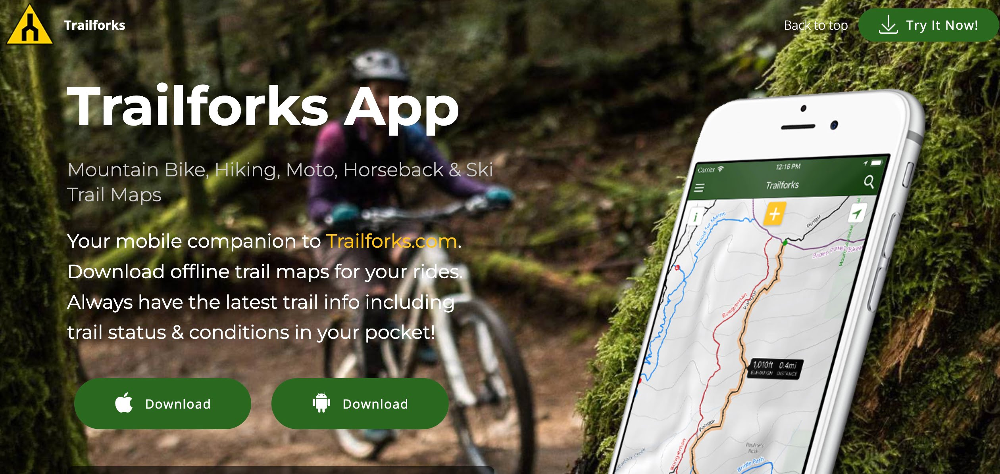
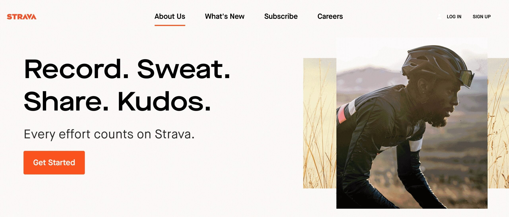
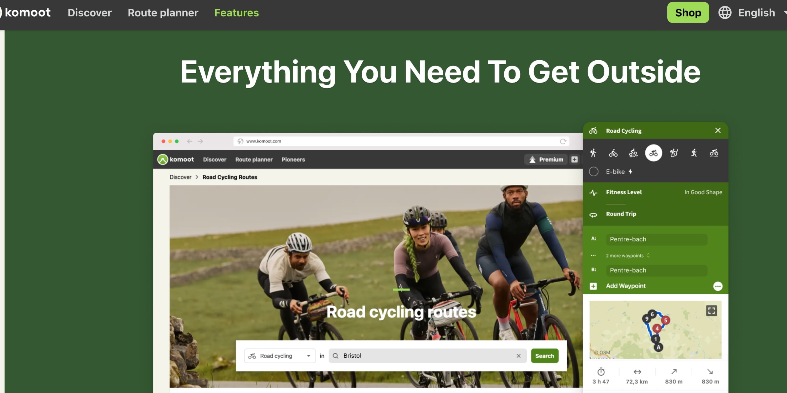
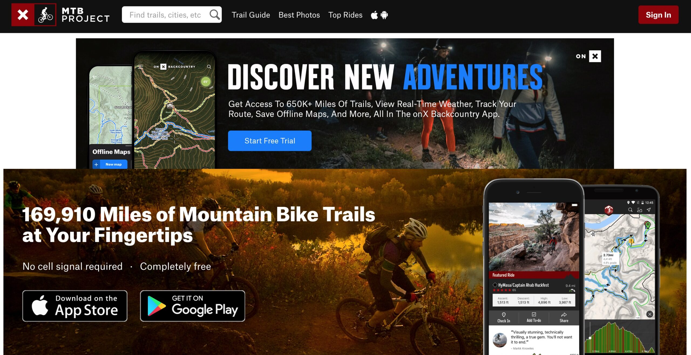
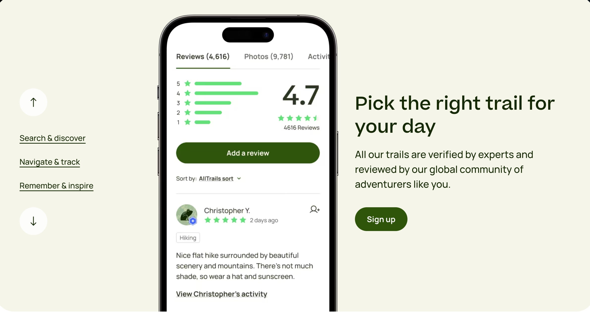
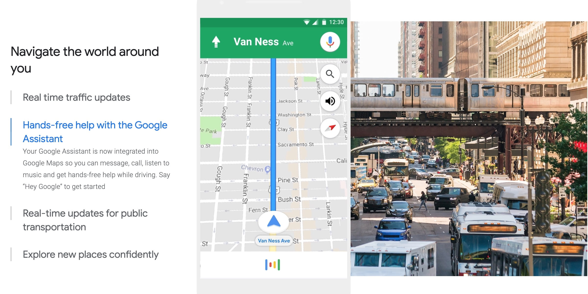
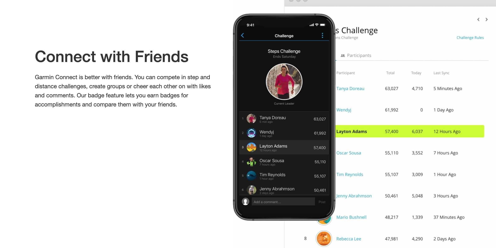
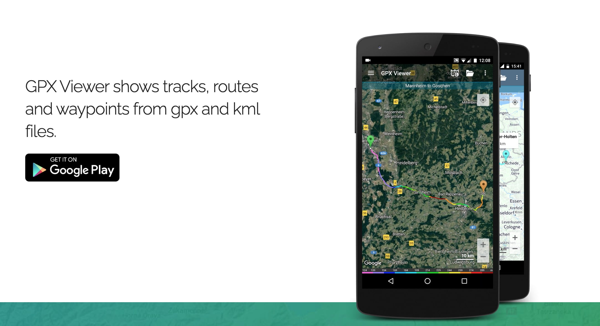

If you're as passionate about mountain biking as we are, you know that the thrill of the ride is only half the story. _The other half?_ **Finding those hidden gems of trails that take your breath away, both literally and figuratively.**

But how do you uncover these off-the-beaten-path adventures? Well, in this digital age, there's an app for that. Actually, there are several.

Welcome to our guide on the "Best Apps for Mountain Biking Trails". We've done the legwork (or should we say, pedal work?) to bring you the top apps that will transform your mountain biking experience.

Whether you're a seasoned pro looking for a new challenge or a newbie eager to hit the trails, these apps will help you discover new routes, track your performance, and even connect with other mountain biking enthusiasts.

## Trailforks

First up is [**Trailforks**](https://www.trailforks.com/apps/map/), a mountain biking app that's made by riders, for riders. With a database of over 300,000 trails worldwide, Trailforks helps you discover new trails wherever you are.

The app provides detailed trail maps, user-generated trail conditions, and even information on local services like bike shops. Plus, with features like offline maps and GPS tracking, you can navigate trails with confidence, even in remote areas.

Trailforks is an excellent mountain bike trails app for those looking to discover new trails, track their rides, and contribute to the mountain biking community.

> [Trailforks](https://www.trailforks.com/apps/map/) claims to offer the largest mountain bike trails database in the world.

### Why Trailforks is One of the Best Apps for Mountain Biking Trails

1. **Trail Information**: Trailforks provides comprehensive information on mountain biking trails, including current status and rideability. This helps users find suitable routes and plan their rides effectively.
2. **Ride Recording**: The app allows users to record their rides, providing valuable data on their performance and progress. This feature is easy to use, with a simple interface that allows users to start recording by pressing the yellow button on the map screen.
3. **Exploration**: Trailforks encourages users to explore new trails by offering detailed maps and trail information. This feature helps users discover new routes and expand their mountain biking experiences.
4. **Community Contribution**: The app allows users to give back to the mountain biking community by adding photos, writing ride logs, and sharing their experiences. This feature helps improve the overall quality of trail information and fosters a sense of community among users.

You can use it both online or offline, by downloading a region to plan your route. Being expressly designed for riders, it offers automatic trail routing, starting from your location to where the track starts.

One good thing about it is the low power consumption, so your Smartphone battery won’t run out during long rides.

Apart from biking, you can use it for hiking, motorcycling, horseback riding and ski trails. Simply switch the map context based on your selected activity.

The 290,000+ trails in the Trailforks database are likely to keep growing since users can contribute additional data. If approved by local trail associations, the data is curated in the app.

During trail navigation, you’ll easily see your GPS location on the map.

It also features trail and route elevation profiles so you can view grades of climbs and descents.

In terms of accuracy, Trailforks may have an edge over Strava when it comes to mountain biking trails. The app's focus on providing comprehensive trail information and its active user community contribute to the accuracy and reliability of its data. Additionally, rides recorded on Trailforks show up faster compared to Strava, which often experiences a delay in importing data

## Strava

Strava is a must-have app for any mountain biker looking to track their rides and improve their performance. With Strava, you can record your rides, analyze your performance, and even compete with other riders on virtual leaderboards.

<figure>

<figcaption>

Strava is one of the best apps for mountain bikers

</figcaption>

</figure>

[Strava](https://www.strava.com/mobile) is a social fitness network that allows you to track your activities via GPS on your phone or dedicated device. It is a popular app among mountain bikers for several reasons. It offers a range of features that can enhance your biking experience, from tracking your rides to discovering new trails. 

Many prominent cyclists rank it at the top of their cycling app lists.

Some of the key features that make Strava great for mountain biking include:

- GPS tracking of your rides to record distance, speed, elevation gain, and see your route on a map.
- Segment feature that allows you to compete on specific trail sections for time.
- Analysis of your performance over time so you can track your fitness.
- Social aspect to follow and compete with friends.
- Large database of mountain biking trails already mapped out as segments.

One of the best parts of Strava is the huge database of trails already mapped out. You can explore trails in your area or destinations you are traveling to. See where local riders are riding and get recommendations for new places to check out.

Another particularly valuable feature is that you can network with other MTB riders, compare performances, and even join challenges. As you share photos from your rides and follow friends, you’re sure to be motivated in your cycling adventures. Even if you’re going on solo mountain biking rides, you won’t feel like you’re all alone.

Best of all, you can discover the best places to ride with locals.

Additionally, Strava has safety features like crash detection and live location sharing so others can track your ride in real-time. This provides peace of mind when riding solo in remote areas.

While Strava offers many benefits, it's important to use the app responsibly. Some mountain bikers have raised concerns about the potential for Strava to encourage reckless riding in pursuit of personal records or leaderboard positions, which can put other trail users at risk and damage trails. It's important to always prioritize safety, etiquette, and fun over Strava times, and to respect the work of trail builders.

Strava vs Trailforks App

While both Trailforks and Strava are popular apps for tracking outdoor activities, they serve different purposes and cater to different user needs. Strava is primarily focused on logging effort and distance, making it a suitable choice for tracking various fitness activities, including running, cycling, and swimming.  
  
On the other hand, Trailforks is specifically designed for mountain biking, offering detailed trail information and specialized features for this activity.

https://www.youtube.com/embed/\_lcgfvgG4us

## Komoot

Komoot is a popular route planning and navigation app designed for outdoor enthusiasts, including mountain bikers. It offers a range of features that make it one of the best trail apps for mountain bikers:

1. **Tailor-made routes**: Komoot generates sport-specific, topographic routing based on your preferences, such as single tracks for mountain biking.
2. **Offline maps**: You can download planned outdoor adventures and save topographic maps for offline use, ensuring reliable navigation even without internet access.
3. **Turn-by-turn voice navigation**: Komoot provides precise, turn-by-turn voice navigation, allowing you to focus on your ride without constantly checking your device.
4. **Community-driven content**: Komoot's community of users shares their favorite trails, routes, and points of interest, helping you discover new places to ride.
5. **Integration with GPS devices**: Komoot is compatible with various GPS devices, including Garmin, Wahoo, and others, allowing you to sync your routes and tracks easily.
6. **Smartwatch compatibility**: Komoot offers advanced integrations for smartwatches, enabling you to view your routes, record activities, and benefit from outdoor navigation directly from your wrist.

> [Komoot](https://www.komoot.com/) is available in multiple European languages, including Spanish, English, and French.

This app has become quite popular in a short time. It’s likely the most used app in Europe for route planning.

The main use of the app is to trace and discover new routes.

Once you plan a route, you can conveniently use the voice-guided navigation. That frees you up to concentrate on maximum performance during your ride. And you won’t need an internet connection either.

It works well for MTB adventures, road biking, and hiking.

What makes it stand out is the fact that you can plan your route down to the smallest detail. You can check for different routes that suit your activity, including: trails for MTBs, asphalt for bikes, cycle paths for touring, and quiet paths for hiking. You’ll know beforehand exactly what awaits you regarding road type, surface, elevation, difficulty, and distance.

Komoot offers a free version with limited features, while the Premium subscription costs $59.99 per year and includes additional features such as a multi-day planner, personal collections, on-tour weather, sport-specific maps, live tracking, and 3D maps.

The app is available on iOS and Android devices, as well as on desktop computers.

In comparison to Strava Komoot focuses more on route planning, navigation, and exploration, while Strava is geared towards performance data and competition. 

If you're looking for an app that helps you discover new trails, plan routes, and navigate with ease, Komoot is an excellent choice for mountain bikers.

### Is it Worth Paying for Komoot Premium?

Komoot Premium offers several features that can enhance your outdoor adventure experiences. These include a multi-day planner, personal collections, live tracking, on-tour weather updates, sport-specific maps, privileged pricing, worldwide maps and navigation, and 3D maps.

If you’re into long-distance cycling or planning multi-day tours, Komoot Premium can be particularly beneficial. It allows you to plan your route, organize your tours, and stay safe in the great outdoors.

The multi-day trip planner is a standout feature, allowing you to view your entire trip on one screen or itinerary, which can be crucial for long-distance cyclists or bikepackers.

On the other hand, if you’re not planning to use these features extensively, you might not see the value in upgrading to Komoot Premium. For example, if you’re not planning multi-day tours or don’t need the additional features like live tracking or on-tour weather updates, the basic version of Komoot might be sufficient for your needs.

The basic version includes offline maps and voice navigation, and these features will continue to be improved and updated regularly at no additional cost.

## MTB Project

<figure>

<figcaption>

MTB Project is known for its user-friendly interface and focus on legal and sanctioned trails

</figcaption>

</figure>

MTB Project is a comprehensive mountain biking app that provides detailed information on over 77,000 miles of trails worldwide. The app is free to download and use, and it is available for both Android and iPhone devices.

> [MTB Project](https://www.mtbproject.com/mobile-app) offers a comprehensive guide to any trail you want to ride.

MTB Project offers a range of features to help you plan and navigate your mountain biking adventures:

1. **Offline maps**: Downloaded trails work offline, so you can access them even when you're off the grid and without cell reception.
2. **GPS route info**: The app provides full GPS route information, elevation profiles, and interactive features.
3. **Photos and descriptions**: High-resolution photos and detailed descriptions of trails help you get a better understanding of the terrain and features.
4. **User-generated content**: Local experts and users contribute trail information, photos, ratings, and comments, ensuring up-to-date and accurate data.
5. **Trail filtering and sorting**: You can filter trails by difficulty, distance, star rating, elevation gain, and other criteria, as well as sort them by popularity or length.

You’re sure to get the most up-to-date trails and information since it’s all submitted by local riders. The information goes through a review process first before going live. It’s particularly good for riders within the United States.

With this app, you can explore thousands of trails free of charge.

And you won’t get a watered-down map version just because it’s an app. Instead, you get the thoroughness and detail of a printed map. That means full GPS route info, photos, elevation profiles, interactive features, and much more.

In case you need more of a guide, you’ll enjoy the suggested best featured rides. The suggested rides can be near your current location or in areas you search for.

What’s more, local experts provide insights like highlights and challenging features.

## AllTrails

AllTrails is a versatile app that's great for finding and navigating MTB trails. With over 400,000 trails in its database, AllTrails helps you discover new places to ride, whether you're at home or traveling.

<figure>

<figcaption>

AllTrails turns your phone into a GPS tracker, helping you to follow your trail and avoid getting lost

</figcaption>

</figure>

[AllTrails Official Website](https://www.alltrails.com/)

AllTrails allows you to search for trails based on location, interest, skill level, and more. You can find trails that are dog-friendly, kid-friendly, or even wheelchair-friendly, making it a versatile app for all types of outdoor enthusiasts. The app provides in-depth trail information, including reviews, conditions, and GPS driving directions, helping you plan your adventure with ease.

One of the standout features of AllTrails is its navigation capabilities. The app helps you stick to your planned route or chart your own course with confidence.

You can also record your progress on any trail, even when your phone is in airplane mode, allowing you to keep track of your adventures without using data.

For an even more enhanced experience, AllTrails offers a premium subscription called **AllTrails+**.

This service provides additional features like offline maps and wrong-turn alerts, helping you make the most of your time outdoors.

AllTrails+ also allows you to give back to the environment, as a portion of every subscription goes to protecting the wild places we cherish.

### Is AllTrails Pro Worth it for Mountain Bikers?

Many mountain bikers find the AllTrails+ subscription worth it, especially if they hike, backpack, or bike a fair amount in areas without cell service, as it allows them to use the offline maps feature.

- AllTrails Pro provides useful features like offline maps, wrong turn alerts, and route sharing that can enhance the mountain biking experience, especially when riding in remote areas with no cell service.
- Casual mountain bikers or those riding mainly in cell service areas may find the free version sufficient unless they specifically want the offline maps capability.

**The annual subscription fee for AllTrails+ is $29.99**, which is considered reasonable for those who frequently use the app and its features. AllTrails Pro also offers a free 1-week trial, so mountain bikers can test it out before committing to see if the features are worthwhile for their needs.

However, if you don’t see yourself using the premium features often, the free version of AllTrails may be sufficient for your needs.

## Google Maps

<figure>

<figcaption>

Google Maps provides detailed information about your biking route. It shows how flat or steep your route will be, helping you prepare for an easy ride or one that will get your heart pumping

</figcaption>

</figure>

If you’re among the many people who already have [Google Maps](https://play.google.com/store/apps/details?id=com.google.android.apps.maps&amp;hl=en_US&amp;gl=US) in their phones, you might as well use it for cycling too.

Google Maps offers a range of biking features that make it a reliable app for mountain bikers. It provides biking directions in nearly 30 countries, helping millions of people find the most reliable bike routes.

Google Maps uses a combination of machine learning, complex algorithms, and real-world conditions data to provide the most up-to-date bike routes.

It also considers various forms of bike lanes and nearby streets that might be less friendly for your two wheels, such as tunnels, stairs, and poor surface conditions. This ensures that you have the best and smoothest biking route.

Apart from the extensive data provided, you can conveniently download maps to use offline. That can be a lifesaver in case you ride off into places without any cell phone service.

How extensive is Google Maps?

It maps out an incredible 220+ countries and territories, consisting of hundreds of millions of businesses and places. A great help if riding in foreign countries.

On top of that, you get real-time GPS navigation, as well as traffic, and transit info.

You can explore local neighborhoods to figure out places to eat and drink along the way. The real-time transit info will also help you catch a bus, train, or ride-share if you get tired of cycling and just need to get back home.

Street View and Indoor maps are also useful features so you know exactly how places look like before you get there.

## GoPro Quik - Best App for Recording MTB Trails

Your riding exploits will be a thousand times more fulfilling when you share the experiences with family and friends. That’s why a photo-sharing app like Go Pro is a must-have for every mountain biker.

GoPro is a renowned name in the world of [action cameras](https://mtbnz.org/best-action-camera-for-mountain-bike-cycling/), but it's not just their hardware that stands out. Their app, GoPro Quik, is a powerful tool that enhances the mountain biking experience, making it one of the best trail apps for mountain bikers.

GoPro Quik is available in both free and premium versions. The free version offers a range of features, but subscribing to GoPro Premium or Quik for $9.99/year unlocks all features, including unlimited cloud backup, total camera replacement, up to 50% off discounts, and exclusive deals.

GoPro Quik is designed to work seamlessly with GoPro cameras, offering a range of features that make it an excellent companion for mountain biking.

**1\. Easy Editing and Sharing**: With GoPro Quik, you can easily edit your footage on the go. You can reframe your MAX footage, choosing the best shots from the infinite perspectives offered by 360 video.

This means you can capture your mountain biking adventure from every angle, and then select the most exciting moments to share with your friends or followers. **2\. Voice Commands**: GoPro cameras and the Quik app support voice commands, allowing you to control your camera while it's mounted on your [bike or helmet](https://mtbnz.org/best-mountain-bike-helmets/). This hands-free control is particularly useful when you're navigating challenging trails and need to keep your hands on the handlebars. **3\. Advanced Stabilization**: GoPro cameras feature advanced stabilization technology, such as HyperSmooth 5.0 in the [HERO11 Black](https://amzn.to/3uudZG6), which works in all modes. This is a game-changer for ultra-high-res capture on bumpy trails, ensuring your footage is smooth and watchable, no matter how rough the ride.

## Garmin Connect

Garmin Connect is a powerful tool for mountain bikers, offering a range of features that make it one of the best trail apps available. 

One of the unique features of Garmin Connect is the [**MTB Dynamics feature**](https://support.garmin.com/en-US/?faq=LnMrHIIquc8loZMhtxZ0i7). This feature, available on compatible [Garmin watches and devices](https://mtbnz.org/best-fitness-tracker-cycling/), provides detailed data about your mountain biking activities.

It includes metrics like jump count, jump distance, hangtime, and jump speed, providing a deeper understanding of your performance.

Unsurprisingly, Garmin Connect is not monetized through a subscription model. You already pay a premium for the device itself compared to competitors, and if they did add a subscription, it would likely be to access extra features rather than locking you out of previously free features

Users of Garmin Connect have praised the app for its comprehensive features and constant improvements. The app has been described as "worth paying for," with users appreciating the ability to customize the information displayed during their rides. Users have also noted the app's ability to differentiate between road biking and mountain biking sessions, making it easier to analyze specific types of training.

With Garmin Connect, you can also create a course by inputting a distance you would like to run or cycle, and Garmin Connect will use data from lots of different runners to create a circular course of that exact distance. This feature can help you explore your surroundings without getting lost.

## GPX Viewer

<figure>

<figcaption>

While GPX Viewer can be a useful tool for viewing and analyzing GPX files, it doesn't offer the extensive features that dedicated mountain biking apps

</figcaption>

</figure>

GPX Viewer is an app that allows you to view GPS Exchange Format (GPX) files, which contain GPS data like waypoints, tracks, and routes. It's often used by mountain bikers to view and analyze their trail data. However, it's not specifically designed for mountain biking and lacks some features that other mountain biking apps offer.

GPX Viewer is best suited for mountain bikers who want a versatile and feature-rich app for planning, tracking, and analyzing their rides. It's particularly useful for those who frequently use GPX and KML files to plan their routes and want an app that can handle these formats with ease.

#### Key Features

1. **GPX and KML File Support**: GPX Viewer supports both GPX and KML file formats, allowing you to import and view tracks, routes, and waypoints from various sources.
2. **Offline Maps**: The app offers offline map functionality, enabling you to download maps for use when you don't have an internet connection.
3. **Elevation Profile**: GPX Viewer provides an interactive elevation profile for your tracks, helping you understand the difficulty of the terrain and plan your rides accordingly.
4. **Customizable Map Styles**: The app allows you to choose from various map styles, including satellite, streets, and topographic views, to suit your preferences and needs.
5. **Track Editing**: GPX Viewer enables you to edit track points on the map, allowing you to add, move, or delete points and create or split polylines.
6. **Route Planning**: The app offers a multi-point route planner for auto, bike, and walking, helping you plan your rides and discover new trails.
7. **GPS Navigation**: GPX Viewer can be used as a simple navigation tool, with features like location tracking and map rotation based on your device's orientation sensor or movement direction data from GPS.

Using GPX Viewer, you can conveniently analyze information and statistics for multiple tracks and routes. That includes visual graphs (charts) of elevation, air temperature, and speed profiles for tracks and routes.

The app also tracks heart rate, cadence, and power.

To make your tracks more prominent, you can adjust icons and change the track and route colors.

You’ll get up-to-date guides since GPX Viewer uses multiple online maps like Google Maps, Mapbox, Thunderforest, and OpenStreetMap data. It also includes OpenWeatherMap weather layers.

What’s more, you can add your custom online WMS (Web Map Service) or TMS (Tile Map Service) maps.

## MyFitnessPal - Best Fitness Tracker App for Mountain Biking

[MyFitnessPal](https://www.myfitnesspal.com/mobile/iphone) can help you lose weight faster through mountain biking.

This app works in a fairly simple way: 

1. Start by entering your weight and answering a few questions. 
2. Set your weight-loss goal per week, ranging from 0-2 lbs. 
3. The app shows you how many daily calories you should eat. 
4. You log your daily exercise as the app monitors your daily performance.

MyFitnessPal has probably the biggest food database of 11+ million foods, including global items and cuisines.

Therefore, it will help you keep an excellent food diary.

What’s more, you can scan barcodes to log your daily food intake, since it recognizes 4+ million barcodes.

That’s not all...

You can even import nutrition information for your recipes.

It also features connectivity with Strava, the GPS cycling and running app, so you can automatically import data on rides and calories burned from your MTB adventures.

https://www.youtube.com/embed/wsW-IC-abLM

## Weather Apps

If you’ve never paid attention to weather reports, you’ll probably discover their importance when caught in a massive downpour on a long ride.

These apps will help you avoid such disastrous circumstances.

## AccuWeather

https://www.youtube.com/embed/bP9W9J1AU6k

[AccuWeather](https://corporate.accuweather.com/resources/downloads/) will give you today’s weather forecast, weather radar maps, live alerts, and detailed reports.

The app’s daily forecast snapshots are excellent for severe weather warnings, rain alerts, live radar, and even UV indexes (strength of sunburn-producing ultraviolet radiation). All these features ensure that you get early warning of potential weather challenges like extremely hot days, cold winter storms, or heavy rain.

With such advance warning you can take appropriate measures like carrying an extra jacket and jersey or wearing water resistant trousers. If conditions are projected to be severe, you might just postpone the ride. No need to go out just to get severe sunburn or end up freezing.

Despite having so many features, AccuWeather isn’t hard to use. 

It has a UI (user interface) that’s enjoyable to use with a beautiful, streamlined layout and stunning background features. You can quickly visualize all the relevant info you need.

## Weather Underground

[Weather Underground](https://www.wunderground.com/download) provides weather data at a microclimate level (relatively small areas within a few meters or less).

Using the app, you’ll get hyper-local weather forecasts with precise current conditions. The hyper-local updates come from your closest weather station.

That’s made possible by weather data coming from more than 250,000 personal weather stations, as well as a proprietary forecast model. You’ll also get weather data from Weather Underground’s Nexrad network, customizable weather alerts from the National Oceanic and Atmospheric Administration (NOAA), and much more.

It features a hurricane and storm tracker, plus Doppler radar technology.

All that means you’ll always be prepared for microclimate conditions, including extreme rain or surprise drought. Apart from tracking current conditions, you’ll also get hourly and daily forecasts up to 10 days beforehand.

A whole range of weather data is available, including wind speed, wind direction, rain accumulation, pressure, and humidity.

## Safety Apps

Safety should always be a key consideration when mountain biking. You need to ensure that you have the right equipment and skills to handle emergencies.

Having these apps will serve you well.

## First Aid by British Red Cross

The [British Red Cross First Aid](https://www.redcross.org.uk/first-aid/first-aid-apps) app can help during your naturally risky off-road rides.

Even if you've already attended a first aid course, having the app may come in handy in case something goes terribly wrong. The app will guide you if you forget important first aid processes.

It can help when dealing with multiple incidences like bleeding or broken bones.

You can easily follow the well-written instructions, videos, and animations. Even prepare for emergency situations by testing yourself on your first aid knowledge using the app.

You’ll certainly be amazed by the extensive guides. The built in checklists can help you prepare for major scenarios like heat waves and terrorist attacks.

Hopefully, you won't have to use it, but you certainly should have it just in case you need it.

## What3words

https://www.youtube.com/embed/EHS3tKpeUYw

[what3words](https://what3words.com/products/what3words-app/) is a geo-locating app. 

It uses three-word codes to find any place on earth. This makes it valuable for multiple uses, including:

-          making sure parcels get delivered to your house
-          planning exact meet-up locations
-          navigating to any destination easily
-          use by police
-          ambulance service
-          mountain rescue teams

Essentially, it provides a simple way for you to get help when you need it.

If you’re stranded in a remote location and you have no idea exactly where you are, the three-code location from the app will tell rescuers exactly where you are.

But how is the code created?

what3words simply splits the planet’s entire surface into three-meter by three-meter squares. Each square is given a unique three-word code. For emergency service teams, that provides a rapid, simple and relatively foolproof method of sharing any location.

## Coaching App

If you need to improve your cycling performance, one-on-one coaching is vital. However, an app can be the second best thing. Actually, it might provide more personalized performance guidance in specific areas.

Here’s a useful app to try out.

### Coach.me

[Coach.me](https://www.coach.me/) is basically a “habit tracker.”

What makes it different from the numerous trail trackers is that it also has the option to access personal coaches who help you plan your workouts. Having such interactions with personal coaches will also add a level of accountability that leverages on the personal interaction.

One more beneficial feature is the community support which can help you achieve your goals.

The app tracks and shows you your progress, highlights your milestones, and provides answers to your questions.

Most importantly, it’s not just a fancy motivational app.

Instead, every aspect of Coach.me is designed based on current research on psychology and behavior design. This means developing a growth mindset, using powerful positive reinforcement, leveraging on external accountability for motivation, and harnessing your improvement efforts efficiently through deliberate practice.

## Conclusion

As you may notice, there doesn't seem to be one app that does everything.

Therefore, you’ll certainly need a handful of apps on your phone during your ride. To avoid the clutter, simply identify the best app for mountain bike trails that you use. Depending on your particular situation, some apps may be more necessary than others.
