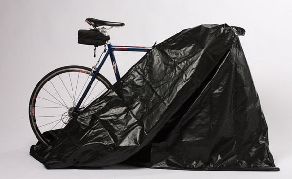

When left unprotected outdoors, your bicycle can deteriorate faster than you could ever imagine.  Rain, snow and UV rays from the sun can have you see visible signs of damage in as little as a week.

Generally speaking, the more humid your area is, the faster your bike will deteriorate when left outdoors.

Hot temperatures cause the plastic and rubber components of your bike to become brittle and break. Your tubes and tires will crack and may pop when pressure is applied.

Exposure to the sun may cause the frame, [seats](https://mtbnz.com/best-kids-bike-seats/), and [pedals](https://mtbnz.com/best-mountain-bike-pedals/) to lose color and have the bike looking old.

When it is cold and wet, your metallic parts will rust quickly and seize up when not lubricated frequently and adequately. For these reasons, you should invest in some of the best bicycle covers in the market.

## 10 Best Weatherproof Bike Covers for the Money

1. ### [Ohuhu Bike Cover](https://www.amazon.com/Ohuhu-Waterproof-Outdoor-Bicycle-Mountain/dp/B018Q6RML4?tag=furiousbikes-20)
    

[Buy on Amazon](https://www.amazon.com/Ohuhu-Waterproof-Outdoor-Bicycle-Mountain/dp/B018Q6RML4?tag=furiousbikes-20)       

This is one of the best bike covers you can ever find for your bicycle. It’s made of high-quality 210T nylon material, which guarantees you longevity and protection to your bike.

With this bike cover, you will no longer have to worry about harsh weather conditions as you leave your bike packed outside.

Often, bikes are not packed under shades, therefore, after a short period of using the bike, you start experiencing change in color or at times it starts to peel off. With this cover from Ohuhu, your bike will maintain the same look for a long period, therefore, giving you the pride of, using it.

#### Material

When others concentrate on quantity for them to make profits, Ohuhu focuses on quality to ensure you as the customer you are satisfied with what you get.

The 210T nylon material ensures that the bike cover will serve you for an extended period without any possible challenges. Additionally, the material is scratch resistant.

Therefore, you are sure your bike will be protected at all times. Also, it folds evenly, and this guarantees you that you will not experience unexpected opening as you cover your bike.

#### Easy to use

This cover is made to fit various sizes of bikes. Therefore, you don’t require any particular skills to get it cover your bike. When not in use, it folds easily, which assures you that when you want to cover the bike, you will only spread it towards the same folding direction. Additionally, because it folds easily it makes it easy for you to transport it to various places.

#### Pros

\-    Made of scratch resistant material

\-    It’s extremely portable, comfortable and durable

\-    Designed with high-quality nylon material

\-    Its dimensions fit perfectly for different bikes

\-    Protects from all weather conditions

Cons

\-    When exposed to harsh conditions for a long time, it develops some holes

\[su\_divider top="no" divider\_color="#021515" size="1" margin="10"\]

2. ### [Yardstash Bicycle Cover XL](https://www.amazon.com/YardStash-Bicycle-Cover-XL-Mountain/dp/B00L2HAUCS?tag=furiousbikes-20)
    

If your bike is slightly bigger than the others, then you need a cover that is larger and better.  YardStash bicycle cover XL is what you should consider.

It works perfectly for all kinds of bikes, which are slightly bigger. This cover ensures your bike is protected from unfriendly conditions and weather fouls. With this cover, you no longer need to look for a shade where you will be parking your bike while in the office or at home.

With this waterproof bike cover, you will no longer have to fear about the harmful UV rays neither will the snow trouble you as far as your bike is concerned.

#### Protection

The solution for your bike is with YardStash bicycle covers. It protects your bike from snow, wind, rain, sunshine, and breeze all at the same time.

With just a single cover, you are sure that your bike will be safe from all harm that the weather may bring. Additionally, this cover fits perfectly from pedals, wheels and all the way to the brakes. Therefore guaranteeing you that your bike will maintain a uniform look.

#### Material

The material of this cover is top notch. This is what I love the most about this cover. It has an elastic design to ensure even when you park your bike at a windy environment; the cover will remain in place. The elasticity of the material also ensures that putting it on and off is easy and faster.

#### Pros

\-    Easy to use

\-    Affordable

\-    Durable and comfortable

\-    High-quality material design

#### Cons

\-    The elasticity design makes it a little unstable especially in windy conditions

[Buy on Amazon](https://www.amazon.com/YardStash-Bicycle-Cover-XL-Mountain/dp/B00L2HAUCS?tag=furiousbikes-20)

\[su\_divider top="no" divider\_color="#021515" size="1" margin="10"\]

3. ### [Pro Bike Cover for Outdoor Storage](https://www.amazon.com/Pro-Bike-Outdoor-Bicycle-Storage/dp/B075V45FVK?tag=furiousbikes-20)
    

If all you are looking for is a cover that will last longer and still protect your bike from all natural effects, then this is the product for you. It’s made from a strong and durable RIPSTOP oxford fabric, which is an automatic guarantee that if you buy it, your bike will be secure at all the time.

You no longer have to worry about different weather conditions that have been affecting your ride for a long time. Instead, invest in Pro bike cover and start enjoying the experience of bike protection.

#### Durable

The fabric itself will tell the difference. The PRO cover is specifically designed for longevity.  The material is strong enough to withstand all forms of stretching as you are covering your bike.

Additionally, the fabric has a stitching design that ensures your bike is safe every time you cover it. The material is also specifically intended to withstand all weather conditions, therefore making it the best investment plan ever.

#### Reliable

Unlike other bicycle covers that are made of cheap material, this one you can rest assured that your bike will be safe. It’s a one-time cover that works throughout the seasons.

During rainy seasons, it protects your bike from raindrops that affect bike color.  With this waterproof bicycle cover, you'll still be sure the UV rays will not penetrate through your bike frames.

#### Pros

\-    Durable and comfortable

\-    Affordable

\-    Made of high-quality material

\-    Has adjustable straps

\-    Safe and secure with lock holes for improved security

#### Cons

\-    A  little bulky therefore making it hard for portability

[Buy on Amazon](https://www.amazon.com/Pro-Bike-Outdoor-Bicycle-Storage/dp/B075V45FVK?tag=furiousbikes-20)

\[su\_divider top="no" divider\_color="#021515" size="1" margin="10"\]

4. ### [Aiskaer Bicycle Cover](https://www.amazon.com/dp/B01G263HZU/ref=as_li_ss_il?&linkCode=li3&tag=furiousbikes-20&linkId=938b84b1029478ff0d11482e9f0a69c4)
    

While the standard covers are known to be durable, this one lasts a little longer than all the other bicycle covers. Aiskaer is thicker, therefore, ensuring that it serves you better and longer than any other, this is because it has a 190T +PU coating.

With this cover, you no longer have to worry when it starts to rain, and your bicycle is parked outside. Additionally, this cover is sun and scratch resistant, and it protects your bike from dust, water, and all other natural conditions.

#### Easy to use

Although the cover is a little thick than all the others, it’s still light, therefore making it easy to transport. Additionally, it has a fitting design which makes it easy for you to cover the enter bike while on your own without any assistance.

#### Convenient

This is one of the most important features of this cover. The ability to fold it makes it ideal even when you have limited storage space. Additionally,  its lightweight design makes it suitable for use at all times, and you don’t need to have an extra hand for you to cover your bike.

#### Pros

\-    Durable with heavy duty design

\-    Protects from harmful UV rays

\-    Waterproof

\-    Scratch resistant

\-    The straps keep it in place even during windy season

#### Cons

\-    The material compared to other covers is slightly thin

Buy on Amazon

\[su\_divider top="no" divider\_color="#021515" size="1" margin="10"\]

5. ### [Maybron Gear Bike Cover](https://www.amazon.com/dp/B018PLDGPG/?tag=furiousbikes-20)
    

This is one of the best bicycle covers that you can find on the market. It’s made of durable material to ensure your bike is protected throughout the day. If you are looking for a waterproof bike cover, then this is the set for you. It works wonders in protecting your bike form rain, snow, wind, and dust.

MayBron is extremely sturdy and durable. Additionally, the fact that is has what it takes to ensure your bike is secure does not indicate that it’s extremely overweight. Instead, it is lightweight, therefore, guaranteeing you that portability is easy and convenient.

#### Convenient

Whichever size your bike is you can find protection with this cover. It has some nice Velcro straps that ensure your bike is covered and the cover remains fitting even when the weather is windy.

Additionally, the straps guarantee you that you will cover the entire bike from wheels to handles. The straps also make the cover secure especially when your bike is locked.

#### Durable

Anytime you are investing in something, you want to be sure that you have not wasted your money. Therefore, you look into every detail to ensure that you are making the right financial decision. With Maybron bicycle cover, you don’t have to be worried. This set is meant to last longer under day to day use.

#### Pros

\-    Easy to use

\-    Return warranty of 60 days

\-    Lock holes for improved security

\-    Easy storage and transportation with storage bag

#### Cons

\-    Does not fit to all bike sizes

6. ### [Baleaf Oxford Bicycle Cover](https://www.amazon.com/gp/offer-listing/B00YBD6SEY/?tag=furiousbikes-20)
    

Just as the name, this bicycle cover is made of top quality Oxford fabric. Therefore, if you buy this cover, you are sure to get a waterproof bike cover that will give you the best protection from all weather conditions.

The most dangerous problem that cyclists endure is paring their bikes then they are rained on. This raindrop affects the color of your bike hence making it unpleasant. However, this should not be the case for you if you have Baleaf Oxford bicycle cover.

#### Waterproof

Unlike all the other bike covers waterproof around, this one is specifically designed to guarantee you safety during rainy seasons.  The material is snow and waterproof to ensure that there is not possibility of water affecting the bike color or frames.

#### Safe

This cover has straps that ensure your bike is not exposed to any external conditions while parked. Additionally, it comes with lock holes to guarantee you maximum security if you park your bike at the same spot for long hours.

#### Material

Baleaf is made of fantastic material. The design ensures that your bike will be protected from dust, snow water and sun too. Also, it ensures that your bike remains safe without any scratches whatsoever. The material also ensures that your bike does not experience any scratches when you cover it with the cover.

#### Pros

\-    Easy to use

\-    Affordable

\-    Convenient for use under all weather conditions

\-    Comes with a storage bag

#### Cons

\-    The straps are not enough to cover the entire bike

7. ### [Puroma bike cover](https://www.amazon.com/dp/B01M6BNZQT?tag=furiousbikes-20)
    

If you are used to parking your bike outdoor, then all you need is a cover that will protect it from the harmful UV rays on a sunny day. Therefore you don’t need to look any further, Puroma bike cover will ensure your bike is safe throughout the day.

#### Secure

You don’t have to keep looking out to make sure that your bike is still covered. If you invest in this waterproof bike cover, you can relax and undertake your daily routines as the motorcycle remains safe together with its cover on the parking space.

This is because the cover comes with locking holes to ensure that as you [lock your bike](https://mtbnz.com/best-lightweight-bike-locks/), you pass through the holes to secure the cover too. Additionally, the cover ensures to keep the entire bike safe from wheels through to the handles without any options for sun rays penetration.

#### Durable

If you get your hands on this bike cover, then you are done with all the problems that are associated with weather problems as far as your bike is concerned for a long time.

The sophisticated design is crafted together to ensure your bike enjoys the benefits of a motorcycle cover for long. It's made of high-quality material that guarantees you longevity even with daily use.

#### Pros

\-    Allows you to lock your bike with the cover on

\-     Durable with high-quality material

\-    Extremely waterproof and scratch resistant

\-    Portable and lightweight

#### Cons

\-    When exposed to strong abrasion, it gets small holes

8. ### [Budge Standard Adult Bicycle Cover](https://www.amazon.com/Budge-BK-C2-Standard-Child-Bicycle/dp/B008B6ZCOY?tag=furiousbikes-20)
    

If you are working on a budget, budget standard adult bicycle cover is the cover for you. Although it does not cover the entire bike including the wheels, it works just as right. The cover is designed to specifically fit most adult bikes. However, it can still be used to cover mountain bikes and other kids bikes too.

#### Easy to use

The size of this cover makes it convenient and easy to use even when you are alone without an extra hand. Additionally, it folds easily and evenly,, which makes it easy for you to transport it to a different destination.

#### Material

This cover is made of durable material to ensure that it serves you longer than any other cover from other companies. In addition, the material guarantees you that your bike will be protected from all weather conditions from snow, rain sun and wind.

#### Pros

- Easy to use

- Affordable and budget friendly

- Straps to ensure it maintains the same position even when on a windy day

#### Cons

- It leaves the wheels open

9. ### [Blue mart bike cover](https://www.amazon.com/dp/B00GQRXFF8?tag=furiousbikes-20)
    

This is a bike cover that makes the choice for a great bike cover a tough one. It has numerous features that make it perfect for most bike owners

#### Durability

Of course, you are looking for a bike cover that will serve you for years. You do not want to end up paying for a bike cover every few months. This cover is scratch and tear resistant.

It is therefore perfect for any bike owner whose bike may have some pointy edges. It does not just protect your bike from the sun, rain and snow, it also keeps your bike looking great by protecting it from scratches.

#### Compact

While a bike cover is great, you do not want one that will make you dread carrying it because it is too heavy. Well, you will love this one. It is compact and slim thus lightweight and easily portable.

You will not have to struggle carrying it. Regardless of its size, it also remains functional and convenient to travel with because it will not consume a lot of storage space. It ensures unmatched safety for your bike.

#### Pros

\-    Has a special buckle for safety

\-    Come in numerous sizes

\-    Has a storage back for easy transportation

\-    Has draw strings which are convenient

#### Cons

\-    It may not fit extra large bikes

10. ### [INTEY bike cover](https://www.amazon.com/dp/B01MT1XS3C?tag=furiousbikes-20)
    

 \[themify\_button style="small blue" link="http://amzn.to/2w81pNF"\]Buy on Amazon\[/themify\_button\]

This is yet another great bike cover in the market today. Made of heavy material on its exterior, you are certain that you will always have a way to protect your bike from harmful sun rays.

#### Waterproof

If you are worried about protecting your bike from the rain, this is the bike cover you should by. If you live in areas that are constantly rainy, this bike cover will keep the rain and any moisture away from your bike.  The cover is large enough to offer full coverage to a medium sized bike. You are therefore certain that you will not have to worry about weather elements reaching your bike. The cover is also dust and sand proof in case you live in an extremely windy area. Your bike will not be dusty when you want to ride it.

#### Tear proof

The last thing you want is a cover that tears easily when you want to use it or one that will tear when a part of the bike gets hold of it. This cover has been tested and proven to be tear proof. As such, you will enjoy years of service because the cover will not be harmed in any way.

#### Aesthetic value

This is one of the bicycle covers that gives you great aesthetic value. The company understands that you will be leaving your bike outside. As such, the cover needs to be beautiful so as not to throw off the aesthetics of your home. In addition to being scratch resistant, this great cover protects your bike and keeps your home looking lovely.

#### Pros

\-    Great UV ray protection

\-    Easy to use

\-    Portable

\-    100% satisfaction guarantee

\-    Three months money back guarantee

\-    Durable

\-    Waterproof, windproof and scratch resistant

#### Cons

\-    It is a little costly

## Things to Consider When Buying Weatherproof Bicycle Covers

Bicycle covers are simple accessories that help to keep your bike in good working condition when you cannot avoid outdoor storage. While the purpose of the bike cover is straightforward and simple, there are several things you have to consider to ensure that you have chosen the right one for your needs.

### The Size of Your Bike

Before you buy the bike cover, you have to make sure that it is big enough for your bike. Bicycle covers come in different sizes and you need to ensure that it will cover your entire bike.

The last thing you want is for you to buy a cover that only covers half of your bike.

The other half will end up being damaged and thus render the entire bike useless. A cover that is too big may not be as much of a hassle as one that is small. However, it is important for you to ensure that the cover is fitting so that it covers your bike from top to bottom without much of a problem.

### Closure system of bicycle covers

Most people make the mistake of only covering part of the bike. Once the cover has covered the exterior of the bike, most people will leave it at that. However, when it rains water tends to accumulate at the bottom of the bike and cause rusting.

You, therefore, need to ensure that the cover you buy has a closure system. the closure system may be buttons, tie straps or a sipper. This feature will prevent any water or dust from getting on the bike and causing damage. Covers with some type of closure system are easier to handle and are safer since they cover every part of the bike.

### Durability

While these bike covers may not very expensive accessories but they are critical when it comes to keeping your bike safe. However, if you have to keep buying a new cover every other month, they can turn out to be very expensive.

It is important to ensure that the cover you buy is durable and will also for a couple of years before it shows any signs of damage.

The material make therefore needs to be high-quality and impressive. This will allow it to protect your bike for a long time without getting damaged or letting weather elements to reach your bike.

### Weatherproof (Waterproof, dust proof and breathable)

Waterproof bicycle covers are meant to protect your bike from harsh weather elements. They are also supposed to be breathable such that they allow moisture to escape when it is hot and prevent water from getting in during the rainy season.

This way, you can comfortably leave your bike outside without worrying that it will rust as a rust of moisture build up when it is hot or than water will slip inside the cover when it rains or snows.

A great bicycle cover will also keep dust from getting to your bike. When you uncover your bike, therefore, it should be exactly as you left it, clean and usable.

### Lightweight

You don’t want to always call people to help you cover your bike. The cover that you buy must be easily to use and light weight. This means you can cover and uncover your bike yourself without worrying about the cover weight too much. A cover that is too heavy may cause your bike to fall when it is packed in an upright position. A lightweight cover is also easily portable in case you have to carry the cover around without when you travel to when you go out and have to keep your bike covered.

### Bicycle Covers Cost

In these tough economic times, you need to ensure that you are not using more money than you have to get what you need. Cheap is not always expensive when it comes to bicycle covers.

There are numerous companies out there that offer high quality bicycle covers at an affordable price. There are some expensive brands in the market that still allow you to get what you need.

Before looking at the price, ensure that you have bought from a reliable brand and that the bike cover has all the features you need

## Conclusion

If you want your bike to be safe and to serve you for a long time, you need to ensure that you prioritize ways to keep it safe from harm. A nice, durable, waterproof cover is your best bet to keeping your bike safe from harm by weather elements.

There are limitless options in the market but there are some that out-muscle the rest of the bicycle covers in the market.

In this review, Ohuhu makes it to the top because it has amazing features that keep your bike safe. To begin with, it is made from high quality 210T nylon that is waterproof and covers the entire bike while in an upright position. The cover is also ultraviolet proof up to 40+ so you never have to worry about harmful UV rays discoloring your bike. Although it gets holes when exposed to harsh weather conditions, it is durable, lightweight and made from scratch resistant materials.
