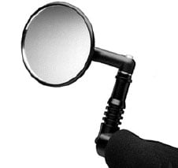

Having the right equipment is important for dealing with traffic. Techniques for using such items as mirrors and lights are a part of the Urban Cycling curriculum.

On this page, we'll look at some of the types of equipment available for this purpose, most of which is available at Easy Street Recumbents.

- The bike itself. This is a big and divisive topic, so it [gets it own page](https://mtbnz.com/best-cheap-bike-for-commuting-city-riding/).

### Mirrors

These usually mount to the handlebars, sometimes to the helmet. In rare cases, the mirror is attached to a bike frame's top tube or other places.

A good mirror must be vibration resistant and be mountable in a place where it is easy to see it, to allow for steady, or even constant, tracking of pursuing traffic at critical moments.

It is handy to set the mirror far enough away from your eyes that the shift in focus between the streetscape and the mirror is not too hard on your eyes. It is also good if the mirror is set so a pursuing driver can clearly distinguish when you are looking in your mirror (i.e. "they know that you know of their presence").

Mirrors are a very good way to reduce your stress in traffic, as cars cannot sneak up on you. You can detect when a driver has started to steer around you or slow down. You can also detect those few drivers who are not reliable and track them steadily as they close on you from behind.

- Mirrors usually mount on the left (in the US), but a second mirror on the right is not excessive and it will be used. In particular, when going through a right bend, your left mirror won't tell you anything. It will also guard against being surprised by a strong, but boneheaded, cyclist attempting to pass you on your right.
- A wide as possible position is best, as it reduces or eliminates blind spots where you can't see an overtaking car. Visual information about a car is handy at the moment that a car tries to pass you.
- Our recommendation for a handlebar mounted mirror is the [Mountain Mirrycle](https://www.amazon.com/Mirrycle-MTB-Mountain-Bicycle-Mirror/dp/B01G98514Q?tag=furiousbikes-20) (pronounced "miracle") made by Mirrycle in Colorado. This mounts in the bar end. For bikes without mountain bike style handlebars, such as road bikes or bikes with swept back bars, we recommend the Mid-bar Mirror, which melds a Mirrycle with a Minoura clamp to attach inboard of the grips. While this is serviceable, a wider mirror layout works better. Easy Street also carries helmet and eyeglasses mirrors.
- Mirrors will increase your aerodynamics drag, which will reduce your top speed.
- Oh, and by the way, like most of the gear you really need to deal with city traffic, mirrors are terribly unfashionable.

### [Safety Flags](https://www.amazon.com/szlzhsm-Bicycle-Safety-Safty-American/dp/B07L2VLB53/?tag=furiousbikes-20)

Speaking of unfashionable stuff with poor aerodynamics, consider flags. Flags are most useful approaching intersections, where objects at ground level may block an approaching driver's clear view of you in the short moments before they turn down your street.

Flags will also keep drivers aware of your presence in thick traffic so they can detect your bike over intervening traffic. The snapping of the flag in the wind gives a strobing of Day-Glo color that boosts your visibility from behind as well.

For most purposes, it is best to have the flag as vertical as possible and not trailing behind the bike, so it marks your position more reliably.

- But let's get to the point about flags as a social statement. Lots of people are resistant to flags, as they associate them with some pasty-faced tot turned loose to pootle up and down the sidewalk with their training wheels. The fear is of appearing to be some sort of mentally handicapped person who lacks streetwise and savvy. There are ways around this problem. First, don't mount the flag using the standard rear wheel axle mount, but instead use a more elegant slip mount located on the rear rack or elsewhere, depending on the bike's configuration. Getting two flags, mounted wide on cargo compartments or on a recumbent seat abandons the specter of the tyke on the bike entirely, as does getting a mix of colors. This begins to create a new paradigm. It stops looking as though some parental authority has slapped you with this flag due to your incompetence. You begin to look more like the hard-bit veteran of urban traffic, out to bite off another distasteful hunk of rush hour. An aluminum crossbar with some extra tail lights further establishes this paradigm of knowledgeable and well-equipped adult cyclist.
- Flags are still whoppingly non-aerodynamic. As noted above, in urban environments this matter less, but if your business takes you out on higher-priority roadways for greater distances, then speed is more of a factor and visibility behind objects is less of a factor. Demountable, collapsible flags will serve if your riding takes you into and out of urban areas.
- Since flags are a visibility aid primarily to people ahead of you, you don't want the visible surface trailing too far behind. Attaching a flag to a highly reclined recumbent seat usually cocks it too far back to be of best use approaching intersections. Early detection of your flag is paramount, and it cannot lag behind. "Spinnie" kites are an alternative to flags, but have the problem of trailing relatively far behind the bike, so a kite should not be your primary flag.

### [Headlights](https://mtbnz.com/best-mountain-biking-lights/)

Headlights are required by law at night, though enforcement is lax. The main function of a headlight is to help you be seen and should be intense enough to be detected early.

The minimum requirement for headlights won't do much to help you see, though reflective street signs will appear easily. Headlights should be directed at the ground, partly to let you see the patch of road directly ahead, but also to keep it from blinding others.

While it is true that bike lights are much less intense than car lights, all the car lights (including the high beams) point at the road. Even a small headlight, pointed right in someone's eyes, can start carving temporary blind spots on their retinae.

- While waiting to cross a busy street at night, you can play your headlight left and right as need be, to better alert approaching drivers.
- There are two main types of headlights: halogen and high-intensity LED lights. LEDs last much longer but give a less intense light. Easy Street has 3- and 5-LED Cateye headlight models in stock. These make a good backup light, and they will meet with the city safety codes, but are still not quite powerful enough to stand alone, unless you have a bank of several such lights.
- Halogen lamps are still the mainstay for bicycle headlights. Halogen lights range in power from as low as 3 volt, 2.5 watt lights that will just barely meet legal requirements. 6 volt models come in 2.5 watt (our favorite, in a bank of three) through 10 watts.12 volt models range from 12 watts and up. The more powerful systems cost hundreds of dollars and will only give a few hours of light. Another way of getting more light is to simply carry several smaller lights, usually with an accessory that clips to the handlebar to provide more space for equipment..
- We tend to steer people away from the really high-powered systems for urban application for several reasons. First is that run times aren't very long. Run time can always be extended by carrying more batteries, but this weight adds up fast, and an equipped urban bike will usually have plenty of weight dedicated to tools, spare parts, cargo capacity, and other visibility items. Lighting should preferably last through several days of ordinary usage, particularly in winter when days are shorter, on a single charge. Otherwise, one is bound to forget one hectic day, and end the day limping shamefully home. For off-road or night time racing, very high powered lights are necessary, but urban riding typically follows lower speeds, simpler terrain, and more ambient lighting. The risk of obnoxiously shining a powerful light directly in another person's eyes are greater in urban riding as well. Banks of smaller lights offer some extra reliability through redundancy, so a freak problem with a wire, connection, or bulb won't knock out the entire system. In many cases, only one smaller light is needed. More lights can switched on when approaching difficult situations such as crossings of busy streets. Such lights can often be connected to larger batteries (of the sort designed for high powered systems) to give several days reliable running.
- Some headlight are designed to be mounted on the helmet instead of the handlebars. While this offers some possible advantages, we haven't much experience with them. We tend to try to keep the bike equipment attached to the bike. The ability to shine the light independently of the bike's direction of travel could offer some distinct advantages, but the danger of shining the light directly in another roadway user's eyes is greater.
- One light of particular interest is the Sigma Sport Ellipsoid 6 volt 2.5 watt halogen headlight. The remarkable thing about this headlight is that it contains its own battery charger and need only plug into the wall to recharge NiMH or NiCad batteries contained within. This makes the use of rechargeable batteries easier, and it protects the headlight from incidental wear caused by constantly opening the shell and removing the batteries. While opening a light's shell doesn't hurt the light, it degrades the watertight seal that protects the light against rain. It is much nicer to just plug the whole light into the wall instead of pulling out all the batteries.
- Rechargeable batteries are worth the trouble, not just from an environmental standpoint, but for the convenience of not having to go buy new batteries. If the recharging system is convenient, like on the Ellipsoid headlight above, then one can regularly count on abundant light. To be a little more savvy, keep a spare set of rechargeables topped off and ready should you consider the set in your light to be suspect and not have the time to charge them.

### Taillights

Judging by the cyclists we see, most cyclists consider the taillight more important than the headlight. This is probably due partly to the concern about cars approaching from behind, partly to the taillight's lower cost.

As most cyclists aren't able to track pursuing and overtaking traffic, they feel somewhat at its mercy, so good visibility to the rear becomes important to them.

Taillights are also easier to take care of than headlights, since a set of batteries runs for 100+ hours, sometimes up to 400 hours, with reasonable brightness.

We think an ideal arrangement of taillights involves at least three lights, arranged in a triangular pattern, giving an overtaking motorist the most visual information about your mutual distance and rate of approach.

Two lights are better than one, but at least three is best. In Texas, a functioning taillight can serve as a rear reflector. Notably, the law requires more from one's front lighting on a bike than the rear, where only a red reflector is required at night.

- Front flashers: In the interest of saving a few bucks, some cyclists opt to use an orange LED flasher on the front of the bike instead of a proper headlight. This is better than nothing at night, but does not actually meet with state requirements. Front flashers are probably best used in the daytime, as motorists can still overlook oncoming bikes when preparing to make a left turn.
- Taillights are used to best effect in a dark street, against a dark background. But in a busy nighttime urban streetscape, full of car lights and ambient lighting, they do not stand out quite so well. One can simply mitigate this with the brute-force approach of getting more taillights. A more sophisticated approach is to supplement your lights with reflective surfaces attached to the bike's cargo bags, cargo boxes, on the rider, or any other surface on the bike that can mount them. See more about reflectives below.
- Red LEDs, like any red visibility equipment, can only go on the rear of the vehicle (by law). Amber or white LEDs can go on the front, and in some cases amber lights can be used on the rear as well.

### Bells and horns

We think of these as "visibility" items, loosely speaking. They project the cyclist's presence to the front, as headlights do.

Aside from being a valuable aid in alerting drivers backing out of parking spaces and driveways, they can be used to affirm the cyclist's intent to take right-of-way in situations where he/she has ROW. The only bell that we think is loud enough to penetrate traffic is the [Incredibell, made by Mirrycle](https://www.amazon.com/Mirrycle-Incredibell-Original-Bicycle-Bell/dp/B000YYYP3K?tag=furiousbikes-20).

Only the standard Incredibell is effective. Other Incredibell models are not intense enough, though the XL Incredibell is likely a better choice for use in pedestrian areas, such as multi-use trails.

Horns come in electric and compressed air varieties. We do not have much experience with horns, having found bells suitable enough for our purposes, and in fear of accidentally triggering the 100dB noise in a pedestrian area.

### Reflectives

Bikes are required to have a red reflector in the rear, of a particular type defined by the Consumer Products Safety Administration. This is the jewel type reflector seen on all stock bikes (and nearly the only piece of safety equipment found on most stock bikes).

Useful reflectors might also come in the wheel spokes and on the pedals, though pedal reflectors are useful on recumbents due to the angle of the pedal during the power stroke. Some cyclists buy reflective tape and attach it to the frame. Reflective tape on the inside of the rim can also be visible to front and rear.

Most cyclists get reflective tape from hardware stores, but a wider variety of colors can be found at sign shops or the plastics suppliers who sell to sign shops, often at much lower prices.

Easy Street Recumbents sells stock and custom shaped reflective panels of adhesive-backed 3M reflective material mounted professionally on thin polycarbonate plastic (the stuff your 2-liter soda bottle is made from), which can be mounted on cargo boxes and bags. You may not think of your cargo bags are safety equipment, but if you use them as a platform for a large field of reflective color, they are.

- Reflectives should be mounted low, since that is where car headlight aim. It is easy to underestimate reflectives in favor of lights, but remember that reflectives use the huge amount of candlepower being put out by a car's headlights, so it can return a lot of light. Indeed, in the LCI Instructor Training Seminar where old #929 got his teaching certificate, under a headlight test his reflectives threw back so much light his LED lights were all but invisible. Reflectives also throw back light from a field with an area, not from a point, making the bike stand out against more intense point sources of light, such as the headlights of surrounding cars.

### Remote strobe

These items are made primarily by Visibility System of Connecticut (Lightman© Strobes) but other models by can likely be found. These are high-intensity lights, so high that they have too short a run time to be left on, and arguably too high to be left on when someone is queued behind the cyclist at a stop.

The light has a remote switch that allows the cyclist to turn on the light only when needed. One simple technique is to activate the light as one enters an intense traffic situation. A more sophisticated technique is to coordinate use of these lights with one's actual situation.

For example, a rear strobe can be activated if your mirror indicates that a pursuing motorist is closing faster than you consider appropriate.

Two amber strobes can be used as turn signals. A clear strobe can be used to the front, activated when the cyclist needs to assert their intent to take right-of-way before entering an intersection. Lightman Strobes come in a variety of colors (such as green for helicoptor landing pads or blue for police), but only red, amber, and clear are really suitable for traffic.

### Cargo

One does not usually think of cargo are safety equipment, but once you begin to equip your bike with cargo compartments, you find you have some ideal surfaces on which to mount reflective panels.

These compartments usually hang low on the bike's frame, putting the reflective surfaces down where cars' headlight beams are aimed.

Like any most useful visibility equipment, cargo adds not only weight but aerodynamic penalty, as it increased the width of the bike. But then the profile that is being widened is the profile that approaching traffic tends to see (that is, the front or rear profile).

By widening this profile and covering it with visibility gear, one makes one's bike far more visible, letting one exert a greater presence on the road.

### [Water and cooling gear](https://mtbnz.com/best-hydration-packs-for-mountain-biking/)

Doubtless, you have heard before about the importance of carrying water and drinking before one feels thirsty. Water can also be used for cooling in hot weather by tying a wet rag to the head or neck and using evaporative cooling from the wind passing the moving cyclist.

Cooling is particularly important in urban traffic where complex situations require both focused attention at critical moments and wide-area, active scanning of the whole situation (and the presence of mind to know which mode of thinking to do more of). This kind of activity becomes more difficult when one is distracted by heat or thirst.
