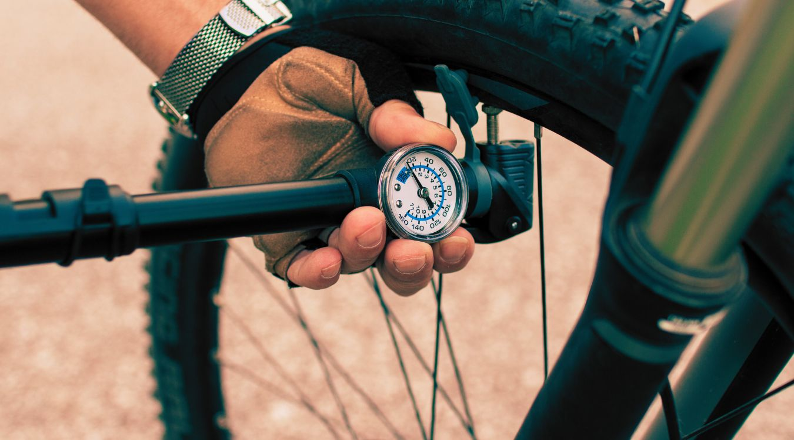
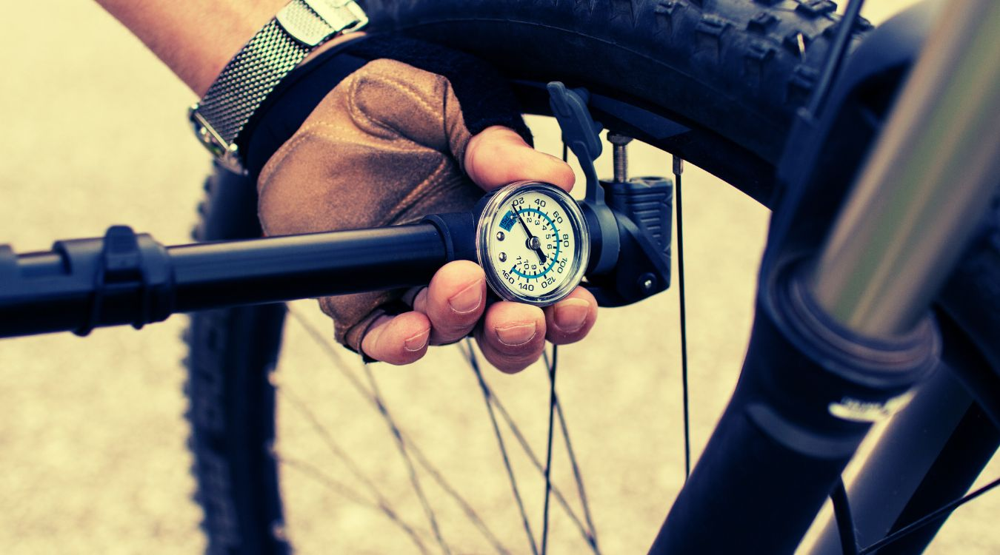

Choosing the best MTB bike pump can be a daunting task, especially when you look at the variety of bicycle pumps that are available in the market today.

If you feel confused about what to look out for when buying a mountain bike pump then you are reading the right article.

In this comprehensive guide, we discuss the types of bicycles inflators and the factors that you need to consider when buying a bike pump for you beloved cycle so that you can make a more informed decision about your purchase.

There are various types of bike pumps that are available today but all of them are generally categorized into the for main types. The Reviews below will help you identify the best bike pumps in the market.

## Best MTB Bike Pump Reviews

\[content-egg module=Amazon template=custom/simple\_list\]

### Mountain Bike Floor Pumps

- An MTB floor pump, also known as a track pump, offers you the most efficient and quickest way for pumping air into your tires – it is almost as easy as inflating with an air compressor.
- It does not involve the hassles and the amount of effort that is required with other types of pumps, particularly mini pumps.
- A floor pump is also much more durable than the other types of pumps.

These pumps are typically two to three feet tall and have a generously high-pressure capacity (most floor pumps have a pressure capacity of around 160 PSI).

However, unless you are a professional cyclist, you will never need to fill your bike tires to such high pressures. Due to the larger size of floor pumps, these are often kept at home and are used for pumping up tires _before you begin your ride_ unlike mini pumps or frame pumps.

#### _5 Best Floor Pumps:- Quick Answer_

1. Serfas TCPG Bicycle Floor Pump
2. AerGun X-1000 Bike Floor Pump
3. Vibrelli Bike Floor Pump
4. Schwinn Floor Pump
5. Lezyne Micro Floor Drive Pump

\[su\_divider top="no" divider\_color="#021515" size="1" margin="10"\]

### 1\. [Serfas TCPG Bicycle Floor Pump](https://www.amazon.com/gp/offer-listing/B001MK3GFS/?tag=furiousbikes-20)

The Serfas TCPG Bicycle Floor Pump is a simple, inexpensive, and well-constructed floor pump that offers adequate performance and durability for the price.

The product features a solitary valve head that is compatible with Presta and Schrader valves. There is an integrated gauge with an adjustable red market that allows you to set the desired pressure for pumping.

The pump itself is constructed with a metal barrel and nylon base that offers high durability. The reinforced base provides optimum stability so that you can easily and quickly inflate your bicycle tires. The maximum pressure capacity is 160 PSI which is just about average for a floor pump.

https://www.youtube.com/watch?v=s7BOzyTEvog

#### Pros:

- Compatible with Schrader and Presta valves.
- The sturdy and reinforced nylon base offers good stability while pumping.
- Inexpensive and durable.

#### Cons:

- The gauge readings are not very accurate and can be a little difficult to read (due to the small font used for the numbers).
- It can be a bit of a struggle to fit it correctly on Presta valves.

[Check Price & Reviews on Amazon](https://www.amazon.com/gp/offer-listing/B001MK3GFS/?tag=furiousbikes-20)

\[su\_divider top="no" divider\_color="#021515" size="1" margin="10"\]

### 2\. [AerGun X-1000 Bike Floor Pump](https://www.amazon.com/AerGun-X-1000-Bike-Pump-AerTight/dp/B00OP5KB0K/ref=as_li_ss_il?ie=UTF8&linkCode=li3&tag=furiousbikes-20&linkId=91f78668b189e6c0dfcd08f97524c59d)

The AerGun X-1000 Bike Floor Pump is a multi-purpose, high-pressure floor pump that is suitable for day to day use. The product is well designed with convenient features such as a pressure release valve and a long air hose embedded into it.

This MTB  floor pump features a rigid construction with a metal barrel and a reinforced base for high stability.

Additionally, the pump head is conveniently designed to fit all types of valves including Presta and Schrader valves without the need for additional adapters.

It also comes with ball and bladder needles included so that you can pump up soccer balls, basketballs, and pool toys with it.

The gauge is easy-to-read and comes with an adjustable indicator so that you can control the exact amount of air in your [bike tires](https://mtbnz.com/best-mountain-bike-wheels/). As with most floor pumps, the maximum pressure capacity for this bike floor pump is 160 PSI.

https://www.youtube.com/watch?v=1fOgAad52zQ

#### Pros:

- The airtight pump head is compatible with Presta and Schrader valves.
- Multipurpose pump – it comes equipped with ball and bladder needles.
- Rigid construction offers high durability – the pump will give you a good couple of years before wearing out.

#### Cons:

- The base is not as sturdy as most other floor pumps.
- The hose is very short – no long-distance pumping possible.

[Check Price & Reviews on Amazon](https://www.amazon.com/AerGun-X-1000-Bike-Pump-AerTight/dp/B00OP5KB0K/ref=as_li_ss_il?ie=UTF8&linkCode=li3&tag=furiousbikes-20&linkId=91f78668b189e6c0dfcd08f97524c59d)

\[su\_divider top="no" divider\_color="#021515" size="1" margin="10"\]

### 3\. [Vibrelli Bike Floor Pump](https://www.amazon.com/Performance-Glueless-Puncture-T-Valve-Schrader/dp/B017ADD9N4/ref=as_li_ss_il?ie=UTF8&linkCode=li3&tag=furiousbikes-20&linkId=741ed2512763f5e72d62627954db49b9)

The Vibrelli Bike Floor Pump is a multi-purpose, affordable, and lightweight bicycle air pump that offers portability and quick inflation time as its perks.

The airtight Rapid-T valve connection on the pump allows you to switch between a Presta and Schrader valve for supporting both [road bikes](https://mtbnz.com/best-road-bike-for-triathlon/) and mountain bikes.

The solid metal barrel and the sturdy base of the pump ensure maximum stability while pumping.

The maximum pressure capacity for this floor pump is 160 PSI.

The pressure gauge is very accurate and has large markings for good readability. Vibrelli also throws in ball inflation needles with the pump so that you can use it for pumping up footballs, basketballs, and other sports equipment whenever needed, as well.

https://www.youtube.com/watch?v=yk\_v1vRUxDE

#### Pros:

- Airtight Rapid-T valve supports Presta and Schrader valves.
- Compact and lightweight (despite being a full-sized floor pump).
- Sturdy base offers good stability.

#### Cons:

- The Rapid-T valve can be a little tricky to work out.
- Not as durable as most best bike pumps.

[Check Price & Reviews on Amazon](https://www.amazon.com/Performance-Glueless-Puncture-T-Valve-Schrader/dp/B017ADD9N4/ref=as_li_ss_il?ie=UTF8&linkCode=li3&tag=furiousbikes-20&linkId=741ed2512763f5e72d62627954db49b9)

\[su\_divider top="no" divider\_color="#021515" size="1" margin="10"\]

### 4\. [Schwinn Floor Pump](https://www.amazon.com/Schwinn-SW76506-2-Parent-Floor-Pump-Gauge/dp/B00F2DG3VU/ref=as_li_ss_il?ie=UTF8&linkCode=li3&tag=furiousbikes-20&linkId=e1c867820a924449bad07d1b35fa575b)

The Schwinn Floor Pump is a simple, easy-to-use, no-nonsense floor pump that is best suited for individuals that are restricted to a limited budget (or need a backup pump).

This product has a durable construction with a metal barrel and a sturdy and wide base for support.

The pump head is compatible with both Presta and Schrader valves though you might need to make a few adjustments with the locking lever.

The extra-large gauge is accurate and easy to read off from – you can easily keep track of the amount of air that is filled in your bicycle tires. The maximum pressure capacity of the pump is 140 PSI which is a little disappointing for a floor pump.

#### Pros:

- Very affordable price.
- Accurate and easy-to-read gauge.
- Compatible with Presta and Schrader valves

#### Cons:

- The maximum pressure capacity is a bit low compared to most MTB bike pumps.
- The quality of the construction is not as high as it should be.

[Check Price & Reviews on Amazon](https://www.amazon.com/Schwinn-SW76506-2-Parent-Floor-Pump-Gauge/dp/B00F2DG3VU/ref=as_li_ss_il?ie=UTF8&linkCode=li3&tag=furiousbikes-20&linkId=e1c867820a924449bad07d1b35fa575b)

\[su\_divider top="no" divider\_color="#021515" size="1" margin="10"\]

### 5\. [Lezyne Micro Floor Drive Pump](https://www.amazon.com/Lezyne-Micro-Drive-HP-Pump/dp/B0069ENT9K?tag=furiousbikes-20)

The Lezyne Micro Floor Pump is a compact and ergonomic MTB bike pump that offers the portability of a mini pump with the comfort and power of a floor pump.

It is compatible with Presta and Schrader valves which make it a suitable choice for both mountain and road bikes. The high-quality aluminum construction offers a lightweight experience without compromising on the durability.

The 24-inch hose makes it easy to reach the bicycle’s tire valve stems from a distance. There is a stainless-steel footbed included in the pump, as well, which allows you to keep it stable and steady while pumping.

As for dimensions, this top mini bike pump has a length of 300 mm, a weight of 150 grams, and a maximum pressure of 90 PSI.

https://www.youtube.com/watch?v=DF5H9U8DKOo

#### Pros:

- Compatible with Presta and Schrader valves.
- 24-inch hose allows you to reach the valve stems easily.
- Additional foot peg provides stability even when you are on the road.

#### Cons:

- The handle is stiff and can be tough to use.
- Not as portable as other mini pumps.

[Check Price & Reviews on Amazon](https://www.amazon.com/Lezyne-Micro-Drive-HP-Pump/dp/B0069ENT9K?tag=furiousbikes-20)

\[su\_divider top="no" divider\_color="#021515" size="1" margin="10"\]

## 2\. Best Mini Pumps For Mountain Bikes

A mini bicycle pump is a portable pump that you can easily carry around in your backpack, [hydration pack](https://mtbnz.com/best-hydration-packs-for-mountain-biking/), or on the [frame of your bicycle](https://mtbnz.com/frame-building-appropriate-technology/).

The best mountain bike mini pumps are capable of inflating tires to reasonable pressures and hence, are ideal for emergency situations and accidents such as a mid-ride puncture.

However, due to the increased effort that is involved, mini pumps are _not_ a good choice for inflating your bicycle tires on a daily basis. The best MTB mini pumps are usually compact, lightweight, and feature a plastic or aluminum construction which is not as durable as the metal construction on floor pumps.

#### _The 5 Best Mini Bicycle pumps:- Quick Answer_

1. Vibrelli Mini Bike Pump
2. SKS Spaero Double Action Mini Pump
3. Pro Bike Tool Mini Bicycle Pump
4. Zefal HPX Frame-Fit Pump
5. Pro Bike Tool Mini Floor Bike Pump

\[su\_divider top="no" divider\_color="#021515" size="1" margin="10"\]

### 1\. [Vibrelli Mini Bike Pump](https://www.amazon.com/Mini-Bike-Glueless-Puncture-Repair/dp/B010JFWDHS/ref=as_li_ss_il?ie=UTF8&linkCode=li3&tag=furiousbikes-20&linkId=b981581d0b88f7798bf4b0fb9f3772ce)

The Vibrelli model is one of the best MTB mini pumps that integrates an intelligent design with solid construction to provide a convenient on-the-go experience.

There is an advanced extendable telescope included in the pump that allows you to easily switch between high volume and high pressure, depending on your requirements. The maximum pressure capacity of the pump is 120 PSI.

This mini mountain bicycle pump also incorporates an intuitively designed valve that is compatible with Presta and Schrader valves.

The mounting bracket and the Velcro straps make it easier to carry this mini pump since it can be directly attached to your bicycle (no need for an additional pump bag). The 218-mm length and the 270-gram weight further add to the portability of this pump.

https://www.youtube.com/watch?v=MJLHJUEyIx4

#### Pros:

- Suitable for both road and mountain bicycles.
- Allows switching between high pressure and high volume pumping.
- An impressive maximum pressure capacity of 120 PSI.

#### Cons:

- The mounting bracket is not very versatile – the pump has a reputation of falling off when mounted to larger bike frames.
- Not very comfortable to use – takes quite an effort for pumping up larger bicycle tires.

[Check Price & Reviews on Amazon](https://www.amazon.com/Mini-Bike-Glueless-Puncture-Repair/dp/B010JFWDHS/ref=as_li_ss_il?ie=UTF8&linkCode=li3&tag=furiousbikes-20&linkId=b981581d0b88f7798bf4b0fb9f3772ce)

\[su\_divider top="no" divider\_color="#021515" size="1" margin="10"\]

### 2\. [SKS Spaero Double Action Mini Pump](https://www.amazon.com/SKS-Germany-Spaero-Double-Action-Bicycle/dp/B00NEYRF20/ref=as_li_ss_il?_encoding=UTF8&keywords=specialized%20bike%20pump&portal-device-attributes=desktop&qid=1492866985&ref_=as_li_ss_tl&sr=8-31&linkCode=li3&tag=furiousbikes-20&linkId=11f012dc82738fe4904192e9d68c22f3)

One feature that sets the SKS Spaero Mini Pump apart from all the rest is its modern styling.

We personally think that this is the best design for a mini MTB pump in our review list.

This bike pump sports a T-type handle which makes it easier to apply sufficient pumping force. It is also compatible with Presta and Schrader valves which means that it can be used with mountain and road bikes.

The ‘double action’ feature allows you to pump air not just by pushing but by pulling as well which we find to be very convenient, actually!

There is also a flexible hose attached to this pump which ensures that the pressure remains steady throughout the pumping process. Moving on to dimensions, the pump has a length of 241 mm, a weight of 159 grams, and maximum pressure capacity of 87 PSI.

\[themify\_hr color="light-gray"\]

https://www.youtube.com/watch?v=C9fvkI4dwKs

\[themify\_hr color="light-gray"\]

#### Pros:

- The ‘double action’ feature comes in quite handy during pumping.
- Flexible hose attachment allows for a more comfortable inflating experience.
- It is one of the best mini bicycle pumps since it is compatible with both Presta and Schrader valves.

\[themify\_hr color="light-gray"\]

#### Cons:

- The maximum pressure capacity is low when compared to other mini pumps.
- The handle is a little awkward to use.
- It is quite expensive, especially when compared to other MTB mini pumps.

[Check Price & Reviews on Amazon](https://www.amazon.com/SKS-Germany-Spaero-Double-Action-Bicycle/dp/B00NEYRF20/ref=as_li_ss_il?_encoding=UTF8&keywords=specialized%20bike%20pump&portal-device-attributes=desktop&qid=1492866985&ref_=as_li_ss_tl&sr=8-31&linkCode=li3&tag=furiousbikes-20&linkId=11f012dc82738fe4904192e9d68c22f3)

### 3\. [Pro Bike Tool Mini Bicycle Pump](https://www.amazon.com/Bike-Pump-Gauge-Pro-Tool/dp/B00XLGKTY2/ref=as_li_ss_il?ie=UTF8&linkCode=li3&tag=furiousbikes-20&linkId=0d198f4ba9c4155fed13f23bad439d5d)

The Pro Bike Tool Mini Bike Pump is a highly portable, and easy-to-use MTB bike pump that features a lightweight and durable design.

The pump head is compatible with Presta and Schrader valves without the need for additional adapters.

A (clever) oversized piston allows you to pump more air per stroke which means that it requires less effort to inflate a tire with this pump.

While it does not compete to the proficiency of a floor pump, it is capable of inflating a tire of almost any size in less than a minute.

The flexible air hose design allows the pump to work with awkward valve placements as well. A pressure gauge is also integrated into the pump which is surprising for a mini pump but adds to the overall convenience offered by the pump.

The length of the pump is 222 mm, the weight is just 127 grams, and the maximum pressure capacity is 120 PSI (which is practically impossible to reach with a hand pump though).

https://www.youtube.com/watch?v=HmX-KhpKrIg

\[themify\_hr color="light-gray"\]

#### Pros:

- Lightweight design with a durable aluminum construction.
- Oversized piston makes it easy to pump air.
- Flexible air hose pipe allows for airtight connections.
- Compatible with Presta and Schrader valves.

\[themify\_hr color="light-gray"\]

#### Cons:

- The pressure performance is not as good as high-end pumps.
- The theoretical maximum pressure of 120 PSI is difficult to reach practically.

\[themify\_hr color="light-gray"\]

[Check Price & Reviews on Amazon](https://www.amazon.com/Bike-Pump-Gauge-Pro-Tool/dp/B00XLGKTY2/ref=as_li_ss_il?ie=UTF8&linkCode=li3&tag=furiousbikes-20&linkId=0d198f4ba9c4155fed13f23bad439d5d)

\[themify\_box\]

### 4\. [Zefal HPX Frame-Fit Pump](https://www.amazon.com/Zefal-HPX-Frame-Fit-Pump/dp/B00PBE6SH4/ref=as_li_ss_il?ie=UTF8&linkCode=li3&tag=furiousbikes-20&linkId=8395ce39957a4dadde5613c3eb0ec53d)

The Zefal HPX Frame-Fit Pump is a simple yet effective frame pump that offers good pressure performance without comprising much on the portability.

It has been designed to fit on the frames of most bicycles but it can also stand on its long barrel when needed.

If you are tired of making use of the MTB mini pumps that require a lot of effort then this might be the right choice for you since the longer barrel allows for a more efficient and smooth pumping experience.

This product is only compatible with Presta valves though and requires you to have an adapter for the Schrader valve – keep in mind that this can reduce performance when used with a mountain bike.

This frame pump sports a solid aluminum construction and can pump to an impressive maximum capacity of 174 PSI. It comes in four different sizes that you can choose from, depending on your requirements.

\[themify\_hr color="light-gray"\]

https://www.youtube.com/watch?v=B1Pc81vZpX0

#### \[themify\_hr color="light-gray"\]

#### Pros:

- The long barrel allows for smoother air flow, better pressure performance.
- Comes in four sizes which means that it will fit onto almost every bike.
- Durable aluminum construction.

\[themify\_hr color="light-gray"\]

#### Cons:

- It is not directly compatible with Schrader valves.
- The heavier weight makes it more difficult to carry around.
- No ‘advanced’ features included.

\[themify\_hr color="light-gray"\]

[Check Price & Reviews on Amazon](https://www.amazon.com/Zefal-HPX-Frame-Fit-Pump/dp/B00PBE6SH4/ref=as_li_ss_il?ie=UTF8&linkCode=li3&tag=furiousbikes-20&linkId=8395ce39957a4dadde5613c3eb0ec53d)

\[/themify\_box\]

\[themify\_box\]

### 5\. [Pro Bike Tool Mini Floor Bike Pump](https://www.amazon.com/Pro-Bike-Tool-Stabilizing-Connection/dp/B01BVOUI32/ref=as_li_ss_il?ie=UTF8&qid=1501872422&sr=8-11&keywords=frame+pump&linkCode=li3&tag=furiousbikes-20&linkId=df6c13e4228b8702087905818b9e35ce)

Featuring a highly compact design and an extra-long barrel, the Pro Bike Tool Mini Floor Bike Pump is a frame pump that delivers an excellent pumping performance.

The thread-on valve connection is compatible with Schrader and Presta valves which make the pump suitable for both mountain and road bikes.

Meanwhile, the T-shaped handle provides a [firm grip](https://mtbnz.com/best-mountain-bike-grips/) and allows you to generate more pushing power for an easy pumping experience.

The oversized piston is a clever addition that allows you to push in more air with each stroke which ultimately equates to less effort being required for inflating a tire.

There is a stainless steel foot peg integrated into the pump, as well, which allows for improved stability during pumping. As for the dimensions, this frame pump has a length of 310 mm and a weight of 190 grams which makes it portable enough to carry around with you, whenever required.

The maximum pressure capacity of the pump is 160 PSI.

\[themify\_hr color="light-gray"\]

#### Pros:

- Oversized piston provides a comfortable and easy pumping experience.
- Stainless steel foot peg offers high stability while pumping.
- T-shaped handle provides a firm grip for pumping.
- Compatible with Schrader and Presta valves.

\[themify\_hr color="light-gray"\]

#### Cons:

- The handle can be a bit stiff to use.

\[themify\_hr color="light-gray"\]

[Check Price & Reviews on Amazon](https://www.amazon.com/Pro-Bike-Tool-Stabilizing-Connection/dp/B01BVOUI32/ref=as_li_ss_il?ie=UTF8&qid=1501872422&sr=8-11&keywords=frame+pump&linkCode=li3&tag=furiousbikes-20&linkId=df6c13e4228b8702087905818b9e35ce)

\[/themify\_box\]

\[themify\_box\]

\[su\_divider top="no" divider\_color="#021515" size="1" margin="10"\]

## 3\. Best Bicycle Frame Pump:

A frame pump is commonly regarded to be a longer and more efficient version of the mini pump. You can think of it as a mix between the floor pump and the mini pump. The design and weight of a frame pump allow it to fit on the frame of a bicycle for easy carriage.

However, since it is longer and often comes with its own standing supports, you can easily generate more power with them. This enables you to pump more pressure into your bicycle tires and even fill them to full capacity when needed.

However, it is still recommended that you make use of a frame pump as a secondary option to the floor pump due to the higher convenience and durability of floor pumps.

## CO2 Inflator:

A CO2 inflator is not strictly a bicycle air pump but instead a mini inflator. This inflator is an incredibly lightweight option that offers a quick and simple fix for a flat tire. These inflators make use of a small valve ending (or pump head) and inflate the tire using a CO2 canister (or cartridge).

A CO2 cartridge will give you sufficient gas for filling a complete tire.

One advantage of making use of these pumps is that they are very lightweight and highly portable – most of them are so small that you can even carry them in your pockets. Another benefit is that these can provide instant inflation to the desired pressure which saves you from having to put in the effort of pumping air manually via a mini pump or frame pump.

However, the downside is that these inflators can prove to be quite expensive in the long run (since you need a new cartridge each time) and these only offer a temporary fix to the problem. This is the reason that we have not reviewed CO2 inflators in this article.

\[su\_divider top="no" divider\_color="#021515" size="1" margin="10"\]

## What To Look For When Shopping for the Best MTB Bike Pump

Here are the features that you need to look for when you are choosing the best bike pump for your bicycle:

### Valve:

There are two types of bicycle valves: Presta and Schrader.

A Presta valve is a thin valve that has a removable inner core and is generally opened or closed through the use of tiny lock top. This valve is most commonly found in road bicycles and in the inner tubes of some mountain bicycles.

On the other hand, a Schrader value is much broader and it does not involve as much mechanics as the Presta valve since it has to be sealed (for opening and closing) with a simple plastic top. This valve is commonly found on mountain bikes.

When you are looking for the [best pump](https://cuinbed.com/best-penis-pump/), it is important to know which valve do your bicycle tires have and then choose the pump that is compatible with the relevant valve.

In most cases though, a bicycle tire pump will be compatible with both Presta and Schrader valves.

Floor pumps most usually offer two separate points for each kind of valve while mini pumps or frame pumps will require you to adjust the pump head for ensuring a good fit.

### Gauge:

The gauge is a small instrument that displays the PSI of the pump i.e. the pressure inside the tire.

When you are pumping air into your bicycle tires, it is important to know exactly what pressure are you looking to fill them to for ensuring a smooth cycling experience and in some extreme cases, for preventing the tires from bursting.

Therefore, to monitor the pressure inside the tire you will need a gauge on your pump.

Most of the best mountain bike floor pumps come with a gauge but it is less commonly found in mini pumps and frame pumps (since they are designed for portability).

Ideally, the best MTB bike pump should have a gauge that is accurate and has clear markings so that its reading can be easily understood.

### Pressure and Volume:

You will not always be requiring a mountain bike pump that has the highest-pressure capacity – in fact, you will never see yourself finding the need for a pump that has a capacity above 160 PSI in most cases. The reason is that a higher-pressure pump is a direct trade-off with the volume output and the gauge accuracy.  

A low-pressure pump means that you will be able to reach your desired pressure in fewer strokes while a high-pressure pump will require more strokes.

Whether you need a high-pressure pump or a low-pressure pump is directly dependent on your bicycle tires.

For instance, larger tires (such as those in mountain bikes) have a much greater volume than smaller tires and hence, you will need a low-pressure, large-volume pump for inflating them quickly and vice versa.

### Design and Construction:

The looks and more importantly, the style of the pump is also important – not just in terms of the aesthetics but in terms of usability and durability as well.

A good mountain bike pump should be able to last for several years without showing signs of wear and tear. The design and material that is used for the pumps are what define its durability.

Pumps that have a plastic construction are the least expensive but will usually be the least durable (and can break easily) while pumps with a metal construction tend to be much more durable but are much more expensive. You need to find the right balance between size, durability, and price to pick the right bicycle pump for you.

Similarly, the best MTB bike pump will have a handle that fits and feels perfect in your hands so that you can pump air easily and quickly. When you are buying a bicycle pump, it is important to keep in mind that a good bike pump will allow you to inflate the bicycle tires without tiring yourself out too quickly.

### Size and Weight:

If you are looking to purchase a floor pump that will be staying in your garage then the size and weight are not much of a concern and you should not bother with them.

However, if you are looking for a mini pump or a frame pump that can help you inflate a tire in time of emergencies then you need to pick a pump that is lightweight and is small enough to be carried around easily.

One key thing to remember here is that the smaller a pump, the lesser capacity it has. So, what you need to do is to look for a pump that is portable but has an adequate pumping capacity (according to your bike’s tires), as well.

## Conclusion:

According to our assessment, the Pro Bike Tool Mini Floor Bike Pump is the best MTB bike pump that is available today. This is because it offers the perfect balance between ease of use, durability, and portability which are the key features that you need to look for in a bicycle pump.

The extra-large barrel design accompanied by the oversized piston and footpeg makes for a comfortable and efficient pumping experience with the least amount of physical effort required. The pressure capacity of the pump is enough to inflate even a mountain bike tire on its own and yet, at 190 grams it is highly portable as well.

The aluminum construction ensures that the pump is durable enough to go through years of use without much wear and tear. All in all, the value for money and comfort that is offered by the Pro Bike Tool Mini Floor Bike Pump means that it bests all other pumps in our review list.
