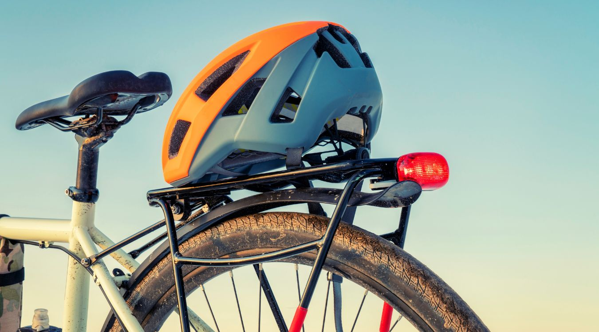

The key to choosing the best bike rack for your Subaru Forester is accurately defining your needs and the vehicle you have. Different bike racks are designed to fit on different parts of your car. Some may fit on the roof and others on the trunk. Besides that, you also need to consider the following factors;

- The number of bikes you need to transport and whether you have bikes with different shapes like e-bikes, fat-tire bikes or bikes with a cargo carrier.
- The amount you want to spend on your rack.
- The security offered by the racks to your bicycles.
- The height of your Subaru Forester relative to your height.
- Your vehicles roof carriage design, whether it has a tow hitch or a roof-mounted carrier.
- Your car’s rear design and whether there is a rear mounted spare tire that may interfere with the rack.

If you have the answers to those questions, then you are good to go. Let’s look at what exactly you are likely to find when you go to the market.

When you go to purchase a bike rack for your Subaru Forester, you will be bombarded with many models. You are already set, right? You should not have any problem.

\[su\_divider top="no" divider\_color="#021515" size="1" margin="30"\]

## Top Seven Best Bike Racks for Subaru Forester

\[content-egg-block template=custom/all\_offers\_list\]

\[wpsm\_divider top="40px" bottom="40px" style="solid"\]

### 1\. Kuat NV 2.0 Bike Platform Rack

\[content-egg module=Amazon template=custom/compact\_extra next=1\]

The Kuat NV 2.0 platform-style rack is capable of transporting 2 bikes of almost any size, shape, or frame model. The ratcheting wheel hooks and sliding wheel trays comfortably hold your bikes with no frame contact. The rack tilts with bikes loaded for rear area access and it folds up for easy storage.

The rack is made of aluminum and has an integrated work stand for repairs while on transit. This Subaru Forester rack installs without tools, has locks included to secure your bikes to the rack and the rack to your car. An optional 2-bike add-on sold separately also lets you easily convert your Kuat NV to a 4-bike rack.

The NV has hooks that grip your bikes firmly by the front wheels and not the frames. These hooks allow you to quickly load and unload your bikes without scratching or scuffing your bike paint. Each hook can adjust in 2-mm to ensure a snug fit over your wheel and releases with just the push of a button.

The wheel hooks are mounted on arms that pivot nearly 180 degrees from left to right. This makes it easier to load as compared with other racks that have the hooks mounted on a central post. To load, simply set your bike in the wheel cradles, rotate the arms up over the wheels, and press the hooks down over the wheels.

Pros

- Can carry bikes of all shapes and style.
- Sturdy.
- Easy to install without tools.
- Easy to load bikes.
- Easy to fold and store.

Cons

- The tilt mechanism location is not convenient.
- Not ideal for newer mountain bikes.
- Hard to access trunk when installed.

\[wpsm\_divider top="20px" bottom="20px" style="solid"\]

### 2\. Lets Go Aero Wing-2 Bike Rack

\[content-egg module=Amazon template=custom/compact\_extra next=1\]

The BikeWing-2 hitch-mounted bike rack is capable of carrying up to 2 bikes by the wheels on the V-shaped support arms. It has adjustable, anti-sway cradles that supports bikes of most sizes and frame styles. The steel construction is tough yet lightweight and the rack is easy to set up and store.

The BikeWing-2 features 2 removable V-Shaped support arms - or wings. The V-shaped rack distributes weight evenly, holding your bikes by the wheels and not by the frames. This ensures level transport and also eliminates the need for a bike frame adapter.

The support arms can be removed if you need access to the rear cargo area of your Subaru Forester or for storage. You only need to pull the pins at the base of the rack to remove the arms. The pins are tethered to the base so you won't lose them.

The cradles and sway stops are coated with rubberized nylon to protect your bike wheel surfaces from scratches and scuffs. This coating also provides friction to ensure good grip of the wheels on your bikes. The foam pads on the support arms helps to keep your bikes stationary and rattle-free during transport. The pads slide up and down the support arms to accommodate different bike sizes and protect the paint from scratches.

Also note that the rack can fold down with your bikes loaded for cargo area access by simply removing the pin at the base of the V-shaped arms and insert it into the upper pin hole, then gently lower the V-arms until they rest against the pin.

Pros

- Can carry bikes of all styles.
- Easy rear access.
- Rattle free.
- Protect bikes from scratches and scuffs

Cons

- The instruction manual is not clear.
- A bit hard install.
- Limited to 2 bikes.

\[wpsm\_divider top="20px" bottom="20px" style="solid"\]

### 3\. Yakima Fullback Trunk Mount Rack

\[content-egg module=Amazon template=custom/compact\_extra next=1\]

The Yakima FullBack trunk mount rack can carry up to 3 bicycles on your Subaru Forester's trunk. The rack has adjustable arms that provide safe transport of your bikes. The arms feature SuperCrush anti-sway cradles with ratcheting ZipStrip straps for easy bike loading and unloading. It installs with 4 buckle straps and an interlocking hub with vehicle-specific settings. It also includes locks to secure bikes to the rack and the rack to your trunk and folds flat for compact storage.

The rack has premium SuperCrush anti-sway cradles that prevent bike-to-bike contact during transport, and the integrated TPE padding absorbs road shock and vibration to protect your bike frames.

The cradles also include ratcheting ZipStrip straps that make loading and unloading your bikes easy.  To load your bike, simply insert the strap into the buckles on the cradle and push it down until it gets snug around your bike frame. The ZipStrips can be removed quickly by pressing the release levers on the sides of each cradle.

The Yakima FullBack's dual arms provide excellent stability for your bikes and the integrated dials on each side of the rack help you to adjust the arms to ensure your bikes are level during transport and also improve ground clearance.

The FullBack comes with locks to ensure bikes-to-rack and rack-to-trunk security. The integrated cable lock can extend from the front of the right arm, wraps around your bikes, and secure them to a post-built into the arm. A steel-reinforced security cable also secures the rack. This cable attaches to the rack base and threads through your locked trunk. There is also an integrated bottle opener on the end of the left arm that allows you to enjoy a cold drink after a long ride.

Pros

- Easy storage.
- Affordable price.
- Can easily be adapted to any vehicle.
- Easy to secure using straps.
- Has a bottle opener

Cons

- Limited load capacity.
- The front wheel is not very handy.
- All models do not have a folding design.

\[wpsm\_divider top="20px" bottom="20px" style="solid"\]

### 4\. Saris SuperClamp EX 2-Bike Platform Rack

\[content-egg module=Amazon template=custom/compact\_extra next=1\]

Saris SuperClamp EX is easy to load and safely transport 2 bikes on your Subaru Forester's 1-1/4 inches or 2inches hitch. It has front and rear wheel hooks to safely carry your bikes without making frame contact. It’s a lightweight and compact design with a platform-style setup for rapid bike loading and unloading. Just set your bikes in the wheel trays, ratchet down the wheel hooks, and secure your bikes with the integrated cable lock.

It has padded ratcheting hooks that hold your bikes securely by the wheels not by the frame. This prevents the rack from scratching or scuffing your bike's paint or damaging the frame, making the SuperClamp EX rack an excellent choice for transporting bikes with carbon fiber frames. The hooks adjust independently by just pressing the gray button and slide the hook up or down. This adjustability helps you to carry any combination of full-size adult bikes, women's bikes, children's bikes, and alternative-frame bikes.

Also comes with an integrated lever that lets you tilt the rack down with bikes loaded for access to your rear cargo area which can fold the rack up against your Subaru Forester for storage.

The SuperClamp EX includes locks to protect your bikes and the rack. A braided, 10-mm stainless steel cable lock built into the base secures your bikes to the rack. The cable has a vinyl coating to prevent it from scratching your bikes.  When not in use, the lock gets inside the rack's arm.

A push-button releases the lock to prevent it from accidentally sliding out and dragging on the ground during transport. The Hitch-tight lock fits over the end of your threaded hitch pin to keep the rack secure to your hitch. The threaded hitch pin also serves as an anti-rattle device to minimize movement and noise in the hitch.

Pros

- Easy to install.
- Easy to load and offload.
- Has ratcheting hooks that prevents scratching the bikes.
- Can carry different bike models.
- Secure.

Cons

- Very unstable.
- The wheel tray is weak.
- Slightly heavy.

\[wpsm\_divider top="20px" bottom="20px" style="solid"\]

### 5\. Thule T2 Classic 2-Bike Platform Rack

\[content-egg module=Amazon template=custom/bigcart next=1\]

With Thule T2 Classic platform bike rack, you can carry 2 bikes using your Subaru Forester's hitch. The rack is designed to carry bikes of varying sizes and styles, and it’s capable to hold bikes with fat tires up to 5 inches wide. The bike trays adjust to optimize bike spacing and reduce bike-to-bike contact. The ratcheting arms and wheel trays together secure your bikes by the wheels so there's no frame contact. The rack can tilt down with bikes loaded so you can access your Subaru Forester's rear cargo area.

The front and rear bike trays are fully adjustable to give enough space when mounting your bikes. Just loosen the 4 bolts where the tray attaches to the rack base, slide the tray front to back and side to side for a desired spacing, and then tighten the bolts. This will prevent your bikes' handlebars from becoming tangled, and it also eliminates the fear of bike-to-bike contact during transport.

The integrated Hitch Switch lever enables Thule T2 Classic to easily tilt down with or without bikes loaded for convenient rear cargo area access. It also folds up for storage when you're not carrying a bike. This is great for parking in places where space is limited, such as a parking garage.

The rack includes a Snug -tight hitch lock and anti-rattle device. The hitch lock secures the rack to the hitch with the included Key System lock cylinder, and the threaded hitch pin eliminates movement and rattles in the hitch. There is also a 2-bike add-on allowance available (sold separately) for the T2 Classic that will help you convert it from a 2-bike carrier to a 4-bike carrier.

Pros

- Easily adjustable to carry more bikes.
- Can carry bikes of all styles.
- No bike to bike contact.
- Easily fold up for storage.
- Locks to secure bike and rack.

Cons

- A bit heavy.
- Tools needed to install and adjust.
- No remote tilt release.

\[wpsm\_divider top="20px" bottom="20px" style="solid"\]

### 6\. Inno Aero Light 2 Bike rack

\[content-egg module=Amazon template=custom/compact\_extra next=1\]

This hitch-mounted, hanging-style rack for Subaru Forester holds up to 2 bikes on the back of your car. It has front-mounted levers that let you easily tilt the rack down for back cargo access and fold the arms down for storage. It also has an anti-rattle hitch pin and an integrated cable with similar key locks that secure your bikes to the rack and the rack to your Subaru Forester.

The Aero Light has dual arms that provide your bikes with excellent support and ground clearance during transport. The arms hold each bike twice along the top tube and once along the seat post or down tube. This reduces rocking to help eliminate bike-to-bike and bike-to-vehicle contact.

The thumb lever located on the front of the rack lets you fold the arms down when not in use so you don't have to reach around the back to access it.

The Inno  Aero Light has soft, rubber anti-sway cradles that rotate around the arms to accommodate your bikes' frames. They also slide along the arms to ensure optimal bike spacing. The cradles also have durable, dual-molded ratcheting straps to hold your bikes firmly in place on the rack.

To tilt the rack for easy access to rear cargo area, just step on the foot lever at the base of the rack, and when you're ready to go, lift the rack up until it snaps into place with an audible click. The foot lever is located on the front of the rack. This makes it easier to tilt the rack when compared with other hanging-style racks that require you to reach around the rack to access the lever.

Pros

- Light weight.
- Easy to install.
- Easy to fold and store.
- Great locking mechanism.
- Adjustable receiver.

Cons

- Limited to two bikes.
- Not suitable for carrying bikes with odd shapes.

\[su\_divider top="no" divider\_color="#021515" size="1" margin="30"\]

### 7\. Thule Hitching Post Pro

\[content-egg module=Amazon template=custom/compact\_extra next=1\]

The Thule Hitching Post Pro Subaru bike rack is the ultimate bike rack for riders that take their hobby seriously but don't have a ton of money to spend on it. This 4-bike rack has room for a family of bikes, as well as anti-sway cradles, a tilting mast, folding arms, a hitch adapter and the best of all, a palatable price tag.

It’s a dual-arm rack that reduces the need for a bike frame adapter bar (that is sold separately if need be) to mount a children's, women's, or differently frame-shaped bicycle. However, to mount certain bikes or to keep your bike level on the rack, a bike adapter bar may be required. Most step-through bikes, dual-suspension bikes, and small children's bikes will also require a bike adapter bar. This is its major downside.

The dual arms of the Hitching Post Pro provide your bikes with excellent support during transport. The arms are designed to provide plenty of space for you to slide and rotate the anti-sway cradles for perfect bike positioning. They also fold down for storage when not in use with just a simple pull of a pin.

For easy access to your Subaru Forester’s trunk, the Hitching Post Pro mast tilts forward away. You simply pull a pin at the base to release the mast.

An easy-to-use adapter sleeve is also included to convert the 1-1/4 inches shank for use with 2 inch hitches. The rack also comes with an anti-rattle device integrated in the shank to reduce vibration and noise in the hitch for a smooth and quiet ride. Simply tighten the hitch bolt with a wrench.

A Snug-tight hitch lock that is sold separately is also available for locking the rack to your hitch. You can l[ock your bikes](https://mtbnz.com/best-lightweight-bike-locks/) to the rack using the Thule locking cable with a One Key System cord so it can be keyed alike with your hitch lock. It’s advisable you purchase a two-pack of Thule lock cords. The Hitching Post

Pro rack includes an anti-sway strap to reduce movement of the handlebars and front wheels when transporting the bikes.

Pros

- Easy to mount and dismount bikes.
- Capable of carrying 4 bikes.
- Easy to fold down and store.
- Easy rear access.

Cons

- The down tube clamp style is not as versatile.
- Not ideal for newer bikes.
- Hard to access trunk when installed.

## Considerations for the Best Subaru Forester Bike Rack

Different designs of vehicles and bikes require different models of carriers that will best fit their distinct shapes. If you go to the market today you will be bombarded with many options that sometimes may confuse you especially if you have no clear picture of what you are looking for.

I have had various stories of people with regrets after spending a lot of money on wrong items and others have fallen prey of unscrupulous dealers, who in fact might have bought the right items but spent more than was required.

I know it’s difficult to comprehensively look into all details of all the products that you may need, especially considering your everyday tight schedule. Having considered this, I have taken this noble duty to research and study different products and listed them down in order to give you an easy time finding the right one.

From the look of things and considering that you visited this page, it’s no doubt you have an interest in buying a bike rack, and particularly one for your Subaru Forester.

As you proceed to do your purchase, remember that you will be carrying your bikes on all terrains including the highways where high speed may be thrilling. Considering this; the rack you buy should be stable enough to sustain the swaying and the rattling.

You should also get a rack that is compatible with your vehicle’s design and one that will keep your bikes secure.

Different rack styles will give your car and bikes different aerodynamics.

Bike racks that give your car poor aerodynamics are not good for your gas economy. They result in an increased drag that slows down the speed of your vehicle leading to reduced gas mileage. With this in mind, you now know how to select the best bike rack for your Subaru Forester.

## Factors to Consider When Buying a Bike Rack a Subaru Forester

### Styles of Bike Racks

All the products in my guide fall into three basic categories based on the style of mounting to your vehicle. They include; the roof, hitch, and trunk or hatch mounted racks

### Roof Racks

If you drive a vehicle with a high roof especially over five feet, you may want to think twice about taking the option of a roof-mounted system. The combination of a tall roof and roof-mounted rack may require you to lift the bike or bikes over your head to get it onto the rack.

Depending on your height and physical strength this may not be an issue for you, but it can be an inconvenient, especially when you are not the only one who will be using the rack. Even if lifting the bike onto your rack isn't a problem for you, you will likely end up carrying a limited number of bikes because accessing the center of the bars will be far more difficult.

Roof racks are, however, a much more reasonable option for vehicles with lower roof heights. Manufacturer’s and aftermarket crossbars are multi-purpose and can be used to carry other gear and equipment such as skiing boards, surfboards, cargo boxes, or luggage along with your bike. In the case of factory installed crossbars, it is crucial to buy roof rack styles that are compatible with those bars.

It is important also to note that when bikes are loaded on the roof of your Subaru Forester, the additional height of the bikes makes the overall height of your vehicle higher than normal. This added height makes your garage, parking garages, and most restaurant drive-through inaccessible until the bikes are removed. This is tiring and inconveniencing. Sometimes, people forget their bikes on the roof of their vehicle and attempt to drive into their garages ending up damaging their bikes and rack

### Subaru Forester Hitch Mount Racks

The hitch mount rack is a better alternative for those who may not prefer the roof mounted racks. There are two distinct styles of hitch mounted racks that I have explained in greater detail. Let’s have a look at them.

- Tray Style Hitch Mount: Examples of tray-style hitch mount racks includes [Thule T2 Pro XT](https://amzn.to/2XN4VGi) or the less expensive Thule T2 Classic. These support the weight of bikes in the tray and secure them by clamping the front wheels down on the frame. Models that clamp down on the front wheel are the most popular because the rack makes no contact with your frame. They also have consideration for [bikes with carbon frames](https://mtbnz.com/carbon-bike-fork-buyers-guide-reviews/), odd shaped tubing, and for keeping your bikes in good condition.

\[wpsm\_titlebox title="Why Go the Hitch Style" style="3"\] Hitch mount racks are easy to load and offer versatility because they will generally carry any type of bicycle. Some models have the option of expanding their capacity up to four bikes with add-on accessories. People with heavier bikes such as Downhill, Enduro, or e-bikes would be smarter to consider tray-style hitch racks, offering the lowest loading heights available, with some models offering up to 60 lbs of weight capacity. \[/wpsm\_titlebox\]

- Arm Support Hitch Mount: This offer a different bike carrying system than tray style racks. Arm support style racks still provide a relatively low loading height, but the bikes are supported and secured to the arm of the rack via the bicycle frame. This style has the notable disadvantage of using the frame as the primary point of attachment, and some models have compatibility issues with full-suspension mountain bikes or frames with odd shapes.

Generally, all hitch mount racks attach to a vehicle's tow hitch, so you need to have it to use this type of mount. If your Subaru Forester doesn't have a hitch, you can buy them and have them installed. Hitches are usually 2 inches or 1.25 inches, and many models of hitch mount racks are offered in both sizes or can be adapted to switch between the two sizes.

In short, hitch mounted styles help keep bicycles less exposed to the wind and to some extent prevent them from getting plastered with bugs, which is more common on a roof-mounted style rack.

Downsides to this type of racks is that they can be heavy and large making them hard to deal with and store, and they can also limit access to the rear of your vehicle. Vehicles with insufficient rear suspension may be affected by the extra weight of a bike rack, but most of them are up to the task.

The overall vehicle length is increased when using a hitch mounted rack, making backing up and parking in tight places somehow difficult. However, most Hitch mount racks can be folded down or up when not is use decreasing the overall length of your vehicle when it is mounted. Hitch mount racks tend to be slightly more expensive, but I feel they offer the most user-friendly loading experience.

### Trunk Mount Bike Racks for Subaru Forester

If neither hitch mount nor roof mount racks are fit for your Subaru Forester, then a trunk or hatch mount rack may be a good alternative. Trunk mount racks are easy to install and remove, folds down the smallest for storage, and can be switched between compatible vehicles with ease.

The downside of this style of racks is limited security, as trunk mount racks are secured to the vehicle with nylon straps or cables with hooks. This method of attachment and the location of the rack may prevent you from being able to access the trunk. Trunk mount racks typically support the bikes with two support arms and straps that attach to the bike’s frame. The support arms may involve some compatibility issues with some full suspension mountain bike designs of frames with irregular shapes or tubing. Weight capacity is also limited to around 35lbs per bike, so they are not a good option for heavier bikes.

We have looked at different models and styles of bike racks and their pros and cons. It is always my advice that you do your research well before buying a bike rack for your car. You can visit different stores for a closer look, seek advice from friends who already have them and now you have my guide. As it’s always my advice, don’t only rely on what you hear, seek the full information about the product you intend to purchase. Go for the bike rack that best meets your needs.
