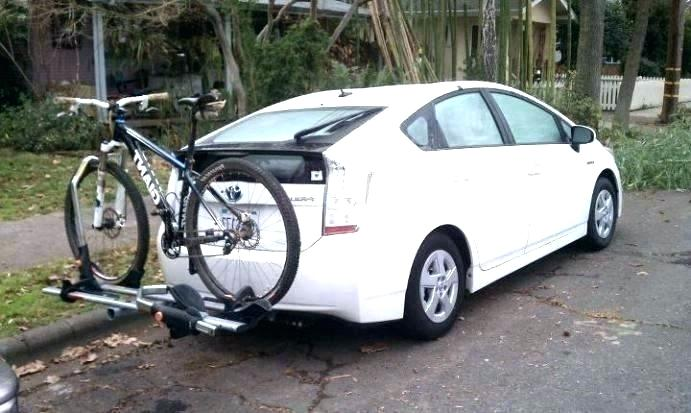

If you like outdoor biking with family and friends, finding the best Prius bike rack this year. I know it can be a task and particularly confusing with so many different bike carriers being available, but don’t worry, I am here to make the shopping process easier for you.

My goal is to help you narrow down options to only the best bike racks for Toyota Prius, and hopefully save you a buck or two in the process.

There are 3 Prius bike rack designs available:

- Trunk mounts

- Roof mounts and,

- Hitch mounts.

If you are looking forward to purchase the best bike rack for your Prius, you need this guide.

I have taken time to do the best selection for you in order to save you time and energy that may be needed in visiting different shops and stores looking for one.

Considering the speed of the car especially on the highway, a bike rack for Prius should be stable and should fit the vehicle properly, securely transport your bikes and fall within your budget. The wrong rack could be a safety hazard, scratch your vehicle and possibly lead to a lost, stolen or damaged bicycle.

You should also note that a bike rack even without bikes mounted, will negatively affect your vehicle’s gas economy as it leads to slowing down the speed of your vehicle leading to reduced gas mileage. With this information, you note that it’s not good to keep your bike racks always mounted when not in use.

## Best Toyota Prius Bike Racks Comparison Table

\[content-egg module=Amazon template=list\]

## Factors to Consider When Buying a Bike Rack for Your Prius

The key to choosing the right bike rack for your Prius is accurately defining your needs and the vehicle you have. Before buying a bike rack for your Prius, first ask yourself these questions.

- How often will you be using it?

- How many bikes do you need to transport?

- Will you need to change the racks between vehicles? i.e. change the racks from vehicle 1 to vehicle 2.

- How much are you willing to spend on your bike rack?

- How important is the security for your bike and rack?

- How high can you lift a bicycle by yourself?

- Do you have a special bike that you need transported, like a bike with an odd-shaped frame?

- Does your Prius already have a tow hitch or roof-mounted utility rack? Also look into its load capacity.

- Does your vehicle have a rear-mounted spare tire that may interfere with your bike rack?

## Types of Racks For Toyota Prius

There are three distinct categories of bike racks. The Strap-on Trunk Racks, Hitch-mount Racks, and Roof Racks. All the three types have their good and bad sides.

Also remember that not all are available for every vehicle. There are also special racks that are designed specifically for certain vehicles e.g. Pickup tracks, SUVs and now the Prius.

Some trunk racks can be used above the bed, allowing for storage underneath. Others have specialized mounts that can be attached to rear-mounted spare tires.

Let us now look closely at the strength and weaknesses of the three main types of bike racks.

### Strap-on Trunk-mounted Bike Rack

They are the least expensive option, typically going from 40$ and 200$ though some models can go up to 300$. The straps are attached to the car’s trunk hatchback or rear bumper.

The bike's frame rests on plastic-coated support arms but there are more improved carriers that have padded or indented cradles to hold the frame. These carriers must be strapped tightly to the vehicle with the frame supports and carrier arms properly oriented before mounting bikes.

They typically carry one or two bikes and in some cases three. Yes, they are not expensive and fits many vehicles, but they pose a greater chance of damaging the vehicle and the bikes than other designs.

Pros

- They are not vehicle specific; one carrier can fit many vehicles.

- Easier to lift and fit your bikes in place.

- It can easily be stored even in the vehicles trunk.

- They are quite affordable.

Cons

- The combined weight of the rack and the bikes rests on the vehicle’s body panels which can damage the vehicles paint or sheet metal.

- They may block the drivers view through the rear window.

- Straps can get loose, wear out or snap.

- Trunk-mounted spoilers can interfere with installation.

- The straps can be cut easily compromising the security of both the bikes and the rack.

- Bikes may be damaged from backing into an object or being hit by another vehicle.

- Padding may need to be added between the bikes to keep them from banging into each other and causing scratches.

- The vehicle’s trunk cannot be opened with racks installed.

- Extra attachment may be needed to support odd-framed bikes.

### Roof-mounted Bike Rack

It is the most versatile bike rack for your Prius but a bit difficult to use. Some of these racks can be attached on already existing roof rack and crossbars while others use mounting feet and clips that attach to a vehicle’s upper door frame and rain gutters. You will get a reduced price if your vehicle is already equipped with a roof rack or crossbars that will support the bike’s mount.

The basic racks start at less than 50$ per bike but the more improved models starts at around 100$, but if you need to buy the basic roof rack and crossbars, you should add about 125$ to 200$ to the total cost. When you select a roof rack, you also select the method of mounting the bikes. Some racks use a fork mount carrier that clamps onto the bike’s front wheel fork. The disadvantage is that the front wheel must be removed and stored elsewhere. However, the bike is easier to manage up on the roof and bikes with unique frame shapes can be accommodated.

The upright mounts holds the bike by the frame or pedal crank such that you don’t need to remove the front although you need to reach up higher to put the bike on, and some unusual bikes frame shapes won’t fit.

Pros

- The modular setup allows additional cargo storage with an added-on storage case.

- The rack can also be used to transport other materials like skiing and canoeing materials.

- There are lockable mounting available in the market.

- The roof racks can hold as many as four bikes or even seven depending on the vehicle.

- They can also support odd-framed bikes like the tandem and the recumbent.

Cons

- May be complicated to install.

- Vehicles can’t go into packing garages or under any overhead structure with low clearance.

- The increased wind resistance reduces gas mileage than other types making it a bit uneconomical.

- They produce more wind noise.

- Lifting a bike onto a tall vehicle can be difficult which can result to mishandling the bikes causing scratches to the car’s roof or sides.

- May not fit properly on curved-roof vehicles or convertibles.

- It touches the vehicle’s body that may lead to scratching the vehicle’s paint.

- It is not recommended to carry heavy rooftop loads due to interfering with the Centre of gravity that can compromise the vehicle’s stability leading to rollover accident.

### Hitch-mounted Bike Rack

Hitch mount racks are the most expensive but the easiest to operate. They come in different sizes to match the class of hitch on different vehicles. Class 1 hitches with 1.25 inch openings are designed for most cars. Class 3 hitches with 2-inch openings are usually found on pickups and truck-based SUVs, but your choice will depend on the number of bikes to be transported. Racks for class 1 hitches rarely carry more than three bikes and class 3 hitches though capable of carrying many bikes, they cannot be adapted to most cars. A single bike hitch can be found for under 100$ and over 125$ for popular brands and swing-away models can go for as much as 400$.

Some hitch mount racks secure bikes in mounting compartments much like the ones used with roof-mounted models. Others require you to strap the bikes securely to the carrier. With the hitch-mounted carriers, you need to keep the bikes from scratching each other.

Pros

- Very easy to install. You just slide it into the hitch.

- You don’t need to remove the front wheel to mount the bike.

- Easier to lift and secure bikes in place.

- There is reduced chances of scratching vehicles paint when mounting bikes.

Cons

- There is an added expense of the trailer hitch in case your vehicle does not have one.

- Some hitches require drilling holes into vehicle’s chassis or cutting rear fascia. This may ruin the vehicle’s appearance when the hitches are removed.

- Some small vehicles are not rated for towing, and mounting a tow hitch can affect the warranty or cause problems when the vehicle is being serviced.

- Installed rack may block access to the vehicle’s rear lift gate; the swing-away models that provide better access are a bit expensive.

- Padding may need to be added between the bikes to keep them from banging into each other and causing scratches.

- Bikes may be damaged either from banging into something or being hit from behind.

- May need extra attachments to support odd-framed bikes.

- May block the drivers view out of the rear window.

- It’s difficult to lock bikes into the rack.

## Top 7 Bike Racks for Prius

### 1\. Thule T2 Pro XT 2 Hitch Rack

It is the best Hitch Rack for Prius. There are many reasons this bike rack is being featured among the best racks for your Prius. Just to mention a few, the Thule T2 Pro has an auto attaché which allows you to detach the bike rack from your vehicle without using any tool.

It’s easy to use, quick to set up and reliably secure. Attach it to your vehicle quickly with the tool-free Auto-Attach System then [lock your bikes](https://mtbnz.com/best-lightweight-bike-locks/) to the rack and secure it to the receiver with the integrated cable lock and lock knob. The installation process of this bike rack is so simplified that you don’t need much time to attach it to your car.

When not in use, the T2 Pro XT easily folds towards the vehicle and tilts away from the vehicle for rear access. The load capacity is up to 120lbs, or up to 60lbs per bike. It eliminates bike interference by adjusting side to side to create spacing between each bike.

It’s capable of carrying up to two bikes at a time with wheels inches ranging from 20’’ to 29’’, and up to five tire inches without using an adapter. It also has an allowance of 190mm between each bike to prevent bike contacts while in transit.

The bike rack has powder coat finish that helps it to look good and withstand normal wear and tear. The coating also helps it when exposed to weather conditions by preventing rust.

Pros

- Accommodates different sizes of bikes.

- Corrosion free protection.

- Can carry up to two bikes.

- It has an anti-sway feature that keeps the rack in position.

- It’s easy to install.

Cons

- There is an added expense for a trailer hitch if the vehicle doesn’t have one.

- Some require drilling holes into the vehicle’s chassis that may ruin the appearance of your vehicle.

- Not suitable for bikes with odd frames.

### 2\. BUZZRACK Entourage Bike Platform Hitch Rack

It’s a Fat Tire compatible bike rack that can fit 1-1/4 inch and 2 inch receiver hitches. This makes loading bikes easier and convenient. The low platform means no overhead lifting and no wheel removal required to load up to three bikes of almost any frame design or wheel size.

It comes with movable wheel trays with ratcheting straps and padded frame clamps to secure bike while on transportation. Quickly adjust the wheel trays to accommodate women and kids bikes, off-road , full suspension and 29 inch E-bikes, then easily secure the bikes with a no-fuss ratchet straps and padded frame clamps and lock them all down with the integrated clamp locks. This ensures that your bikes are always protected.

The racks tilts down to allow convenient access to the rear hatch or tailgate, and with no bikes attached, the platform folds up flat to make parking and storage easier. It’s constructed with heavy duty powder coated steel to increase its durability.

Pros

- Compatible with fat-tire bikes.

- The platform makes loading easy.

- Ensures the bike are protected.

- Made of heavy duty powder coated steel and therefore durable.

- Easy to fold and easy to store.

Cons

- Requires a lot of knob twisting.

- Not fast enough to hold more than two bikes.

- The bikes pedals scratch each other’s body.

### 3\. Saris Bones 3 Trunk Rack

It’s the best Trunk Rack for Prius. The Saris Bones 3 is one of the best pocket friendly bike racks that is high performing. It is known for its features, its competitiveness and affordability. If you are looking for a bike rack that is well designed and durable, the Saris Bones 3 is the bike rack to go for.

It’s made of steel material that makes it stronger and prevents it from corrosion. It’s also made up of non-rusting materials that are recyclable. It holds a tested sense of style, design, convenience and durability. The Saris Bones Trunk Rack is not only the best looking rack on the market but also makes transporting your bike or bikes from one point to another very easy.

It carries up to three bikes and its Arc-based design fits Sedans, Hatchbacks, Minivans, Suvs and nearly all cars with rear spoilers. The rubberized feet protects your vehicle and the coated straps protect your bike. This rack also has the strongest frame due to the injected-molded arms and legs. It weighs only 11lbs and it’s constructed with rust-free, 100% recyclable materials.

The Saris Bone 3 Bike Racks are available in a wide array of colors to choose from. Pick the color that will match your personality or a cause that’s close to your heart. The Arch-based design fits over most spoilers and separates bikes on different levels. Its injection-molded arms and legs are the strongest on the market. It safely carries 3 bikes up to 35lbs each and also compatible with most vehicles.

It consists of an anti-sway straps for a secure bike hold and an articulated rubber feet and vinyl-coated hooks that protects the vehicles’ finish, a spring buckle straps that protects the bike’s paint.

Pros

- It’s lightweight.

- Made of non-corrosion materials.

- Easy to adjust hold down ratchets.

- Fits almost all sizes of bikes.

- Can be easily stored even in the vehicle’s trunk.

Cons

- If not properly installed, it may damage your car.

- Straps can come loose, wear out and snap.

- Not suitable for bikes with odd frames.

### 4\. Allen Sports Premier Hitch Mounted Bike Rack

This bike rack for Prius has hitch inserts that fits 2 inch receiver hitches, Quick Fold Carry Arms design which allows the carry arms on the racks to be dropped out of the way when not in use by simply squeezing the two red release buttons on the carrier.

The dual compound tie-down cradles and quick set straps individually secure your bikes in place and work with a wide range of tube sizes. The tie-downs includes a soft cradle bed to fully protect your bicycle during transport.

The Allen sports premier hitch racks also feature an easy to use rapid tilt-away main mast, a rugged internal mechanism that keeps the rack securely in place when in use. It also allows for single handed tilt-away if you need access to the inside of your vehicle. The no-wobble bolts on the other hand  eliminates rack movements inside the hitch and offers a soft gray landing pad to protect even the inner-most bicycle during transport.

Pros

- Easy to set-up

- Easy to access the trunk and the back of the vehicle.

- The powder coat wears down during assembly.

- Easy to fold and store.

- Allows single handed tilt away.

Cons

- The tension bolt is hard to remove.

- The bike hit each other when stack together.

- It’s a little sloppy on the receiver.

### 5\. Hollywood Racks Expedition Trunk Mounted Bike Rack

The Hollywood rack is the best for someone who does not want to deal with complicated manuals. This bike rack comes fully assembled and ready for use. When you are on a road trip, storage is always a challenge, but this bike rack is here to change that. The bike rack occupies less space in your trunk as it fold down to a flat shape. The cradles arms are able to be folded down as well when they are not in use.

Creation of this product has utilized the best technology. It’s designed with anti-vibration technology to prevent excess vibration from the straps. The rubber anti-sway bike cradles and EPDM rubber straps holds the bikes firmly in place. It’s capable of carrying a maximum of 35lbs per bike.

It’s fully adjustable to fit most vehicles including cars with spoilers, comes with adjustment hubs with quick release levers that are easy to use and six attachment straps that keep the rack securely fastened to the vehicle. It allows you to include your family and friends as it is able to carry up to three bikes at a time.

Pros

- Loading and offloading is simple.

- Installation is easy.

- Maintains its stability when loaded.

- Able to fit different bike sizes and bike frames.

- It’s not vehicle specific.

Cons

- The straps loosen up on bumpy roads.

- No security features installed.

- May block driver’s view out of rear window.

### 6\. Allen Sports Deluxe Hitch Mounted Bike Rack

Allen Sports Deluxe is one of the bike racks available for your Prius. It has a load capacity of 120lbs. it can carry even the heaviest bikes without fearing that the rack will be damaged. This bike rack also allows you to include lots of family and friends as it can carry up to four bikes at a time.

The racks feature individual Tie-downs which offer protection to the rack. Its frames are padded in order to protect the paint on your Prius from being damaged and the additional side’s straps give the rack stability and keep the rack sturdy even when cutting sharp corners.

It also offers easy access to the rear of your vehicle as the bike rack tilts away from the vehicle. Its cradle arms can fold down easily when they are not in use. This gives you enough space for its storage. Installing it in its position is also an easy task with the help of the No-Wobble bolts that are included. You don’t need any special tool to install tis rack.

This bike rack for Prius is also affordable and durable. I can say it's affordable considering the features offered with this it. It does not rust due to its black finish paint that prevents rusting even when exposed to water; this makes this bike rack suitable for use in all weather conditions. It’s designed with steel body, strong and able to carry multiple bikes. It carries a maximum capacity of 70 lbs per bike.

Pros

- Steel material for strength and durability.

- The no-wobble bolts helps in faster installation.

- The bike rack is pre-assembled.

- It’s affordable.

- High performance.

Cons

- Not installed with anti-theft system.

- The metal clips that fasten the straps to the car are not cushioned.

- Not suitable for fat tire bikes.

### 7\. Kuat Transfer 2 Hitch Bike Rack

I can say that this is the ultimate rack for your Prius because of many attractive features it comes with. It can carry up to two bikes at a time at the back of your Prius. The rack has zero contact with the frames and it holds the bikes by the wheels. It has ratcheting hooks that minimizes the hassle of loading and offloading your bikes on and from the rack.

To make it even more easy to use, the Kuat Transfer has a tilt away feature that helps the rack to be tilted away from the rear of your vehicle if one needs to get something from the trunk of the vehicle. The rack also folds up when it’s not in use for easy storage.

It’s a budget friendly product that’s made of steel and finished with a gray powder that’s corrosion resistant. It’s a 2 bike capacity rack, fits both 1.25 and 2 inch receivers. It has a perfect fit adjustment system that ensure your bike will fit just right and the foot pedal lever allows full access to the rear hatch of your vehicle by simply folding the bike rack away from your Prius. It has no contact with your bike frame. It fits 20-29 inch tires, and holds up to 3 inch tires with a 47 inch maximum wheel base.

Pros

- The steel construction ensures its durability.

- Tilt away feature gives you access to the trunk.

- Folds up for storage.

- Can accommodate different types of bike sizes.

- Easy to install.

Cons

- Security locks are not included.

- Does not have light deflectors.

- It’s a bit loose in the hitch.

## Conclusion

Bike racks are significant tools and also an investment. Make sure you invest in a model that will satisfy your needs, a bike rack that will transport your bikes without causing damage to your Prius or to the bikes. The examples I have listed above are the best in the market. I believe this guide will give you an easy time when choosing your bike rack so that you may enjoy carrying your bikes anywhere.
