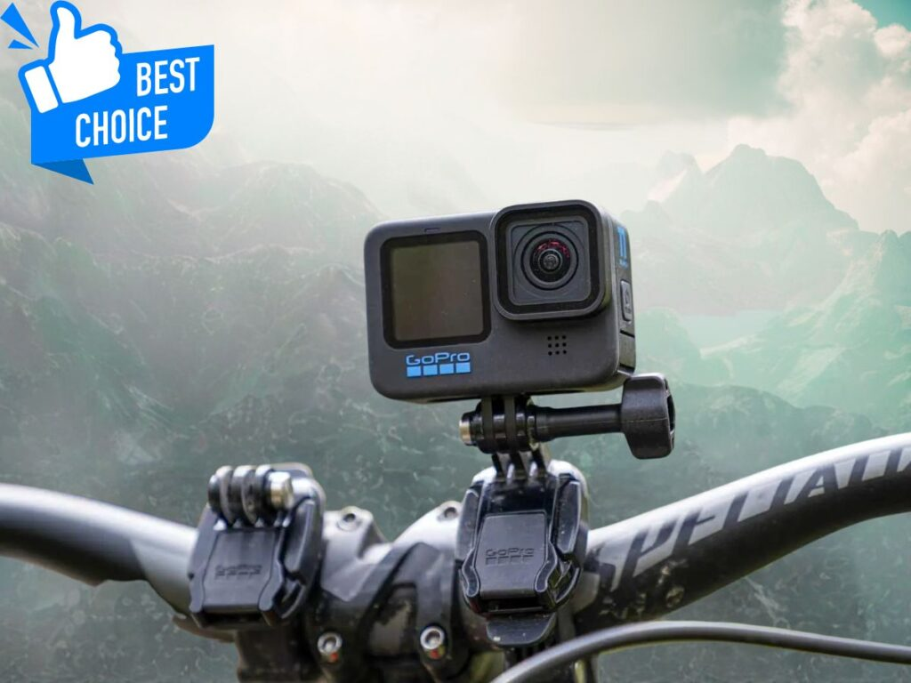
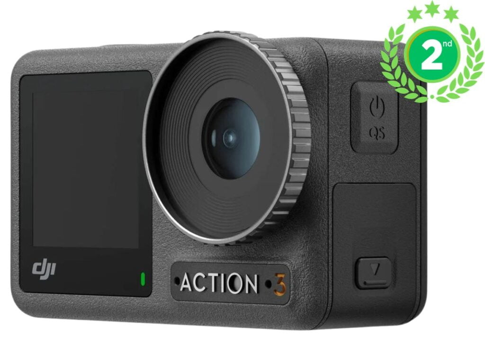
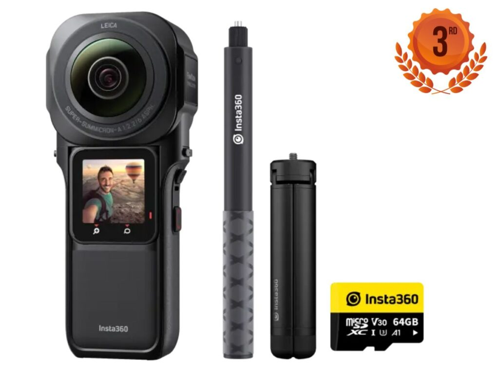
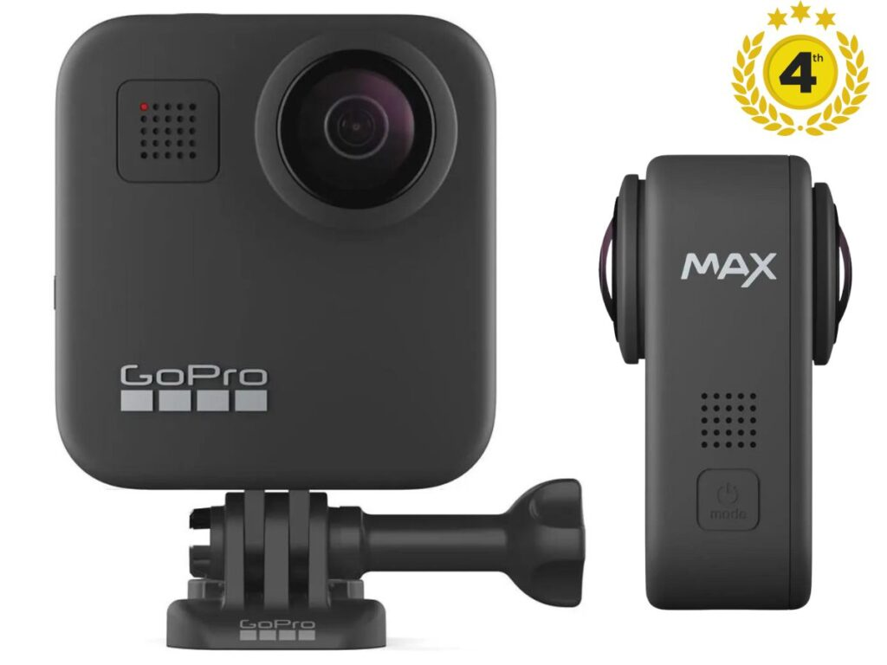
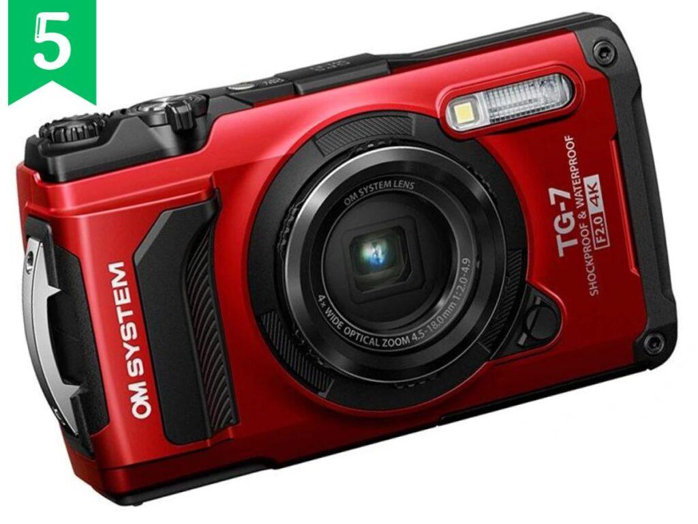
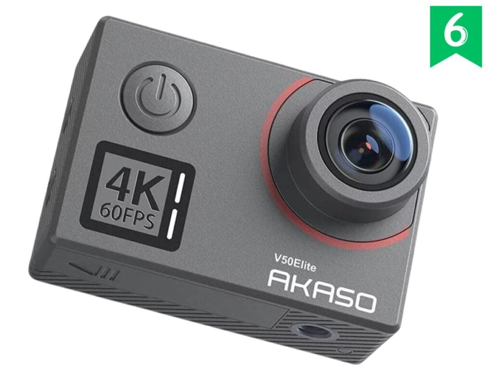
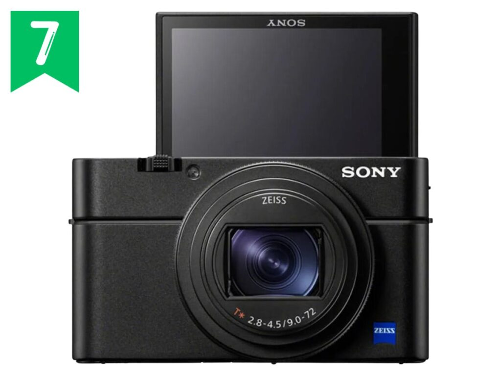
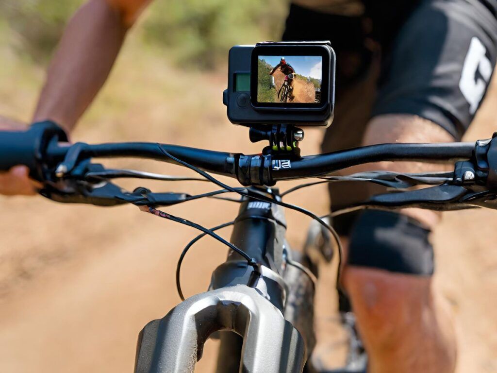

Whether you're a downhill daredevil or cross-country explorer, capturing your mountain biking adventures in stunning detail takes the right action camera.

After hitting the trails and testing the top models on the market, we've narrowed down the best action cameras specifically for mountain biking. These rugged cameras can handle the crashes and weather while shooting smooth, high-quality footage of your epic rides.

The cameras are packed with cutting-edge tech like image stabilization, voice control, and 4K video to turn your rides into cinematic masterpieces. Plus, they're designed for simple one-button operation, even with gloves on.

## Best Camera for Mountain Biking Photography

Show Summary

**Here is a list of the best action cameras for mountain biking photography in 2024:**

1. **GoPro HERO11 Black**: Best for low-light performance.
2. **DJI Osmo Action 3**: Best for pro-level 4K quality.
3. **Insta360 ONE RS 1-Inch Edition**: best for 360 video.
4. **GoPro MAX**: Best for VR-ready footage without the learning curve.
5. **Cycliq Fly6 CE**: Best Integrated Safety Light + Camera.
6. **Olympus Tough TG-6**: Best Rugged Camera for Mountain Biking Photos.
7. **AKASO V50 Elite**: Best Budget Action Camera.
8. **Panasonic Lumix FT7**: Most Durable Camera for Mountain Biking.

## [GoPro HERO11 Black](#) - Best MTB Action Camera for Low Light

#### Key Features

- Shoots stunning 5.3K60, 4K120, and 2.7K240 video
- 27MP photos with improved HDR and night modes
- HyperSmooth 5.0 stabilization with Horizon Lock
- Rugged, waterproof design
- Built-in mounting fingers and folding fingers
- Intuitive touch controls and voice commands

- **Reasons to Buy**: The GoPro HERO11 Black takes the medal for the best all-around action camera for mountain biking photography. Its upgraded image sensor and low-light performance allow you to shoot crisp 5.3K video even under forest canopy.

- **Reasons to Avoid**: The only real negatives are the price and battery life. $500 is a lot for an action cam, and you'll need spare batteries for all-day shoots. But for pure performance and quality, the HERO11 Black is hard to beat.

#### Our Verdict

The HERO11 Black makes capturing killer mountain biking footage easy with preloaded shooting modes like TimeWarp 3.0 for stabilized hyperlapse videos. It features a large new image sensor capable of up to 5.3K video resolution and 27MP photos. This allows it to capture crisp, highly detailed footage even in low-light conditions.

The star of the show is GoPro's latest [HyperSmooth 5.0 stabilization](https://amzn.to/47Rmzxo) with Horizon Lock built-in. Even on rough downhill tracks, the footage stays smooth and steady, almost like it was filmed using a gimbal.

I was blown away by how well it handled fast panning motions and vibration from mountain bike tires rolling over rocks and tree roots. No other action camera comes close in terms of stabilization.

As expected from GoPro, the HERO11 Black retains the rugged, waterproof construction that makes these cameras so versatile to mount on [MTB helmets](https://mtbnz.org/best-mountain-bike-helmets/), [bike frames](https://mtbnz.org/best-mountain-bike-frames/), chest harnesses - you name it.

It survived several crashes unscathed during testing. The built-in waterproofing down to 10 meters means you can film epic splashes through puddles and streams without worrying about damage.

The camera's battery life is another significant improvement over previous models. The [HERO11 Black](https://amzn.to/47Rmzxo) uses an advanced 1720mAh lithium-ion battery, which extends recording time by up to 38% in moderate temperatures over previous GoPro cameras and batteries. This means you can capture more of your ride without worrying about running out of battery.

[Buy on Amazon](https://amzn.to/3QQwsV3)

## [DJI Osmo Action 3](#) - Best MTB Camera for Pro-level 4K Quality

#### Key Features

- Shoots sharp 4K120 and 1080p240 slow-mo
- 155 ̊ wide-angle lens
- RockSteady stabilization with HorizonSteady
- Front and rear color displays
- Solid audio with wind reduction
- Intuitive touch controls

- **Reasons to Buy**:The combination of excellent stabilization, ruggedness, long battery life, dual screens, and high resolution capture make the DJI Osmo Action 3 a great choice for mountain biking videography and photography.

- **Reasons to Avoid**: 4K60 would've been nice for added flexibility in post. Low light performance also isn't on par with the HERO11.

#### Our Verdict

Right out of the box, the [Osmo Action 3](https://amzn.to/46r16Kx) feels extremely durable and premium. The metal frame and Gorilla Glass lens cover can clearly withstand a lot of shocks and impacts, which is crucial for mountain biking.

We also liked the new magnetic quick-release system - it makes swapping mounts effortless while still keeping the camera securely locked in. The camera is also fully waterproof down to 16 meters without any housing required.

In our experience, the image quality of the Osmo Action 3 is on par with the [GoPro Hero 11](https://amzn.to/3QQwsV3), especially with the latest firmware update that enables 10-bit color. 

Footage is sharp and stabilized even in low light conditions thanks to the f/2.8 aperture lens. The wide field of view captures more peripheral action which is great for conveying speed.

For mountain biking, the different stabilization modes like _RockSteady_ and _HorizonSteady_ work amazingly well to smooth out vibrations and bumps even at high speeds.

Having tested all three levels of RockSteady stabilization, we found _Horizon Balancing_ to be the best for mountain biking photography. It smooths out bumps and vibration in the pitch axis while keeping some natural movement that looks pleasing for action sports. _Horizon Steady_ locks the horizon perfectly but looks too "floaty" in my opinion.

[Buy on Amazon](https://amzn.to/46r16Kx)

## [Insta360 ONE RS 1-Inch Edition 3](#) - Best for 360 Video

#### Key Features

- Shoots 5.3K 360 video and 21MP 360 photos
- Interchangeable lenses including 4K boost lens
- Invisible Selfie Stick allows "floating" effect

- Advanced low-light performance
- Built-in Horizon Lock
- OverCapture lets you create traditional video from 360 footage

- **Reasons to Buy**: If capturing 360 footage for VR goggles or creative edits is a priority, the Insta360 ONE RS 1-Inch Edition 3 is your camera. A large image sensor brings pure magic to 360 video.

- **Reasons to Avoid**: Our only gripe is the battery life. You'll need to pack extras and some type of external charging bank for long days.

#### Our Verdict

The [Insta360 ONE RS 1-Inch Edition](https://amzn.to/40RuKaF) is a dual 1-inch sensor 6K 360 camera. It offers the ability to shoot 6K video with _FlowState stabilization_ and 21MP photos, providing a high dynamic range and excellent low-light performance. This makes it ideal for capturing the fast-paced, high-intensity action of downhill mountain biking, even in varying light conditions.

It delivers unparalleled image quality compared to other consumer 360 cameras we’ve used. The massive 1-inch sensors provide superior low-light performance, capturing crisp details even in dark forest sections. Shadow areas retain more information due to the high dynamic range.

And the 6K video resolution enables reframing stunning 4K footage in post without losing sharpness.

A key advantage of the [_ONE RS system_](https://amzn.to/40RuKaF) is its modular design enabling lenses to be swapped to suit different shooting needs. 

For mountain biking, we opted for the 1-inch 360 module to capture immersive point-of-view along with alternate perspectives. But the 4K boost lens can be used for standard wide angle POV similar to a GoPro. This versatility in a rugged, compact form factor is ideal for diverse outdoor action.

After effortless offloading of footage via the Insta360 app, we found its suite of editing tools allowed quick enhancement of clips using keyframe selection, speed ramping and more. 

The excellent flowstate stabilization ensured even handheld follow camera clips were easily smoothed. For mountain biking videos, the [_ONE RS 1-Inch Edition’s advanced capture capabilities_](https://amzn.to/40RuKaF) combined with Insta360’s user-friendly editing make the production process seamless from trail to upload.

[View on Amazon](https://amzn.to/40RuKaF)

## [GoPro MAX](#) - Best for VR-ready Footage

#### Key Features

- Shoots 5.6K 360 video/photos
- HyperSmooth stabilization
- 1080p live streaming capabilities

- Built-in horizon leveling
- Waterproof without housing to 16ft
- Voice control for hands-free operation

- **Reasons to Buy**: The GoPro MAX 4 makes shooting and editing 360 easier than any other action camera we've tried. If you want great VR-ready footage without the learning curve, the MAX delivers.

- **Reasons to Avoid**: While the GoPro Max excels in capturing 360-degree shots, it's not ideal for 2D media. The forward-facing 2D Hero video mode, at its highest resolution, leaves something to be desired

#### Our Verdict

The [GoPro MAX](https://amzn.to/47rnfd1) offers a unique 360-degree capture capability, which can add a new dimension to your mountain biking videos. This feature allows you to capture everything around you and edit the shot composition later, providing a level of creative freedom that's hard to match with traditional cameras.

With its dual 180-degree lenses, the MAX captures 5.6K 360-degree videos and 16.6MP 360-degree photos, providing immersive footage of your rides.

Like other GoPros, the MAX is built tough to handle crashes, mud, and weather. It's waterproof down to 16ft without a case, so you can ride in rain or through streams without worries.

The MAX can record up to 78 minutes of 5.3K video per charge. For longer rides, we recommend picking up a couple of spare batteries. The camera is quick to recharge, with a full charge taking around 2 hours.

One of the key advantages of the [GoPro MAX](https://amzn.to/47rnfd1) for mountain biking is its ability to reframe 360-degree footage into traditional flat videos with your choice of aspect ratio, such as 16:9 or 4:3. This allows you to capture every angle of your ride and choose the best perspective during post-production.

[View on Amazon](https://amzn.to/47rnfd1)

## [Olympus Tough TG-](#)7 - Best Rugged Camera for Mountain Biking

#### Key Features

- Shoots vibrant 12MP photos
- Waterproof to 50ft
- GPS, compass, accelerometer, and Wi-Fi
- Crushproof to 220lbf
- Numerous accessories for mounting
- Fast f/2.0 lens

- **Reasons to Buy**: This camera is built to endure mountain bike abuse. With reinforced glass and composite materials, the TG-7 is virtually indestructible so you can focus on shooting.

- **Reasons to Avoid**: Poor image quality in low light conditions.

#### **Our Verdict**: Most Rugged Action Camera for Mountain Biking

The [Olympus Tough TG-7](https://amzn.to/3GiSdrQ) is a compact, go-anywhere camera that's built to withstand the rigors of outdoor adventures.

Its durability is one of its standout features, with the ability to withstand drops, crushing forces, and extreme temperatures. This ruggedness makes it an excellent choice for mountain biking, where it can handle the bumps, shocks, and occasional falls that come with the territory.

Additionally, the TG-7 records crisp, stable 4K video at 30fps, which is essential for capturing fast downhill runs and trail feature. Its dual sensor-shift stabilization effectively reduces camera shake when riding over bumpy terrain.

While quality lags behind the superb stabilization and dynamic range of the [Hero11](https://amzn.to/3QQwsV3), the TG-7 produces pleasing 4K footage that easily meets the needs of most mountain bikers. Slow motion options in 1080p or 720p capture dramatic crashes and jumps.

Several bonuses make the [TG-7](https://amzn.to/3GiSdrQ) well-suited for mountain biking. The onboard GPS automatically geotags your location on images and videos while interval shooting modes create engaging hyperlapse videos of your rides. 

[View on Amazon](https://amzn.to/3GiSdrQ)

## [AKASO V50 Elite-](#) Best Budget Action Camera

#### Key Features

- 2" IPS touch screen
- 4K video at up to 60fps
- Battery: 1050mAh
- Voice Control: Supported
- Waterproof: 131ft/40m
- Wireless Connectivity: WiFi, remote control
- Photo Resolution: 20MP

- **Reasons to Buy**: The AKASO V50 Elite is a cost-effective action camera alternative to more expensive brands like GoPro. It offers similar features and capabilities at a fraction of the cost

- **Reasons to Avoid**: Subpar electronic image stabilization when shooting in 4K. The EIS works better at 1080p. At 4K it can cause a "jello effect".

#### **Our Verdict**: Best Budget Action Camera for Mountain Biking

The [Akaso V50 Elite](https://amzn.to/3Tg2Hjt) records crisp, stable 4K video at up to 60fps, allowing mountain bikers to capture fast-moving trail action in stunning quality. The Sony image sensor provides excellent dynamic range and color reproduction in both videos and 20MP photos.

While the 4K video quality meets expectations for the price, the V50 Elite does not have the absolute best image quality on the market. When compared side-by-side with footage from a [GoPro Hero 8](https://amzn.to/3GgiGWN), the V50 Elite shows slightly more graininess and lacks some vibrancy. But for the budget-conscious, the video is very good given the huge price difference.

The built-in electronic image stabilization (EIS) helps smooth out bumps and vibrations during mountain biking. It works fairly well when recording in 1080p and delivers usable footage. However, when shooting in 4K, the EIS has more difficulty stabilizing the image and results in a "jello" effect.

A major advantage of the V50 Elite is it comes with a full bundle of accessories for mounting on helmets, bikes, bodies, and more.

For casual mountain bikers and beginners, the [AKASO V50 Elite](https://amzn.to/3Tg2Hjt) represents excellent value as a feature-packed 4K action camera under $150. It delivers good enough video quality, stabilization, durability, and accessories to capture fun rides on a budget.

[View on Amazon](https://amzn.to/3Tg2Hjt)

## [Sony RX100 VII](#) - Best Integrated Safety Light + Camera.

#### Key Features

- WiFi and Bluetooth connectivity
- 4K video recording and HLG for HDR
- UHD 4K video at 30/25/24 fps
- ISO range: 100-12800
- 8x optical zoom
- Optical SteadyShot image stabilization
- 302g weight

- **Reasons to Buy**: Fast autofocus and tracking capabilities. The RX100 VII can quickly focus and track moving subjects, which is useful for capturing fast-paced mountain biking action.

- **Reasons to Avoid**: At around $1200 USD, the Sony RX100 VII is very expensive for a fixed lens compact camera. Many cheaper options can produce good 4K video.

#### Best Lightweight Action Camera for Mountain Biking

The [Sony RX100 VII](https://amzn.to/47R4bo2) packs a surprising amount of features into a camera body that can fit into your jersey pocket. It has a 20MP 1-inch sensor, 24-200mm zoom lens, rapid-fire 20fps continuous shooting, and 4K video recording.

The compact size coupled with this powerful performance makes it ideal for mountain biking. You barely notice it mounted to your helmet or chest, yet it delivers stunning image quality even in challenging lighting conditions on the trail.

One of the most impressive capabilities of the [RX100 VII](https://amzn.to/47R4bo2) is its autofocus system. It uses 357 phase-detect AF points and 425 contrast-detect points to achieve lightning-fast focus acquisition and tracking. This is a game-changer for mountain biking, where you are constantly moving over varied terrain. The camera locks on instantly and tracks your subject smoothly without hunting.

It even maintains focus when shooting video at up to 4K 30fps. This level of AF performance is unheard of for a compact camera.

The RX100 VII has built-in optical SteadyShot stabilization that works extremely well for reducing camera shake. When combined with electronic stabilization in video mode, the footage is remarkably smooth and stable. The stabilization even works at the full 200mm telephoto end of the zoom range, allowing you to capture steady long-range trail shots.

[View on Amazon](https://amzn.to/47R4bo2) 

 

## WHAT ARE SOME DESIRABLE FEATURES MOUNTAIN BIKERS SHOULD LOOK FOR IN A GREAT ACTION CAMERA?

- - ### IMAGE & VIDEO QUALITY
        

This may be one of the most important considerations because this is arguably the factor that will effect the quality of the finished video more than anything else. The first thing to look for will be the definition the camera is capable of filming in, and there are 2 basic kinds of definition to look for: HD (High Definition) and SD (Standard Definition).

SD cameras will usually be less expensive that HD ones, but users should be aware of the fact that SD cameras will produce videos of much lower quality. HD video cameras will come in 2 basic resolutions, and these are 720p and 1080p, respectively. For those that will be uploading their videos to the internet, 720p offers an competent level of performance at a reasonable price.

Another facet of image quality is frame rate. All things being equal, a higher frame rated will usually produce a higher quality video in most situations. Prospective photographers will want to select a camera that shoots at least 30 fps, but selecting a camera capable of filming at 60 fps will provide even higher quality videos, especially in fast action situations.

Finally, users should select a camera that can handle various levels of lighting; some days will be sunny and others cloudy or rainy, and it will be of vital importance to use a camera that can bring the best out of an image no matter what the ambient lighting conditions may be.

- - ### BATTERY LIFE AND MEMORY
        

It will be of little use to the rider if the battery of the camera runs out every half hour. Therefore, users should select cameras that feature at least several hours of reserve battery power, and should avoid cameras with built-in batteries. Not only will this make filming easier, but the rider will have to pack fewer spare batteries, thus saving space and weight.

Memory is also a common concern among video makers. Users should always make certain to purchase a camera that has space for an upgradeable memory card; this will enable the individual to easily upgrade to a higher level of memory whenever necessary.

- - ### SIZE
        

The prospective buyer should always purchase a camera that is small or large enough to be easily mounted wherever they please. In the case of helmet mounted cams, smaller is usually the better choice.

- - ### CAMERA CONTROLS
        

A decent mountain biking camera will come with easily accessible controls that will usually fit into the palm of the riders hand.

- - ### LENSES
        

Mountain bikers will in most cases find it very useful to purchase video cameras that feature lenses with wider angles. This will help riders avoid the annoying tunnel vision effect found on lenses with too narrow an angle. But individuals will not want the angle to be too wide, or they risk creating a fish bowl effect.

(^ Normal VS wide angles len)

- - ### AUDIO
        

Finally, bikers will want to purchase a camera with decent audio quality in case they want their viewers to experience the exhilarating sounds that come part and parcel with a great ride.

- - ### WEATHERPROOFING
        

In a perfect world, every mountain biking trip would feature sunny days and blue skies. In the real world, riders will have to deal with heavy rain at times. As a matter of fact, some riders may ever prefer to ride in less than perfect weather for one reason or another. The bottom line is, this means a lot of water – and perhaps mud – will possibly be showered on the camera.

### SLOW MOTION VIDEO CAPTURE

Because of this, riders will want to make sure that whichever camera that they settle on comes with a water/weatherproof housing. This will help to ensure that their investment is always protected from any water related damages.

There will be times when riders may want to give their videos a little extra style, and a mountain bike video camera that offers slow motion video capture is a great way to give videos a little extra character. Cameras that feature this kind of technology also generally offer simple photo capture as well. Thus, riders will want to obtain a camera that comes with these invaluable features.

### WHAT ARE SOME CREATIVE WAYS TO MOUNT THE CAMERA?

There are a few basic ways for riders to mount their cameras for variety and effect. On common and popular method is to mount the camera from the helmet of the rider. This provides the video with realistic and interesting perspectives, and really brings viewers into the riding experience. The camera may be mounted facing forward, backwards, or even sideways.

### WHAT ARE SOME OF THE BETTER BRANDS AVAILABLE ON THE MARKET?

Another great place to mount the camera is under the seat of the bike facing backwards, providing very interesting and varied pictures. A final common method is to strap the camera to the chest of the rider from a special harness. This gives watchers the feeling of being in the video without having parts of the helmet appearing in the frame.

There are several companies out there that make great cameras and are worthy of mention. These include:

- GoPro
- DBPower
- SJCAM

Mountain biking and video are a natural match that go great with one another. Riders who keep in mind the features mentioned in this article and look into some of the brand names that were mentioned will be sure to have the riding- and the filming – experiences of their lives.
