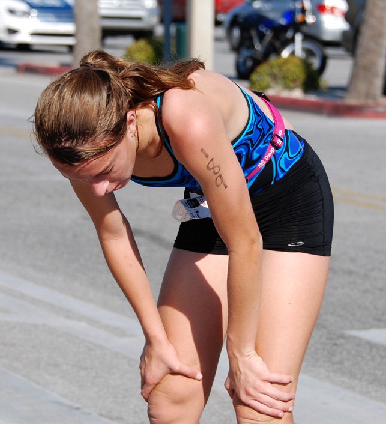

One of the most important aspects of preparing for a long-distance bike ride is nutrition, specifically carb-loading. carb-loading is a proven strategy for long-distance cycling events. It involves increasing your intake of healthy carbohydrates in the days leading up to your ride, which helps maximize your glycogen stores and improve your endurance performance. 

- Carb-loading won't necessarily [make you faster](https://www.onepeloton.com/blog/carb-loading/), but it will allow you to maintain your pace longer without fatiguing due to the larger amount of glycogen energy available.

### What is Carb-Loading?

Carb-loading essentially means consuming more carbs than usual leading up to an endurance event like your 100-mile ride. The goal is to maximize your muscle and liver glycogen stores.

- Glycogen is the form in your body that stores carbs for quick energy.

- More glycogen means more readily available fuel for your working muscles.

Multiple studies have shown that carb-loading improves performance in endurance events lasting over 90 minutes by 2-3%. For your [century ride](https://mtbnz.org/how-to-train-for-a-century-ride-100-mile-bike-ride-training/), that could translate to finishing 20-30 minutes faster if you carb-load properly.

### Why Carb-Loading is Effective for Cycling

Research has shown that a high carbohydrate availability before and during exercise is of major importance for endurance athletes, including cyclists. This is because glycogen is not only an energy substrate but also a regulator of the signaling pathways that regulate exercise-induced adaptations.

In [one study](https://www.ncbi.nlm.nih.gov/pmc/articles/PMC5909074/), long-distance athletes who followed a carb-loading regimen had better performance and higher glucose and lactate concentrations in the last 5 km of a 25 km time trial. Another [study](https://www.trainerroad.com/blog/how-to-use-carbs-for-maximum-performance/) found that consuming 60-90 grams of carbs per hour of cycling is vital for maximum performance.

## How Long Before a Long Bike Ride Should You Carb-load?

Carb-loading should ideally begin 2-3 days before your long bike ride. This period of carb-loading, combined with a tapered exercise regime, is considered the best way to prepare for any race that lasts longer than 75 minutes.

During this time, you should consume around 10g of carbs per kilogram of body weight per day. For example, if you weigh 70kg, you would need to consume 700g of carbs each day during the carb-loading phase.

The hard work will pay off on race day and continue to pay dividends throughout the rest of the year with added endurance, a bit of performance, and more importantly, confidence to know exactly how your body will respond under heavy training loads.

### Timing of Carb Intake

The timing of your carb intake can also play a crucial role in your performance. A good rule of thumb is to eat a carb-centric meal 3-4 hours before your event. During your ride, you should aim to consume simple carbohydrates, as they are absorbed faster and can provide quick energy. After your ride, it's important to replenish your glycogen stores by consuming carbs.

However, it's worth noting that the timing of carbohydrate ingestion during exercise does not seem to significantly affect performance in a cycling time trial. This suggests that the total amount of carbohydrates consumed may be more important than the timing of consumption

### How to Carb-Load Effectively

Carb-loading isn't about binging on high-sugar foods. It means eating healthily and sensibly but with a higher proportion of carbs than usual. A 70kg cyclist, for example, would require 600-700g carbs each day in the lead-up to the event. A sample day’s diet could look like this:

- Breakfast: A large bowl of porridge (60g carbs), a large banana (25g), and a glass of orange juice (25g)

- Mid-morning snack: Two teacakes with jam (45g) and a sports drink (40g)

Experts recommend that cyclists consume around 10g of carbs for every kilo of body weight between one and three days prior to the big event. This translates as around 900g of carb/day for a 90kg individual

Months of training should be followed by an adequate taper and a sound nutrition plan (inclusive of the [best endurance supplements](https://mtbnz.com/best-endurance-supplements-for-cyclists/)) to make certain that you are fully rested and properly fueled so that you can lay down the best performance on the big day.  And while you likely have a training plan that schedules out your activities for that final week, you may not have a structured nutritional plan.

So, as an athlete, you have undoubtedly heard of carbohydrate (CHO) loading in some shape, form, or fashion.  Yet, few folks fully understand the process or can correctly utilize this potentially valuable tool.

As it turns out, most of us confuse carbohydrate loading with a form of sanctioned gluttony where we consume large quantities of pasta the night before a big race believing that it tops off the tank instead of amassing on the thighs and mid-section.

The goal of CHO loading is to simply show up at the starting line with an elevated (super-compensated) level of muscle glycogen.  This extra glycogen can have an extremely significant effect on delaying fatigue in endurance events lasting longer than 90 minutes.  Studies indicate that **[fatigue can be postponed by roughly 20%](https://www.ncbi.nlm.nih.gov/pubmed/9291549)** while **[total stored carbohydrates](https://www.ncbi.nlm.nih.gov/pubmed/7615443)** can be increased by **[over 45%](https://www.ncbi.nlm.nih.gov/pubmed/7615443)**.

If you are targeting an Ironman, full-length marathon, or half Ironman, CHO loading can have a significant impact on your results. It won’t make you faster…you won’t post shorter times on a sprint triathlon or pedal harder at the start of your bike leg but it will enable you to continue at your normal pace longer. In other words, CHO loading can be critical in preventing you from ‘hitting the wall’.

  
_This is okay after the finish line, but not at mile 17 of a marathon._

## How Does Carb Loading Work?

Carb-loading has been practiced in sports for the better part of 30 years. Up until recently, however, research suggested that there was a requirement to have a “depletion” phase as the start of the CHO loading cycle. As such, the first several days of a 7-day protocol limited carbohydrate intake severely while moderate caloric expenditures were maintained via exercise. 

It is now known that this depletion phase is not required and significant CHO loading can be accomplished in 3 to 4 days. Even 36-48 hours of rest and high carbohydrate consumption have been shown to top off muscle glycogen.

It appears that the amount, rather than the nature, of the CHO consumed during a [**3-day equal calorie CHO loading**](https://www.ncbi.nlm.nih.gov/pubmed/18004688) may be the most overriding factor on subsequent metabolism and endurance running performance.

The recommended range of carbohydrates you should be consuming is pretty large, with a daily intake of 7-10 g of carbohydrates per kilogram.  In general, males should target a slightly lower CHO intake (6-8 g/kg/day) than females (8-10 g/kg/day).  Women who are CHO loading within 7-10 days after the start of menstruation should increase total dietary calories by 30-35% due to the **[influence of estradiol on glycogen storage](http://www.ncbi.nlm.nih.gov/pmc/articles/PMC2129154/?tool=pubmed).**

### Best Sources of Carbs for Cyclists

The classic carb-loading meal is pasta, whose caloric content is primarily due to starch, a polymer of glucose. However, it's important to note that not all carbohydrates are created equal. For instance, fructose, a type of sugar found in fruit and sugar-based foods, is less than optimal for carb-loading because it's ineffective at raising muscle glycogen levels.

Other effective sources of carbohydrates include vegetables, whole wheat pasta, and grains. These foods have low glycemic indices, meaning they have minimal effects on blood sugar levels, making them ideal for carb-loading

When it comes to the best sources of carbs for cyclists, you have a variety of options:

1. **Whole Grains**: Foods like pasta, bread, and oats are excellent sources of low-glycemic carbs, which your body absorbs more slowly, providing longer-lasting energy.

3. **Fruits**: Fruits like bananas, dates, figs, dried apricots, raisins, sultanas, and cherries are great sources of carbs from naturally occurring fruit sugars.

5. **Energy Bars and Gels**: These are convenient sources of fast-acting carbs that you can easily consume during your ride.

7. **Sweet Potatoes**: These are a great source of complex carbohydrates, which provide sustained energy

### Hydration is Key

In addition to carb-loading, don't forget to hydrate. Increase your water intake the day before the endurance event. For every gram of carbohydrate stored in the body, three grams of water are stored as well.

### Carb-Loading During the Ride

During the ride, you'll need a fuelling strategy that delivers regular hits of simple-to-eat, easily digestible carbs. Most people use a combination of chews, gels, bars, and drinks

## _**Putting it all together**_

You’ll likely need to try carbohydrate loading as part of your normal training activity, especially in the days leading up to exceptionally long rides and long runs to get the timing right, learn the overall process of what works and what needs to be changed.

As with any dietary change, there can be some stomach upset by switching foods, so keep in mind that you’ll want to stay with the easier digested foods and foods you enjoy… and who doesn’t enjoy bread, pasta, rice, potatoes.

However, stay away from empty calories.  High fat and high protein foods should only be considered once your carbohydrate demands have been met.

Don’t get tricked into fuelling up with rich desserts and cheesy pasta dishes, which are often favorites at carbo-loading evenings. These dishes are often higher in fat than carbohydrate and can hinder your ability to reach your carbohydrate targets.

For starters, try a 2-day carbohydrate load at the higher end of the intake (say 8-10 g/kg/day) before your weekend long run or bike.  On another week, schedule a 3-day loading period at the lower end of the band (say 6-8 g/kg/day).

The stereotypical 150 pound person equates to 68 kg of body mass (pounds divided by 2.216 equals weight in kilograms).  Therefore, 6 g CHO/kg for a 68 kg person would be 408 grams of carbohydrate or 1632 calories… and that’s a lot.  For a 150 pound, 5’7” female, the daily caloric requirement assuming no exercise is around 1700 calories.  Add exercise expenditure (say 500 calories from a 5 mile run) and daily expenditure totals 2200 calories.  As such, 1632 calories should be from carbohydrate and the remaining 568 should be protein and fat.

Be wary of high fiber foods, as they may hinder your ability to reach your carbohydrate demands and may have additional gastrointestinal consequences come race day. During the final 24 hours before an event, liquid meal supplements can be helpful, allowing you to meet carbohydrate targets while leaving you with an empty stomach that feels ‘light’ and ready to race.
