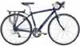
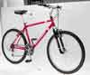
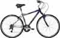
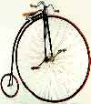
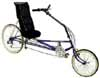
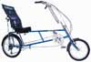
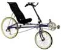
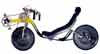
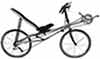
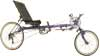

Introduction: Competitive and cooperative. This is a topic about which opinions differ greatly. Involving such a personal item as the bicycle, which delivers so much satisfaction (to one comfortable with it), for use in such a critical and stressful environment as city traffic, it is not surprising to find some passionately held views about what bicycle is better. This essay will offer opinions about all kinds of bikes, including some you might never have heard of.

### A competitive culture

This acrimony is made worse by bicycling's competitive culture. Sure, bicycles can be simple and fulfilling transportation, but the industry that this transportation relies on is sustained mainly by competitive activity.

There is racing: road, cross-country mountain bike, downhill mountain bike, and BMX. There are the daredevil competitions and ramp jumping of freestyle BMX.

Beyond professional competition is the culture of friendly bravado, where roadies dust their pals on the highway and mountain bikers shame each other with feats of daring-do.

Keeping this competitive edge takes some investment in bike maintenance and the [latest accessories](https://mtbnz.com/mountain-biking-accessories/), and this creates the conspicuous consumption which supports the bike industry, keeping it around for the rest of us. Thus the industry promotes this competitive aspect.

### A cooperative society:

Urban traffic, when it is done right, is a cooperative, not a competitive effort. What is really needed for good urban cycling is a bike that helps the rider to cooperate with surrounding traffic and to get the traffic to do the same.

This defies many of the standards used to judge bicycles, which center on how the bike does in competition. There is no reason why a competitive bike couldn't function well in traffic if properly equipped, but the act of equipping the bike, with the added weight and aerodynamic drag of the safety equipment, would almost certainly reduce its competitiveness.

#### What the urban cyclist needs:

In the curriculum of the Urban Cycling class, we suggest that some possible qualities for a superior city bike might be:

1. It is easy to start and stop (getting one’s feet securely to the ground).
2. It has good acceleration to get you away from stops and through intersections.
3. It can be made visible.
4. It is easy to watch surrounding traffic from it.
5. It has easy one-handed control, so that it is safe to signal from.
6. Ease of lifting and locking are also important, but not directly relevant to the class.
7. Top speed is not a priority, though higher speed riding does simplify some traffic situations. Acceleration from a stop (2) is where the power counts in urban riding.

\[content-egg module=Amazon template=list\]

### Upright bikes, AKA diamond-framed bikes

The road bike. This type is characterized by large-diameter, narrow width wheels and narrow handlebars with the brakes mounted either low or, in some cases, far forward. It is best ridden in an aerodynamic crouch, leaned forward over the handlebars. This suits the needs of road racers. There is a large population of road bikes that, while optimized by design for racing, are equipped with bargain-priced parts too cheap to race with.

The road bike characterizes many people’s ideas of bicycle commuting, for they were the dominant style of bicycle during the 1970's energy crisis, when bike commuting got a big boost. A wide range of gears made the bike more suitable for longer commutes needed to replace car trips. These bikes are generally lightweight, making for easier climbing, and have a narrow profile for better aerodynamics and top speed on flats and descents. Cargo capacity is limited, but proved good enough for commutes to the workplace.

Upright bicycles designed for long-range highway touring use a variation of the road bike design, with a slight altering of the frame’s proportions and sturdier construction to allow for the attachment of cargo racks.

Limitations on the road bike include difficult one-handed control. The crouched position places weight on the hands, and sustained hand signals require the rider to support their upper body weight on one hand, with that hand also charged with steering quickly in response to the natural wobbling of a moving bicycle. The crouched forward position makes some people nervous when going down steep hills. The low position of the handlebars do not give a good position for handlebar mirrors, but head-mounted mirrors are still usable. Toe retention systems, such as clips, straps, or clipless pedals, which fix the foot to the pedal for better ergonomics and efficient pedaling, are common to road bikes, but they have drawbacks in city traffic. Activities like starting and stopping quickly, such as shifting quickly from a position that visibly indicates waiting to one that visibly indicates the intent to start, or going quickly and safely to a complete stop with one foot on the ground, are all common in situations where right of way is uncertain. These important actions are complicated by toe retention systems. The narrow tires, designed for speed, can have difficulty cornering or dodging in rougher roadway conditions. A last limitation is that the gearing is often better suited for racing, without a suitably low gear for slow climbing on a hot day.

The mountain bike. This design grew slowly out of the idea of driving one-speed sidewalk cruisers down mountainsides. What finally emerged was a bike with a seating position, range of gears, and tires more suitable for the average person getting around town, and this design became popular during the 1980’s for sport, wilderness recreation, and short to medium range commuting. The focus of design is actually on a young person racing over difficult terrain, but with slight modification it becomes a fine bike for an ordinary person to ride comfortably over hilly terrain on city streets. The main alteration most mountain bikes need for urban use are smoother, higher-pressure tires.

The development of suspension and the wide-spread use of the mountain bike as a casual recreation bike created the “comfort bike,” aimed mainly at trail use, but still well suited for city use. These are still essentially mountain bikes, but often with more raised handlebars and a slightly dropped top tube for easier mounting. Comfort bikes may also use internally geared (IG) hubs, which are easier to use than the derailer transmission systems used on road and mountain bikes, but have a more limited gearing range.

Compared to road bikes, the handlebars of the mountain bike offer a better position for handlebar mirrors and more space for lights and audial alert devices (bells, horns). The more upright position gives easier one-handed control for sustained hand signals. Mountain bikes, or comfort bikes, generally mount cargo racks easily, given their beefy construction. The lower range of gears makes it more attractive for people riding in the city, where the ability to climb a hill with less exertion is more important than top speed. Those commuting longer distances may likely prefer a road bike, as it can cover ground much more quickly. One can often see bikes with a mix of road and mountain bike parts, but the mountain bike frame is characterized by cantilever brake mounts and more space between the rear wheel and the seat tube than a road bike frame typically has.

The BMX bike: This is a very lightweight and agile single-speed bicycle. It is stable down to a very low speed and is capable of fast acceleration due to its light weight. With a low seat (if any seat at all), it is easier to plant a foot for a quick, obvious stop. The BMX bike can also cross difficult terrain easily, even jumping entirely over an obstacle if the driver is so willing. Vantage from a BMX bike is generally good as the driver has an upright position and easy twisting of the neck and body to look about. The handlebar position is good for mirrors, but one rarely sees BMX bikes equipped with them.

BMX bikes typically come with 20 inch wheels. Larger wheel models are available, sometimes called "BMX Cruiser," though some people think of such bikes as variants of the mountain bike (above) or 1-speed cruiser (below).

The disadvantage of the BMX bike is that it is proportioned and designed for someone with a high power-to-weight ratio, typically kids and young adults with sturdy joints. The one-speed drivetrain relies on high torque pedaling and low weight to get its good acceleration. These bikes don’t often have the fittings for cargo capacity, unless one uses a trailer. The driver cannot stretch their legs as one can on a road or mountain bike, due to the low seat.

Another sort of disadvantage of the BMX, but in no way fatal, is that other drivers tend to associate BMX bikes with reckless youths. This can activate some prejudices, causing them to see the cyclist as an illegitimate user of the roadway, and therefore be less patient with the cyclist in situations where the motorist must yield to or queue behind the cyclist. Well equipped urban cyclists, loaded with visibility gear, do not look much like a kid playing in traffic, so they can avoid such problems.

The 1-speed cruiser. This is a simple bicycle with a coaster brake, designed primarily for low cost at the expense of weight, structural integrity, braking and gearing. Seating position is upright and comfortable for short trips, with a wide variety of handlebars available, generally wide, high, and good for mirrors. Tires are wide and mostly smooth but of low pressure. Higher pressure tires would improve the bike, but some cheaper rims may not be up the forces exerted by such tires. Consult your mechanic.

The 1-speed drivetrain is suitable for the bike’s intended purpose of neighborhood scale trips. Its high torque requirements for acceleration will tend to wear operators out, unless they are lightweight and full of vim. The one gear only optimizes pedaling speed at one ground speed, around 9 mph at 60 rpm on the pedals (a walking cadence) or 14 mph at 90 rpm (about an optimal cadence).

The main drawback of the cruiser is its poor efficiency, due to weight, soft tires, cheap bearing assemblies, and no choice of pedaling speed to shove it all around with. Efficiency problems can be largely overcome by replacing parts, but this loses the low-price benefit of the design. Internally geared hubs solve the gearing problem, but these hubs easily cost as much as the original bike, and for that kind of money one ought to just go shopping for a comfort bike with an IG hub, described above.

The cruiser also suffers some prejudice, like the BMX bike, as an approaching motorist might be convinced that the rider is some sort of unpredictable incompetent, inconsiderate juvenile, or contemptible pauper, leading them to not give the cyclist as much consideration. Again, this can be countered by fully equipping the bike for visibility and traffic monitoring aids and engaging traffic as we discuss in the Urban Cycling class.

The track bike. This is essentially a road bike with a fixed chain, meaning pedaling can only stop when the wheel stops spinning. As stopping pedaling stops the wheel, braking is done with the legs by resisting the pedals’ spin, and rim brakes are removed to save weight.

The fixed pedal arrangement makes “0-footed stops” (AKA “track stands”) easier since the bike can actually be propelled backward to aid in balance when essentially at a standstill. The fact that pedaling cadence is restricted, with no freewheeling possible, limits some forms of communication carried out through the feet, such as coasting and backpedaling. This system is less suitable for long distances, where the ability to coast on downhills preserves the rider’s energy.

While this design is used in sport only closed-track races (hence the name) they are in fact somewhat common in the urban environment, thanks to bicycle messengers, some of whom have developed methods of cycling suitable for these bikes.

<table border="0" cellspacing="0" cellpadding="0" align="center"><tbody><tr><td valign="top" width="590">An aside: Commuters and Messengers.&nbsp;The messenger’s presence in urban traffic makes them relevant to the subject of urban cycling, and it is worthwhile to distinguish between two main classes urban cyclist: commuters and messengers. (This distinction is by no means original.) Both types of people are riding to get somewhere, but the messenger is actually riding on the job and operates under great time constraints, which is reflected in their driving style and the equipment they use. These two types are not wholly distinct. Every messenger is technically a commuter when they are going to and from work, but for simplicity’s sake we’ll make the distinction.

The Urban Cycling class is aimed at commuters and will not prepare drivers for messenger work. The messenger’s professional responsibility to move quickly through traffic causes them to disregard many traffic laws, including intersection right of way, keeping right of the centerline, and passing only on the left. While our curriculum isn’t as pedantic about lawfulness as some are, we recognize that opportunistic, unpredictable behavior, which the messenger requires for a competitive, professional edge, increases the stress of other drivers present. This works against our techniques of cooperation and mutual control. Practicing techniques developed in the UC class will not make one a successful messenger, though a practicing messenger might use Urban Cycling techniques when time is not of the essence.

Politically, some cyclists worry that the stress on other drivers caused by the messenger’s opportunistic riding style makes drivers resent all cyclists. We don’t offer any opinion on the truth of this belief. However, we do contend that the cooperative techniques for engaging traffic that are analyzed in the Urban Cycling curriculum create safer and more patient traffic around the cyclist. Messenger cycling uses techniques of disengaging from traffic, getting around it, when traffic is controlled by congestion or traffic lights. There is doubtless a coherent, teachable system for riding like a successful messenger, but we do not know it.

If you personally hold that messengers create animosity toward cyclists, remember that toting around a full visibility equipment array will clearly distinguish you from a messenger. A serious visibility rig makes a wholly different first impression on other drivers. Urban traffic is social situation of split-second decisions made under stress, where relationships last well under a minute. Good first impressions count, and the cyclist has some control over what impression they make. Commuters who are properly equipped can be a little more “live and let live” about the occasional lawless messenger.</td></tr></tbody></table>

 

The venerable high-wheeler: This old favorite sits the rider directly over the front wheel. Pedals are fixed to the wheel, so braking is done in the same way as the track bike, above. One does not casually put one’s foot down at a stop. Should one lose the pedals on a fast downhill, simply swing the legs over the handlebar and prepare for the eventual launch. Hand brakes are considered un-manly.

The high-wheeler does not do starts and stops very well, though daytime visibility and some aspects of vantage are good. But if a track bike or underseat steering recumbent does not make a suitably strong statement about what a crazy nut you are, you might consider getting a high wheeler. No one could accuse you of being unoriginal.

### Recumbent bikes

Introductory notes: When we’re not teaching the Urban Cycling class, we are selling recumbents, so you ought to expect some subtle bias in favor of recumbents.

Overall, recumbents are less suited for urban riding, as more recumbent designs are optimized for recreational highway riding and not the starts and stops of city traffic. The overall lower elevation of the rider’s eyes creates more blind corner situations. The danger of blind corners can be alleviated by easy starting, stopping, and low-speed control, but these too are not strong suits of most recumbent designs.

Having said that, one particular design of recumbent works extremely well for urban riding. It may be our bias to consider this design better than the mountain bike, excelling in easy 360-degree scanning, starts and stops, fast acceleration off the line, and one-handed control. This is the compact-long wheelbase design (CLWB OSS), introduced below.

LWB tiller OSS: Long wheelbase (LWB) recumbents are characterized by having the front wheel ahead of the cranks. The handlebar stem emerges from above the front wheel and pulls up and back toward the rider. A laid-back head tube angle helps point the handlebars back. The horizontal reach of the handlebars from the steering axis of the head tube is called “tiller,” and long tiller recumbents require the handlebar to be swung widely to steer the bike. This is preferred for high-speed applications on the open road, where straight line tracking is important. LWB tiller over-seat steering (OSS) models tend to resemble an upright bike morphed and a stretched into a long, low form.

LWB models tend to have a fairly upright seating position, which improves the legs’ reach to the ground at a stop. Pedals and seat height are also fairly low, so it is easy to move one’s feet to and from the ground at a stop. With all the rider’s weight on the seat, the arms are free for signaling, even when the bike is being started. These advantages should not be underrated in the urban riding environment, where clearly defined starts and stops and big, sustained signals can help schedule the order of traffic at a contested intersection. Tiller OSS offers a good location for mirrors, with the handlebars just under eye level at arms reach. Mirrors are constantly in view, giving a constant picture of the situation developing behind.

The main disadvantage of the LWB is that the rider’s eyes are set far back along the length of the machine, meaning the rider must advance farther into a blind intersection to look around. Some tiller LWB models sit low, for better aerodynamics on the highway, which compromises both the rider’s view around them as well as the ability of others to see the bike behind shrubs and parked cars. Long bikes don’t maneuver as well on the sidewalk or in precise, low speed situations like a cautious advance into a blind intersection. These bikes are also difficult to transport, should one plan to mix modes on a commute.

CLWB tiller OSS: Compact long wheelbase (CLWB) is distinguished from long wheelbase by having smaller wheels, with a higher-sitting rider placed over the smaller rear wheel, instead of in front of the larger rear wheel.

Arguably, this is the best recumbent design for city use. As with the LWB, the reach to the ground is easy and quick, and the step back to the pedals is also quick, giving a fast start. The steering has less tiller, and combined with the higher seat it gives good low-speed handling. The compact wheelbase has less machine projecting out ahead of the rider's eyes. These characteristics taken together make it a good choice for creeping into a blind intersection.

The small wheels don’t hold high speed well, but they accelerate briskly. In fact, we think that CLWB bikes accelerate off the line better than any other design, recumbent or upright, due to a combination of the quick step from the ground, the immediate leverage on the pedals from the seat back, and the small wheels. The internally geared hubs frequently fitted on CLWB bikes give an acceleration advantage by letting the user shift to an optimum starting gear when at a stop. When crossing busy streets or clearing intersections, fast starts are what count.

The high seat also lets cargo be carried under the seat, low and centered between the wheels. Hand signals are simplified due to the recumbent position, which puts no weight on the hands. Handlebar mirrors are placed in the optimum position, close to the operator’s line of sight down the road. As handlebar mirrors are farther from the viewer’s eye than a helmet mirror, it is quicker and less fatiguing to shift one’s focus from the road to the mirror. Unsuspended CLWB bikes are often the lowest priced recumbents available.

Downsides of the CLWB include its lower tops speed, due to the larger aerodynamic profile than the LWB or road upright bike, and its small wheels. Tall riders, who have more weight over the rear wheel, or people with lots of cargo loaded on the tail of the bike, may experience an uncomfortable moment during a high-torque start, particularly on uphills, when the front wheel lifts slightly before the bike accelerates forward.

SWB riser OSS: Short wheelbase (SWB) recumbents move the small front wheel and handlebar assembly back toward the rider. The pedals are ahead of the front wheel and the over-seat steering (OSS) handlebar riser emerges from between the rider’s knees. The seat is typically reclined for highway riding, giving better aerodynamics and allowing the handlebars to pull back, giving them some tiller. The seat and handlebars can be adjusted to a more upright position for better lower speed control in urban situations.

These bikes are lighter than LWB models, and therefore climb better. They are also more compact, and easier to transport. A SWB bike can be carried on a SportWorks bicycle rack, used by city buses in Austin and other cities. They have good low speed stability once mastered, and can turn in a tighter space than a LWB.

SWB bikes tend to sit the rider high, in order to keep the legs from conflicting with the front wheel’s steering, and only fairly tall people should consider them for urban use. The high, reclined seating position make it more difficult to put a foot on the ground. The high pedals make the bike slower to start. To plant the feet, the rider often must lean away from the seat back, requiring the rider to reposition back into the seat when starting, which also slows starts. With stops and starts so arduous, creeping into a blind intersection is more difficult on a SWB.

The reclined position lowers the rider’s eyes and moves them back, making it more difficult to see into blind intersections while in motion. When stopped, the rider can easily lean forward to scan cross traffic, but they still suffer a slower, more complicated procedure in leaning back and getting the bike going. Having the front wheel so close to the seat creates a bouncy ride, making sustained hand signals more difficult. Suspension reduces this problem, but further raises the seat.

SWB OSS derivatives: MWB: Medium wheelbase bikes use the SWB riser steering, which emerges from between the legs, but moves the front wheel to just ahead of the crankset and pedals. A steering linkage connects the handlebar riser to the front wheel. The head tube angle on the frame is steep like on a SWB bike, unlike the more laid-back angle of a LWB head tube. This preserves the more lively feel of a SWB.

MWB offers a less bouncy ride than SWB, since the front wheel is farther from the rider. It also sits the rider and the pedals slightly lower, for easier stops and starts. The steering linkage introduces additional weight and complications, and the frame is heavier and more difficult to transport. However, the reach to the ground is typically easier on a MWB, compared to a SWB.

Low Racer: Essentially a track racing bike, the low racer sits the rider practically on the ground, between the small front and rear wheels. Steering is limited by the legs passing beside the wheel. This bike isn’t particularly recommended, due to visibility and vantage problems caused by the low seating position. Looking at hubcaps and the undersides of bumpers must leave one feeling vulnerable, reducing the fun.

The Streamliner is an even more specialized form of low racer, wherein the rider is encased in an aerodynamic shell. Since these typically require a crew of people to put the rider onto the bike and get it started, they are even less suited for urban use.

Large Wheel SWB: These sit the rider very high over two larger equal-sized bike wheels, usually in a very reclined position. This allows for the use of sophisticated wheel sets sold for road bikes, and the high speed advantages of larger wheels. The rider’s aerodynamic profile more closely matches those of road bikers, making it easier for the recumbent rider to draft behind a road bike, and vice-versa. This works well for highway riding, but it accentuates the SWB bike’s problems with stops and starts.

SWB and MWB USS: Under-seat steering attaches the handlebars directly to the front forks, to allow the shoulders to relax down for long rides. This is the most compact and lightweight arrangement for a recumbent. In our opinion, these bikes do well in their intended role of long, comfortable highway rides, but aren’t well suited for urban traffic.

SWB USS has the same drawbacks in starts and stops as other SWB bikes, and introduce other problems as well. The low bars give no place for handlebar mirrors, and it is difficult to lean forward to scan a blind intersection when stopped, unless one releases the brakes. The bouncy ride of an unsuspended short wheelbase bike bounces the rider away from the handlebars, making sustained hand signals more stressful.

Despite these drawbacks, SWB USS bikes still have their urban users. We suspect this may have something to do with a desire to show up riding something incredibly bizarre. The short wheelbase bike’s transposition of the front wheel and crankset, along with the under-seat steering system’s placing the handlebars behind the rider, gives the bike a very contrary appearance.

USS hasn’t caught on with speed oriented low-racer and big wheel designs, since riser steering has better aerodynamics. Medium wheelbase designs with under-seat steering have a fairly long history. Some early models had the front wheel far ahead of the cranks, enough to really classify as long wheelbase, but still without the laid-back head tube angle that typically characterizes LWB bikes.

## Tricycles

Upright or recumbent, tricycles come in two basic designs. Tadpole trikes have two wheels in front. Delta trikes have two wheels to the rear. Naturally, starts and stops on trikes are quite easy, though the visual device of planting the foot on the ground may likely be neglected, being unnecessary for stability. Despite their added weight, trikes can accelerate quickly, since the rider can devote their power without restraint, having little fear of upsetting the trike. The added weight of the trike does start to tell on long hills, however.

Most upright trikes people see are delta trikes, such as the child’s tricycle, or the “granny trike” (though we never see granny riding one). Tadpole upright trikes exist, but seem mainly to be produced in the UK, as are upright delta trikes based on road bike applications. Like any upright bike, the riders eyes are elevated and forward for a good position of vantage. The high sitting position means that the rider must lean into turns or else be flipped when put too quickly into a sharp turn. Though the trike’s frame appears static, it flexes considerably during a turn, and must be built of strong yet flexible material (read: steel).

Recumbent delta trikes come with a variety of over-seat and under-seat steering systems, but mainly follow LWB and MWB front end designs. Tadpole recumbent trikes tend to be like low racer SWB bikes, sitting the rider low between the front wheels. This improves the aerodynamics and makes such trikes ideal for long touring rides on the open highway. Recumbent tadpole trikes tend to use SWB riser or OSS or USS steering, usually under-seat, but with the bars rising up to around the rider’s waist.

Overall, delta trikes are better for urban use, having tighter steering and better resistance to flipping compared to a tadpole with a similar seat height. This allows for designs with higher seat heights. Their longer wheelbase designs minimize bouncing, making sustained hand signals easier.

Velomobiles are worth a brief mention, despite their rarity and high price. These are enclosed human-powered vehicles, typically higher-sitting tadpole trikes, often with complex, wide range gearing (often including a reverse gear). The enclosure improves aerodynamics at the expense of weight, and makes this trike a luxurious choice in the rain and cold. If you do not have much rain or cold this is less important, and indeed the lack of wind over the rider has them dripping in sweat.

## Do It Yourself City Riding Bike

It is also relatively easy to add accessories to just about any bicycle to customize your own bicycle for city riding.  I recommend starting from a "Hybrid" or "Comfort" bicycle.

If you start from a Road bike, you will need to change the "drop" bars to mountain bike bars which also involves replacing shifting and brake levers.  This modification can get expensive, but worth doing if you already own a Road bicycle.

If you start from a Mountain bicycle, you should replace the Knobby tires with Street tires.  Here are three good on-line sources for fenders, mirrors, bells, and  racks    

I have bought many parts over the years from Nashbar, Performance, and REI and have been very happy with them.  They are the best and the biggest 3 on-line bicycle parts companies that I know of and have been in business a very long time.  Their sale prices are usually outstanding.  They all started out before computers with just catalogs and now they all have both.  Nashbar is now owned by Performance, but still usually has better prices.

[**Tires**](https://mtbnz.com/best-mountain-bike-wheels/)

Mountain bikes all come with 26 inch wheels.  Most Road bikes now come with 70 cm wheels (metric), which have replaced the older 27 inch wheel.  70 cm wheels are about 27.5 inches.  The diameter is not nearly as important as the tire width.  I would recommend getting tires close to 700x35C (70 cm diameter 3.5 cm width) or 26x1.5 (for Mountain Bikes).

For Mountain Bikes it is especially important to get tires that are designed for street use.  The tread on Street tires is designed to roll smoothly and quietly on hard surfaces.  Kevlar belted tires and Self-Sealing tubes help avoid punctures, but in any case it is wise to always carry a mini-pump, spare tube, patch kit, and a few tools.

#### **Frames**

The lowest grade frames are from standard 1020 steel, which is commonly referred to in the bicycle industry as "high-tension steel".  These would mostly be department store or “big box” bicycles almost all of which are made in China .  They should be avoided and are not worth upgrading.

Most quality steel bicycles are made from high grade steel made by adding Chromium and Molybdenum to steel, which is referred to in the industry as “Chromoly Steel”.

The majority of mid-range bicycles today have Aluminum frames.  The only true advantage of Aluminum over high grade steel is that it doesn't rust.  It is half the weight of steel, but it is also half the strength.  It also is easy to dent and can fail catastrophically.  This is because it is less resistant to fatigue and cracking as well as being more difficult to make strong welds with.

To make up for the low strength of Aluminum the tube diameter is usually increased.  A traditional bike with a large diameter aluminum frame will be stiff and have a harsh ride compared to a steel bicycle.  However, if there is a suspension the frame material will not substantially impact the ride.  I don’t recommend Aluminum frames for riders over 200 pounds.

The best traditional frames are made from Titanium, but they are very rare and expensive.  The best modern frames are carbon fiber.  It is strong and light and also doesn’t rust.  On very expensive bikes the fiber direction is optimized to add strength in one direction and compliance in another.  Carbon fiber is like Aluminum in that it can fail without warning and it not recommended for riders over 200 pounds.  It is very important to inspect both carbon fiber and aluminum frames for cracking.

All frame materials can be tapered so that the tubing can be thicker near the joints and thinner near the middle.  This is very desirable to optimize weight and strength and is why bird bones are designed the way they are.  This is referred to in the industry as a “butted” frame.  A “double-butted” frame has 2 different tube wall thicknesses and is the most common.  A step up would be “triple-butted”.  If the frame doesn’t have a sticker that says “butted”, you can safely assume that it is not.

In summary, I don’t recommend upgrading a high-tension steel frame.  The bike you start with should at least be a double-butted Chromoly or Aluminum.

#### **Chains**

Don't neglect cleaning your chain whenever you notice excess grit on it or you can hear it.  A clean chain is a quiet chain. Depending on conditions this could be as much as once every month.

Yes, I know this is a real pain and almost no one ever does it.  I recommend using one of the many chain cleaning devices that allow you to clean the chain without removing it.

Water based cleaners are available, but I have tried many and can't recommend any.  I buy WD-40 by the gallon from Home Depot and use it in the chain cleaner as it is a great solvent that displaces moisture well.

The main problem with the various water based cleaners is they can promote rust.  They also can dissolve the plastics in the chain cleaning tools.

After I clean the chain, I wipe off the WD-40 and use a quality synthetic oil chain lube.  Yes, WD-40 is a great cleaner, but I don't recommend it as a lubricant.  I only use about 1/2 cup of WD-40 in the chain cleaner and save it up and take it to my local recycling center.  Paint thinner also works great as a cleaner, but it is not as easily recycled as oil and ends up in the air we breathe.

#### [**Bike Seats**](https://mtbnz.com/best-saddles/)

Of course, this item is highly dependent on personal preference.  It is also very analogous to purchasing a bed.  If you spend a large amount of time on your bike it is important as well.  Please also be aware that, like a mattress, softer is not always more comfortable over the long haul.  The seat I prefer is the Hobson.  However, this seat is only comfortable for me when used on a bike with an upright seating position.  It is available from "Modern Bicycle".

#### **Mirrors**

Mountain Mirrycle Bar End - $15.  Once you ride with a nice mirror, you will never want to go without one.  I have received some feedback that some riders are happy with mirrors that mount on glasses or helmets.  My main point is that a mirror is an essential commuting accessory.

#### [**Handle Bars**](https://mtbnz.com/best-mountain-bike-grips/)

Expensive mountain bicycles tend to have bars that are just as uncomfortable as road bicycles in order to put you in an aerodynamic, but awkward position.

It is best for commuting to have [mountain bike style bars](https://mtbnz.com/best-mountain-bike-grips/) that flare up.

Some riders do swear by the road bike style bent over or "Drop" bars.  They like them because they can vary their hand positions on long rides.  They can quickly go from an aerodynamic position with quick access to brake levers to an upright position for comfort.

Some people even add a set of break levers in both positions called Runkel levers that are starting to be popular in Cycle- Cross circles.  Also, many people never adjust to Drop style bars because their frame is not properly sized for their body.  The bottom line is that if you are flexible and willing to pay for a custom frame and 2 sets of brake levers, you may enjoy Drop bars.  For the rest of us, I recommend mountain bike style bars that flare up.

#### **Brakes**

V-Brakes are great for commuting.  They have plenty of cable travel which keeps them in adjustment longer.  They also have clearance for fenders and good stopping power for wet conditions.  They need compatible levers.  Disk brakes are now somewhat available and even better, but are not so common or standard and spare parts could be a problem in the future.  They also require special wheels.

#### [**Fenders**](https://mtbnz.com/best-mountain-bike-fenders/)

Planet Bike Freddy Fenders - $25.  I ride year around with fenders even though it doesn't even rain much where I live.  They help to keep grit off you and your bike.

#### [**Head Light**](https://mtbnz.com/best-mountain-biking-lights/)

Best value is to buy the midrange models (about $100) from either Blackburn, Crygolight, Niterider or Planet Bike.  A 10W Halogen light is a good balance between brightness and power consumption.  A HID (High Intensity Gas Discharge) bicycle light is about 3 times brighter and a Halogen with the same energy and great if you ride at night in foul weather, but will cost over $300 (unless you want to build one yourself - see next section).

Hopefully, white LED (Light Emitting Diode) headlight technology will soon be perfected.  At the present time true "white" LEDs" don't exist and are made by putting a filter in front of a "blue" LED.  The "white" LEDs are not nearly as efficient as the "red" LEDs and lose brightness rapidly after about the first 10% of battery life except for the very expensive ones that have electronics to compensate and supply constant current.  The brightest LED based headlights are still too dim for my taste.  LEDs also have inferior Color Rendering Index (CRI) scores.

They can put out more lumens (unit of light), but not help you see any better because the "colors" they put out don't work as efficiently with the human eye.  The advantage of an LED is that it is efficient, compact, insensitive to vibration, and will for all practical purposes never burn out.  Generator ("dynamo") powered lights are also available.

These tend not to be very bright and don't work when stopped or going slowly.  Some of them are not regulated and will burn out bulbs at high speeds.

The advantage is you never have to worry about a battery running out of power for long commutes.  The newer models feature secondary LEDs that remain on during brief stops by the energy stored in a capacitor.

The battery is equally important as the Head Light.  The cheapest and heaviest is Lead Acid.  The one good point about them is that you can top them off every day without limiting their life and can last a long time if well cared for.  They also have the best self-discharge rate of any rechargeable and only lose about 5% per month.

The worst problem is you can severely limit their life by fully discharging.  NiCd batteries are a step up, but will lose their charge in storage faster than any other technology.  Next is NiHd batteries and the best are Lithium.

The only problem with Lithium is the high cost as they are superior in every way.  This is the technology in cell phones, lap top computers, and the Tesla electric sports car (the Prius uses NiHd).  The charger is also an often overlooked but important accessory to a lighting system.  Make sure it is a "smart" charger that is able to monitor the condition of the battery and supply the optimum current.

My latest recommendation for riding in the dark is to also wear a low power inexpensive head mounted LED light in addition your primary front light.

I find it incredibly useful for unlocking my bike, looking to see what gear I am in, or making "eye" contact. They only cost about $10 and are bright enough to do the job, but not bright enough to be annoying for the person you are looking at like some high powered head mounted lights.  It is also a good back up in case your main light fails.

#### **Rear red LED flashing light**

Red LED lights are fantastic and very efficient because only light in the red color is created (as oppose to creating white light and adding a red filter).

A blinking red light is even more efficient because it is off most of the time and attracts as much attention of a much brighter steady light.  If you get a model with AA batteries, it should last several years (400 hours of use).  Some of the rear lights like the Cateye will work well as reflectors when the light is not on or your batteries are dead.

#### **Bells**

Bells with a thumb lever can be bought for $5 and are great to warn pedestrians and slow moving bikes of your approach.  To warn cars you can get [Delta Airhorn](https://www.amazon.com/Delta-Cycle-Airzound-Hooter-Rechargeable/dp/B000ACAMJC?tag=furiousbikes-20) that you can pump up with your [bike pump](https://mtbnz.com/best-bike-pumps/).  It makes you sound like a semi-truck or a train.

#### **Pedals**

Very few people who try [clipless pedals](https://mtbnz.com/best-mountain-bike-pedals/) ever go back to toe straps.  Two sided platform SPD pedals make it convenient to ride with street shoes or bike shoes.  The clipless pedals are safer than straps because they release like ski bindings in an accident.

The problem with clips and toe straps is they can scrap if you have them down and they don't allow you to get the force from "pulling" unless you have slots in your shoes, which can be dangerous if you have to get out fast.

I don't believe any company even sells slotted shoes any more because of the popularity and superiority of clipless systems..  I would recommend the [Shimano PD-M545](https://www.amazon.com/Shimano-PD-M545-Mountain-Touring-Complete/dp/B001VO9IG6?tag=furiousbikes-20) (or the generic Nashbar NS-DHPS for $30 if you can't get yourself to spend more than you paid for your first bicycle for a pair of pedals.)

### Conclusion:

What you have is just fine. If you are actually riding your bike to go places, then there is little to criticize about it. Obviously, it is working just fine for your needs. One’s exact method of cycling is determined to some extent by personal preferences, and if you are using it, then you have a method that is at least satisfactory. But if you consider traffic to be more stressful than you would like it to be (and who does not?), or if there are things you want to do on your bike but cannot, then you need to be searching for solutions within your own control (you cannot change society as easily as you can change your equipment or methods). That solution can only come about through personal experience and reflection, which might guide your choice of future bike. Building such a mechanism for self-development is an underlying theme of Urban Cycling.

One point of view that is hard to respect is the claim that one’s bike is “the perfect bike,” particularly when this perfect bike is not used. Firstly, there should always be room for self-criticism and self-improvement (and one’s bike is quite close to one’s self), even if the criticisms of others are rejected out of hand. Second, this sense of perfection tends to rest on halcyon memories of carefree youth. What may have been a perfect bike for a kid’s or student’s body may well cease to be perfect when one’s body has grown, and this intransigence suggests an unwillingness to face aging. Moreover, kids and students are not particularly good drivers of any kind of vehicle, even if they are having a good time. The development of a mature, cooperative method of driving (read: bicycling) is paramount, and the habits of riding to which the childhood bicycle is familiar may not be the habits suitable to one’s current needs. The analysis of experience, questioning of decisions, and evolution of behavior is what brings mastery, and this process should not be impeded out of pride in one's "perfect bike."
