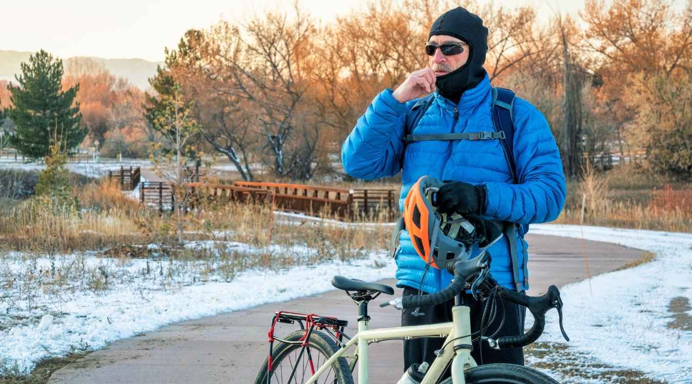
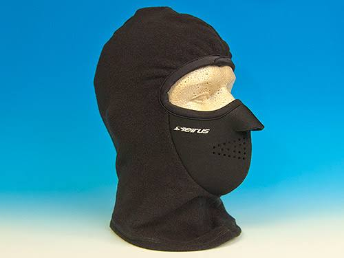

As the wind picks up and the temperatures drop, it's time to rethink our gear to ensure we continue to enjoy those beautiful bike rides we love so much! Today, let's shine a spotlight on an often overlooked, yet crucial piece of equipment - the cycling Balaclava.

A quality Balaclava is not just a mere accessory for bike riding. It's an essential piece of kit that guards against the elements, ensuring your ride is comfortable, safe, and enjoyable, even in the harshest conditions.

After countless hours delving into the world of [biking accessories](https://mtbnz.org/fun-and-functional-mountain-biking-accessories/), I've compiled a list of the top 10 balaclavas that stand out for their exceptional design, functionality, and comfort. These accessories, often underestimated, can make all the difference in your biking experience, protecting you from the elements while keeping you comfortable on the road.

1️⃣ **[Gore Windstopper Balaclava](https://amzn.to/3QqyQmG):** This balaclava offers excellent protection from wind and cold, made from a lightweight, breathable material that wicks away sweat.

2️⃣ **[Under Armour ColdGear Infrared Balaclava](https://amzn.to/3Qvho0q):** Built with thermal insulation, this balaclava offers moisture management and a snug fit, keeping you warm and dry.

3️⃣ **[Seirus Innovation 8039 Neofleece](https://amzn.to/3DOFefW):** Offering a unique blend of Neoprene and Thermolite for warmth and comfort, this balaclava also features a contoured design for a snug fit.

4️⃣ **[Smartwool NTS Mid 250 Balaclava](https://amzn.to/3YplZTU)**: This mid-weight, 100% Merino wool balaclava offers fantastic insulation, and moisture-wicking capabilities, and is exceptionally soft on the skin.

5️⃣ **[Chaos CTR Tempest Multi Tasker Pro Micro Fleece Balaclava](https://amzn.to/45hWea6):** This balaclava is made with micro-fleece. That means it's incredibly soft, comfortable, and, most importantly, warm!

6️⃣ **[Original Turtle Fur Fleece - Shellaclava](https://amzn.to/3qjan8q):** The Turtle Fur Fleece is designed to endure, which means it won't easily wear out even with daily use.

7️⃣ **[Icebreaker Merino Oasis Balaclava](https://amzn.to/44SRk3G):** Made from 100% Merino wool, this balaclava provides excellent heat retention and breathability, perfect for long rides in cooler temperatures.

8️⃣ **[Carhartt Men's Fleece 2-in-1 Headwear](https://amzn.to/3OvE4v8):** This 2-in-1 design offers the flexibility of a detachable, face mask while providing warmth and comfort with its fleece material.

9️⃣ **[BlackStrap Hood Balaclava](https://amzn.to/3qhS5UU):** This balaclava offers UPF 50+ protection, is breathable, and dries quickly. It's designed to fit under helmets and goggles comfortably.

🔟 **Outdoor Research Option Balaclava:** Another non-traditional balaclava, but the wool/synthetic blend and versatile design make this a fantastic option for temperature regulation and convenience.

Each of these balaclavas brings something unique to the table. Whether you're biking in the frigid cold, or high winds, or need something lightweight for cooler days, this list has got you covered - quite literally!

A top-tier Balaclava doesn't just keep you warm; it can also:

- Reduce wind chill to keep your body temperature stable

- Protect against sunburn with UV protection

- Wicks away sweat to keep you dry and comfortable

- Provide a physical barrier against dust, insects, and other airborne particles

But how can you ensure you're choosing the best Balaclava for your bike rides? Here are a few tips:

👉 **Material**: Look for high-quality fabrics like Merino wool or advanced synthetics that offer both warmth and breathability.

👉 **Fit**: It should fit snugly but not too tight. You don't want to feel uncomfortable or constricted during your ride.

👉 Functionality: Consider a Balaclava with adjustable features, so it can be worn in different ways depending on the conditions.

👉 **Reviews and ratings**: Always check what other customers are saying about the product. Genuine user feedback can give you insights that product descriptions might miss.

A balaclava is a must-have accessory for any cyclist, as it protects the face and neck from the elements, keeping you warm and comfortable on your ride.

With so many options on the market, it can be difficult to find the best one. That's why we've rounded up the top cycling balaclavas and put them to the test. In this article, we'll provide an in-depth review of each product, so you can make an informed decision and find the perfect balaclava for your next ride.

Do you need a breathable fabric? Will it cover up the back of your neck? What about ear protection for cold or windy rides, do you need that too? The list goes on and on but we can help by narrowing down some options for those looking for all-around great winter riding gear.

We recommend the [Pearl Izumi Barrier Balaclavas](https://amzn.to/2TBB5IM) because they have an excellent balance of features including plenty of room at the nose opening, moisture wicking material, and soft fleece lining around the ears. You won't regret choosing this one!

The weather alone is a limiting factor since you have to worry about vision range, breathing, and warmth. Luckily for you, there are balaclavas, which come in handy during such weather. You see, Balaclavas are designed for cold outdoor activities such as skiing and winter cycling. This means that you can ride in cold weather without having to worry about warmth.

## Best Balaclavas for Cycling

1

## [GORE WEAR Unisex Windproof Balaclava](https://amzn.to/3qidXzt)

As someone who's cycled in some of the most extreme weather conditions, I understand the importance of having the right gear. The GORE WEAR Unisex Windproof Balaclava has made my list of top biking accessories, especially when it comes to tackling the chilliest of rides.

Why do I recommend it? Let's break it down:

✅ **Warmth:** The GORE WINDSTOPPER material keeps the cold wind at bay, helping to maintain your body heat even in frigid temperatures.

✅ **Breathability:** Despite being a shield against the cold, this balaclava doesn’t compromise breathability. It effectively wicks away sweat, ensuring that you remain comfortable throughout your ride.

✅ **Fit:** With a flat-lock seam design and elastic binding on the edges, the GORE WEAR balaclava ensures a snug and comfortable fit without being overly tight.

✅ **Versatility:** It can be used as a full face mask or adapted into a neck gaiter or beanie depending on your needs.

What truly sets this balaclava apart is the GORE WINDSTOPPER technology. This fabric is not only windproof but also highly breathable, a combination that's crucial in severe weather. It prevents wind chill while allowing for efficient moisture and heat management. This ensures that your face stays warm, but not sweaty, thereby improving your comfort and endurance during long rides.

While this balaclava is a fantastic choice for mountain biking, it's worth noting its versatility. Whether you're hiking, skiing, or engaging in other outdoor activities, it offers the same level of comfort and protection. This makes it a valuable investment for anyone leading an active outdoor lifestyle.

Read Reviews on Amazon

Now, transparency is key, and there are a couple of things you need to be aware of:

❗ **Price:** GORE WEAR products come with a higher price tag. This investment, however, equates to exceptional quality and durability.

❗ **Sizing:** Some users have mentioned that sizing can be a bit tricky. Be sure to check the size guide carefully to find the perfect fit for you.

2

## [Under Armour Men's ColdGear Infrared Balaclava](https://amzn.to/45idvjy)

Mountain biking in extreme weather conditions requires preparation, determination, and the right gear.

The [Under Armour Men's ColdGear](https://amzn.to/3Ynords) Infrared Balaclava stands out as a top choice for those who refuse to let cold weather deter them from hitting the trails.

With its advanced technology and design features, it promises not only warmth but also unmatched comfort, durability, and versatility. So, before you set out on your next winter biking adventure, make sure you're equipped with this game-changing balaclava. Safe and warm rides await!

I recently tried the [Under Armour Men's ColdGear Infrared Balaclava](https://amzn.to/3Ynords), and here's why I believe it's one of the _BEST_ for those extreme weather rides:

🔥 **1\. Infrared Technology**: Unlike other balaclavas, Under Armour’s ColdGear Infrared technology has a soft thermo-conductive inner coating. It absorbs & retains your own body heat, ensuring you're warm even when Mother Nature’s throwing her worst at you!

💨 **2\. Breathable & Moisture-Wicking**: Sweating under all those layers? Not a problem! This balaclava wicks away sweat super-fast. This means more comfort, less distraction, and no frostbite concerns from accumulated sweat.

🌬 **3\. Convertible Design**: Face the wind head-on or need a little breather? This balaclava can adjust from full to partial coverage, providing flexibility without compromising protection.

😌 **4\. Smooth, Anti-chafe Seams**: No one likes that annoying itch or scratch, especially when navigating tricky terrains. Under Armour has us covered with flatlock seams ensuring a comfortable fit without any irritation.

🌟 **5\. Durable & Long-lasting**: Quality isn’t just about warmth. It’s about how long your gear will last. Made with top-notch materials, this balaclava is made to withstand not only the weather but also the test of time.

I believe that the Under Armour Men's ColdGear Infrared Balaclava offers a robust solution for mountain biking in extreme weather conditions. The combination of advanced technology, thoughtful design, and premium materials makes it a noteworthy option.

However, individual preferences and needs may vary, so it's always good to explore different options or consult with fellow bikers or professionals in the field to find what works best for you.

[**Buy This Now!**](https://amzn.to/3Ynords)

3

## [Seirus Innovation 8039 Balaclava](https://www.amazon.com/Seirus-Innovation-8039-Weather-Balaclava/dp/B0018BL1XA?tag=furiousbikes-20)

Next up on our list of best balaclavas for cycling is the [Seirus Innovation Balaclava](https://www.amazon.com/Seirus-Innovation-8039-Weather-Balaclava/dp/B0018BL1XA?tag=furiousbikes-20). This one has a double thick fleece neck construction, which helps to protect your face from harsh winds and cold weather. It has ear protection built-in as well, so you don't have to worry about ear coverings or discomfort. The best part? It comes at an inexpensive price with quality that can't be beaten. It is made in the USA and it is unisex. It has a neofleece 5 layer that is designed to keep you warm even in winter.

The Seirus Innovation 8039 Balaclava is particularly noted for its **Neofleece® construction**. This combination of neoprene and fleece offers a unique blend of warmth and water resistance, making it a suitable choice for biking in cold and damp conditions.

The Seirus Balaclava also has a fleece-lined neoprene that blocks out wind and cold, large central breathing holes, a waterproof and breathable liner, a tough outer shell, microfleece wicking lining, and thermolite synthetic insulation.

Its design features a contoured facemask that provides warmth and makes it easy to breathe.

It also has a 4-way stretch that offers the utmost comfort. Unlike most cycling balaclavas, the Seirus Combo Clava has a flat seem construction that fits hats, headwear, helmets, and goggles.

[Check Current Price On Amazon](https://www.amazon.com/Seirus-Innovation-8039-Weather-Balaclava/dp/B005ED30IC/?tag=furiousbikes-20)

\[su\_divider top="no" divider\_color="#00c4cc" margin="20"\]

4

## Smartwool Merino 250 Balaclava

At the heart of the Smartwool Merino 250 Balaclava is its Merino wool fabric. You'll appreciate that this isn't any ordinary wool. Merino is renowned for its ability to regulate temperature, wicking away moisture when you're sweating and retaining heat when it's cold.

For someone who's exerting energy on trails and down mountainous terrains, this is invaluable. The 250 weight, one of Smartwool's heaviest, ensures added warmth and coziness.

Moreover, if you’re concerned about the itchiness commonly associated with wool, you can be at ease. Merino is known for its softness, providing a comfortable feel against the skin. For long rides, this can make a world of difference.

Aesthetically speaking, the balaclava boasts a simple and sleek design, making it easy to pair with most biking outfits. You won't look out of place wearing it, whether you're on a trail or taking a pit stop at a local café.

5

## [Chaos CTR Tempest Micro Fleece Balaclava](https://amzn.to/3OrgT51)

As its name suggests, [Chaos CTR Tempest Multi Tasker Pro](https://amzn.to/3OrgT51) is made from Micro Flex fleece, which is a lightweight fabric that provides unparalleled levels of warmth and comfort. The fabric also boasts wicking properties that help push the moisture out of the balaclava.

Whether you're blazing down a snow-capped mountain or navigating chilly morning rides, the right gear can make or break your experience. One piece of equipment I've recently been in awe of, especially for its efficacy in extreme weather, is the **[Chaos CTR Tempest Micro Fleece Balaclava](https://amzn.to/3OrgT51)**. And here’s why:

🔥 **Warmth that Lasts:** Made from advanced micro-fleece technology, this balaclava provides a snug fit while retaining body heat exceptionally well. The material is lightweight yet insulated, making it a preferred choice for staying warm without bulkiness.

💨 **Windproof Design:** Its unique windproof design ensures that you're protected from those biting mountain breezes. This means more comfort and less distraction, enabling you to stay focused on the trail.

🛠 **Tailored for Mountain Bikers:** We know helmets are non-negotiable. The Chaos CTR Balaclava has a low-profile design, ensuring it fits comfortably under any mountain biking helmet. Plus, it won't obstruct your vision!

🌀 **Versatility:** Conditions on the mountain can change quickly. The beauty of this balaclava is its adaptability. It can be transformed into a neck gaiter, full-face mask, or beanie, allowing you to adjust as per the situation and personal comfort.

🌬 **Breathability Matters:** While staying warm is crucial, breathability is equally vital. This balaclava ensures that while the cold stays out, there’s enough ventilation to prevent overheating or excessive sweating.

💦 **Quick Dry:** Unexpected rains? Sweating after an intense ride? No problem! The balaclava's quick-dry feature ensures that moisture is wicked away rapidly, keeping you dry and comfortable.

Now, I understand that with so many options in the market, choosing the right gear can be a challenge. But when it comes to battling the extreme cold and unpredictable weather on the mountains, the **[Chaos CTR Tempest Micro Fleece Balaclava](https://amzn.to/3OrgT51)** stands out for its impeccable features tailored just for us mountain bikers.

It has a Lycra binding that seals out the elements making it the best balaclava for extreme cold or winter. It also has a shaped bottom that prevents excessive gathering. The Chaos CTR Tempest is not only ideal for cycling but also snowboarding, hunting, and skiing.

Features

- Hinged Construction

- 5% Spandex& 95% Polyester

- Polartec Micro Fleece

- Moisture Wicking

- Four Way Stretch

\[su\_divider top="no" divider\_color="#00c4cc" margin="20"\]

6

## [Original Turtle Fur Fleece - Shellaclava](https://amzn.to/37uhI6X)

The **Shellaclava** is a uniquely designed balaclava by **[Turtle Fur](https://www.turtlefur.com/)**, an iconic brand that's been at the forefront of cold-weather gear since 1982. Merging their plush, double-layer neck warmer with an attached thin hood, it offers a combination of coziness and functionality.

The **[Original Turtle Fur Fleece](https://amzn.to/37uhI6X)** is designed for cold weather applications. It can be worn with a helmet, which makes it an ideal option for cycling. The balaclava features two layers of fur fleece.

**Why consider this balaclava?**

1. 🌡️ **Heavyweight Warmth**: The Turtle Fur Fleece is specially designed to offer maximum warmth without adding bulk. Perfect for those frosty morning rides!

3. 🤩 **Two-in-One Design**: Combining a neck warmer with a hood ensures your entire head and neck region remain shielded from the cold.

5. 🛠️ **Craftsmanship**: Renowned for its quality, Turtle Fur products are built to last, ensuring that you're investing in a product that will serve you for multiple seasons.

7. 🌬️ **Breathable**: While it keeps the cold out, its breathable design ensures you won't overheat during those strenuous uphill climbs.

9. 🚴‍♀️ **Cycling-centric Fit**: Its contoured design means it fits comfortably underneath helmets without compromising on warmth

The fur fleece is not only soft but it also keeps your head warm. As for the hood, it is designed to hug your head in a streamlined fabric that joins with the fur fleece neck at the sides and the back. This ensures that your head is warm and protected from wind and snow. The streamlined construction keeps snow out of your jacket.

Features

- 2 layers of Turtle Fur Fleece

- Universal fit (Adults)

- Machine Washable

- Comfort Shell Performance Fabric

[Check Current Price On Amazon](https://www.amazon.com/Original-Turtle-Fur-Fleece-Shellaclava/dp/B009AVAI66/?tag=furiousbikes-20)

\[su\_divider top="no" divider\_color="#00c4cc" margin="20"\]

7

## Icebreaker Merino Oasis Balaclava

For cyclists braving the cold, the [Icebreaker Merino Oasis Balaclava](https://amzn.to/47f95Mp) offers a perfect balance of warmth, breathability, and comfort. Its natural properties make it a standout option for those willing to invest in quality gear that lasts. Though it demands a bit more care in washing, the benefits significantly outweigh this minor inconvenience.

The Icebreaker Merino Oasis Balaclava is made from 100% Merino wool, known for its excellent insulating properties. Here's why Merino wool stands out:

- **Temperature Regulation:** Merino wool naturally adjusts to your body's temperature, keeping you warm in cold weather and cool in mild conditions.

- **Moisture Management:** It wicks sweat away from your skin, keeping you dry and comfortable on long rides.

- **Odor Resistance:** Merino wool is naturally resistant to odors, ensuring that you stay fresh during your cycling adventures.

The biggest complaint with many balaclavas is that they can become stuffy. But the Icebreaker's merino wool allows for excellent breathability, ensuring you're not left gasping for air during intense bike rides.

**Benefits for Cyclists:**

1. **Thermal Regulation:** Merino wool is a miracle fabric. It helps maintain an ideal body temperature – warming you without causing you to overheat.

3. **Moisture Management:** Merino wicks away sweat, so you stay dry even during those uphill climbs.

5. **Odor Resistance:** Long rides? No problem! Merino wool naturally resists odor.

7. **Flexibility in Design:** You can wear it as a full balaclava, or roll it up to use as a beanie, providing adaptability for different weather conditions.

**But How Does It Perform on the Road?**

1. **Visibility:** With the Oasis Balaclava’s snug fit, it doesn't obstruct your peripheral vision.

3. **Breathability:** The lightweight design ensures that you can breathe easily, even during intense cycling sessions.

5. **Fit:** With overlock stitching, it fits smoothly beneath helmets without adding unwanted bulk.

**A Few Considerations:**

1. **Price:** High-quality Merino wool products can be a bit pricier. However, considering the durability and benefits, many find it a worthy investment.

3. **Care:** Merino wool requires a bit more care than synthetics. Make sure to follow washing instructions to maintain its integrity.

  

\[su\_divider top="no" divider\_color="#00c4cc" margin="20"\]

### 8\. [Pearl Izumi Barrier Balaclava](https://amzn.to/3334xGp)

The Pearl Izumi Barrier Balaclava had to make it on our list of the best balaclavas for cycling. It is made to withstand the most brutal cycling conditions you can encounter out there while providing optimal temperature regulation.

It's new design comes with an adjustable face panel, which makes this thermal balaclava a must-have for your [chilly winter rides](https://mtbnz.com/cold-weather-cycling-tips/). 

Pearl Izumi Balaclava features the thermal fabric that combines warmth, breathability and excellent moisture transfer. It also features the Lite Fabric Panel, which has windproof and water resistant properties. The Pearl Izumi has an ergonomic design that easily fits under a helmet.

#### Features

- Ponytail Compatible

- Thermal Fleece Fabric

- Reflective Logos

- 69% Nylon, 16% Polyester & 15% Lycra

[Check Current Price On Amazon](https://www.amazon.com/Pearl-iZUMi-Izumi-Barrier-Balaclava/dp/B00280MJYU/?tag=furiousbikes-20)

\[su\_divider top="no" divider\_color="#00c4cc" margin="20"\]

### 9\. Fantastic Zone Balaclava

  
The Fantastic Zone Balaclava has a long headband that rests on your shoulders keeping both your head and neck warm. It features double layer thickening, warm design with breathable properties. It is also lightweight, soft, machine washable and wrinkle free.

The Fantastic Zone Balaclava has a high tear resistance, hypo-allergenic fabric and flat-lock seems. When all these features are combined they provide excellent protection. You simply cannot go wrong with the Fantastic Zone Balaclava.

#### Features

- Durability Abrasion Resistance

- Anti-Static Function

- Extremely Breathable

- Lightweight and Unisex

The Fantastic Zone Balaclava might not be the best cycling balaclava for you especially if you wear prescription glasses or even sunglasses.

[Check Current Price on Amazon](https://www.amazon.com/dp/B01KG78NVE/?tag=furiousbikes-20)

\[su\_divider top="no"\]

### 10\. [Upmall Winter Warm Balaclava](https://amzn.to/2pBBZ9h)

  
The Upmall Winter Balaclava comprise of a fleece fabric that is not only comfortable and soft but also easy to wear. The Winter Balaclava is designed to cover all parts of your head, neck and face except the eyes. It has improved design, which features a different sewing angle for a better fit.

The Upmall Balaclava is perfect choice for you since it is versatile. You can wear it as a neck gaiter, ninja hoodie, helmet liner, neck warmer, or even a polar hood.

#### Features

- Machine Washable

- Fleece Composite Fabric

- One Size Fits All

- Multifunctional Use

[Check Current Price On Amazon](https://www.amazon.com/dp/B00G4PR9Q8/?tag=furiousbikes-20)

### #Bonus Mention: Cozia Design Balaclava

The versatile balaclava offers superior protection and is a perfect fit for men, children, and women. It uses specially engineered polyester fibers to provide the perfect balance between absorbency, durability, wicking, abrasion resistance, and breathability.

The new design features an extra-long neck for better wind protection. It also has a thin fabric for improved versatility without having to sacrifice properties such as warmth. The balaclava has an improved sewing angle that allows for better comfort.

Features

- Hi-tech Temperature Control Fabric

- Machine Washable

- Lightweight and Versatile

- Extremely Breathable

[Check Current Price On Amazon](http://amzn.to/2A4Af7I)

\[su\_divider top="no"\]

## Choosing the Best Cycling Balaclava for Winter

### Warmth

Have you ever tried to ride your bike in the morning or on a cold day?

The most likely answer is that you didn’t enjoy that ride. Why do you think that is? It is simple; you were losing too much heat. You can easily solve that by always having the best cycling balaclava with you. When you wear a cycling balaclava during your morning rides you are more likely to enjoy the rides than you would if you only had a helmet.

The best cycling balaclavas are made of different textiles depending on the price and intended use. Cheap models are made of inexpensive polyester while premium models are made from high-quality synthetics.

Your choice will depend on the level of cold and your budget. For example, balaclavas made of nylon and microfleece materials offer better wicking, while those made from thermodynamic materials tend to be pricier.

### Breathing Access (Balaclava with Nose Opening)

If you buy a biking balaclava that is not intended for heavy cycling you might experience breathing issues. It is imperative that you purchase the best balaclava for winter as it is designed for heavy breathing. Such balaclavas come with a nose opening

Balaclavas are designed in different ways; some have a large opening for the eyes, nose, and mouth while others have a hinged mouthpiece and nose. Although balaclavas with a large opening are good for breathing they are not good for warmth purposes as they leave your face open.

The best choice here is the hinged nose and mouthpiece balaclavas as they protect your nose and mouth from cold. The hinged part also makes it easy for you to pull down the opening for easy breathing.

Other designs include mouth panels and mesh nose fitted with breathing vents. While these types of cycling balaclavas look good, they are not the best option for breathing. There is also no room to wipe your nose.

### Cycling Balaclavas with Wicking Properties

Balaclavas with wicking materials are highly recommended as they do a good job in keeping your skin dry even when you sweat. Wicking materials are designed to absorb moisture from your skin and push the moisture outside the fabric. Once outside, the moisture evaporates into the atmosphere leaving your skin dry.

Fabrics such as cotton are good at absorbing liquids but unlike wicking fabrics, cotton does not push the liquid outside. Instead, the fabric remains wet making your morning or winter rides uncomfortable.

### Bike Balaclavas Alterability

Some balaclavas are stationary, which means they cannot be rearranged while others are stretchy and adjustable. Here your choice will depend on your likes and preferences. However, most cyclists tend to prefer the adjustable version as it is adjustable for easy breathing.

You can also opt for the “hinged” balaclavas as they designed with a garment that can be raised or lowered for heat retention or easy breathing.

### Using Glasses With Your Cycling Balaclava

While most cyclists want to ride with glasses, not all balaclavas are designed to fit glasses. Finding a perfect match is not easy. You glasses are most likely to get foggy as the heat trapped by your balaclava is translated to your glasses as moisture.

If it is absolutely necessary for you to wear glasses when cycling, you can purchase [cycling glasses](https://mtbnz.com/best-cycling-sunglasses/) especially those that are fitted with air vents.

### Eye Exposure

Some cycling balaclavas feature two separate apertures for better heat retention while others have a wide aperture as it allows for a better or clear line of vision.

\[su\_divider top="no" divider\_color="#021515" size="1" margin="10"\]

#### What is the Purpose of a Balaclava

Cyclists wear balaclavas to keep their faces warm. The best biking balaclavas are made from thermal fabrics that keep them conveniently warm. However, you should also consider the comfort of the balaclava. For the best feeling on your face and neck, choose woolen balaclavas.
