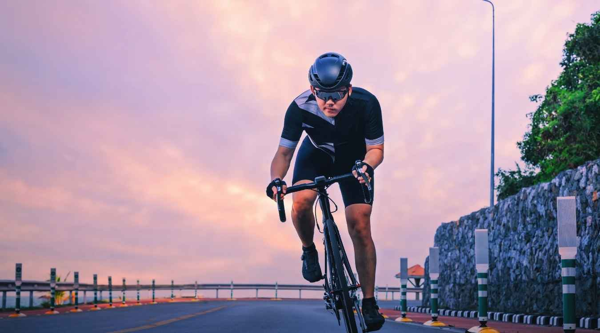

There are many different kinds of bikes on the market today. [Mountain bikes](https://mtbnz.com/mountain-bike-frame-guide/), racing bikes, [road bikes](https://mtbnz.com/best-road-bike-for-triathlon/), dirt bikes, and even cyclocross bikes, just to name a few.

While people are familiar with many types of bikes, there are a lot of people who may wonder exactly what is a cyclocross bike? Very simply, a cyclocross bike is a bicycle that has been designed specifically for the trials and tribulations of cyclocross racing.

Cyclocross races normally take place in the fall and winter. The race usually involves riding a number of laps around a short course that consists of wooded trails, steep hills, grass, pavement and obstacles. The rider will be required to dismount from the bike quickly and carry the bike in order to navigate their way through an obstacle and then get back onto the bike all in a single motion.

Cyclocross bikes have similarities to normal racing bikes, as they feature drop handlebars, sport narrow tires, and like racing bikes are very lightweight. The major differences are that cyclocross bikes have frames that have wider clearances, lower gears, and other characteristics that are similar to mountain bikes.

Due to the sometimes muddy conditions of cyclocross racing, they feature cantilever style brakes which aid in supplying the clearance needed for such conditions. They also usually feature the knobby tread tires that are associated with mountain bikes which help provide better traction.

While unridable sections of a cyclocross racing course are only a small part of the course, a prototypical image of the sport is competitors carrying their bikes on their shoulders while negotiating a muddy slope. This reinforces the fact that cyclocross bikes need to be light in weight. While cyclocross bicycles still need to be fast, the need for speed is not as important as it would be to someone involved in road racing.

Much like auto racing, it is common for cyclocross competitors to have a pit crew. This is mainly due to the fact that cyclocross competitors normally have more than one cyclocross bike at their disposal.

In cyclocross racing riders are permitted to have mechanical assistance during the race as well as change bicycles. Since the bike is apt to become covered with mud due to the rigors of the course, their pit crew will work on one bike, oiling it, cleaning, and repairing it, while the competitor uses their other bike to continue on in the race.

## What is a Cyclocross Bike?

As you can see it is more or less a cross between a mountain bike and a road racing bike. Unlike these other types of racing bikes, however, it is more common for a competitor to have more than one cyclocross racing bicycle.

Cyclocross is nearly as old as the bicycle itself, and as fresh and full of vigor as if it were born yesterday. It's a sport that enjoys rampant popularity in Europe, and in America, after it's heyday of the late 70's, is picking up momentum once again in areas rich with the history of road racing: Boulder, Boston, Chicago, Santa Cruz, Seattle, and even Montana where Geoff Procter teaches 'cross clinics.

It's been called a "fringe sport" and "outlandishly demanding," but at the same time some of cycling's greatest heroes, including numerous Tour de France winners, have used it for winter conditioning. More and more 'cross bikes are being taken from the race scenario - the ultimate hybrid for commuting, for fun. A skill and a tremendous machine that can cover all the bases.

## THE HISTORY

Turn of the century "dead seasons" would find the young French army private, and later secretary general of the French Cycling Union, Daniel Gousseau cycling through the forests along side his horse-mounted general, sharing their love of the outdoors. He enjoyed these winter outings so much that he invited a few of his friends along and soon dozens of cyclists were rolling along the trails.

Impromptu racing occurred among the sporting cyclists and soon organized events were scheduled.

In 1902 Gousseau was given the opportunity to organize the first French championship, which was won by F. de Baeder. For years this "rough stuff" and "mud plugging" remained mainly a French indulgence until its popularity exploded when Octave Lapize attributed his 1910 Tour de France win to the off-season sport.

The first International Criterium, which was won by the Frenchman Gaston Degy, was held in 1924 in Paris. Following Gaston to the podium were many of cycling's greats: Charles Pelissier in 1926, 1927 and 1928, Sylvere Maes, the handlebar namesake, in 1933 and Robert Oubron who won in 1937, 1938, 1941 and 1942!

In 1950 one of the international events became official, and in Paris the 1947 Tour winner Jean Robic was the first to pull on the rainbow jersey. Like the International Criteriums, the World Championships saw many of cycling's brightest stars cross the finish lines. But among them, Belgium's Eric de Vlaeminck was definitely king of the 'crossers having, at the tender age of twenty, won in 1966 and then each year from 1968 to 1973.

The open format of the World's was changed in 1967 with the addition of a special amateur world title and the junior title was adopted in 1976.

## WHY

At a time when mountain biking is so popular, the question of why to take up cyclo-cross is often heard. There are basically three reasons to cross over.

- One is for the same reason you might, in this time of clinchers and STI, use sew-ups and down-tube shifters: history. Cyclo-cross has been around for about 70 years longer than its fat-tired grandchild. Its courses weave a rich tapestry of cycling heroes and two-wheeled feats. Its time tested and time proven.
- Probably the main reason for taking up cross is for training. Nothing can beat the incredible workout afforded the roadie by this off-season sport. It builds stunning arm and upper-body strength and bike-handling skills that will eliminate the fear of rainy criteriums and gravel spotted roads, increases cardio-respiratory endurance and takes up surprisingly little time, since a one hour workout can be more advantageous than hours on mind-numbing rollers.
- But the third, and my main reason for crossing, is that its just plain fun! Nothing beats the quick handling and lively feel of the cross bike on the quickest descents and trickiest singletrack.

In his Feb. '13 Bicycle Guide article "Mountain Bikes: Who Needs Them?" Chris Kostman called these modified road bikes "the first and only real all-terrain bike." And he's right! I believe they're also the perfect commuter, or, as Grant Peterson would call them, all-rounder bikes.

No throw-back balloon tires, elastomer bumpers, springs and OPEC drippings to separate you from the feel of the Earth. Just you, your wits and the perfect trail bike.

The simplicity of a cross bike, and the very act of riding, running and walking, enable you, as Robert Oubron and Rene Chesal write in their book Cycliste 100%, serie cyclo-cross (Paris, 1967), "to discover hundreds of interesting things which you would have ridden straight past if you had not been tempted into hitching the bike over your shoulder, or simply pushing it along, and following a riverbed, or a footpath that may end in a spring or an unexpected view, or a lane that suddenly yields up some unexpected historical monument, or a lake you did not know existed.

> ...Just try doing this on a bridal path in Savoy or in the Pyrenees and I'll be surprised if you don't find yourself singing for sheer joy. And when you're back down again, after clattering through streams and gullies and stony paths, sometimes on the bike, sometimes on your feet, you will have enjoyed a wonderful experience."

The main bikes of my wife, Melanie, and I are cyclocross bikes. In the country area where we live there are too many dirt roads to just jump on our road bikes and ride - and way too much asphalt to lug cumbersome mountain bikes around on. With the sluggish and unresponsive geometry of the common hybrid, what's left? If you want a machine that has precision slo-mo handling and can really pull out the speed when you want it, the cyclo-cross bike is the answer.

'Cross bikes aren't just for racing any more. "To call it only a sport," says champion 'crosser Laurence Malone, "is demeaning. As people seek increasingly creative and self-reliant means of transportation, this hybrid of foot and bicycle travel will take on new dimension and importance.

As perceptions of the bicycle shift from that of toy to tool (and they will), two-wheeled expertise cannot remain confined to sport alone. What is regarded as 'recreation,' 'sport,' or 'leisure' today will be the challenge of mobility tomorrow."

## The Anatomy of a Cyclocross Bike

To the uninitiated, a quick glance at a cyclocross bike might just seem like a road bike with knobby tires. But on closer inspection there are a myriad of differences.

As with all forms of cycling, there are new and old schools of thought and conservative and extreme points of view on the anatomy of a cyclo-cross bike. I'll try to cover both angles.

If you're just experimenting with the sport, the most economical route is to either buy a used cyclocross bike, available most commonly in the early summer, or to transform an old road bike.

If you're going to go the transformation route, try to find a frame that is slightly smaller than your racing rig and that has slightly slacker geometry. The ultimate would be to find a touring frame that accepts cantilever brakes.

If you live in a dry area, sidepulls will do the job. But for outstanding mud clearance and sheer stopping power, cantis are a must.

Replace the down-tube shifters with bar-end levers, they're still around if you look long enough and are usually quite inexpensive. Put on an extra layer of bar wrap to soak up the shocks and 28c to 35c inverted tread or knobby tires for traction. Finally, add some MTB pedals with clips and straps and there you have it - a lightweight machine that can handle most any off-road job.

If you really fall in love with the sport, and you can afford it, a purpose made rig is absolutely the best way to go...

### 1\. The Frame

'Cross frames have more relaxed angels than road bikes, have more top tube clearance, longer chainstays for stability and a higher bottom bracket for obstacle clearance. Increased fork rake for flexibility and a softer ride is also common.

Generally you'll want to get a frame that is about a half inch to an inch smaller than your road bike. Several companies, like Alan, Pinarello, Cramerati, Orbit, Vitus, Redline, Botranger, Rock Lobster, Gitane and Torelli, produce 'cross frames, but for a little more you can have a custom fit. Some of the more well known builders include Steelman, Merlin, Marinoni and Ibis, but most road builders will make 'cross frames. The new All Rounder frameset from Rivendell Bicycle Works looks to be a good choice also.

### 2\. Wheels

Strong, uniformly-tensioned 36 spoke wheels are the old stand-by, but 32's cut weight and seem to work just as well. Many companies have purpose-made tubulars, but with the hybrid bike boom, several great clincher choices are now available from the likes of Specialized, Continental, the 700 x 35 Ritchey Alpha Bite, 700 x 38 Tioga Bloodhound, and, my favorite, the Michelin 700 x 28 Hi-Lite Cross.

The high-pressure Hi-Lite mimics it's more costly tubular cousins in tread pattern and ride. Tread pattern varies according to race or local conditions. Composite tri-spoke wheels are becoming more and more popular with top Euro-pros in extremely muddy conditions.

### 3\. Shifters

The quick shifting and easy to use STI/Ergo levers are becoming more popular on the 'cross circuit, but because of their lack of serviceability and inability to survive serious crashes, bar-end shifters are still the classic choice.

### 4\. Gearing

There are as many gearing choices as there are riders. Six speeds are still very popular because the wide spacing between the cogs helps keep down jams due to mud. But using a Crud Claw or similar device with an eight speed cluster works fine.

Some 'crossers stick with the time proven single chainring with or without ring guards, but double chainrings are now in the majority.

Some common gearing combos are a 39/53 with a 12-26, 42/50 with a 15-28, 42/48 with a 13-26, and straight blocks. If you need a smaller gear, you should be throwing the bike over your shoulder and running. Also, since your pedal strokes are about power in this sport, not spinning at high rpm's, longer cranks are a tremendous help.

### 5\. Brakes

For the reasons stated earlier, cantilever brakes are a must. Some 'crossers prefer to have the left brake lever activate the rear brake so they can have more control over their speed during dismounts. May I suggest a bit of high-technology for your classic 'cross rig - Stoplight cantilevers by Paul Component Engineering are fantastic.

### 6\. Pedals

The classic 'cross pedal is the French double-sided Lyotard with doubled Christophe clips and Binda straps. But the double-sided SPD's and Look's are also a popular choice. Since you'll be jumping on and off the bike quite a bit, choose the pedal system that you can personally get in and out of easiest.

### 7\. Bars & Stem

Flat bars just can't compete with the variety of hand position offered by the drop bar. For the added stability of a wider grip and for more leverage, use a flared drop or randonneur-type bar. Using a stem that is slightly shorter than your road bike will help distribute your weight more efficiently during ascents. See the [best MTB grips for beginners](https://mtbnz.com/best-mountain-bike-grips/).

### 8\. Waterbottles

In racing, water bottles and cages just don't exist. They get in the way of carrying the bike and the course is usually short enough that you can get water "in the pits."

Using a cyclocross bike for any other situation, you'll want water. If having a bike custom built, be sure that they will be adding bottle bosses, it's common not to have any on 'cross rigs.

An excellent additional investment is in service-free sealed bottom bracket, hub and headset units. As Chris Kostman says, "trick out your bike usefully... own techno stuff actually worth drooling for."

## THE STYLE

'Cross races are generally held on circuits one to two miles in length. The perfect course will have paved and unpaved sections, wet areas and dry, will be about 75% rideable, the rest for running. It will have a variety of natural obstacles, like muddy banks, streams, and fallen trees, and man-made obstacles, like bales of straw, wooden barriers, and even flights of stairs.

Depending on your classification and age the race will last around thirty to 75 minutes. After a season of multi-hour hour road and mountain races this may seem to be a short run, but for even the most prepared, this is a lung-blowing experience. Cyclo-cross is a very demanding, incredibly precise sport.

More like road racing than mountain, 'cross racers are allowed "pit crews" where they can do bike exchanges, replace wheels or take care of any other mechanical problems they might have. It's common on muddy courses to exchange your filthy bike for a clean one after each lap. The mechanics using buckets and brushes, high-powered hoses, and even rushing streams to clean off the bikes.

The only real way to learn the cyclo-cross ropes is to get out there and do it. If you happen to live in a 'cross-friendly area, you can find folks to help you learn the tricks of the trade. Everyone else? Try finding some Euro-Pro 'cross videos, look out for the fall 'cross tip articles in VeloNews and the like, and, if you can track down a copy, read Simon Burney's definitive work on the sport, Cyclo-Cross. Aside from that, here are a few tips I dug up from some accomplished 'cross riders and legends..

"Cyclo-cross is about bike handling, getting on and off the bike fast, and accelerating back to speed." - Don Myrah

## DISMOUNTS FOR OBSTACLES

"The first skill to master is dismounting. As you approach a barrier, feather your brakes from the hoods to make sure you're not moving too fast as you prepare to dismount. As you move closer, swing your right leg out of the pedal, around the back of the bike, and bring it between your left leg and the frame - to end up with your left toe butting the heel of your right foot. Just prior to your right foot passing on the inside of your left foot, disengage your left foot and balance it on the pedal. With these two moves complete, bring your right hand back and firmly grab the top tube just for of the saddle.

At this point, you're ready to step off with your right foot first and begin hurdling. The only remaining concern might be if you're carrying too much speed. This is where it's invaluable to have your left lever operating your rear brake: If you are going to fast, you can feather with your left hand which is still on the left brake hood.

The basic lift is done by simply lifting the bike with the left hand on the top tube or hood and your right hand on the top tube. As you hurdle the barriers with one or two steps in between each barrier, keep the bike aloft and out of the way of your churning legs.

The shoulder move requires a different right hand- placement as you approach the barrier. Instead of bringing it back to the top tube, bring it down to grasp the middle of the downtube. This will feel extremely awkward at first, but it's the same motion you use as you approach a run-up, so it's a good one to get comfortable with. Now, as you dismount, hoist the bike onto your shoulder and begin hurdling.

The advantage to this move is you can hurdle almost like a track athlete because the bike is out of the way of your feet. With triple barriers the norm, this move seems to feel more efficient, especially if there's any running involved between or after the barriers. The disadvantage is the bike has to come from your shoulder to the ground as you prepare to remount.

I found remounting to be the hardest skill to coach. For most newcomers, the "chock-full-of-nuts" anxiety is strong. But again, as with all of these skills, practice pays off. First, as you come out of the barriers, pick up some speed, place the bike squarely and gingerly on the ground, and try to avoid a bouncing, fatigued motion. With hands on either the hood or tops, lift off your left foot and hop on the bike. Pointers to keep in mind: shoot for getting you chest parallel to the top tube and your head out over the stem; avoid any stutter-stepping with your left foot; and try to straddle onto the seat. The inside of your right thigh should be the first to come in contact with the saddle." - Geoff Procter

"Options include hurdling, hopping or bunny hopping. Bunny hopping is simple when you can do it, an defies explanation when you can't. The technique is to lift up the front end of the bike, and whilst the front end is in the air, transfer you weight in that direction, lifting up the rear.

The high speed approach is one of the most difficult but can save the most time. The time-honoured way to dismount is to approach the obstacle, put your hand on the brakes, swinging your right leg over the saddle. At the same time grab the top tube with your right hand, jump off, take a few steps over the obstacle and jump back on in one smooth movement.

For low obstacles, the bike should be carried at waist height, but for running up hills or hurdling large objects the bike should be shouldered. Hook you arm through the frame and shoulder under the top tube. Hold onto the front wheel or hook of the drops to stop the wheel swinging in your face. Keeping the weight of the bike back will allow you to stand upright so breathing is not restricted when running." - David Ramsden

"The good cyclo-crosser assumes any place is accessible. There is the story of one West Coast fellow who strung rope around his wheels for traction, then rode up through the slush of a mountain road carrying skis that he then mounted for the snowy downhill run on the other side, bicycle slung over his shoulder! Generally speaking, cyclo-cross requires a healthy mixture of skill and humility - the humility that precedes caution, a caution that precedes a willingness to walk the bicycle. Good nerves help at the racing level, but important for any practitioner are fundamental techniques such as mounting, dismounting, and carrying the bicycle." - Laurence Malone

### Hills

"Hills up, learn whether it is quicker to dismount and run, or to ride. When climbing, strong arms are essential, and you want to keep you weight further back than when climbing on road. This stops the rear wheel losing traction. Hills down, you need nerve. Hold onto the drops for best control over braking. Keep the bike rolling over obstacles, and patience plenty. That's it. Stay balanced or crash." - David Ramsden

"When going uphill, the major consideration is maintaining weight over the rear wheel - where the power is applied. This underlines the importance of the short stem and the seat slid well back on the post.

Downhills are trickier. One should be keenly aware of the different effects of the front and rear brakes. On any descent, application of the front brake shifts most of the rider's weight to the front end of the bicycle. The front brake is the main stopping brake; it should be used judiciously to avoid any sudden over-the-handlebar acrobatics. The rear brake provides the finesse.

European cyclo-cross pros [lock](https://mtbnz.com/best-lightweight-bike-locks/) the rear brake and fishtail down the steep, muddy slopes. Mud and snow exaggerate the rider's weight distribution; sometimes it's better to sit well back on the saddle and let the front wheel "feel" its way. Even with so mundane a nuisance as a pothole or sunken manhole cover, weight should be taken off the front wheel. Tricky lateral movements in exaggerated conditions can only be learned through experience." - Laurence Malone

### Running

After running up a hill the competitor should not immediately leap into the saddle for the downhill dash while his legs are still trembling, but take a running jump on to the bike - a few yards can be gained that way, enough perhaps to gain the verdict in a closely-fought race." - Robert Oubron

"Cyclo-cross racing often requires you to run with the bike. When shouldering the bike, the hand slips under the down tube and back around to the left side of the bike to grab the butt end of the left handlebar. This allows superior control of the bike; some weight rests on top of the wrist at the down tube, some at the contact point of shoulder and top tube. People sometimes place foam pads to cushion the shoulder, but in time it gets used to the idea anyway. The advantage of this carrying style is vertical and horizontal control of the bike with only one hand, leaving the other hand free to reach for twigs, banisters, or rear jersey pockets." - Laurence Malone

"Running is very alien to most cyclists, so start training really gently. Your basic fitness level means you can run faster that your muscles can cope with. Be cautious. If you run hard you will cause muscle damage and won't be able to train for a week. Cyclists often experience knee problems when they start training. Don't run in poor shoes. It is better to spend sixty pounds on proper shoes from a running specialist than spend a month off for knee injuries. Upper body strength is something you are likely to be lacking, and is vital for climbing steep hills and running with the bike. Using a gym with a proper instructor will do wonders. A good instructor will set out a training regime to build the muscles you need. Don't forget regular stretching to maintain suppleness." - David Ramsden

CORNERING: "The best thing you can do when learning is to fall off. All 'cross riders do it, and once you realize a tumble in the mud doesn't hurt, you will be more confident to corner at faster speeds. Take it smoothly and brake on the approach, not when you are in the corner." - David Ramsden

All 'crossers have their own unique style. But whether you're planning on racing, commuting the mean streets, or simply playing around, these tips will help you on your way to a style of riding that will carry you through the best and worst of times.
