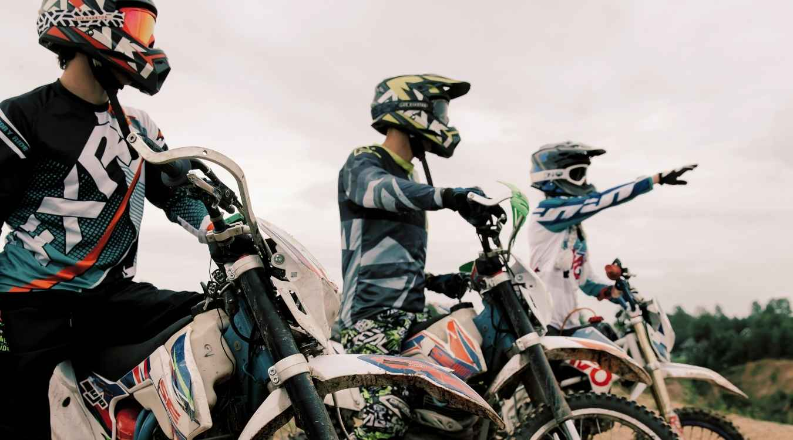
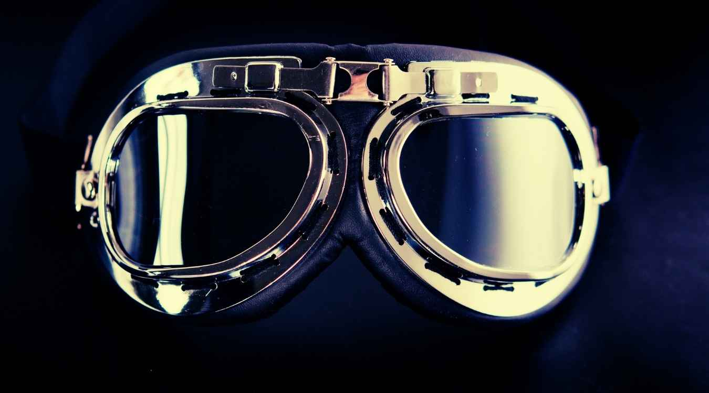
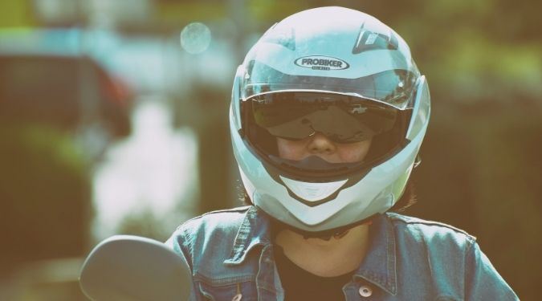

There’s no sense of freedom like an off-road bike ride. You can feel the breeze caressing your face and the breath of fresh air is everything. The thrill is exhilarating but there’s only one danger; one wrong move and you might end up on a hospital bed with multiple head injuries.

That is why you need the best dirt bike helmet and goggles combo.

As much as you are protecting your head, your eyes also need to be protected because they are also quite sensitive when it comes to injuries. However much you are experienced, you should always have your helmet and goggles on.

Recent statistics show that dirt bikes are responsible for most road crash deaths; up to a tune of 60%. The major cause of these deaths is head and brain injuries.

If you get an accident and you have your protective gear on, you have a 37% chance of surviving; [protective bike gear](/bike-apparel/) is quite effective in the prevention of motorbike deaths.

You also have a chance of being compensated if you had your protective gear on especially the helmet. In case you get into an accident and you have a helmet on, you are likely to spend less time staring at the hospital ceiling because your injuries will heal faster; head injuries take long to heal.

## 6 Best Dirt Bike Helmet and Goggles Combo

\[content-egg-block template=offers\_list\]

### **1\. [XFMT Youth Kids Motocross Helmet Set](https://www.amazon.com/XFMT-Motocross-Offroad-Goggles-Butterfly/dp/B017O3EDSA?tag=furiousbikes-20)**

XFMT Youth Kids Motocross Helmet Set is one of the best motocross helmet set because it has everything your kid needs to start off their motocross career.

This motocross set consists of a helmet, a pair of goggles, a pair of gloves and a helmet bag. This helmet is heavily cushioned, has comfortable interiors and it is well vented for an all-purpose off-road ride.

XFMT Youth Kids Motocross Helmet Set comes in 5 colors and these are; black skull, blue flame, blue skull, green frame and pink butterfly.

With these different colors, you are spoilt for choice depending on your preferences.  They also come in three sizes which ensure that everyone is catered for since different kids have different head shapes and sizes.

Ensure you measure the circumference of your child’s head before buying the helmet. The head’s circumference should be measured one inch above the eyebrows in the front while from the back, pick the point that can give the largest measurement.

**Features**

- Beautiful and great UV protective finish
- Flip up modular helmet
- Heavily cushioned
- Sleek modular design

 

**Pros**

- It has a comfortable interior
- It is heavily cushioned
- It is well vented
- Has an UV protective finish
- It is light in weight

**Cons**

- The button tab to attach to the chin strap can be a little short
- The goggles are a little poorly shaped
- Sometimes one is forced to wear different goggles because they don’t fit well

\[su\_divider top="no" divider\_color="#021515" size="1" margin="10"\]

### **2\. [GLX Youth & Kids Motocross/ATV/Dirt Bike 3-pc Gear Combo Set](https://www.amazon.com/GLX-Motocross-Helmet-Graffiti-Goggles/dp/B07737DC4K?tag=furiousbikes-20)**

TCMT Dot Youth & Kids Motocross Offroad helmet set is U.S. DOT approved as it meets the DOTSs certification. The helmet is light in weight and it aerodynamic with a polycarbonate composite shell construction. The inner lining is made of EPS foam which helps in impact absorption in case of a crash.

The helmet has 14-ports ventilation system for maximum air circulation and cooling. The padding has sweat wicking properties and the best thing is that it is removable and washable thus ensuring you are wearing a clean helmet at all times.

The goggles are shatterproof with a UV 380 protection. They are also light in weight and they are made of a bendable PC material which ensures they are hard to break.

**GLX GX-623 Youth Off-road Helmet features**

- It is U.S. DOT certified
- It is light in weight; weighs 2.65lb
- The outer shell is made of high impact resistance polycarbonate composites
- Has 14-ports ventilation system for superior air flow and maximum cooling
- Moisture wicking padding is removable and washable
- Quick-release strap
- Removable and adjustable sun peak

**GLX GX-08 Youth Motocross Goggles features**

- ANSI Z87.1 certified
- Moisture wicking padding foam
- Anti-fog coating
- Adjustable and high elastic strap
- Light in weight; 3.5 oz
- Flexible and shatter-proof frame

**GLX Youth MX Gloves**

- Almost fits all; fits most people a one size

**Pros**

- Has a great price
- It is light in weight weighing just 2.65lb
- Comes with gloves, helmet bag and goggles
- The padding is moisture wicking and it is removable and washable
- Has great ventilation system; 14 vent ports

**Cons**

- The padding can be a little too tight thus uncomfortable
- The screws on the visor can be a little loose
- The sizes can sometimes run a little smaller

\[su\_divider top="no" divider\_color="#021515" size="1" margin="10"\]

### **3\. [Adult Motorcycle off Road Helmet DOT](https://www.amazon.com/Adult-Motorcycle-Off-Road-Helmet/dp/B06XRJYV1X?tag=furiousbikes-20)**

Adult Motorcycle off Road Helmet DOT comes with a pair of goggles; it is well vented to allow enough air flow and maximum cooling for the rider. The helmet has wide openings which means the goggles fit easily. The helmet has a padded liner which is removable and washable to keep your helmet clean and fresh.

Adult Motorcycle off Road Helmet DOT is one of the best dirt bike helmets with goggles; it is light in weight and the material used to make it is light weight sculpted shell. Unfortunately it only comes in two colors and these are green and a few shades of black which does not leave the buyer with much of a choice.

When taking measurements, measure the head two or three times and if all the measurements are different, take the largest measurement. Make sure the helmet fits snugly otherwise it’ll not give you enough protection. Also, if your head measurements fall under two different sizes, you should choose the smaller size.

**Features**

- DOT approved for the U.S safety standards
- It is well vented to allow enough air circulation
- Padded liner for comfort

**Pros**

- Wide opening which allows the goggles to fit
- Has a washable padded liner for comfort and safety
- Well vented and allows maximum air flow
- The light in weight sculpted is comfortable to wear
- The goggles are well fitting

Cons

- The goggles are not of very good quality
- The colors are quite limiting since they are only two to pick from
- The lift up shield is not as durable

\[su\_divider top="no" divider\_color="#021515" size="1" margin="10"\]

### [**4\. 1Storm Adult Motocross Helmet BMX MX ATV Dirt Bike Helmet with Goggles**](https://www.amazon.com/1Storm-Motocross-Helmet-Racing-HF801/dp/B07DMRPPV6?tag=furiousbikes-20)

This is one of the best dirt helmets with goggles and the icing on the cake is that it comes with a pair of goggles for your eyes protection. The helmet is white in color and it only comes in that one color which does not give the buyer enough options to pick from.

The best thing about this helmet combo is that you can choose the size of the gloves and they start from large to XXL which ensures that you pick the one that fits your hand.

The gloves are of high quality which means you are shielded from heavy snow or extremely cold conditions. Same case with the helmet; they come in four sizes; small, medium, large and extra large.

**Features**

- Has a beautiful glossy UV protection finishing
- Removable padding
- Aerodynamic thermoplastic alloy shell
- Light In weight
- DOT approved
- CAPA certified

**Pros**

- You can remove the padding, wash it and replace it with ease
- The goggles have a fitting padding that is comfortable to the skin
- The interior is heavily cushioned which gives the rider comfort
- In case of an accident, the rider’s head is heavily cushioned
- The opening is big enough for goggles to fit.

**Cons**

- It can be a little heavy since it weighs 5lbs
- It only comes in one color which does not give the buyer enough choices to pick from
- It can be a little pricier as compared to others.

\[su\_divider top="no" divider\_color="#021515" size="1" margin="10"\]

### **5\. [Typhoon Adult Offroad Helmet Goggles Gloves Gear Combo](https://www.amazon.com/Offroad-Helmet-Goggles-Blue-Splatter/dp/B003NZ4XO8?tag=furiousbikes-20)**

Typhoon Adult Offroad Helmet Goggles Gloves Gear Combo is a popular choice for almost all off-road riders.

Whether you are blasting the sand, hitting the trails or just being on the road, Typhoon Adult Offroad Helmet Goggles Gloves Gear Combo ensures you are looking great and you are well protected.

This helmet has a wide field vision and it fits all motocross, snocross and ATV goggles.  It is aerodynamic sculpted with a lightweight shell which makes it comfortable to wear. This helmet also comes in different colors to give the buyer enough choices to pick from.

Features

- It meets the DOT standards
- You can easily remove the liner and wash it; either hand wash or machine wash
- It has channel vents, intake vents as well as exhaust vents to allow sufficient air flow
- It has 3 point visors
- Have a standard chin strap, a d-ring closure as well as a strap keeper
- The interior is both comfortable and soft
- It’s light in weight; weighs under 3lbs

**Quality off-road goggles**

- They are anti-fog and anti-scratch coating
- They have a 1 ¾’’ woven strap with an anti-slip silicone
- The urethane frame is comfortable with comfortable face foam
- The elastic strap has non-slip silicone beads

**Comfortable riding gloves**

- They are breathable with a spandex blend
- The palm is made of synthetic leather

Pros

- Comes with comfortable gloves
- Comes with a helmet bag
- You can remove the lining wash it
- It is light in weight
- Have enough vents to ensure the rider gets enough air circulation

**Cons**

- Can be a little pricy as compared to others
- The goggles are somewhat a poor quality
- Sometimes the sizing is not as indicated

### **6\. TCMT Dot Youth & Kids Motocross Offroad helmet set**

With a TCMT Dot Youth & Kids Motocross Offroad helmet set you can be lest assured you will be looking good on the tracks and still be safe from head injuries. With this helmet set, not only does one get a pair of goggles, but they also get [a pair of gloves](https://mtbnz.com/best-mountain-bike-gloves/) and a helmet bag.

This helmet combo in different colors and patterns which means everyone is spoilt for choice. The helmet has a thick padding that’s comfortable with the icing on the cake being it wicks the sweat away. The sleek modular design makes the helmet stylish and it just looks on everyone.

The helmet is well vented which allows enough air get in to cool the rider when it is hot. The goggles come in handy to protect the eyes from dust and other elements like cold air and raindrops when it’s raining; they are suitable for all types of weather.

**Key features**

- Sleek design with flip-up modular design
- Well vented for both winter and summer
- Comes with helmet, helmet bag, gloves and goggles

**Pros**

- Light in weight and extremely durable
- Beautiful UV protection
- Comes a pair of goggles, gloves and a helmet bag
- The padding is thick, comfortable and it wicks away sweat
- The padding is removable and can either be hand or machine washed

**Cons**

- The sizing is almost always wrong
- Goggles are a little uncomfortable to the eyes
- The plastic on the front is a little flimsy

\[su\_divider top="no" divider\_color="#021515" size="1" margin="10"\]

## **Best dirt bike helmets with goggles Buying Guide**

Your safety on the tracks or when riding your bike off the road is something that should never be compromised. You need to put into more considering the price and the quality of helmet with goggles before committing to buy.

Most people dwell on the style and class of their protective gear but the most important should be the quality and how well it protects your head in case of an accident. There are some of the things that you should look into before making any purchases and these are;

- Types of helmet
- Size and fit
- Weight
- Advanced protection features
- Budget

### Types of helmets

Helmets come in different types and these are;

- **Open face;** an open face helmet only covers the top, the back and the sides of the head. An open face does not protect your eyes or your chin. The only advantage to this helmet is the view side visibility which is great.

- **Dual sport helmets;** dual sport helmets are awesome for adventure and they double up as on and off the road gear. Most of these dual sport helmets have integrated visors but only a few of them have face shields.
- **Touring motorcycle helmet**; touring motorcycle helmet gear is meant for long distance motorcross or off-road riders. They come with extra chin protection, vent ports and sun visors. Some of these helmets come with a blue tooth speaker system.

- **Modular helmets**; modular helmets are a combination of the full face and open helmet. These helmets are versatile in that you can flip down the lower part and wear it without the chin bar protection
- **Skull caps:** skull caps only protect the head since they only cover the upper part of the head; these are not the best helmets because there is almost no protection.

### **Size and fit**

When getting a helmet, make sure it fits your head properly; a non-fitting helmet hangs loose or it causes pain on your ears and it can cause pain on your neck or ears. The shape of your head contributes a lot to whether the helmet will fit you or not; it is, therefore, wrong to blame a brand for not having the right size.

Most companies are however working round the clock to ensure that they come up with a size that can fit all. Some of these things that determine whether a helmet fits or not is; the material used to make it, the cheek pads as well as the foam liners.

How to get your helmet size

- Place a measuring tape above your ears or one inch above your eyebrows
- Measure your head’s circumference
- Compare your measurements with the ones on the helmet’s sizing charts

### **Ventilation**

When getting the best dirt helmets with goggles, make sure the helmet has enough venting ports. It doesn’t make sense that your head is well protected but you end up suffocating from your sweat or lack of enough air

To ensure that your helmet is always clean and fresh, make sure the foam liners do a good jb of wicking away sweat and any other moisture. You should also ensure that the padding can be removed, cleaned and replaced.

### **Weight**

Riding with heavy helmet on your head is not only uncomfortable but it also cause injuries like a sore neck or neck irritation and sometimes painful ears. Therefore, make sure the best dirt bike helmet with goggles you pick is light in weight; it should weigh less than 3lbs. If you are lucky you might find one that weighs 1.5lbs but make sure the shell is strong like any other to ensure your safety.

However if you find a 4lbs helmet, don’t hesitate to buy it especially if all the other features are excellent.

### **Budget**

We all want to get a good quality helmet because our health is more important than anything else. As much we are not compromising on our safety, you don’t have to rob the bank to get a high end model of helmets. Just ensure that the helmet has all the important features that ensure your head is well covered and protected.

### **Advanced protection features**

A good helmet ensures that you are protected from all sorts of impacts. Some helmets use the multidirectional impact protection technology while others us omnidirectional technology.  Other important features that we might not have talked about are; fully adjustable breakaway visors as well as dirt bike helmet face shield which helps in keeping away dust, wind, rain or snow.

## **Importance of the best dirt bike helmets with goggles**

Unlike vehicles, bikes do not have any structural protection to the riders. Therefore, it is the rider’s duty to get protection gear to protect his body parts with the most important being the head. Even though all body parts are at a risk of harm in case of an accident, the head happens to be the most delicate and it should be protected at all times. A brain injury is paramount to a physical death which means the end of life. You can survive without other body parts like a broken spinal cord or without some limbs like arms or legs but once you have a brain injury, you are as good as dead.

Spending money on a helmet with goggles increases your chances of survival in case of an accident. 60% of all motorists who escape death is as a result of having a helmet on. Goggles also come in handy incase debris that’s fatal to the eyes is involved.

When you get into an accident and you had a helmet on, there is a chance you will have lower health costs as compared to one who didn’t put on a helmet. This is because, as noted above head and brain injuries are quite expensive to treat. Also, having a full protection gear ensures your whole body is protected.

Most insurance companies will not compensate if they get a wind that you did not have your full protection gear especially the helmet when the accident happened. Therefore ensure you are protected every time you are riding your bike.
