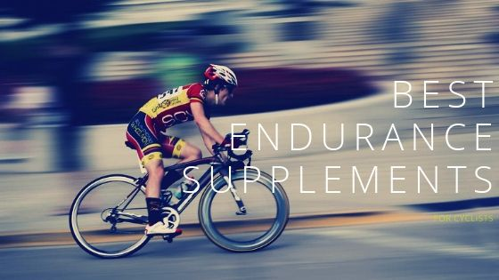
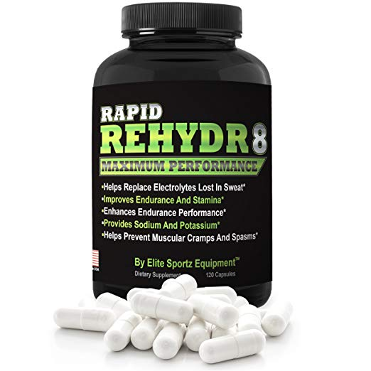
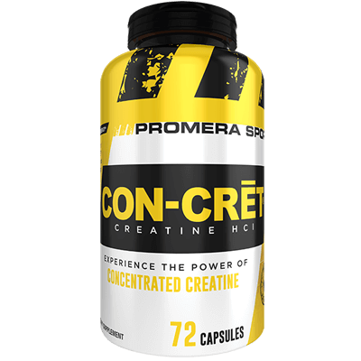
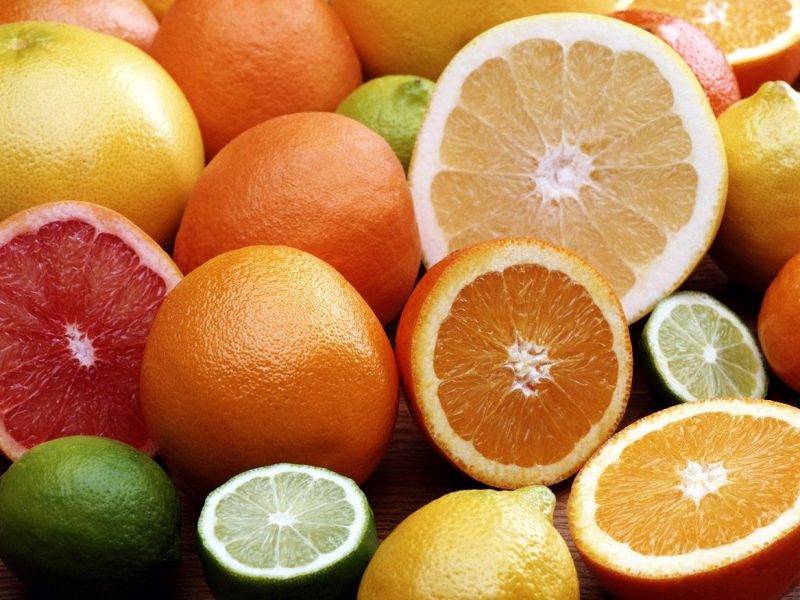
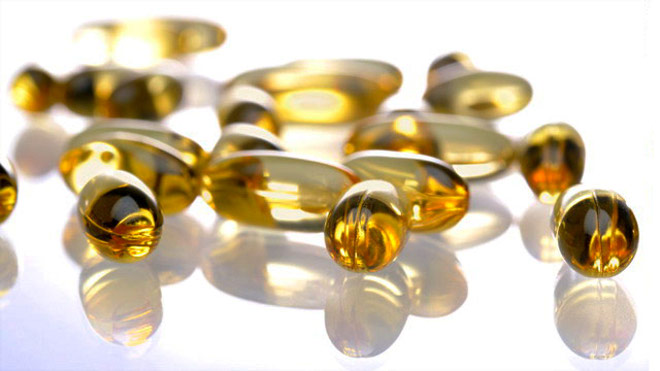
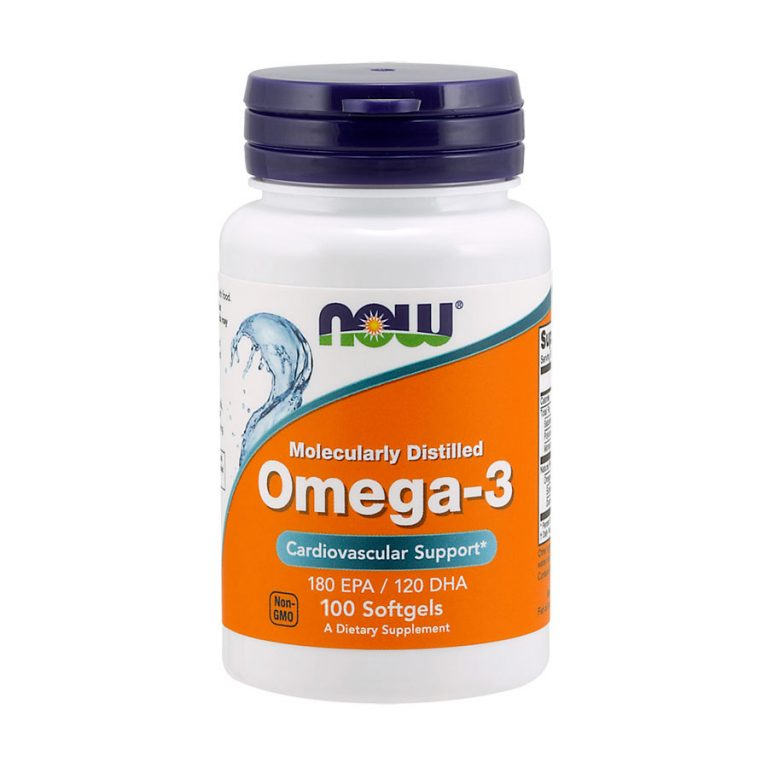

Nutrition plays a key part in making your [bike training](https://mtbnz.com/how-to-train-for-a-century-ride/) effective.  From the best Protein Supplements and Complex Carbs, to Energy bars and Energy Gels, there's something to keep your body fully nourished and fuelled up. Your Cycling Training programs will be so much more effective if you build up your fitness, endurance and energy levels using the latest quality Nutrition products.

Having cycled for most of my life, I can tell you that cycling for over 190 miles a week is not for the fainthearted. It requires endurance training that pushes your body and mind to the limits. You are also required to be on a strict diet and endurance supplements.

For years, we’ve been led to believe that for you to improve your cycling endurance you’d have to spend about 12-16 weeks riding low-intensity miles as a way to strengthen your aerobic system before you can transition to harder training rides or races. Which is a fantastic idea if all you do is ride all day, but for most of us, this is not possible since we have other commitments.

We are left with two options; you can either opt for polarized training or combine regular training with endurance supplements.

Fortunately, with the best endurance supplements for cyclists, you can reduce the amount of time required to train, enhance your performance and recovery. If everything works out perfectly you could be looking at a new personal record.

## Best Endurance Supplements for Cyclists

The physiology of a cyclist is unique as they have to work longer, sustain a high power output and cover more distance. A simple six-hour bike ride could easily deplete all energy reserves which begs the question, what is the best way to build endurance?

The best way is with the help of supplements. However, there is always a challenge on which type of supplements to take.

Here are the best endurance supplements for cycling:

\[content-egg module=Amazon template=custom/simple\_list\]

### 1\. Nitric Oxide (Best Cycling Pre Workout Supplements )

Nitric oxide is a relatively new supplement to the cycling community. It has, however, become one of the best and most used cycling pre-workout supplements. Nitric oxide increases blood flow which will get more nutrients you need to your muscles. It also helps to get you the pump you are looking for while riding.

All Nitric Oxide supplements are based on one main ingredient, L-Arginine. It helps stimulate nitric oxide levels in the body thus dilate blood vessels and increase blood flow to muscles.

The increased blood flow brings more oxygen and nutrients to muscles. Two things happen here.

- First, you get “the pump” as oxygen inflates those muscles like blowing up a balloon.

- Second, nutrients carried along with the oxygen feed the muscles for solid and lean gain. The simplified pathway is shown as;

Arginine → Nitric Oxide → Vasodilation → Nutrient Delivery → Muscle Growth

#### Scary Nitric Oxide Side Effects On Blood Pressure

**Imagine This Scenario**

You have been taking Nitric Oxide supplement for one week, aiming for improved cycling endurance. You are halfway through your workout, and training hard. You have been perspiring copiously, but only replenishing lost fluid from a few occasional sips from your best cycling recovery drink.

You may not be aware but together with the effects of Nitric Oxide and loss of body fluid, your blood pressure has dropped to an abnormal level.

**It Is Scary**

This scenario is scary but is very real. A sharp drop in systolic and diastolic blood pressure results in giddiness, nausea, and fainting (aka syncope). Unsafe drops in blood pressure are Nitric Oxide side effects. This further increases the importance of adequate hydration and self-awareness when supplementing Nitric Oxide. Exercise absolute care to avert this hypotensive side effect, and potentially severe [injury](https://mtbnz.com/how-can-you-prevent-injury-while-cycling/).

**What Actually Happened?**

Cyclists have flocked to Nitric Oxide supplements in search of increased endurance, explosive athletic performance, and a decrease in recovery time.

Nitric Oxide’s primary mechanism of action is its ability to relax blood vessels. It does this by deactivating a protein called Myosin, which is responsible for smooth muscle contraction. As Myosin is deactivated, the muscles of blood vessels relax, allowing for enlargement. This dilation of the vessels allows more blood to reach oxygen-starved tissue due to the reduction of friction and pressure.

The results are enhanced performance and swollen, better-defined muscles. Nitric Oxide’s mechanism of action does have one potential drawback:  a severe swing in blood pressure. Hypotension has its own set of unwanted effects on the body, including fainting and tissue damage, and the [potential for serious injury](https://mtbnz.org/how-can-you-prevent-injury-while-cycling/) in the gym setting.

We advise you to carry out TOLERANCE MAPPING. Please do this;

- Take a small dose for a week.

- Note down every side effects as well as its benefits.

- Make sure you keep accurate records of your workout.

- Then slowly increase the amount until a stage where the benefits outweigh side effects completely. This is painfully tedious, difficult and may as well take time but soon you will meet a point where the two (side effects and benefits) meet. This shall be the optimum dosage you can take at any one time.

By doing tolerance mapping you will reduce the risk but not eliminate it totally. There are chances you still can overdose while your body is trying to adapt it. It is always a painstaking moment trying to jot down every single detail.

Having said all that, we would like to add that Good Nitric Oxide Supplements if consumed in the right quantity can actually take your cycling to the next level. Popular Nitric Oxide Supplements like [NO2 Max](https://mtbnz.com/recommends/no2-max/ "NO2 Max") are extremely effective and no side effects have been reported by the users of Xtreme NO.

\[su\_button url="https://mtbnz.com/recommends/no2-max/" target="blank" size="9" rel="nofollow"\]Get NO2 Max Here\[/su\_button\]

\[su\_divider top="no" divider\_color="#021515" size="1" margin="30"\]

### 2\. Caffeine as a Cycling Supplement

Cycling and coffee seem to go hand in hand and more than a few rides have started, stopped, or layed over at a coffee shop along the way.

It simply makes sense… coffee provides that little extra pep for a good spirited ride, a little motivation after a long day at work, or simply a way to warm-up on a chilly training ride.

  
amzn\_assoc\_tracking\_id = "furiousbikes-20";  
amzn\_assoc\_ad\_mode = "manual";  
amzn\_assoc\_ad\_type = "smart";  
amzn\_assoc\_marketplace = "amazon";  
amzn\_assoc\_region = "US";  
amzn\_assoc\_design = "enhanced\_links";  
amzn\_assoc\_asins = "B07MQWJYJ3";  
amzn\_assoc\_placement = "adunit";  
amzn\_assoc\_linkid = "cf9ccb422cbd281184aeca780d8ed6be";  
  

Whatever the case may be, the topic of coffee always turns to caffeine, and then from caffeine to hydration.  As such, I wanted to provide a little review on caffeine’s benefits for the technical nutrition side and de-mystify some of the common misconceptions.

Caffeine is the active ingredient in coffee, but it also found in tea, and chocolate.  Most energy gels will contain caffeine but most sports drinks will not.

On the ingredients listing, look for caffeine (pretty obvious, huh?), Kola nut, guarana, yerba mate, chocolate, cocoa, and various extracts of tea (green, black or white).  These are all primarily used as caffeine sources.

Since nutritional labels are not required to report the caffeine content in products, a quick search of the ingredients may be required, especially if you are sensitive to caffeine.  The table below lists caffeine content in some common foods and gels used by cyclists.

- 7oz drip coffee (115-175 mg)

- 12oz soda (30-50 mg)

- 1.5oz dark chocolate (30-60 mg)

- Regular Gu Energy (0-40 mg)

- Hammer Gels (0 mg)

- Clif Energy gels (0-100 mg)

- PowerBar Energy Gel (0-50 mg)

Keep in mind, this is caffeine content per serving, so that medium coffee from Starbucks (16oz and ironically called a “Grande”) is somewhere between 300 and 400 mg of caffeine.  Compound this with a few Jet Balckberry Gu Energy gels with 2X caffeine (40 mg caffeine each), and you’ll have nearing the UCI maximum caffeine intake.

#### _**Metabolism**_

So, we start off with caffeine.  Chemists would call it 1,3,7-trimethylxanthine and the structure is shown below.  Your body breaks down caffeine by removing the methyl (-CH3) groups one at a time.   Since there are three places to do this, there are three metabolites:  theobromine (3,7-dimethylxanthine), theophylline (1,3-dimethylxanthine), and paraxanthine (1,7-dimethylxanthine).   Most of caffeine is converted to paraxanthine (~86%),  10% to theobromine, and 4% to theophylline.

- _Caffeine (1,3,7-trimethylxanthine)_

- _Theobromine_

- _Theophylline_

- _Paraxanthine (the sticks are shorthand for -CH3 groups)_

Now understand that many of the effects associated with caffeine may come from caffeine’s metabolites.  Theophylline, while not a major metabolite caffeine, it is responsible for the improvement in lung function.  In fact theophylline is prescribed as a long term asthma medication, helping with bronchodilation.  Teas and cocoa contain proportionately more theophylline than coffee, so if lung function is your thing, teas and hot chocolate may be your thing.  Keep in mind that caffeine and all its metabolites help reduce inflammation.

Alternatively, the diuretic nature of coffee is really associated with paraxanthine (the major metabolite of caffeine).  However, it takes time for the paraxanthine concentrations to increase to appreciable levels… perhaps 2-4 hours.  So for shorter rides, coffee is truly hydration.  By the time paraxanthine becomes important, you are likely already off the bike and rehydrating.

#### _**Effects of caffeine:**_

Caffeine improves cycling performance via several mechanisms including central nervous system stimulation and reduction of the perceived effort for a given workload (e.g., a hard ride just seems a bit easier).  Interestingly, caffeine DOES NOT increase the ability to produce anaerobic energy, but instead increases time to exhaustion and the ability to go further into oxygen debt (e.g., dig  deeper when going anaerobic).  [The PubMed article is located here.](http://www.ncbi.nlm.nih.gov/pubmed/20082092)

Caffeine and paraxanthine are both neuroprotective, with moderate to high caffeine intake decreasing the risk of Parkinson’s Disease by a factor of two.  [The PubMed article is located here.](http://www.ncbi.nlm.nih.gov/pubmed/18075470)

Lastly, caffeine can be good or bad for your heart, depending on your specific metabolism.  You see, the enzyme responsible for breaking down caffeine, CPY 1A2, has several different versions… a fast metabolizing version called CPY1A2\*1A (55% of people) and a slow version, CPY1A2\*1F (45% of people).  Those with the fast enzyme are effectively immune to heart issues with caffeine, while those with the slower enzyme may see a slight increase in their lifetime heart attack risk.  [The PubMed article is located here.](http://www.ncbi.nlm.nih.gov/pubmed/16522833)

Tobacco, broccoli, Brussels spouts, and char-grilled meats all increase the rate of CPY1A2 activity, speeding metabolism of caffeine by as much as 50%.  However, grapefruit juice, certain birth control pills and antidepressants can decrease CPY1A2’s activity and lengthen the time required to rid caffeine from the system.  The spices cumin and turmeric also inhibit the enzyme, lengthening caffeine’s effects.

#### _**Wrap-up:**_

Caffeine certainly has a place in your cycling tool-kit.  It can help open the lungs, increase time to exhaustion and reduce inflammation.  But, as a stimulant it also increases blood pressure and acts as a diuretic 2-4 hours after consumption.  As such, it’s perfect for rides lasting four hours or less.  For longer rides, caffeine can play a role, helping with motivation and focus, but be mindful to maintain adequate hydration levels.

#### Benefits of caffeine for cyclists

- Increase fat oxidation

- Benefits anaerobic cardiovascular exercise and increases power output

- Causes increase in [aerobic exercise](https://mtbnz.com/is-biking-aerobic-or-anaerobic-exercise/) capacity

- Improves body concentration, alertness and reaction time

- Provides a quick jolt

Researchers suggest that the benefits of caffeine will kick in after 30-45 minutes. This means that your performance levels will peak around 45 minutes after consumption.

\[su\_divider top="no" divider\_color="#021515" size="1" margin="30"\]

### 3\. Rapid Rehydr8 Maximum Performance

Rapid Rehydr8 is a product of Elite Sportz Equipment and is formulated as a dietary supplement. Its main objective is to replenish lost electrolytes and counter painful cramps.

Cycling is a very intense sport that quickly depletes your electrolytes. Every drop of sweat coming out of your body is vital body salts that you are losing. If you don’t replenish the lost electrolytes your performance will slowly start to reduce. The best way to counter this is by rehydrating and keep going the distance or workout with a supplement such as Rapid Rehydr8.

Rapid Rehydr8 is also considered as an endurance supplement making it ideal for big races and endurance training. It contains a balanced blend of electrolytes which facilitate for faster recovery.

You see, endurance training burns a lot of electrolytes and if they are not replenished you will be completely burned out. This is why Rapid Rehydr8 contains a blend of magnesium, potassium, and calcium to help rehydrate any electrolytes that are lost through sweating. It also aids in muscle contraction and minimizes leg cramps during exercise.

Magnesium is one of the main electrolytes in Rapid Rehydr8 and can be found in green vegetables, nuts, and whole grains. It activates enzymes which facilitate in the process of energy release. This means that magnesium supplementation has a positive effect on performance and endurance training in cyclists.

On the hand, Potassium which can be found in bananas helps manages several processes such as nerve function, fluid management, and sweat. It is also essential in the breakdown of glycogen in the muscles which fuels repeated contraction that is necessary during endurance cycling.

#### Benefits of Rapid Rehydr8 for cyclists

- Replenish electrolytes lost through sweat

- Provides sodium & Potassium

- Prevents muscular cramps and spasms

- Enhances endurance performance

- Improves endurance and stamina

The recommended dosage is 1-3 capsules before a strenuous exercise, during and an hour after the exercise.

\[su\_divider top="no" divider\_color="#021515" size="1" margin="30"\]

### 4\. Creatine for Cycling

[Creatine](https://mtbnz.com/recommends/creatine/ "Creatine") is a supplement that is often used by sprinters and weightlifters. Creatine is the kind of supplement you consume when looking for speed, strength and power. There are over 100 research studies published on the benefits of creatine and they all agree that creatine aids in improving muscular strength. Which begs the question, how does creatine improve endurance in cyclists?

The direct [benefits of creatine](https://mtbnz.com/is-creatine-good-for-cyclists/) include improved anaerobic performance, increase in ATP production and phosphocreatine stores. Aside from these, creatine offers indirect benefits to triathletes, runners and cyclists thus improving their performance to the next level.

The indirect benefits include a reduction in recovery time and an increase in power output. This translates to improvements in power, speed and running economy for a better race-day performance.

#### Benefits of creatine supplements

- Increases ATP production

- Promotes gains in sprint performance

- Produces maximum intensity effort for longer

Even with its impressive benefits to cyclists, creatine is not recommended for cyclists whose power-to-weight equation will be affected by a slight gain in weight. This is because one of the most discussed downside of using creatine is weight gain.

Recommended creatine supplements include: Bulk Supplements Creatine Monohydrate, Muscle Feast Creapure

### 5\. Beta-Alanine for Cyclists

Research studies show that Beta-Alanine improves performance and delays fatigue during high-intensity workouts.

_**How does this help an endurance cyclist?**_

Being an endurance cyclist does not necessarily mean that you always train at low-intensity exercises. Race pace, weight lifting and tempo runs are also part of your endurance training.

During high intensity training sessions, the body accumulates hydrogen ions which lowers the body’s pH and ultimately results in fatigue. This is where Beta-Alanine supplementation comes into play.

Studies show that Beta-Alanine increases intramuscular carnosine content which helps the body buffer hydrogen ions. This improves exercise performance by delaying fatigue and reducing the perception of fatigue.

Cyclists prefer taking Beta-Alanine as it helps them last longer which could be the key to winning a race. Studies show that Beta-Alanine supplementation can significantly improve sprint performance especially towards the end of a race. Picture yourself in a race with only 500 meters to the finish line, Beta-Alanine will give you the boost you need to get to the finish line and reduce post-ride fatigue.

#### Beta-Alanine Benefits for Cyclists

- Delays fatigue

- Reduces post-ride fatigue

- Increases intramuscular carnosine content

- Improves sprint performance

Recommended Beta-Alanine supplements include: ON Beta-Alanine Powder

### 6\. Whey Protein

Whey protein is seen as one of the most common source of protein for pro-athletes. It’s the go-to protein source for a work out, meal replacement or a post-race drink.

Whey is produced during the cheese making process and is considered to be among the richest source of BCAAs. It comprises of three amino acids; valine, leucine and isoleucine. These three are critical for muscle growth and provide energy during workouts.

Whey protein also contains active protein micro fractions that boost immune function, enhance muscle recovery and provide antioxidant benefits.

Recommended Whey [protein supplements](https://mtbnz.com/best-protein-powder-for-cyclists/) include; Gold Standard 100% Whey -Optimum Nutrition, 100% Premium Whey protein-USN

### 7\. Vitamin C

Vitamin C is already everybody’s favorite nutritional supplement.  After all, it’s a great anti-oxidant and may help bolster the immune system.  But recent research indicates that Vitamin C can help reduce both the physical and psychological effects of stress on people.  And we know that better recovery, means better performance.

People who have high levels of Vitamin C do not respond with the physical signs of stress during intense physical challenges, and they tend to bounce back from these challenges quicker than folks with lower blood levels of Vitamin C.  More specifically, 1000 mg of Vitamin C (about 1600% of the U.S. recommended daily allowance) reduced the stress hormone cortisol by about 30% when compared to folks given a placebo.  They self-reported lower feelings of “stress” as well.

Interesting, huh?

Don’t get me wrong, cortisol is part of the natural physiology of exercise.  It’s an adrenal hormone that helps fuel the “fight-or-flight” response, converting fats and proteins into blood sugar.  It also helps reduce inflammation.  But as with many signally hormones, problems arise when these signals become elevated for long periods of time.  In the case of cortisol, it means long term bone loss, decrease in muscle mass, and likely issues with insulin sensitivity since blood sugar chronically remains higher than it should.  It also appears that elevated cortisol levels can tax the body’s ability to recover, impairs learning, and may lead to decreased levels of neurotransmitter and participate in depression (or at least signs of overtraining syndrome).

And this is Vitamin C that we find in orange juice, grapefruit juice, papayas, cantaloupes, strawberries, broccoli, Brussels sprouts, tomatoes, asparagus, parsley and jalapeno peppers.  But whereas the USRDA for adults is 60 mg of Vitamin C, much higher levels are required to reduce cortisol.  Now here is the interesting point, the USRDA is based on the minimum amount of Vitamin C to prevent scury not promote optimum health.  Higher doses of Vitamin C have also been shown to reduce histamine levels, important for folks with chronic allergies.

High levels of Vitamin C are well tolerated in humans, being water soluble, the excesses are readily excreted in urine.  The half-life of Vitamin C in body stores is about two weeks, so taking larger doses of Vitamin C will last for multiple days.  However, megadoses of Vitamin C are not well absorbed due to the enzyme required for uptake is saturated…meaning small, frequent doses of Vitamin C are much better absorbed than single large doses.

Yet, there are a couple of downsides to taking high levels of Vitamin C.  First, folks who have problems with uric acid based kidney stones may have problems with these larger doses as the breakdown of Vitamin C is along this path.

Secondly, high levels of Vitamin C may suppress the effectiveness of high intensity training, where the goal is to increase aerobic threshold (think about VO2,max).

Vitamin C supplementation decreases “Hypoxia Inducible Factor” (HIF-1) which is responsible for signaling changes associated with decreased oxygen availability.  Such low oxygen or hypoxic conditions can be found during exercise at or above threshold aerobic capacity. HIF-1 helps spur angiogenesis (the growth of new blood vessels) and enhances the production of erythropoietin which singles the body to generate new red blood cells.

As such, my suggestion is to use 2 x 500mg of Vitamin C daily during times focused on increasing exercise volume (building a base, extending the length of long rides and runs) in order to keep cortisol in check.

During build periods, where it’s all about intensity, Vitamin C may limit your aerobic gains.  These cycles should be several weeks at a minimum, or longer than the average half-life of Vitamin C stored in the body to get the full benefit.

### 8\. Omega 3-S

If you’re into nutrition at all, you’re likely already modestly familiar with omega-3 fatty acids and good sources such as fish oil, flaxseed, or algal oils.

The omega-3 polyunsaturated fatty acids have been demonstrated to improve cardiovascular health altering lipid profiles, decreasing arrhythmias, lowering blood pressure, and inhibiting inflammatory pathways.

From the endurance cyclist aspect, preventing and reducing inflammation is critical to enhancing recovery.  Recent studies also suggest that they can help with depression and improve cognitive performance… critical to maintaining focus and drive following intense training.

#### _**What are omega-3 fats?**_

The omega-3 fats are unsaturated fatty acids that have sites of unsaturation three carbons removed from the terminal methyl group of the fat (the other end has a carboxylic acid group).  As such, there are a variety of different molecules that fit this description.  The ones of interest are called α-linolenic acid (ALA), eicosapentaenoic acid (EPA), and docosahexaenoic acid (DHA).

Your body CANNOT make any of these fats and must obtain them from your diet, making them Essential Fatty Acids.  The daily recommended intake is between 1.0-2.0 grams per day.

ALA occurs naturally in a variety of plants foods and is the most abundant of the omega-3 fats.  Flaxseeds are the best source with about 55% of the fat present as ALA.  The flaxseeds need to be ground up in order to get the oils, otherwise they pass through the digestive tract intact.

Also, ground flaxseeds, like ALL omega-3 oils will go rancid quickly at room temperature when oxygen is present, so store ground flaxseeds in the refridgerator in a small, airtight container.

Other good sources of ALA include the cooking oils canola and soybean, with about 10% of their fats being ALA.  I will point out that canola oil is far superior to soybean oil due to the lower content of omega-6, a pro-inflammatory fat.  As it turns out, canola oil is an engineered oil derived from rapeseed.  The name canola stands for “**Can**dian **o**il, **l**ow **a**cid” with a reduced content of the bitter, possibly unhealthy fat called “euric acid”.

EPA and DHA, while less abundant, are more beneficial to health than ALA.  The body can convert ALA to EPA, and then later, convert EPA to DHA.  However, this conversion is slow and not fully effective, with only about 10% of ALA being converted to EPA in males.  In women, the conversion increases to about 20%, and is likely due to the need for DHA in the development of the fetal nervous system during pregnancy.  In fact, DHA is so important that it is typically supplemented in infant formula to aid in brain development, where 40% of brain mass is derived from DHA.

#### _**Getting essential**_

Obtaining enough of the essential fatty acids ALA, EPA, and DHA is not very difficult if you use Canola oil, soybean oil, and eat cold water fatty fish once or twice a week.  However, virtually all freshwater fish tested by the Environmental Protection Agency had levels of mercury higher than the “safe” limit for women who eat fish twice a week, especially if they are of childbearing age.  To avoid mercury contamination and still derive the nutritional benefits of eating fish, I recommend sticking to such cold water fish as wild Alaskan salmon, sardines, and herring which are good sources of health-protective omega-3 fatty acids.

With respect to mercury, the Environmental Protection Agency set the daily safe limit of mercury at 0.1 microgram per kilogram.  A 150 pound person would therefore be safe consuming about 7 micrograms per day.  The following table then shows the quantity of mercury in a 6 oz serving of fish.

Fish Type       Micrograms Mercury  
per 6 oz serving

- Anchovies                       6.8

- Cod                                 16.9

- Crab                               10.2

- Flounder                         8.5

- Halibut                         42.3

- Herring                           6.8

- Lobster                         28.8

- Mackerel                      25.4

- Mussels                          0.0

- Oysters                           0.0

- Perch (ocean)                0.0

- Pollock                          10.2

- Salmon (fresh)               1.7

- Salmon (canned)          8.5

- Scallops                          8.5

- Shark                           167.5

- Shrimp                            0.0

- Snapper                        32.2

- Swordfish                   165.8

- Tilefish                       245.4

- Tuna, Albacore       Up to 128.6

- Tuna, Yellowfin      Up to 128.6

Since eating fish once or twice a week may not be your thing, or you wish to limit your exposure to mercury, Omega-3 supplements are a convenient and inexpensive option.  But there are several qualities that you’ll need to consider before purchasing.

- Check to see if the label indicates that the pills are “free” or tested for heavy metals such as mercury, PCB, or lead.  This is where reputation comes into play.  Alternatively, look for “distilled” fish oils, where the process of purification ensures that any metals are removed.  Distillation can also increase the content of the good omega-3 fats EPA and DHA.  This is a great way to get the most out of your calories.

- Within the first hour or so after consumption, fish oil capsules often cause burps with a fish odor.  While these are mild, some folks find it disturbing.  For those wishing to forgo the fish burps, there are “enteric” coated capsules.  The capsules have a coating that resists digestion at low pH, like in the stomach, and then dissolve readily when they enter the small intestine, preventing the fish burp taste.

- For folks with possible fish allergies, “distilled” omega-3 oils can still be safely taken due to their high purity, where the offending proteins are quantitatively removed.  Additionally, omega-3 oils from non-fish sources are an option and include Algal oil (oils derived from algae, where fish get the omega-3s in the first place).

#### _**Products**_

There are tons of different fish oil products available out there and most grocery stores will see small bottles (at an admittedly elevated price compared with the internet pricing).  Most pills are on the order of 1000 mg of fish oil, so the pills are rather large, but being capsules, they go down easily.  For folks wanting to avoid pills, flaxseed is an option, but contains doesn't contain the good EPA and DHA, just ALA... but it is tastey.

  
_I personally use **NOW Omega-3 softgells**, in the 500 capsule container they run $0.04 a piece._

  
_The enteric coated, molecularly distilled  **NOW Ultra Omega-3 softgells**_ _have no fishy reflux and absolutely no heavy metals._  _In the 180 capsule container they run $0.11 a piece._

### 9\. Biotin

You’re likely more familiar with the vitamin biotin in shampoos and skin/nail creams than you are as a required nutrient of aerobic metabolism. While the utility of such topical applications of the vitamin are questionable since it isn’t absorbed through the skin, it is critical to the Kreb’s cycle where fuel is burned with oxygen to power working muscles. Specifically, biotin supports the metabolization of fat and branched chain amino acids, forming the compounds that turn over your aerobic engine. When glucose is burned to water and carbon dioxide, it is biotin that actual transfers the CO2.

That’s all fine and dandy, but why an article about biotin? Well, it turns out that there is no daily requirement for biotin. Its not that your body can make biotin or its unimportant, but bacteria in the digestive tract _typically_ make enough biotin to support healthy levels... as such, there is no U.S. RDA and biotin may or may not be in your multivitamin and is likely not added to fortified foods. Foods do contain biotin, some like corn, are more bioavailable than other, like grains, where only 20% can be absorbed. But if you run your aerobic engine a lot (say, you do aerobic exercise a few hours a week) or you’ve had a stomach virus or taken antibiotics, you may be deficient or marginally deficient in biotin. The protein avidin, found in egg whites, also can complex biotin and render it useless if the protein is not thoroughly cooked.

Warning signs of margin biotin status include some of the signs of overtraining, including dermatitis or otherwise dry, scaly skin, especially on the face as well as hair loss (most notably is the thinning of eyebrows or thin patches). Since biotin is responsible for the conversion of the branched chain amino acids valine and isoleucine into Kreb cycle intermediates, the level of which increases by a factor of 10X in the first 15 minutes of aerobic exercise, lower levels could limit aerobic capacity. Muscle cramps and pains related to physical exertion can be symptomatic of biotin deficiency, reflecting the body's inability to use sugar efficiently as a fuel. Humorously, the Worlds Healthiest Foods list one one food for biotin, Swiss Chard, with a whopping 3.5% daily value.

#### _**Summary:**_

So, if you train hard, train frequently and have been on antibiotics or had a stomach flu in recent memory, your aerobic performance may benefit from periodic supplementation of biotin. Biotin is rather inexpensive and water soluble so excess biotin is simply flushed from the body.

### 10\. L-Tyrosine

If you read labels, you may have noticed L-tyrosine as a common ingredient in diet pills, weight loss supplements, and some higher end sports nutrition supplements. L-tyrosine, also known as 4-hydroxyphenylalinine, is an amino acid derived from both food as well as synthesized in the body from the amino acid phenylalanine.

As it turns out, tyrosine happens to be the precursor of several major neurotransmitters -- L-dopa, dopamine, norepinephrine, and epinephrine. Dopamine is responsible for drive and desire, while epinephrine and norepinephrine are responsible for focus and wakefulness and in general effect mood and energy levels. Tyrosine has been shown to and increases plasma neurotransmitter levels (mainly dopamine and norepinephrine). Additionally, tyrosine has been subjected to various clinic studies and has shown efficacy with respect to lowering stress hormone levels under stressful condition, such as sleep deprivation, cold, and fatigue.

**_Who doesn't want to have better focus and drive during exercise?_**

**[L-tryosine on wiki](https://en.wikipedia.org/wiki/Tyrosine "External link")**

But that’s not all, L-tyrosine also forms the backbone structure of the thyroid hormones thyroxine (also known as T4) and triiodothyronine (T3). Supplementation of L-tyrosine, along with adequate iodine and vitamin B6 needed in the synthesis of T4, may have a positive effect on thyroid hormone levels which may contribute to an increased metabolic rate.

#### **Supplementation:**

The usual dosage amounts to 500-1500 mg per day (dose suggested by most manufacturers; usually an equivalent to 1-3 capsules of pure tyrosine). It is not recommended to exceed 12000 mg (12 g) per day. In fact, too high doses result in reduced levels of dopamine. In fact, I would stay away from anywhere near this amount.

My personal experience with L-tyrosine suggests much smaller doses, around 100-250 mg are **very effective**, providing both energy and focus during the day. The effect is noticeable for several hours and may replace your morning jolt of caffeine. When used, I prefer the raw powder dissolved in a glass of water. Uptake is faster and dosages can be easily scaled back. As L-tyrosine’s effect will be minimized if it has to compete with high concentrations of other amino acids in the bloodstream, it should be taken several hours after meals or, better yet, first thing in the morning, 15 minutes before breakfast.  The effects are noticable in about 30-45 minutes and last for about 4-5 hours.  The fade is not really noticable, and there really isn't much of a negative, sluggish side as there is with coffee.

#### **Cautions:**

As with any supplement, start with much small doses than recommended by the manufacturer to assess tolerance. L-tyrosine should not be taken if you have high blood pressure as it may raise the concentration of stress hormones (e.g., norepinephrine and epinephrine, aka. noradrenaline and adrenaline, respectively). For the same reason, you should not take L-tyrosine if you are on antidepressants such as SNRIs that effect the reuptake of serotonin and norepinephrine. Obviously, see a doctor if in doubt.

## Achieving Optimal Performance & Endurance in Cycling

### Proteins vs. Carbs

Unlike track sprinting and weightlifting, cycling requires sustained high power and a balance between effort and efficiency. Due to this cyclists require specialized and optimized supplements. Picture the amount of energy a cyclist burns in a single race. A typical 200-mile race requires approximately 50,000 pedal revolutions. Which means a cyclist needs to keep refueling.

These days with all the fad diets it is hard to know what your body really needs to perform at optimal levels. As a highly active person, you want as much out of your body as possible. Your body requires protein, carbohydrate, and fat as a fuel source to perform activities such as running, cycling, etc. This article will focus on protein and carbohydrate as a fuel source during exercise and during recovery, as these are the two primary macronutrients that have been under debate recently.

Proteins (PRO) are crucial for your body to perform daily function. PRO make up the hormones and enzymes that regulate body functions and are the building blocks of your body i.e. skeletal muscle, skin, etc. According to the recommended daily allowance (RDA) PRO should account for approximately 20% of your daily caloric intake. Only a small percentage of the energy derived from PRO is utilized during exercise as a fuel source (~1-2%). The percentage of PRO utilization during exercise can increase, but will only increase when carbohydrate is not available as the primary fuel source. (5)

Carbohydrates (CHO) can be found in the body as muscle glycogen, liver glycogen and in the blood as blood glucose. CHO is the primary substrate used during exercise especially when the intensity of the said exercise increases as seen in Tour De France cyclists who can expend vast amounts of calories. There is however only enough muscle glycogen for a few hours of exercise, but is dependant upon the intensity of the exercise. Liver glycogen and blood glucose can be used by the muscles as fuel but are also necessary to insure proper function of other organs (such as the brain). During aerobic exercise one of the limiting factors in athletic performance could be depletion of fuel sources such as CHO. Since there is a limited amount of stored muscle, and liver glycogen in the body CHO stores must be replenished if you hope to prevent fatigue. CHO feedings during exercise can delay the onset of fatigue by 30-60 minutes, due the increased availability of CHO that can be readily utilized during exercise (2,3).

The type of CHO to consume during exercise is still widely debated. I suggest that you experiment with different sources, and concentrations of CHO while training to determine what works best for you. Glucose, sucrose, and maltodextrins are good choices; fructose however does not seem to be an effective source (3). A suggested concentration of 4-10% CHO mixed in water can be a starting point (1mL of water equals 1g) (1,3,5). During high volume training periods, maintaining glycogen levels from day to day can be a challenge but is essential if you expect your body to continue to perform at peak levels. CHO should comprise at least 55-65% of you total caloric intake.

In conclusion, you still cannot beat the well-rounded diet. Every macronutrient has a vital function within the body. For endurance athletes CHO is the limiting energy source, when one runs out of CHO one "bonks."

## Are cycling supplements for the average cyclist?

Scientific studies that analyze the effects of supplements in sports are often limited to subjects that are well trained and athletic. This makes it hard to compare the results of such studies with those of an average cyclist who may not be as athletic or well-trained.

When taking supplements always consider the subjective experience. There are several aspects of a supplement that cannot be quantified by biomarkers. You can use the numerous test published showing how effective a supplement is but always comes down to how supplement works for you. Is it as effective as you want it to be? Are you experiencing any side effects?

Collect data before and after using the supplement and compare the two. Cycling is a data-driven sport and it’s not just about the GPS and speedometer, it also includes all other tools that track, measure and collect data. Analyzing the data collected is a good place to start as it will help you understand how the supplements affects your body. A supplement that works for a fellow cyclist may not necessarily work for you. This is why collecting and analyzing your data is important.

## Recovery Nutrition

The myriad of unsubstantiated nutrition practices I observe pertaining to postexercise (recovery) nutrition never cease to amaze me. Some of my favorites are:

“I only eat protein after a hard workout”

“I exercise in the evening and avoid eating anything after because it helps me lose weight”

“By delaying eating after exercise I force my body to burn more fat”

“A 40-30-30 distribution of calories from carbohydrates, protein, and fat is most effective at repairing damaged muscle and replenishing glycogen”

Cyclists are by no means immune to these and other nutritional fallacies since we’re always seeking the slightest edge on our competition as a result making us susceptible to falling prey to nutrition quackery. However, the sage athlete follows time tested and research proven strategies to maximize recovery between consecutive race days and during intense training periods.

What follows are the 6 most common real world nutritional pitfalls I observe (some I have even fallen into myself) and the simple solutions to correct them and optimize recovery.

**Pitfall –** Failing to prioritize recovery nutrition by socializing after a race or packing gear/bike away resulting in delayed feeding.

**Solution** – Sure it can be fun to hang out following a race and replay the deciding sprint or get a head start on packing up and leaving.  Furthermore, most experts recommend eating something within the first 30 minutes to an hour so what’s the hurry?  Well in the majority of studies examining glycogen replenishment athletes are fed _immediately_ following the completion of an exercise bout.  Thus, what you practice in the “field” should mimic the conditions of the “lab” as closely as possible.  Make it a priority to eat and drink as soon as stepping off the bike as possible.  Have a friend, spouse, family member, or coach at the finish line with your food and drink if you have a tendency to neglect this crucial time period.

**Pitfall –** Inadequate fluid consumption to replace sweat losses _and_ allow for optimal glycogen replenishment.

**Solution** – You’re probably familiar with postexercise fluid recommendations to replace losses from sweat but few are aware that additional fluid is required to restore glycogen to preexercise levels.  This is due to the fact that three grams of water are required to store one gram of glycogen. Since trained athletes will need to replace more than 600 grams of glycogen following exhaustive exercise, fluid and carbs should be consumed together.  Research in this area is scanty at best but suffice to say simply drinking to replace sweat losses may not be enough to ensure optimal glycogen replenishment.  To be safe, consume 16-24 oz of fluid not only at the first postexercise meal but also during every hour during the recovery period.

**Pitfall –** Using the excuse of a hard effort to fill up on high fat junk foods and empty calories.

**Solution –** It is far too easy to use the need for increased calories after exercise as an excuse to fill up on high-fat content junk foods.  The problem with this practice is two-fold.  First, the consumption of fat interferes with your ability to ingest adequate carbohydrate and secondly fat is not nearly as an effective stimulator of insulin release as carbohydrate.  Both of these follies result in inadequate glycogen replenishment and poor recovery.  Resist the urge to give in to the temptation of dietary indiscretion and find peace in knowing you’re feeding your body only the highest quality fuel by selecting high carbohydrate lowfat foods.

**Pitfall** – More than enough is not better than enough.

**Solution** – Although it is vital to consume carbohydrates in the post exercise state it is also vital to have some method to your madness.  I have seen several cyclists who go about their eating in an unscientific haphazard fashion only to find that they gain weight from their post ride binges.  Aim to consume 1.0 to 1.5 grams of carbohydrates per kilogram of bodyweight every two hours following exercise.  Consuming more than this range will not result in greater glycogen replenishment and if done so chronically may result in undesirable weight gain.

**Pitfall –** Overconsuming protein in the false belief that muscles require excessive quantities following exercise.

**Solution** – As stated previously, favoring other nutrients over carbohydrates leads to inadequate carb consumption and decreased stimulation of insulin release.  Limit protein to one gram for every 4 grams of carbohydrate to replace what is lost through exercise.  This 4:1 ratio of carbs to protein appears to have a multiplicative effect in stimulating insulin release.

**Pitfall** – Following recovery nutrition guidelines for only the first meal after exercise.

**Solution** – You may be avoiding all of the above pitfalls but only at the first meal.  Again, since trained athletes can store upwards of 600 grams of glycogen in muscle and liver it is necessary to consume carbohydrate dense meals every 2-3 waking hours until the next ride or race.

By avoiding these common pitfalls and implementing sound recovery nutrition principles you can be assured of recovering fully for a long summer of weekend racing and training.

## Conclusion

If you decide to incorporate any of the above endurance supplements into your diet, be sure to check the brand. You want to source your supplements from a reputable brand with proven results. Also, be sure to confirm that the supplement is approved by the FDA.
