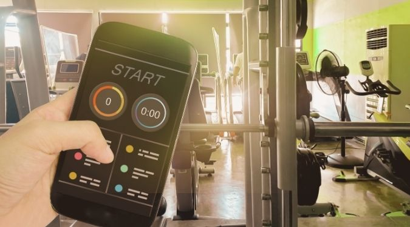
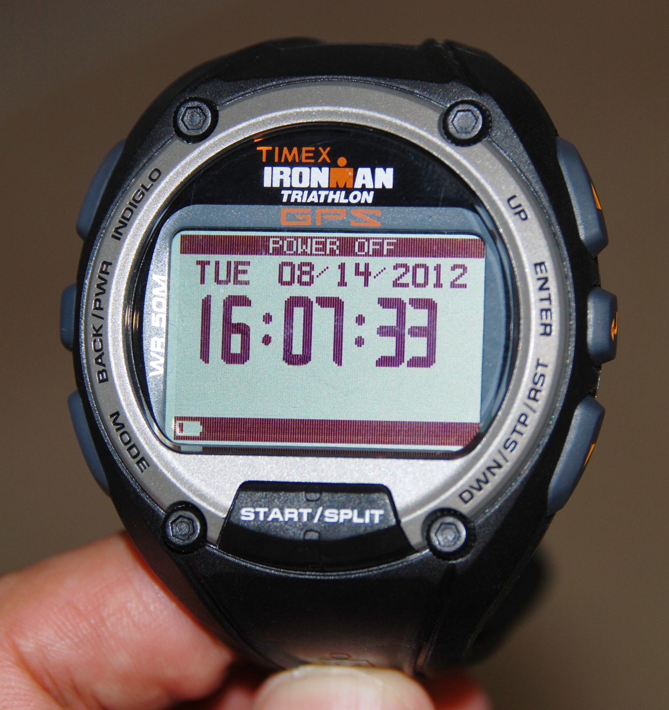
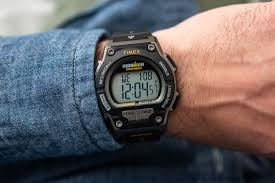
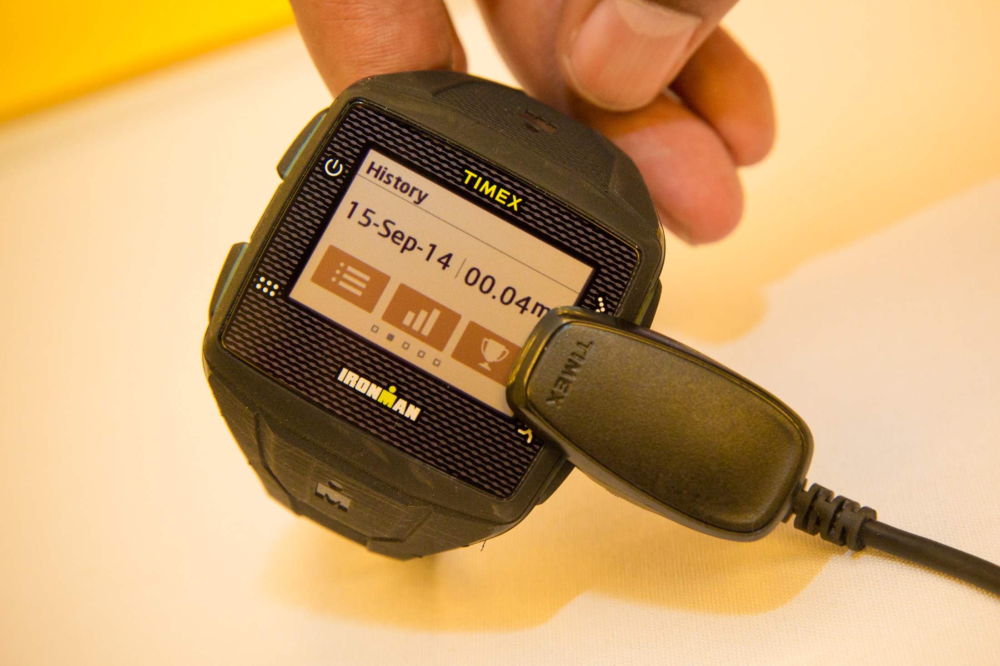

Despite the crazy popularity of cycling specific computers, I am a firm believer that a GPS watch is the most convenient and best fitness tracker for cycling.

I prefer cycling GPS watches because their features and functionalities are simply amazing.

If you are the type of cyclist who does not like to check your stats while in action, then you should definitely invest in the best bike watches available.

### Do any fitness trackers track biking?

Yes,  
  
The Sony SmartWatch 2 has a pedometer which will count your steps and bicycle rides in addition to walking.  
The Samsung Galaxy Gear Fit is another option, that can track the duration, distance and pace of your bike ride.  
If you like biking but have an iOS device then consider the Motorola MotoACTV Fitness Tracker or Nike FuelBand SE fitness tracker for tracking calories burned during a workout while cycling.  
When purchasing any of these products be sure to read product reviews first and contact customer service if needed with questions about their features before making the purchase online. Setting up with all necessary accounts when buying and using these devices is important as well since Garmin Connect does not support Apple devices running iOS 8. 
  
The Fitbit isn't designed to track biking, but it can track steps when awake, calories burned throughout the day (and during exercise), distance traveled while walking or running, active minutes each day and hourly activity levels achieved while you are awake during the hours of your chosen time

### Can Fitbit Track Cycling?

Yes, Fitbit can track cycling. From what I can tell by reading their website Fitbit syncs with apps like Strava to track cycling.  
  
There's also a mode called the "stair climbing challenge" that tracks how many flights of stairs climbed in a day; it calculates how many miles your feet are logging in their efforts to keep you going.

## Best Fitness Trackers for Cycling- Quick Answer

Here are the 5 best fitness trackers for cyclists in 2018. You can choose any one of these and be assured that you'll never miss a track.

1. [**Apple watch series 2**](https://www.amazon.com/Apple-Watch-iPhone-Space-Aluminum/dp/B01LW9G4UO/?tag=furiousbikes-20)

3. [**Polar M200**](https://www.amazon.com/Polar-Running-Watch-Wrist-Based-Heart/dp/B01LQF2KH8/?tag=furiousbikes-20)

5. [**Garmin Vivoactive Smartwatch**](https://www.amazon.com/Garmin-010-01297-00-v%C3%ADvoactive-Black/dp/B00RE1UL52/?tag=furiousbikes-20)

7. [**Garmin FitBit Surge**](https://www.amazon.com/Fitbit-Surge-Fitness-Superwatch-Version/dp/B00N2BWF6Q/ref=as_li_ss_tl?th=1&linkCode=ll1&tag=furiousbikes-20&linkId=1e22da8ec0b2c1ac303d2f25c163854e)

9. [**Moov Now**](https://www.amazon.com/Fitness-Tracker-Audio-Coach-Moov/dp/B01CX26IP8/ref=as_li_ss_tl?ie=UTF8&linkCode=ll1&tag=furiousbikes-20&linkId=4e2d0f2fa5c176a6c8825f37b3b5194b)

## 1\. _Apple watch series 2_

_**Battery life:-**_ Can last up to 18 hours

_**Screen size:-**_ 1.64 inches x 1.04 inches x 0.39 inches

_**Compatibility:-**_ Bluetooth

_**Connectivity:-**_ Bluetooth, WiFi & USB

**Training Data:-** Heart rate, distance, altitude, speed, time & Calories

Most people complained about the first model of the Apple watch series 2. This was attributed to the reason that it was not waterproof, and that the heart rate monitor had to piggyback to your smartphone so as use the GPS.  Good thing is that Apple has integrated GLONASS and GPS; you do not have to carry your phone so as to record an activity.

When you need to record your activities, you just have to use the various iPhone apps such as Strava, Cyclemeter GPS, Apple’s native workout app and Map my ride. With the help of these apps, you can record metrics such as heart rate, speed, elevation gained, cycling route and distance. The only issue is that when using the workout app, you cannot export the data to 3rd party applications.

Apple series 2 watch uses Bluetooth 4.0 to connect to your iPhone, and has the ability to display apps and notifications on its 1.5 inches display. Another awesome feature is the 802.11b/g/n wifi that enables the watch to connect to the internet directly. You can use this smart watch during rain or showers thanks to its water-resistant property.

[Check Price & Reviews on Amazon](https://www.amazon.com/Apple-Watch-iPhone-Space-Aluminum/dp/B01LW9G4UO/?tag=furiousbikes-20)

## 2.  _Polar M200_

**_Battery life:-_** Up to 30 days of 27/7 activity tracking with the notifications turned off; up to 6 hours when using the GPS and optical heart rate  
_**Compatibility:-**_ syncs with Polar Flow app on iOS & Android  
**Connectivity:-** USB & Bluetooth  
_**Training Data:-**_ Can measure distance, calories burned, Time & heart rate  
_**Weight:-**_ 40 grams  
_**Screen size:-**_ visible area diameter is 26 mm, 1342 pixels

The Polar M200 is one of my best fitness tracker for cycling; I appreciate the fact that it is one of the most affordable bike GPS watch that has a greater versatility than more expensive watches.  The watch features an inbuilt heart rate sensor and integrated GPS skills. This wrist-based cycling tracker is efficient in tracking a wide range of metrics you wish. You can connect the watch so that it displays notifications directly through to your wrist.

The screen size is large enough to display glanceable real time data. The watch does not have impressive graphics, but it displays metrics in a simple and clear manner. The watch has a physical button that cyclists can use to cycle through live heart rate data, speed and lap times. The data displayed is always detailed and deep.

With the M200, you can track core metrics such as speed, distance, ascent, heart rate and calories burn in an in-depth manner. The watch allows you to overlay heart rate and speed graphics so that you can analyze in-depth details at every single point along your journey.

The M200 has its own app that works incredibly, however, this does not imply that you cannot use other popular tracking apps. I have recommended this app to most of my friends and they definitely loved its capabilities and features.

[Check Price & Reviews on Amazon](https://www.amazon.com/Polar-Running-Watch-Wrist-Based-Heart/dp/B01LQF2KH8/?tag=furiousbikes-20)

## 3\. _Garmin Vivoactive Smartwatch_

_**Battery Life:-**_ The battery lasts 10 hours when in GPS mode and 8 days when in watch mode.

_**Training data:-**_ Heart rate, speed, cadence, distance, time, calories and altitude

_**Compatibility:-**_ It uses the ANT+

_**Connectivity:-**_ Bluetooth 4.0 & USB

_**Screen size:-**_ 205 x 148 pixels

Garmin has been the leading expert in designing GPS navigation systems. Their expertise has extended in manufacturing the best fitness tracker for cycling. As soon as the GPS wearable watches became popular, Garmin was able to join the bandwagon with great and successful devices.

As a cyclist who loves smart watches, I must admit that this device features an excellent touchscreen design. For starters, the screen has a high resolution and is always readable even when there is sunlight.

The device has a GPS powered application that tracks the distance you ride, time spent, calories burned and the average speed. This fitness tracker for cyclists is compatible with most Garmin accessories such as cadence sensors, heart rate monitors and other cycling related accessories such as bike speed. It implies that the smart watch is ideal for cycling looking for serious exercise as well as casual use.

The Vivoactive can sync with the Garmin connect mobile; an app that works as a social media platform and tracker. The app will motivate you throughout your exercise since you earn badges from your participation. Besides, you can use the up to join fitness challenges with friends.

The Garmin vivoactive Smart watch comes with the Elevate Heart Rate technology that monitors your heart rate around the wrist area. You do not have to wear a chest strap when using the Garmin Vivoactive model.  I appreciate the efforts by Garmin to ensure that this cycling gps watch is water resistant.

Vivoactive weighs only 38 grams, meaning that its lightweight for you to wear all day. It also features a high-end GLONASS/GPS chip, Bluetooth 4.0 to connect with your smartphone and ANT+ that you can use to connect to all compatible accessories.

[Check Price & Reviews on Amazon](https://www.amazon.com/Garmin-010-01297-00-v%C3%ADvoactive-Black/dp/B00RE1UL52/?tag=furiousbikes-20)

\[divider style='centered'\]

## 4\. Garmin FitBit Surge

**_Battery life:_** Can last for 7 days & GPS battery life of 10 hours (this data may vary with settings, usage & other factors)**_  
Connectivity:_**Bluetooth 4.0 & WiFi**_  
Tracking data:_**Time, distance, speed, calories burned & all day activities**_Sizes:_** Small (5.5-6.7 inches); Large (6.3-7.9 inches)

The FitBit surge is one of the best fitness tracker for cycling that boast of its GPS capability. It’s one of the best devices in the FitBit models. Its large LCD wrist display enables to you to view live stats as you ride through trails. In addition, it features a backlit touchscreen that you can opt to control using the three side buttons.

Cyclists can use its GPS technology to track a cycling route and performance in terms of pace, burned calories, heart rate and elevation. You can track metrics without having to carry your phone with you. Athletes have been using the FitBit surge in activities such as circuit training, kickboxing, cycling, swimming, lifting weights and yoga. You just have to choose the type of sport you want to engage in at the Exercise menu.

When you select Cycling as your activity, the watch will acquire a GPS signal so that it can display your average speed, miles covered per hour, calories burned during the ride and our heart rate. After you are done with your ride, you just need to press the finish line button and it will display a summary of your tracked metrics. You can retrieve the summary and map of your cycling route by logging into the application.

[Check Price & Reviews on Amazon](https://www.amazon.com/Fitbit-Surge-Fitness-Superwatch-Version/dp/B00N2BWF6Q/ref=as_li_ss_tl?th=1&linkCode=ll1&tag=furiousbikes-20&linkId=1e22da8ec0b2c1ac303d2f25c163854e)

## 5\. Moov Now Review

_**Battery life:-**_ Can last for 100 hours of active coaching & 6 months of activity tracking  
_**sensors:-**_ Magnetometer, Accelerometer & Gyroscope  
_**Connectivity:-**_ Bluetooth 4.0 (low energy)  
**_Sports programs:-_** Running, Cardio Boxing, cycling, sleep tracking and swimming  
_**Weight:-**_ 6 grams

_**Display mode:**_ LED feedback diode

One of the most unique features about the Moov Now is that you strap it one your ankle. This fitness tracker has a tiny pod that sits comfortable on your ankle at all times. In addition, it is fitted with silicone straps to ensure that you remain comfortable even during long distance rides. This feature also enhances accurate motion tracking. We cannot dispute the fact that this smart watch is great in terms of bike-friendly abilities.

The Moov Now will help you know the number of rotation you put through the pedals and the manner that they reduce when you get tired. This data is calculated at an interval of one minute. The main disadvantage of the Moov Now is that you cannot see the real time data. It lacks an inbuilt GPS and this means that you have to invest in a [**bike phone mount**](http://mtbnz.com/bike-phone-mount/) so that you can use your phone.

### Moov Now App

Despite the shortcoming, the Now comes with an inbuilt coach that gives audio feedback when riding. This training data acts as an active coach and it offers great tips throughout your ride.

For the Moov Now fitness tracker to work well, yo must pair it with your iPhone or android phone. Yo will be require to download the Moov Now app at the play store or iTunes App Store. With this app, it is easy to listen to music while paying attention to your workout status updates.

Its features are a clear indication that the Moov Now is one of the best tracker for cycling. In fact, it is designed to provide cycling-specific metrics such as route difficulty and the tallest climb you rode your bike. The only disappointment is that it lacks a heart rate sensor which is an important feature for cyclists.

### Additional Activities you can track using the Moov Now

Other than using the device as an indoor or outdoor cycling coach, you can use it for other sports and activities, these include:  
_1\. Running_  
_2\. Activity & Sleep_  
_3\. Cardio boxing_  
_4\. Swimming_  
_5\. Cardio workout_  
_6\. Walking_

[Check Price & Reviews on Amazon](https://www.amazon.com/Fitness-Tracker-Audio-Coach-Moov/dp/B01CX26IP8/ref=as_li_ss_tl?ie=UTF8&linkCode=ll1&tag=furiousbikes-20&linkId=4e2d0f2fa5c176a6c8825f37b3b5194b)

## 6\. Timex Ironman Global Trainer

There is a love/hate relationship I have with GPS/heart rate monitors and training aides in general.  I love the fact that I can track my training, get objective data, especially on the run.  But they tend to have their issues, often taking too much time to sync with satellites, losing data along the way, or being just difficult to set-up and use.  Some are pro-bike, others are designed primarily for running, but few are waterproof and truly usable on the swim, run, or bike.  The Timex Ironman GPS Triathlon “Global Trainer” watch is certainly one of the nicer GPS devices I’ve had a chance to review, although it has some demons, once sorted out, its super-accurate and stable.

To start off with, it’s a waterproof watch down to 50 meters.  No bones about it, you can run in the rain or swim with it, it doesn’t care.  There are separate, easily selectable screens for each sport, and you can shift from one sport to another with the touch of a button, providing the useful information in its customizable 4-pane window.  The data is there and displayed in a format you need (min/mile for the run or miles/hour for the bike).

Now the overall device is not small, being about 2.25” across and about 0.65”-thick.  Admittedly, this is par for the course with other heart rate monitors like the Garmin Forerunner series, **Garmin Edge**, and **Sigma RC series**.  There are seven buttons (3 on each side, and a split button in the center).  Setting up the watch is performed on the computer or can be tediously entered stand alone.

  
_(click image for larger view)_

  
_(click image for larger view)_

**GPS Performance:**  The GPS in the Timex Ironman Global Trainer is extremely accurate.  Distances of my common running routes are exact, or more exact than any other device I have used.  Run splits are able to show differences in pace with changes in my running style on flats and I learned a fair bit about improving my running economy in the process.  That said, there is a demon in the GPS.  The GPS takes some time to acquire satellites for the first time and most importantly WILL NOT SYNC with satellites if you are moving (even if standing in a group waiting patiently as is common practice with Garmin devices).  The solution is to start the watch and set it down on a static surface for several minutes.  After that, I never had a problem, but I lost several workouts figuring that it would eventually sync-up along the way… no such luck.  After learning this, I never had any issues with the GPS.  The GPS was able to see satellites while in my vehicle or house if it had found them recently, but had a hard time with the degraded signal indoors and didn’t not sync reliably.  If it lost signal by coming indoors, it was able to re-acquire satellites almost instantly when returning outdoors.

**Charging:**  Battery charging is accomplished with a stick-like clip that attaches to the back of the watch.  The clip only affixes in one direction and charging only takes about an hour or so.  The end of the charging clip has a USB connection, allowing it to be charged via computer (when downloading data), but the set-up comes with a wall charger that I found more convenient.  Battery life was adequate for everything that I did, but the battery needs to be charged frequently even if not being used.  I found on several occurrences that the battery was almost depleted or had fully discharged, so plan appropriately.

  
_(click image for larger view)_

  
_(click image for larger view)_

Usage was very straightforward, simply a matter of finding the GPS satellites and then starting your workout.  There are separate buttons for “splits/laps” vs. “pausing” the chronometer, such as is common at a water stop.  There is also a GPS mapping function which is simply a black/white path of your GPS position, without a background terrain map.  While this function has limited usage on road rides and runs, if you were running or mountain biking in a forest, I could see this is very helpful in new environments, in order to find your way back to a trail should you get lost.  The watch also is ANT+ capable, and should interface with Garmin or CycleOps sensors and power meters, but I didn’t utilize any of these features.  That said, it means you can use existing ANT+ capable heart rate monitors (if you like one brand relative to another for comfort) or happen to grab the wrong strap before heading out.

- GPS-Enabled Watch Measures Pace, Speed, Distance and More in Real-Time

- SiRFstarIII GPS Technology Requires No Calibration

- Customizable Screen Display Show Up to Four Windows of Information

- 20-Workout Memory with Dated Summary Records up to 1000 Laps of Information

- Battery Recharges when Connected to USB Port or to any Electrical Outlet with Included AC Adaptor

- Compatible with ANT+ heart rate, foot pod, bike and power meter sensors

- GPS-Enabled Watch Measures Pace, Speed, Distance and More in Real-Time

- SiRFstarIII GPS Technology Requires No Calibration

- Customizable Screen Display Show Up to Four Windows of Information

- 20-Workout Memory with Dated Summary Records up to 1000 Laps of Information

- Battery Recharges when Connected to USB Port or to any Electrical Outlet with Included AC Adaptor

- Compatible with ANT+ heart rate, foot pod, bike and power meter sensors

- Comes with Timex Flex-Tech™ Digital 2.4 Heart Rate Sensor

## How to choose the best fitness tracker for cycling

Nowadays, the market is full of many devices that are promising to help you improve your fitness and health. This is an issue that presents problems to cyclists when trying to choose a bike watch that has the right features. Our goal is to assist you weed through the available options by pointing out the key features and factors you should look for.

### Check for ANT +/ Bluetooth

Bluetooth is one of the key features you should look for when choosing a cycling watch. Bluetooth connectivity is important because it allows you to connect the GPS watch to your smartphone. Most smart watch brands allow cyclists to download crucial metrics.  With Bluetooth connectivity, you can create and edit activity modes.

Incredibly, watches with Bluetooth connection can display your phone notifications. Different watches will show various notifications, but you can adjust and limit them to just texts and calls when in action.

You’ll note that Garmin’s watches rely on the ANT+ protocol to link to cadence sensors. They also have the Bluetooth feature that connects to your smartphone. In addition, most of the best cycling watches can connect to your WiFi network. This helps you synchronize your rides without having a smartphone connection.

### Check for Power meter support

If you plan on riding with a power meter, then it is wise to confirm that the cycling watch of your choice has a power meter support. You may be surprised that some of the most appealing activity trackers do not come with this feature; others will have certain limitations.

### Choose if you want to use buttons or touchscreen

With current technology advancement, multisport watches and GPS head units are using touchscreens. I support that this is an awesome feature; however, I find the watch screens to be quite small for my fat fingers.

When looking for the best fitness trackers for cycling, I always look for the button lock feature. It would feel so bad when you realize that you paused your watch unknowingly when cycling. Ensure that your bike watch has a button [lock](https://mtbnz.com/best-lightweight-bike-locks/) to prevent such frustrations.

### Check the quality of the Screen and strap material

The strap material does not play a major role here, everybody is entitled to their preference. Most of these smartwatches have flexible silicon bands while others come with fabric and leather bands. You can also change the straps if you like.

Nowadays, Plastic screens do not exist; in fact, they do not offer resistance to scratches. Companies have realized that cycling fitness trackers should have mineral or Gorilla Glass screens. These screens do not get scratches or break easily. In case you are willing to spend on high-end units, you can get those with crystal or sapphire screens.

### Ensure that the cycling watch has in-built sensors

For a watch to fall in the category of best fitness trackers for cycling, it should feature a couple of sensors. Quality watches will have an in GPS that helps track your ride. In addition, these watches are designed to connect to the GLONASS network so as to enhance accuracy. In addition these watches require you to connect to your smartphone so that you can track speed and distance.

The good thing about smart watches is that you can use them for sports such as swimming, mountaineering, and running. The latest models of smart watches have introduced wrist based heart rate monitors. These watches have the power of reading all the electrical activity in your heart when in action. The sensors must be in direct contact with your skin so that the machine reading can take place.

## 3 Common Mistakes of Heart Rate Training

With the exception of people living in caves or getting their product advice from the octogenarian mechanic at the “dark” local bike shop, you’ve seen, heard, read, and had friends that have used heart rate monitors.  They’ve been around for about 20 years or so at this point and are a fairly standard tool.  Since heart rate is a reliable indicator of exercise intensity, it can be a very effective method to guide training.  But simply having a heart rate monitor will NOT make your workouts better or more effective.  There are three very common mistakes made with using heart rate monitors.

### **1\. Don’t blindly use the heart rate zones based off age!  Know yourself!**

In order to have [effective training](https://mtbnz.com/how-to-train-for-a-century-ride/), you need to target specific heart rate (or power) zones during your training.

Training too hard, too often simply mean that your hard days aren’t hard enough, and your recovery days aren’t soft enough… and your training will suffer in the long run.  Having knowledge of the different training zones is important, such that you can perform specific, targeted workouts.  But this can only happen if you known yourself.  You need to KNOW your maximum heart rate.  Don’t estimate it.  The formula:

 _HR,max = 220 – age_

is very inaccurate.  It’s marginally useful when first learning about [aerobic exercise](https://mtbnz.com/is-biking-aerobic-or-anaerobic-exercise/) and setting up zones, but simply doesn’t work for a large fraction of the population.  An example of this is a male cyclist with a maximum heart rate in excess of 250 beats per minute.  It’s not bravo.  It’s not a lie.  I’ve seen his heart rate during training, holding a constant 230+ beats a minute on a hill climb.  Using the formula above, he would train far too easily to be effective. 

While knowing your maximum heart rate is useful for setting HR zones, actually maxing out your heart is rather difficult and somewhat hazardous.  A better option is to find your functional threshold heart rate (this is the maximum average heart rate for 60 minute effort).  This can be accomplished by taking the average heart rate during a short RACE.  This can be a 10 mile time trial on the bike, or a 5K run.  Both of these will yield heart rates of around 103 - 105% of FTHR.  Alternatively, you can download your heart rate data and analyze the data for a training run.  You’ll see a range of heart rates, but there should be a relatively sharp cut-off at your lactate threshold heart rate.  This method works nicely, since you can effectively operate just below lactate threshold per a good while, whereas only for a few minutes above it, hence the sharp cut-off.

Knowing either your maximum heart rate, or better yet, your lactate threshold (or FTHR), you can then set training zones. These zones coupled with a weekly training plan can then lead to a formidable routine where you spend enough time in the higher zones to elicit a significant training response, but not so hard that you don't get adequate recovery. After all, all that training destroys muscle tissue and decreases performance, but recovery is what allows supercompensation and improved performance. Yes, both sides are needed, but they are far more effective when balanced.

### **2\. Your heart rate monitor is useless during short intervals!**

Due to cardiac lag, your heart rate is a poor indicator of intensity for efforts lasting less than about 2 minutes.  Your heart rate changes due to the demands of working muscles.  A higher heart rate simply means more blood is pumped per minute, and therefore more oxygen is delivered.  However, short efforts lasting 15 seconds or so are fueled almost entirely by ATP and do not require oxygen.  These efforts are fully anaerobic (without oxygen).  For efforts lasting up to about 60 seconds, a reserve fuel called creatine phosphate can replenish ATP stores… again, without significant demand for oxygen.  It is only after 60 seconds that aerobic metabolism comes to play a major role.  After about 60-90 seconds, aerobic metabolism is by far the dominant energy source and therefore your heart is needed to provide the oxygen required during these efforts.  Heart rate training is best suited for maintaining long, constant efforts.  For short efforts, simply use your perceived effort to gauge intensity or pony up for a power meter.

### **3\. Don’t read tea leaves!**

Heart rate monitors, especially those that allow the user to download their second-by-second data, can provide a wealth of data.  However, there is a tendency to over interpret the results.  But be cautious.  Heart rate is subject to a decent amount of variability due to hydration levels, anxiety, and temperature.  As such, heart rate monitors are a secondary indicator of performance and not a direct measure as would be power. 

Don’t be overly concerned with the specific numbers on a given day.  Look for trends in the data.  Blood chemistry changes slowly, new blood cells aren’t made and matured in a weekend.  It is only over the course of weeks and months can heart rate monitors measure the effect of training, and even then the data would only be useful on the same course with the same conditions.

Lastly, there is always a habit of comparing your numbers to that of your buddies, inferring a higher number during training is harder, or a lower resting rate means you are more aerobically fit.  But a large portion of these limits are determined by genetics… things like the size of your heart.  You guy that has an approximate 250 bpm max heart rate has a small heart.  Other folks, like Miguel Indurain, have monstrously large hearts (and in Indurain’s case, very large lungs as well).
