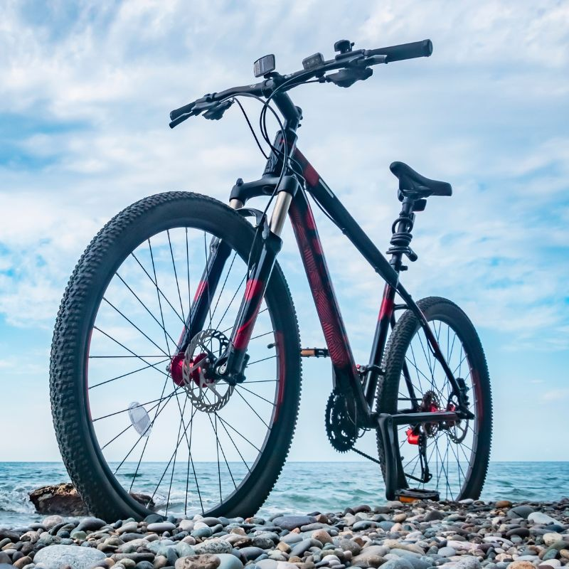

Hardtails—_mountain bikes with front suspension_ _but a rigid rear triangle_—offer simplicity, efficiency, and loads of fun on the trail. They are also generally more affordable than full-suspension bikes, making them a great option for beginner mountain bikers on a budget.

In this guide, I'll share my picks for the **best hardtail mountain bikes under $1,000** based on my hands-on testing and expertise. I'll cover what to look for in an affordable hardtail, provide an overview of each of my top picks, and offer advice to help you choose the right bike for your needs and riding style. 

## Best Hardtail Mountain Bikes Under $1,000

Show Summary

Here are the best hardtail mountain bikes under $1,000 in 2024:

1. **Moongose Flatrock Hardtail Mountain Bike**: This is a very affordable entry-level mountain bike best suited for beginner riders looking to ride light trails and smooth terrain _recreationally_.
2. **Huffy Hardtail Mountain Bike**: A good choice for beginners or those who ride infrequently. It may not be the best choice for more serious or experienced riders.
3.  Trek Marlin 7 Gen 2 Hardtail Mountain Bike: Priced at $899, this mountain bike is a good option for those looking for a balance between cost and performance
4. **Cannondale Trail 6**: This hardtail mountain bike is priced at $860 and is considered a well-rounded option, striking a balance between excellent features, upgradability, and aesthetics
5. **Co-op Cycles DRT 1.2 Mountain Bike**: This bike is priced at $999 and is appreciated for its decent off-road abilities and convenient REI warranty
6. **Specialized Rockhopper Comp 29**: This bike is priced at $950 and is known for its high-level build quality and well-executed design
7. **Giant 2022 ATX**: This bike is a budget-friendly option with a plush suspension and up to 100 mm of travel
8. **Norco Storm 2 29**: This bike is priced at $899 and is another good option for beginners looking for a balance between cost and performance
9. **Kona Lava Dome**: This bike is priced at $875 and is another good option for those looking for a balance between cost and performance
10. **Moosejaw Diamondback Sync’R 27.5**: Ideal for aggressive trail and enduro riding on a budget.

### Frame and Geometry

- Look for modern standards like boost axles, tapered headtubes, and slack head tube angles around 65-66 degrees. This provides better handling and control.
- Quality aluminum frames from reputable brands offer the best value. Good options include Trek, Vitus, Nukeproof, Ragley, Canyon, Norco, and Polygon.
- Wheel size preferences vary. 27.5″ wheels are more maneuverable while 29″ wheels roll faster and smoother. Good all-rounders have 29″ front and 27.5″ rear.

### Components

- Components should match the intended use. Trail and aggressive hardtails need sturdy drivetrains, wide-range cassettes, dropper posts, and beefy tires. Cross-country bikes prioritize lightweight parts.
- **Focus more on frame quality over components in this price range. Components can be upgraded later.**
- Look for 1x or 2x drivetrains, hydraulic disc brakes, and 80-120mm travel suspension forks from RockShox or SR Suntour.

## Why Hardtails are Better Than Full-Suspension Mountain Bikes

The [hardtail vs full-suspension mountain bikes](https://mtbnz.org/hardtail-vs-full-suspension-mountain-bike/) debate has raged for years. While full-suspension mountain bikes excel at descending and high-speed technical riding, hardtails have advantages that make them better choices than full-suspension bikes for many riders and trails.

Here are some ways in which hardtails are better than full-suspension mountain bikes:

### Hardtails Have Superior Climbing Ability

Hardtail mountain bikes excel in climbing. The absence of rear suspension ensures that all your pedaling power is directly transferred to the rear wheel, making it [easier to climb](https://wyattbikes.com/top-5-benefits-of-riding-a-hardtail-mountain-bike/) hills and mountains. The front suspension fork helps keep the front wheel on the ground, improving traction and control on steep inclines.

### Lower Weight

The most obvious benefit of a hardtail is reduced weight. By eliminating the rear shock, pivot hardware, and linkages, hardtails shed pounds compared to bulkier full-suspension bikes. Less weight makes hardtails easier to maneuver and quicker to accelerate. Lighter bikes are also [easier to pedal uphill](https://www.outsideonline.com/outdoor-adventure/biking/will-lighter-bike-make-me-faster/).  
  
Hardtail frames are often made from lighter materials like aluminum, carbon fiber, or titanium. Full suspension designs require stronger, heavier frame materials to handle the forces involved. So all else being equal, a hardtail will be lighter than a full suspension bike.

### Enhanced Traction and Control

Hardtails waste less pedaling energy thanks to their rigid rear ends. With no rear suspension to absorb power, more force transfers directly into forward momentum. Hardtails excel at climbing and accelerating thanks to their [pedaling efficiency](https://pubmed.ncbi.nlm.nih.gov/17545890/).  
  
Full-suspension designs require extra rider effort to overcome the suspension movement with each pedal stroke. Hardtails put every watt of power directly to the rear wheel. Efficiency gives hardtails an advantage for long rides with plenty of pedaling.

### Lower Cost and Maintenance

The elegant engineering of full suspension bikes comes at a price. In general, hardtails cost significantly less than dual suspension bikes with comparable components. You can get a high-quality hardtail for half the price of a similarly equipped full suspension bike.  
  
Hardtails also retain their value better when selling used. The simpler design means there's less to go wrong or degrade over time. So you can get more back if you decide to sell a used hardtail later.

### Better Skill Development

Riding a hardtail requires adopting proper techniques like standing up, using your legs as suspension, and choosing smooth lines. Learning these skills on a hardtail will make you a better rider when you transition to a full suspension bike.  
  
It's easy to rely on rear suspension to mask poor riding habits. But hardtails force you to [read terrain](https://www.trainerroad.com/blog/how-to-approach-technical-mountain-bike-terrain/) and use proper body positioning. The skills you gain will directly translate to dual suspension bikes.

## What to Look for in a Hardtail Mountain Bike Under $1000

### The Frame

When selecting a hardtail mountain bike for under $1000, the frame is the most important component. Most budget hardtail mountain bikes come with an aluminum frame, which offers a good balance between weight and durability. Look for these key features:  
  

- **Modern geometry:** Contemporary trail bike geometry with a slacker head tube angle, longer reach, and shorter stems improve handling and stability.
- **Boost hub spacing:** The wider Boost axle and hub spacing provide increased stiffness and support.
- **Internal cable routing:** Internal cable routing not only looks cleaner but also protects cables from damage.
- **Threaded bottom bracket:** Threaded bottom brackets are easier to service than press-fit designs.
- **Multiple wheel size options:** Many hardtails are available in both 27.5” and 29” wheel sizes to accommodate different rider heights and preferences.

### Suspension Fork

Hardtail bikes have front suspension only. Look for a bike with a front fork that offers between 100 and 120 millimeters of travel. This will be sufficient for smooth trails and cross-country-style riding. Look for:  
  

- **Air spring:** Air sprung forks are lighter and allow easier adjustment compared to coil spring designs
- **100-120mm travel:** Short to mid-travel forks provide a balance of efficiency and bump compliance for hardtail use.
- **Lockout:** A lockout feature improves pedaling efficiency by stiffening the fork on smooth climbs.

### Components

Quality components are essential for proper shifting and braking. Look for:  
  

- **1x drivetrain:** A 1x system with a single chainring simplifies shifting and reduces weight.
- **Wide-range cassette:** A 10-42T or greater cassette provides adequate gear range with a 1x drivetrain.
- **Hydraulic disc brakes:** Hydraulic disc brakes deliver strong, consistent stopping power in all conditions.
- **Dropper Seatpost:** A dropper post allows lowering the saddle for descents to improve control.

## Difference Between a Hardtail and a Full-suspension Mountain Bike

Here are the key differences between a hardtail and full suspension mountain bike:

- **Suspension**: A hardtail has front suspension only, while a full suspension bike has both front and rear suspension. The rear suspension provides additional comfort, traction, and control on rough terrain.
- **Weight**: Hardtails are lighter weight since they lack the rear shock and linkage. Full suspension bikes have more components so they tend to be heavier.
- **Efficiency**: Hardtails are more efficient for pedaling since there is no suspension movement in the rear absorbing pedal energy. Full-suspension bikes can lose some efficiency due to the rear suspension.
- **Cost**: Hardtails are generally less expensive than similarly equipped full-suspension bikes. The rear suspension adds cost to the frame and components.
- **Maintenance**: Hardtails have fewer moving parts, requiring less maintenance over time compared to full suspension designs.
- **Riding style**: Hardtails excel on smoother trails and for cross-country riding. Full suspension bikes perform better on steep, rough terrain thanks to the increased control and traction.

Want a mountain bike that’s cheap? Easy to maintain? Lighter than a full-suspension bike? Hardtail mountain bikes could provide you with everything you’re looking for.

These types of mountain bikes are perfect for beginners because they’re a lot less hassle than full suspension bikes, using a suspension fork at the front to provide the rider with cushioning from bumps. But that’s not all.

When it comes to grip and handling, you’ll find these bikes a lot easier to play with, especially because they don’t have any rear suspension. If you want to ride off-road, hardtail mountain bikes are a great place to start.

## What are the Benefits of a Hardtail Mountain Bike?

When it comes to pedalling, hardtail mountain bikes can be a lot easier to manoeuvre than full suspension bikes, especially as the latter can move up and down when you’re riding, which can waste your energy.

On the best hardtail bikes, the rear end is rigid enough to focus your effort into a forward motion – making them [great for beginners](https://mtbnz.com/buying-your-first-mountain-bike-guide/) or those who don’t want to exert too much energy during cycling.

That’s not to say that hardtail bikes are perfect. Because they lack a shock absorber at the back, the rider can experience more shocks from the ground when cycling, which can increase the chances of the tires puncturing. In addition, the wheel will often skip over the ground on rougher terrain – providing you with less control compared to other types of mountain bike.

## What to Look for When Buying a Hardtail Mountain Bike

Just like other types of mountain bike, hardtails are made up of various components which will vary depending on the make, model, and manufacturer.

However, one thing that’s pretty consistent is [wheel size](https://mtbnz.com/best-mountain-bike-wheels/). Most hardtail bikes will come with wheels that measure 26 inches, although newer models might have 27.5-inch wheels – a trend that is becoming more popular.

These wheels are smaller than other types of mountain bike as it allows hardtails to roll over objects without their handling being impacted.

If you are looking for an entry-level hardtail bike, you might want to stick with the 26-inch wheels. However, the larger 27.5-inch wheels offer a similar level of handling and control but will allow you to clear obstacles with less fuss. You might want to try bikes with different wheels before you make a purchase, and decide which one is best.

## SHOULD YOU BUY A HARDTAIL BIKE OR FULL SUSPENSION BIKE?

If you still haven’t decided whether a hardtail is right for you, ask yourself the following questions: how frequently are you planning to use your bike? What type of riding are you planning? Do you want to be able to handle big hits? Stay off-road? Have a great deal of control when cycling?

Answering these questions will help you to decide whether a hardtail bike is worth it, or whether you should opt for a full suspension model instead. If you are still unsure, checking out product reviews and watching video tutorials will help you to make up your mind.

## WHAT ARE THE THREE DIFFERENT TYPES OF HARDTAIL BIKES?

There are three main types of hardtail bike: trail hardtails, cross-country hardtails, and dirt jump bikes. Here we’re going to explain each one in further detail…

### \+ Trail hardtail bikes:

These types of hardtail bikes are sometimes referred to as hardcore hardtails and are capable of traveling large areas at any one time.

A lot of riders prefer these bikes when they are on a downhill trail, and they will often have longer travel suspension forks that allow the cyclist to exert more control when riding over rough terrain. This type of hardtail bike is heavier but uses sturdy equipment and frames, making it a perfect choice for a beginner who wants to cycle on a number of different terrains.

### \+ Cross-country hardtail bikes:

Like trail hardtails, cross-country hardtail bikes can cover a great amount of distance in one go so are often used for racing. With forks that range from 80 to 120 mm, these bikes will sometimes be fitted with a fork lockout for easier riding and come with light aluminum frames.

Other materials are sometimes used instead of aluminum (such as steel or carbon fiber), but they will usually be found on more expensive models. Some cross-country hardtails will use larger-diameter wheels that measure 29 inches.

### \+ Dirt jump bikes:

Perfect for adrenalin junkies everywhere, dirt jump bikes have lower frames than other types of hardtail bikes and aren’t as good when it comes to covering big distances. Steel is often used on the frame and the components are designed to be strong and durable.

Unlike some cross-country hardtails, these bikes will rely on smaller wheels (usually 24 or 26 inches), and will probably only have one gear. These bikes are strong and have been designed to withstand a lot of pressure and use, although they might be best suited for the more advanced rider.

#### Conclusion

When it comes to finding the right hardtail mountain bike for you, you will need to consider your budget – especially as these bikes can range in price depending on size and features.

The Marlin 5 2015 Model from Trek is an entry-level hardtail for everyday riding. Manufactured using a light aluminum frame, the bike comes with cable disc brakes, a travel suspension fork that measures 75 mm, and speed shifting from Shimano.

At the more expensive end of the market, the 905 201 Model from Whyte is a trail hardtail with a travel revelation fork of 130 mm. The 905 has a lightweight frame and 650 lb wheels – making it a great feature-rich bike that provides riders with the safety, security, and speed that they need. The product comes with a RockShox Revelation fork and a 2×10 drivetrain from Shimano.

Somewhere in the middle price-wise is the Pitch 2015 Model, which has 650b wheels (a combination of 26 and 29-inch wheels), a lightweight aluminum frame, great bikes, lockout suspension form, and hydraulic disc brakes. All three bikes look great and ride well, although offer different features and components based on their price range.
