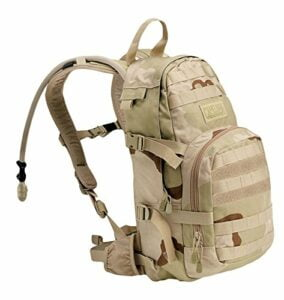
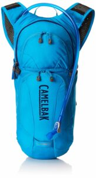
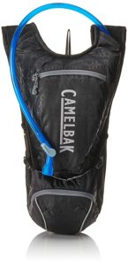
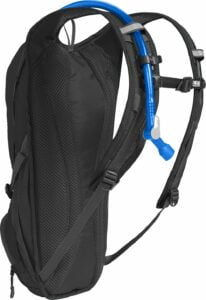
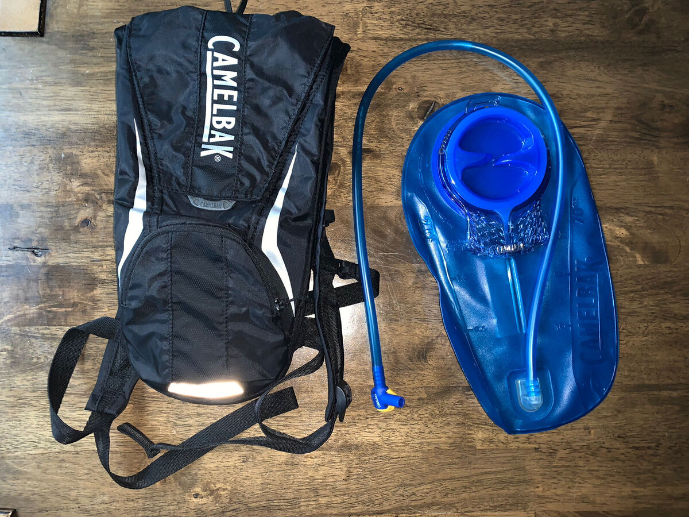
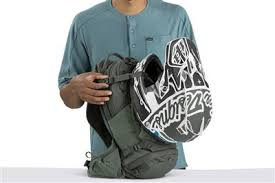
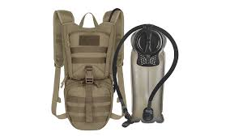

When buying the best hydration packs for mountain biking, you need to know that comfort and temperatures are the most important aspects. If your hydration pack cannot store the water in the required temperatures, there is no need to buy it. Our number one hydration pack, the [Camelbak hydration pack](https://www.amazon.com/dp/B00EPGSDOA/?tag=furiousbikes-20), is a great option for both men and women.

The first thing you will notice about it is that it is extremely lightweight. It is also equipped with CamelBak’s award winning hydration system that is convenient, efficient and easy to use. If you have a tight budget to stick to, this hydration pack will offer you functionality and efficiency. If you don’t require much storage space, you will love it.

## A Summary of the Best Hydration Packs for Mountain Biking

\[content-egg module=Amazon template=custom/list\]

### 1\. [CamelBak HAWG NV 3L hydration pack](https://www.amazon.com/CamelBak-Hydration-Desert-Camouflage-Pattern/dp/B0028VQD0A/?tag=furiousbikes-20)

\[su\_button url="https://amzn.to/2xqILT7" target="blank" style="flat" background="#f03511" size="9" center="yes" radius="5" rel="nofollow"\]Check Price At Amazon\[/su\_button\]

\[su\_spacer\]

The brand new CamelBak HAWG NV 3L hydration pack is a much improved and refined version of its predecessor. It has been constructed with lighter materials and makes use of Camelbak’s new technologies such as the NVIS back panel.

> If you are wondering about CamelBak’s choice of name for the pack, H.A.W.G., it apparently stands for ‘holds a lot of water and gear’.

It’s true the HAWG NV holds 3 liters of water in the brand spanking new Antidote bladder and plenty of storage space, perhaps even enough for an overnight stay. Unfortunately, CamelBak doesn’t look like they spent a lot of time organizing the storage area.

If you enjoy nothing more than spending the entire day riding up and down mountainsides and tough terrains, you will definitely become good friends with the CamelBak HAWG NV 3L hydration pack. This pack does not just provide you with adequate hydration, it is capable of enhancing your ride, and once you have tried it out you’ll ever turn back.

#### Technical Details

- Fabric: 70D Diamond Claurus & 420D nylon with DWR + 1000mm PU CoatingvCargo Capacity: 19 vitresvBladder/Size: 3 litre Antidote reservoir with Quick Link system
- Helmet Holder: XC Helmet Carry
- Waist Strap: Wide 38mm/1.5″ strap with integrated cargo pockets
- Sternum Strap: Dynamic Suspension and slider sternum strap
- Back Panel: N.V.I.S
- Pocket 1: Fleece Lined Media Pocket
- Pocket 2: Hip Belt Pockets
- Pocket 3: Bike tool organizer pocket
- Rain Cover?: Removable Raincover with reflectivity
- Height: 17.5″ / 44cm
- Weight: 900g (excluding reservoir)

#### Features

There are so many features to talk about on the CamelBak HAWG NV 3L hydration pack because it includes the majority of CamelBak’s new technology. One of the major new additions is the N.V.I.S back panel which is designed to increase the circulation of air against your back and prevent sweaty back syndrome. The back panel really does work, it ventilates more efficiently than other packs, making the ride much more enjoyable and comfortable.

Another noticeable improvement is the inclusion of the Antidote reservoir with Quick link system; this bladder holds 3 liters of water, has a much lower profile and is 18% lighter than the Omega. The Antidote uses what’s known as a Baffle to ensure that the bladder remains flat inside the pack rather than bundling up into a sausage shape. The new bladder also features a large cap which is closed by a simple quarter turn action which makes refilling and cleaning so much easier.

The last thing I am going to praise the CamelBak HAWG NV 3L hydration pack for is the integrated rain cover which prevents your pack from getting wet and covered in mud. If you plan on heading out in all kinds of weathers you will find this addition a great help.

#### Usability

Riding across the unruliest terrains is not made any more difficult by carrying the HAWG NV, it is very easy to use and comfortable to wear. The N.V.I.S back panel, the six contact points, lighter weight and lower profile mean that in most cases you’ll even forget you are carrying it with you. The new technologies incorporated into the design of the HAWG, including the Antidote bladder, meaning it is far superior to its predecessor.

The main storage compartment of the CamelBak HAWG NV 3L hydration pack is the only real let down as it has not been well thought out. This large compartment is just that, one big large open storage area with no internal layout. This is a real shame because the pocket specifically designed for carrying tools is quite small so you may often have extras that you would like to tuck away in the main body of the pack. However, it is large enough to pack in everything you might need on an all-day mountain bike ride, including a lunch, first aid kit, waterproof jacket, kneepads, tools, extra water bottles, puncture repair kit, and so on.

#### Disadvantages

The only real complaint about the new HAWG is the lack of an internal layout inside the main compartment. It would be nice to have a couple of separate sections to keep bits and bobs without having to search through the entire pack. The price might also put off some buyers, but if you do fancy splashing out on a new hydration pack, this is definitely a great option.

#### Advantages

The CamelBak HAWG NV 3L hydration pack is excellent; the redesign and new technology means that it is far more comfortable and user-friendly that the last version. There is definitely enough storage space for a long ride.

The pack is incredibly comfortable, and the lightweight material helps make it even less bulky. The Antidote bladder is a huge bonus to anyone who has only ever worked with the older Omega reservoir, cleaning and refilling is now easier than ever before. The best price we could find it for is £95.99 from Wiggle Online Cycle Shop. Open the Wiggle Online Cycle Shop Online Store here to see this deal.

What do you think abut the Camelbak HAWG NV? Please leave your comments below or let us know what you think by clicking the like button.

\[su\_divider top="no" divider\_color="#00c4cc" margin="20"\]

### 2\. [CamelBak Lobo Hydration Pack](https://www.amazon.com/CamelBak-Lobo-Hydration-Pack-100oz/dp/B01MY0UE0X?tag=furiousbikes-20)

\[su\_row\]\[su\_column size="1/2" center="no" class=""\]\[/su\_column\] \[su\_column size="1/2" center="no" class=""\]

#### Features Overview

- Cargo Capacity: 3.3L
- Bladder/size: 3L Omega Hydrotanium reservoir – external fill
- Helmet holder: No
- Waist strap: Removable waist strap for stability
- Sternum strap: Slider sternum strap
- Back Panel: Air Director for maximum air circulation
- Shoulder straps: Adjustable with hose routing for either side
- Pocket 1: Organiser pocket for bike essentials
- Pocket 2: Gel pocket on harness
- Pocket 3: Small top pocket
- Pocket 4: Quick access overflow storage
- Bladder pocket: Yes
- Reflectivity: Reflective piping
- Rain cover: No
- Closure: Zipped
- Extra Features: Durable splash guard protects pack from mud and abrasion

\[/su\_column\]\[/su\_row\]

Camelbak is the world’s leading brand in hands-free hydration systems, and so it is no wonder that the Camelbak Lobo hydration pack has proven to be a huge hit with mountain bikers, skaters, and hikers. The pack allows outdoor enthusiasts to remain hydrated by taking a drink without having to stop to use their hands.

The Lobo pack is much larger than the original Mule, as it has a 3.3-liter storage capacity and 3-liter bladder, making it perfect for long endurance.

#### Hydration Pack Usability

The pack itself sports some well-padded shoulder straps and waist belts, as well as an insulated back panel to prevent splashing. These additional design features make the Camelbak Lobo hydration pack one of the most comfortable and unobtrusive systems on the market. The comfort of this sort of system is very important as it has to work well with the rider, ensuring that they are still able to move freely.

#### Features of the Camelbak Lobo Hydration Pack

The [Camelbak Lobo](https://mtbnz.com/recommends/camelbak-lobo/ "Camelbak Lobo") hydration pack has a number of great features which set this system apart from its rivals. The larger 3 litre bladder is large enough to keep most going in tough conditions for at least three hours, and it sits nicely at the top of the backpack.

The second most important part of any hydration pack is the storage facilities, and the Camelbak Lobo does not disappoint. There are four zip pockets for cargo, one with a cable port, and all with additional netting for security and to prevent you having to fumble around for things. The 3.3 litre capacity should be enough for a day outside; there is space for a mobile phone, wallet, keys, repair kits or pumps, and a light rain jacket. However, the long narrow shape of the backpack can make it a little awkward if you are looking to pack something larger.

#### Advantages

The large 3 litre bladder in the Camelbak Lobo hydration pack is excellent as it is slightly bigger than the majority of other systems, meaning that sports enthusiasts can go for longer without having to refill. There are additional splash guard protectors on the pack to prevent mud and water getting to the pack on wet and windy days.

Another bonus is that the bladder is very low maintenance, it only needs a thorough wash around once a week, and is very easy to remove and refill.

#### Disadvantages

The only drawback to the Camelbak Lobo hydration pack is that the storage area might not be enough for some people, as it just about fits the essentials in.

#### The Verdict?

All in all, the [Camelbak Lobo](https://mtbnz.com/recommends/camelbak-lobo/ "Camelbak Lobo") is a high-quality pack that is perfect for those day rides. Riders who are looking for a weekend hydration pack should steer clear of this though as the storage area will certainly not be enough. The best price we could find it at is £62.99 from Evans Cycles. Open the Evans Cycles Online Store here to see this deal.

\[su\_button url="https://amzn.to/39BENVP" target="blank" style="flat" background="#f03511" size="9" center="yes" radius="5" rel="nofollow"\]Check Price At Amazon\[/su\_button\]

\[su\_divider top="no" divider\_color="#00c4cc" margin="20"\]

### 3\. [CamelBak Rogue Hydration Pack Review](https://amzn.to/3cH7gve)

\[su\_button url="https://amzn.to/38H2mve" target="blank" style="flat" background="#f03511" size="9" center="yes" radius="5" rel="nofollow"\]Check Price At Amazon\[/su\_button\]

Camelbak is one of the largest and most trusted brands of hydration packs in the UK, and it is easy to see why. All the products from Camelbak are made from very high-quality materials and never seem to disappoint. The Camelbak Rogue hydration pack has a 2-liter bladder and 2.1-liter storage capacity, so it is ideal for people carrying essential but limited belongings, such as wallet, mobile phone, keys, puncture kits etc.

#### Feature Overview

- External fill 70 oz / 2 litre hydration capacity
- OMEGA HydroTanium Reservoir with Lifetime Warranty
- Total capacity: 5.3 litres
- Insulated reservoir pocket keeps liquid cool for hours
- Air Mesh channeled back panel & shoulder straps for enhanced ventilation
- External zip top pocket with key clip and organizer for essentials
- Lower zip pocket fits cycling essentials
- Buckle style reservoir closure for easier removal and replacement of reservoir
- Low profile design won’t interfere with a helmet
- Reflectivity on harness & pack increases low-light visibility
- Strap management keeps strap secure
- Weight including reservoir: 530g

#### Usability

The Camelbak Rogue hydration pack is very comfortable and does not weigh you down whatever you are doing. Mountain bike riders and hikers may find that their back heats up slightly on uphill climbs but the ventilation channels do their best to prevent this from happening. The valve on the bladder is very good as it has a bite valve combined with a right angle valve which means that there is even less chance of any leakage.

Filling the bladder up is easy enough as it has a very wide mouth, allowing you to fill it with ice too if you would prefer. It is a good idea to fill the bladder and place it in the backpack before filling the storage pockets to ensure that you have enough space for other items.

#### Features

This Camelbak Rogue hydration pack is fitted with the standard 2 litre bladder which if filled up to the maximum should be enough fluids to keep you going for 2-3 hours at least. As this backpack is not designed specifically for cargo, there is just the right amount of room for the essentials.

The first zipped pocket is high up, and the second, which also has a keyring clip and mesh divider, is towards the bottom. The zips are of a very high quality, and unlikely to work their way loose so your belongings should be as safe as houses. An open mesh pocket between the bottom pocket and the bladder is an ideal storage space for a larger item such as a waterproof jacket.

#### Summary

This hydration pack is made of very high quality materials so there cannot be any complaints on the standard of the manufacturing. What you plan to use the Camelback Rogue hydration pack for will depend on how useful you find the product to be, but it is perfect for riders, skaters, and hikers who need hands-free hydration on outings lasting no more than a few hours. The pack itself is very lightweight, with the bladder sitting comfortably on your back, and many will hardly even notice that it is there. 

### 1\. CamelBak Classic

If you are searching for a lightweight hydration pack, then you should definitely look at the [CamelBak Classic](http://amzn.to/2F1o5A9). It’s the best hydration pack 2018 that guarantees you thirst quenching during trail rides. Below are some of the features that I like about this pack.

Lightweight Design\-  The kit features lightweight material that does not attract additional weight to the pack. In addition, the pack has an ergonomic design with mesh shoulder straps for comfortable fitting on your back. This ensures that it remains sturdy throughout the day.

Easy to use - This hydration pack is easy to fill. Unlike other bags in the market, this one you only use the release flap. The release flap also makes it easy to release the fluid therein, therefore, making it ideal for athletes too.

It's Convenient\- When you are mountain biking there are times when you won't find any shops to buy drinks. However, with this hydration pack, you are sure you will not experience thirst at any given time. Besides, CamelBak Classic hydration pack comes with an additional storage pocket that helps you to keep small things such as keys and other valuables.

[Check Current Price on Amazon](http://amzn.to/2ij0ILo)

### 2.  Osprey Raptor 14

The Osprey Raptor 14 is the best hydration pack for mountain biking in terms of storage capacity. It comes with an additional feature that allows you to carry your helmet comfortably. This pack features a bladder that can accommodate up to 3 liters of water. I have been using this MTB backpack since 2016 and it still looks new and sturdy. Below are some of the features that stand out about the Osprey Raptor 14.

Helmet Attachment\- In case you are looking for a pack that will accommodate your helmet, then the Osprey Raptor 14 will be the perfect option. The pack features a Lidlock helmet attachment that hold your helmet firmly when not in use.

Spacious\-  With this pack, you will not have to worry about space anymore. This is because the kit gives several compartments to keep all your riding gear together and safely for next time usage. The pack has enough room to keep all this without contaminating your water.

Durable - It is designed with high-quality material for longevity. Unlike other models that are cheaply made, this one ensures that it will serve you for an extended period of time, and you will enjoy its services for long. In fact, if you set your hands on this pack, then you are sure that you will pass it down to the next generation.

Blinker Safety Light\- The blinker light is attached at the lower part of the pack. It has reflective properties that enables other road or trail users to notice you in the dark. 

Very Stable - The Osprey Raptor 14 features a unique mesh hip belt that runs around your waist. Besides, it has strong shoulder straps that ensures your pack remains stable even when carrying a lot of water.

Tool Pouch\- The pack features a detachable roll-out tool pouch that you can access easily. It provides enough space to organize essential tools such as a mini bike pump and other bike essentials.

[Check Price & Reviews on Amazon](http://amzn.to/2fVQ5x1)

### 3\. Tactical Hydration Pack Backpacks with 2.5L Bladder 

Are you are looking for a hydration pack that holds up well in all your outdoor activities? Worry no more, for the Unigear Tactical hydration pack is the perfect choice for you. The reason I include this hydration pack to my list is because its affordable and has a customizable fit.

_Why I love this MTB backpac__k:_  
For starters, the unigear hydration pack is lightweight and rugged in nature. It has plenty of features that come in handy when you are hitting the trails. Below are some examples

Extra storage Capacity: This tactical hydration pack has two extra pockets that feature a [molle system](https://en.wikipedia.org/wiki/MOLLE) that you can use to attach extra gear. This means you can expand your storage capacity as you wish.

Comfortable Back Pad: This awesome MTB backpack features a comfortable built-in strong back pad. the padding provides excellent cushioning as well as a layer of insulation for the water bladder.

Unique & Convenient Bladder: You'll note that the hydration bladder has a wide mouth/opening that allows you to put some ice cubes in it. Besides, the backpack is designed in a manner that you can fill the bladder without necessarily taking it out.

[Check Current Price on Amazon](http://amzn.to/2Dc3jNZ)

## How To Choose The Best Hydration Pack for Mountain Biking

When shopping around for the best mountain bike hydration packs, there are several things you need to consider to ensure that you have chosen the right one. While the primary function of hydration packs is to carry your fluid supply. However, depending on the pack you buy, there are high chances of getting more features that will be suitable for the capacity you demand.

### Types of hydration packs

Ladies Specific Hydration Packs- These packs have hip-belts and bear straps that are molded in light of the female shape. Middle measurements are for the most part shorter and smaller than men's packs, as well. Since they are accessible in littler sizes, ladies' rucksacks regularly function admirably for youthful explorers of either sex.

Youth-Specific Hydration Packs- These regularly offer fewer limitations and incorporate a customizable suspension to sustain growth. You can likewise attempt ladies' rucksacks or little sizes of a few men's packs

### MTB Hydration Pack Capacity

Ensure the hydration pack you pick can convey enough water and apparatus to address your fluid needs.

Water isn't light (1 liter weighs roughly 2 pounds), so consider the amount you truly need to carry and whether you'll have the capacity to refill en route. Then afterward buy a hydration pack by that.

Obviously, you don't need to fill the supply to the overflow on each trip. To keep weight low on shorter excursions, carry just the measure of water you suspect you will need. For instance, with a 3-liter supply, you can fill it most of the way for a speedy climb or the distance for a more drawn out enterprise in a hot atmosphere.

_Options of hydration pack capacities you will find_

- 5 liter or less (16 liquid ounces or less): Packs with negligible water limit are usually waist-packs that incorporate maybe a couple of water bottles. They're best for lightweight activities like running or strolling.
- 1 liter or 1.5 liters (32 or 50 liquid ounces): A great decision for minimalists, children, and short-remove bicycle workers, explorers and sprinters.
- 2 liters or 2.5 liters (70 or 85 liquid ounces): These mainstream supply sizes offer a decent adjust of sensible weight and mass while giving an adequate amount of water that generally will require just incidental refilling.
- 3 liters or more (100 liquid ounces or more): Made for the thirstiest of travelers or the individuals who would prefer not to stop to refill. They're likewise useful for anybody investigating landscape where water is rare.

### Hydration Pack Fit

Once you've made sense of the kind of hydration pack you need and the limit, it's a great opportunity to ensure it fits you correctly.

The correct fit offers:

\-  A size suitable for your middle length (not your general tallness)

\-A quickly cozy grasp on your hips (if the pack doesn't have a hip belt, go exclusively by middle length)

### Backpacks: Sizing and Fit

Middle Length- A few packs are available in different sizes, which fit a scope of middle lengths. These extents fluctuate by brand and gender. Check the item specs tab for estimate subtle elements. Different packs have a customizable suspension that can be changed to fit your middle.

Midriff Size- Hydration pack hip-belts generally fit an extensive variety of hip sizes, from the mid-20s to the mid-40 inches or greater. You can discover this estimation on the item specs tab.

### Hydration Pack Features

_Nibble valve shut off switch_: Some chomp valves curve to open and close; others have a chance to guarantee water doesn't get out when you don't need it to.

_Tube entries_: This is an opening in the rucksack that enables you to string the taste tube from the store inside the pack to the outside. Many packs offer two entryways so you can position the tube to hang over either bear. A few packs provide a solitary, focused entry.

_Clasps_: Many hydration packs incorporate a clasp on a shoulder strap to keep your tube situated for simple get to.

_Speedy detach tubing_: Some supplies incorporate a drink tube that effectively disengages from the body of the repository, which is decent when it's a great opportunity to refill the store mid hike. You just detach the tube with the press of a catch and draw the store from your pack. This enables you to leave the tube set up, which is particularly convenient if you have it steered through a tube gateway.

_Wide-mouth opening_: Wide-mouth openings, for the most part, enable you to fit a hand inside the supply, which makes cleaning simple. On the off chance that you pick a store with a littler opening, you can buy a cleaning unit that incorporates brushes for scouring out within.

_Chilly climate additional items_: Assorted winterized additional items are accessible, including protected taste tubes, protected supplies, repository covers and chomp valve covers. They can be convenient. However, they add a little mass and weight to your framework.

_Rain cover_: A rain cover is a pleasant extra on the off-chance that you reproduce in a wide range of climate.

### Cargo capacity

Like liquid capacity, load abilities also rely upon the amount that you are probably going to be carrying the pack for, and also the activities you will be undertaking. For throughout the day experiences you should carry clothes, food and other tools with you in your pack. For the best hydration packs for mountain biking, you may need the capacity to carry a [mountain bike helmet](http://mtbnz.com/best-mountain-bike-helmets/) and body armor to protect you as you bike or climb mountains. Many packs have added straps and compartments to hold cushions and additional gear while you ride.
