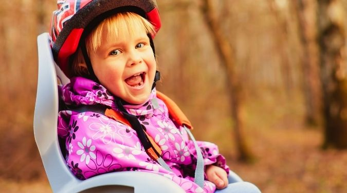
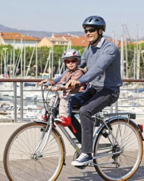
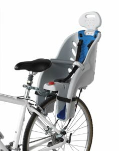

A child bike seat is one of those clever inventions that allow us to enjoy riding a bicycle with our child. They are normally mounted on the front or behind a cyclist’s seat and not on the side like trailers.

In both cases, however, the child will always be facing towards the front. The average age for putting your child in such a seat ranges from 1-5 years old.

Having a child bike seat at the front is always a given plus. One of the biggest benefits is that the child is surrounded by your protective arms and should they need any attending to, it does not take much for them to capture your attention.

The child will also have an interactive experience, having the same joy that you get from cruising through different sceneries and terrains. You also get the added bonus of having your back clear for carrying any other gear you may need for you and your child.

## Top 7 Best Baby Bike Seats

\[content-egg module=Amazon template=custom/simple\_list\]

## What Makes for the Best Baby Bike Seat?

Here are a couple of important things to consider when you are toying with the idea of buying a child bike seat.

### Security

You will want to make sure that the child bike seat you are thinking of purchasing is safe for both you and your child. Make sure that the seat does not make it difficult to balance your bicycle and in case of a fall, your child is as protected as possible. A good scrutinizing of the security harness for the child is very important. If it looks like your child can fly off when you suddenly halt the bicycle then it is not the right child bike seat for you.

### Comfort

Riding your bicycle with your child does not mean that the ride has to be uncomfortable. Make sure it leaves you space to pedal well and safely reach the handlebars. The child bike seat can also be fitted with padded foam to make sure your child is not wincing with discomfort on every little pebble you tread on.

### Easy to remove and attach

The child bike seat should not be so hard to remove that you have to leave your child on the bicycle once you get to the grocery store or if you want to do some riding alone. The process should be as quick and hassle-free as possible. Too many wrenches and screws will only discourage you from taking the baby out on a lovely joy ride.

Last but not the least, make sure that the child bike seat can fit on as many types of bicycles, if not all.

## What is a Baby Bike Seat?

This is a special saddle that is designed to hold the child safely on a bike. The seat is mounted on the bike’s rear or front section. Most of the seats will come with straps to secure the toddler, therefore, you will not have to worry about your kid falling from the bike.

## What is the best age for a kid to use a bike seat?

Kids can use the bike as long as they can sit up without any support. The best age is usually between one year and 4 years since the kid can sit unsupported. Ensure that your kid has a helmet on whenever your ride together.

## Which are the best child bike seats?

We embarked on a 2 months study with a goal of comparing and reviewing a variety of child bike seats in the market. During the study, we interviewed parents who love cycling, experts and manufacturers. Besides, we also tried out some of the toddler’s bike seats to get first-hand experience of using the product.

## Front mounted child bike seats vs rear mounted kid’s bike seats

There are two types of toddler’s bike seats, the first type is the front kid’s bike seat while the second one is the rear kid’s bike seat. I prefer carrying my kid using the front mounted bike seat since they offer a cool bonding experience with my 2 year old daughter. The only shortcoming about them is that they have a weight limit of 35 pounds. Once your kid exceeds this weight, you’ll have to invest in the rear mounted bike seats.

For the rear child bike seat, it is attached to the bike via the seat post, rack, or the frame. If your bicycle does not have a rack, ensure you buy one that has a high weight limit on Amazon. Additionally, you can convert your ride to a long-tail cargo bike and you will be good to go. Most of these bike seats will fit kids up to 70+ pounds.

## 5 Best Front Baby Bike Seats

During our research, we tested 10 front-mounted bike seats and we came up with a comprehensive review of the top 5 front bike toddler seats. All our picks are safe and ideal for toddlers above 1 year.

### iBert Child Bike seat

  
The iBert model has been my favorite front baby bike seat for years. My daughter has used the iBert seat till she was 2.5 years. Nowadays, I use it to carry my 2 year old son whenever we head out to the bike park. With the iBert toddler bike seat, the kid gets a better view of the surrounding area.

This awesome bike seat for kids has been designed to provide safety and comfort to the kid and rider. It’s built using a durable material making it ideal to use for years.

You’ll note that iBert has handlebars that your baby can hold and have fun while you ride. The seat comes in various bright colors that gets kids excited about cycling.

iBert safe-T-seat is designed to accommodate kids who are up to 38 pounds and 48 inches tall. The cool thing about it is that it hold your kid’s feet in place and away from the front wheel. The seat is mounted to the headset using two bolts.

During the few years I have been using the iBert child bike seat, I noted that it does not impact the bike’s balance. You do not have to worry about mobility since the seat has a swept-forward design.

The other awesome feature is the padded and contoured seat that assures the kid of comfort and impact absorption. There is no doubt that the iBert model is one of the best Kid’s bike seat in the market. A high number of parents have praised the seat for its efficiency and comfort aspects.

Buy on Amazon    Read Customer Reviews

### Yepp Mini Child bike seat

  
The Yepp mini is an awesome kid’s bike seat that is compatible with most bicycle models. Its design allows for easy mounting of the seat on the bike. Yepp mini is a front-mounted seat that enjoys a lot of popularity among parents due to its sleek and lightweight design.

The seat is made from water-repellent EVA material which is known for its durability. The seat features an adjustable padded 5-point harness that provides comfort and safety to the kid. Besides, the bike seat has ventilations, a safety buckle and adjustable foot straps and rests to make the ride extra comfortable.

Yepp mini is designed to accommodate kids from 12 months to 3 years old. You can use it as long as your kid does not exceed 33 lbs. The bike seat can be mounted to handlebar stems with a diameter of 20-28 mm.

With the Yepp mini, the kid will have a good view and an opportunity to communicate with the rider. You’ll definitely feel great having your kid between your arms when cycling in the neighborhood. Another advantage is that this bike seat for kids has a locking mechanism to prevent theft.

Buy on Amazon     Read Customer Reviews

### WeeRide Kangaroo Child Bike Seat

The WeeRide model is a center-mounted bike seat that enables the kid to have a comfortable front view. The Seat can be mounted on most adult bikes without any problems. The good thing about WeeRide is that it is compatible with bikes that have less space on the headset.

It has a padded front bumper for your kid to hold onto or use as a pillow. WeeRide is a bit cheaper than the iBert model however, it is not sleek looking. The fact that this toddler’s bike seat is mounted at the center ensures that bike maintains balance for the rider.

Being one of the best kid's bike seats, it features adjustable foot cups that support your little one’s feet and legs. In fact, the new model has openings in the foot cups to enhance comfort. The seating area is padded to provide added comfort to the baby’s bum and back.

The Kangaroo bike seat is ideal for children between the ages of 1 year to 4 years old. If you are looking for a safe kid’s bike seat, then you should consider the WeeRide model.

\[su\_divider top="no"\]

### Peg Perego Orion Front Mount Child Seat

\[su\_button url="https://www.amazon.com/Perego-Orion-Front-Mount-Child/dp/B01FTO8ZA8?tag=furiousbikes-20" target="blank" background="#ef7b2d" size="9" rel="nofollow"\]Check Price At Amazon\[/su\_button\]

The Peg Perego model is one of the best toddler bike seats you can buy. This awesome seat can be fitted on bike frames that range from 32mm to 52mm.

Parents recommend [Peg Perego](https://www.amazon.com/Perego-Orion-Front-Mount-Child/dp/B01FTO8ZA8?tag=furiousbikes-20) because it’s easy to install and detach from the bike; thanks to its one-click installation system that is simple to use.

In addition, it has adjustable footrests which means you can use it for years without worrying about your kid outgrowing the bike seat. This special seat has an adjustable 3-point safety harness which allows you to adjust its length.

With this front mounted toddler bike seat, you’ll keep your little one close to you, while having fun riding you bike. The seat includes an innovative mounting bracket system that enables you to attach it to the head tube of the bicycle. The Perego bike seat is positioned in a manner that will not interfere with the mobility and balance of the rider.

The good thing about this bike seat for toddlers is that it is compatible with almost all types of support frames as long as they are within 1.3 to 2 inches. It weighs around 4.85 lbs. and can comfortably accommodate kids weighing less than 33 lbs.

\[su\_divider top="no"\]

## Best Rear kid’s bike seats

For those who prefer carrying their kids at the rear of their bikes, we have reviewed some of the best rear mounted child bike seats you can buy. I recommend that parents with older kiddos to use rear bike seats since they provide maximum safety. Besides, they allow the parent to ride the bike smoothly without disturbances.

### [Schwinn Deluxe Child seat](https://www.amazon.com/Schwinn-SW74625-1pk-Parent-Child-Carrier/dp/B01KHE7F1K?tag=furiousbikes-20)

The Schwinn bike seat is a U.S brand that most parents praise for its safety, comfort and durability aspects. I had to include it in my review since my wife has been using it to carry our daughter and she’s already addicted to it.

The Schwinn carrier deserves to be in the list of the best rear mounted kid’s bike seats because it has a variety of features that stands out from the competitors.

For starters, Schwinn carrier is made using polypropylene, a material that makes it extremely lightweight. It can accommodate kids weighing up to 18 kg (40lbs). It’s the perfect bike seat for toddlers above 2 years.

Schwinn child bike seat is compatible with most adult bikes that are fitted with a cargo rack. Amazingly, the package comes with its own cargo rack, to ensure that the seat fits securely.

#### Is it safe for toddlers?

Sure. This is one of the best toddler bike seats for the money. This high-end bike seat has a headrest, padded crossbar and a 3-point padded harness. You’ll note that backrest height covers the back fully to enhance the safety of the kid. The foot rests can be adjusted to the desired length. Unlike other child bike seats, the Schwinn has a reflector at the back to enhance visibility.
