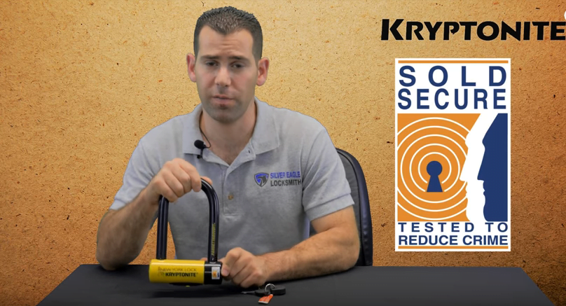

Bike theft has become a common menace in cities, colleges and parking lots, which has made it hard for bike owners to trust leaving their bike in any of these places.

You will leave your bike unattended for 30 minutes only to come back and find out that it is gone. And once it is lifted, chances are that you are never seeing it again.

The best way to prevent this is by investing in a good bike lock. If you manage to get your hands on the best lightweight bike locks, you will be sure that your bike is safe since they are unbreakable, secure and easy to use.

Investing in a good bike lock will mainly depend on security, convenience, and style. Given the right tools and enough time, even the most secure locks can be broken. Bike locks make more sense for low-medium value bike owners as they are easy to sell off once stolen.

However, this doesn’t mean that leaving a $5,000 bike in a public area is safe. It’s like you are saying, “Hey I have an expensive bike would you mind stealing it from me? Thank you.”

Another factor you might want to consider is where and how you lock up your bike. You don’t expect to lock up your bike in a spot that out of view and hope to find it when you return. No! You are simply giving the thief enough time and a quiet place to do his/her thing.

## Top 10 Lightest Bike Locks to Buy

\[content-egg-block template=custom/all\_offers\_list\]

## **Choosing the best lightweight bike locks**

Before you decide on the bike, lock to buy it’s important to understand the different types of bike locks as this will determine the kind of bike lock you get. You will want to know the upsides and downsides of using the different types of locks.

There are four main types of bike locks, which include:

1. U-locks

3. Chain locks

5. Folding locks

7. Cable locks

### U-Locks

U-locks are lighter, a little bit easier to use and cheaper than their chain counterparts. They do all these and still manage to offer the same level of protection. Unlike chain locks, U-locks are rigid which makes it harder to transport them and their size limits the number of places/things you can lock your bike to.

#### **Pros**

- Lighter than chain locks

- Cheaper than chain locks

#### **Cons**

- They will not fasten around larger objects

### **Chain** **locks**

Chain locks mainly consist of a long chain that is usually covered by a sleeve in a bid to protect the paintwork. The chain lock will also have a big lock to secure your bike.

Chain locks can be classified into two categories; there are the portable chain locks and there is the stationary chains, which are super heavy.

The portable chain locks are easy to move around as you even wrap them around your seat post and use them when the need arises. The only problem with portable chain locks is that they are most 12 mm thick, which makes them easy to cut through. They might be heavier than U-locks but they are definitely less secure.

However, when it comes to the stationary chain locks, they are arguably the best way to lock a bike since they are heavy, super thick and made from core-hardened steel. Since they are heavy, stationary bike locks are best used when securing your bike for extended periods.

#### **Pros**

- Easy to transport

- Easy to fasten around objects

#### **Cons**

- Expensive

- Cumbersome

### **Folding Locks**

Folding locks comprise of metal plates that are linked together by use of rivets. The rivets are designed in such a way that they allows the metal plates to rotate thus allowing you to fold your folding lock into a tight package, which can be folded out when the need arises. Once fastened around your bike they form a stiff shape.

Generally, folding locks are lighter than their U counterparts but offer the same level of security. They are more flexible and longer which gives you much options than your standard U-lock.

Like earlier mentioned, folding locks fold down easily to make a compact package that is portable. While in the compact package, you can put it in a carrying holster that you can screw onto your bottle holder.

#### **Pros**

- Flexible and lengthy

- Easy to transport

#### **Cons**

- Limited choice

### **Cable Locks**

Generally, cable locks comprise of numerous strands of thin long steel that are braided together and coated using a plastic tube. They are super light, cheap and definitely flexible. However, the flexibility aspect comes at a cost as it means that they can be cut with bolt cutters in seconds.

And since every bike thief equips himself with a pair of bolt or cable cutters, your cable locks are less likely to offer much security. However, not all cable locks are flimsy; you can buy the armoured cable locks, which are better than your typical cable locks but not as secure as a chain lock or the best u-lock.

#### **Pros**

- Cheap

- Light and long

#### **Cons**

- Do not offer adequate security

## **Our top picks**

### Kryptonite New York Fahgettaboudit U-Lock

There are many bike locks on the market that can help you to fasten your bike to the rack and look “secure”. However, not all of them can survive over the thieves’ bolt cutters or grinders. One lock can – Kryptonite New York Fahgettaboudit! It is a tough looking lock that can intimidate just about any thieves, even in a hardcore environment like New York City. In this **_reviews_**, we will share with you more information about this five-star bicycle lock and convince you why it should be the main lock for your bicycle.

#### Product Descriptions

New York Fahgettaboudit is Kryptonite’s most advanced bicycle lock ever created. It ranks in the top 10 in the company’s security rating, compared to its other models. Fahgettaboudit comes in two different lock types – U-Lock and Chain. The U-Lock features a solid 18mm diameter hardened steel and double deadbolt locking on both sides.

This heavy-duty lock also boasts an advanced disc-style cylinder that can survive any knockings and hitting. The key head is in the center way, and it provides extra defense against thieves. The lock is available on Amazon.com for $85.79. Together with the bicycle lock, you will receive three keys, which one of them comes with a high-intensity bulb that provides a great lighting source to access the lock at night. It also comes with an Anti-Theft protection with coverage up to $4,500.

### Product Specs

New York Fahgettaboudit is super tough bike lock that makes any thief think twice before stealing your bike. Besides than displaying the powerful brand of ‘Kryptonite’ on its body, the lock also appears intimidating on the very first look. Check out the details below in this **_bike lock reviews_** to learn more about the specs of this device.

- Model Number – 997986

- The weight is 4.35 pounds.

- MAX-performance hardened steel with a diameter of 18mm to resist bolt cutters or attacks

- Oversized steel sleeve for double security

- Double locking on both sides for extra protection

- Center keyway that makes it harder for thief to access the key and open the lock

- It comes with a dust cover that protects the cylinder

- Three stainless steel keys. One of them has an LED that provides lighting at night

- Covered by Kryptonite’s Anti-Theft program with a value of $4,500 for bikes in the USA

- Key Safe Program is also available to replace any missing keys

- Receives a maximum rating 10 in Kryptonite’s security standard rating

### Product Performance

The history of Fahgettaboudit goes back to 1972 when its founder, Michael Zane made an experiment on this super-tough lock. He used this particular model to lock a bike in a high crime area in New York City for 30 days and 30 nights, and its result is legendary! It has become the proof of the durability of this lock since then.

In that experiment, Fahgettaboudit managed to keep the permanent part of the bicycle remained intact, despite having other removable parts of the bike being stolen by the thieves. In this **_bike lock reviews_**, we will see its performance from several different areas.

#### **Thick Hardened Steel**

This product is extremely famous for its thick and hardened steel. The thick steel might have caused the lock to appear a bit more bulky and weigh heavier, but it provides complete protection to the bike. With the 18mm steel, it takes longer for the persistent thieves to cut the lock with any power tools or saw. Even if they are to cut the lock, it will take them at least half an hour to do so. With its huge bar, any regular cutters would never be able to go through the steel, and it would give you a peace of mind whenever you park your bike in an extreme environment. Plus, the hardened steel has been proven to be able to withstand any types of extreme vandalism.

#### **Smooth and Double Locking Performance**

The Kryptonite lock has two shackles at both ends. It provides double locking system that can make any lazy thief give up after cutting the first bar. Besides than implementing the double locking, the shackles themselves are very smooth. It slips inside the U-lock smoothly, and the key turns rather easily as you turn it around to lock it. Other regular cheaper can be quite fidgety and clumsy when it comes to its key and lock handling.

#### **High-Value Anti-Theft Program**

By purchasing this particular lock from Kryptonite, you will entitle to its high-value Anti-Theft Program. It covers up to $4,500 per bike for the US consumers. If you hail from another part of the world, you will also receive this protection (e.g. UK for $2,500 and German $for 2,000). However, you also need to know that the program requires you to do some pre-registration to activate such protection. Followings are some of the things that you need to provide to kick-start the program:

- Bike receipt

- Bike registration

- Bike insurance details

- Lock receipt

At an event of bike theft, you can claim the coverage by providing the following details to the company:

- You must lodge a police report within 72 hours

- Mail notice to Kryptonite within seven days

- Insurance report

After preparing all these details, you must return the broken lock to the company. If the thief happens to take the lock together with him, the anti-theft protection will not be valid.

#### User Feedback

Kryptonite has managed to gain the confidence of the avid cyclists and bikers in the New York City (and not forget to mention, intimidate the thieves in the city too!). Fahgettaboudit is the company’s most advanced bicycle lock that can provide utmost security to any bicycles in urban cities and high-crime area. Hundreds of users have rated this Kryptonite U-Lock as a five-star product, and it receives up to 4.3 overall stars.

#### Pros and Cons

In this bicycle **_lock reviews_**, we will help you to consider this lock by listing down all the pros and cons of this Kryptonite lock.

**Pros**

- The lock bar is super thick at 18mm and extremely hard. Grinding, cutting, or knocking would take hours before the lock break open.

- The double shackle deadbolt locking gives an additional security to your bike. It would take an experienced thief to cut through both of the durable shackles.

- One of the keys comes with an LED that provides a lighting source at night.

- The price is reasonable at only $85.79.

**Cons**

- The Anti-Theft program requires an extensive registration and claiming process. Plus, you should have the broken lock for you to be eligible for the $4,500 coverage.

- There is no mounting bracket available for this lock.

- The lock is bulky and heavy at 4.35 pounds.

#### Why Should You Buy This?

New York Fahgettaboudit is a highly durable lock that will protect not only your bicycles, but also other valuable belongings such as motorcycle or scooters. The company has put a great thought into it by making the steel super hard and thick. Plus, the lock can also deter any thief with its double locking technology on both sides of the shackles.

The key area is also at the center, and this will make it harder for the thief to access the key and hack it open. For night riders, you can make use of the LED key to access the lock easily at night. It is, indeed, a reliable lock that can keep your bicycle protected and intact – it is a must-have!

### OnGuard Bulldog DT U-Lock

When choosing the _best bike lock_, you should never settle for less regardless of how expensive your bike is or not. In a glance the OnGuard Bulldog DT U-Lock looks like your usual U-lock but with cables that will help ensure that other parts of your bikes also stay put.

- The OnGuard Bulldog DT U-Lock Manual comes in a durable and versatile U-lock design.

- It also has 4 braided steel cables if you want to extend the security of your lock to other parts of the bicycle.

- The improved Z-Cylinder offers better protection and is pick, pulling and drilling resistant.

- It has a snap lock quick release mounting bracket for easier positioning of your bikes.

**Product Details:**

- Product Dimensions: 11.6 x 7.8 x 2.2 inches ; 1 pounds

- Shipping Weight: 3.1 pounds (View shipping rates and policies)

- Domestic Shipping: Item can be shipped within U.S.

- International Shipping: This item can be shipped to select countries outside of the U.S. Learn More

- Average Customer Review: 4.3 out of 5 stars See all reviews (79 customer reviews)

**Security**

Just like other OnG_uard locks_, the lock is made of thick reinforced steel that can’t be easily broken by power tools. I also like that the keyhole is bump-proof so no matter what pick the thief uses, it wouldn’t open.

When you look at the lock you’ll be intimidated at how thick it looks which is a good thing. In order to add security to my bike I used the cable and looped it around the wheel, it attached to the bike rack perfectly and without any issues. My bike was still there after I returned 15 minutes later to grab a bite.

This is guide on how to lock your bike using the Rear Triangle:

**Ease of use**

I have used OnGuard Bulldog DT U-Lock Bike Lock for over a week and the only issue that I have is that the lock freezes up. I read other reviews and it seems that it’s common with this lock due to its bump-proof design. It can be resolved however with lubricating the lock properly with a WD-40.

Once you receive the lock, check it it’s properly lubricated or else you might have a hard time when sticking the keys in. Other than that, it’s fairly easy to use; just don’t forget to regularly lubricate the lock. In cases of transport you can place the lock on the seat stem where it can be secured until you need to use it. Though it looks rather beefy, it’s pretty light weight and I didn’t even feel it when I started pedaling.

**Versatility**

With the help of the cable that came along with the lock I was able to secure my bike’s front wheel and the seat while keeping it mounted on the bike rack. I liked how you can position it at any angle without fear of it being too loose.

Though the lock itself is pretty great, the cables aren’t; yes they are easy to wind through your bike but they also look easy to cut so I suggest you buy better cables aside from the ones that come along with it or reinforce it with another cable.

**Customer Reviews and Compare to Kryptonite U-Lock:  
**

Pros:

- Cheaper than Kryptonite u-locks and you get the same exactly value.

- Lock made of thick steel so I’m sure thief can’t cut out easily.

- Bike come with bump-proof protection for keyhole. Make more difficult if you want to pick in it.

- You have 5 keys in total, and one of them can use flash light.

Cons:

- Due to bump-proof technology, there are instructions on how to lubricate the keyhole with WD-40 manual. So you have to lock properly, otherwise, the lock will be loosen very soon.

- Sometimes it is quite hard to put the locked into the “U” position.

**Can it be used for other things aside from bikes?**

As with any U-lock, this can be used for other items aside from bikes, I used it to secure my spare tires since it always juggles around, with the lock; it’s now kept safe in place and doesn’t move around much anymore.

**Final Verdict**

Is OnGuard Bulldog DT U-Lock the _best bike lock_? I wouldn’t say so but this is a good alternative to the _kryptonite bike locks_ which can get pretty expensive. It’s good value for your money. Aside from the few minor issues with the key lock feature, it worked well as a bike lock for me.

Just always remember to lubricate the lock whenever you feel that it’s resisting whenever you put in the key.  The beefiness of the lock makes it look tough, I bet thieves will have second thoughts going after a bike with that much steel on it so I think it’s a plus.

I was able to travel long distances without having any issues while in transit with the lock, just make sure that its locked in place to avoid undue accidents.

### **Kryptonite New York Mini Heavy-Duty U-lock Bike Lock**

The Kryptonite Mini Heavy-Duty Bike lock is said to be one of the best u lock for bikes. It is boasts of a small build but it is quite heavy. Its shackle is made of hardened max-performance steel, which makes it hard to beat using hard tools such as bolt cutters. The heavy-duty bike lock features a patented steel sleeve for additional security.

It is also has a top-notch disc-style cylinder that is said to provide the best security. The bike lock is coated with a vinyl coating and sliding dust cover to help maintain and extend the cylinder’s life. It has a key safe program and center keyway that is designed to protect your lock against leverage attacks. It is among the best bike locks for NYC.

[Check Current Price on Amazon](https://www.amazon.com/Kryptonite-York-Fahgettaboudit-Heavy-Bicycle/dp/B000OZ9VLU/?tag=furiousbikes-20)

* * *

### **Abus Granit X-Plus 540**

  
Despite being decent in size, the Abus Granit 540 is relatively light and it is said to be the best bike lock for city since it offers one of the highest levels of security. It features a 13mm shackle that is designed from a unique type of steel that is just as strong as it thicker and heavier counterparts.

The Abus X-Plus 540 is best lightweight bike lock you will find that offers high security and still manages to have a practical size. Although the X-Plus 540 is not the cheapest bike lock on the market, its security and practicality makes it the best way to lock your bike.

[Check Current List Price](https://www.amazon.com/ABUS-Granit-X-Plus-540-160/dp/B00HN47G1M/?tag=furiousbikes-20)

* * *

### **Kryptonite Kryptolok series 2**

  
For over 40 years, Kryptonite has delivered some of the best bike locking technology. Each year they manage to make better and innovative locks that are harder to cut through and the Kryptonite Kryptolok Series 2 is no different.

This is the _best bike lock_ I’ve had and definitely  
have no issues with it. The Kryptonite Kryptolok series 2 is a great investment for bicycle owners who want to keep their bicycles safe and secure when they are away.

It offers maximum security with its design along with the KryptoFlex looped cable when you want to secure other parts of the bike. It’s lightweight yet very durable any thief will have trouble breaking through this lock. I definitely recommend this lock and for its price, it is worth every penny.

### **Product Features**

Bike locks are a necessity and an item you must always carry with you when you go out with your bike. Even if you don’t ride outside often or just leave your bike on the porch, as long as you are a bicycle owner then you should but one. Leaving your bike outside unattended is an open invite to thieves. You should always lock your buy in place whether it’s very expensive or not.

 A bike lock should be user friendly but can offer you the security that you need.

-  The Kryptonite Kryptolok Series 2 bike lock has a U-lock design and has a transit flex frame bracket so you can carry it anywhere.

- The _kryptonite bike locks_ have 13mm hardened steel and can resist cutting and leverage attacks. This means that bolt cutters are useless with this kind of material.

- It has a high security pick and drill resistant cylinder. Even if your thief is an expert lock picker, they wouldn’t be able to unlock it.

- It has a transit flex frame bracket to ensure easy mounting with a 25mm to 80mm frame tubing regardless of the shape of the frame.

- Product dimensions: 9.02 inches x 4.02 inches

- Shipping: FREE Shipping

- Average Customer Review : 

### **Security**

In my experience, U-locks are one of the most tough _locks_ out there, compared to the cables and chains; I feel more secure when I use a U-lock on my bikes. U-locks have a dual locking system that when a power tool such as an angle grinder is used, the ends will still be locked tightly so it’s really time consuming for the thief since they have to make 2 cuts in order to get rid of it.

I would say that this product has all the features needed for security. It’s very user friendly, really easy to use and super sturdy, it’s a high quality bike lock and probably the only bike lock that you will ever need. You just have to know how to lock it properly to maximize its security.

### **Ease of use**

I like how light the lock is but can still provide protection; it’s very easy to carry along and will have no issues in transport. When it comes to ease of use, how many minutes it will take you to secure your bike?

A good bike lock should open and close without any problems and have consistent performance no matter how many times you lock and unlock it. The Kryptonite Kryptolok Series 2 was able to perform well, I made a few stops on my way to my house and every time I lock it, it stays put and I was able to do it in just a matter of seconds. No time wasted when it comes to opening and closing the locks.

**Pros:** 

- I have it on my backpack and hardly notice it weight, it seems light.

- The Cable very thin compare to other product like : master locks, Onguard locks…

- If you register your bike key for the lock, to have the key deliver is very easy, customer service from Kryptonite quite helpful.

- After 3 months review: no one seem to try to attempt break and steal my bike on the campus eventhought the notices stolen bike has been all over my campus.

**Cons:**

- Sometimes it is difficult to use the flex cable since it’s kind of short but if you follow the complicated instruction it fitted well.

- If you have more expensive bike ( over $1000 ) then better protect with stronger lock as: KRYPTONITE New York U-Lock or Bordo Granit X-Plus 6500 from Abus.

### **Versatility**

How much of the bicycle is really secured when using the lock? If the thief can’t get away with the whole bike then they’d go for the parts that can be easily taken such as the wheels, saddles, lights and saddles.

The Kryptonite Kryptolok Series 2 U-lock was able to secure the bike but not all of it, that’s why you need to use the cable that comes along with it. There is a KryptoFlex looped cable that comes along with it in order to protect all parts of your bike. As far as versatility goes, I think the lock is still one of the best

It is an affordable bike lock that offers mid range security. It should withstand all bolt cutters expect the very big ones. The Kryptonite Kryptolok features a 13mm shackles combined with a 4ft flex bike cable. The flex cable should help secure your bike onto objects that are thick. It may not offer the highest level of security but it is definitely easy to use and affordable, which makes it a good choice for low risk areas.

[Check Current List Price](https://www.amazon.com/Kryptonite-New-U-KryptoLok-Standard-Bicycle/dp/B06XCLTVPQ/?tag=furiousbikes-20)

* * *

### **Foldylock Compact**

  
This is one of the lightest folding locks and it offers solid security. It has a Silver Rating on Sold Secure. The Foldylock Compact is very practical as it unfolds to 90 cm. This means that it interlocking space is almost the same as that of a typical u-lock. However, unlike a standard u-lock the Foldylock Compact gives you more options when looking for a place to lock you mountain bike. It is the best bike lock for city.

With this lock you will not have to contend with scratches and dings on your bike’s frame. This lock has 6 steel bars and links that are designed to protect your bike from thieves with hacksaws and bolt cutters. It is available in 3 colors green, cream and red.

[Check Current List Price](https://www.amazon.com/FOLDYLOCK-BIKE-LOCK-Included-Rust-Free/dp/B00MXC7EMK/?tag=furiousbikes-20)

* * *

### **TiGr mini Bike Lock**

2. 

The TiGr mini bike lock takes on the U-lock design but with a few modifications here and there. Instead of rocking the usual u-shaped metal bar, TiGr lock rocks a 1.25” band made from titanium, which inserts into a cylindrical lock.

The TiGr lock is super light as weighs less than 17 ounces. It has an 8” by 4” locking area, which is enough to secure your bike rack or bike. The overall design is appealing and easy to handle. As for the cylindrical locking mechanism, it is opened using a key and locked by push of a button. This is one of the best type of bike lock especially in cities or universities.

[Check Current List Price](https://www.amazon.com/TiGr-Lightweight-Titanium-Lock-Mounting/dp/B0155L1G9W/?tag=furiousbikes-20)

### Master Lock 72DPF Heavy Duty Cable 

Generally cables are not bike locks they are the part of the bike’s safety mechanism. Long cables are used to secure more than one part of the bike together so the thief will be unable to move it or it can be used to bind the bike with some object in the area to secure it. The cable lock system is built on the concept of the chain lock, in the past people uses chains with a lock to secure their bicycles, but now we have cable lock which comes with all the positive effects of the chain improving on the negative effects. The master lock cable nowadays play an integral part and are the most important instrument among the bike locking mechanisms.

The black colored Master Lock 72DPF high-quality cables are made of galvanized steel to resist rusting. It has sleeves which are rust resistant and scratch guards for that extra protection. The braided steel is used for superior strength and it has great flexibility. It is recommended to this use with any types of locks ranging from laminated, solid steel, master locks and mini U etc. 15-foot (4.6 meters) x 3/8” (10 millimeters) lock with smoke vinyl coating that helps to prevent scratches. Overall this is a heavy duty cable which can be used to secure your bicycle with the help of some specific locks of specific sizes. It is similar to the chain lock with which you use a chain and a lock to secure your bike; in this case you use a high-quality heavy-duty cable, which is rust proof and flexible to secure your precious bike.

- **Pros**

1. The Master Lock 72DPF is a heavy intensity cable which is made of galvanized steel to resist rusting, the cable will last a very long time.

3. The cable is coated with smoke vinyl that helps it to prevent scratching.

5. The heavy duty cable is made of braided steel which has superior strength and great flexibility.

7. The cable is 15-foot (4.6 meter) long x 3/8” (10 millimeter) but it is very easy to carry as it is very flexible. It can be rolled into a small circle and you can carry it easily.

- **Cons**

A cable lock is as strong as the lock you use with it. If the lock you are using can be disabled easily then it does not matter how strong and powerful cable you are using.

If the cable is as strong as The Master Lock 72DPF and you use a low-quality U-lock then your bike may not be as secure as you think. The less powerful U-locks can be cut easily with power tools. And there is also the problem of cylindrical pin lock. Actually the original cylindrical pin lock is a very good locking mechanism but be aware of the cheap imitations of the original cylindrical locks, it is very easy to break making it very vulnerable.

The cheap combination locks are easily decipherable, but there is high quality round combination locks which are good and are very hard to crack. So high-quality combination locks are recommended along with a heavy duty cable to protect your bike! U Lock are the best combination lock for your bike.

However sometimes we use a very secure lock but the cable we use to hold the lock with the bicycle is very poorly made, not very strong, rusty and can easily be penetrated by bolt cutters, This type of cables not only damages and scratches your bike but also leaves an opportunity for a thief to steal the bike, use of these kinds of cables are strictly forbidden, you can even hurt yourself with it. I will recommend a strong cable like this which is not only flexible, but rust proof has a good reach and most importantly reliable and compatible with your bike’s lock.

- **The Chain vs The Cable**

The chains are used to secure bicycles along with a lock to protect the bike from thieves. The chain lock system is an old school lock system where chains are used as a protection and as an extension to the lock to bind the bike with some particular rigid object to make it more secure, and prevent someone from picking up the bike and running away with it. The use of chain as a lock has many problems, yes, problems not one but several! The use of chain is not a very convenient option as long length chain is very heavy and almost impossible to carry. The chains are not made with fine steel so they cannot prevent rusting, and that damages the integrity of the lock as a whole and scratches the bike. The chains can be cut easily as well with bolt cutters so it is not a very reliable lock too.

The cable lock is the predecessor of the chain lock and is upgraded and enhanced in every way. The cables are very light weight but very strong, they are flexible, easy to carry around. It has long length for extra security. It is not easy to cut it open as it made for the purpose and comes with all the required things to protect your favorite bike from any mishaps. The cable is made of galvanized steel so they are rust proof and does not reduce the integrity of the lock in any way.

- **Conclusion**

In the end it is important to mention that The Master Lock72DPF is a high-quality cable and it is very capable, it will keep your bike safe and sound as long as you use a locking mechanism of the same caliber. So choose the lock according to your riding plan and the places you visit, if it is a low-risk area use a small U-lock and if the place is a high-risk area use a combination lock or if there is anything better that these two use it with any hesitation. After all, I can say that it does not matter where you are and how long you are leaving your bike unsupervised this cable will never fail you.

### Kryptonite Messenger Mini Plus U-Lock

This high security “Kryptonite Messenger Mini Plus U-Lock” is a must have for all bike owners who are concerned for the safety of their bikes. This U-lock locks the wheel of your bike or motorcycle so that it becomes impossible to move it without first unlocking it. U-locks have been around for quite some time now. However, most U-locks are not durable or smooth. It is needless to mention that U-locks are of no practical use unless they are strong and durable.  And believe me; I have been experimenting with U-locks ever since I had bought my first bicycle. Two of my bikes got stolen even though they had U-locks. However, the U-locks were not strong enough and were easy to break.

#### **Look and Design**

It’s been quite a while since I have come across a really strong U-lock such as this one. The first thing that greatly impresses me about it is its looks. It has a vinyl coating that prevents rusting and corrosion and gives it a premium look and feel. The coating ensures that its strength remains intact over the years. Its design is amazingly flawless and impressive. The bent foot shackle design makes this lock so easy to use that even my 10-year-old son can use it without breaking a sweat. And this is a real blessing considering the fact that U-locks are usually incredibly hard to get around your wheel.

This U-lock has the right amount of curve for a smooth operation. The entire lock measures 3.75 inch by 6.5 inch – a standard size that fits any wheel. This U-lock also comes with a wheel extender that can provide some additional protection to your front or rear wheel. And although the secondary protection might not be as strong as the main lock itself, it can give most U-locks a run for their money. The reinforced cuffs over the cylinder and the crossbar enhance its strength even further. The cylinder has double cores which make it incredibly strong and practically impossible to break. And as if this wasn’t enough, the lock is also provided with a rotating dust cover. As someone who has a lot of experience with U-locks, I’d definitely say that this U-lock is a complete exception. The manufacturers have definitely taken utmost care in order to make it the ultimate high-security tool for bikes. The U-lock comes with 2 stainless steel keys of good quality.

#### **Testing its mettle**

I never judge a book by its cover. The U-lock looks fantastic from the outside but can it really be relied on? I have tested the performance and durability of the lock and have listed the testing procedures below. The tests have not been performed randomly but have been formulated after a lot of research and authentic information obtained from lock-picking expert thieves themselves. These tests are quite exhaustive and the results of these tests can be used to gauge the reliability of any U-lock.

There are various methods which bike thieves use. They keep inventing new techniques and thus it is best to try every possible way to break a lock in order to test its field performance. After consultation with a panel of experts, specialists and thieves, the following tests were performed on the “Kryptonite Messenger Mini Plus U-Lock”:

1. Freeze and Hammer test: At low temperatures metal becomes brittle. Thus, the first approach involves freezing the U-lock with an aerosol propellant and hammering it with a ball peen hammer. If the lock doesn’t have what it takes, it usually cracks easily.

3. Bottle Jack test: A bottle jack is a good way of testing a lock. A really strong bottle jack is wedged to the lock and is pumped really hard.

5. Angle Grinder test: An angle grinder is the most common tool used by thieves to break a U-lock. An angle grinder is applied on the U-lock and the time taken to break it apart is taken into account. Usually, a 1/8th-inch cut-off wheel is used for the grinder.

Obviously you are curious to know how the U-Lock faired. The freeze and hammer test was useless on it as it could not even damage the lock’s outer coating. The Mini Plus U-Lock passes this test with flying colours. The next test or the bottle Jack test failed to damage the lock in any way after pumping the 4 ton jack several times consecutively revealing the best thing about its design – that even the smallest of bottle neck jacks could not be fit properly into the lock. Thus, the first two tests declared the lock as safe. The third test was the decider. The angle grinder went all out against the lock. This test shatters most locks in a matter of seconds. The Kryptonite U-Lock, on the other hand, was able to withstand the grinder for nearly 2 and half minutes damaging the grinder’s blade for good. Definitely a thief would never consider spending 2 and half of extremely noisy minutes and gruelling effort just to cut off a U-lock. Therefore the Kryptonite Messenger Mini Plus U-Lock is a clear winner having passed all three tests with amazing results.

Other tests regarding its ease of use were also performed. I must say that this lock can be fit into the wheel very easily and the wheel extender can give you double security. The key fits smoothly into the lock and its stainless steel make ensure that it doesn’t get corroded.

### Kryptonite Evolution Mini-7 U Lock Bike Lock

I came across the Kryptonite Evolution Mini-7 while looking for a good _onguard locks_ that will fit my budget and one that will actually work.

The Kryptonite Evolution Mini-7 is another U-lock bike lock from Kryptonite. They are considered veterans when it comes to creating bike locks. What makes this lock different from the other Kryptonite models in the market?

- The Kryptonite Evolution Mini-7 has a 133mm max-performance steel shackles that can withstand bolt cutters and leverage attacks.

- As with any _Kryptonite locks_, it uses a disc style cylinder lock for added security.

- It comes with a transit FlexFrame bracket that will fit with any bike’s geometry or tubing so you can carry it anywhere.

There is not much difference when you compare it to the other Kryptonite locks; I think that they have improved the security for the disc style cylinder and the metal on the locks look like they are really meant for heavy duty security.

### **Security**

With any bike lock always learn how to secure your bike properly and allow little to no space for anything to be inserted in between such as a car jack. Ensure that you are using proper locking in order to maximize security on your bikes.

The lock itself is very tough and it will keep your bike secure. The cable looks sturdy enough and you can easily use it to secure your front  
and rear wheels which are a good thing, since some things take away parts of the bike rather than the whole bike itself.

### **Ease of use**

This lock is lighter than the other _kryptonite bike locks_ since it is a “mini” model but works just as well. You can fit in on your bike’s frame when it transit, it stays in place when positioned properly. You can easily lock your bike in a bike rack or a pole in just a couple of minutes. I had trouble with installing the mounting bracket though, it took me around 10 minutes to figure it out but I was able to it. I had no trouble installing the mounting bracket for my other _bike locks_ so I guess this is something that has to do with the mount itself.

### **Versatility**

The cables look okay and are pretty flexible; they will add security to your bike especially if you wound it carefully around the front and rear wheels for added measure. However they look rather slim and can easily be but through with a pair of bolt cutters.

**Can it be used for other things aside from bikes?**

Of course, it may be “mini” but it’s big enough to secure other things in place. The cables are also great when you want to add extra security on something while travelling such as spare tires or other things that you can wound it with.

### **Pros and Cons**

The Kryptonite Evolution Mini-7 is a great lock but there are some minor issues with it:

**Pros**

- It a very tough lock and thieves will have a hard time breaking it

- The extra cables are good when you want to include your front and rear wheels and lock them up.

- Lock may seem small but it’s actually big enough to lock your bike to a fixed frame.

- Light weight which is good so you can carry it with you and not mind the weight

- Price is great for a mini lock.

- The keys come with a LED light so you can easily spot the lock especially during night time.

**Cons**

- The cables look pretty thin and can be easily cut with bolt cutters. I haven’t seen anyone try cutting it though.

- I have an issue with the mounting bracket since it can get tricky to install but once it’s in place it does its job.

* * *

## **Conclusion**

Although most of these lightweight bike locks are rated as secure, they cannot secure your bike if left long especially overnight. You do not leave your bike overnight and expect to find it there; you are simply giving the thief enough time to do what they do best. Therefore, always secure your bike in an open place that is easy to spot from several locations. Otherwise, your bike lock might not be of much help.
