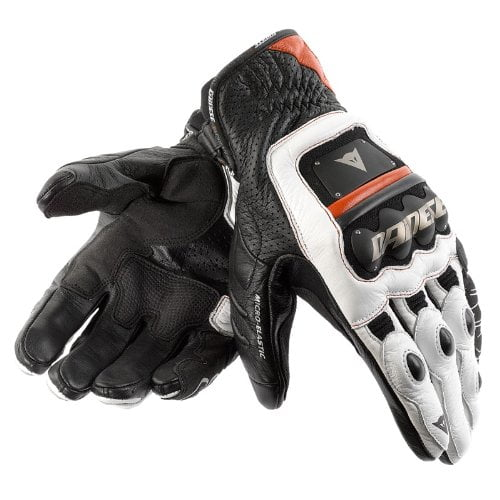
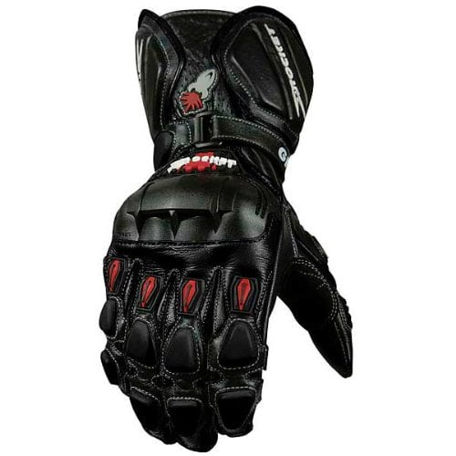
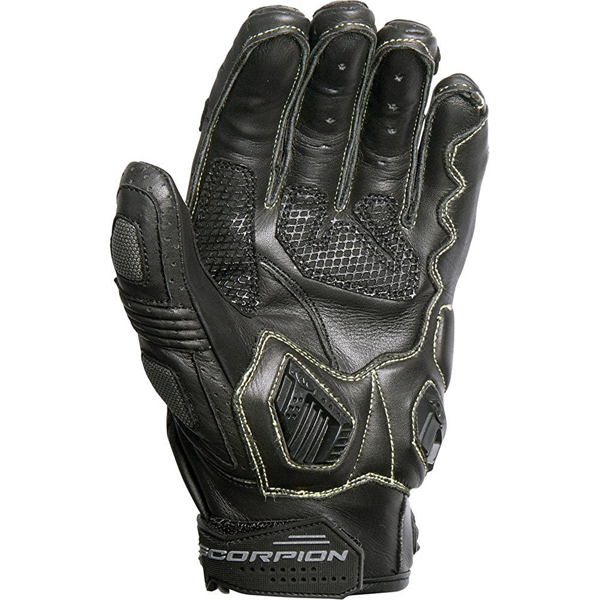
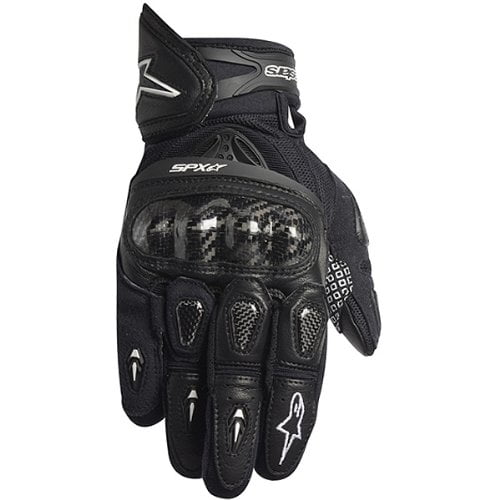
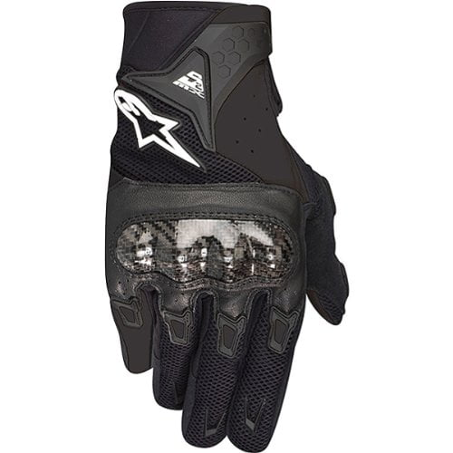

Part of motorcycle safety is wearing the proper attire. An often-overlooked part of that outfit is the gloves. Motorcycle gloves can provide a variety of benefits such as protection, warmth, and grip while riding. Here are several areas to consider when doing your own motorcycle gloves review.

## Top 5 Best Motorcycle Gloves

There are a lot of opinions about the best gloves; the following Motorcycle gloves stand out as the top 10 in our motorcycle gloves review.

## 1.Dainese 4 Stroke Gloves:

Click to Check Price at Amazon

The Dainese 4 Stroke Motorcycle Glove is a short, summer glove. These gloves have leather and spandex exterior and all of the interior reinforcements that you would expect from a top-quality riding glove.

The most demanding of riders will appreciate the performance and ergonomics of this pair of gloves. With stainless steel composite inserts, TPR on the knuckles and back of hands, and a reinforced pinky insert, and a reinforced palm, including a palm slider, this glove is engineered to help you perform at your peak.

All of these protections come complete with the comfort you expect, with a tightening strap, distortion control and perforated palm and back >> Check Latest Price of Daineses 4 Stroke Gloves at Amazon

## 2. Joe Rocket GPX 2.0 Leather Gloves:

Click to Check Price at Amazon

This glove is designed to give you a bang for your buck. The Joe Rocket GPX 2.O is full-length leather racing gauntlet glove with a price point of less than a hundred bucks!

Featuring a drum dried leather top, and a Pittards Ceramic infused Armor Tan palm, this accessory has your covered top and bottom. This glove has an aggressive pre-curve to the finger section and offers extensive high-density padding on the wrist, cuff and fingers, providing you with the extra protection you require in a racing gauntlet.

Also standard is the double cuff closure and the injection molded vented knuckle. This glove comes in your choice of five different colors, which is really cool >> Check Latest Price of Joe Rocket GPX 2.0 Leather Gloves at Amazon

## 3\. Scorpion SGS Motorcycle Gloves:

Click to Check Price at Amazon

This short cuff, cowhide glove offers a full kangaroo palm that is Kevlar reinforced providing you with the protection and tactile feel that is so important in riding.

One really cool feature about this glove is the Scaphoid Protection System palm sliders that are not usually seen on a glove in this price range. Also really cool is the amount of Superfabric armor plating, which provides up to four times the abrasion resistance over the standard leather.

With a pre-curved palm and fingers and an out stitched palm and fingers to eliminate the feel of an interior seem, this pair of gloves is sure to surpass your expectations >> Check Latest Price of Scorpion SGS Gloves at Amazon

## 4.Alpinestars SP-X Gloves:

Click to Check Price at Amazon

This glove offers a goatskin and air mesh construction for comfort and protection that is hard to beat. This is a sport-riding glove with some important upgrades.

The SP-X uses carbon fiber protectors and sliders, as well as EVA foam for extra padding and protection on the knuckle, top of fingers, and key impact areas. This glove has extra leather reinforcement on the fingers. One awesome feature is the 3rd/4th finger bridge, designed to prevent finger roll and separation during impacts, [minimizing injury](https://mtbnz.com/how-can-you-prevent-injury-while-cycling/).

The SP-X also utilizes silicone printing on the fingertips so you can enjoy and increased grip while you ride >>Check Latest Price of Alpinestars SP-X Gloves

## 5.Alpinestars SMX-2 Air Carbon Gloves:

Click to Check Price at Amazon

If you are looking for a comfortable summer riding glove, then the SMX-2 is worth a look. With a fully vented top for comfort and breathability, this glove also offers some really great protection as well.

The carbon fiber knuckle exists on its own panel, eliminating pulling while riding and working the controls. With a single cuff-style closure utilizing a micro-Velcro strap and a neoprene cuff, this glove doesn’t skimp on comfort. Also included is a reinforced landing zone with built in padding, so you can be assured of superior impact protection when you need it. This glove also comes in six colors and a really stylized design >>Check Latest Price of Alpinestars SMX-2 Air Carbon Gloves

## Discover the suitable Motorcycle Gloves:

There are some things that you should take into consideration before making your purchase.  Here are some simple questions to ask that will help you identify the right type of glove for you.

- What type of weather will I be riding in?

- What size glove will work best for my hands?

- Do these gloves offer adequate protection in the even of a fall?

- Do I prefer fingered, or fingerless gloves when riding?

Know your riding habits and what season of the year you are going into.  The right pair of gloves can be extremely important and can make your ride much more enjoyable.

## Motorcycle Gloves Material and Stitching:

If you are new to riding, you might be tempted to think that all gloves are created equal.  They are not.  There are a number of different types of gloves, and even different types of stitching available.  Some of the different materials are:

- Leather Motorcycle Gloves

- Deerskins Motorcycle Gloves

- Fabric and Waterproof Motorcycle Gloves

- Insulated Motorcycle Gloves

Stitching also makes a big difference.  Try to avoid gloves that have stitching on the inside, or across the palm.  External stitching, or flat seams will make your ride infinitely more comfortable.  Whether you are looking for men’s motorcycle gloves, or women’s motorcycle gloves, the material and stitching choice is important, and it is wise to take you time and try on several pair before deciding on the best one.

## Advanced Considerations:

Maybe you are looking for a beautiful pair of deerskin motorcycle gloves or just an everyday functional pair. There are some additional features available that can make your choice even more attractive depending on the time of year and the weather.  Consider looking for the following options:

- Waterproofing – Great for riding in the rain or over wet terrain.

- Heating – Yes, there are gloves that actually warm your hands in the winter!  Many heated gloves interface with your bike’s electronics and heat while you ride.

Hopefully you have seen that there is more to buying a pair of motorcycle gloves than some people realize.  This article should help you make the best choice possible the next time you are in the market for a pair.

## Summer Motorcycle Gloves:

Riding your motorcycle in the summer is perhaps the best thing about owning a bike. However, it is still necessary to wear all the appropriate safety gear while your hair blows in the balmy wind. You might look and feel cool while cruising in just a t-shirt and jeans, but that hopeless ensemble will not protect you against unexpected mishaps on the road. Luckily, you can both look the part and play the role when you find the best summer motorcycle gloves.

#### Hot Hands:

Unfortunately, wearing the gloves you wore in the winter will not suffice when the summer heats strikes. You will need to purchase some lightweight gloves that protect your hands from the road while still offering sufficient ventilation. Having wet palms and fingers is not conducive with a safe and secure ride; so finding gloves that offer plenty of breathing room is important. Choosing from short, wrist-length summer motorcycle gloves can help cooling air get to your smoldering skin without taking away any of the protective elements.

#### Leather Loathing:

Unwisely opting for a set of leather gloves for the summer months is a bad idea for several obvious reasons. Not only will this be uncomfortable to most riders, but it could also become a safety hazard. Although leather gloves tend to offer superior protection, they are not a good choice for those who wish to ride their motorcycles during hot summer months.

#### Fingerless Fiasco:

Choosing to wear fingerless motorcycle gloves because you want to avoid the heat of the summer may seem like a good idea, but there are some drawbacks. There isn’t as much protection for your hands with this variety, although they can be quite stylish and they do work well for improving grip. However, if you choose these summer motorcycle gloves, you may find yourself wishing that you hadn’t.

Picking the right gloves for the summer is an important aspect of safe and comfortable motorcycle riding. Take some time to look around before you decide. Your life and your riding experience may depend on it.

## Cold Weather Winter Motorcycle Gloves

Motorcycles aren’t just for summer. If you know how to choose the best equipment, you can ride all year. Winter rides on a sunny day can be the perfect way to break out of the dreariness of winter. Beautiful landscapes can be seen for miles as the trees lose their leaves and with the proper gear you no longer have to miss out on that. As refreshing and serene as it may be, winter is still cold and you have to protect yourself from the cold. With advancement in technology, you never have to worry about those bitter cold handlebars again.

Today’s winter motorcycle gloves typically combine leather and other materials for optimal protection. The insulating layer is usually Thinsulate or a similar material that is thin enough so you can still bend your fingers to operate your bike, but with a high enough thread count to keep the warmth in. These gloves are nimble, so they stay very comfortable and many are even pre-curved for better gripping. For year round riders, a quality winter glove is essential when out in the frigid temperatures. Thermal inserts or even electronic heating inserts are also a must-have for winter rides.

There are some things you really must take into consideration when choosing proper hand gear for winter months. Ask yourself some questions to identify what you actually need. Where will you be riding? What’s the average temperature of cold weather you’ll be expecting? You may want to consider a backup option in case you get caught in a situation that’s much colder than you’re used to. Waterproof gloves are probably something you want to think about if you’re up northeast or northwest. Take care in choosing your winter hand gear this year.

## Motorcycle gloves sizing

While going out to buy motorcycle gloves, color and quality are not the only features you should look for. You need gloves that will fit you so that you can be comfortable riding. Choosing the wrong size of gloves may predispose your accidents, and you will not feel comfortable while riding. The size of your hands will determine the size of the gloves you will purchase.

It is advisable to order for gloves that are the size that you normally wear. Most of the gloves in the market have consistent sizes. Each brand has its  size. If you wear large size, it is advisable to buy a similar size. If you are buying the gloves for the first time, you can always measure the size of your hands. This will help you get the right size of the glove you will need. You can measure your hand with a cloth tape measure. Collect different measurements of your hand. The best sizing for your glove will be the largest size that you get. You may try making your palm wide and flat to vary the measurement. After taking the measurement, determine the right size for you using the table below:

| Glove Size | Hand Size | Inches | Cm |
| --- | --- | --- | --- |
| 7 | x-small | 2 3/4" | 7 |
| 7.5 | x-small | 2 7/8" | 7.5 |
| 8 | small | 3 1/8" | 8 |
| 8.5 | small | 3 5/16" | 8.5 |
| 9 | medium | 3 1/2" | 9 |
| 9.5 | medium | 3 3/4" | 9.5 |
| 10 | large | 3 7/8" | 10 |
| 10.5 | large | 4 1/8" | 10.5 |
| 11 | x-large | 4 1/4" | 11 |
| 11.5 | x-large | 4 1/2" | 11.5 |
| 12 | xx-large | 4 3/4" | 12 |
| 12.5 | xx-large | 4 7/8" | 12.5 |
| 13 | xxx-large | 5 1/8" | 13 |

The above table shows various measurements of the hands and the appropriate glove that you will need. For women, the size of the gloves is one step smaller than those of men. For children, the size is much smaller compared to men and women motorcycle gloves. You need to be very careful while picking a glove for your child. The gloves for children vary from sizes XXS, XS, S, M, and L for 13, 14, 15, 16, and 17 respectively.

Another most straightforward approach to measuring your hand for an expected cruiser glove fit is with a blueprint realistic of your hand. Use the outline to measure the appropriate size for your gloves.

The second and more correct approach to measuring your hand for a definitive glove fit is to utilize a dressmaker measuring tape. It’s as basic as wrapping the measuring tape around the knuckles of your overwhelming hand, barring the thumb. The estimation ought to be brought with a shut clench hand as your hand extends when held and will give you the most faultless measurement. It is best to request gloves in the size you typically wear. Most (yet not all) gloves are reasonably predictable in size starting with one brand then onto the next, so on the off chance that you have bought “large size” previously, and then it is a safe bet that you can again request a huge.

Any time you go out to buy motorcycle gloves, consider the sizes of the gloves. Choosing the right size of the gloves ensure your safety while driving. You may also need to try various brands that are in your size to get the one that works for you.
