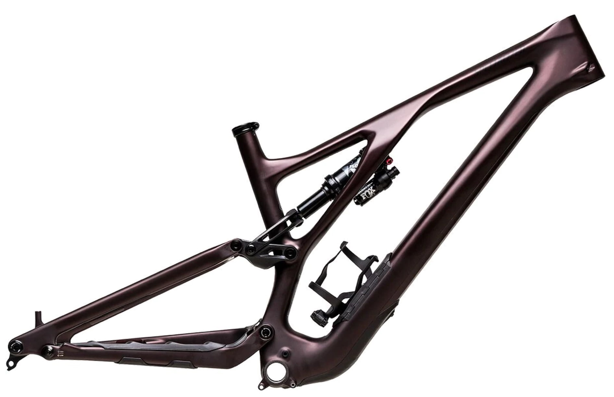
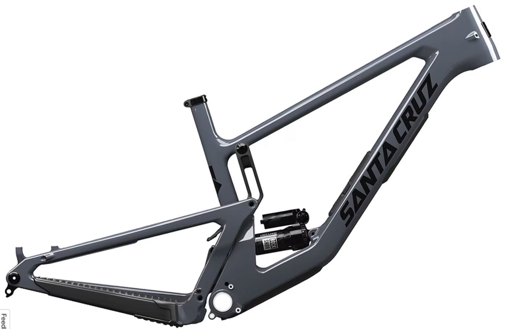
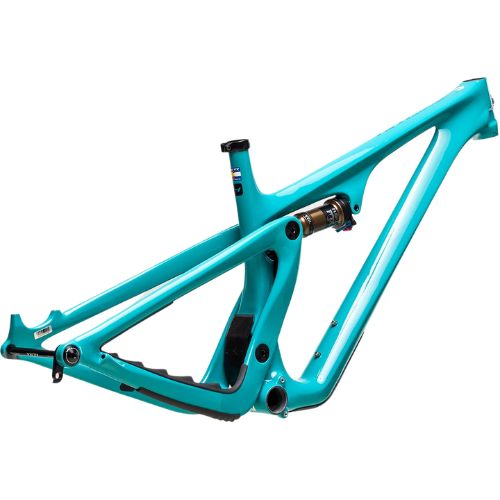
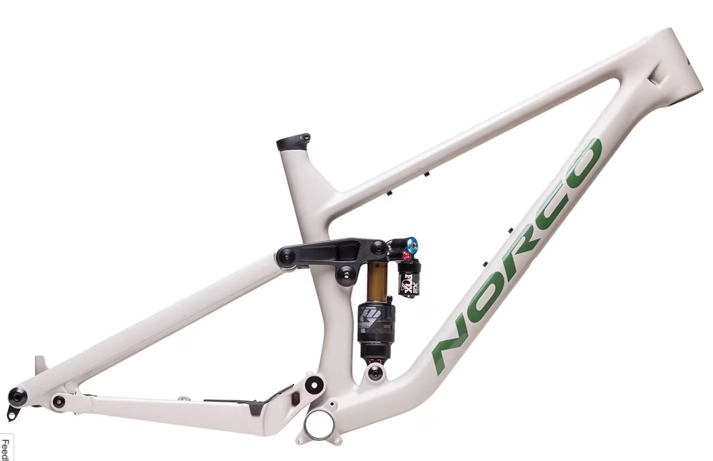
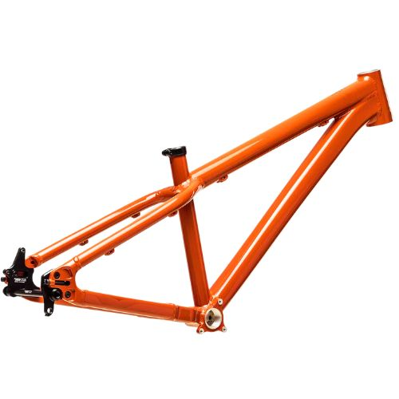

The frame is the heart and soul of your ride. It's the foundation upon which all other components are built, and it plays a crucial role in determining the bike's performance, ride quality, and overall feel. With that in mind, let's dive into the 15 best mountain bike frames

Show Summary

Here are the best mountain bike frames of 2024:

1. **Alta 20″ Bicycle Lowrider Bike Frame**: Available in multiple colors, this frame has a 4.3-star rating. Its lowrider design offers a unique riding experience.
2. **SB130 Turq Mountain Bike Frame**: The SB130 Turq frame is constructed from high-modulus carbon fiber and has a lightweight tube-in-tube internal cable routing system
    
3. **Bicycle Gas Frame 3.4L w/o Kickstand**: This frame comes with a built-in 3.4L fuel tank, making it a unique choice for those looking for a motorized bicycle.
4. **Specialized Stumpjumper EVO Frame**– The Specialized Stumpjumper EVO Frame is a high-quality carbon fiber mountain bike frame that offers a blend of strength, stiffness, and lightness.
5. **YOJOLO MTB Frame 29er Hardtail Mountain Bike Frame**: This aluminum alloy frame is designed for 29er hardtail mountain bikes. It features disc brake compatibility and internal routing for a clean look.
6. **Gravity FSX 26 inch Wheel Aluminum Disc Brake Full Dual Suspension Bike Frame with Rear Shock**: This frame features full dual suspension for a smooth and comfortable ride. It’s compatible with 26-inch wheels and disc brakes.
7. **Motobecane Boris Fat Bike Frame Frameset Rigid Fork Unbranded Mountain Bike for 26-inch Wheels**: This frame is designed for fat bikes and comes with a rigid fork. It’s compatible with 26-inch wheels
8. **Fenix 20″ Lowrider Bike Twisted Frame**: This frame features a unique twisted design, making it a standout choice for those looking for something different. It’s designed for 20″ lowrider bikes.
9. **DV9 Mountain Bike Frame:** compatible with forks from 100 to 140mm travel, allowing you to customize the bike to suit your riding style and the terrain.
    
10. **S-Works Epic Frameset**: designed for cross-country racing

## 1\. [Specialized Stumpjumper Evo Frame](#)

- The Specialized Stumpjumper EVO frame is a top choice for riders seeking a high-performance hardtail mountain bike frame that excels in both climbing and descending. Its progressive geometry, advanced suspension system, and innovative SWAT Door integration make it a compelling option if you want to build the ultimate trail bike.

[Check Latest Price](https://amzn.to/3SYIIFP)

The Stumpjumper Evo is one of the most versatile and adjustable mountain bike frames on the market. You can tweak the geometry to be more downhill-oriented or more cross-country-focused depending on your riding style and the trails you'll be hitting that day.

One of the standout features of the Stumpjumper EVO frame is its SWAT Door integration, which offers increased storage volume and even includes a 650ml hydration bladder that fits perfectly inside the frame. This clever design will allow you to carry [essential tools and gear](https://mtbnz.org/best-accessories-for-mountain-biking/) without the need for a backpack or additional storage solutions.

- Features an adjustable geometry, which allows for a dramatic change in head angle in just 15 minutes.
-  The Stumpjumper EVO's progressive geometry, including a 64.5° head tube angle, 77.2° seat tube angle, and a 35mm bottom bracket drop, contributes to its superior handling and stability.

## 2\. [Santa Cruz Bicycles Hightower CC Mountain Bike Frame](#)

- The Santa Cruz Hightower CC mountain bike frame is most suited for aggressive trail riders who want a versatile and high-performance bike that can handle a wide range of terrains and conditions. With 145mm of VPP rear travel and a 150mm fork, the Hightower CC is capable of tackling various trails, providing a balance of uphill efficiency and downhill capability.

[Check Latest Price](https://amzn.to/3SYIIFP)

Let's break down what makes this carbon fiber frame so sweet. First up, the suspension - 145mm of VPP rear travel paired with a 150mm fork gives you the perfect balance of uphill efficiency and downhill capability. 

This thing absolutely devours rock gardens, root sections, and chunky descents with control and stability. The lower linkage mounted shock helps produce an ultra-plush and consistent ride feel.

You'll also love how the modern geometry just begs to rally at high speeds. We're talking a 65-degree head tube angle, longer reach, and balanced chainstays across sizes for dialed confidence when pointing this rig downhill.

And the flip chip lets you fine-tune the bottom bracket height and suspension feel to your liking

Storage and convenience features really make this frame shine too. The downtube "Glovebox" carries tools and spares so you can travel lighter, while the threaded bottom bracket and internal routing simplify maintenance. There's even a custom frame guard protecting this beauty from rock strikes.

The Hightower CC frame also features a sag window and fast-rolling, bump-easing **29-inch wheels front and rear**. This means you can tackle any terrain with confidence, whether you're climbing steep hills or descending rocky trails.

## 3\. [Yeti Cycles SB115 Turq Mountain Bike Frame](#)

- The Yeti Cycles SB115 Turq Mountain Bike Frame is an exceptional choice for those looking for a high-performance hardtail mountain bike frame. Its lightweight and durable TURQ Series carbon fiber frame, efficient Switch Infinity suspension technology, and aggressive trail riding capabilities make it a top contender in the market.

[Check Latest Price](https://amzn.to/3SYIIFP)

One of the key features of the SB115 is its TURQ Series carbon fiber frame. This material is not only lightweight but also incredibly strong and durable, making it ideal for the rigors of trail riding. 

The bike frame is designed with Switch Infinity suspension technology. This technology allows the suspension to work more efficiently to absorb impacts, providing a distinct and smooth ride. 

The SB115's suspension performs exceptionally well, even when set up with sag numbers (30%) akin to much longer travel bikes. The SB115 is designed for aggressive trail riding but also excels in climbing. It's equipped with a FOX FACTORY FLOAT DPS rear shock and is designed to pair with a 130mm front fork. This combination allows the bike to excel in new-school trans-XC style racing and riding.

## 4\. [Norco Sight Carbon Mountain Bike Frame](#)

- The Sight carbon MTB bike frame is a perfect choice for the aggressive trail rider or enduro racer who wants a very capable descender that still climbs respectably. The reasonable weight and quality construction means it would also make a great daily driver for the hardcore local who rides hard and needs the bike frame to last.

[Check Latest Price](https://amzn.to/3SYIIFP)

- Norco bike frames are designed and manufactured by Norco Bicycles, a Canadian company founded in 1964 in British Columbia. While some Norco frames are made in Taiwan, the company has kept production of many models in Canada

While the Sight does utilize Norco's SmoothCore carbon layup technology to save weight, this frame is about more than just being lightweight. Norco put some real innovative thinking into the design.

For starters, they implemented something called **Gravity Tune**, which basically ensures a proper balance between the front and rear of the bike across all frame sizes. So whether you're a short rider like myself or a tall drink of water, you'll get the same optimized handling. The size-specific tubing helps dial in the stiffness too. Pretty clever if you ask me!

But it gets even better when you start riding this frame. The **Advanced Ride Technology** suspension soaks up trail chatter smoother than a hot knife through butter, thanks to some reworked pivot locations. And the geometry adjustments make this new Sight a heck of a lot more capable than the old model. We're talking a full 3-degree slacker head angle, longer reach, and more rear travel.

Add in all the nice touches like internal routing, a spare hanger bolt, and compatibility with both 1x and 2x drivetrains, and you've got yourself one extremely well-designed frame. I'd put it right up there with the best frames from those fancy brands like Yeti and Santa Cruz.

## 5\. Jackal Mountain Bike Frame

- The Jackal Mountain Bike Frame is a top-notch choice for any serious rider. It's durable, versatile, and offers excellent performance. Whether you're a seasoned pro or just starting out, you'll appreciate the quality and craftsmanship that goes into this frame.

[Check Latest Price](https://amzn.to/3SYIIFP)

The Jackal Mountain Bike Frame is a classic dirt jump frame, perfect for jump lines, pump tracks, and urban riding. It's constructed from light and durable 6000-series aluminum, which means it's built to withstand a lot of abuse. Despite its robustness, the frame weighs just under five pounds, making it easy to maneuver.

One of the standout features of the Jackal frame is its short 15.2-inch chainstays. This allows for great maneuverability, making it a joy to ride whether you're navigating tight corners or performing tricks.

The frame also features sliding rear dropouts, which means you can set it up for gear or singlespeed use. This flexibility allows you to customize your setup to suit your riding style and the terrain you're tackling.

## How to Choose the Right Mountain Bike Frame

Geometry, size, tubing type, welding method, welding skill, design integrity, fit, flex (or rigidity), weight, cable routing, warranty, manufacturer's reputation and serviceability are key variables.

Okay, paint job, color or polish and stickers count too because 10 Cannondales will vanish from a bike rack faster than a single Murray. If country of origin is important to you, factor that in.

Consider the frame carefully. No point investing in component upgrades if the frame is a dinosaur. In real estate it's called over-building your neighborhood. That is, you'll not likely recover your investment when it's time to sell.

Let's plow through the frame attributes I mentioned above one step at a time.

## Bike Frame Geometry

Geometry is dimensions, angles, lengths, and clearances of such things as the steering tube, seat tube, vertical and horizontal tubes--in other words, what gives a bike its "feel" when you ride it. Geometry defines the intended use of a bike. That's why a pair of fat tires on a ten-speed Road Bike _does not a Mountain Bike make_.

To be more specific, differences in frame geometry are sometimes slight between manufacturers. Frame designers are proud of their design concoctions.

Don't worry too much though, all the manufacturing heavy- hitters have settled into similar geometric grooves and differences are seldom radical.

When it comes to geometry, in the words of one manufacturer, "Screw the hype, ride the bike!" I might add that you need to test drive it in a way that simulates your intended use--not just around in circles on the dealer's side-street. If you want more information on geometric options, check you your local bike dealer's collection of catalogues.

## Bike Frame Size By Height

Several factors affect which size bike is your best bet. Most obvious, of course, is the overall size of your body and the relative proportion of your body's parts. Fact is that more than one size frame will usually fit and which one of those you choose depends on how it "feels" to you when you ride it.

Mountain Bikes are designed to fit differently than Road bikes. Whereas the Road bike needs a mere 2" clearance between your crotch and the top tube when you stand flat- footed on the ground, Mountain Bikes should have from 4" to 6" because chances are good that you'll need it if the off- roading gets too tricky for your skill.

Mountain Bikes also come with long seat-posts, and most professional riders have a lot of it showing, indicating their preference for the smaller frame sizes. A smaller frame is preferred because it's lighter, stronger, quicker, more rigid and less likely to fail than larger sizes. A good rule of thumb, then, is to find the smallest frame that will work for you. My first Mountain Bike frame was too big.

Start with your legs. Stand flat-footed on the floor with your feet about a foot apart and find a bike that gives you the 6" crotch clearance as you straddle the center of the top-tube.

Next, get someone to help you by holding the bike upright with you on it. See if there's enough seatpost to raise the saddle high enough to allow only a slight bend in your leg when the ball of your foot is on the pedal with the crankshaft parallel to the seat tube near the bottom of its revolution.

_**Not enough seatpost?**_

Compromise the crotch clearance and step up a size. Pedal/leg extension is critical to using your big leg muscles. Too much bend in the leg and you'll tire quickly. You'll also murder your knees.

### HOW HIGH THE SEATPOST?

Be warned: Don't exceed the manufacturers stamped-on max- height seatpost warning. It relates to shear strength. Be aware too that after-market seatposts can be had in the over $100 dollar range. Seat posts are precision-sized bike parts whose diameters are always critical.

Seatpost failure is painful to even imagine but it happens. One reliable manufacturer, Ringle, recalled its 93 Moby Post sub-200 gram model due to breakage. Their 94 posts were beefed up to 220 grams. If you must tinker, you should find the size stamped near the bottom of the post for use in sizing the replacement. Another thing: Seat post stresses are transmitted to the seat-tube clinching mechanism and frame seat-tube. Over-stepping the height bounds may cause the seat-tube to rip, trashing your frame.

### THE COCKPIT

So now your inseam fits the pedals and your crotch nicely clears the top-tube. Good start. Let's fit the torso and arms.

In the reach for the handlebars, you're going to find out how far your torso and arms stretch comfortably.

If you want to ride your bike sitting chair-like in the saddle, stop reading this and go buy a beach cruiser with a big fat seat. You'll need it because all your weight will be on your cruising butt.

On the Mountain Bike, like it or not, some of the weight is on your arms, wrists, and hands. How much weight will depend on how far forward you have to lean to get hold of the handlebar.

A number of things affect the size of your "cockpit" such as the length of the top-tube, the rise or drop of the stem, the stem length, etc...

The stem, by the way, connects the frame to the handlebars. Road-racing bike riders are constantly looking for better ways to cut down wind- resistance and many Road warriors prefer a negative rise stem. That is, they dip down making the handlebars lower than the top of the steering tube.

Mountain bikes usually have stems ranging from zero to 30- degrees in rise. The more rise, the more upright your seated position and the more weight on your butt.

Even if you aren't racing downhill all hunkered over to lower your wind resistance, it doesn't hurt to be bent-over somewhat if for no other reason than to dodge low-hanging branches and fallen trees.

With most serious Mountain Bikes sold sporting zero, 5 and 10-degree rise stems, you're going to be leaning forward on a factory bike, like it or not. In fact, the more expensive the bike, the lower the handlebars--as if to appeal to the semi-pro, pro and sport riders.

You may not like it at first but will learn to appreciate low handlebars as soon as the riding gets tricky.

#### _**Why lean forward?**_

Most important, the posture allows you to raise your butt off the saddle and stand on the pedals without knocking your riding balance all to hell and wobbling your bike into the trees or off the cliff. That argument alone should be a convincing one for forward- leaning trail riding.

When leaning forward, your center of gravity is lower. For the fast runs, you push less wind. With some of your weight on the handlebars, your butt and arms share the soreness rather than letting your buns take all the punishment. With some weight on the front tire, you have better traction up there and therefore more and better maneuverability. You can ride uphill while still seated.

If these reasons aren't enough, remember that it's partly exercise you were after when you got the bike in the first place, and leaning forward strengthens your neck, arms and wrists if not over-done. Stop if you get tired and enjoy being where the bike has taken you. Drink some water, snap a picture, eat a snack. Build up to the longer rides by resisting the temptation to out-ride your strength and stamina.

## Bike Frame Tubing Type

Strong and light-weight--these are the mandates. Strength is especially important in the Mountain Bike because of how it's marketed.

The manufacturers of Mountain Bikes depict their products sailing mid-air into the wildest terrain--a Mr. Toad's Wild Ride Machine. If the customer is going to try some of the stunts depicted in the ads, the bike better be able to take the punishment without breaking--or worse--killing somebody.

The bike should also be light-weight for at least two reasons:

- first, there's the physics of putting dead-weight into motion. The more of it there is, the harder it is to get moving. Heavy human-powered machinery is not a good thing.
- Second, chances are if you're off-roading on your bicycle, you'll need to carry it from time-to-time: over logs; across little streams; into and out-of your car or truck; and up or down the incredibly steep, slippery or occasionally treacherous landscape.

Lightness and heaviness is a function of all your collected [bike accessories](https://mtbnz.com/mountain-biking-accessories/) but starts with the frame tubing itself.

Your bike's tubing determines its most basic personality. Regardless of the quality and price of the components you add, junk tubing equals junk bike. If you want to or must skimp somewhere, tubing is not the place to do it. This is your bike's foundation.

That having been said, the advent and popularity of exotic frame metals has led to a popular misconception: high-tech frames make light bikes. That simply isn't true because you still have to put [wheels](https://mtbnz.com/best-mountain-bike-wheels/) (rims, spokes, hubs & tires) on the thing, as well as other potentially weighty parts like stems, handlebars, seat and seatpost, brakes and brake levers, shifters, bar-ends, front and rear derailleurs, chainring, crank levers, [pedals](https://mtbnz.com/best-mountain-bike-pedals/), and the bolts and nuts to hold it all together.

Take the cheap route on any of those essentials and the lightest most exotic frame in the world will begin feeling like a department store dinosaur.

So, let's approach frame materials like grown-ups. Let's peel away the hype and the full-page color ads long enough to see what it's really all about in frame materials.

Here are the current mountain bike frame material choices:

1. Steel
2. Aluminum
3. Titanium, and
4. Carbon fiber.

If you read the advertisements, and check the prices you will be convinced that if you get what you pay for aluminum, titanium, and carbon fiber--being more exotic and expensive--must be better than steel.

I do not own an exotic metal bike for more reasons than just cost. Read on, and judge whether it's a "sour grapes" bias. You aluminum, Ti & Carbon frame owners, please bear with me.

### Steel Bike Frames

Steel has a flex, resiliency and strength no other metal duplicates. The feel of a steel bike is different than that of aluminum, titanium or [carbon fiber](https://mtbnz.com/carbon-bike-fork-buyers-guide-reviews/).

Countless riders still like the feel of steel bikes and tubing manufacturers have responded with lighter steel Alloys.

Most desirable is the steel/chromium alloy commonly marketed as Cro-Moly steel. In Fact, the preference for steel has even introduced a new steel model outfitted and priced more than many aluminum models--the Gary Fisher "Cronus."

A history of steel manufacturing in the U.S. and Japan would be enlightening here, but let's not get too side-tracked.

In a nut-shell, America geared up its steel technology in the '40's during the war, and there things stood until Japan started spewing Hondas and Toyotas into the world in the 70's.

New Japanese steel factories were built and old ones up-dated. Tange steel was born, and quickly became a new world standard in steel/alloy tubing.

The U.S. did some modernizing of its own, giving birth to True-Temper steel. Steel had grown up. It was being made lighter, stronger, and more expensive. Golf clubs got more expensive and better. Bike-makers took notice.

Bike manufacturers started tinkering with the tubing even more, with a process called "butting" whereby the tubing is tapered. This means the tubing is drawn thin in the areas of least stress, but left thickest at the ends, where the welds are and where the strength is needed. This "butting" resulted in an even lighter piece of tubing.

If butted tubing worked, why not double-butted? And so it goes. Fisher's Cronus is triple-butted True-Temper steel. In fact, todays steel Mountain Bike can be less than a single pound heavier than the same size aluminum counterpart.

As stated earlier, steel has a characteristic "feel" in a bike. It's strong, but somewhat flexible or "springy." It can take a hard impact and flex back. Steel absorbs shock. Consider that steel makes great springs. Aluminum springs, if they exist, haven't caught on yet, to my knowledge.

On the down-side, steel doesn't have the aerospace wow- factor built into its image. It's also hard to brag about it without first explaining steel's recent manufacturing advances. To most, steel is the stuff of tractors, Jeeps and Land Rovers. Besides, it rusts if you mistreat its protective finish. To me, that's not a big minus. Paint is cheap and my bike acts more like a Land Rover than a Boeing 727. Sour Grapes? I don't think so.

### Aluminum Bike Frame

The first step up to exotic frames is aluminum, because it's light-weight and doesn't rust. Like modern steel alloys, aluminum tooling and processing has also advanced. 6061 T6 is popular for bikes (T6 is the temper designation, meaning the aluminum has been solution heat treated, and artificially aged without cold-working).

For an understanding of the metallurgy of aluminum, try the discussion on "Metals" in PEDAL PUSHER, a buyers guide available for $12 from Bike Pro Publications, 442 Steele Ln., Santa Rosa, CA 95401-3149 (800-BIKE-PRO). Among other things, this article de-mystifies the four-digit code as well as various temper designations. Be warned, though, it was written in squishy prose as if by the classic hard-to- follow lecturing college professor. No beginning, middle, or end--just facts, and tons of them. I emerged from the article amazed that aluminum even exists, much less that the integrity of its many compositions and temper variations can be policed. And that's part of the problem.

Aluminum is less-dense than steel. You need more of it to get the same strength as steel, but it will weigh less. Tempered to a hardness suitable for bikes, it will also break rather than bend, so there's little give to the stuff. Bike makers are "fine tuning" the feel of aluminum tubing by varying thickness (as in butting steel) and tubing diameter. Manufacturers claim that new designs even mimic the feel of steel--to a degree.

Even hardened aluminum, though, isn't good enough for bolts, nuts, and screws, or for that matter, the chain. Those are still steel. Now, here's a question: What happens when you over-torque a steel bolt into a piece of threaded aluminum? I'll tell you what happens: you strip the damn hole. The good aluminum bike makers solve the problem with inserts. When you strip a bolt-hole, you buy a new insert and pay somebody to extract the old one. Terrific.

Another problem area is the dropout. Perhaps the single most vulnerable part of a bike frame is the little nub sticking down from the right rear axle slot which holds the rear derailleur. It's called a "drop-out." When an off-road stick reaches up and snags your deraileur, or slaps your deraileur into your spokes, something has to give.

Even a steel bike can be trashed in this "Achilles heel" area. Aluminum bikes are trashed more easily than steel bikes in this way. Manufacturers, recognizing the problem, include replaceable dropouts with shear bolts. The idea is simple. When your deraileur gets yanked and twisted, the add-on bends, the bolts snap, and you replace the disposable drop-out. Never mind that your deraileur and chain have just trashed your wheel and spokes. Not the frame-builder's warranty problem. Your frame is fine.

Another nasty thought for aluminum bike riders is chain- suck. That's the part where an over-shift or back-pedaling during a gear change has thrown your chain off the chainrings and wedged it into a cranny where it doesn't belong. Chain is steel. Chainring is steel. Frame is aluminum. Which one gets the big damage?

Here's another consideration. If Steel bolts in aluminum threads are wound up tight enough, they will seize. You know the feel and sound of a seized bolt. It's a no-mover that makes a "cracking" sound if you've managed enough force without stripping off the slot, head, or recessed allen points. Not a nice thing. Of course, there's anti-seize goop for sale. . .

Those little protrusions that hold the cables in place are called "braze-ons." On many aluminum bikes they're "riveted- ons." But my final complaint is that aluminum tubing makes funny noises. It creaks under stress sometimes, and the point-of-creaking can be harder to locate than it is to tolerate.

Nonetheless, people keep buying aluminum bikes, and the manufacturers who have figured out a way to glue them together keep singing their praises in magazines and giving them to their sponsored riders to show off at all the racing photo opportunities. They're easy to spot because aluminum bikes have big fat tubing which has become somewhat stylish. Because it doesn't rust, aluminum bikes don't need paint and many get polished to a shine like little Boeing aircraft. At least one company, Cannondale, doesn't even make a steel bike and is perceived by many to be the "Ferrari" of the bike world. Aluminum bikes have merit or they wouldn't sell.

I wonder sometimes though, how much of it is Madison Avenue "fizz." To read the hype, you'd think that the aluminum frame alone was responsible for the low overall weight of these bikes. It's not. It's the top-shelf wheels as well as other components that make them pricey and light.

### Titanium Bike Frames

If you think the new space-age aluminum alloy chemistry is difficult to comprehend, try reading the titanium literature. Little wonder it's expensive--the furnace heating bill must be astounding. Titanium is also very tricky to manufacture properly, and you may be surprised to learn that titanium is 60 percent heavier than aluminum, a fact redeemed by its incredible strength.

Titanium is a truly exotic, high-tech concoction. I still remember my amazement the first time I held a titanium bottom bracket (crank arm bearing assembly at the bottom of the frame) in my hand. It looked like a real part, it worked like a real part, but it sure didn't feel like the real thing. And so it goes.

At least one company, SRP (Specialty Racing Products) makes a principal living selling only titanium bolts, nuts, and replacement parts. Compare these prices: a stock Shimano bottom bracket, $15.99; an SRP titanium bottom bracket, $149.99 (ouch!). Weight difference? Shimano is 358.5 grams or 12.64 oz. and SRP is 164 grams or 5.7 oz. Add a few of those parts to your bike and it will be lighter than your wallet.

Titanium, though, is a little hard to weld and work. So much so, that many titanium bike makers contract with the alloy- maker itself to assemble the tubing into a frame, driving the price even higher. A handful of U.S. Bike makers have invested the money and time necessary to build using titanium in their own shops. Others don't even offer titanium bikes, period.

Average folks can afford a titanium bolt here and there or maybe even a set of titanium handlebars for a hundred bucks or so, but as for the titanium frame, it's a big-bucks investment few sane people can justify for weekend rides in the woods.

Then there's the story of the counterfeit certification documents that began arriving with shipments to U.S. manufacturers of Russian-made titanium (all exotic alloy shipments come with certification as to type, temper, etc.). To get around this problem, the titanium bike parts themselves (handlebars for one) started arriving on U.S. soil--no certification necessary. These parts were being made in China with un-certified Russian titanium. Control Tech, a respected U.S. Part maker who sold some of these for a time, discontinued and recalled them.

There are three reputable titanium mills in the U.S. at this writing: Sandvik, Haynes, and Ancotech. Each has done a respectable aerospace business and parts made with their titanium are good safe bets. Bike makers Dean and Ibis both sell Ancotech Ti handlebars.

Oddly, at about 145 grams for the Ti bars you can find even lighter aluminum ones for less money. My advice is to know what you want, shake the romance off your lust, forget the boastful advertisements and go for the best, even if its cheaper. In other words, if you want to brag about metal, buy some jewelry, if you want a good bike part, ask some questions. If you just have to buy a titanium something, get some bolts and some anti-seize goop.

### CARBON FIBER Bike Frame

This one has promise. Imagine a large (18") Mountain Bike frame weighing a scant 2.8 pounds (including paint) and able to withstand incredible stress and impact. It's one of bicycling's newest frame materials: OCLV Carbon. The long name is Optimum Compaction, Low Void Carbon Fiber. It's used in the latest planes from Boeing including their much-touted 777.

The manufacturing process is a bit like making paper mache science projects or patching the rusted floorboard of a '55 Chevy. What you end up with is the stuff Corvette fenders are made of--sort of. Carbon fiber is reminiscent of Fiberglas(tm). To make it, instead of spun glass fibers, you take strings of carbon fiber, mix it with epoxy, put it on some kind of form, let it harden, take the form out, and use the newly created whatever-it-is.

At this time, I am not sure how the stuff is threaded to receive bolts, how the traditional braze-on cable hangers are attached, or how the dropouts are configured. Also unknown to me are its feel and ride, although reports in the trades and magazines give the substance high marks in all departments.

If you price one, hang on to your wallet. Each bike has to be virtually hand-made and is delivered sporting a beautiful sculpted look.

Other carbon fiber parts are also cropping up: such as handlebars (only 91 grams), hubs and saddle rails, to name a few. I get the feeling those exploring the OCLV market are on to something good but may be a bit ahead of their time. Investments in metal tooling for bikes is rampant and those folks won't be quick to give up their market share. Those churning out OCLV bikes seem to be doing it instead of tooling for titanium.

Although chances are you will never have to worry about this OCLV shortcoming, you should be aware of it. If carbon fiber ever does reach its stress limit, it doesn't bend, get distorted, or break like most other things. It shatters like a Corelle(tm) dinner plate hitting the floor--a fact revealed by a lab test of handlebar stress limits. However, the testers admitted, though, that the carbon fiber bar out- stressed everything else in the test.

If the world supply of epoxy doesn't dry-up or harden, OCLV carbon fiber could be just beginning its march into American hard goods and, if you can make the stuff out of recycled junk, this is only the beginning.

### Plastic Bike Frame

That's right, plastic. More than one manufacturer is looking at plastic as the frame strength-to-weight utopia for a new breed of high-end mountain bikes. Schwinn, a re-emerging major force in bicycles, had already prepared the advertising blitz at this writing although no bike yet exists. You read it here.
