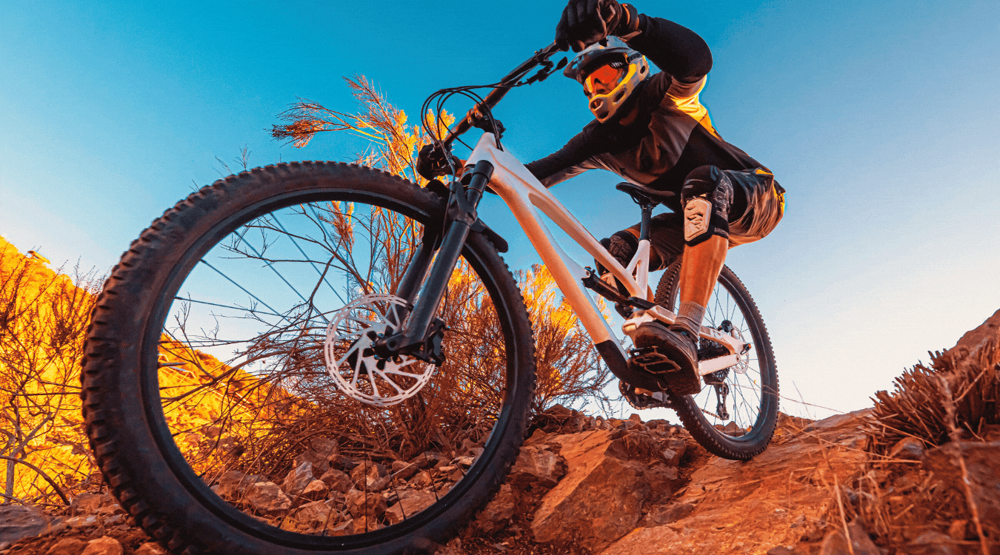
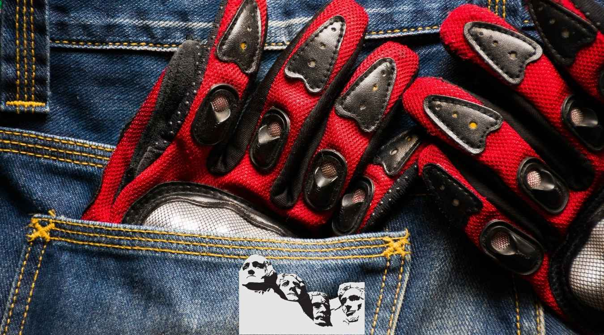

I know reading about mountain bike gloves is well, a bit dry.  [Carbon fiber frames](https://mtbnz.com/carbon-bike-fork-buyers-guide-reviews/) are just sexy.  Technical clothing and thermal gear, with hidden pockets and iPhone headphone feed-throughs are nice surprises.  Lithium ion rechargable [mountain bike headlights](https://mtbnz.com/best-mountain-biking-lights/) with retina searing luminosity is just, well, safe.

_I mean, who doesn't want twilled, fleecy thermal garments...the cycling equivalent of warm, comfy pajamas for cold weather rides._

\[toc\]

But MTB gloves are just a low level accessory.  They're the Delta Minuses of the Aldous Huxley line of cycling apparel.  But they serve their place, and the best MTB gloves are simply "there".  They should function without notice.  They provide grip, protection, warmth and help prevent numbness.  And in this sense, [Pearl Izumi gloves](https://amzn.to/37jnYxN) excel.

\[wpsm\_box type="info" float="none" text\_align="left"\] When mountain biking, you have to ride through technical trails, fall a couple of times, collide with twigs and face harsh conditions. This is a clear indication that you need the Best MTB gloves to improve your grip on the handlebars, protect your hands from bruises, provide warmth & comfort, and protect your hands from being grazed. \[/wpsm\_box\]

## Best Winter MTB gloves

Mountain biking during the winter season has always been fun. It is advisable to have winter specific gloves to help you ride comfortably and keep your hands warm.

Luckily, we have compiled a few gloves that can provide the comfort and protection you’ve always wanted during winter.

### 1\. Pearl Izumi Divide Glove

I'm a big fan of Pearl Izumi's Clarino Synthetic leather used on the palm of some of their gloves, including the [P.R.O. Aero gloves](https://amzn.to/2sN28DH).  Not only does it last, but it provides excellent grip wet of dry.  So, when I was looking for a more rugged, utilitarian glove, I decided to purchase the [Pearl Izumi Divide Glove](https://amzn.to/2sLNsok).  Size extra large. They come in three colors, solid black, black with white accents, or red/black with white accents.  

\[content-egg module=Amazon template=custom/compact\_extra next=1\]

Marketed as trail or mountain biking gloves, they're a bit thicker and stiffer than I'm used to.  Stitching is doubled on the transition between thin and thicker fabrics, so longevity should be there.  

Inside the seams are decently maintained, but I've seen better on the P.R.O. gloves where their is never a loose thread.  A solid piece of white piping rims the bottom, along with a rubbered back to the velcro closure.  The red, mesh fabric provides plenty of stretch, but the white detailing on the mesh fabric is actual a siliconized paint.

And while the uppers are a bit industrial in appearance, the palms are what make the gloves.  Again, double stitching is employed on all the seams, and that siliconized white paint appears on the index and middle fingers, securing grip in wet conditions.  

The palm leather lay-up is designed such that the gloves don't bunch together when the thumb is pulled tight, allowing the material to essentially fold in the center.  However, those with tender median nerves in the palm of their hands should look for a different glove (such as the P.R.O. Pittards Gel Glove or the Elite Gel Vent Glove with P.I.'s Comfort Bridge) as these will likely put undue pressure on the nerve.

Buy one size up with respect to your normal glove size.  The gloves are a bit more firm than most and Pearl Izumi tends to run a tad small in sizes.  I've experiences this in their running shoes, [cycling shorts](https://mtbnz.com/best-mountain-bike-shorts/), and now in two pairs of their gloves.  While my hands still fit their gloves (I usually wear an extra large), they are a bit smaller than other brands.

 

### [2\. Pearl Izumi Thermal Conductive Gloves](https://www.amazon.com/Pearl-Izumi-Thermal-Conductive-Glove/dp/B00CN25BC0?tag=furiousbikes-20)

 If you are looking for the best winter cycling gloves, you should purchase the **[Pearl Izumis](https://www.amazon.com/Pearl-Izumi-Thermal-Conductive-Glove/dp/B00CN25BC0?tag=furiousbikes-20)**. They have been praised for their unique features and durability.

Pear Izumi gloves feature P.R.O thermal fabric that provides optimal insulation, as well as, dryness. You don't have to worry about your hands getting numb due to the cold conditions.

With these awesome MTB gloves, your hands will remain free from moisture and odor. The main material that makes the Pearl Izumi gloves are polyethylene, polyester, polyurethane, spandex, and polyamide.

The other good feature is that the gloves are lightweight; you won't feel uncomfortable when riding through trails. These mountain biking gloves will trap heat nicely without fail. Make sure you grab a pair before winter approaches.

[Buy on Amazon](https://www.amazon.com/Pearl-Izumi-Thermal-Conductive-Glove/dp/B00CN25BC0?tag=furiousbikes-20)   

\[su\_divider top="no" divider\_color="#00c4cc" margin="10"\]

### 3\. [JUSTKIT Thermal Gloves](https://www.amazon.com/JUSTKIT-Waterproof-Windproof-Thermal-Gloves/dp/B01N2NOT7Y/?tag=furiousbikes-20)

 The JUSTKIT gloves are awesome mountain biking gloves during the cold season. This can be attributed to its high quality fabrics that enhance breathability and heat retention. These gloves are thin and light enough to enhance maximum dexterity and mobility.

The exterior of these gloves is water resistant, windproof and snow-proof. In addition, the interior is built to allow air circulation and moisture wicking. This explains why these winter gloves can be used in most outdoor activities.

Another feature you'll love is that these thermal gloves allow you to operate your smartphone.

The thumb and index finger has a conductive fabric that allows you to swipe and tap with ease. The JUSTKIT gloves are suitable for both men and women, grab yours and keep mountain biking during winter.

[Buy on Amazon](https://www.amazon.com/JUSTKIT-Waterproof-Windproof-Thermal-Gloves/dp/B01N2NOT7Y/?tag=furiousbikes-20)   

\[su\_divider top="no" divider\_color="#00c4cc" margin="10"\]

### 4\. [FREETOO Tactical gloves](https://www.amazon.com/FREETOO-Tactical-Military-Knuckle-Outdoor/dp/B07DCPKDBN?tag=furiousbikes=20)

The FREETOO’s are high-end gloves that work perfectly well for mountain bikers and outdoor lovers. In fact, these gloves are also used by military personnel due to their high quality and tough material.

They feature an exclusive reinforced palm and knuckle padding protection that guarantees safety when riding through trails.

Besides, the design of these MTB gloves shows that they are meant for heavy-duty outdoor activities. This is evident from the strong Velcro and double stitching features. You can use them for hunting, riding motorcycles and climbing.      

It is important to recognize that the FREETOO cycling gloves are ideal in terms of comfort and flexibility. These gloves are made using elastic spandex material to allow flexibility.

You’ll love the fact that they have an adjustable wrist Velcro. Besides, the wrist is made using soft and chafe-free material to prevent your wrist from soreness.

The other special feature is that they are well ventilated to allow free air circulation. These gloves are available in full finger and fingerless types. It’s upon you to choose the one that suits your taste.                       

  [Buy on Amazon](https://www.amazon.com/FREETOO-Tactical-Military-Knuckle-Outdoor/dp/B07DCPKDBN?tag=furiousbikes=20)   

\[su\_divider top="no" divider\_color="#00c4cc" margin="10"\]

### 5\. [SLB Cycling Gloves](https://www.amazon.com/Biking-Gloves-SLB-Accessories?tag=furiousbikes-20)

 The SLB model is one of the best mtb gloves that you'll get at a cheap price. Good news is that these gloves have high-quality features that you'll love. For starters, the thumb, middle and index fingers have conductive fibers; thanks to the SLB since you can operate your smartphone with the gloves on.

Secondly, they are made using high-quality materials. SLB company uses the latest windproof and waterproof materials to ensure that you ride comfortably in the mountains. You don't have to worry about your gloves soaking in the rain as you mountain bike.

Other than their ability to keep your hands warm, they have a zipper that helps cyclists to adjust the size. Finally, these mountain biking gloves have a non-slip silicone around the palm. This feature ensures that your hands do not slide from the handlebars.

[Buy on Amazon](https://www.amazon.com/Biking-Gloves-SLB-Accessories?tag=furiousbikes-20)   

\[su\_divider top="no" divider\_color="#00c4cc" margin="10"\]

### 6\. [GLOUE Winter Gloves](https://www.amazon.com/GLOUE-Winter-Gloves-Fleece-Multiple/dp/B07545SN2T?tag=furiousbikes-20)

 The Gloue unisex gloves are made using soft fleece material that provides optimum comfort and warmth. With these cool cycling gloves, your hands will stay warm as you ride during the winter season. Amazingly, these mountain bike gloves cover a large part of the wrist to ensure that they cover your hands perfectly without slipping.

The design of the Gloue winter cycling gloves suits both men and women. They are available in black, brown, grey, and navy blue colors. Other than cycling, you can use them for other outdoor activities.

These gloves are worth every penny, they are a perfect gift for your cycling partner.

[Buy on Amazon](https://www.amazon.com/GLOUE-Winter-Gloves-Fleece-Multiple/dp/B07545SN2T?tag=furiousbikes-20)

\[su\_divider top="no" divider\_color="#00c4cc" margin="10"\]   

## Best Mountain Bike Gloves for Summer

Riding your bike during summer requires you to have lightweight and comfortable gloves. Good news is that the short finger gloves are designed to serve you during summer and hot weather. Below is our compilation of the best MTB gloves for summer.

 

### 7\. [Inbike 5mm cycling gloves](https://www.amazon.com/INBIKE-Cycling-Mountain-Shock-Absorbing-Breathable/dp/B0748D129N?tag=furiousbikes-20)

These short finger cycling gloves are one of the best sellers in the market. Most people love them because they have plenty of padding around the palm section. They are made in a way that makes you feel comfortable even during long rides.

According to the manufacturer, the Inbike gloves feature a Velcro closure around the wrist part. This feature ensures that your gloves remain in place when mountain biking. In addition, you’ll note that the el padding extends all the way to the palm area.

The manufacturer has also added a toweling cloth around the thumb area. This cloth comes in handy when wiping sweat on your face. The reason I prefer these gloves is because they are made using knitted mesh fabric and high elastic lycra that allows for flexibility.

The only problem I noted about the Inbikes was the strange sizing; you need to be careful when ordering them, otherwise you might end up with small or oversize gloves.

[Check Price & Reviews on Amazon](https://www.amazon.com/INBIKE-Cycling-Mountain-Shock-Absorbing-Breathable/dp/B0748D129N?tag=furiousbikes-20)

 

### 8\. [Giro Bravo gloves](https://www.amazon.com/Giro-2038733-P-Bravo-Gloves/dp/B009RGMDXK?tag=furiousbikes-20)

If you’ve been to cycling for long, you must have noted those Giro products are always awesome and durable. They are always top competitors when it comes to cycling apparel such as shoes, **[helmets](https://mtbnz.com/best-mountain-bike-helmets/)**, [knee pads](https://mtbnz.com/best-mtb-knee-pads-reviews/) & gloves.

The Giro Bravo gloves are made using high-quality synthetic leather. This material is always light, strong and durable. There is no doubt that these gloves will serve you for a long time.

For those who do not like gloves with a lot of padding, then you might fall in love with the Giro Bravo gloves.

Overall, I can confidently say that these gloves are great for long-distance rides and comfort. The good thing is that you can choose from eight available colors. Secondly, they are affordable and there is no doubt that they are one of the best mountain bike gloves in 2017.

[Check Price & Reviews on Amazon](https://www.amazon.com/Giro-2038733-P-Bravo-Gloves/dp/B009RGMDXK?tag=furiousbikes-20)

 

### 9\. [Pearl Izumi Men’s gloves](https://www.amazon.com/Pearl-Izumi-Mens-Elite-Glove/dp/B00ALV6HUA?tag=furiousbikes-20)

These are my second favorite pair of gloves after the Inbike 5mm gloves. This awesome product is made of polyurethane, polyamide, nylon, and spandex. As we were discussing [**best padded bike shorts**](https://mtbnz.com/best-mountain-bike-shorts/), the Pearl Izumi’s were also featuring among the top ten.

The reason as to why these gloves are considered ideal is that they have gel-foam padding for protection and comfort purposes. These affordable gloves are available in 12 colors meaning that you can choose the one that matches with your mountain bike, cycling jersey or shorts.

The palm area is made using synthetic leather to ensure that it does not get worn out easily. In addition, it helps enhance grip on the handle bar. I also loved the fact that these MTB gloves features a low-profile wiping towel around the thumb area.

[Check Price & Reviews on Amazon](http://amzn.to/2eSKbNb)

 

### 10\. [Zookki short fingered gloves](https://www.amazon.com/ZOOKKI-Cycling-Mountain-Bicycle-Silicone/dp/B0185F1YLK?tag=furiousbikes-20)

The Zokki fingerless gloves are designed to last you for years without getting worn out. The best thing about the Zokki’s is that they have a special thick padding around the palm. In addition, the fabric around the pal is skip-proof and hard wearing; these features aid in reducing numbness as well as absorbing shock when riding through trails and bumpy roads.

The gloves feature Silica gel pad that functions as a buffer layer around the palm. This feature is very essential when it comes to easing palm fatigue and reducing the chances of skipping when riding. Just like other top gloves, the Zokki fingerless gloves have a terry cloth design on the thumb section. It comes in handy when you need to wipe off sweat on your face without any difficulties.

The gloves’ fabric makes them light and breathable enough for long-distance rides. I love these gloves because they are fitted with fabric loops that help cyclists pull the gloves off with ease. Having in mind that these gloves are affordable, we can conclude that they are among the best mountain biking gloves around.

[Check Price & Reviews on Amazon](https://www.amazon.com/ZOOKKI-Cycling-Mountain-Bicycle-Silicone/dp/B0185F1YLK?tag=furiousbikes-20)

### 11\. [Zookki Cycling Gloves](https://www.amazon.com/ZOOKKI-Cycling-Mountain-Bicycle-Silicone/dp/B0185F1YLK?tag=furiousbikes-20)

The Zooki cycling gloves are some of the best mountain bike gloves you can find in the market today. When it comes to quality, features and comfort, these gloves are killing it! Besides, you’ll be surprised that you can have this pair at less than 20 bucks.

For starters, these awesome gloves are designed to feature a great toweling cloth around the thumbs. This means, you can wipe off distracting sweat on your face with ease.

Secondly, I like the lycra fabric and mesh cloth that is used to make the Zooki gloves. What’s so special about the material? It has moisture wicking and flexibility properties that ensure you are comfortable when cycling. Besides, the gloves are lightweight and breathable to enhance comfort.

The other advantage of having Zooki gloves is that they have Silica gel palm padding that absorbs all the shock as well as, reducing numbness and soreness on rough and bumpy paths. These gloves can be used by road cyclists since they are reflective in nature; a feature that enhances optimum visibility and safety during the night.

[Check Price & Reviews on Amazon](https://www.amazon.com/ZOOKKI-Cycling-Mountain-Bicycle-Silicone/dp/B0185F1YLK?tag=furiousbikes-20)

 

## CHOOSING THE BEST MOUNTAIN BIKE GLOVES

Our goal at Furious bikes is to ensure that you ace your gear shopping skills. We’ll take you through on the factors you should consider when buying the best MTB gloves. After reading our guide, you’ll be in a better position to choose the most ideal gloves for mountain biking.

### _**What are the most crucial features of mountain biking gloves?**_

- Protection
- Padding
- Toweling
- Ventilation
- Cuff length
- Silicone Fingertips
- Touch Screen compatible

### Choose MTB gloves with the right fit

The fit of your gloves as the most crucial factor you should think about. It does not make sense buying loosely fitting gloves just because of their look. The good thing is that you’ll have the chance to try the gloves before you buy. I believe by now you know the size of your gloves; if you still don’t know, it’s the right time you do. This will make it easy to shop online for the best biker gloves.

### Short Finger or Full-fingered MTB Gloves?

Most people tend to think that short-fingered gloves are just for road bikers. The truth is even mountain bikers can use fingerless gloves depending on the weather.

For instance, cyclists who ride in hot areas prefer fingerless gloves over the full-fingered ones. One of the advantages of using fingerless gloves is that you can still use your touchscreen phone and have good contact with the brake levers.

On the other hand, full-fingered gloves are considered best for cyclists who ride in cold and wet climates. You only have to choose waterproof cycling gloves so that your hands remain dry. Technical trails and riding on rough terrain will require you to purchase the full-fingered option for extra grip & protection.

### Check for grip & protection aspects

It is important to choose gloves that will offer maximum protection. By recognizing the features that offer great protection, you’ll land yourself a good pair of MTB gloves. 

Good gloves are made using tough leather material. In addition, you’ll note that they have thick padding around the knuckles.

With such kind of protection, you are sure that your hands are safe.  Ensure that the gloves are designed to provide [extra grip on your handlebars](https://mtbnz.com/best-mountain-bike-grips/). The higher the grip, the easy it will be when riding through technical trails.

 

### Special Mountain Biking Gloves Features

Your riding experience will be determined by these comfort features. As listed earlier, there are a couple of features that the best mountain bike gloves will have.  These features are not a must have, but if you are looking to the best quality , you must part with some extra bucks.

Padding helps your hands feel comfortable and warm while riding. It also comes in handy when you fall or get hit by a tree branch on your hands. Ergonomic grips provide extra grip between your hands and the handlebar. Gloves with ventilations keep your hands dry even during long rides thus increasing your comfort level.

Nowadays, companies are coming up with high-end gloves that are compatible with touchscreen phones. With high quality touchscreen gloves, you’ll have an easy time responding to texts without having to remove the gloves. These gloves are making use of conductivity to achieve the best results.

Gloves that incorporate a toweling mechanism are awesome because you can use the part to wipe sweat or moisture off your face.

### Design

Of course every mountain biker wants to have cool looking MTB gloves. This means that you have to look for unique and well-designed gloves. Some of the gloves are designed specifically for women (you can note this when it comes to size and color). Women specific gloves have bright girly colors as well as design.

In terms of size, most women’s gloves for mountain biking are small and are usually thin. On the other hand, men’s specific gloves are usually dull and the size is a bit larger than women’s.

### Consider the season

What does the season have to do with cycling gloves? Well, choosing weather-specific gloves is paramount for any mountain biker. During cold & wet weather, you should buy the best winter mountain bike gloves since they are designed to keep you warm and dry.

If you are purchasing gloves during summer, it is important that you choose comfortable short-fingered gloves. At least you won’t have to complain about your hands sweating.
