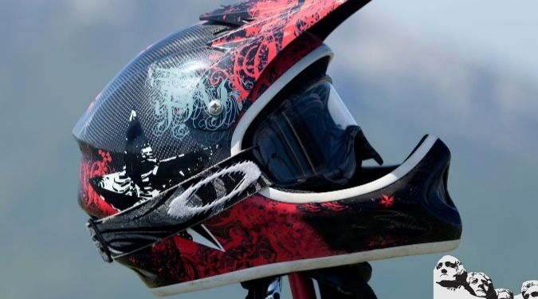
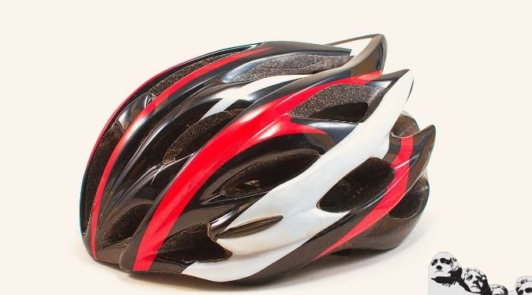

Not long ago, there were two very distinct choices in MT bike helmets: Pick a hot, heavy, ugly model that offered real crash protection or go for a light, racy version that was really no more than a hat.

Thankfully, MTB helmets have come a long way in the past decade. Modern skull buckets are incredibly lightweight, well ventilated and more stylish than most current hairstyles. Above all, they can actually help save your head in a crash. Indeed, a new helmet is now as cool a toy as any other piece of [new bike accessory](https://mtbnz.com/mountain-biking-accessories/).

Choosing the best mountain bike helmets may seem like a task for the experts but, all that really matters is that you acquire one and ensure that you wearing it when riding.

Otherwise choosing and buying will have no essence  if it spends the rest of its ‘plastic life’ in a box. That said, personal preference, head shape, and riding style will mean that some mountain bike helmets will obviously be better than others.

## Top Ten Best MTB Helmets to Buy

\[content-egg-block template=offers\_list\]

## What to Look For in Good MTB Helmets

Finding a helmet that fits well is the primary consideration for the helmet buyer. Human heads come in a variety of sizes and shapes, so try on a number of different brands and models until you find one that fits you.

It should be snug but comfortable-find a size that won't rattle side to side on your head but doesn't have the hard, foam part of the helmet squeezing your skull.

The fit can be fine-tuned with sizing pads, almost all of which attach with hook-and-loop fasteners. Likewise, there's almost no variation in the strap-and-buckle systems on helmets. See the sidebar on helmet fit for more information.

1. **Molding:** Helmets come in all shapes and sizes: road helmets, mountain bike helmets, full face helmets, bmx helmets etc - the molding is the process that gives the helmet it's shape. Usually made from plastic helmets have a protective clover to help prevent damage from small impacts and transportation. The shape determines the helmets aerodynamic drag - therefore road and track helmets are usually slicker than their street cousins. Most helmets are made from EPS (expanded polystyrene) which is both light and strong.
2. **Ventilation:** All helmets have ventilation slots to allow air in to cool your head. The more expensive models will have more slots in better places as the materials used to create them are stronger and therefore more openings can be created. Look out for both front and rear ventilation holes for ultimate cooling.
3. **Straps:** The helmet is secured onto your head with a strap. More expensive models usually have more adjustment than cheaper ones and often have better padding. You can adjust the strap to make sure the helmet is positioned correctly on your head.
4. **Retention system:** Modern helmets feature a retention system on the rear of the helmet to prevent it sliding back in an impact. These systems can be adjusted - but go for a snug fit - not too tight as to cause pain.
5. **Padding**: Inside the helmet you will usually find padding of some sort. This is to prevent sore points, and those with less hair might find it useful to add to the padding that comes as standard.
6. **Peak or no peak?** Mountain bike helmets come with peaks on the front of the helmet - these are great for avoiding low branches and when the sun sits low in the sky. Roadies tend not to have these systems.

## How We Review Our Top Ten MTB Helmets

We ranked adjustability as easy, average or difficult.

Some models offer a helmet stabilizer-a strip of plastic a few inches in length that's mounted to the rear of the helmet. Giro calls it a RocLoc system; Bell labels it a Full Nelson fit system.

A stabilizer snuggles against the back of your skull, which prevents the helmet from wiggling around, especially on bumpy roads. Helmet stabilizers are usually only included on more expensive models, but the extra money may be worth it if you often find yourself pushing your helmet up out of your eyes.

For our buyer's guide, we gathered information on the helmets that are tailored to the road rider. Road-style helmets are often more łaero˛ shaped (with a pointy tail) than their mountain bike cousins, and the off-road feature of incorporating a visor on the front is usually omitted.

Each manufacturer was asked to supply two road-type helmets: their most popular model and their top-of-the-line high-end helmet (but some only make one). BG weighed a sample of each helmet, usually a size large, on our own scale. We evaluated adjustability by monkeying with the straps and pads to tweak the fit of each helmet to the tester's head. And since one manufacturer's size small might be another's medium, we've listed head size (circumference measured at the hat line with each helmet's size).

We also tested each helmet for the head scratch factor-that is, how easy it is to poke a finger through the helmet and get that itchy spot. Size and quantity of vents were the determining factors, so figure on good head scratchers being cooler and better ventilated. We ranked this important feature as good, average or poor.

Since a helmet that fits one person well might feel horrible on another's skull, we've refrained from commenting on fit. But seeing as how fit is so critical-for comfort and safety-it's an excellent idea to spend time at the bike shop trying different buckets on your noggin. (Also note that ANSI has not been included in our list of safety standards, as it has expired. See the sidebar on helmet safety testing for more information.)

If you think a bicycle helmet is just a glorified hunk of a picnic cooler, think again. The commonly used material for helmets, expanded polystyrene (EPS), is indeed related to the cheap, crumbly white stuff frequently seen keeping beverages cold at beach outings. But the bicycle variation of EPS is finely engineered: Consider that the crushing action of a helmet adds five milliseconds to your head's stopping time in an impact. That unbelievably scant amount of time is the difference between walking away from a crash and having to relearn the alphabet. Clearly, disrupting the delicate design of a helmet is not a good thing.

#### What should you do to care for your MTB helmet?

- Do: Wash it periodically with mild soap and water.
- Do: Inspect it for anything that looks suspect, such as cracks or broken straps and buckles. If anything seems questionable, return the helmet to the manufacturer for inspection.
- Do: Replace it every so often. The EPS can degrade in the face of airborne pollutants, making the helmet less effective. There's no specific life span that manufacturers give to helmets, but treating yourself to a new top every few years is a safe bet. You'll probably be seduced by some hot new model by that time anyway.
- Do: Follow all recommendations of the manufacturer. What should you not do to your helmet?
- Don't: Paint it-the solvents in paint can harm EPS. Manufacturers even warn against applying stickers to helmets because the adhesives can also affect EPS. There are some paints and stickers that are okay for some helmets, but check with the manufacturer first.
- Don't: Let it get too hot (see photo). Leaving your helmet in a car on a hot day can easily shrivel the shell. At only slightly higher temperatures the EPS can be damaged.
- Don't: Modify it. Every last bit of helmet is there for a reason. Shaving pieces off to save weight or improve fit can render the helmet worthless in a crash-when it really counts.

## 8 Best Mountain Bike Helmets Reviews

### Mavic Plasma SLR Helmet

Mavic has always been known for their wheels.  But they decided to branch out and offer a line of helmets (Synchro, Plasma, and Plasma SLR) as well as a line of road and mountain shoes.   I recently had a chance to take a close look at the top-of-the-line Plasma SLR.

Now, the helmet is absolutely beautiful.  The shell is fully molded in one piece, and mated to the inner foam without as much as a seam, a crack, or an over-run.  There is plenty of ventilation and on the ribs there are inlays of carbon fiber… purely aesthetic I assure you, but offer a nice look.  Mavic has been true to their French roots and offered up a stylish, Euro lid with crisp lines and a bit of bling.  Ventilation is good, with numerous wide vents, and the rear of the helmet very open.

The interior of the shell is based off of a design resulting from the systematic measurement of head shapes, identifying a common profile that while snug, allows up to six centimeters of adjustment using the Ergo Hold fit system.  Akin to Giro’s Rok-Lock 5, the helmet has a single wheel on the back to tighten or loosen the harness.   However, there is no obvious means to adjust the overall vertical position of the helmet, but given the snug fit, it was not required either.

The helmet padding was thin but sufficient on most places.  The X-static pad, as Mavic calls it, is a colloidal silver impregnated fabric.  The small silver particles are highly anti-bacterial, and keep your helmet from smelling like a gym sock after a season of rider.  Having used silver fabrics in the past, I can attest to the fact that they work, work well, and last long than fabrics without the silver.

The chin strap worked as advertised.  Ease of use and, again, offered a snug fit.  I like the separation of the main chin straps (that form a “V” shape around the ears) from the chin clasp.  There is a separation of the nylon straps with a simple plastic loop.  Not only does this secure the overall strap, it helps separate the adjust of one (say the height of the “V” ear straps) from the tightness of the chin strap.  Kudos to Mavic for this design feature.

Now, overall, the helmet weighs in at a chunky 388 grams in size large (yes, I actually weighed it... this is NOT an internet search weight), considerably more than my Giro Aeon (222 grams) or my wife’s Giro Ionos (344 grams).   Fit was snug on my rather large, rounded head.  Given the general snug fit of the helmet, you may wish to consider the larger size if you are between sizes.  The Ergo Hold system (plastic fit harness) stands out a bit from the helmet’s foam core, and while the back of the helmet tension adjust was padded (most brands are not padded), there was a single plastic strap that was not protected and rubbed the back of my head… fit is that snug.

### TeamObisidian Airflow Helmet

After vigorous research and testing, we settled for the Team Obsidian Airflow Helmet as a top contender. It is arguably the best MTB helmet for cruising through trails as it is not only feather weight but it is also durable.

Do not let its lightweight lead you into believing that it’s weak. On the contrary, it is as strong as the high-end models and you can be sure that it will offer top-notch safety features. Team Obsidian uses in mould technology to mold its high quality EPS, which are common in most of the high quality helmets.

The helmet has been rigorously tested and has even earned the CE certification. It features the patented adjustment system that allows you to make easy adjustments both horizontally and vertically for better fit.  And since everyone’s head has a unique shape, the helmet factors in the shape factor by allowing you to get a perfect fit.

####  Adjustability

Most of the users who have tried out this helmet have pointed out that almost every feature of this helmet is top-notch. It uses the patented adjustment system whose functionality is second to none. The adjustment system allows you to get a snugger and tighter fit. This helmet even has a section that can accommodate ponytails, which means that even women can try out this helmet.

#### Looks

Most of the users have been appreciative of the looks, with most saying that it is beautiful. It features an  oval shaped design that is designed to improve comfort levels. The only complaint that several users have been airing is the lack of additional colors as it is only available in black and white.

#### Comfort

The Team Obsidian helmet is lightweight with easily adjustable straps for improved comfort. It has sufficient padding, with an extra pad on your chinstrap. Its design is not only subtle but also elegant. This way the helmet is large enough to offer adequate protection but slim enough to shed off the bulky weight.

#### Features

The helmet is molded with excellent ventilation as it comes with 22 wide air vents, which are as good as 30 standard vents. It has a detachable visor that you can easily put on and take off.

[Check Price & Reviews on Amazon](https://www.amazon.com/Airflow-Helmet-Black-Medium-Detachable/dp/B017YCUPIS/?tag=furiousbikes-20)

### Giro Revel Helmet

Giro is one of the top helmets in the market, for several years now Giro has managed to deliver great quality helmet without hiking their prices. A good example is the Giro Revel helmet which is just an entry level helmet but offers great styling as well as fit for an affordable price

Giro helmets are famed for their build and even with Giro Revel helmet, it does not disappoint. It has an adjustable strap that is not only strong but, it also tightens securely to the head. It features minimal padding, which means that the padding system is less likely to fall apart.

The helmet fits well and for such a low price it actually impressed. Usually, cheap models tend to fall apart easily and the fit is always a struggle but with this model, all features are above average.

Pros

- Full-coverage shell
- Removable visor
- Affordable

#### Cons

- The ventilation holes do not have an ideal place to hold the sunglasses after you take them off

[Check Price & Reviews on Amazon](https://www.amazon.com/Giro-Revel-Bike-Helmet-Vermillion/dp/B01LKXPBVI/?tag=furiousbikes-20)

* * *

### Giro Feature MTB Helmet

If you want a  helmet that will stand out from the rest, then the Giro Feature is the best choice for you. The Giro helmet is available in different prices which will vary depending on the color and size. It comes with numerous features such as the adjustable visor and the comfortable retention system.

#### Features

It has an in-mold polycarbonate shell that is combined with an In-Form retention system, an EPS foam liner, and adjustable visor and 12 vents. The helmet also has a slight indention on its sides that can accommodate your goggles.

#### Comfort

Most Giro products are top-notch and so is the Giro Feature. It offers additional rear head protection, which is little bit more than is provided by other helmets. One of its selling points is the adjustable visor, which offers you protection when the sun is bothering you.

The ventilation ensures that your head is always cool and it is so light that you might even forget that you are wearing it. According to the reviews on online stores, the fitting is superb and the visor can be removed if you do not need it.

Looks

Most users have acknowledged that the Giro Features is one of the best looking mountain bike helmets. It is available in three sizes and 9 colors, with some of the colors being super bright and others being super dark.  It has a low profile and parks a minimalist look.

#### Adjustability

The Giro Feature helmet features two adjustment methods, a four-position high setting and a circumferential IN-Form system. Both of these methods work perfectly and most of the users had nothing to complain about the adjustability and fit.

[Check Price & Reviews on Amazon](https://www.amazon.com/Giro-Feature-Cycling-Helmet-Medium/dp/B0159OGLMW/?tag=furiousbikes-20)

* * *

### Smith Optics Forefront MTB Helmet

Every time I hear the name Smith Optics, ski goggles comes to my mind but seeing the helmet I was actually quite surprised as I didn’t know that they made bike helmets. Truth be told, the Smith Optic Helmet is worth every penny.

It features [Koroyd tubes](http://koroyd.com/) in its construction. The tubes make it look kick-ass like one of those gadgets from Star Wars. The use of Koroyd tubes makes its protection far better than that of the normal EPS foam helmet.

With this helmet, you will not only get to enjoy its sleek looks and protection but you will also get to enjoy a very light and cool bike helmet. Its hollow construction allows better airflow that the typical helmet construction. This way you get to enjoy a cool ride even in extremely hot weather conditions.

Its fitting system boasts of a 4-point harness system that ensures that your helmet is fits securely on yiur head. Another feature to die for is the pre-installed mounting bracket which is ideal for [bike headlights](http://mtbnz.com/best-bike-lights/) or a GoPro.

Lastly, there is the AirEvac system that moves hot air from your [cycling sunglasses](http://mtbnz.com/10-best-cycling-sunglasses/) to keep them free of fog.

#### Pros

- Koroyd tubes absorb more impact
- VaporFit retention system
- AirEvac system

#### Cons

- You may experience wind noise especially when cycling at fast speeds

[Check Price & Reviews on Amazon](http://amzn.to/2eB1Wwz)

* * *

### Fox Flux MTB Helmet

Fox Racing is not a big brand in the helmet but it does a good job in making the Fox Flux. It is a reputable brand in the [mountain bike gloves](http://mtbnz.com/best-mountain-bike-gloves/) category and other protective gear so it right to say that the Fox Flux may not be a bad choice after all.

It features the De-Tox adjustment system that makes adjustments easier and faster. It offers a wide range of adjustments which makes it ideal for riders who love trying out different adjustment positions.

Although most of the features seemed top notch, the padding didn’t seem to be at par with its competitors. The padding is enough to keep you comfortable but a little more of the padding could really help.

As for its weight, it is on the heavier side which can be attributed to the addition of polystyrene foam to the helmet. The polystyrene foam is thicker than what is present in most models which could probably mean that it offers more protection. (Not proven).

The Flux boasts of 20 air vents and  a small visor that offers very little room for adjustment. If you do not fancy having a visor, you can always remove it. The helmet has a little spoiler at the back of the helmet, which I’m not sure if it serves any purpose.

The Flux helmet is durable and can take a lot of abuse without giving into wear and tear. It offers full protection to the back of your head.

#### Pros

- 20 large air vents
- Removable visor
- In-Mold construction

#### Cons

- Could use more padding

[Check Price & Reviews on Amazon](http://amzn.to/2x7whON)

* * *

### Giro Montaro Bike Helmet

Almost every aspect and feature of the Giro Montaro is likeable with the main feature being the MIPS (Multi-directional Impact Protection System).

MIPS  is an advanced system that is designed to [protect the head against injury](https://mtbnz.com/how-can-you-prevent-injury-while-cycling/) by reducing head rotation. To learn more on the MIPS system click [here](http://mipsprotection.com/).

Although MIPS is a nice addition to the design of the Giro Montaro, it is not the only great feature on this helmet. The Montaro is not only lightweight but also offers unrivaled comfort levels.

Giro incorporates the use of anti-microbial pads on the lining of this model. The anti-microbial pads are made using silver to prevent the occurrence of odor causing bacteria. It will also absorb your sweat as well as keep you cool during hot conditions.

It features the Roc Loc 5 fitting & adjustment system that ensures that you get the perfect fit. It has a pretty big visor that is easily adjustable to give you adequate sun protection.

#### Pros

- Durable polycarbonate shell
- Built in camera mount
- Effective air vents

#### Cons

- The camera mount could be better

[Check Price & Reviews on Amazon](http://amzn.to/2iYYzog)

* * *

### Troy Lee Designs A-1 Helmet

At the top of our list is the Troy Lee A-1 Helmet, which is design for optimal protection. It boasts of 16 air vents that are well positioned to allow air to pass over and through the helmet. The Troy Lee bike helmet also features the CoolMax pads that are ideal for mountain biking in hot and humid weather conditions.

Troy Lee A-1 helmet is easily adjustable and you can adjust it to your preferred fit by use of the cam-lock stabilizer. Its shell is constructed using an advanced smooth polycarbonate material.

Overall, it has a simple but effective design that is ideal for mountain bikers as well as cross-country riders who are interested in safety and functionality as opposed to a wide array of unwanted features.

It has minimal padding but unlike other most of its competitors the padding is placed strategically to make them easily adjustable. The Troy Lee helmet is arguably the best mountain bike helmet for riders with big heads as it’s the only bike helmet in its class that has the extra large model.

#### Pros

- Eight rear vacuum vortex outlets
- Adjustable retention system
- Reinforced polycarbonate shell
- Eight pressurized intake passages

#### Cons

- Gets a little bit warm in extremely hot conditions

[Check Price & Reviews on Amazon](http://amzn.to/2vGW9AJ)

* * *

### POC Tectal MTB Helmet

If you are looking for a new bike helmet , then the POC Tectal MTB helmet might be just the right choice for you.  It has just the right construction for an avid mountain cyclist. It features a solid unibody construction that enables it to provide serious protection in case of a head impact.

The Tectal Helmet features a unique grid that you will have to part with some extra cash to get. The Armid grid is not only able to absorb but also dissipate the force of impact, which greatly reduces the force of impact on your skull. This way your helmet [prevents head injury](https://mtbnz.org/how-can-you-prevent-injury-while-cycling/).

The Tectal helmet boasts of large air vents that are designed to not only optimize their size but also their placement.

It has an adjustable visor for added sun protection. It also comes with goggles which you can choose to wear or discard. The helmet features a 4-point harness system that keeps your helmet firmly positioned on your head and can be adjusted to get your preferred fit.

The Tectal helmet is highly rated among the best mountain bike helmets.

#### Pros

- EPS liner
- Unibody shell construction
- Provides Superior Protection

#### Cons

- There were several complaints about the sizing

* * *

_“What should I consider when shopping for a quality mountain bike helmet?”  is the question that most riders tend to ask. Luckily for you, we will cover all that in this article and even review some of the best mountain bike helmets._

### Helmets Safety Standards

In the US, the law dictates that every bike helmet should adhere to the safety standards set by the Consumer Product Safety Commission (CPSC). The standards are keen on checking the helmet straps, their coverage, stability and the helmets ability to reduce impact force. Typically, the helmet is strapped to a head form that is used to measure the g-force on impact after it’s dropped onto an anvil. Usually, 300 g-force will result to unconsciousness while 400 g-force will result to permanent head injury.

## Choosing the Best Mountain Bike Helmets

Mountain bike helmets are specially designed to protect the rider in case of a major crash. They consist of vents that ensure that the helmet is well ventilated even when cruising at low speeds. They also have visors that are designed to protect the riders from the sun, rain, and mud.

The best mountain bike helmets will provide rear-head coverage and some will go as far as providing full-face protection by adding a wraparound chin bar. With such features, you are sure to enjoy a ride downhill with little to worry about in case of crash.

### What are the features to look for in the best MTB helmets?

Mountain bike helmets come in two styles namely; open face and full face. This article will focus on the open face models as opposed to the full face.

The open face model takes the shape of a typical road bike helmet but it is differs in most of its features such as weight, aerodynamics, ventilation and coverage. An open face helmet is aerodynamic, lightweight, well-ventilated and covers both the sides and the back of the head.

Just like the road bike helmets, the best mountain bike helmets are designed using an inner EPS liner that is glued to the hard outer shell. This makes mountain bike helmets great for different riding styles even  road biking.

What are the main features that comprise a mountain bike helmet?

#### Comfort

Comfort is key when shopping for a mountain bike helmet. How do will you even enjoy your ride down a trail if your trail bike helmet is not comfortable? If it does not feel comfortable, you might as well ditch it.  Your helmet should not be too tight nor should it be too loose, a snug fit will do just fine. It should barely move when you’re trying to tilt it.

If you look at most mountain bike helmet sizes you will find that they are generalized by this I mean that only three sizes are available and these are large, medium and small. You might be lucky and find an extra large size. But cheap models will often offer only size thus limiting your choices. Such models should be avoided.

#### Weight

In most cases, mountain bike helmets are made using Expanded Polystrene that is later strengthened by the addition of an outer shell. However, if you look at some of the best mountain bike helmets you will notice that they have two layers that are carefully bonded together for added strength. MTB helmets with such designs are not only stronger but also lighter. They also tend to be more expensive that the usual bike helmets.

The cheaper model tape or glue the inner foam liner to the outer plastic shell.  And as you would expect from such a lackluster design, it falls apart a very few rides especially if you are used to riding in hot weather.

#### Safety

According to the law, all bike helmets should meet the [Consumer Product Safety Commission](https://www.cpsc.gov/safety-education/safety-guides/sports-fitness-and-recreation-bicycles/which-helmet-which-activity) and [ASTM International](https://www.astm.org/Standards/F1447.htm)  safety requirements, irregardless of the price range, features, or designs.

This way you are able to focus on the type of bike helmet you want depending on your riding needs as opposed to trying to discern if the helmet is safe for use or not.

A good example is the full-face helmet, which is provides better protection compared to the open face helmet. However, it is not the best option when it comes cross country rides or even riding on a single track as it limits the riders’ visibility.

On the other hand, the open face helmet is not ideal for a rider who participates in extreme sports due to the lack of adequate coverage and the increased risk of injury, which requires a better and comprehensive design.

#### Helmet Fit

Another important factor is the helmet’s fit, which is not the same as a comfortable helmet. Your helmet should sit approximately an inch above the eyebrows. It should leave room for wearing sunglasses or goggles.

Try wearing your helmet with your riding sunglasses and see if it fits before making a purchase that is if you are making the purchase in person. Ensure that none of the areas are too tight and loose areas should be supplemented using liners or pads.

Have fun, ride safe and enjoy your ride..
