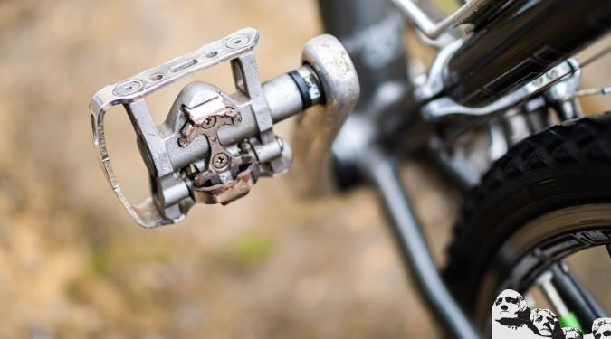
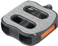
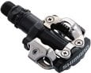
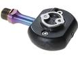

After spending months of research, and mountain biking on the trails, we are proud to announce that the [**DMR VAULTS**](https://www.amazon.com/dp/B00MEN2FGI/?tag=furiousbikes-20) & [**Shimano PD-M540**](https://www.amazon.com/Shimano-PD-M540-SPD-MTB-Pedals/dp/B000WYCCDW?tag=furiousbikes-20) are the best MTB pedals currently.

For the third time, DMR Vaults have proved to be the most comfortable flat pedal for MTB enthusiasts. For those who prefer clipless pedals, the Shimano PD-M540  is an ideal choice after passing durability, comfort, and strength tests.

## _**Below is a list of the the best MTB Pedals 2022:**_

1. DMR Vaults Flat Pedals

3. Hope F20 Flat pedals

5. Race Face Chester Pedals

7. Imrider Lightweight Polyamide Bike Pedals

9. The shimano PD-M540 SPD

11. Crank Brothers Candy 1

13. The Shimano PD-M530

15. Shimano XTR PD-M9000 Race

17. Shimano A530 SPD pedals

19. Shimano PD-M324 SPD

* * *

## Best Flat Mountain Bike Pedals

The popularity of flat pedals has grown over the years. Most mountain bikers who prefer the platform pedal over the clipless pedals.

Owing to this trend, we embarked on our research and put more than 10 brands of flat pedals to test.

During our research, we focused on Grip, comfort, noise & durability aspects, so that we could identify the best of the best. We found that these four brands were great for all levels of mountain biking.

> Related: [Best MTB Shoes for Flat Pedals](https://mtbnz.com/best-mtb-shoes-for-flat-pedals/)

### 1\. Best Mountain Bike Pedal- [DMR Vault](https://www.amazon.com/DMR-Vault-BMX-Pedal-black/dp/B005U5WIYG/ref=as_li_ss_il?_encoding=UTF8&pd_rd_i=B005U5WIYG&pd_rd_r=P4KS7FC0DJYXRTQY61Y4&pd_rd_w=49Bjv&pd_rd_wg=qv76f&psc=1&refRID=P4KS7FC0DJYXRTQY61Y4&linkCode=li3&tag=furiousbikes-20&linkId=c8a48d3b65f4143a1591cc6b16396a8f)

  
For the third time in a row, I've picked the [DMR Vault Flat Pedals](https://www.amazon.com/DMR-Vault-BMX-Pedal-black/dp/B005U5WIYG/ref=as_li_ss_il?_encoding=UTF8&pd_rd_i=B005U5WIYG&pd_rd_r=P4KS7FC0DJYXRTQY61Y4&pd_rd_w=49Bjv&pd_rd_wg=qv76f&psc=1&refRID=P4KS7FC0DJYXRTQY61Y4&linkCode=li3&tag=furiousbikes-20&linkId=c8a48d3b65f4143a1591cc6b16396a8f) as my best mountain bike pedals.

Surprisingly, if you ask bike journalists and versatile riders, they will also recommend the DMR vaults because of the unparalleled quality. Ever since these pedals were pioneered, they have been improved to suit the needs of a mountain biker.

The DMR Vaults weigh around 400 grams which is an ideal weight for trail riders. Additionally, they have a thickness of around 17mm and they feature a concave shape that is perfect for your flat pedal-specific shoes. The other good thing is that they have a wide platform area of 115 x 115 mm.

I have used these mountain bike pedals for 2 years and I can testify that they have an amazing grip, thanks to their durable hexagonal shaped pins. These alloy thru-pins can be replaced easily since they use an M4 thread.

Another awesome feature about the vaults is their durable construction. The pedal bodies are CNC milled making them tough for all conditions.

The finishing is also on point. You might even think they feature a Teflon topcoat due to their resistance to abrasion.

In case you are that rider who lives for the descents, then you definitely need to grab a pair of the DMR Vault Flat Pedals. They never disappoint!!!

[Check Current Price On Amazon](https://www.amazon.com/DMR-Vault-BMX-Pedal-black/dp/B005U5WIYG/ref=as_li_ss_il?_encoding=UTF8&pd_rd_i=B005U5WIYG&pd_rd_r=P4KS7FC0DJYXRTQY61Y4&pd_rd_w=49Bjv&pd_rd_wg=qv76f&psc=1&refRID=P4KS7FC0DJYXRTQY61Y4&linkCode=li3&tag=furiousbikes-20&linkId=c8a48d3b65f4143a1591cc6b16396a8f)  

* * *

### 2\. [Hope F20 Flat Pedals](https://www.amazon.com/Hope-F20-Platform-Pedal-Red/dp/B009YE3YPG/ref=as_li_ss_il?ie=UTF8&linkCode=li3&tag=furiousbikes-20&linkId=4d3d82b3d525be8c45f9adf3a5208a53)

The Hope F20s scooped our best-engineered award after maintaining its superior design and construction since 2012. These MTB pedals are designed and manufactured in the UK and they enjoy a lot of popularity among UK mountain bikers.

The Hope F20s have a thickness of 15mm and a weight below 400 grams. This makes the pedals look sleek and lightweight. I love its aluminum alloy construction which features horizontal cutouts that help in shedding mud.

As you'd expect, the Hopes come in a variety of colors which include orange, black, , silver and blue. Isn't that awesome? You'll get to choose one that will match your bike.

The F20s was designed to have a durable construction thanks to its three cartridge bearing, a CR-MO axle, Norgide bushing, and a sealed end cap located on the outboard end.

Just like other best-rated MTB pedals, the Hope F20s bodies are slightly concave. The body is fitted with a number of pin to provide extra grip on your shoes. These pedals are ideal for full suspension and hard-tail mountain bikes. You can use them in a variety of terrain and most importantly they are all-weather pedals.

[Check Price & Reviews on Amazon](https://www.amazon.com/Hope-F20-Platform-Pedal-Red/dp/B009YE3YPG/ref=as_li_ss_il?ie=UTF8&linkCode=li3&tag=furiousbikes-20&linkId=4d3d82b3d525be8c45f9adf3a5208a53)   

* * *

### 3\. [Race Face Chester Flat Pedal](https://www.amazon.com/Race-Face-Chester-Pedal-Green/dp/B018J1IZ8K/ref=as_li_ss_il?s=sporting-goods&ie=UTF8&qid=1504198960&sr=1-2-fkmr2&keywords=crank+brothers+5050+x&linkCode=li3&tag=furiousbikes-20&linkId=d04b6a29f8d165893a5bc093bd3dd01f)

These pedals have a _**slick design**_ and a _**wide surface to**_ support your feet when pedaling. Moreover, the pedals weigh only 340 grams. Chester flat pedals are built using high-quality nylon that _**does not wear off easily**_.

Race Face is available in various colors so you’ll have a wide variety to choose from. In addition, the plastic housing will mute sounds, and absorb shock when you bash trees or rocks.

You’ll definitely love the _**balance and grip**_ that the pedals provide when you’re bouncing off obstacles. There is no doubt that these pedals will do a good job when riding on rocky and muddy trails. The pedals will continue to spin smoothly even after using them for a long time!

**_What is odd about the Chester pedals?_**

- You might not like the fact that the pedal is constructed using plastic

- They are relatively thick around the axle

Source: http://reviews.mtbr.com/race-face-chester-flat-pedal-review

[Buy on Amazon](https://www.amazon.com/Race-Face-Chester-Pedal-Green/dp/B018J1IZ8K/ref=as_li_ss_il?s=sporting-goods&ie=UTF8&qid=1504198960&sr=1-2-fkmr2&keywords=crank+brothers+5050+x&linkCode=li3&tag=furiousbikes-20&linkId=d04b6a29f8d165893a5bc093bd3dd01f)  

* * *

### 4\. [Imrider Lightweight Polyamide Bike Pedals](https://www.amazon.com/Imrider-Lightweight-Polyamide-Pedals-Bicycle/dp/B01ILX7NFW?tag=furiousbikes-20)

If you are looking for some _**affordable & high-end**_ flat mountain bike pedals, you are in the right place. The Imrider pedals features provide mountain bikers with the comfort and service they always long for.

The Imriders features high-quality spindles constructed to provide [_**strong grips**_ to your mountain bike](https://mtbnz.com/best-mountain-bike-grips/). At least you’ll not have to worry about sudden disconnection when navigating technical trails.

Amazingly, they have a wide surface that enhances _**pedaling efficiency**_ as well as comfort.

The Surface is fitted with studs that provide strong grip; therefore, your shin will not be exposed to bruises as a result of skidding.

Imrider pedals are designed to be used on Mountain bikes, road bicycles, cruiser bikes, BMX and kids’ bicycles.

The pedal is made from high-end polyamide that is well known for its _**corrosion and abrasion resistance**_. There is no doubt they will last you for years without the need of replacement. 

Incredibly, they are available in the following colors:

- Orange

- Red

- Blue

- Black

[Check Price & Reviews on Amazon](https://www.amazon.com/Imrider-Lightweight-Polyamide-Pedals-Bicycle/dp/B01ILX7NFW?tag=furiousbikes-20)

* * *

## Best Clipless MTB Pedals

### 5\. [The Shimano PD-M540 SPD Pedal](https://www.amazon.com/Shimano-PD-M540-SPD-MTB-Pedals/dp/B000WYCCDW/ref=as_li_ss_il?s=sporting-goods&ie=UTF8&qid=1504196145&sr=1-1&keywords=shimano+M540&linkCode=li3&tag=furiousbikes-20&linkId=b85eceac2d8b7f57ec2c6a8860f33269)

There is no doubt that the Shimano SPD  M540 is one of the best MTB pedals in the market. It features _**unique and sturdy mountain bike cleats**_ that will hold your cycling shoes in place.

I found that most cycling clubs have embraced these pedals due to their _**efficiency**_ as well as performance. I bet this is why these pedals are quite famous in the states.

Most cyclists will agree with me that the Shimano branded pedals are perfect for off-road trails as well as smooth paths.

_**What’s special about the PD-M540?**_

For starters, they are high quality double sided pedals that have proved to be reliable. They have dependable positive action and bearing quality. Besides, it’s constructed using _**high-quality material**_ that ensures the pedal lasts for years.

The PD-M540 allows you to unclamp or unclip your feet by twisting out. The pedal will last for long as long as you maintain it by squirting a little grease on the rotating and interlocking parts.

Do not allow ice or snow to accumulate around the cleat, ensure that you bash it out to increase your pedal’s longevity.

[Check Price & Reviews on Amazon](https://www.amazon.com/Shimano-PD-M540-SPD-MTB-Pedals/dp/B000WYCCDW/ref=as_li_ss_il?s=sporting-goods&ie=UTF8&qid=1504196145&sr=1-1&keywords=shimano+M540&linkCode=li3&tag=furiousbikes-20&linkId=b85eceac2d8b7f57ec2c6a8860f33269)

* * *

### 6\. [Crank Brothers Candy 1 MTB Pedals](https://www.amazon.com/dp/B008CGYUDW/ref=as_li_ss_il?_encoding=UTF8&psc=1&linkCode=li3&tag=furiousbikes-20&linkId=e088d81c016e02650db5413886dea7bc)

The candy 1 is considered as one of the _**most versatile pedals**_ that perform at trail riding, mountain biking, and cyclocross.

Unlike some clipless MTB pedals, the Candys have a 4 sided entry, a feature that allows _**easy mud shedding**_. Another cool feature about the Candys is that you can customize the float & release angles to your preferred specifications.

In case you are looking for _**strong and durable**_ pedals, then you should definitely go for these bad boys. They feature a stainless steel spring and forged steel spindle which makes the Candys last for long.

[Check Price & Reviews on Amazon](https://www.amazon.com/dp/B008CGYUDW/ref=as_li_ss_il?_encoding=UTF8&psc=1&linkCode=li3&tag=furiousbikes-20&linkId=e088d81c016e02650db5413886dea7bc)

* * *

### 7\. [The Shimano PD-M530 SPD Pedal](https://www.amazon.com/Shimano-149319-PD-M530-Mountain-Pedals/dp/B0052XXW32/ref=as_li_ss_il?s=sporting-goods&ie=UTF8&qid=1504196017&sr=1-1&keywords=shimano+m530&linkCode=li3&tag=furiousbikes-20&linkId=b3583d9b1b9f3d4d576a41a8afb263a3)

If you are looking for the _**most affordable**_ and high-quality Shimano clipless pedals, you might want to consider the M530 model. There is no doubt that these pedals are sold at a fairly cheap price despite its high-end performance. There would be no reason for a trail rider to complain about these _**strong and awesome pedals**_.

Tests have proven that the M530s offer similar trail performance to other high-end Shimano pedals. You’ll note that the M530 is a bit heavier with just 47 grams more than the XT models, and also 57 grams more than the XTR models.

You’ll be amazed that these MTB pedals have _**high-end bearings**_ that ensure they keep spinning smoothly. Secondly, these pedals are good when riding in mud, rain and on rocks. Once you get used to them, you will make them one of your primary pedals or favorites.

When riding with the M530s, always ensure you apply some oil on the moving parts and on the springs. This will ensure your ride is smooth and enjoyable. These pedals are not as sexy as the XTR, but they will surprise you in the aspects of performance.

Even if you put countless miles on these high-end clipless MTB pedals, they’ll still remain smooth and strong at the axle.

[Check Price & Reviews on Amazon](https://www.amazon.com/Shimano-149319-PD-M530-Mountain-Pedals/dp/B0052XXW32/ref=as_li_ss_il?s=sporting-goods&ie=UTF8&qid=1504196017&sr=1-1&keywords=shimano+m530&linkCode=li3&tag=furiousbikes-20&linkId=b3583d9b1b9f3d4d576a41a8afb263a3)

* * *

### 8\. [Shimano XTR PD-M9000 Race Pedal](https://www.amazon.com/Shimano-PD-M9000-Race-Pedal-Color/dp/B00O66MSKE/ref=as_li_ss_il?s=sporting-goods&ie=UTF8&qid=1504172529&sr=1-1&keywords=xtr+pedals&linkCode=li3&tag=furiousbikes-20&linkId=dbdba360d1daec7d1b1b363216e3bb48)

The XTR PD-M9000 pedals are known to be bad boys in the roughest terrain. They are designed to meet the needs of world-class pro mountain bikers and people [competing in a cyclocross](https://mtbnz.com/best-cyclocross-bike/).

A pair of these bad boys weigh approximately 310 grams. These pedals are compatible with the Shimano SM-SH56 cleats as well as the SM-SH51 model.

Pro cyclists love the fact that the M9000’s features a _**wider bearing placement to enhance rigidity**_. As long as you are willing to pay the price, you will have the chance to enjoy the following features:

- The package comes with the Shimano SM-SH51 cleats

- It’s designed to allow cyclists to adjust tension and release settings

- It has a relatively low platform height that increases stability

- It has an oval shaped axle housing that allows a _**smooth flow of debris & mud**_

- The pedals feature strong retention claws that allows for smooth engagement & release.

- The spindle is made using chrome-moly steel to ensure that it _**lasts longer**_.

- It features an _**awesome mud shedding design**_

[Check Price & Reviews on Amazon](https://www.amazon.com/Shimano-PD-M9000-Race-Pedal-Color/dp/B00O66MSKE/ref=as_li_ss_il?s=sporting-goods&ie=UTF8&qid=1504172529&sr=1-1&keywords=xtr+pedals&linkCode=li3&tag=furiousbikes-20&linkId=dbdba360d1daec7d1b1b363216e3bb48)

* * *

## Best Dual Platform MTB Pedals

#### What are dual platform pedals?

These are pedals that combine a clipless and platform design together. In simple terms, you could use these pedals as flat pedals and ride to work using normal shoes; alternatively, you could switch to the clipless side whenever you are riding trails and rough terrain. Below are some of the top combo pedals you can get in the market.

### 9\. [Shimano A530 SPD pedals](https://www.amazon.com/Shimano-A530-SPD-Pedals/dp/B0014UG3WE/ref=as_li_ss_il?_encoding=UTF8&refRID=K1GPP8JXKHSDNGQJ4PMT&th=1&psc=1&linkCode=li3&tag=furiousbikes-20&linkId=3b1059096444c95951972e9e34678488)

The reason I choose to buy the A530 model is because I am not a fan of changing pedals whenever I’m riding on different surfaces. With the A530 pedals, I get to switch the pedals whenever I want without having to play the mechanic role.

These awesome MTB pedals are built with strong sealed-cartridge bearings as well as steel spindles that ensures your pedals provide cyclists with the right service. The ovalized platform side allows you to cycle comfortably with any type of shoe.

The package comes with a set of cleats so that you can be in a position to use the Clipless sided pedal. These pedals weigh around 380 grams which is relatively light considered to other pedals.

I appreciate the fact that the A530s are affordable even with the great functionality you’ll be enjoying. You definitely need to try these high-end pedals; trust me you won’t regret!

[Check Price & Reviews on Amazon](https://www.amazon.com/Shimano-A530-SPD-Pedals/dp/B0014UG3WE/ref=as_li_ss_il?_encoding=UTF8&refRID=K1GPP8JXKHSDNGQJ4PMT&th=1&psc=1&linkCode=li3&tag=furiousbikes-20&linkId=3b1059096444c95951972e9e34678488)

* * *

### 10\. [Shimano PD-M324 SPD](https://www.amazon.com/Shimano-PD-M324-Dual-Platform-Pedal/dp/B001AT33CW/ref=as_li_ss_il?_encoding=UTF8&refRID=K1GPP8JXKHSDNGQJ4PMT&linkCode=li3&tag=furiousbikes-20&linkId=0029a24d15bf46296d8db730a9db971b)

The M324 are known to emulate the traditional pedal design. It’s one of the most popular dual platform pedal that is ideal for multipurpose use. When using the Shimano PD-M324, you will have enjoy the fun of riding a platform and clipless pedal all in one.

The pedals are built using Aluminum which is a strong metal. The only bad thing is that it makes these pedals a bit heavier at 518 grams.

The pedal allows you to adjust the entry and release tension settings to suit your needs. In addition, the package will include a pair of 2-bolt cleats to get you started. The design of the pedal allows you to service the cup and cone bearings with ease.

With these pedals, you can choose to ride with sneakers or cycling shoes depending on the side that you want to use. These strong pedals will serve you for years as long as you maintain them.

[Check Price & Reviews on Amazon](https://www.amazon.com/Shimano-PD-M324-Dual-Platform-Pedal/dp/B001AT33CW/ref=as_li_ss_il?_encoding=UTF8&refRID=K1GPP8JXKHSDNGQJ4PMT&linkCode=li3&tag=furiousbikes-20&linkId=0029a24d15bf46296d8db730a9db971b)

\[su\_divider top="no" divider\_color="#021515" size="1" margin="10"\]

The Shimano PD-M520L MTB Sport Pedals with Cleats are a great set of pedals for riders who enjoy both road and mountain biking. It was built to be an off road type pedal and their open binding design makes cleaning mud of the pedals easier. The Shimano PD-M520L MTB Sport Pedals are also Shimano’s lightest off-road set making them a practical choice for almost any terrain. These live up to the reputation of the company that makes them. Shimano has revolutionized biking design and these pedals carry that mark of innovation and quality with them.

We found Amazon.com to have the best prices on all mountain bike pedals, including the Shimano PD-M520L MTB Sport Pedals. Click here to check them out.

**Shimano PD-M520L MTB Sport Pedals Features and Specifications**

- Sports type

- Pedals with cleats

- Dual SPD bindings

- Cartridge bearing

- Material type: Steel

- Material set element: aluminum

**Shimano PD-M520L Mountain Bike Sport Pedals Pedals Reviews**

Light weight and designed for off-road performance, the Shimano PD-M520L MTB Sport Pedals shine when they are used by pro bikers. They’re priced very competitively and most reviews about the product are positive. It’s only natural that something so cheap but so reliable get good reviews. Most users seem to enjoy the Shimano PD-M520L’s solid design. Whether they’re used off-road or on them, they are able to function very well.

One reviewer has been using the Shimano MTB Sport Pedals for a year when he posted his review and he has not yet been disappointed. He has used them to cover great distances and there were no observable faults in them. They don’t require too much maintenance and the clips are smooth and easily adjustable. However he does admit to falling twice when he still wasn’t used to the clips and wasn’t able to get out as quickly as he wanted to.

Another reviewer considers the Shimano PD-M520L Pedals to be a cheap and reliable newcomer to the clipless pedals group. It’s good for newbies who want to try clipless systems but there are better pedals for the more experienced bikers. He also noticed that he had to tighten up the internal nuts when the pedals started making clicking sounds.

The third reviewer used the Shimano PD-M520L MTB Sport Pedals as his first pedals when he made the jump to clipless systems. He noticed a considerable difference in his performance with these pedals as compared to the regular ones. He was also able to jump into the clips and take them off quickly enough. They felt solid under his feet and the free set of cleats saved him $15 or maybe $20 dollars.

Buy from Amazon

Considering all the reviews that we read, the Shimano PD-M520L MTB Sport Pedals with Cleats is a recommended set of pedals for those who are thinking of making the jump from traditional pedals to clipless ones. They are cheap and they come with free cleats. They’re sturdy and reliable enough to invest in as a first set of clipless pedals.

##  How To Choose The Best MTB Pedals

“I always have a hard time choosing the best mountain bike pedals” is what beginners always complain about. Of course, it will not be an easy task choosing bike pedals if you do not know what you should consider. 

Fortunately, there are a few tips that I’m going to walk you through so that you are able to make the right decision.

### Consider the type of pedals you want

As discussed earlier, there exist three types of pedals which include the clipless, combo and platform/flat MTB pedals.

By now you should know that each type is designed to suit a certain type of bike. If you are looking to buy pedals for your mountain bike, it is advisable that you buy the flat pedals because they are easy to use.

### Check for Durability aspects

Unless you are really old to ride frequently, your pedals will be exposed to rough conditions and treatment. For this reason, it is imperative to buy a pedal that will withstand extreme tree brushing.

Of course, it’s always good to keep your bike clean to increase durability. Unfortunately, some bike pedals will rust when exposed to water. This is why you need to ensure that your pedals will not rust easily. Invest in pedals that can last you for more than 2 years of heavy riding.

### Choose The Best MTB Pedals That are Easy to Clean

This factor goes hand in hand with durability. The best mountain bike pedals tend to hold grime better than ordinary pedals.  The design of pedals will tell you if it’s easy to clean them or not. Always ensure that you pick a pedal that requires little or no maintenance.

### Check for Adjustability on the MTB Pedals

The most important question you should ask yourself is if the pedals are easy to click out. Do the pedals allow you to move your legs naturally when pedaling?  Pick pedals that will enhance freedom of motion and those that are comfortable for downhill and cross country riding.

* * *

## Types of Mountain Bike Pedals

https://www.youtube.com/watch?v=rN2dTtVjom0

### MTB flat Pedals

I am sure you are familiar with the regular pedals you see on most bikes. These type features a flat surface where your feet steps on. These pedals are designed in many shapes, materials and styles.

Most of the MTB flat pedals will have a price range of around 20$-50$; this means they are easily replaceable in case of damage.

Manufacturers have come up with high-end fat pedals that will cost you around 50-100 bucks.  Good thing is that they come fitted with spikes that provide good grip.

In most cases you’ll find out that these pedals are built using lightweight alloys. Besides, it comes with high-quality ball bearings that are replaceable and serviceable.

#### Pros

- They are quite affordable

- Compatible with all kinds of shoes

- Allows you to bail of the bike when necessary

- Great for beginners and downhill cycling

#### Cons

- They are less efficient

### MTB Clipless Pedals

Are you familiar with the concept of a ski boot binding? If yes, you might have noted that clipless pedals apply a similar mechanism. The pedals are designed to hold or clip your foot on the pedal when cycling. When riding using these pedals, you can unclamp your cycling shoes by twisting the heel outwards.

#### What is so special about Clipless pedals?

With clipless pedals, you don’t have to worry about your legs slipping of the pedals when mountain biking or riding on smooth roads.

Secondly, they allow cyclists to practice and perfect the most efficient pedaling method. How? By helping cyclists apply consistent and even pressure throughout a pedal stroke.

The clipless pedal has two main parts which includes:

- Actual pedals

- The cleats (the parts that attaches to the cycling-specific shoes)

#### Advantages

- **_Comfort & even power transfer_**: clipless pedals allow cyclists to have a steady pedal stroke. This implies that you will not require flexing your foot a lot thus improving foot comfort.

- **_Allowing easy hoping & lifting:_** Clipless pedals allow cyclists make small hops and jumps easily. On the other hand, it is not good to rely on them to practice bunny hops.

- **_Minimizing shifting feet:_** Clipless pedals are designed to hold your feet well even on rough terrain. This means that your feel will rarely slip when peddling.

#### Disadvantages

**_Clogging up easily:_** They clog up easily during extreme conditions such as snow or ice

**_Easy to fall:_** with clipless pedals, you might forget to unclip your legs when you need to stop. This will definitely lead to a funny slow-motion fall.

### How to Choose the Best Clipless MTB Pedals

**C**ertain things in our lives that have become so pervasive, it's hard to imagine ever not having them-ATMs for example. They're everywhere now, and credit card companies advertise, "Accepted at over 1 million ATMs!" or some such number. But we can all remember when you just had to wait until the bank was open to get cash.

For cyclists, clipless pedals are the same way. Most of us can remember riding in clips and straps and making that step toward clipless pedals with great trepidation. If you're like me, you probably even wondered what the hell you were thinking buying these death traps, as you lay sprawled on the pavement at a stoplight, unable to clip out. Even on organized tours many riders have a nifty pedal-and-shoe "system." But just 12 years after Look debuted the first widely accepted clipless pedal, it's hard to imagine riding those old rat traps. The days of desperation track stands at stoplights because you forgot to loosen the toe straps are over.

#### **Drilling for Cleats**

Since that first pedal from Look, many manufacturers have joined the clipless market, introducing a myriad of cleat bolt patterns that threaten to make your shoe soles resemble carbon-fiber Swiss cheese.

So what is best?

The truth is, all of these designs are proven performers, but what pedal and shoe you end up with is largely dependent on what kind of riding you do. The Look-style (three-bolt) pedals incorporate a large triangular platform for stability and support during long rides. (Look closely at the Motorola team. They're not riding SPDs, but the older Look-style Dura-Ace platforms.)

SPD, for Shimano Pedaling Dynamics, was originally invented for mountain biking. A small cleat was necessary to minimize cleat contact with the ground during hike-a-bike sections and to maximize the amount of tread on the shoe sole. This design is especially popular for the noncompetitive rider who spends time off the bike. Most recessed-cleat shoes (those that allow the rider to walk without damaging the cleats) are drilled for the two-bolt SPD pattern. Don't think that SPDs aren't a performance item, though, as many of the pedals in this style we tested are made to accommodate the racer. The odd men out, as it were, are companies such as Time, Diadora and the Merckx Podio. These use their own bolt patterns that require a dedicated shoe drilling or special adapter plate.

#### **Float Like a...Foot?**

I don't think Muhammad Ali had biomechanics in mind when he uttered his famous quote, but float is a big issue in the pedal world. Float is a rotational movement of the cleat in the pedal that allows free movement in the heel. The range of float varies between 1 and 30 degrees depending on the manufacturer. It should be noted that float in its original usage denoted full lateral movement of the foot on the pedal, with no pivot point. Now the term generically refers to heel rotation.

Do you need float? Maybe, maybe not. Float and rotation are based on the discovery that some riders' knees move laterally during the pedal stroke. If locked into a fixed system, the lateral movement strains tendons and ligaments in the hip, knee and ankle joints. These are the riders who absolutely need a floating system. Some of us (a larger segment of riders than you'd think), however, have knees that don't rock around as much

#### **Weights & Measures**

In many cases, manufacturers offer more than one pedal, so we asked them for their best-selling model and a budget-oriented platform. For some makers, these were one and the same. Our review is not exhaustive but does represent the selection available. Omitted models share many of the same features as their reviewed brethren. The category "release tension" denotes my impressions of the ease of entry and exit from the pedal at both the lowest and highest retention settings. We've also included a criterion often overlooked: platform size. This is an important consideration, as it will help you choose a pedal and shoe that's right for your riding style. For SPD-style platforms, we measured the platform size with the "pontoons" that come with SPD cleats installed.

For the weight weenies out there, do not be swayed simply by the promise of lighter gear. To pick the pedal that's right for you, consider what you're doing on the bike. Tourists don't need the lightest, trickest design out there, and crit racers don't need the largest platform available. Consider the shoes that are available and fit your feet the best to be sure they're drilled for the pedals you want. Buy what's appropriate for your riding style.

## Conclusion

In summation, I believe that our guide will help you choose the best mountain bike pedals with ease. There are a lot of pedals that exist in the market but we were only able to review those that we've tested.

Our choices are the best for both beginners and pro mountain bikers. _In case you are interested in other MTB gear, check out our comprehensive guide on the [**best mountain bike shoes**](http://mtbnz.com/best-mountain-bike-shoes/), &_ [**_best mountain bike helmets_**](http://mtbnz.com/best-mountain-bike-helmets/)
