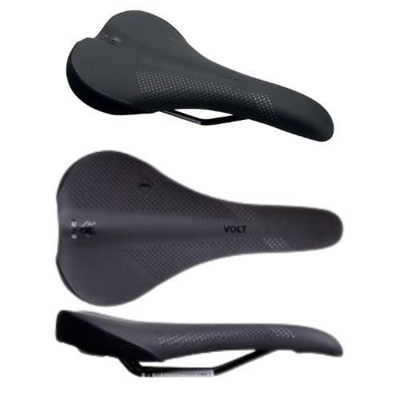
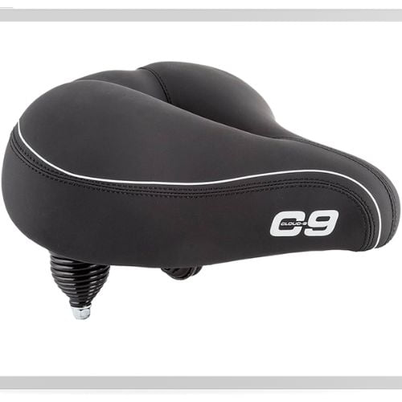
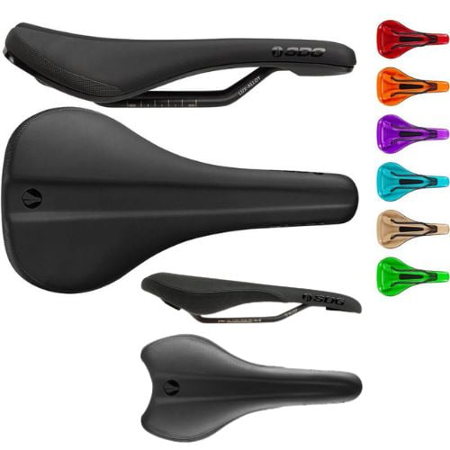

As a fellow big guy, I know the struggle of finding a bike seat that doesn't leave your rear end feeling like it got beat up after a ride. Most stock saddles are just too small and too hard on us bigger riders. 

Fortunately, the cycling industry has recognized the need for specialized designs catering to larger riders. There are now bike seats explicitly created for big guys, taking into account the unique challenges we face. These seats often feature ergonomic designs, gel padding, and a wider profile, offering the comfort we deserve.

## Best Mountain Bike Saddle for Big Guys

Show Details

1. **WTB Volt**: Affordable with strong steel rails to support heavier riders.
2. **Cloud-9 Cruiser**: Suspension technology and wide cushioning for shock absorption.
3. **SDG Bel-Air**: Highly rated for all-around MTB use with multiple widths available.
4. **Brand-X Cruiser**: Wide dimensions (269 x 256mm) on durable steel rails.
5. **Fabric Scoop**: Flexible nylon base adapts to body movements for comfort

## 1\. WTB Volt MTB Saddle

- The WTB Volt is a great value for money. It's offered at a reasonable price, and its durability means it's a saddle you can put on your bike and forget about for years

[Check Latest Price](https://amzn.to/49LYTvY)

First off, the WTB Volt is designed with a unique Fusion Form technology. This technology allows the fine-tuning of the amount of fiber infused into the nylon of each specific saddle model, creating a flex profile that balances comfort, support, and durability. This is particularly beneficial for mountain bike riders who tend to pedal in a more upright position. The updated Volt base features less fiber to increase flex and improve comfort.

The WTB Volt saddle is available in three widths: 135mm (narrow), 142mm (medium), and 150mm (wide). The medium (142mm) and wide (150mm) options are suitable for big guys, as they provide a comfortable fit for larger riders with wider sit bone measurements. 

The saddle also features a flex-tuned shell and DNAX padding, which offer support and comfort during rides.

## 2\. Cloud-9 Cruiser Select MTB Saddle

- Despite its cushy padding, the Cruiser Select is built tough to handle bigger riders. It has a durable nylon cover that's water-resistant and easy to clean. And the base is reinforced with steel rails so it can support over 300lbs without flexing or breaking. This saddle is made to last many rugged seasons out on the trail.

[Check Latest Price](https://amzn.to/46ruTm3)

The Cruiser Select is extra wide and long to provide plenty of surface area support. It measures a full 10.5 inches wide and 10.75 inches long. That's a lot more coverage than your typical narrow racing saddle.

With a shape that's more like a sofa than a seat, you get plenty of cushioning under both sit bones so your weight is evenly distributed. No more feeling like your rear is hanging off the back!

The saddle's comfort is unparalleled, thanks to its select foam padding. This multi-stage memory foam is ergonomic, supple, and evenly distributes your body weight, ensuring your comfort is never compromised. 

Imagine sitting on a cloud while you conquer those challenging trails. That's the kind of comfort we're talking about!

To relieve pressure on sensitive tissues, the saddle has an anatomic relief channel down the middle. This helps increase blood flow and keeps you comfortable over long rides. The channel prevents the dreaded "numbness" that many heavy riders experience with smaller MTB saddles.

The saddle also boasts an elastomer spring suspension. This feature is a godsend when you're riding on rough or bumpy terrains as it excellently absorbs road vibrations that cause discomfort.

As for durability, the Cloud-9 Cruiser Select Saddle has it in spades. Each model sports a rigorously tested covering that'll last countless rides. Plus, it's waterproof, making it perfect for all-weather riding.

And let's not forget about the removable Pillar Seatpost Saddle Clamp included with the saddle. This feature allows for easy installation and removal, adding to the overall convenience of using this saddle.

## 3\. SDG Bel-Air MTB Saddle

- The SDG Bel-Air V3 saddle is a fantastic choice for big guys. Its combination of a modernized shape, comfort features, durable construction, and stylish design make it a standout option for any mountain biker.

[Check Latest Price](https://amzn.to/46ruTm3)

This MTB saddle is built to last. It features a vacuum-sealed cover with protected edges for durability and a seamless look. This new design eliminates the need for staples or glue, which can often be points of weakness in other saddles.

- The Bel-Air officially supports riders up to 275 pounds, but anecdotal reports suggest it can accommodate heavier weights when properly set up.
- The Bel-Air hits a nice balance between price and performance. The steel version costs around $60 while the titanium rail version costs around $90. This makes it very affordable compared to other high-end saddles costing $150 or more.

## Factors to Consider When Choosing the Best Mountain Bike Saddle for Big Guys

When choosing a mountain bike saddle for larger riders, there are several key factors to keep in mind:

- **Width**: Look for a wider saddle, around 140mm or more, to properly support your sit bones. An extra 25-30mm on each side will provide necessary comfort and prevent chafing or injuries
- **Padding**: More padding and foam density helps cushion during rides. Synthetic foam and gel saddles are durable and comfortable options.
- **Shape**: A rounded rear helps increase mobility while a flatter shape offers firm support . Consider an ergonomic shape tailored for upright bikes.
- **Rail Strength**: Reinforced or steel rails provide necessary support for heavier weights.
- **Suspension**: Suspension helps absorb shock, ideal for mountain biking over rough terrain

## Why Measuring Sit Bones Matters for Heavier Riders

As a heavier mountain biker, having the proper width saddle is crucial for comfort and avoiding pain or injuries. The width of your sit bones determines the ideal width of your saddle.

Sit bones are the two bony protrusions in your pelvic region that bear your body weight when seated.

A saddle that's too narrow won't provide enough support for your sit bones, leading to undue muscle and tissue stress.

On the other hand, a saddle that's too wide can cause your sit bones to rest awkwardly on the edge of the center channel, where there's little to no padding. This can lead to discomfort and even injuries such as chafing.

The goal is to find a saddle wide enough to support your sit bones while avoiding excessive width that may cause discomfort.

For heavier riders, the additional weight means wider sit bones and the need for a proportionately wider saddle. Getting the right width can make a huge difference in comfort over long rides.

#### How to Measure Sit Bone Width

Measuring the distance between your sit bones is easy to do at home. Here are the steps:

- Get a piece of aluminum foil or corrugated cardboard. Sit on it with your regular riding posture, feet slightly elevated. Your sit bones should create depressions.
- Mark the center of each depression. Measure the distance between the marks in millimeters. This is your sit bone width.
- Add 20-30mm to this measurement. This gives some extra width for support and comfort.
- Choose a saddle width equal to your sit bone width + 20-30mm. So if your sit bones are 150mm apart, look for a 170-180mm wide saddle.

Mountain bike saddles are often marked with their width. You can also contact manufacturers for specifics. Some shops have special tools to measure your sit bones professionally.

## Other Bike Saddle Considerations for Big Guys

While width is most important, also look at saddle shape and padding. A saddle with a deep center cutout can remove pressure from sensitive tissues. 

More padding helps heavier riders but too much can cause chafing for active riders. Consider a wider handlebar and grips for extra control.

Don't forget to position the saddle properly - level and with the right tilt for your flexibility. It may take some trial and error to get it right. Be patient, a quality saddle matched to your sit bone width will be worth it for comfort and great rides!

### Choosing the Right MTB Saddle

Once you've measured your sit bones, you can start looking for the right saddle. A saddle of around 140mm is generally recommended, with an extra 25-30 mm on each side to provide extra support and comfort

.However, keep in mind that the saddle width is not the only factor to consider. Your riding position, flexibility, and personal preference also play a role in determining the right saddle for you.

For example, if you lean further on your bike, you depend less on your sit bones for support. Your riding posture can also increase or decrease your levels of comfort. A good riding position is balanced by a stable core and a relaxed upper body.

## Weight Distribution, Saddle Height and Handlebar Height

For starters, no matter what MTB saddle you have, even if it’s the perfect fit for you, you will not be comfortable if your weight distribution is wrong. When riding, your body weight is supported by three places: the saddle, the pedals, and handlebars. As such, changes to the saddle height or handlebar height affect where the weight is placed.

As you become a stronger cyclist, you will place more weight on the pedals and therefore less on your hands and saddle. You’ll also find that your saddle height can be raised. This forces your legs straighter and as such, the saddle needs to be moved aft so as not to chaffe. 

You’ll ride more on the front part of the saddle. Tilting the saddle down tends to decrease the pressure on the soft tissue of your crotch (and associated blood vessels and nerves), but applies more pressure to your hands. So, finding the correct saddle angle is a balance.

A good starting saddle height is 80% of your inseam measured in cycling shoes. Be sure to measure your inseam by pressing firmly against your crotch, as it would be if sitting on the saddle. Take the measured value, multiply by 0.80 and this is the saddle height. 

Adjust the saddle so that the middle (front to back) part of the top of the saddle is this distance from the center of the bottom bracket (where the cranks attach to the bike). 

Hint:  Once you have this height set, mark a line with a Sharpie marker on the seatpost.  This will allow you to make precise adjustments to the height in the future should the need arise.

If you change saddles, the saddle height may need to be adjusted as saddles vary in height considerably… and differences of 3-5 mm (less than ¼-inch) are noticeable.

Once the saddle height is set, have a friend ride behind you and watch your hips. If the saddle is too high, you will have to drop your hip to reach the bottom of the pedal stroke. This causes a butt-wiggle motion when viewed from behind and will cause serious chaffing on the inner portion of the thigh.

The angle of the saddle should be flat or just slightly nosed down for road cycling, and a bit more downward if using a triathlon bike.  

Hint: Using a marker, place a small dot across the two parts of the seat clamp where the angle is set (typically two sets of teeth on a curved surface).  This will allow you to readily see how much you adjust the seat angle.

### Saddle Width

For a given height, women typically have slightly wider hips (and therefore sitbones) than men, and therefore require a slightly wider saddle.  Tall people will require a wider saddle than shorter people. 

Saddles typically range from about 130mm in width up to about 165mm in width.  Being 6’5” tall, I  ride a 160mm wide saddle (normally designed for women) in order to be comfortable. Most racing saddles are minimalistic and are 130-135mm in width.

If the saddle is too narrow, it will sit between your sitbones and press against soft tissue, causing discomfort.  Likewise, a saddle that is too wide will chaffe on the inner thigh near the crotch.

### Saddle Cutout

There are a lot of nerve endings and blood vessels in the crotch that get pressed against the saddle. As a result, nearly all modern saddles have a depression or a full cut-out to minimize pressure on sensitive areas. I highly recommend a saddle with a cut-out. 

Men tend to have all the sensitive tissue right along the centerline so a narrow cut-out is fine. However, women tend to have a wider area of soft tissue and often require a wider cutout.

Keep in mind that numbness due to reduced blood flow goes away in a few minutes. As such, riding out of the saddle for a short period of time can prevent or reverse this issue. However, if you irritate the nerves present, they get inflamed and can cause numbness and irritation for perhaps a week (or longer).
