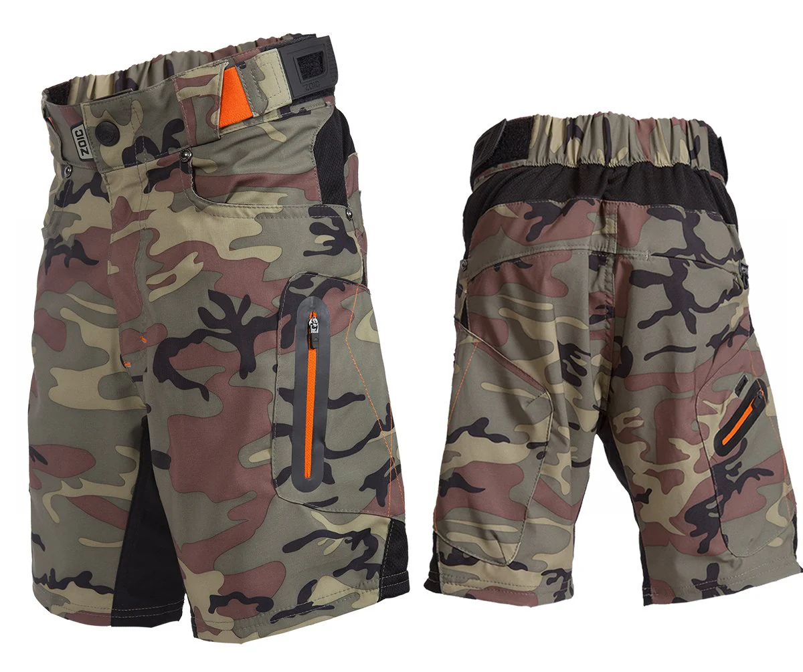
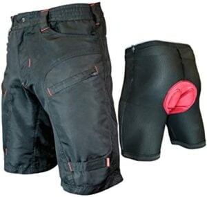
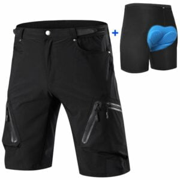

Before you hit the trails with your buddies, it is imperative to have mountain biking specific attire for you to stay comfortable and protected.

Failure to dress accordingly means that you will not enjoy the sport. For this reason, Furious Bikes will help you choose the best padded mtb shorts you can buy in 2022 and enjoy the sport.

With the high number of padded MTB shorts in the market, many mountain biking enthusiasts find it difficult to choose the best pair to complement their style of riding. I thought it would be great to take you through how you should choose the best mountain bike shorts. Hope you will find my reviews and buying guide helpful.

\[content-egg module=Amazon template=custom/simple\_list\]

### [Zoic Ether Shorts](https://www.amazon.com/ZOIC-1134EC14-GYCM-XL-Mens-Ether-Shorts/dp/B00ILAOJ7Q/?tag=furiousbikes-20)

  
If you've been to mountain biking for long, you definitely recognize the [Zoic Ether Shorts](https://www.amazon.com/ZOIC-1134EC14-GYCM-XL-Mens-Ether-Shorts/dp/B00ILAOJ7Q/?tag=furiousbikes-20) as one of the superior mtb shorts.

The Zoic Ether shorts managed to scope the winner of the best baggy mountain bike shorts in 2020 after scoring well in all our tests. Moreover, it retails for half the price of other shorts that we have reviewed.

We also noted that the [recent models of the Zoic Ether shorts](https://www.amazon.com/ZOIC-1134EC14-GYCM-XL-Mens-Ether-Shorts/dp/B00ILAOJ7Q/?tag=furiousbikes-20) have seen impressive improvements. For starters, the new version comes with a revamped waist adjustment, as well as high-quality zippers.

And, despite the new improvements, the manufacturers have kept the price to be competitively low.

The other great feature about the Zoic shorts is that they have loads of pocket storage space. If you fancy owning an MTB short with several pockets, the Zoic Ether shorts are for you!

They have six pockets that ideal for keeping items that you need to access regularly. Amazingly, The right leg has a zippered pocket that comes with a headphone port meaning you can listen to music from your phone as you ride. Other than riding, you can wear this short during other outdoor activities.

The Zoic Ether shorts are awesome in terms of pedal and fit friendliness. They have enough room that allows you to have an improved pedaling performance. Zoic is among the most comfortable mountain bike shorts you will come across.

In terms of protection, the Ether shorts did not score so well. This is because they are made from a lightweight material. If you are looking for an MTB short that will offer enough protection then you should go for the [Troy Lee Ruckus](https://amzn.to/2LNLQPR).

[Check Price on Amazon](https://www.amazon.com/ZOIC-1134EC14-GYCM-XL-Mens-Ether-Shorts/dp/B00ILAOJ7Q/?tag=furiousbikes-20)        

\[su\_divider top="no"\]

### [Fox Racing Solid Shorts](https://www.amazon.com/Fox-Racing-Ranger-Cargo-Shorts/dp/B019R008GE/?tag=furiousbikes-20)

  
Fox Racing Ranger Shorts have one of the best looking MTB shorts design. Its fit and performance are simply impeccable. The Fox Racing Shorts features an updated chamois and construction which makes it ideal for off-road adventure.

Although there are numerous companies in the cycling clothing industry, Fox Racing still remains to be one of the most resilient companies. Its products are a testament of this and the Fox Racing Ranger Shorts is a good example. The Ranger Shorts have become a favorite for many professional riders due to its signature colors.

Features

- Durable Mid-weight 2-way stretch fabric that is comfortable and abrasion-resistant

- Trail Fit that ensures that your waistband remains in place even when climbing.

- Adjustable Waistband

- Four Pockets- Right cargo pocket is zippered while the left cargo pocket is Velcro flapped

Pros

- Decent Chamois Liner

- Good cut and Fit

- Great waist adjusters

Cons

- Could use more ventilation

[Check Price on Amazon](https://www.amazon.com/Fox-Racing-Ranger-Cargo-Shorts/dp/B019R008GE/?tag=furiousbikes-20)       

\[su\_divider top="no"\]

### Przewalski Men’s MTB Shorts

  
The Przewalski MTB Shorts features a 6.5 inch inseam internal spandex underliner that you can either snap in or wear independently. Its inner shorts are fast drying and come with a high performance pad combined with soft silicone leg grippers that are added to improve comfort during long rides.

The shorts also have a 4-piece premium crotch pad that is designed using durable multi-density foam. The multi-density foam is not only ideal for comfort but also anti-shock. Other notable features include the open cell structure that allows for easy transportation of water thus keeping fresh and dry.

With its four-way stretch fabric, the Przewalski MTB Shorts can draw excess heat and sweat from your skin thus keeping you dry and comfortable. The inclusion of an essential pocket makes it easy to carry your stuff and the zipper ensures that they are secure.

Features

- Elastic back waist

- Secure zippered pocket on right leg

- Soft silicone leg grippers

- Premium crotch pad

- 4-way stretch fabric

Pros

- Reflective logo for high visibility

- Convenient pocket on the right leg

- Comes with belt loops that allow users to wear their own belts

- Comfortable and lightweight padding

Cons 

- Only one zippered pocket

[Check Price at Amazon](https://www.amazon.com/dp/B0711J23Q9/ref=as_li_ss_tl?th=1&linkCode=ll1&tag=furiousbikes-20&linkId=30b3a8d51f5fea3bd9e4da94c1276b1b)

### Endura Hummvee Baggy Shorts

  
Although the Endura Hummvee Baggy Shorts are a little bit expensive they are worth the price. Unlike most cycling clothing companies, Endura tries to focus more on practicality, comfort and not to forget ruggedness. You will get experience all these features with these of pair of shorts.

Like most mtb shorts, Endura Hummvee has plenty of pockets to help carry your stuff. The pockets have zips and Velcro, which should come in handy during your mtb rides. The Endurra Shorts has the perfect combination of design and durability as they are designed with mountain bikers and cycle couriers in mind.

Features

- Zipped mobile phone pocket, two front zipped pockets, cargo pocket and 2-rear tabbed map pockets

- Side zipped ventilation

- Nylon fabric with durable water repellency

- Seamless inner leg panel

- Mesh Clickfast Liner

- Double and triple stitched panels

- Adjustable belt

Pros

- Quality Construction

- Eight Convenience

- Heavy Fabric, which is ideal for cold weather

Cons

- The pockets could use a heavier gauge of zipper

### Ynport MTB Shorts

  
The Ynport MTB shorts features 100% nylon making them lightweight, breathable and dry easily. They come with an adjustable waistband that blends in well with the short’s design.

Other than being lightweight and breathable, the nylon material is also comfortable due to its increased elasticity. Its waistband adopts an ergonomic design that makes it easy for you to adjust the size to your preferred fitting.

The zippered pockets make it easy for you to carry your essentials when mountain biking. At the back of your pants you will find a lid pocket that is ideal for carrying valuables. The Ynport shorts are arguably one of the best mtb shorts as they are not only ideal for mountain bike rides but also hot weather offroad rides.

Features

- Zippered and lid pockets

- Neatly flat suture

- Ergonomic design

- 100% nylon

- Highly elastic fabric

- Reflective brand logo

Pros

- Anti-drop and anti-theft pockets

- Reflective logo ensures that night rides are seamless

- Highly breathable and lightweight

Cons

- No padded inserts

- Order a size up if you have thick legs

### TOMSHOO Mountain Bike Shorts

   
  
The TOMSHOO Shorts are the best mtb shorts for riders who prefer carrying around several objects and devices as they embark on their trail rides. It has five pockets; 3 of which are zippered while the remaining two are hand pockets.

The shorts have a loose-fit design, which includes an elastic waistband that should make the shorts a comfortable fit. The 100% polyester fabric is a much needed feature due to its superior breathability and moisture wicking properties.

Features

- 100% polyester fabric

- 3 zippered pockets and 2 hand pockets

- Elastic waistband

- Pockets mesh panels

- Super lightweight

Pros

- 3 secure pockets

- Integrated ventilated mesh panels

- Fast drying

Cons

- Not long enough to provide sufficient coverage when seated

\[su\_divider top="no"\]

### [Single Tracker Mountain Bike Shorts](https://amzn.to/2WHNfzh)

  
Are you looking for an MTB short that has the perfect balance of functionality and professionalism but still manages to look casual? Then the Single Tracker MTB Shorts is exactly what you need. The Single Tracker Mountain Bike Shorts have deep secure pockets that only help to keep your essentials safe but also keep them dry especially from elements such as perspiration.

Both the inner and under panels have double stitches to help improve durability and strength. The double stitch design is incorporated in such a way that it does compromise the internal flat seams that are designed to prevent chaffing.

The most notable feature is the G-Tex undershorts that’s padded unparalleled comfort. You also get to enjoy riding in the rain as the Single Tracker MTB Shorts have a water resistant Cordura.

Features

- Anti-bacterial padding

- Double stitched inner and under panels

- Water resistant Cordura

- Secure Zipped Pockets

Pros

- Secure and easily accessible pockets

- Water resistance

- Seamless under panel helps reduce friction

Cons

- The sizing could be better

\[su\_divider top="no"\]

###  [Ally Men’s MTB shorts](https://amzn.to/3bpWo3r)

The Ally shorts is an ideal garment for people who love mountain biking. These shorts are designed to fit you perfectly during trail rides and normal cycling. Incredibly, these shorts are made from a protean water repellent material.

This material will offer great protection during cold weather and downpour. Besides, the zips are waterproof too meaning that your belongings will remain dry no matter the circumstance. These shorts incorporate taped seams throughout.

We found these shorts to be so comfortable due to the elastic waistband; it will definitely hold your shorts in place.  The loose fitting design, fastener tape and mesh lining are all features that ensure you’re always comfortable.

For those who love carrying phones and other items when cycling, you’ll love the heaps of pockets present in this shorts. The pockets have large storage space that you could utilize to carry your Samsung or iPhone.

In terms of permeability, these shorts are highly permeable to allow sweat to escape away and keep your skin throughout as you ride.

#### What we like

- Has waterproof material that keeps you dry even in cold weather

- It has deep pockets

- Great zippers

#### What we didn’t like

- The shorts do not have padding

[Check Price & reviews on Amazon](https://amzn.to/3bpWo3r)

\[su\_divider top="no"\]

### [Bpbtti Mountain Bike Shorts](https://amzn.to/2QJdfWV)

  
The Bpbtti MTB Shorts features a removable liner that has an improved design which includes increased thickness on the saddle and side areas. Its padded lining has antibacterial properties; wicking finish and a dimpled structure that helps improve comfort especially at the pressure points. The padded liner is about 9 inches while the outside shell is about 12 inches.

The Bpbtti shorts have 2 side pockets that are deep and well designed for easy and secure access. There is also a rear zip pocket that is ideal for holding keys, cards and cash. With the Bpbtti shorts you also get an adjustable waist with Velcro closure which allows for a custom fit.

Features

- Removable gel padded inner

- Two side pockets and a rear zippered pocket

- Adjustable waist

- Mesh vents on front thighs

Pros

- Mesh vents allow for optimal breathability

- Lightweight

- Removable padding

- Ideal for hot weather

Cons

- The side pockets could use zippers

- The rear zippered pocket may not be ideal for holding hard or bulky things

### Men’s ATD Cargo MTB shorts

The Men’s ATD cargo shorts by Aero Tech Designs are meant to serve mountain bikers in a good way.  If you are not a fan of road shorts, you can opt for these awesome mens padded mountain bike shorts.

I love its style because it allows free movement when cycling.  Amazingly, these shorts are loose fitting to allow air circulation, as well as, enhancing comfort. What I love these shorts is that they are two in one; by this I mean it has an inner liner short.

The inner liner has cellular urethane that acts as a shock absorber. With these MTB shorts, you do not have to worry about sweat; its material is breathable and allows perspiration to move away from your body.

Also, the inner liner short is fitted with Black pearl crotch pad that acts as cushion between the saddle and your pelvic area. The inner shorts are made of Nylon and Lycra to ensure that you remain comfortable.

The outside of the shorts is made from Tason Nylon Shell, which gives it a rugged feel. These shorts are available in the following colors

- Navy Blue

- Charcoal

- Black

#### What We Like

- It has two side pockets

- Quality padding

- Loose fitting

#### What we didn’t like

- The Sizing is a bit off (make sure you buy the next size up)

[Check Price & Reviews on Amazon](http://amzn.to/2uLmueA)

## How to Choose the best mountain bike shorts

In this section, we are going to focus on some key factors that you should look for when making a purchase decision. They will help you land the perfect mountain biking shorts you’ve been longing for.

### Material

If you want to enjoy high comfort levels when mountain biking, then you must choose a short that has good material. Remember that the type of material will also depend on the season.

If you are planning to use your mountain bike shorts for time trailing or racing, you’ll need an Aero short that is designed to have aerodynamic features in the material. Shorts with this material will help you save energy when riding.

For hot weather conditions, you’ll need to wear shorts whose material is breathable and comfortable. In addition, you should ensure that the material has the ability to wick away sweat.

Make sure that the material is designed to withstand harsh conditions. Besides, it should have water repelling properties that ensures you stay comfortable at all times.

### Padding

To have an enjoyable and comfortable ride, you ought to purchase padded mountain bike shorts. Even though most of shorts will have a liner, it is important to check if they are well padded. Some might have a single layer of padding while others are thickly padded.

The padding layer is popularly known as the chamois. The main reason is because chamois goat leather was a main raw material when making shorts liners.

The Chamois pad is a very important feature of MTB shorts because it acts as a cushion between the saddle and your body. With a good chamois pad, it will be easy to spend a lot of time cycling without experiencing pressure sores.

Always pick a short whose seat pad has seamless stitching, enough cushion and few seams as possible. In case you feel the pad is not enough, you can always use [chamois cream](http://www.cyclingweekly.com/fitness/training/chamois-cream-explained-139014) to regulate the friction.

### Features

When choosing a good pair of mountain bike shorts, you need to consider the variety of features it has to offer. Make sure that each feature will add value during your ride; otherwise, it is good to keep it simple.

One of the key features is deep pockets to help you carry a few items during your ride. You will find that most of the MTB shorts have pockets, but you will find that you do not need them if you have a good [hydration pack](http://mtbnz.com/best-hydration-packs-for-mountain-biking/). During our test rides, we found the Zoic Ether Shorts to have the highest number of pockets which was six. Other shorts have two or four pockets to be precise.

The other impressive feature you need to consider is whether the shorts have an adjustable waist mechanism. An adjustable waist will allow you to snug up the waist for a comfortable fit. My two favorite designs are the Velcro band and the hook and loop design.

The other important feature worth consideration is protection against UV rays. As a cyclist, you have to protect your skin from harmful rays especially when riding for long hours. Choosing a garment that features UV protection will go a long way in keeping your skin safe.

### Durability

Before you buy a mountain biking short, you need to determine whether it will last you for at least a season of serious riding. If the shorts are not designed to last you for long, then do not waste you money on them.

Make sure that the shorts can be machine washed without losing their color. I found out that shorts with thick and abrasion resistant material tend to hold up well in terms of durability.

### Colors

Although color is not an important feature when choosing a mountain bike short, it is important to pick the one that suits you. Shorts are available in different colors; however, it is always good to go for a black one. This is because it does not show dirt even after wiping oily hands on them.

Light colored shorts tend to be a bit expensive but they are not the best choice. They tend to reveal your body when they get wet. Always stick to the black color, it never disappoints!

### Style of Riding

Your style of cycling plays a key role in the kind of bibs or shorts to purchase. If you are looking for shorts that will provide maximum protection during rail trails and Cross-country Mountain biking, choose those with a comfortable fit and gel chamois.

Pro cyclists can choose from some of our handpicked MTB shorts since they all feature a fit that keeps you comfortable at all times. They will prevent you from hot spots and sores all day.

### Size & Fit

Before you add your shorts to your shopping cart, always check that the size is correct. You must ensure that the item does not feel baggy or too tight.  Do not forget to check the length of the inseam too. Experts recommend that the best inseams range from 8” to 9.5”. Comfort is always an essential factor; choose a pair of shorts that does not have irritating stitching. The fact that a short feels good does not imply that it will hold up on the saddle.

## Why Do You Need Mountain Padded MTB Bike Shorts?

They have a unique style that favors trail and MTB riders. These shorts have additions that make them useful for MTB riders. For starters, they feature lightweight nylon fabric that is meant to protect you against branches and the rough experience with ground.

Lycra shorts are so thin that they can’t offer this kind of protection. Incredibly, MTB shorts come with multiple pockets that will help you keep your keys or any other important item. In addition, these shorts also feature efficient cooling events to keep air circulation at maximum levels.

Most of the MTB baggy shorts are fitted with a chamois that acts as a cushion between your underside and the saddle. You’ll find that some of these shorts have a removable liner to make cleaning easier.

Even though most mountain biking shorts will come with zip-secured pockets, it is not good to carry sharp or heavy objects. Also, do not stuff your pockets to the brim if you want a smooth and comfortable ride.

It is always good to pick a mountain bike short that has adjustable and comfortable waist. This way, you will not have any problems adjusting the shorts with gloved hands.  

Most people prefer shopping for ¾ length shorts since they offer extra warmth and knee protection. Be sure to check the fit, otherwise, you might end up buying oversized shorts.

## Conclusion

Bike lovers will agree with me that cycling can never be enjoyable without ensuring that your body stays protected at all times. It is for this reason that you should invest in the best mountain bike shorts since they are designed to enhance your cycling experience. If you follow our buying guide and top ten reviews, you’ll definitely land yourself what you’ve been looking for. Make sure that this article will help you make an informed decision.
