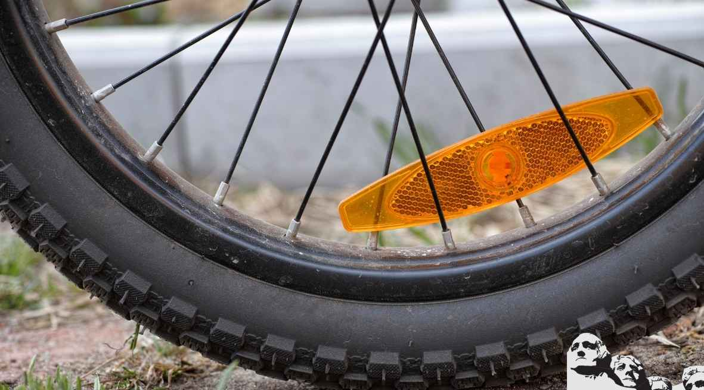
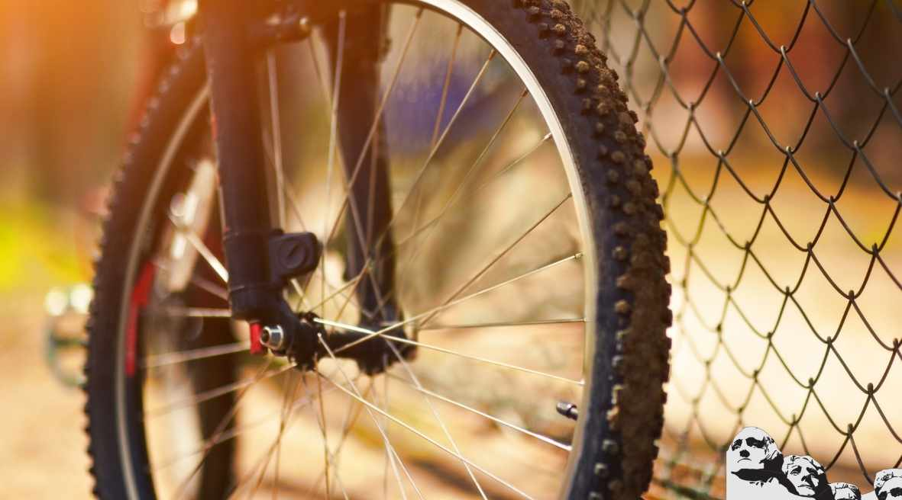
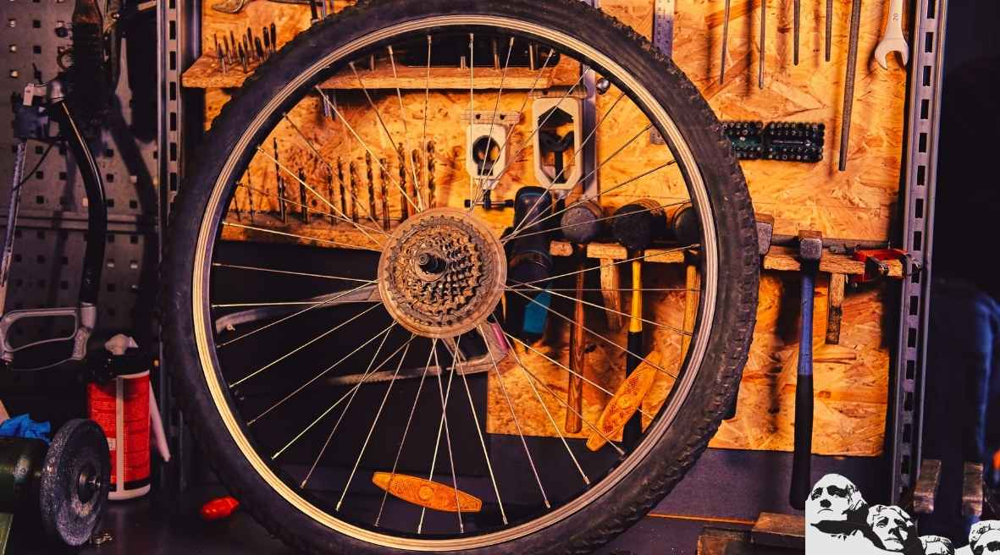
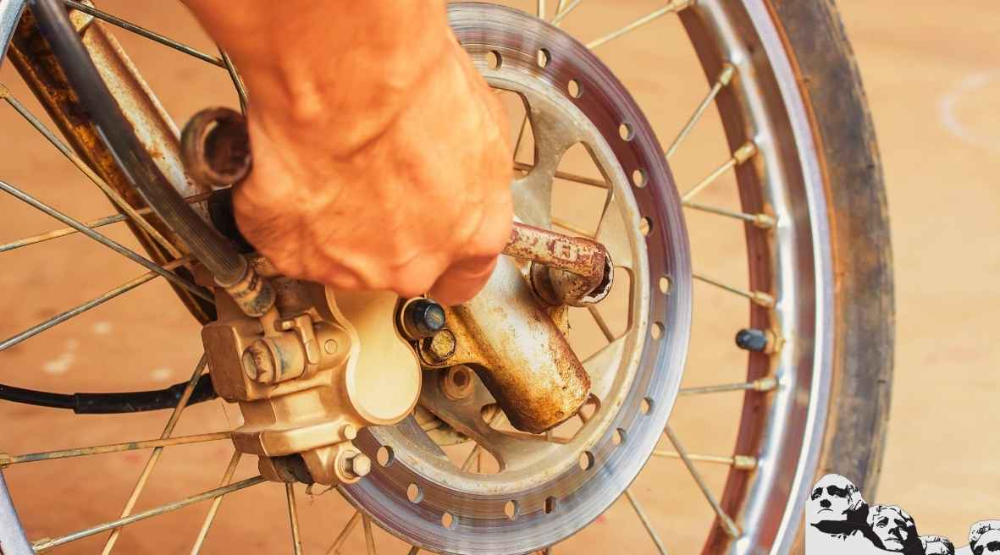

Are you tired of your old worn-out wheels? Did you know that upgrading or replacing the wheels can make a massive difference in terms of performance and ride quality ? It's right. That is why we are here, to help you find the best budget MTB wheelset

There is no perfect budget MTB wheel. There won't likely ever be a single perfect MTB wheel because of the varied terrain and the rider's limited power. Humans, even the absolute best, are not very powerful motors, so this ends up being the cause of our ongoing search for faster wheels.

Here is a basic term:

> "more rim surface gives back less aerodynamic drag (good), but more rim surface area adds weight and hurts acceleration (bad)."

Rim surface area is anything past half the distance to the outer edge from the hub. The 3 or 4 spoke wheels are just another manufacturing style, but they still add rim surface area.

We have found consistently that on flat to rolling hills (300 ft. climbs) that wheel weight is not real critical in time trials and triathlons. The aerodynamics will make more difference in your time than the small added weight can hurt.

The point here is that if 2 wheels weigh about the same, then go with the wheel with more surface area. Also, remember that most manufacturers lie about their wheel weights, and no two people agree on the results from wind tunnel tests.

The results are always the same, but the manufacturers don't usually like them!

What I have started doing is giving an average drag. This is a number based on the findings at 0 - 2.5 - 5.0 - 7.5 - 10.0 - 12.5 - 15.0 degrees of yaw. This covers 95% of any wind condition that you will ever experience on a bike.

Some wheels may be a little bit better at one specific angle, but rides always go around turns on over varied terrain experiencing many different average crosswinds. I think that this will be much more how it is in the "real world".

## Top 7 MTB Wheelsets for the Money

\[content-egg-block template=custom/all\_offers\_list\]

### 1\. [Vuelta Zerolite 26 inch Mountain Bike Wheelset](https://www.amazon.com/Vuelta-ZeroLite-MTB-Pro-Wheelset/dp/B01MSB6PO7?tag=furiousbikes-20)

Not only do these pair of wheels have an impeccable rating but the pricing is also mindboggling. The Vuelta Zerolite display performance and functionality is close to that of [Mavic wheels](https://www.amazon.com/Mavic-Aksium-Road-Wheel-Front/dp/B019CO0VOY?tag=furiousbikes-20). The deal does not get any better than that.

The Vuelta Zerolite are some of the most versatile 26-inch mountain bike wheelsets as they are ideal for both trails and pavements. With such versatility, you are sure to conquer both mountain bike trails and road bike trails since the wheels do not confine you to specific surfaces. Besides, the wheel size makes it easy for you to control your moves and maneuvers even in tight places.

Other than having the smallest wheel size, the 26-inch mountain bike wheelset has CNC-machined sidewalls that allow for improved stopping power. For optimum stopping power, you can incorporate the use of disc brakes which when combined with the 3-cross lacing and 24 spokes (front and rear) you get an extremely strong pair of wheels.

Being small makes for a rather lightweight frame, which means that you are not in a position to maintain control of your bike but you will also enjoy a smooth ride. When it comes to design, the Vuelta Zerolite are compatible with top quality tires and are offered in two distinctive colors black and white.

**Features**

- 26” Mountain Bike Wheels
- 0mm plain gauge spokes
- 26mm medium-V rim
- 8/9/10 cassette compatibility (7-speed with spacer)

\[su\_divider top="no" divider\_color="#021515" size="1" margin="10"\]

### 2\. [Sun Ringle Rhyno Lite](https://www.amazon.com/SUN-RIMS-RIM-RYNO-LITE/dp/B005LY4XU8?tag=furiousbikes-20) (best budget 29er wheelset)

Are you looking for an affordable 29er mountain bike wheelset that is compatible with both rim and disc brakes? Look no more for the [Sun Ringle Rhyno Lite](https://www.amazon.com/SUN-RIMS-RIM-RYNO-LITE/dp/B005LY4XU8?tag=furiousbikes-20) is just the perfect wheelset for you.

The Sun Ringle Mountain bike wheelset is one of the best 29er wheelset for the money as they are not affordable but they can also withstand rigorous use even from the worst abusers.

The versatility of the Sun Ringle Rhyno Lite is unrivaled as they are compatible with most 29 inch bikes and the brake system doesn’t prove to be much of an obstacle. They certainly can’t claim the price of the lightest wheels but their durability is unmatched. They will probably outlast your frame.

The Sun Ringle Rhyno Lite Wheels feature a lightweight aluminum body combined with steel axles to deliver impeccable strength and resilience. The addition of Borazon polished ball races allows for high sleek rolling performance and high precision durability no matter the terrain you choose to conquer.

For easy maintenance of the ball bearings, Shimano has included double contact sealing that shuts out water, mud, dirt, and dust from coming into contact with the bearings thus increasing their durability.

**Features**

- Advanced Brake Track for controlled stopping power
- Stainless steel spokes
- Nickel brass plates eyelets
- 8/9-speed compatible
- 6000 series aluminum construction
- Lightweight aluminum skewer

\[su\_divider top="no" divider\_color="#021515" size="1" margin="10"\]

### 3\. [WTB STP i25 29” MTB Wheelset](https://www.amazon.com/Tubeless-Mountain-Bicycle-Novatec-Wheelset/dp/B07G8Y74YK?tag=furiousbikes-20)

\[su\_button url="https://www.amazon.com/Tubeless-Mountain-Bicycle-Novatec-Wheelset/dp/B07G8Y74YK?tag=furiousbikes-20" target="blank" style="noise" background="#f7962e" size="6" center="yes" radius="round" icon="icon: arrow-right" rel="nofollow"\]CHECK PRICE\[/su\_button\]

If you are a big fan of handcrafted items then the WTB STP i25 Wheelset may be just the right pick for you. The mountain bike wheelset 29 is hand-built although not fully since the spokes are extended fully by use of a pushing machine. This means that the spokes cannot extend further even a few rigorous rides.

The WTB STP mountain bike wheels are ideal for cross country and mountain trails. The rim is made of alloy which makes it a little bit heavy as its weight stands at 9.77lbs.

**Features**

- 29” x 2.2
- Disc brake compatibility is 6 bolts disc
- The rim size is 25-559
- Rear hub D482TSBT
- Shimano 8,9,10 and 11 speed compatible
- Internal rim width is 25mm
- Kenda 1.9/2.3 FV48 (Inner Tube)
- Front Hub D481SBT

\[su\_divider top="no" divider\_color="#021515" size="1" margin="30"\]

### 4\. [Mavic Rim 29er Mountain Bike Wheels](https://www.amazon.com/Mavic-29er-Wheels-Shimano-Continental/dp/B01HDTR27Y?tag=furiousbikes-20)

\[su\_button url="https://www.amazon.com/Mavic-29er-Wheels-Shimano-Continental/dp/B01HDTR27Y?tag=furiousbikes-20" target="blank" style="noise" background="#f7962e" size="10" center="yes" radius="round" icon="icon: arrow-right" rel="nofollow"\]CHECK PRICE\[/su\_button\]

Although Mavic wheels are not cheap they certainly have a lot to offer. The Mavic Rim 29er MTB wheels have been designed to offer a smooth but aggressive ride.

The inclusion of a responsive rim design allows the wheels to adapt to different surfaces. This design also allows the wheels to take a beating even after taking a ride through rough terrains. They are tough, strong and durable. They will hold up well on sand, roots, hard pack and rocky terrain.

The Mavic 29er Wheels are compatible with almost all 29er Mountain bikes. They are equipped with smooth running but durable Shimano hubs. To make the deal even better, you get a free pair of Race King 180TPI 29 x 2.2inch tires. These are top rated tires and a pair goes for close to $80.

**Features**

- Aluminum Alloy Hub with smooth ball bearings
- 6061 T6 Aluminum black finish
- 29er Presta Valve tubes
- Front & rear quick release skewers
- 135nn rear and 100mm front axle spacing
- 7,8,9 and 10 speed cassettes (7-speed with spacer)
- Spokes count is 32 for the rear and 32 for the front wheel
- Double wall clincher
- 6061 T6 Aluminum Rim Material
- Disc brake is 6 bolt compatible

\[su\_divider top="no" divider\_color="#021515" size="1" margin="30"\]

### 5\. [Sta- Tru STW 26” Mountain Bike Wheel](https://www.amazon.com/Sta-Tru-Silver-Mountain-Wheel/dp/B00CUGK5WA?tag-furiousbikes-20)

\[su\_button url="https://www.amazon.com/Sta-Tru-Silver-Mountain-Wheel/dp/B00CUGK5WA?tag-furiousbikes-20" target="blank" style="stroked" background="#f7962e" size="10" center="yes" radius="round" icon="icon: arrow-right" rel="nofollow"\]CHECK PRICE\[/su\_button\]

The Sta-Tru MTB wheel features a sleek design with durability like no other. It’s made from materials that have undergone rigorous testing to ensure that the wheel can withstand heavy use and rough terrain. This means that even after several months of rough terrain, your mountain bike wheels will look as good as new.

The use of silver as the main color makes it easy for you to match the wheels with any coloration. In addition to that, the alloy rims have 36 holes which are designed to not only increase durability but also increase strength. The wheel is also lightweight and stands at 26” with a thickness of 1.5”.

To ensure that the enviable sleekness lasts for longer, the UCP spokes are designed to be corrosion resistant. The wheel also has a 26.5mm silver rim, silver spokes and a sliver hub. The 26.5mm alloy rim is ideal for Casual Mountain biking; however, it may not be the ideal mtb wheel for advanced mountain terrains.

**Features**

- Quick release axle
- 36 hole hub
- 297mm cup spoke
- Bolt on axle system

\[su\_divider top="no" divider\_color="#021515" size="1" margin="30"\]

### 6\. [Shimano MT15 29er Wheelset](https://www.amazon.com/SHIMANO-Mountain-Wheels-Compatible-Continental/dp/B072JZZKTS?tag=furiousbikes-20)

\[su\_button url="https://www.amazon.com/SHIMANO-Mountain-Wheels-Compatible-Continental/dp/B072JZZKTS?tag=furiousbikes-20" target="blank" style="stroked" background="#f7962e" size="10" center="yes" radius="round" icon="icon: arrow-right" rel="nofollow"\]CHECK PRICE\[/su\_button\]

Since Shimano is a renowned brand we decided to check out one of their top rated mountain bike wheels. Among the top was the Shimano MT15 29er Mountain Bike Wheels whose features are similar to that of the Mavic 29er Mountain Bike Wheels.

The Shimano wheels are designed to be comfortable and rigid such a way that you can accelerate and also turn corners without much fuss. The wheels have a double wall clincher and a 6061 T6 Aluminum rim material.

Unlike some of the low range mountain bike wheels, the hub bearings of Shimano Wheels are corrosion resistant which not only increases durability but also reduces services intervals.

Just like with the Mavic 29er Mountain bike wheels, you will also get a pair of Continental Race King Tires (29 x 2.2 inch). Other than the free tires, you will also get the Pure Grip compound and pre-installed 29er Presta Valve tubes.

**Features**

- Standard front & rear Shimano quick release skewers
- Stainless flat blade spokes
- 28 rear and front spokes
- Shimano 7,8,9,10 & 11-speed cassettes (7-speed with spacer)
- Smooth ball bearings
- 2 Cross Nipple Lacing
- Compatible with disc brake centerlock
- 135mm rear spacing and 100mm front spacing

\[su\_divider top="no" divider\_color="#021515" size="1" margin="30"\]

## Factors to Consider When Shopping for Budget MTB Wheelsets

A mountain bike has different components and each of these components play a key role in determining how your ride will be, but perhaps one of the most important components is the mountain bike wheels.

The ideal mountain bike wheelset will be determined by a number of factors not just one.

You have to understand how each element contributes to making the wheelset perfect as it is the only you will get to purchase the best mountain bike wheelset for the money.

The choice of the best mountain bike wheels will only become harder due to the numerous brands that are in the market with each claiming to be better than the other. These factors will help you make a better choice:

### **Wheel Size**

Perhaps the most important feature; wheel size will determine the actual size that will fit your mountain bike. Nowadays, there are 3 prominent wheel sizes 26”, 27.5” and 29”. A keen look at your tires will reveal the wheel size that the replacement should be.

**26” Wheelset**

Over the years mountain biking has experienced several changes to the wheel size, however, the original 26” wheels still rock even today. They are a favorite choice for many mountain bikers due to their strength and rigidity which can be attributed to the shorter spokes. 26 inch mountain bike wheelset include a couple of options such as full wet spikes, superlight XC semi-slicks and DH models. Spares for these wheels are still in plenty.

**27.5” Wheelset**

Lying somewhere in the middle, the 27.5” wheelset combines an array of attributes borrowed from the 29” wheel and the 26” wheel. If your frame can accommodate more than just 27.5” wheels, you can try out the fatter 27.5”/650b wheel size. The 27.5”/650b wheel not only delivers a wider tire but also increases the outer diameter to match that of a standard 29er tire, which is ideal for riding for rough single tracks.

**29” Wheelset**

Often known as 29ers, 29” wheels have the same diameter as the good old 700c road wheels. They exhibit unparalleled climbing characteristics, which makes them the preferred option for riders looking to indulge in a cross country experience. The larger wheel diameter comes at an added advantage as it is less likely to be affected by dips and bumps in mountain bike trails.

Other than the 29er wheels there is also another size, which is the 29+ size. However, not all 29er bikes have the space to accommodate the leviathan wheels. If your bike can accommodate the 29+ wheel size then be ready to enjoy an experience close to that of a fatbike.

### 26er vs 29er

Everywhere you turn, a new bread of 29er bikes are taking over the 26 inch bikes. It even looks like the whole industry is giving up the old 26er and moving to something newer and better.

But are the 29er as good as they are being presented or is this just another marketing twist. I will tell you everything you need to know about the 29ers and you can decide if this is the right choice for you.

Let’s begin by defining what is the 26er and the 29er. The regular (most common) wheel size for adult’s mountain bike used to be 26 inch wheel (26er).

A few years ago a 29 inch wheel was introduced to the mountain biking world (29er). The advantages looked obvious, larger wheel can go over the obstacles easier than smaller wheel. The trail contact area is larger therefore the traction is better and while in motion, the larger wheel will keep better momentum.

So the bike’s frame manufacturers began designing frames to accommodate the larger 29″ wheels.  That wasn’t an easy task. Larger wheels required significant changes: new forks, new rear triangles, different shocks and other geometric adaptations.

But if there’s a will there’s a way, however; some of them, especially small and medium size frames, look like a small car with monster track wheels.  The big wheel has disadvantages too; the wheels are heavier, they limit the frame travel, and they are more prone to flexing. So how do they compare in riding?

Last weekend I rode the Specialized Stumpjumper FSR 26″ and Specialized Stumpjumper 29″. My observations were as following: the moment I sat on the 29er and gave it my first pedal push I immediately noticed that it is much more sluggish to accelerate in comparison to the 26er that I am used to. However, after picking up some speed, it was very pleasant to ride. It was very stable, and forgiving, very smooth but in the same time very bland.  The main differences can be described between riding a 26er and 29er is like driving an agile sports car and driving SUV.  Yes, it is more stable, yes it will go over the rocks easier but it will not maneuver or accelerate fast.

So, who is the 29er for and who is not? If you are a beginner, go for the 29er it is a more forgiving and stable bike. It will probably take you more time to gain skills on the 26er. However, if you are an experienced technical rider who wants to have nothing but pure fun, don’t even thing about it. Stay with your 26 inch bike or upgrade to something thrilling such as the Yeti ASR5-C, and make sure to wipe that smile off your face before you come home to your wife or girlfriend.

But if you still can’t make up your mind, you should wait because the US manufactures came out with something even more confusing, (an old French standard) – 650B, now also called 27.5. So be ready for the new marketing pitch; 26 is too small, 29 was actually too big – so the 27.5 is just the right size for you. Get you wallet ready.

## **Carbon vs. Alloy Rims**

Carbon rims are a common feature on high end wheelsets while the aluminum alloy rims are commonly found on budget wheelsets.

Carbon rims tend to be stiffer and lighter compared to alloy rims. The stiffer the rims the better. If you have ever ridden carbon wheels you will agree with me that the ride feels supple, smooth and the precision is simply impeccable.

Although carbon rims to have the upper hand in this case, alloy rims have a better pricing at a near perfect performance. Sporting alloy rims will simply mean that you are sacrificing on features such as ultimate stiffness and lightness but other than that your ride should be just fine.

## **Axle Standards**

The last several years has seen axles transition from the quick-release axles to the more secure thru-axles.

A few years ago, the most common axles were 100x15mm for the front axle and 142x12mm for the rear thru-axle. However, the desire to improve wheel stiffness has prompted manufacturers to lean towards the wider axle spacing which entails a 1100x15mm for the front axle and 148x12mm for the rear thru-axle.

Most high end mountain bikes will have the boost axle spacing however if you are not a fan you will find just the right axle standard for you.

## **Tubes or Tubeless**

The debate on whether tubeless systems are better than tube systems is not over and the end does not seem to be near. In such a case it all boils down to your personal preference.

However, you can also look at the upsides and downsides of each before making a decision. For example, tubeless system have proven to be lighter and come with the added benefit of self-sealing especially the tiny punctures. The downside is that they are a little bit expensive and messy when dealing with a flat. On the other hand, inner tubes tend to be easy to replace and affordable. The downside is that they are prone to punctures.

All in all tubeless wheels seem to have an upper hand over inner tubes as they allow for an [enhanced grip](https://mtbnz.com/best-mountain-bike-grips/) and a drastic reduction in punctures. If you are a serious mountain biker, you could really use tubeless wheels.

## **Rim Width**

The last few years has seen a drastic increase in rim width for both mountain and road bikes. The internal width is perhaps the most critical dimension as it will go a long way in determining the shape of the tires.

A narrow rim decreases the tire volume thus giving it a rounder profile while a wider rim increases the tire volume thus giving the tire a flatter and squared-off profile.

Wider rims are said to increase tire stability thus making your mountain bike feel more predictable even through corners. However, it is advisable to pair your bike with specific rim widths as large variations in rim width can result in unwanted situations such as less grip through turns.

## **Pre-Built Wheels or Self Spec?**

The classic wheel upgrade used to involve ordering all the parts of your preferred wheel separately after which they were delivered to your home and crafted specifically for you. The method always did the trick but nowadays prebuilt wheels seem to be better as they as they are perfectly built with all the components designed to work perfectly.

**Budget**

As always, your budget is one of the key determinates of the type of wheelset you get. Some companies will even go the extra mile and offer replacement or repair policies at no cost. However, for you to get such after sale services you might want to spend a little bit more than you are used to.

### Choosing Mountain Bike Tires for Particular Terrain or Tracks

Which mountain bike tires are the best depends on the type of track you are going to ride. So a tire made for a muddy track will not be suitable for such a terrain that has too much grass or loose stones or any other obstacles. Every tire that is made is designed for particular conditions and it is after pondering upon those condition you can choose the tire with suitable weight, durability and rolling resistance.

#### **Smooth Hard pack and Racing:**

If the track that you have chosen to ride is smooth hard pack, then the suitable tire will be that which is narrow (1.9 – 2.2) and has very low rolling resistance. Other than this if you are planning for cycle race then again the tires with low rolling resistance are the best choice. A type of tire which has slow rolling resistance has closely spaced knobbies. An example of such tire is Kenda Small Block 8.

#### **Loose and technical conditions:**

If you’re riding a trail that has loose rocks, grass and loose climb then the most suitable tires would be the one, having more aggressive tread patterns. The tires that are made for these types of conditions come with specifications i.e. front specific tread and rear specific tread. The front patterns are concerned with the stability and the rear ones are specifically designed for braking traction and acceleration. The width of such type of tires is usually within the range 2.1 – 2.4. Panaracer Fire XC and Schwalbe Nobby Nic are examples of such tires.

#### **Muddy Conditions:**

Riding in the Muddy conditions is not good for your bike but if you have to do it then it would be suitable that you make use of the narrower tires. The use of the narrow tires will avoid clogging up your fork. The tread patterns on the tires also help to ride smoothly as mud falls off rather than getting stuck such as Michelin Country Mud Tire.

#### **Other conditions:**

Similarly there are other types of tires that are specifically designed for winter conditions when the atmosphere is quite wet and probably the terrain has a lot of snow. These types of tires have spikes that have the capability to grip the snow. Examples of such tires are , Innova Studded tire, Kenda Nevegal and Nokian Studded tires.

When riding the downhill it is necessary that the bike tires should be wide (between 2.2 to 2.8) which will provide the rider with better control and traction. But when you are going uphill these tires will be a lot of problem because these types of tires are sticky to the surface as compared to others and this will compel you to exert a lot of energy. So if you want to be stable and you want to efficient at the same time then you can have a wider front tire for enhanced stability and a thinner rear tire for lowering the rolling resistance and thus allowing you to use energy in an efficient way.

### Is it Cheaper to Build Your Own MTB Wheels?

Yes and no. When it comes to MTB wheels, you will save more money if you purchase a pre-built set of wheels. Building your own can be cost effective, but it is complicated work that requires specialized tools and immense knowledge.  
  
Building your own frame or wheelset may have its pros and cons and requires careful consideration.  
**Pros**: You know what you are getting, no hidden defects/problems from another builder who may not have the adequate expertise for what you want to do with the bicycle in question.  
  
The development process also allows an appropriate bike-person to tailor the bicycle's aesthetics (for example) by trimming brake mounting bracket mounts off of brake discs so they're not on show when viewed from certain angles).

### How Much do MTB Wheels Cost?

A set of decent MTB wheels typically ranges from around $200 to $300, and the cost can be significantly higher depending on the quality of the wheels, their weight, how much support is provided for riders already living on cheaper-quality mountain biking equipment, and/or any special features that come with them.  
However...  
  
Some MTB wheels range from the hundreds of dollars to over a thousand. There are many reasonably priced wheels though, with some even costing less than $100. 
  
The more budget-conscious MTB enthusiast can still buy a decent set of rims and spokes for about $200 to $250. You may have noticed that this is considerably less than other bicycle parts such as frames, forks and groupsets which average at around $600 or more.  
  
The best way to decide what type of wheels are right for you is to weigh your priorities. If you're in your very first years of learning about mountain bike riding then it's probably best not to spend more than $300 just yet as you continue practicing before deciding what kind of gear shop experience they want out of their bike adventures.  
  
The point is that while there are expensive options out there, it's generally possible to buy a complete set up without breaking the bank!  
  

### Is it Hard to Build MTB Wheels?

Yes, even for professionals. It takes an immense amount of skill to keep tension on the spokes while bending them to shape.  
  
The most challenging aspect of building an MTB wheelset is understanding what vertical dish the hub and drive side axle should be, how slack gets introduced into the system and how each part of the setup affects the other.  
  
Building a MTB wheel is hard because the spokes need to be torque by hand in order for them to fit properly into their holes. It's not just as easy as simply tightening with a wrench or screwdriver! Thankfully, there are tools available that make life so much easier - they come in really handy when you have lots of spokes to build.  
  
Once you get your hands on some tools, prepare for a few hours worth of learning process which is as much about understanding as it is about doing.  
  
It can be difficult at first, and it is not necessary for it to look perfect from the outside. As long as the inside feels strong then you are good!
