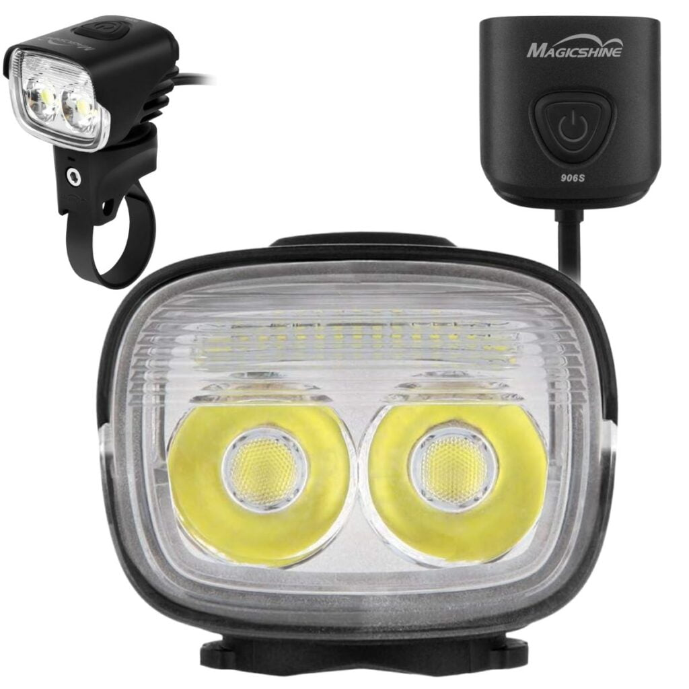

Mountain biking at night presents an exhilarating challenge. Obstacles come at you faster, it feels like you're riding at warp speed, and there's something majestic about the woods at night. 

However, to enjoy this experience, you need a high-powered front light to illuminate the trail. This article will guide you through the **best mountain bike lights for night riding**, focusing on high-powered lights suitable for experienced mountain bikers.

## Best Mountain Bike Lights for Night Riding

Show Summary

Here’s a list of the best mountain bike lights for night riding in 2024:

1. Magicshine MJ 906
2. NiteRider Pro 1800
3. Lezyne Macro Drive Bicycle Front Light
4. Magicshine Monteer 8000S Galaxy V2.0
5. Light & Motion Seca Comp 2000
6. Light & Motion Vis Pro 1000
7. Exposure Six Pack Mk13
8. Bright Eyes 1200 Rechargeable Bike Light
9. Outbound Lighting EVO Downhill Package

### What to Look for in a Mountain Bike Light

When considering which mountain bike light to buy, there are four things worth bearing in mind:

1. **Lumens**: This is the measure of the total quantity of visible light emitted by a source. A minimum of 1,500 lumens will provide enough light for well-lit night riding. You can get away with less, but if you ride fast or on technical trails, more lumens is better than less.
2. **Run time**: This refers to how long the light will last on a single charge. You want an MTB light that can last the length of your typical bike ride.
3. **Beam pattern**: This is how the light is dispersed. Some lights have a narrow focus, while others have a wide spread. The best lights offer a mix of both.
4. **Extras**: These include features like an ambient light sensor that puts the light in standby mode during the day to save battery, or the ability to vary output continuously rather than via set modes.  

## 1\. [Magicshine MJ 906](#)

- The Magicshine MJ 906S is an excellent choice for mountain bikers who need a powerful, reliable, and versatile light for their nighttime rides.

[Check Latest Price](https://amzn.to/3QQwsV3)

The MJ 906's 5 Cree XM-L2 LEDs produce a stunning 5000 lumens on max setting, making it one of the brightest MTB bike lights on the market. This incredible brightness results in a beam distance of up to 300 meters, allowing you to see far down the trail and spot obstacles well in advance.

The wide-angle beam also provides ample peripheral lighting to see the sides of the trail.

I tested the MJ 906 on the rockiest and most technical downhill trails in Squamish, BC, and was blown away by how well-lit everything was, even at high speeds. Shadows and dark holes simply cease to exist with this light on max power. The brightness gives you the confidence to bomb downhill at race pace, knowing you'll be able to see and react to anything ahead.

In addition to the 5000-lumen max setting, the MJ 906 has 4 lower brightness modes - 1200, 1600, 2300, and 3500 lumens. These modes are ideal when you need to conserve battery life during long enduro rides. The lower modes still produce sufficient light for downhill riding.

Burn times range from 1.5 hours on max brightness down to 12 hours on the lowest 1200-lumen mode. For most downhill rides, I found myself using the 3500-lumen mode which gives 3 hours of runtime. 

But that's not all. The [MJ 906](https://amzn.to/3QQwsV3) is designed with user convenience in mind. The large button on the light head makes it easy to switch between different lighting modes, even when wearing [winter gloves](https://mtbnz.org/best-mountain-bike-gloves/). Additionally, the light remembers the last used mode, so you don't have to cycle through the settings every time you turn it on.

Additionally, an IPX-6 waterproof rating so it can withstand heavy rain and mud with no problem. The external cooling fins and internal heat sinks keep the light head cool even at max brightness.

I've put this light through some heavy crashes and rain storms and it still works flawlessly. Magicshine built it to withstand hardcore downhill abuse.

## 2\. [Nightrider Pro 1800 MTB Bike Light](#)

- For serious enduro and night riding, the NiteRider Pro 1800's combination of incredible brightness, durability, light weight, and long run time can't be beat.

[Check Latest Price](https://amzn.to/3QWQxsZ)

The Pro 1800 lives up to its name, delivering a massive 1800 lumens of light on its highest setting. That's enough brightness to illuminate even the most treacherous rock gardens and root-littered singletrack. The light's custom-engineered triple-cone reflector and trio of high-performance LEDs distribute the 1800 lumens evenly, preventing blinding hot spots while still providing ample reach and spread.

While the Pro 1800 certainly has road and commuting applications, it's clear this light was designed by mountain bikers for mountain biking. The rugged aluminum housing shrugs off crashes and spray from mud and water crossings. The overbuilt nylon handlebar mount and adjustable helmet mount keep the light steady even when things get rowdy.

On its highest 1800 lumen setting, the Pro 1800 lasts 1.5 hours per charge. But by using the lower settings, you can stretch it out to an impressive 25 hours. The accurate 8-step fuel gauge integrated into the light lets you monitor battery life at a glance. I've yet to run out of juice even on all-night epic MTB rides. A 5-hour charge time brings the battery back to full power.

## 3\. [Lezyne Macro Drive 1300XXL](#)

- The Lezyne Macro Drive 1300XXL punches well above its sub-$100 price tag, offering performance on par with lights costing two to three times as much. The versatile beam pattern, robust construction, and long runtime make it the ultimate night riding companion for mountain bikers.

[Check Latest Price](https://amzn.to/4a2rAoG)

The 1300XXL delivers an incredible 1300 lumens of light on its highest Overdrive setting. This intense output is no marketing gimmick - the broad flood beam pattern lights up the entire trail and surrounding forest.

Three LEDs provide both a wide-angle flood and a focused spotlight that illuminates obstacles and trail features up to 65m ahead.

For general use, the 800 lumen Blast mode or 450 lumen Enduro mode are ideal and considerate to oncoming riders.

The unique Tri-Focus optics provide unmatched peripheral vision to spot wildlife, debris, and terrain changes with ample time to react.

Constructed from machined aluminum with integrated cooling fins, the Macro Drive 1300XXL is lightweight yet able to handle crashes and weather. At just 227g with the mount, it's easy to forget it's even on the bars.

The light is fully waterproof with an IPX7 rating. I've used it in heavy rain and even fully submerged it with no issues. The simple rubber mount keeps the light securely aimed on rough terrain.

The 1300XXL is simple to operate even with thick gloves on. A large button lets you cycle through the brightness modes, while a smaller button triggers the pulse Daytime Flash mode.

The oversized 5200mAh battery enables a class-leading max runtime of 148 hours in the 15-lumen Eco mode. Even at full 1300 lumen output, it lasts 2.5 hours. The intelligent auto-cooling system prevents overheating by automatically adjusting brightness when stopped.

## 4\. [Magicshine Monteer 8000S Galaxy V2.0 MTB Light](#)

- The Magicshine Monteer 8000S Galaxy V2.0 is hands-down one of the best LED bike lights I've ever used for mountain biking at night. The 8000 lumens completely illuminate even the most technical trails, giving you the confidence and visibility to ride at speed after dark.

[Check Latest Price](https://amzn.to/3sS6gS4)

Pros

- Extremely bright at 8000 lumens
- Wide and even beam pattern
- Compact and lightweight lamp head
- Easy to mount
- Easily change modes with an intuitive wireless remote

Cons

- Expensive compared to some other LED bike lights
- Can get hot due to high brightness
- Battery indicator not visible while riding

The Monteer 8000S employs five Cree XHP50 LEDs - three for a wide 4800-lumen flood beam, and two that throw a more focused 3200-lumen spot beam. With the two combined, this light outputs a massive 8000 lumens at full power. To put that in perspective, most car headlights emit around 1200-1500 lumens.

With some high-powered lights, all that brightness can create a hotspot that washes out the center of the beam. But Magicshine found an ideal balance with the Monteer 8000S. It casts a wide, even pattern that fully illuminates the trail and surrounding environment without any harsh hotspots.

This gives you a complete visual picture at all times, making it easier to pick clean lines and ride at speed through technical sections after dark. The expansive beam pattern also helps with peripheral vision, allowing you to spot obstacles like rocks and branches further off to the sides.

Despite its incredible brightness, the Monteer 8000S is surprisingly compact and lightweight at just 145 grams for the lamp head. The separate battery pack is larger but still impressively small considering its high 10,000mAh capacity. Together, the entire setup weighs only around 600 grams.

New for the V2.0 is the wireless remote control, which makes switching between modes effortless while riding. The remote's two buttons allow you to toggle between five brightness levels plus flashing and SOS modes. Being able to adjust output on the fly like this lets you extend battery life when less light is needed while tapping into the full 8000 lumens for high-speed descending or technical terrain.

Magicshine still squeezes out impressive run times from the 10,000mAh battery. I managed 1 hour and 38 minutes at full 8000-lumen max power during testing and a solid 32 hours in the 400-lumen eco mode.

## 5\. [Light & Motion Seca Comp 2000](#)

- While it is pricier than some competitors, the Seca Comp 2000's power and quality engineering make it well worth the investment. I wholeheartedly recommend it for any serious night rider looking to upgrade their trail illumination.

[Check Latest Price](https://amzn.to/47Sy6fP)

Pros

- Very bright max output of 2000 lumens
- Good mix of spot and flood optics
- IP67 waterproof rating makes it highly durable
- Decent battery life of 1.5 hours on max mode
- Simple and easy to use interface

Cons

- Mode button can be stiff and hard to press
- Lower max runtime than some competitors
- More expensive than some budget-oriented MTB bike lights

With a max output of 2000 lumens on its highest setting, this compact MTB bike light can illuminate even the most technical trails. The Seca uses Cree LEDs paired with both spot and flood lenses to create a beam pattern optimized for mountain biking.

The spot lenses concentrate light to let you see farther down the trail, while the lower diffuser lens provides a wide flood beam ideal for lighting up your peripheral vision. I've found this combo beam pattern lights up obstacles and trail features better than lights relying solely on spot or flood beams.

One concern with high-powered LED bike lights is battery life, but the Seca Comp 2000 delivers excellent run times thanks to its dual-integrated batteries.

On its 2000-lumen max setting, it lasts 1.5 hours - plenty of time for most night rides. Dropping to 1000 lumens extends the runtime to 3 hours, while the minimum 500 lumen setting lasts 6 hours.

- In my experience, the Seca lasts slightly longer than Light & Motion's estimates. I typically ride on the 1000 lumen setting and easily get over 3 hours of use before needing to recharge. The included charger fully recharges the batteries in around 2.5 hours.  
      
    [More customer reviews on Amazon](https://amzn.to/40SSAmm)

## 6\. [Light & Motion Vis Pro 1000](#)

- Riders who stick to sub-two hour sessions will be perfectly served by the Vis Pro 1000. It strikes a delicate balance between power, durability, and weight that dedicated night mountain bikers need.

[Check Latest Price](https://amzn.to/40YcfRY)

Pros

- Wide 20 degree beam lights up the whole trail
- "SafePulse" mode provides visibility on roads without glare
- IP67 waterproof rating makes it highly durable
- IP67 waterproof rating, can be submerged 1m for 30 mins
- Quick release mount easy to pop on and off bars

Cons

- Battery life just 1.5 hours on max setting
- Takes 2.5 hours to fully recharge battery

The [Vis](https://amzn.to/40YcfRY) [Pro 1000](https://amzn.to/40YcfRY) packs a punch with 1000 lumens of light output on its highest setting. Four modes let you adjust from 1000 lumens down to 250 lumens for longer runtimes. It has one of the most balanced beam patterns I’ve seen in an LED bike light, with a wide 20-degree angle that lights up the trail ahead without wasting light to the sides.

One feature that sets the [Vis Pro 1000](https://amzn.to/40YcfRY) apart is the “SafePulse” mode. Unlike flashy strobe lights that can startle drivers and other trail users, SafePulse uses a unique pulse pattern designed to catch attention while avoiding dangerous glare. This provides extra visibility when riding road sections to and from the trails.

The light itself is built tough to withstand real mountain biking abuse. It carries an IP67 rating meaning it’s dust tight and can handle being submerged under a meter of water for 30 minutes.

On the trail, the [Vis Pro 1000](https://amzn.to/40YcfRY) delivers a bright, consistent beam that lets me pick clean lines and spot obstacles well in advance. The wide beam lights up tight switchbacks easily. I consistently match my daytime pace at night with the Vis Pro 1000.

The quick-release mount makes the light easy to pop on and off the bars. When paired with the helmet mount, I can shift the light between my bike and helmet to adapt to different trails. 

### The Vis Pro 1000 isn't perfect. My main gripe is battery life, which only lasts 1.5 hours on the highest setting. That's less than competitors like the **[Lezyne Macro Drive 1300XXL](https://amzn.to/3RepmLj)** that offer over 2.5 hours on high. I tend to ride 2+ hour sessions and have to remember to drop it down to medium halfway through. It also takes a full 2.5 hours to recharge once the battery runs dry. That means you’ll want a backup light if you’re riding long night sessions and need to swap mid-ride.

## 7\. [Exposure Six Pack Mk13](#)

- The Exposure Six Pack Mk13 is the flagship off-road riding light from British illumination experts Exposure Lights. With a retina-searing maximum output of 5,250 lumens, the Six Pack Mk13 is designed to provide day-like visibility for technical night mountain biking.

[Check Latest Price](https://amzn.to/40YcfRY)

Pros

- Provides day-like visibility on the trail.
- Integrated 17,000 mAh battery for 2 to 36 hours runtime
- Reflex technology boosts output when riding fast
- Robust, machined aluminum body manages heat well

Cons

- Mounting position makes light a bit heavy on handlebars
- Maximum brightness overkill for more casual riding
- Can't adjust angle on handlebar mount

The Exposure Six Pack Mk13 is a high-end bike light designed for serious mountain bikers. It's perfect for downhill, enduro, and trail riding.

The Six Pack Mk13 uses six white XPL2(W3) LEDs to generate a maximum of 3,750 constant lumens on the highest standard setting. This gets boosted to 5,250 lumens when run in Reflex mode, which activates brighter output when riding at speed.

On standard High mode, the Six Pack Mk13 provides very bright 3,750 lumen illumination. But Reflex mode is when the light truly shines, with its 5,250 lumens turning night into day.

The beam carries an impressive distance down the trail, with a wide spread that highlights obstacles while reaching far. The diffused edge prevents harsh cut-off at the periphery.

Exposure's Reflex technology uses accelerometers and patented circuitry to automatically increase brightness when riding fast, and dim when slower to optimize battery life. There are three Reflex brightness settings to choose from.

With a large 17,000 mAh Li-Ion battery integrated into its machined aluminum body, the light provides between 2 to 36 hours of runtime depending on settings. It features Exposure's Optimised Mode Selector (OMS) to switch between modes and see remaining battery life.

### This light is housed in a gun metal black body, adding a sleek aesthetic to its robust functionality. Priced at over $400, the Six Pack Mk13 is not a cheap light. However, considering its high lumen output, smart technologies, and robust build, it offers excellent value for serious mountain bikers who frequently ride at night.

## 8\. [Bright Eyes 1200 Rechargeable MTB Light](#)

- While the Bright Eyes light could pull double-duty for commuting, it's clear this light was designed with mountain biking in mind. The wide, balanced beam pattern is ideal for illuminating obstacles and the trail ahead.

[Check Latest Price](https://amzn.to/40QUHqR)

Pros

- Long battery life, up to 16+ hours on low setting
- Fully waterproof and durable aluminum housing
- External rechargeable battery can be charged on the go
- Relatively affordable price under $100

Cons

- External battery adds some bulk compared to self-contained lights
- Battery life degrades over time
- Beam pattern could be improved, very focused spot

Installation of this bike light is straightforward with the included handlebar mount, though the rubber straps could be a bit grippier. The light can tilt up and down 120 degrees for aiming. I found the brightest spot was angled slightly down, illuminating about 10-20 feet ahead of my front wheel.

The [Bright Eyes Bike Light](https://amzn.to/40QUHqR) lives up to its lumen rating, providing a stunning 1200 lumens of brightness on its highest setting. With the light mounted on my handlebars, I had no trouble picking out rocks, roots, and other obstacles at top speed, even on unfamiliar trails.

The beam has an impressive reach, illuminating the trail nearly 200 meters ahead. This gives you ample time to react to surprises around the next bend. Such powerful illumination transforms night riding, making it feel almost like daytime.

The CREE LED bulb provides a balanced beam pattern. It's bright where you need it most - right in front of your wheel - without creating too much peripheral glare.

I also appreciated the gradual dimming as the battery drained. The light slowly dropped to lower settings rather than abruptly shutting off and leaving you in total darkness.

One of the [Bright Eyes Light's](https://amzn.to/40QUHqR) key features is its large 6400 mAh external battery. Housed in a durable rubber case, it provides exceptional runtimes of 4+ hours on high, 6+ on medium, and 16+ hours on low.

Should you run low during a long night ride, the battery detaches easily from the mount for recharging via USB. I was able to get nearly a full recharge off a portable power bank during a short snack break.

The only downside is that the external battery adds a bit more bulk compared to self-contained lights. However, the long runtimes more than make up for it. Plus, the battery can be easily stashed in a pack or pocket when not in use.

### After dozens of evening and night rides, I have complete confidence in the Bright Eyes 1200 Lumen Rechargeable Light. The brightness and beam pattern allow me to ride unfamiliar trails at full speed, without worrying about running out of light. It's also versatile enough for bikepacking trips and all-night endurance races.

[Buy it on Amazon](https://amzn.to/40QUHqR)

## 9\. [Outbound Lighting EVO Downhill Package](#)

- The Outbound Lighting EVO Downhill Package delivers unmatched trail visibility and smart features that improve the night riding experience. While the $365 price tag exceeds budget options, the quality and performance justify the investment for serious night riders.

[Check Latest Price](https://amzn.to/40QUHqR)

Pros

- Very bright output
- Even beam pattern
- Fully self-contained design with no external batteries or cables
- Integrated batteries last 2-4 hours
- Very durable and can withstand mountain biking crashes

Cons

- The EVO Downhill Package is not the cheapest option on the market
- No external battery options for those with existing systems

The Trail EVO bar light is simply incredible. With approximately 2100-2200 lumens, it provides a wide, even beam pattern that illuminates the trail ahead like no other light I've used.

What sets the Trail EVO apart is the proprietary total internal reflection (TIR) optic. This provides a perfect balance of peak brightness, smooth falloff, and insane peripheral coverage. It creates a wide flood of light that allows you to see obstacles at the edges of the trail - critical for mountain biking.

The beam pattern is more like a car headlight than a traditional bike light.

I've found the Trail EVO enables me to ride nearly as fast at night as during the day. Its wide, consistent lighting gives me the depth perception and confidence to bomb down trails, even on tight, twisty sections with off-camber roots and rocks.

The Trail EVO is crafted from cast aluminum with a rubberized finish. It feels incredibly sturdy and secure on the bars thanks to the quick-release mount. I've taken it on countless rough descents and jumps without any issues.

The Hangover helmet light complements the Trail EVO perfectly. With around 1000 lumens, it provides a focused spot beam pattern optimized for seeing farther down the trail.

Having the Hangover mounted to my helmet is ideal for lighting up switchbacks and seeing around corners. The combination of the wide Trail EVO and focused Hangover gives me an unbroken wall of light that keeps my mind focused when riding at high speeds.

At just 100 grams, the Hangover is easy to mount securely to a helmet. I often forget it's even there thanks to the lightweight, low-profile design. Like the Trail EVO, it has survived many crashes and keeps on working flawlessly.

_The Trail EVO lasts 2-4 hours per charge while the Hangover goes 1.5-3 hours, depending on mode. That's plenty of runtime for most night rides._

### Outbound packs their lights full of thoughtful features to make your after-dark rides more enjoyable. The Trail EVO's pass-through charging allows you to connect an external USB battery pack to extend runtime on long adventures. I also appreciate the adaptive brightness mode, which gradually dims the light over 30-45 minutes as your eyes adjust to the darkness. This gives the illusion of increased runtime by delaying the abrupt plunge into lower brightness levels

## How Bright Should a Mountain Bike Light Be?

The brightness of bike lights is typically measured in lumens. Lumens indicate the total amount of visible light emitted by the light source.

Higher lumen outputs generally mean brighter lights. However, lumens alone don't tell the full story, as beam pattern and shape also impact visibility.

### Recommended Lumens for Mountain Biking

For mountain biking, most riders need 800-1500+ lumens for adequate illumination.

- **800+ lumens:** Sufficient for basic trail riding with some ambient light. Provides decent visibility for navigating easier trails.
- **1000-1500 lumens:** Ideal brightness range for technical trail riding in very dark conditions. Allows seeing obstacles and trail features well ahead.
- **1500+ lumens:** Useful for high speeds, downhill riding, or dense vegetation. Maximum brightness for spotting hazards farther ahead.

However, casual riding on lit paths may only require 300-500 lumens.

### Other Factors Influencing Ideal Brightness

Lumens alone don't determine visibility. Beam pattern, shape, and tint also play a role.

- **Beam Shape:** Wider beams see more peripheral obstacles. Narrower beams reach farther ahead.
- **Beam Pattern:** Smooth, evenly lit beams are better than spotty, irregular ones.
- **Tint:** Warm tints provide better contrast and depth perception. Cool tints seem brighter initially.

Riding speed, ambient light, and trail technicality also impact ideal brightness. Faster riding and technical trails demand more lumens

#### Finding the Right Balance

While maximum brightness seems ideal, too many lumens can create issues:

- Overly bright lights over-illuminate and wash out details.
- Excessive glare from bright lights can impair vision when looking beyond the beam.
- Higher outputs drain batteries faster.
- Brighter lights cost more and add weight
