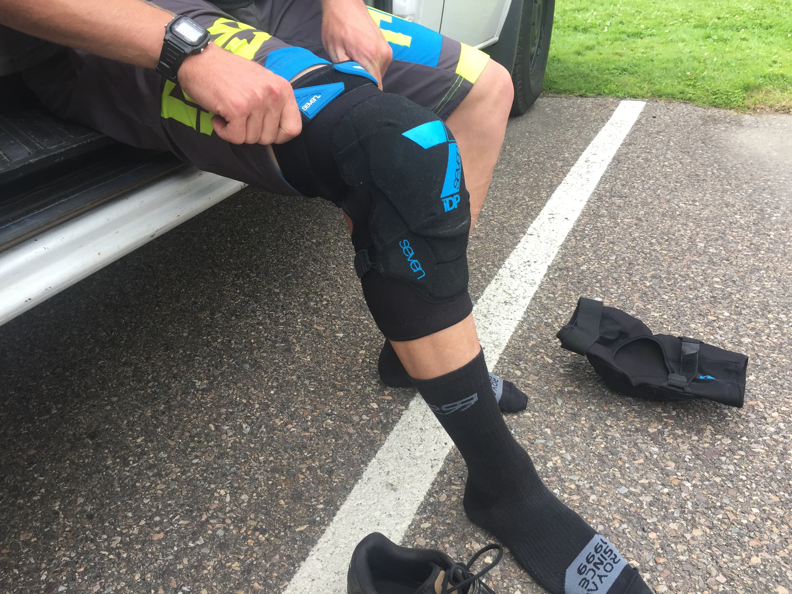
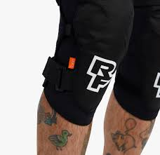
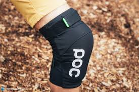
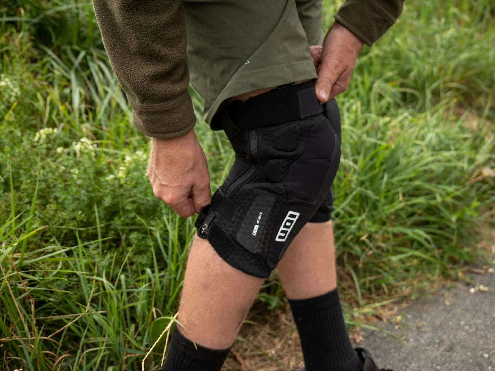
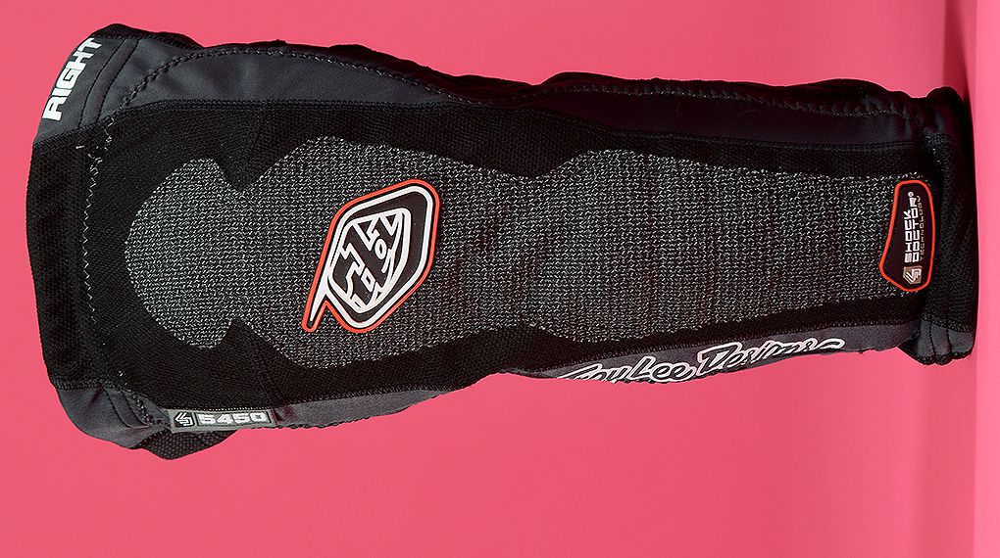
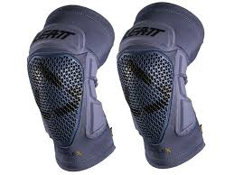
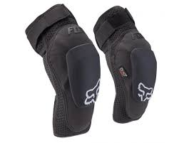

/\*! elementor - v3.17.0 - 08-11-2023 \*/ .elementor-toggle{text-align:left}.elementor-toggle .elementor-tab-title{font-weight:700;line-height:1;margin:0;padding:15px;border-bottom:1px solid #d5d8dc;cursor:pointer;outline:none}.elementor-toggle .elementor-tab-title .elementor-toggle-icon{display:inline-block;width:1em}.elementor-toggle .elementor-tab-title .elementor-toggle-icon svg{margin-inline-start:-5px;width:1em;height:1em}.elementor-toggle .elementor-tab-title .elementor-toggle-icon.elementor-toggle-icon-right{float:right;text-align:right}.elementor-toggle .elementor-tab-title .elementor-toggle-icon.elementor-toggle-icon-left{float:left;text-align:left}.elementor-toggle .elementor-tab-title .elementor-toggle-icon .elementor-toggle-icon-closed{display:block}.elementor-toggle .elementor-tab-title .elementor-toggle-icon .elementor-toggle-icon-opened{display:none}.elementor-toggle .elementor-tab-title.elementor-active{border-bottom:none}.elementor-toggle .elementor-tab-title.elementor-active .elementor-toggle-icon-closed{display:none}.elementor-toggle .elementor-tab-title.elementor-active .elementor-toggle-icon-opened{display:block}.elementor-toggle .elementor-tab-content{padding:15px;border-bottom:1px solid #d5d8dc;display:none}@media (max-width:767px){.elementor-toggle .elementor-tab-title{padding:12px}.elementor-toggle .elementor-tab-content{padding:12px 10px}}.e-con-inner>.elementor-widget-toggle,.e-con>.elementor-widget-toggle{width:var(--container-widget-width);--flex-grow:var(--container-widget-flex-grow)} Show Summary

Here are some of the best MTB knee pads available in 2024:

1. **Leatt Airflex Pro**: These knee pads are well-rounded and competitively priced, offering a good balance of protection and comfort for various riding styles.
2. **Sweet Protection Knee Guards**: These knee guards provide excellent protection and comfort for aggressive trail and enduro riding.
3. **7iDP Sam Hill Lite**: These knee pads are lightweight and comfortable, making them suitable for trail and enduro riders who prioritize pedal-friendliness.
4. **Fox Racing Enduro D3O**: These knee pads offer a good balance of protection and breathability, making them suitable for enduro and trail riding.
5. **POC VPD Air**: These knee pads are lightweight and comfortable, ideal for cross-country and trail riders who want minimal impact protection without sacrificing comfort.  

If you have ever been into a horrific crash, then you probably know the importance of the phrase 'you gotta pay to play.' A well-fitted mountain bike knee pad will save you from scraped and bloody knees.

It's hard to imagine a mountain biking enthusiast who has never been caught at the top of a steep slope, only for their foot to slip out from under them and send them plummeting head over heels down the hill. Knee pads are the last line of defense between your knees and the rough terrain.

Even though you might consider yourself a guru, it is always important to have adequate protection by wearing the best MTB knee pads. This write-up contains reviews of knee pads that are great for mountain bikers who want maximum protection & comfort.

## List of the Best Mountain Biking Knee Pads

1. _**Dainese Trail skins 2**_
2. _**7 IDP Protection Flex Knee Guard**_
3. _**Race Face Ambush Knee Pads**_
4. _**POC JOINT VPD**_
5. _**ION K\_Lite R**_
6. _**SixSixOne Recons**_
7. _**G- Form Elite**_
8. _**Dakine Hellion**_
9. _**Troy Lee Designs 5450**_
10. _**Leatt’s Airflex Pro**_
11. _**Fox Launch Pro D30**_
12. _**Alpinestars Men’s Knee Protector**_
13. _**Leatt 3DF Hybrid EXT Knee & Shin Guard**_
14. _**IXS Flow Leg Protector**_
15. _**IXS dagger leg protector**_

\[table id=6 /\]

### Are Mountain Bike Knee Pads Worth it?

Yes. There are many health benefits of wearing bike kneepads. According to many reviews, mountain bike knee pads have several benefits. Depending on the type of riding you are doing, they can be quite beneficial because of their ability to protect your knees from collisions with low-lying branches or other obstacles found when off-road biking.  
  
Mountain bike knee pads also typically offer more flexibility than full-length shin guards and do not impair or affect pedaling the way that armor does.  
  
However, this level of protection may not be necessary for all riders as it is dependent on your riding style and what you plan to use your bike for. For example, if you just ride around town or use a bike path and don't usually encounter any trails, then there's no need for MTB knee pads.

### Which is better gel or foam knee pads?

Gel is better than foam. Foam pads can only take the load when pressure-relieving surfaces are applied, but gel pads easily disperse the weight because they're made from a material that's more resistant to force.  
  
Foam is soft and typically has no padding like gel does. Plus, it tends to get killed by water which is why if you go out hiking or snowboarding with them it’s usually a good idea to pair them with an elastic wrap, suspenders or both all together so they don't slide down your leg as you work up a sweat on the trail.  
  
Additionally, a foam knee pad will have a shorter life span than a gel pad because rubber generally produces more friction against knees which can wear them faster. As well, some users find that a gel knee pad takes up less space in their gear so it’s much easier to store post workout and travel with.

## Best MTB Knee Pads- Editor Picks

### 1\. [Dainese Trail Skins 2](https://amzn.to/2ItrV8i)

 After spending 2 months researching more than 20 knee pads, consulting with cyclists, and testing some of them, I found that the best MTB knee pads in 2020 are the [**Dainese** **Trail Skins 2**](https://mtbnz.com/recommends/dainese-trail-skins-2/ "Dainese Trail Skins 2").

If you are looking to invest in a pair of lightweight pads, then you should definitely go for the Trail Skins 2 knee pads.

The knee section features a ventilated exoskeleton that is meant to reduce the overall weight of the pad. The ventilation ensures that your knees remain cool and dry during your ride.

The Dainese Trail Skins 2 is for those mountain bikers who love riding in lightweight and breathable pads. Unlike other knee guards, you can wear the Dainese throughout the day without any discomfort whatsoever. You just have to buy the perfect size and you will be good to go.

Dainese knee pads are designed to offer unequaled protection to your kneecaps and the sides of your knees. As you well know, Dainese is a popular brand when it comes to manufacturing high-quality protective armor.

In fact, the company incorporated the Pro-Armor technology when designing the Trail Skin 2 knee pads. The knee cap section features a Pro-Armor shield that is built using shock-absorbing rubber. During a crash, the shield will distribute the impact throughout the latticework structure.

I also like how the knee pads fit securely on the legs, thanks to the internal silicone grippers and the adjustable cinch straps located around the calf and lower part of the thighs.

You can ride for long distances without making stops to adjust the knee pads. The Trail Skins 2 are available in small, medium and large sizes. Make sure you choose the right fit in order to get the best out of these awesome knee pads.

\[su\_button url="https://amzn.to/2ItrV8i" target="blank" background="#ef7b2d" size="9" rel="nofollow"\]Check Price At Amazon\[/su\_button\]

* * *

### **2\. [7 IDP](https://www.amazon.com/7iDP-7005-05-540-Flex-Knee-Protection/dp/B017P3J8NY?tag=furiousbikes-20)** Protection **Flex Knee Guard**

7 Protection is a brand that specializes in high-end MTB protection. Their product line ranges from [helmets](https://mtbnz.com/best-mountain-bike-helmets/), back protection, chest, and joint protection. Their products are famous for their durability, comfort, quality, and innovative design.

One of their products is the [7 Protection Flex Knee Guard](https://amzn.to/2TBxWWT) which is a mid-weight knee pad that is designed for various types of riding.

The  7 Protection Knee Guard incorporates the use of hard cap and foam protection, the combination is wrapped in a tough material thus creating a durable and comfortable knee pad. The knee pads feature a shape that is pre-formed in such a way that it can fit comfortably even when you are in a bent knee position.

Unlike most knee pads, the 7 Protection Flex Guard does not slide up or down even after extended periods of intensive riding. This is because each knee pad has a center strap that wraps around your leg, which in turn ensures that the knee pads do not slide or slip.

There is a 2nd strap on the upper calf that holds the bottom part in place. You could do without this strap if you purchase the right size.

The flex knee guard has an open-back design that significantly increases breathability. It also comes in handy when bending your knee.

The Flex knee guard should be your go-to pads if you are looking for serious protection. They are ideal for downhill racing and you do not have to worry about sides of your knees due to the soft fabric liner.

The outer fabric is durable and can take several hits without showing signs of wear and tear. The Flex knee pads offer the ideal impact protection you will need for mountain bike rides. Each pad has a wrap, which means that you don’t have to take off your shoes when wearing and taking off the knee pads. You can also customize the setup of your knee pads to take advantage of the additional levels of protection.

**Features**

- iDP polygon neoprene
- Wrap design
- Cap & foam combination
- Surpasses the CE EN 1621/1 standards

 **[Check Price on Amazon](https://www.amazon.com/7iDP-Flex-Protection-Black-Large/dp/B00QC72EM2/?tag=furiousbikes-20)**        

* * *

### [3\. Race Face Ambush](https://www.amazon.com/RaceFace-CL4702-P-Ambush-Guard/dp/B00PUGV6XY?tag=furiousbikes-20) 

**First Look:** Sleek, comfortable and stylish.

The Race Face Ambush Knee Pads have a hefty price tag, which could be attributed to the D30 PU inserts and their flexibility. They are available in 5 sizes and can be worn or removed without necessarily taking off your shoes. The Ambush knee pads have an open-back design that allows you to tweak the fit to your liking.

[Get the Race Face Ambush Knee Pads Here](https://mtbnz.com/recommends/race-face-ambushj/ "Race Face AmbushJ")

Since comfort and protection is a top priority, the Race Ambush knee pads seem to have mastered the art. The level of comfort exhibited by these knee pads is nothing short of impressive. They are so comfortable that you will probably forget that you are wearing knee pads.

Ambush knee pads have a terry-lining that mops up sweat to keep you cool during hot weather. One aspect that is worth mentioning is that Race Face Ambush knee pads are relatively heavier than some of their counterparts with DH protection. However, this should not worry you since they are very comfortable and are ideal for hiking and pedaling for extended periods.

As mentioned Race Face Ambush knee pads have D30 PU inserts which are vital in maintaining their flexibility. They are very comfortable when pedaling and stiffen up in case of an impact. The knee pads have additional sculpting which is designed to locate and stabilize the covers.

Race Ambush knee pads have all-round coverage that spans the whole knee area. Such level of coverage ensures that your knees are well defended against bumps and knocks. The D30 protection located at the front is tasked with dealing with the major crashes while peripheral protection shields you from handlebar and frame knocks.

**Features**

- Sleek and stylish design
- D30 PU inserts
- 600D nylon
- Large rubber tabs and two elastic Velcro straps
- Open-back design

     **[Check Price on Amazon](https://www.amazon.com/Race-Ambush-Guard-Stealth-X-Large/dp/B00EG9KYWK/?tag=furiousbikes-20)     [Check Price on JensonUSA](http://bit.ly/2Ndwe85)**   

* * *

### 4\. [POC Joint VPD](https://www.amazon.com/POC-Joint-Protector-Mountain-Biking/dp/B00VXQ9EGG?tag=furiousbikes-20)

POC JOINT VPD knee pads may not have the fanciest name but they are worth checking out. They are products of a Swedish company that specializes in protective apparel.

The [JOINT VPD Knee Pads](https://www.amazon.com/POC-Joint-VPD-Knee-Protector/dp/B00VXQ9EGG/?tag=furiousbikes-20) have borrowed a few features from the DH-oriented VPD 2.0 and combine them with features derived from POC’s VPD Air Line. This combination creates a knee pad that is not only lightweight but also provides unparalleled levels of protection.

The JOINT VPD system knee pads are available in five sizes.

Most of the impact protection can be attributed to the Visco- elastic polymer dough otherwise known as VPD. The material is very pliable but hardens up in case of any impact.

On the outside, the fabric is carefully stitched from a polyamide yarn that has a very high tenacity. The polyamide yarn is vital in the durability aspect since it has high resistance to cuts and tears.

Initially, the polyamide yarn was used by POC in making protective ski gear where cuts and tears from sharp edges are significantly high. These pads do not have Velcro straps, which means you, will have to remove your shoes when wearing them. However, instead of Velcro straps, JOINT VPD system knee pads have elasticized cuffs combined with silicone grippers to provide sufficient slip resistance.

The Joint VPD knee pads are squishy and soft. They will probably be the most comfortable knee pads you’ve ever won. When wearing them, it feels like you have small pillows on your knees.

The only difference is that these pillows are extremely resistant. They will harden up immediately you hit the ground. The Joint knee pads are temperature sensitive and will match the shape of your knees without causing chaffing or discomfort.

When put into use, the Joint VPD knee pads worked as advertised. Well, it does not feel good hitting the ground or anything for that matter but the VPD knee pads will absorb most of the impact. They are among the best mtb knee pads for trail riding.

**Features**

- Weight: 337 grams
- High tenacity polyamide yarn
- Impact absorbing inner layers
- Elasticized cuffs combined with silicone grippers
- EN 1621-1 certified

  **[Check Price on Amazon](https://www.amazon.com/POC-Joint-VPD-Knee-Protector/dp/B00VXQ9EGG/?tag=furiousbikes-20)      [Check Price on Backcountry](http://bit.ly/2NdxcBf)**

* * *

### 5\. [ION K\_Lite R](https://www.amazon.com/ION-Ion-K-Pact-Knee-Pad/dp/B07BRW2T64?tag=furiousbikes-20) (Best Heavy Duty Mountain Bike Knee Pads)

ION was launched in 2004 with their main product line being wetsuits and neoprene products. In 2012, they added a  bike division that focused mainly on gloves, accessories, protection and functional clothing. Since then, ION has managed to provide top level protection for riders around the world.

The ION K\_Lite R are surprisingly light considering their level of protection. They boast of protection levels that can rival that of heavy duty knee pads. The best thing about the ION K\_Lite R is that they are stylish and not as bulky. 

Looks might not be a major concern when it comes to knee protection but still, a stylish knee pad would not be bad, right?

In terms of fit, ION knee pads have a nice snug feel, flexible and feel flexible on and off your bike. The knee pads have a snug loop closure that secures the lower thigh and upper calf. There are also sticky neoprene bands that secure the knee pads in place.

The length of each knee pad is perfect any longer and you would be uncomfortable. They comfy to walk in and you will not feel any cutting on your shin bone or thigh areas even after wearing the knee pads for extended periods.

ION K\_Lite R are the improved version of ION K\_Lite. When making this model, ION opted to focus on improving freedom of movement and enhancing climate comfort.

Each knee pad uses a breathable neoprene referred to as Super Perforator Neoprene which helps reduce heat accumulation under the sleeve. This, in turn, reduces resistance to pedal movements.

ION is known for using third-party protective materials when making its knee pads. In most cases, SAS-TEC is always their top pick but this time ION opted for a high-density memory foam. Having a high-density memory foam allows for improved breathability and flexibility. This means that you can wear your knee pads all day long.

The high-density foam is shaped in such a way that it wraps around your knee for adequate protection. In addition to the HD foam, ION knee pads have thick foam panels for extra cushioning, especially for your shins.

**Features**

- High density memory foam
- Perforated neoprene construction
- Anti-bacterial treatment
- Available in Four distinctive sizes
- Anti-bacterial treatment
- Aramid fibre front

**[Check Price On Amazon](https://www.amazon.com/Ion-K-Lite-R-Knee-Pad/dp/B01KTV1FQ2/?tag=furiousbikes-20)        [Check Price on Backcountry](http://bit.ly/2NbhJBu)  
**

* * *

### 6\. [661 Recon Knee Pads](https://mtbnz.com/recommends/661-recon-knee-pads/ "661 Recon Knee Pads")

“lightweight and comfortable”, these will probably be your first impression after wearing the 661 Recon Knee pads. They are arguably the slimmest and lightest knee pads ever made by 661.

They are designed in such a way that even riders who prefer riding without knee pads will opt to wear them due to their lightweight construction.

Although the Recon knee pads are lightweight they do a pretty good job in protecting your knees since they incorporate the use of an ergonomic Poron XRD plate. The XRD plate provides enough protection for your knees and shin area.

The Recon knee pads have specifically been designed mountain and trail riders who are looking for sufficient knee protection but are not willing to compromise on features such as flexibility and comfort.

Since they are lightweight and comfortable, you do not have to take your knee pads off on the climbs. The Recon knee pads are available in four sizes and you can also purchase the elbow version of the same.

Recon knee pads design includes the combination of Lycra & Mesh paneling which offer a stretchy fit that feels like that of a knee warmer. Each knee pad has elastic cuffs at the top and bottom. In addition to that there is also an elastic panel that is located at the back of the knee.

The Recon Knee pad’s design includes an opening at the back which helps minimize material bunching as you bend your knee while pedaling. This helps decrease chaffing which in turn increases comfort.

When it comes to fit, you are sure to enjoy rocking these mtb knee pads. They have a snug fit and the feel is unrivaled. In terms of practicality, the Recon knee pads hold up well with a few issues here and there.

For example, once you put them on they fit perfectly but after a few hours, you will notice that the elastic cuffs are moving up and down. It is even more noticeable if you have big calf and thigh muscles.

In terms of protection, the recon knee pads hold up well in high-speed crashes even with its 10mm padding. However, if you are going to ride on rocky terrain it is advisable that you opt for heavy-duty knee pads such as the [**661 EVO knee pads**](https://mtbnz.com/recommends/661-recon-knee-pads/).

**Features**

- Padlock connection systems which are compatible with 661 bib shorts
- 2 Elastic cuffs
- Breathable sleeve construction
- Poron XRD impact foam

   **[Check Price on Chain Reaction Cycles](https://mtbnz.com/recommends/661-recon-knee-pads/)**

* * *

### 7\. [G- Form Elite Knee Pads](https://www.amazon.com/G-Form-Elite-Knee-Guards-Pair/dp/B07DC1M4HJ?tag=furiousbikes-20)

The G-Form brand has a philosophy that entails eliminating pain and getting rid of any fear associated with pain. G-Form Elite knee pads are easily recognizable due to their exoskeleton-like design. The pads are not only lightweight but also versatile since they can be used by cross-country riders.

The knee pads are available in four sizes which seem to fit perfectly except for those with large calves. The pads gripped the legs perfectly providing a snug fit, which will come in handy in case of a crash. With a tight fit, you are assured that your knee pads will stay in place and protect your knees if you crash. You will also have to take off your shoes before you put them on.

One of its most impressive features is its flexibility and softness. Although these knee pads are soft, they stiffen up thus dissipating hits. The feature is known as Impact-absorbing Reactive Protection Technology (RPT).

The RPT technology is actually patented. The company claims that these knee pads have been certified for motorbikes. For a knee pad to meet the standards required for motorbike armor, its knee protection must be an impression.

Instead of making the pads bigger so as to get sufficient coverage, the G-Form knee pads are designed in such a way that they protect vulnerable areas of the shin and knees. G-Form also incorporates body mapping to ensure sufficient coverage without necessarily adding extra material.

After all the hype, how do these knee pads hold up in actual crashes? Yes, they held up pretty well. After a few rides with crashes here and there I didn’t feel the need to nurse my knees even after violent crashes. To my surprise, the pads even protected my knees from the top tube. The knee pads did good job in protecting the sides of my knees.

The G-Form Elite Knee pads have a long compression sleeve which when combined with the right pair of socks you will have your leg fully covered.

**Features**

- Mesh back panel
- Impact-absorbing RPT padding
- CE EN 1621-1 certified
- Upper & lower grip bands
- Moisture-wicking fabric
- Available sizes are S-XL

**[Check Price on Backcountry](http://bit.ly/2N9LEKu)          [Check Price on Amazon](https://www.amazon.com/G-Form-Elite-Knee-Guards/dp/B01N3A9S6C/?tag=furiousbikes-20)  
**

* * *

### 8\. [Dakine Hellion Knee Pads](https://www.amazon.com/Dakine-DAKINE-Hellion-Knee-Pad/dp/B07BSRY3NB?tag=furiousbikes-20)

Better known for their bike apparel and bike packs, Dakine is now venturing into the protection market and the Dakine Hellion Knee Pads is one of their top products.

The Hellion knee pads are  designed for downhill riders. The manufacturer has dubbed it the downhill-oriented knee pad and says that it is the ideal knee pad for mountain bikers looking for a comfortable pad on their way up and down.

[Get the Hellion Knee Pads Here](https://www.amazon.com/dp/B01GIJX3H8/?tag=furiousbikes-20)

When it comes to fit, Dakine has a chart that you can use to crosscheck your thigh and calf measurements against its size chart. The Knee pads are available in three distinctive size that is small, medium and large.

The Dakine knee pads incorporate the use of AriaprenePro- a material that is known to deliver the following qualities:

- Water resistance
- Durability
- Four-way stretch
- Lightweight range of thickness

Other than the above qualities there is not much that the AriaprenePro has to offer but one thing is for sure; AriaprenePro holds up quite well in crashes. You will be surprised that even after several crashes your knee pad will not exhibit any signs of tear or fraying.

The Dakine Hellion pad uses foam padding but there is very little information on the type of foam padding used. However, that should not be a bummer since after several rides with the Hellion knee pad the padding feels similar to other knee padding especially the visco-elastic foam.

This means that instead of having a hard plastic shell on the inside or outside the Hellion knee pad hardens on impact. The fabric is pretty flexible which comes at an added advantage since it will not slide in case of a crash.

Other than the main knee cap pad, it also has softer pads that are located on both the inside and the outside. The softer pads are sure to protect your knees from tube hits.

Unlike most knee pads, the Dakine Hellion knee pads has a single strap that runs from the top of the pad and around the thigh. The strap is elastic and had a Velcro enclosure. Perhaps the only downside of this knee pad is that you have to take off your shoes before you can remove it.

**[Check Price on Amazon](https://www.amazon.com/dp/B01GIJX3H8/?tag=furiousbikes-20)     [Check Price on Backcountry](http://bit.ly/2NccW2Z)**    

* * *

### 9\. [Troy Lee Designs 5450 Knee Pads](http://redirect.viglink.com?key=ae747878558fc1198210356270795f9d&type=bk&u=https%3A%2F%2Fwww.backcountry.com%2Ftroy-lee-designs-kg-5450-knee-shin-guard-guard)

Troy Lee Designs has come a long way since they released the T-Bone knee pads and seem to be improving their designs with every product they make. The Troy Lee Designs knee pads are tough, easy on the eye, and comfortable.

The first thing you will notice is the strapless design which works better than expected. Even after extended periods of biking and hiking or engaging in activities that would normally make your knee pads slip or slide, you will be surprised to note that the Troy Lee Knee pads held up well.

Troy Lee knee pads are super lightweight and the sizing is simply impeccable. And since there are no straps you have to wear them like socks. They fit perfectly and grip your legs in such a way that they do not slip up or down. They are comfortable and do not leave you with marks.

Although there are many knee pads in the market, very few can match the Troy Lee Designs 5450 knee pads when it comes to breathability and comfort. The 5450 knee pads have a mesh construction that not keeps the weight down but also provides airflow.

Troy Lee knee pads are designed with a tapered elastic sleeve combined with Lycra low-compression zones.  You have to be careful here since the fitting cannot be tweaked to your liking, you will want to buy the right size.

When it comes to protection, each knee cap has a hard but flexible plastic that is surrounded by foam. The additional foam helps improve protection around your knee caps. On the inside, you will find a gripper style print, which is similar to what is found on braking fingers of gloves. This design ensures that the pads remain in place for long.

In addition to the flexible plastic, you will also get Shock Doctor Technology.

**Features**

- Shin Guard provides enhanced low-profile protection
- Strata foam
- Mesh construction
- No-slip grip zones
- Shock Doctor Technology
- Internal High-impact knee caps
- X-FIT supports the elastic mesh sleeve for provide unparalleled levels comfort

**[Check Price On Amazon](https://www.amazon.com/Troy-Lee-Designs-Guard-Black/dp/B009LLZHCA/?tag=furiousbikes-20)    [Check Price on Backcountry](http://bit.ly/2NbJjyE)**    

* * *

### 10\. [Leatt’s Airflex Pro Knee Pads](https://www.amazon.com/Leatt-AirFlex-Guard-Black-Large/dp/B01615RGK4?tag=furiousbikes-20)

Leatt is well known for its light-duty knee pads but they have recently ventured into the heavy-duty line and the Airflex Pro knee pads are some of Leatt’s top products.

In terms of protection, the Airflex pro knee pads are somewhere between the 3DF Airflex which offers less protection, and the Hybrid lines which offer more protection.

The Airflex pro feel like knee warmers but have knee padding, this means that they are not only lightweight but are also designed with intense pedaling in mind.

Airflex pro knee pads protection entails a material known as Armourgel, which is basically a visco-elastic polymer. Using Armourgel ensures that your knee pads are flexible and comfortable but also hardens on impact.

Unlike the original 3DF Airflex, the Airflex pro has an additional layer of padding above the knee cap and along the sides. They may not be best suited to protect your knees from hard impact but they will help reduce pain in small crashes or in case you smack the side of your knee against your bike’s frame.

The most impressive feature of the Airflex Pro is that the company made the knee pads as breathable as it could. The Armourgel pad has tiny perforations that allow air to pass through. Each pad has cutout behind the knee and an open weave, which all add up to make the Airflex Pro one of the most ventilated knee pad. Such breathability will come in handy especially on trail rides.

Almost all Leatt products are CE certified, however, this does not necessarily rule out uncertified knee pads as inferior. The CE certification only gives you a sneak peek of what you are getting. It is worth noting that the Airflex Pro has a CE EN1621-2 certification, a test that was initially designed for testing motorcycle gear.

The Airflex Pro knee pads can ward off pointy obstacles and can survive attempted punctures as long as it’s not a speeding bullet.

**Features**

- Pre-curved 3D design
- CE tested & certified
- MoistureCool and Airmesh fabric
- Side and upper knee protection
- Silicon printed non-slip cuffs and cupped knee grips
- Weight: 300g per pair

**[Check Price on Amazon](https://www.amazon.com/Leatt-AirFlex-Guard-Black-Large/dp/B01615RGK4/?tag=furiousbikes-20)      [Check Price on Backcountry](http://bit.ly/2NdYS8Z)**      

* * *

### 11\. [Fox Launch Pro D30](https://www.amazon.com/Fox-Launch-Knee-Shin-Guards/dp/B06XG32TXJ?tag=furiousbikes-20)

   
The last few years has seen the protection world drift from the traditional plastic armor to suitable alternatives that rely more on science than on brute force. Fox racing is among the brands trying to build on this idea and the Fox launch Pro D30 is a testament of this.

With the Pro D30, Fox Racing decided to combine a removable protective cap and a C3 certified insert. The [Fox Launch Pro D30](https://www.amazon.com/Fox-Launch-Pro-Knee-Guard/dp/B06XG32TXJ/?tag=furiousbikes-20) stood out in our research since it's solidly designed to offer maximum knee protection, thanks to its D30 padding that boasts of high levels of impact absorption. It features _**thick padding and flexible caps that**_ will handle even the worst impacts you can imagine.

The Material used to make these pads is skin friendly; you do not have to worry about sweat rashes or irritation. You can wear the Fox launch knee pads for long distances due to their _**light-weight nature**_ (396g/pair). 

Being among the best mtb knee pads, they _**do not interrupt pedaling**_ movements at all. Moreover, the Launch Pros are perforated in the Neoprene so as to enhance breathability.

You’ll note that these bike knee pads have a hole at the back of the knee as well as, a curved shape that help improve _**comfort**_. You can ride in them for a long period without experiencing any restriction.

[Check Price on Amazon](https://www.amazon.com/Fox-Launch-Pro-Knee-Guard/dp/B06XG32TXJ/?tag=furiousbikes-20)  

* * *

### 12\. [Alpinestars Men’s Knee Protector](https://www.amazon.com/Alpinestars-Paragon-Knee-Guard/dp/B00NCX1AWE?tag=furiousbikes-20)

The Alpinestars are my favorite knee pads of all times. I have been using them on most of my trail rides and I can’t complain about them.

The _**paragons are so comfortable**_ to an extent that you might forget you are wearing knee pads at all.

Unlike the shitty knee pads that slide down your legs to become leg warmers, the Alpinestars MTB knee pads will stay in the right position. Riders who have been using the Paragons have never complained about sagging issues.

You’ll agree with me that whatever Alpinestars designed was super awesome!

For the Padding sections, the Alpinestars are using a soft, polyurethane pad. These pads have offered me _**great protection**_ when I slammed my knee into horrible rocks. I have to admit that the level of protection in this pad is similar to the D30.

The only odd thing about these biking knee pads is they don’t have _**substantial padding on the sides**_. If you need knee guards that will offer great protection on the sides of the knees, you can opt for the _**Fox Racing Pro knee pads**_ or the _**Race Face Ambush.**_

* * *

### 13\. [Leatt's 3DF Hybrid EXT Knee & Shin Guard](https://www.amazon.com/Leatt-Hybrid-Guard-Black-Medium/dp/B00Q8MK3XS?tag=furiousbikes-20)

  
The Leatt 3DF guards o_**ffer protection to your knees and shin areas**_. These mountain bike knee pads are a combination of comfort and protection.

Being among the best mountain biking knee pads, they feature soft plastic reinforced 3DF padding to provide enough protection and mobility at the same time. The outside of these knee protector has silicone lamination that helps keep the 3DF deflecting shell in place.

The pads are embedded in _**wicking and breathable mat****eria**l_; at least you won't complain about sweating. The good thing about the Leatts is that they fit snugly due to the silicone lamination and hook & loop straps at the both ends.

> These MTB knee pads are ideal for serious mountain bikers who are seeking for maximum protection. Those who love rides motorcycles can use these guards.

[Buy on Amazon](https://www.amazon.com/Leatt-Hybrid-Guard-Black-X-Large/dp/B00Q8MK9PU/?tag=furiousbikes-20)  

* * *

### 14\. [IXS Flow Leg Protector](https://mtbnz.com/recommends/ixs-flow-leg-protector/ "IXS Flow Leg Protector")

If you are looking for the best MTB knee pads that do not have so much padding, then you should purchase the IXS flow model. These cycling knee pads may not the lightest but they are considered as top performers in terms of comfort and safety.

They have Silicone [grips](https://mtbnz.com/best-mountain-bike-grips/) as well as a Velcro strap that wraps around the calf muscle area. These features ensure that the knee pads do not slip or shift when pedaling. The rear part of the Knee guards is ventilated to increase comfort and flexibility.

The padding is made from “X-matter” as the company claims. This padding is efficient in terms of flexibility and absorbing big impacts. The outside of these knee pads is made from strong and tough Kevlar to enhance durability.

These awesome bike pads only weight around 300 grams which is ideal for most riders. Their size allows you to roll them and carry them in your rucksack easily. The only odd thing about the IXS Flow pads is that they do not have padding on the knee sides.

> Incredibly,  IXS flow pad model is ideal for trail riders who want to keep their total weight down, and those who do not mind about high levels of protection.

[Buy on Amazon](https://www.amazon.com/iXS-Flow-Knee-Pad-Gray/dp/B015FUA34C/?tag=furiousbikes-20)   

* * *

### 15\. [IXS dagger leg protector](https://mtbnz.com/recommends/ixs-dagger-leg-protector/ "IXS dagger leg protector")

The IXS daggers are great for mountain bikers who love speed and are looking for serious knee protection. These biking knee pads are associated with a famous rider known as Darren Berrecloth. He helped design this awesome knee guards to serve fast riders.

The outside of these MTB knee pads is covered with hard plastic that [prevents injuries](https://mtbnz.com/how-can-you-prevent-injury-while-cycling/) from rocks or sharp objects. The hard shell spreads impacts as well as preventing the padding from tearing. The Daggers have foam sections fixed around the main padding; they come in handy to protect the sides of your knees from scratches.

The looks of these guards may make you think that they are so stiff; you’ll be surprised that they have the flexibility that you need when riding at high speeds. The sleeve sections are made from aero mesh to allow air circulation.

> Internal silicone grippers and Velcro straps helps to keep the daggers secured in place, thus providing long hours of comfort. The Daggers are ideal for free riders and downhill riders who want some serious protection.

[Buy on Amazon](https://www.amazon.com/IXS-Dagger-black-Size-protector/dp/B0091C63NG/?tag=furiousbikes-20) 

* * *

Gone are the days when cyclists used to ride mountain bikes without enough body protection. Things have changed and people have embraced the fact that protection is an important factor in any sport.

> Before you go for a ride with your friends, it is advisable to check out our guides on the following attire:-

- **[Best MTB Helmets for Protection](http://mtbnz.com/best-mountain-bike-helmets/)**
- **[Best Mountain biking gloves for Comfort](http://mtbnz.com/best-mountain-bike-gloves/)**
- [**Best shoes for mountain biking**](http://mtbnz.com/best-mountain-bike-shoes/)

* * *

##  Mountain Bike Knee Pads buying guide

When it comes to mountain biking the main goal is always to have fun , explore and exercise but there also comes a time when you have to prioritize safety. And if it is not on your priority list you might want to rethink your priorities.

Knee pads and helmets are arguably the most important elements of your mountain bike protection. For example if you happen to be involved in a bike accident, your head and knees take precedent over your arm joints since you are not pedaling with your arms.

To get sufficient protection you might want to settle for the best mountain bike knee pads and if you get knee pads that are sold together with elbow pads the better.

### **Why are knee pads so important in mountain biking?**

For you to understand the importance of mtb knee pads you ought to know what they are designed to protect. The part in question is the knee, which is not only vital for pedaling but also walking. The knee is one of the largest if not the largest joint in the human body and to add to that it is also very complex.

Your knee joint is more like a car piston; it is in constant up and down motion as you pedal. The knee is vital in helping your pedals thus giving your mountain bike motion. If you are experiencing even the slightest pain in your knees, your ride might not be as comfortable and fun since you will be putting your knees to extreme usage.

Protecting your knees will not only allow you to ride without worry but it will also you to keep up other forms of exercise such as walking and jogging.

### Choosing the best mtb knee pads

#### **Knee Pad Design**

Basically, all knee pads have the same design that is a tube with padding. However, the design changes depending on the brand and the intended use. Most knee pads have padding on the sides and front. The best mtb knee pads should stay in place even in case of crash, they should be flexible and provide adequate protection to your most sensitive areas.

Some pads will come with extended upper sleeves, which are designed to prevent the knee pads from slipping down. The extended upper sleeves also cover any gaps between the knee pads and the short. However, not everyone is a fan of extended sleeves which why some brands have knee with Velcro or zips. The inclusion of Velcro allows for easy removal of the pads without necessarily removing your shoes.

#### **Level of Protection**

If you are a casual mountain biker or a cross country rider, thin knee pads should provide enough protection. However, if you are a serious mountain biker with impressive skill to match you might want to consider opting for mountain bike knee pads with serious protection.

Preferably, opt for knee pads with hard density foam and padding on the sides. This will not only protect your knees in case of a high speed crash but also protect the sides of your knees.

If you prefer riding on rocky terrain, it is advisable that you opt for mtb knee pads with hard shells as they prevent rocks from piercing your knee pads.

There are also pads with special foam that is said to harden on impact. Of course, they tend to be a little bit more expensive but they are worth every penny. With such knee pads, you can ride for long hours without complaining about discomfort.

#### **Knee Pad Types**

1. **Lightweight-** lightweight knee pads mostly focus on a slim fit and offer minimal protection. They are designed for all day use and they are so light that you will probably forget that are wearing any knee pads. The level of protection offered is enough to prevent skin loss and fend off scrapes. The best mtb knee pads in this category is perhaps the 661 Recon Knee pads.
2. **Trail-** when it comes to protection trail knee pads are somewhere in the middle. They are lightweight but as light as the ones discussed above. After a few hours of riding you will start feeling the weight and it will get hotter. However, they provide better protection than lightweight knee pads and are ideal for singletrack riding.

- **Heavy-Duty –** heavy-duty knee pads are built to withstand even the biggest hits and offer sufficient protection. They provide enough coverage and incorporate padding on almost all surfaces. In terms of desirability, they are at the bottom of the pile and are not the most ideal pads for pedaling. Some of these pads will come with shin protection and are ideal for downhill tracks. The best mtb knee pads in this category are perhaps the Fox Launch Pro.

#### **Knee Pads Size**

Most mountain bike knee pads are available in three major sizes small, medium, and large. When looking at size you want a knee pad that will fit your legs perfectly since correct fitting is vital. You see a loose knee pad will do you no good especially if your preferred terrain is rough. Picture it this way, you are riding through your favorite terrain and you are involved in a high-speed crash but your knee pads were down, what happened? You will probably incur a knee injury, which could have been avoided if your knee pads fit perfectly.

However, that does not mean that you should wear tight knee pads since it will restrict blood flow and it will be uncomfortable for you.

#### **Knee Pad Material**

Now that you have an idea on the right knee pad size it is time to know more about knee pad materials. They are so many options some of which include cotton, plastic, silicone, rubber, elastane, neoprene, polyester, and polyurethane.

Materials such as cotton are added to offer support and provide the surface needed to hold protective materials in place. Each material has its unique benefits, which is why it is advisable to consider the qualities you want before settling on materials. For example, neoprene has rubber-like properties that allow for enhanced flexibility and resistance to water.

It is important to note that knee guards do not guarantee untouchable protection in case of an accident. Accidents do happen and your knee pads can only protect you to a certain extent. However, investing in the best mtb knee pads will help mitigate the damage.
