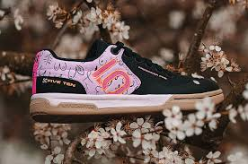
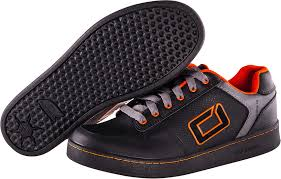

When you start running, you get running shoes, right? And when you play basketball you wear basketball shoes. Golfers wear golf shoes, and tennis players wear tennis shoes.

Cycling is no different.

There are a number of shoes made for bike riders and plenty of shoes that aren't specifically made for bike riding but work well, nonetheless.

Most people can get by riding their bikes wearing almost any kind of athletic shoes. Tennis, basketball, running, cross-training, etc. will work just fine for the average rider. As long as they have a good sole on them they'll be fine.

It's important to wear shoes with a good grip because you don't want your feet to slip and knock your shins off the pedals, which can hurt pretty bad and cause you to wreck and do even more damage to yourself.

Another thing to consider is the stiffness of the sole. A relatively stiff sole allows you to keep more of your foot in contact with the pedal, which, in turn, gives you more power. Shoes made for skateboarding are especially well-suited for the recreational rider, as well as BMX riding and freestyling.

Will you be doing most of your riding on the road or off? This is an important consideration as it will affect your choice in shoes. If you're going to be doing a lot of mountain biking then you should wear relatively sturdy shoes with rugged soles.

A solid pair of skateboarding shoes will usually work pretty well for this kind of riding, but you should also consider light hiking boots or trail-running shoes. These are good for mountain biking because they provide above average traction, are sturdily built, and are often water-resistant, which can come in handy when you're blasting though mud puddles.

If you're an avid or competitive cyclist, then you're probably already familiar with the most popular sort of shoe for this kind of riding. Professional-grade cycling shoes feature clips on the bottom which lock into specially made pedals.

A quick flick of the ankle will release the shoe, but they're held firm during normal riding so your feet don't lose contact with the pedal, which robs the racer of precious power. Clip-on shoes allow you to generate power as your feet are pushing down and raising up, which is quite an advantage over regular shoes. Clip-ons are not generally recommended for mountain biking because you frequently have to take your feet off the pedals to deal with difficult terrain.

\[content-egg-block template=custom/all\_offers\_list\]

Cycling is a great way to get into shape. It's easy to adjust the activity to each rider's level of fitness and interest. If you're just [getting into cycling](/) you already know that your choice in equipment is important. Don't forget that what you wear while riding is important, too. Part of that consideration are your shoes. A good pair will serve you well and help keep you from getting hurt.

Studies show that cycling can improve your cognitive abilities and when that is paired with mountain biking, it could immensely improve your mental and physical state. All you need to do is have the right gear and be fit before hitting the trails.

When it comes to [mountain biking](/), your gear is very important, as it will play a key role in helping you through the trails. Among these are the best MTB shoes for flat pedals, which are needed in helping you, get a [better grip](https://mtbnz.com/best-mountain-bike-grips/) of your pedals.

Besides, you might think of coming off your bike and carrying it instead of riding, which means that you will need flat MTB shoes that are designed with features that can handle the terrain.

Think about it this way, if you are wearing shoes that are  uncomfortable, will the riding experience be fun as you had hoped? I don’t think so, you see, mountain biking requires you to have just the right gear for you trails. This means that if you are missing something or some part of your gear, it is most likely that the experience won’t be as exhilarating. 

Figuring out which mountain bike shoes to take could prove to be a challenge especially if you do not know what features to look for but don’t worry, we have reviewed the best MTB shoes for flat pedals and a choosing guide to help you out.

## **Why Flat** **Pedal Mountain** **Bike Shoes?**

The biggest upside of having flat pedals is that you do necessarily need special mountain bike shoes to ride your bike. You simply hop onto your bike with whichever shoes you please and get riding. But you can still opt to wear the MTB flat pedal shoes as they will work better than your typical shoes.

Typically, flat pedal mountain bike shoes will have flat soles as way to maximize the contact area between the shoes and the bike pedals. You will also find that the rubber is stickier than what’s found on your typical tennis shoe. Your flat pedal shoes will be stiffer than your normal shoes but this is not always true as some brands are stiffer than others.

Nowadays, most flat pedal shoes use standard laces but you can also find other with Boca laces or Velcro straps. That said, it’s important that you tuck away the ends of your laces before hoping onto your bike.

## **Best MTB Shoes For Flat Pedals Reviews**

### **1\. Five Ten Freerider PRO  
**

The Five Ten Freerider PROs are the latest mountain biking shoes in the market. I was so quick to buy a pair from [_Amazon_](https://www.amazon.com/Five-Ten-Freerider-Shoes-Black/dp/B01GHOFI3G/?tag=furiousbikes-20) as soon as they were unveiled to consumers..

One thing i like about the flat MTB shoes is that they are lighter than most Five Ten Freerider kicks. It is a versatile pair of shoe that you can use for a wide range of sporting activities. The Free Rider PRO provides the best grip, excellent traction,  ample cushioning and foot support.

Its outer sole is designed using industrial-strength rubber that not only provides a high friction eco-efficiency, but also excellent traction. The sole is made from a combination of sticky STEALTH S1 rubber and BMX inspired leather. This combination provides you with a high-performance shoe that is ideal for mountain biking.

The upper part is constructed using breathable synthetic fabric that provides durability and breathability. The Free Rider features a vamp lacing technique that provides a much better fit compared to other mountain bike shoes. It is price is decent and considering the features, it is one of the best mtb shoes for flat pedals.

#### **Pros**

- Ample cushioning

- Good grip and traction

- Excellent durability

- High friction shoe

- Awesome Toe protection

#### **Cons**

- Nothing to report.

[Check Current Price on Amazon](https://www.amazon.com/Five-Ten-Freerider-Shoes-Black/dp/B01GHOFI3G/?tag=furiousbikes-20)

### **O’Neal** **Stinger II**

  
The stinger II are among the best flat pedal mtb shoes and are seen as an upgrade to the previous cycling shoes from the Stinger O’Neal collection. It has a stylish design, which means that it can be worn as a sporting or casual shoe.

Its main point of focus is comfort as it comes with sufficient ankle padding combined with enough toe room to keep your feet protected from external debris.

The outer sole is made from a unique rubber compound, which is known as honeycomb rubber. It features honeycomb-patterned tread marks that are designed to provide enhanced grip, stability and traction.

The upper part features a combination of breathable nylon mesh and leather. This combination ensures that the overall durability and breathability of the shoe is upheld. On the inside, it is aligned with an extra set of padding that provides the foot with enhanced protection from external debris.

**Pros**

- Stable Outer sole

- Breathable Upper Mesh

- Extra Padding

- Durable leather

**Cons**

- Inconsistent lacing technique

[Check Current Price on Amazon](https://www.amazon.com/Oneal-Black-White-2017-Stinger-Black/dp/B00O3U9RA2/?tag=furiousbikes-20)

### **Mavic Alpine XL**

  
The Alpine Xl is a very versatile sporting shoe as it is ideal for all seasons. It can also double up as a casual shoe. Its sole is very flexible, which enables you to use it even on rough terrains especially areas where cycling is next to impossible. The ankle area has a Neoprene cuff that is designed to provide ankle protection from external debris.

The upper part features a combination of nylon mesh and synthetic leather. This combination provides just the right amount of durability and breathability without compromising on the foot and ankle protection from external debris.

The Mavic Alpine XL was designed to offer top-notch protection and performance. This means that even parts such as the toe box were not left out. The toe box is made using premium rubber to protect your toes from any external impacts especially rocks.

**Pros**

- Breathable Upper Mesh

- Flexible Rubber Sole

- Enhanced protection

- Unique lacing technique

**Cons**

- Reduced stability

[Check Current Price on Amazon](https://www.amazon.com/Mavic-Crossride-Protect-Mountain-Cycling/dp/B00ZGCL1G4/?tag=furiousbikes-20)

## Women’s Mountain Bike Shoes for Flat Pedals

As I was browsing through the internet, I noted that there is little info concerning women specific Flat Mountain biking shoes. Nevertheless, my wife had to devote some time to put some of the MTB shoes to test and provider her input in this review. Below are reviews of the best Women’s mountain bike shoes for flat pedals.

### Five Ten Women's Freerider Bike Shoe

  
I was pretty sure that bae would pick these kicks as her first option. She has never replaced them ever since she bought them. Five Ten Freeriders are well-known for their awesome traction and grip. It’s rare to find shoes that will provide the type of grip offered by the Freeriders. Bae confirmed that they stick to the pedals like super glue.

The best thing about these women’s flat mountain bike shoes is that they have awesome shock-absorbing and cushioning properties. In fact, you can use them for other outdoor activities other than mountain biking.

The sole is made using sticky rubber to ensure that your feet do not slip off the pedal. Bae confirmed that they stick to the pedals like super glue. The upper part is made using suede leather and polyester mesh which makes the shoe durable and breathable.

You definitely need to grab a pair of these sweet babies from [_Amazon_](https://www.amazon.com/Five-Ten-Womens-Freerider-Bike/dp/B00O92Q83I/?tag=furiousbikes-20)!!!

[Check Current Price on Amazon](https://www.amazon.com/Five-Ten-Womens-Freerider-Bike/dp/B00O92Q83I/?tag=furiousbikes-20)

### Five Tens Women’s Canvas Bike Shoes

  
There is no doubt that Five Ten is the leading producer of mountain bike shoes. In fact, they are famous for producing shoes for the most dangerous sports. The Canvas model qualifies to be among the best flat MTB shoes for women since it provides excellent grip and traction to the rider.  Most customers have praised the canvas for their upper breathable canvas, comfort and stealthy dotty sole.

The FiveTen Canvas shoes are very comfortable on and off the bike. These shoes are available in Grey and Indigo colors. Make sure you choose the right size when ordering a pair from Amazon.

[Check Current Price on Amazon](https://www.amazon.com/Five-Ten-Womens-Freerider-Canvas/dp/B00O92Q7ZW/?furiousb=20)

## **Choosing the Best MTB Shoes For Flat Pedals  
**

When riding a mountain bike your main contact points are your hands, your feet and your butt. But as you look at mountain bike riding especially trails, you will find yourself standing up often which means that your main contact points will be your feet and your hands. Such situations require you to have quality mountain bike shoes.

As a piece of “contact” equipment, choosing the right shoes is vital to comfort on the bike. With this in mind it is recommended to try a few pairs on. Cycling shoes tend to be on the narrow side, as they need to be thin to provide clearance on the crank arm.

You may find that you are already happy with a certain make of shoe – we would recommend to keep to the sizing you are happy with.

### **The benefits of using a specific shoe for cycling**

You may have seen cyclists using trainers on the bike. Generally trainers are designed to flex in the middle of the foot – exactly what you don’t want when the energy produced is being transferred to the pedal. So to provide the most efficient transfer of energy you need a stiff sole.

Even though we say that these are the best mountain bike shoes, there is no particular shoe that can fit every rider’s riding style, terrain, preferred weather and even pedal preference. Hopefully, this guide will come in handy when you are shopping for the best flat mountain bike shoes.

Cycling specific shoes come with different soles from very stiff road shoes to more flexible leisure shoes. Technology therefore can help you perform better – as Tour de France riders use shoes with carbon fibre soles which provide the best transfer of energy.

#### **Using SPD / Clipless pedal systems:**

Using a specific shoe is only of any use if, as discussed above, the transfer of energy is paramount to the design of the shoe. By using clipless pedals the transfer of energy between you and the bike can be made most effective. It is worth investing time in forcing yourself into using clipless pedals – they are more efficient, more comfortable and in the case of toe clips – safer too.

#### **Choosing the right shoe for your cycling:**

Manufacturers offer specific shoes for specific types of cycling – that being road, mountain bike, leisure, triathlon and now Women specific shoes. It is important to choose a shoe that suits your riding. This is also dependent on what type of clipless pedals you use. Within the categories you can then choose how much to spend, the style, the performance advantage and get the best shoe possible.

#### **How much to spend?**

This choice is dependent on performance. If you race at a high level then spending money on such luxuries as carbon soles and performance buckles is very important. If you are new to cycling then it may be enough to upgrade your current cycling set-up to a clipless system and see how things go.

### **Pedal Grip**

The most common question you’ll hear from new riders will always have something to do with the type of pedals. You see there are so many options that choosing and sticking to a certain type of pedal could be overwhelming especially if you have little knowledge of what to look for.

Back in the days, riders used to add toe clips to their pedals as a way of providing a secure interface between the flat pedals and their feet. This way their feet were literally strapped onto the pedals, which meant that if you happened to crash or topple over, your bike was going down with you.

In the late 80s, a new bike pedal was introduced into the market and it required screwing your cleat into your shoe. This way, the cleat easily locked into your pedal and the rider could easily disengage the connection by simply rotating the heel outward. These type of pedals managed to provide a secure connection but it didn’t have the toe clip. That’s when the clipless pedal was born.

The [difference between clipless pedal and flat pedals](https://mtbnz.com/best-mountain-bike-pedals/) is that the former require cycling-specific shoes while the latter does not require special shoes. Both of these types of pedals have their upsides and downsides- and neither can be touted as better than the other.

The best pedals for beginners are flat pedals, as the bike riders will have a chance to learn fundamental skills with confidence. And besides, when using flat pedals it will be much easier to ditch the bike when the need arises.

For more information on bike pedals, check our **[guide](https://mtbnz.com/best-mountain-bike-pedals/).**

### **Weather Conditions**

The weather conditions will have an impact on your choice. For example, a normal XC clipless mountain bike shoe will leave your feet cold especially when you are riding in very cold conditions. Trail and XC shoes are heavily vented, which makes them ideal for summer but when it comes to winter, the vents will let in a lot of cold air.

 As for the flat pedal mountain bike shoes, they have less venting which when combined with the solid rubber sole keep your feet warm.

Fortunately, shoe companies are now making winter-specific cycling shoes for both clipless and flat pedals. The only issue is that they are expensive.

### **Weather Proof**

Weather can greatly impact on how fun you get to have when riding your bike. The only problem comes in when you are wearing shoes that are not designed for the particular weather. This means that you might be wearing the best mountain bike shoes and suddenly the rain ‘turns’ them into flip flops.

For instance, if you have flat pedals the only thing that is preventing you from slipping is the sole grip and by chance there are small showers, everything changes. The rain will obviously make the place muddy and this will inhibit the sole’s ability to grip onto the pedal. Therefore, you will need shoes that are equipped for all-weather conditions.

### **Durability**

As you all know, mountain biking is a very rough sport and the makes it even harder for our bodies. The same can be said for our mountain biking gear. This means that your gear should be tough enough to last through the rigorous rides but it should also be comfortable.

The materials used to make the shoe should be durable than those used to make an average shoe. The build should also be ideal for mountain biking. Preferably, opt for mountain bike shoes with synthetic leather as it is strong.

### **Stability**

Stability should be at the top of your priority list because without stability, your mountain bike shoes is useless. The shoe should have stable features such as solid base, and an outsole that is designed to prevent slipping.

## Shoe Fit

While most of us don't hop on the old bike for 16 states at a time, shoe fit is as important for us as it is for the ultramarathon racer. Unfortunately, most of our shoe choices are predicated on style, price, friends' recommendations and so forth, rather than the all-important quality of fit. While this guide doesn't cover every shoe, what we've done is pick our favorites from more than 40 pairs of shoes and tell you how to fit a shoe, troubleshoot problems and offer solutions.

#### Five Toes Is a Good Start...

The first step is to determine what kind of foot you have. Go to a good bike shop or outdoor sporting goods store and have your foot measured with a Brannock device. There are three measurements you'll need: foot length, width and arch length. Measure each foot twice-once seated and once standing. The latter measurement will tell you if and how much your foot elongates when weighted and may provide clues as to particular problems you have, such as overpronation (where the ankle bone rolls inward, flattening the arch). A second form of measurement is foot volume and is at least as important as the above parameters. Volume is how much space your foot takes up and is rated in basic terms of low, medium and high volumes. Generally, narrow-footed types have lower foot volume, and high arches signify high volume. Since shoes are made in a variety of different volumes, it is important to pick the correct kind for you. A high-volume foot crammed into a lower-volume shoe will suffer from arch cramps and painful pressure points, and a low-volume foot in a larger shoe will slide around and develop blisters and callouses. Evaluating a shoe's volume isn't rocket science-just look at the shoe's profile. A pronounced rise after the toebox signifies the need for higher-volume shoes, such as Carnac's Diagonale. A low-volume shoe such as Sidi's Genius 3 slopes almost straight back from the toebox.

The best-fitting shoe for you should fit like a second sock. Fit comes from the closure system of the shoe. A good closure system compresses the shoe over the top of your foot, behind the metatarsal heads (balls of the feet). This holds your foot securely over its entire top, allows your toes to move freely and locks your heel in place. Two common misconceptions are that the toes shouldn't move and that heel straps are the best way to achieve heel fit. If your tootsies can't move, you'll suffer from painful pressure points and numbness from lack of blood flow and nerve constriction. Heel straps only push your toes into the toebox (causing the aforementioned consequences). Good heel fit comes from the main closure pulling the foot backward, snugly into the heel cup.

#### Methodology 101

A good shoe and proper fit aids will go a long way to ensure you will ride long into your retirement years. As such, this guide's ratings are weighted more toward fit than any other parameter, although we do mention such features as sole drillings.

Our testers were myself, _BG_ associate editor Patrick Brady and Catherine Lee, a Category 3 USCF racer. All testers have a size 41.5 foot (European sizing). Catherine is an A width, has low foot volume and proportionately equal arch length; I'm a medium-volume D width, with a slightly shorter arch length; and Patrick is a duck-footed triple-E width, long arch and high volume.

We each selected our five favorite shoes, categorized here by width. There is some overlap between testers' picks due to the fact that certain shoes (such as Lake's CX200 and the Carnac Diagonale) have very accommodating retention systems that fit many foot types well. The shoes for each tester are listed by price-from the least to greatest.
