> What's the best protein powder for cyclists?

Did you know that fueling your body with the right nutrients could be the key to unlocking your peak performance on the track or trail? One of these vital components is PROTEIN. 💪

Protein isn't just for bodybuilders, it's an essential component for muscle repair and recovery after intense cycling. It helps to rebuild damaged muscle tissues, ensuring you get stronger after every pedal stroke and are ready to tackle your next challenge.

Yet, not all protein powders are created equal. There's a world of difference between a low-quality product and one that's carefully formulated for optimal recovery and growth.

After countless hours of meticulous research, sifting through hundreds of protein powders on the market, reading countless reviews, scientific studies, and interviewing experts in sports nutrition, I'm thrilled to share that I have settled on a list of the top 7 protein powders that cater specifically to the needs of us cyclists!

Here's a list of the 7 best protein powders for cyclists:

Creating this list was no easy task. I evaluated each product based on several key criteria including the quality of protein, carbohydrate content, added nutrients, the absence of unnecessary additives, and of course, the taste.

It was important to ensure each protein powder provides the optimal blend of nutrients for recovery, performance enhancement, and overall health.

The protein powders that made the cut stand head and shoulders above the rest due to their superior formulation, commitment to natural ingredients, and endorsements by leading athletes and nutritionists.

Whether you're a road racer, a mountain biker, a weekend warrior, or a daily commuter, these protein powders are designed to help you ride faster, longer, and recover quicker.

## Do I Need Protein Powder With Cycling?

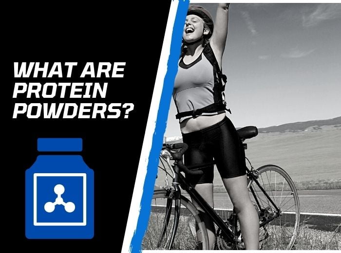

Protein powders are supplements that can be used to supply your body with extra protein. The powder itself is commonly made from whey, soy, or egg, but other protein sources can also be found.

Protein powders are consumed by athletes but are especially common among individuals who participate in weight training for fitness purposes.

There are many different types of protein powders, but it is best to start with one that focuses on whey. [Whey protein](https://amzn.to/3bhPAqt) is made from cow's milk and is considered a complete protein because it contains all essential amino acids. There also exist plant-based protein powders, which will be the best match for vegan athletes.

As a cyclist, you know the importance of getting enough protein. Protein is essential for muscle repair and recovery after intense workouts, but it can be hard to find the time to cook large meals with high-quality protein sources. That's why many cyclists turn to **protein powder supplements** as an easy way to get their daily dose of protein.

## 7 Best Protein Powders for Cyclists

Here's a list of the 7 best protein powders for cyclists:

1. [Optimum Nutrition Gold Standard 100% Whey Protein Powder](https://amzn.to/3Eg5yhk)

3. [BSN SYNTHA-6 Whey Protein Powder](https://amzn.to/2ZA4PJ5)

5. [Impact Whey Protein Blend](https://amzn.to/3ny6l6B)

7. [Dymatize ISO 100 Whey Protein Powder](https://amzn.to/3mgy0cW)

9. [Body Fortress Whey Protein Powder](https://amzn.to/3BnNakK)

11. [KOS Organic Plant Based Protein Powder](https://amzn.to/318ejfh)

13. [Garden of Life Raw Organic Plant Based Protein Powder](https://amzn.to/3Gpp50F)

## Why Do Cyclists Need Protein Powder?

Protein powder can be used in a variety of ways depending on your purpose for using it. You can mix the powder with yogurt, oatmeal, or create your own recipe by adding things such as bananas and peanut butter.

One popular way to use protein powder is by putting it into smoothies or shakes since they tend to be very nutritious and you can easily sneak extra nutrients into your day if they're mixed properly.

You can use the powder as a pre-workout by mixing it with water 30 minutes before your workout routine to give you that extra boost of energy during exercise. Protein powder is also commonly used right after one's workout routine to help support muscle growth, even if you aren't looking to gain too much muscle weight.

You can purchase protein powders at any local health food store or online retailers such as [Amazon](https://amzn.to/3jCMDW8).

## What's so Great About Protein Powder?

There are many positive aspects of choosing protein powder over other ways of getting your daily recommended dosage of protein into your diet. One major advantage is that protein powders are very convenient since they are in powders form, which makes them very easy to carry around and mix with a variety of foods.

Protein powder can be taken whenever you want and is easier for your body to digest making it more efficient than meats or other protein sources since you don't have to worry about how long ago the protein was cooked or processed before consuming it.

A common myth about protein powders is that they can cause weight gain, but this is simply not true as long as the powder isn't mixed with extremely high calorie ingredients. In reality, protein powder can actually help someone lose weight if consumed properly.

Protein powders on their own contain very few calories and since they are typically mixed with other ingredients to make a smoothie or shake, you can easily track your calorie intake through the number of ounces/grams of protein powder you use.

## How much Protein Powder should I take?

There is no set amount of protein one must consume every day as it varies from person to person depending on their current weight and workout goals.  
  
However, there is a suggested range that most people tend to follow in order to get the results they want from using protein powders.  
  
It is best for someone who uses protein powder regularly or works out daily to take around 0.4-0.5g of protein per pound of bodyweight each day.  
  
For example, if an individual weighs 160 pounds, then they should aim for around 64-80 grams of protein every day.

**_The problem?_**

With so many different types of powders on the market, how do you choose which one is best for your needs? We're here to help! Check out our guide below and learn about what each type of supplement has in store!

### Should Cyclists Take Protein Shakes?

Yes. Absolutely. If you're cycling long distances, and/or pushing heavy loads, then protein shakes are necessary for maintaining muscle mass during training.  
  
And if you're not in recovery but want to maintain your muscle mass or lose weight (in a healthy way), the amino acids found in protein have been shown to help with building and maintaining a lean physique.  
  
There's also data that suggests that consuming whey protein through a preworkout can help out performances - it does lead to more muscular endurance; however this may be due primarily to increased nutrient levels and preventing loss of glycogen stores from intense exercise like cycling which is why these substances are usually recommended by coaches before competition.  
Just don't forget your carbs because without them the muscles

Less than ten years ago, protein was considered to be an energy source while [carbohydrates](https://mtbnz.com/carbohydrate-loading-for-cyclists/) were considered to be the kings. Protein was seen as the easiest way to bulk up but as time would have it, protein is now recommended as a way to lose weight.

Nutritionists argue that increasing protein intake and lowering the intake of carbohydrates can help your lose weight.

You might be wondering how protein intake helps you as a cyclist. Well, protein is an essential component of the muscle protein synthesis which is the driving force credited for adaptive responses to exercises. It’s also crucial for recovery, which means that without proteins you might not reap the results expected from all the hard work you put in.

Protein is a valuable training tool but sometimes we find it hard to keep up with the body’s requirements and this is where protein powders come in. They are an easy option that you can conveniently carry around during your workout. And the best part is that you are not confined to one taste as all the best protein powders come in different flavors.

## Our Top picks for Best Protein Powder for Cyclists

\[content-egg module=Amazon template=list\]

### 1\. [Optimum Nutrition Gold Standard](https://amzn.to/3Eg5yhk)

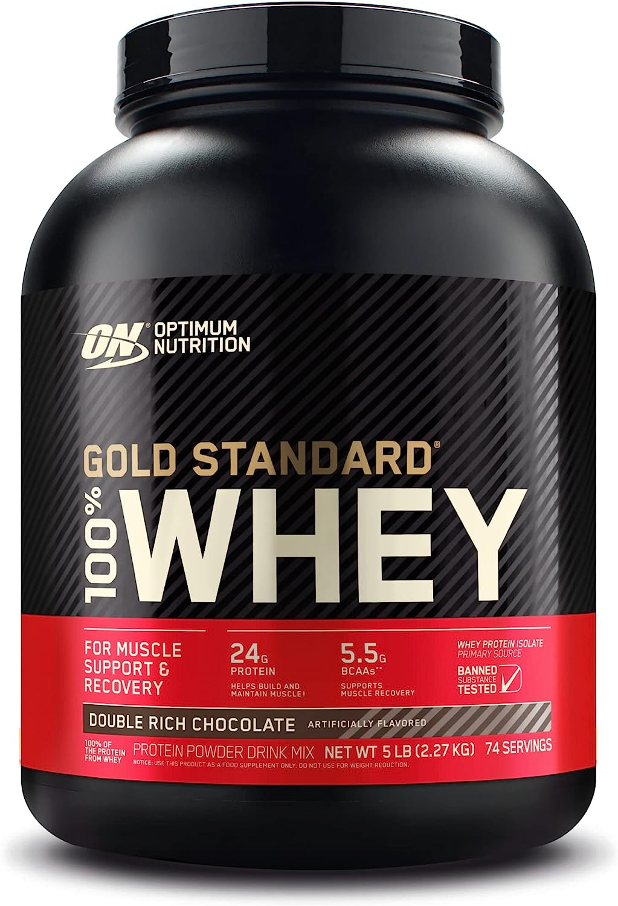

[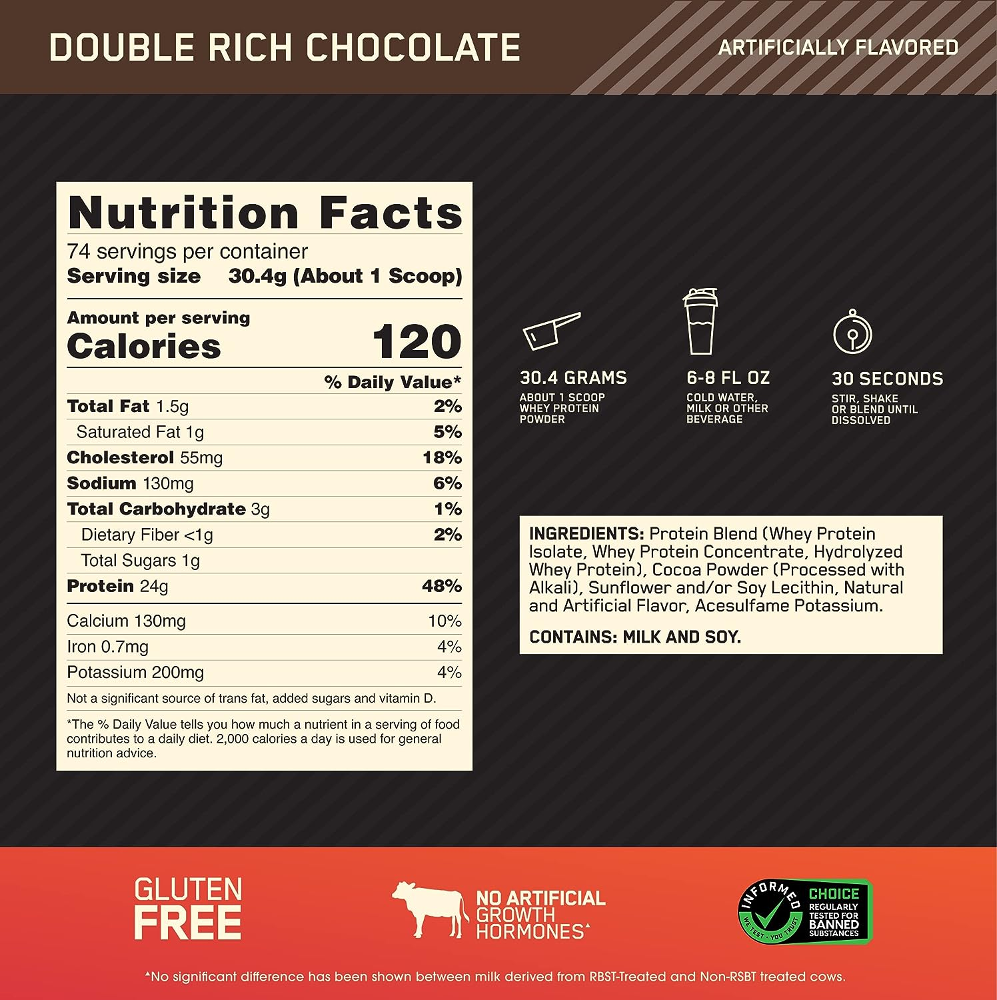](https://amzn.to/47kqSS3)

[**Check Price on Amazon**](https://amzn.to/47kqSS3)

One of the most recognized sources of protein in the fitness industry is the Optimum Nutrition Gold Standard 100% Whey Protein Powder.

Optimum Nutrition's Gold Standard 100% Whey Protein Powder is a blend of whey protein isolates, concentrates, and peptides. Each serving (one rounded scoop) provides 24 grams of protein, 5.5 grams of naturally occurring Branched-Chain Amino Acids (BCAAs), and 4 grams of Glutamine & Glutamic Acid. The product is also low in sugar and fat, making it an excellent choice for cyclists aiming to maintain a lean physique.

In addition, Optimum Nutrition's Gold Standard whey protein is gluten-free.

Optimum Nutrition is often seen as the industry standard for quality whey supplements. They have been around for ages and are the top choice for pro athletes especially IFBB pro bodybuilders. [Optimum Nutrition Gold Standard](https://amzn.to/3Eg5yhk) is available in 20 different flavors which are all said to have a creamy taste and deliver reliable results.

The ON Gold Standard Whey is known for its mixability. It easily blends with water, milk, or any other liquid of your choice without leaving lumps. You can simply mix one scoop of the protein powder in a shaker or a blender for about 20-30 seconds, and it's ready to drink.

For cyclists who engage in prolonged, high-intensity workouts, the 24 grams of protein per serving provided by the Gold Standard Whey can support muscle recovery and repair. The inclusion of 5.5 grams of BCAAs, which are vital for muscle protein synthesis, is an added advantage. However, it's important to remember that [protein intake should be balanced with carbohydrates and fats](https://mtbnz.org/carbohydrate-loading-for-cyclists-a-practical-guide/) in a cyclist's diet, as the body also requires these macronutrients for energy during rides.

To achieve the desired results, it is recommended that you consume the protein shake before or after hitting the trail to help kick-start the muscle recovery process.

### 2\. [BSN SYNTHA-6 Whey Protein Powder](https://amzn.to/3OpmhFz)

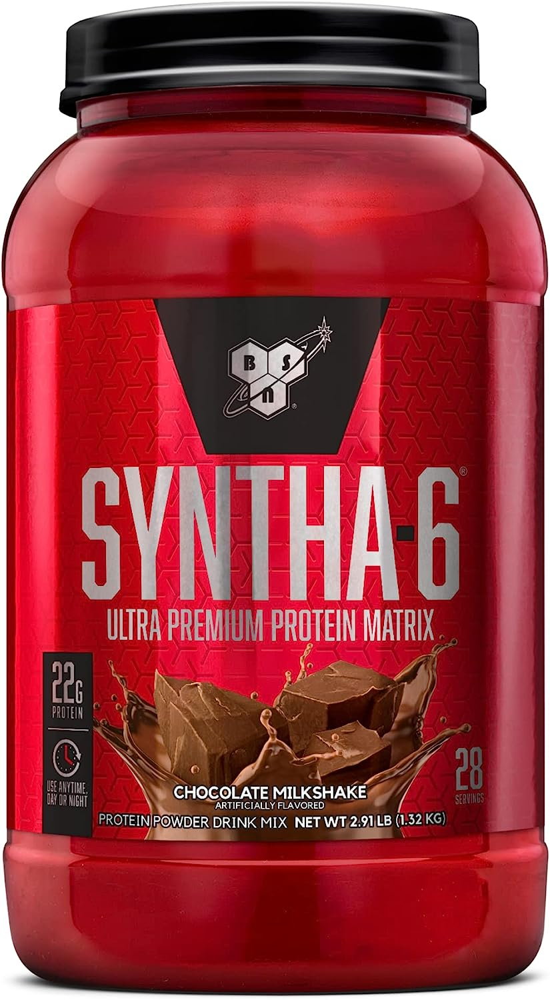

[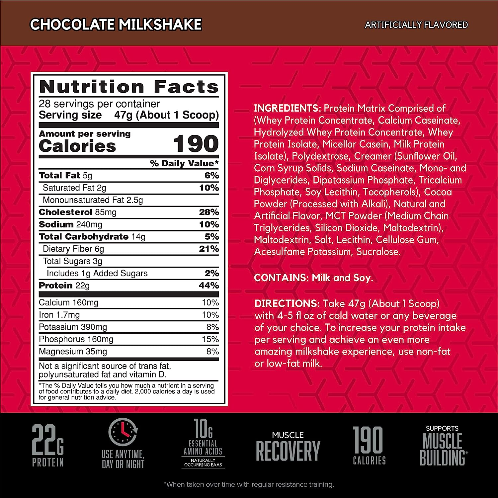](https://amzn.to/3YoMYyR)

[**Check Price on Amazon**](https://amzn.to/3OpmhFz)

For more than a decade, BSN has been at the forefront of innovation in the field of sports supplements. They are credited with creating new supplements and improving the already existing sports supplements. Their main aim is to create dynamic products that not only deliver results but also have no side effects on the athletes. This is especially true with the [BSN SYNTHA-6 Whey protein powder](https://amzn.to/2ZA4PJ5).

It comprises of calcium caseinate, egg albumin, whey protein isolate, micellar casein, whey protein concentrate, and milk protein isolate. In addition, SYNTHA-6 also contains essential fatty acids, essential amino acids, and fiber. The manufacturer also claims that it’s the best-tasting protein powder on the market.

SYNTHA-6 is the top choice for cyclists as it’s formulated to suit different diet plans and lifestyles. It’s the go-to protein powder for any time of the day whether it’s post-workout, pre-workout, between meals, as a treat, or a snack. Once consumed, SYNTHA -6 promotes recovery support as well as muscle protein synthesis.

Protein supplementation is the way to go for pro athletes as it’s crucial in repairing muscles that break down during workouts. It is also needed when building new muscles. Quality protein powders such as BSN SYNTHA-6 should be an essential part of your diet regimen.

### 3\. [Myprotein Impact Whey Protein Blend](https://amzn.to/45fVJxn)

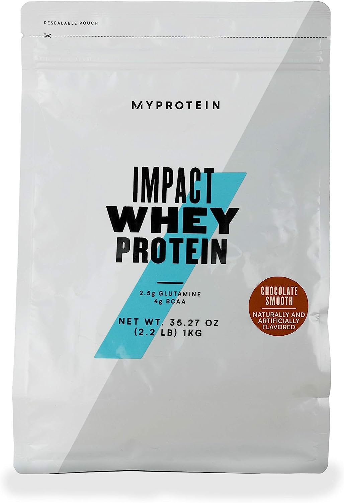

[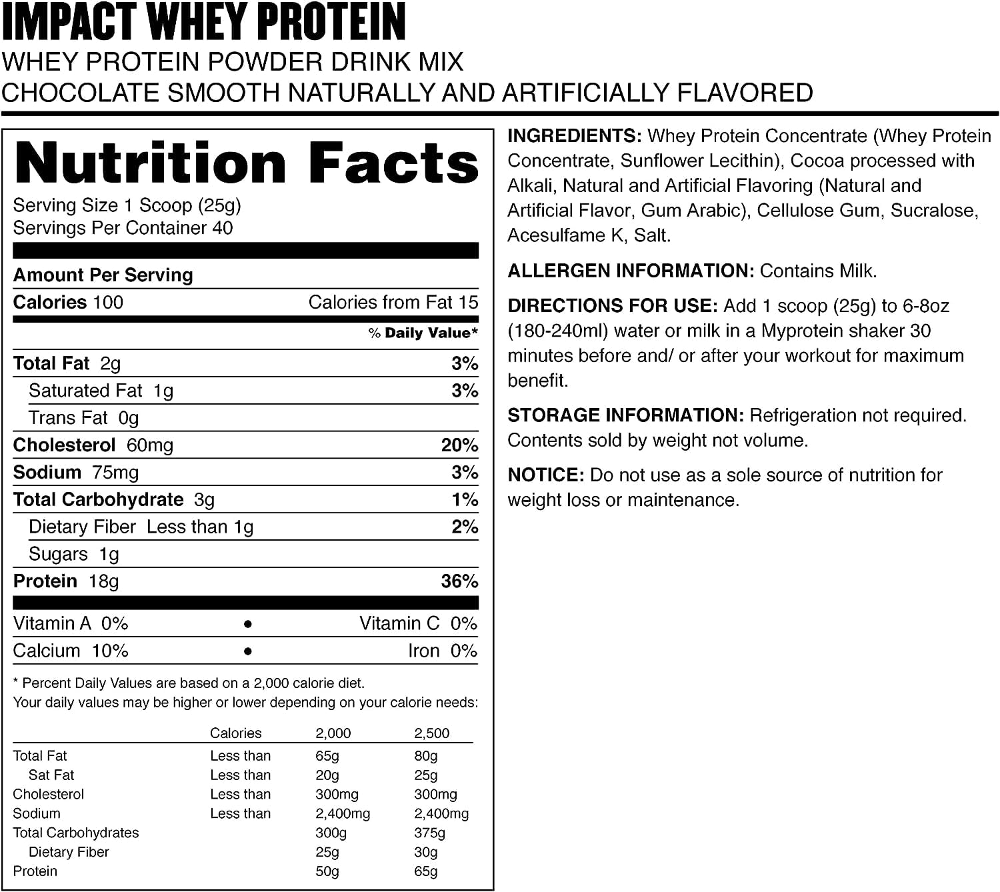](https://amzn.to/45fVJxn)

[**Check Price on Amazon**](https://amzn.to/45fVJxn)

Myprotein Impact Whey Protein Blend is a high-quality protein powder derived primarily from whey protein concentrate. Each serving of the blend delivers 21 grams of protein, 4.5 grams of branched-chain amino acids (BCAAs), and 3.6 grams of glutamine.

**Myprotein Impact has a remarkable nutritional profile and delivers exceptional results.**

The Impact Whey Protein comes in various flavors such as chocolate smooth, vanilla, strawberry cream, and more, giving users a wide range of choices. Some users report that the product mixes well with both water and milk, with a smooth texture, and the taste is generally pleasing without being overly sweet. However, taste is subjective, and individual preferences may vary.

The main ingredient in the Impact Whey Protein Blend is whey protein concentrate, which is a high-quality protein source that aids muscle repair and growth. It's packed with essential amino acids that help in muscle recovery, especially beneficial after long rides.

It also includes soy lecithin for mixability, natural and artificial flavorings, and a sweetener (Sucralose). The Impact Whey Protein Powder blend is low in fat and carbohydrates, making it a lean source of protein.

With this protein powder, you are assured that your muscles will get sufficient protein to facilitate growth and maintenance. It’s available in 50 flavors and should be consumed 30 minutes after a workout session. You can also consume it any time of the day to keep your protein levels high.

### 4\. [Optimum Nutrition Gold Standard Micellar Casein Protein Powder](https://amzn.to/3qlU6zC)

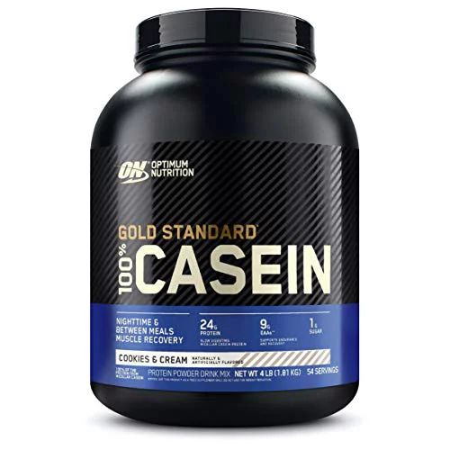

[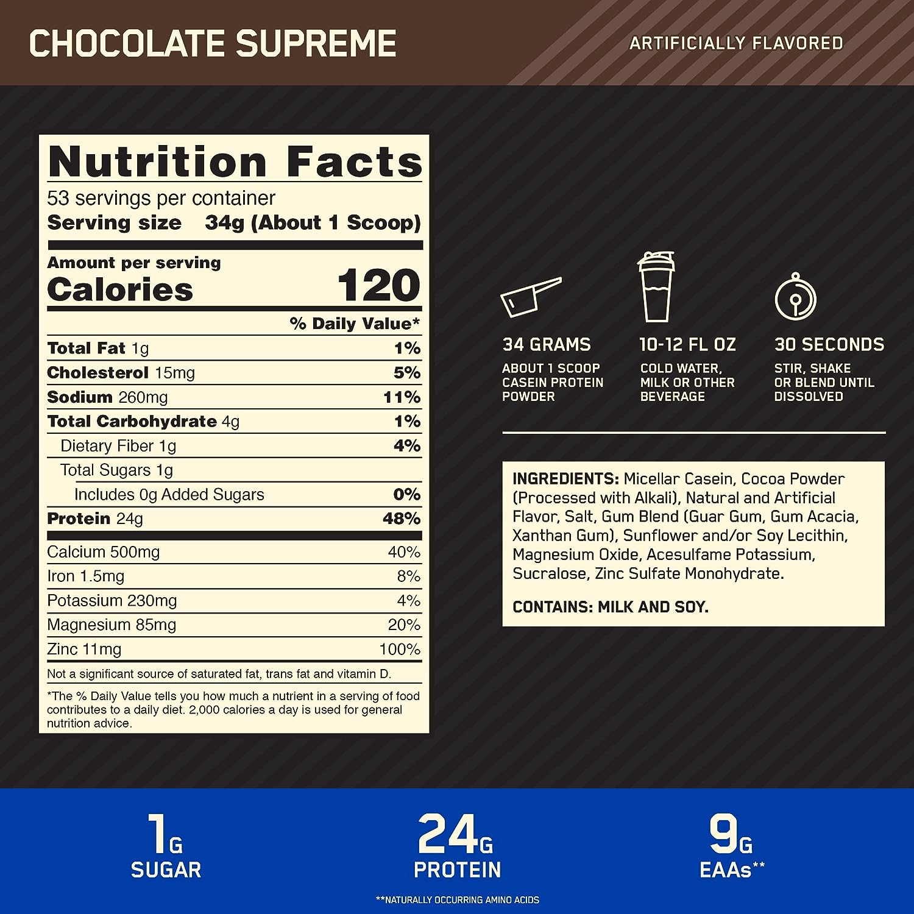](https://amzn.to/3qlU6zC)

The Gold Standard Casein Protein powder stands out from its competitors due to its primary ingredient: [micellar casein](https://www.gainful.com/blog/what-is-micellar-casein/). This slow-digesting protein provides a steady release of amino acids over several hours.

Unlike its fast-absorbing counterpart, whey protein, micellar casein does not cause a sudden spike and subsequent crash in amino acid levels. Instead, it ensures a sustained fuel supply to your muscles, making it the perfect overnight recovery tool. The result? You wake up feeling rejuvenated, with less muscle soreness and a readiness to hop back on your bike.

Each serving delivers a potent punch of 24 grams of protein, further supplemented with an additional 5 grams of BCAAs (Branched Chain Amino Acids). For the uninitiated, BCAAs aid in muscle recovery and reduce exercise-induced fatigue. This combination equips beginner cyclists with the means to pedal harder, recover faster, and push their boundaries.

But there's more to this protein powder than meets the eye. [Optimum Nutrition](https://amzn.to/3qlU6zC) shows a clear understanding of the struggles beginners face in integrating supplements into their diets. The powder is carefully designed for easy mixability and comes in a variety of flavors.

Whether you have a sweet tooth craving with Chocolate Supreme or yearn for the creamy Vanilla Bliss, there's an option that will blend seamlessly into your post-ride smoothie or nightly casein pudding.

From the perspective of value, [Optimum Nutrition](https://amzn.to/3qlU6zC) again rides ahead of the pack. With each tub yielding about 53 servings, it provides a cost-effective solution for those who are taking their first plunge into the protein supplement ocean.

#### What does micellar casein do to your body?

Micellar Casein is a unique form of protein that's absorbed slowly by your body, releasing amino acids into your bloodstream over a longer period of time. This 'time-release' effect means it’s especially beneficial during periods when your body goes without food, like when you're sleeping.  
  
So, what does it do to your body? 🤔  
  
Well, it essentially helps promote muscle recovery and growth even while you're resting. Imagine your body's recovery process working hard even as you snooze away, repairing and building those hard-earned muscles after a challenging ride. Sounds like a dream, right? 🌟  
  
It’s particularly beneficial for cyclists, helping reduce muscle breakdown during longer rides and aiding recovery post-ride. Remember, though, while supplements like Micellar Casein can be incredibly beneficial, they're just that - supplements. They're designed to complement a balanced diet, not replace it.

Casein protein powders are different from other protein powders as they take longer to digest and absorb making them ideal for bedtime when your body is resting. Fast-digesting proteins are recommended for pre and post-workout to help refuel recovering muscles. On the other hand slow digesting protein work well when the body is resting as they deliver BCAAs to recovering muscles over a prolonged period.

A single serving of casein protein powder contains 24 grams of slow-digesting protein, 5 grams of BCAAs, and 5 grams of glutamine. It’s 100% gluten-free.

### 5\. [Dymatize ISO 100 Whey Protein Powder Isolate](https://amzn.to/3mgy0cW)

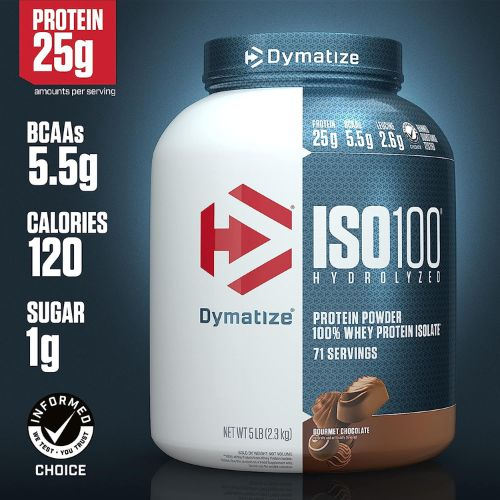

[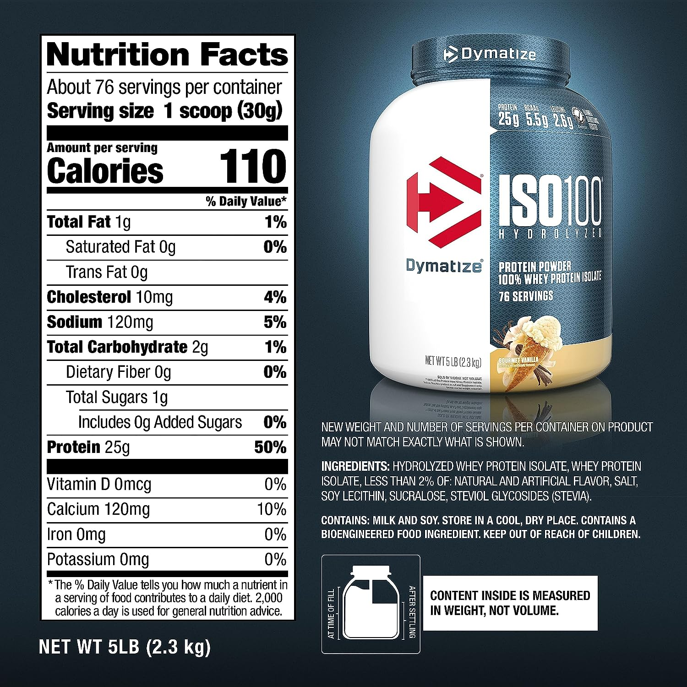](https://amzn.to/3mgy0cW)

[**Check Price on Amazon**](https://amzn.to/3mgy0cW)

Dymatize ISO 100 is touted to be the best protein powder for cyclists. It’s formulated based on science and then put to the test in research universities and professional training facilities. The results are then used to tweak the product thus ensuring that athletes get only the best there is. All ingredients used in the manufacturing process are tested and approved for use before being combined.

Dymatize ISO 100 is made primarily from hydrolyzed whey protein isolate, which means the protein has been broken down into smaller pieces, making it faster for your body to absorb. Each serving (one scoop) contains 25 grams of protein, less than 1 gram of fat, 2 grams of carbohydrates, and no sugar. Additionally, it contains 5.5 grams of BCAAs (branched-chain amino acids) and 2.7 grams of Leucine, both of which are important for muscle recovery and growth.

In simple terms, Dymatize ISO 100 is a muscle-building fuel. It’s formulated using a purification process that retains vital muscle-building proteins while filtering out any excess cholesterol, carbohydrates, lactose, and fat.

One aspect where [Dymatize ISO 100](https://amzn.to/3mgy0cW) shines is its wide variety of flavors, including Gourmet Chocolate, Gourmet Vanilla, Birthday Cake, and many others. The taste is subjective, but most users find the flavors palatable and not overly sweet.

In terms of mixability, Dymatize ISO 100 mixes quite well with water, milk, or in a smoothie, without leaving a gritty texture or chunks behind.

## How you can tell the different types of protein apart?

The main ingredients are a good place to start! The protein in protein powder supplements mainly comes from milk, soy, egg whites, and rice:

### **Whey Proteins**

Whey is a by-product of cheese making and no doubt the most widely used ingredient in protein powder supplements. Whey proteins are full of Essential Amino Acids and Branch-Chain Amino Acids, both of which are responsible for helping your muscles repair and regenerate after working out.  Whey proteins are available as:

•   Whey Protein CONCENTRATE ( the most basic)

•   Whey Protein ISOLATE ( much of the fat and lactose are removed)

•   HYDROLYZED Whey which has been broken down or “pre-digested” so that it can be absorbed into the body much faster.

Typically whey protein powder concentrates are cheaper to buy as they haven’t been put through expensive refining processes. Additionally some people find that Whey Protein Concentrates leave them feeling bloated and gassy, which is due to the larger, less processed protein molecules being more difficult for your body to absorb.

Whey protein powder isolates and hydrolysed whey protein are purer and cost a bit more.

### **Casein Protein**

Casein is another dairy by-product and one of the major protein types found in both human and cow’s milk. Casein protein is a slow releasing protein compared to whey protein and is most often used blended with other proteins or as a night-time/before-bed protein shake. It’s ideal for seeing your muscles through the long night of fasting when you’re asleep or when you’re expecting to not eat for more than a couple of hours throughout the day.

### **Egg White Proteins**

Once upon time eggs were the main source of quick and easy protein for athletes and body builders. Those days are over; however the humble egg protein lives on as an excellent source of Essential Amino Acids as well as being rich in vitamins. Egg protein powders are naturally dairy-free for those who are lactose intolerant and unable to use dairy-based products like casein and whey.

### **Soy and Rice Proteins**

Both of these protein types are great for vegetarians, vegans and those who are lactose intolerant. Soy is often used as a meat substitute (tofu), has a high protein concentration and is also full of vitamins and minerals.

Most trainers believe that you’re best to spread your daily protein intake across 4 to 6 meals. It’s good for your metabolism and helps your body efficiently absorb it.

It’s all about keeping yourself stocked with the protein including **Branch Chain Amino Acids** and the other essential amino acids that are the building blocks of your muscles and their development. This being said the best times for your protein shakes are:

#### **Wake-Up Call**

When you first wake up and haven’t eaten for 8 hours or so. Quickly absorbed whey protein powders are best.

#### **Pre-Workout (around an hour prior)**

So that your body is stocked with BCAA’s ready to give you the pump that you’re training hard for! Fast acting, easily digested, whey-based proteins contain whey protein isolates and hydrolytes are best.

####  **Post-Workout (up to an hour after)**

When you need it the most!  Post-work out protein powders are often higher in carbohydrate to replace the energy your body has depleted while working out. Without this your body may start breaking down the protein of which your muscles are made for continued energy.

Along with Glutamine and the other Essential and Branch Chain Amino Acids contained in good post-workout protein powders, your muscles will have all the ingredients they need to regenerate and grow.

Obviously your body needs to restock as quickly as possible so it’s important that your post-work out protein powder is fast acting. Once again fast acting easily digested, whey-based proteins contain whey protein isolates and hydrolytes will work best for you.

#### **Before Bed**

Your body is about to go into fasting mode! So if you’re serious about gaining muscle you should prepare for it. Casein protein which is slower releasing will see your muscles provided with all of the amino acids they need to get through the night.

#### **Between Meals**

Cutting back on fats and simple carbohydrates are important for weight loss. A great way to replace them as (unhealthy) snacks and feel satisfied between meals is have protein shake! You’ll keep your muscles primed too. There are some protein powders that contain added fibre to increase your feeling of fullness.

## Choosing the Best Protein Powder for Cyclists

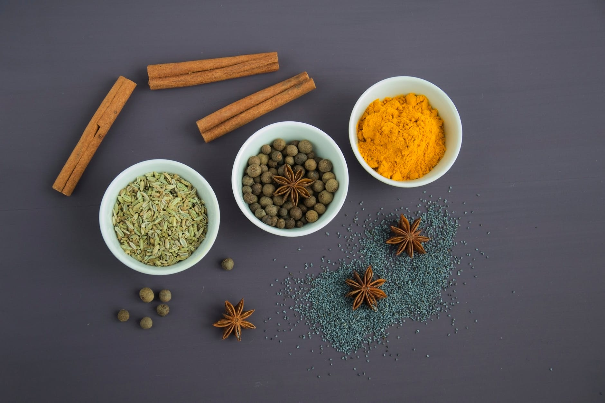

Recreational athletes require 0.8 – 1 gram of protein per kg of bodyweight. However, if you are a pro-athlete you require a little bit more protein to aid in recovery, repair and muscle building.

It’s advisable that you consult a performance nutritionist who will tailor your protein requirements according to your training schedule and end goal. You want a protein powder whose ingredients align with your goals whether it’s slow rebuild or quick recovery.

1. ### Quick recovery
    

For quick recovery it is advisable that you opt for whey protein powders as they are easily digested and absorbed. Whey is fast acting and once digested it releases amino acids for muscle recovery. It also contains a high amount of Leucine- an amino acid responsible for boosting performance and recovery.

2. ### Slow rebuild
    

Whey makes up 20 % of milk protein while casein fills up the reaming 80%. Unlike whey, casein takes forever to absorb. Some take as much as 8 hours to absorb. This means if you are looking for quick recovery then you should take a supplement that contains whey. However, the two work better when combined.

For a quick recovery consume whey as your post workout supplement and reserve casein for your overnight recovery.

3. ### Plant proteins
    

After milk-based proteins, plants proteins are the next best thing. They help with muscle recovery and immune function. The only downside is that plant proteins have strong flavors which are masked with natural or artificial sweeteners.

## Protein Powder Benefit for Cyclists

Protein powders are a great supplement to help you lose weight in a natural, safe way. They provide important amino acids and help to keep your immune system strong.

#### **Protein – The Bricks of Life**

The basic components of the food we eat are proteins, carbohydrates and fat. Obviously minimizing the ingestion of fat is the first thing we need to do when considering weight loss.

However carbohydrates also have a tricky way of being transformed, through complex metabolic processes, into fatty substances. So they can also lead to weight gain. The only substances that are extremely hard to transform into fat are proteins!

Proteins usually don't have an energetic value, but rather a _structural value_. What does that mean? Well, think about a wood burning fireplace. The wood that burns are the fatty substances and carbohydrate

es, while the proteins are the bricks of the fireplace. When starting a weight loss diet people often inadvertently cut the amount of protein they eat when it’s not the proteins that lead to weight gain (unless we are talking about positive gains in lean muscle mass).

Additionally, proteins have a stimulative effect on the metabolism. Eating high-protein foods increases the speed of chemical reactions in the body by about 20 to 30 percent _(Journal of the America__n College of Nutrition),_ leading to the increased burning of fat.

Fat and carbs certainly don’t do this!  Using lean protein powder is a great way to kick-start your metabolism and speed up the burning of kilojoules.

#### **Hard Training**

When you’re training hard muscles need a constant supply of amino acids, which are the primary constituents of proteins. Amino acids help repair the muscles after moderate to intense exercise and without these amino acids you may “burn” muscle tissue along with fat. Weight loss diets usually don't provide the necessary amount of protein, which may lead to muscle catabolism (break down).

#### **Protein Pow****der Fat Burning Additives**

Some protein powders also contain metabolic-enhancing and fat-burning additives. L-Carnitine is a molecule naturally found in the human body that transports fatty substances to the place of their burning. It promotes weight loss through more effective fat degradation.

Caffeine is a substance that increases the overall intensity of chemical reactions in the human body, making it more alert as well as boosting the metabolism. Hydroxycitric Acid (which you may know as Hydroxycut) is also an effective fat-burning additive that may be found in some protein powders designed specifically for weight loss.

It also inhibits the metabolism of carbohydrates. Other commonly used, metabolic enhancing and fat-burning ingredients include Green Tea  extract, Guarana (caffeine) and Forskolin (extracted from the Coleus Forskohlii plant). Chromium is another interesting, often-used additive that helps to manage carbohydrate metabolism and reduces the need to snack between meals. Choline and Inositol can assist in fat metabolism and energy production.

SO! Using protein powder is a great way to boost your metabolism, increase your energy levels and keep your muscles in great shape while undergoing your weight losing regime. However, a high-protein diet that includes lean meat, fish, egg whites, turkey and chicken are also essential for you to achieve your weight loss and overall health goals. You shouldn’t rely on protein powder as being your primary source of protein. You should also eat enough fruits and vegetables to provide a constant supply of vitamins, minerals and antioxidants.

1. ### Reduce calorie intake
    

Increasing your protein intake could significantly reduce the amount calories consumed. For example, adding proteins such as unsalted nuts to your snack or meal could take the edge of your appetite. Consuming more proteins with a snack triggers the body to release more hormones which signal your mind that you are full.

This takes your mind off the next meal. It’s a trick that could help control your appetite. You see, once you start thinking of food, an orange will turn into a banana and then into a cookie. The next thing you know you’ve cleared half a shelf. The feeling of fullness could help control this. Simply combine a protein source with a carbohydrate.

Studies show that consuming 10-20 grams of protein could potentially reduce calorie intake in subsequent meals by 60-120 calories without feeling hungry.

2. ### Builds and repairs muscles
    

Protein is an essential dietary requirement for every athlete especially if you adhere to your strict training schedule. Every time you hit the gym or your favorite trails, your muscles are always on the blunt end of your training. They break down thus require repair and recovery time. Protein intake either through traditional sources or supplementation aids in recovery and repair of your muscles.

Protein also helps your body respond and adapt to the training. Unlike glucose, your body cannot manufacture its own protein from other sources which means if you want your body to keep up with the training you have to keep refueling. If you don’t, your body will begin to break down muscles to satisfy its amino acids requirements.

## What's on the Protein Powder Label

#### ****Acesulfame Potassium (k)****

Acesulfame potassium is an artificial sweetner. It contains no calories/joules and is hundreds of times sweeter than sugar. It is often blended with other sweeteners to create a more natural, sugar-like taste.

#### ****Alpha-lactalbumin****

Alpha-lactalbumin is the main protein in human milk and human milk whey protein. It is rich in conditionally essential and essential amino acids. It has also been found to have immune-system boosting properties which are important for athletes whose immune systems may become suppressed due to rigorous and prolonged physical activity.

****Aminogen****

Aminogen is intended to boost amino acid levels and improve nitrogen retention. It is often used in protein supplements for these reasons.

****Beta-lactoglobulin****

Beta (bovine)-lactoglobulin is the whey protein found in sheep and cow milk and therefore prominent in most whey protein supplements.

****Branch Chain Amino Acids****

Many trainers and bodybuilders now believe that consuming more BCAA’s is better for increasing lean muscle mass. Your body breaks protein down into BCAA’s which are then absorbed directly into your muscles, assisting them to regenerate, heal and grow after working out. Your muscle tissues are actually made of protein! It’s therefore assumed that consuming additional BCAA’s will help your muscles to recover and build faster. Other research has indicated that BCAA’s may increase your strength and energy levels. For more information about BCAA's click HERE.

****Bromelain****

Bromelain is extracted from the stems of pineapples. It is a mixture of protein digesting enzymes that when added to protein powder assists with the breakdown and digestion of protein.

****Carrageenan****

Carrageenan is a food additive used as a thickener and stabilizer. Stabilizers prevent different substances from reacting with each other.  Thickeners increase the viscosity of a liquid.

****Choline Bitatrate****

Choline Bitatrate is grouped with the B-Complex vitamins. It’s a pre-cursor to some neurotransmitters for the memory. It’s important for maintaining healthy cell membranes. It also functions as a carb blocker by slowing the conversion of carbohydrates to fats.

#### ****Chromium Picolinate****

Chromium is needed by the body in very small quantities. Research indicates that it may help to reduce carbohydrate cravings and it's been promoted as assisting with weight loss and muscle gain. Interestingly some studies show that chromium picolinate has no affect on weight loss or muscle gain.

#### ****Coleus Forskohlii****

Coleus Forskohlii is mainly used as a fat burner. It comes from a plant which is in the same family as mint and lavender.

Research about all of its properties is still underway and being published, however it supposedly causes the body to release different types of enzymes that result in fat being burned. It is also meant to stimulate the thyroid into producing more metabolic quickening hormones. It does this without blood pressure raising side effects.

#### ****Colostrum****

Colostrum is the milk produced by mammals when they're almost ready to give birth. It contains nutrients in the form of antibodies (also referred to immunoglobulin) that boost the immune systems of the baby. It has more protein than cow's milk protein that ordinary whey comes from (and less fat) and is designed to give the newborn a real kick-start for the first part of its life.

Because babies have such an undeveloped digestive system, colostrum deliver more nutrients in less quantity of liquid. When included in protein powder, colostrum is believed to have immune system boosting properties as well providing digestive system assistance. It's also believed to decrease muscle recovery time and to fend off fatigue.

#### ****Creatine Monohydrate****

You will often see Creatine Monohydrate added to protein powders. It’s a natural component of skeletal muscle. [Creatine](https://mtbnz.com/is-creatine-good-for-cyclists/) is said to reduce your recovery time and feelings of fatigue when you’re nearing the end of your set. It can also improve your overall endurance and keep you looking pumped-up by hydrating your muscles.

#### ****Essential Fatty Acids (EFA's)****

Essential Fatty Acids are fats that must be consumed because the human body cannot make them. In this way they are like Essential Amino Acids (EAA's). The 2 known essential fatty acids are alpha-linoleic acid (omega-3) and linoleic acids (omega-6). Essential fatty acids are known to impact inflammation of muscles, affect mood and cellular signalling. They can naturally be found in sunflower and pumpkin seeds, soya and hemp oil, flaxseed, fish and shellfish. It is often included in Gain Mass protein powders.

****Garcinia**** 

See __Hydroxycitric Acid.__

#### ****Flavones****

Flavones are found naturally in celery, parsley, citrus peels and some other herbs and cereals. They are supposedly beneficial in the treatment and prevention of atherosclerosis, osteoporosis, diabetes and some cancers. Flavones found in soy protein.

#### ****Green Tea Extract****

Green tea extract has several benefits, these being its anti-oxidant properties and fat burning qualities. It is thought to burn fat by increasing the amount of calorie consuming functions within the body (i.e. our metabolic rate) . "Anti-oxidant" refers to cell deterioration.

****Guarana****

Guarana is a stimulant and contains about twice the caffeine found in coffee. It therefore sharpens the memory, mood and alertness, as well as increasing the metabolism and speed at which fat is converted into energy.

****Glucuronolactone****

Glucuronolactone is a precursor to ascorbic acid synthesis. It’s often used in energy drinks.

****Glutathione****

Glutathione is a tri-peptide (see Peptide). It’s a non –essential nutrient (meaning the body can create it and it needn’t come from food) . Created from the amino acids L-Cysteine, L-Glutamic Acid and Glycine, it’s an antioxidant that has immune boosting properties and helps to protect the body from oxidative exercise stress. This can have a negative impact on training and muscle gain. It also effects regulation of nitric oxide.

****Hydroxycitric Acid (HCA)****

Hydroxycitric Acid comes from the ****Garcinia Cambogia**** plant and is most commonly used in weight loss supplements to inhibit the digestion of carbohydrates. This makes them more likely to pass straight through you without being broken down into sugars and then fat if not burned as energy/fuel. Hydroxycitric Acid is also therefore known as a __Carb Blocker__. It can also function as an appetite suppressant.

****Immunoglobulin****

An immunoglobulin is also known as an antibody. It's a protein used by your body's immune system to fight the bacterial and viral nasties. It's occurs in high concentrations in colostrum.

****Inositol****

Inositol is purported to boost mood, focus and mental clarity. It’s known as a “liptotropic” which converts fat into energy. It’s also thought to be a “signalling” molecule which carries messages between cells in the body and helps to regulate the metabolism.

****Inulin****

Inulin is a dietary fibre that has a food energy similar to that of a carbohydrate, however it has a minimal impact on blood sugar levels. It can assist with the growth of intestinal bacteria (like yoghurt) and promotes calcium absorption. It can have either a mildly sweet or bland flavour which makes it a versatile additive in processed foods.

#### ****L-Glutamine**** 

L-Glutamine is important for post-workout muscle recovery and can reduce muscle soreness. It's one of the essential amino acids and it becomes depleted when training hard. It's believed that L-Glutamine supplementation will help to prevent muscle catabolism (breakdown).

#### ****L-Carnitine****

L-Carnitine is most frequently used as a weight loss supplement. It supposedly works by transporting fat to the parts of the body where it is burned as energy.

#### ****Lactoferrin****

Lactoferrin is a protein found in colostrum as well as human and cow's milk. It's also found in saliva, tears and mucos and has an antibacterial function, therefore contributing to the effectiveness of the immune system.

#### ****Lecithin****

Lecithin is often used as an emulsifier in foods. An emulsifier is a substance which facilitates the blending of substances that wouldn't usually blend. Lecithin is non-toxic and occurs naturally in soy from where it is often extracted. So it's a blending agent when used in your protein powder.

#### ****Maltodextrin****

Maltodextrin is a carbohydrate which is formed by partially hydrolysing starch. Hydrolysation is a process whereby a substance is "pre-digested" by the application of the kinds enzymes found in your gut. Maltodextrin is therefore a very fast absorbing carbohydrate which will increase your energy levels (important after training to ensure that your muscles have the energy to repair and grow).

#### ****Medium Chain Triglycerides (MCT's)****

Medium Chain Triglycerides are believed to be a good source of energy that the body finds easy to absorb and use. Coconut oil is rich in MCT's as is palm kernel oil and butter. Medium Chain Triglycerides are also known as Medium Chain Fatty acids. There is limited evidence that MCT's may also have fat-burning properties. So they're generally intended to be an energy source when included in protein powders.

#### ****Nitric Oxide****

Nitric Oxide is believed to increase blood flow. It can boost the delivery of nutrients, oxygen and hormones when you’re training.  It is added to some protein powder supplements to help your body prepare for its workout and help to speed up the recovery process.

#### ****Ovalbumin****

Good old egg white protein! Ovalbumin makes up about 60-65% of the protein found in an egg.

#### ****Papain****

Papain as the name suggests comes from the papaya plant. It’s an enzyme that breaks down proteins by hydrolysis. You may hear hydrolysis referred to as being “pre-digested”, particularly with reference to Hydrolysed Whey Protein. Papain assists with the protein digestion process when added to protein powder.

#### ****Peptides****

Peptides are clusters of amino acids linked together by a bond  or "glue" referred to as a "peptide bond". The smallest ones are "****dipeptides****" (di meaning 2) which are made up of 2 amino acids, with the biggest ones referred to as a "****polypeptide****" (poly meaning many). A protein is a long string of multiple polypeptides. So if you hear of peptides being extracted using filtration processes like "cold micro" or "ultrafiltration"  it means that the resulting protein powder contains smaller protein particles capable of being absorbed quickly and more efficiently by your body.

#### ****Phaseleolamin****

Phaseolamin is extracted from white kidney beans and is a “carb blocker”. It works by delaying the absorption of starch. Phaseolamin is sometimes added to weight loss protein powders.

#### ****Schisandra Chinensis****

Schisandrea Chinensis is found in parts of China, Russia and Korea and is a woody vine with red berries. The fruit is used for medicinal purposes and in some supplements and protein powders. Studies have purportedly shown that Schisandrea Chinensis can improve concentration and attention as well enhancing hearing and vision.

#### ****Taurine****

Taurine is essential for the development of skeletal muscle, cardiovascular functioning and the nervous system. It occurs naturally in seafood and meat and is a major component of stomach bile. It is often used in energy drinks. It's often called an amino acid even though it's not a true amino, rather a derivative of cysteine.

#### ****Tocopherol****

Tocopherol is a natural antioxidant which is used to preserve the flavour of foods and of course the ingredients in your protein powder, the freshness of which deteriorates due to oxidization.

#### ****Undenatured Whey Protein****

Undenatured whey protein is different from ****denatured whey protein**** due to the way it has been processed. Undenatured whey protein is manufactured by filtering the whey at low temperatures so that the lactoferroin and immunoglobulins (defined earlier in this section) are preserved, rather than losing much of their biological value. Denaturing can result from exposure to salt, heat and radiation, solvents and acids (used in processing treatments).

#### ****Xanthan Gum****

A food additive used as a thickener and stabilizer (increases viscosity and prevents ingredients from separating). It’s also used to create a nice consistency and texture (ice cream). It’s often used as a gluten alternative in baked products.
