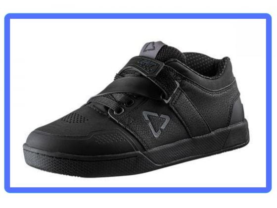
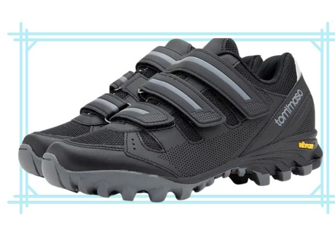

Choosing the right shoes for mountain biking is crucial for both performance and safety.

Here are some key factors to consider when shopping for the best shoes for mountain biking:

1. **Type of Pedals**: The [type of pedals on your bike](https://mtbnz.org/best-mountain-bike-pedals-for-trail-riding/) will determine the type of shoes you need. There are two main types of pedals: flat pedals and clipless pedals. Flat pedals work well with flat-soled shoes, while clipless pedals require shoes with cleats that can clip into the pedals.
2. **Comfort and Fit**: Mountain biking can be strenuous, so it's important to choose shoes that are comfortable and fit well. Look for shoes that offer good arch and ankle support, have enough room for your toes, and are snug but not too tight.
3. **Durability and Protection**: Mountain biking shoes should be durable and offer good protection. Look for shoes with reinforced toes and heels, strong soles, and high-quality construction.
4. **Traction**: Good traction is important, especially if you need to walk or carry your bike over difficult terrain. Look for shoes with grippy soles.
5. **Breathability**: Mountain biking can make your feet hot and sweaty, so it's important to choose shoes that are breathable.

Remember, the best mountain biking shoe for you will depend on your personal preference, the type of riding you're doing, and the weather conditions. Always try on several pairs to find the one that fits best and meets your needs.

1. **Flat Pedal Shoes**

Flat pedal shoes are a great choice for beginners or for those who prefer a more casual and comfortable ride. They have a flat sole with sticky rubber that grips the pedals well. They also allow you to easily get your foot off the pedal when needed, which can be beneficial in tricky or dangerous situations.

- **Five Ten Freerider Pro:** These shoes are known for their excellent grip, thanks to the Stealth S1 rubber outsole. They also offer good comfort and durability, with a reinforced toe box and a full dotty tread for more traction.

2. **Clipless Pedal Shoes**

Clipless pedal shoes are designed to attach directly to the pedals of your bike, offering more control and efficiency. They're a good choice for more experienced riders or those who are doing more aggressive or long-distance riding.

- **Shimano SH-ME7:** These shoes offer a great balance of comfort, durability, and performance. They feature a Torbal midsole that allows natural rider "flow" motion during downhill descents and a dual-density rubber outsole that offers high traction and durability.

3. **Enduro/Trail Shoes**

Enduro/trail shoes are designed for off-road riding where you might need to get off and walk at times. They have a stiff sole for efficient pedaling, but also have enough flex and a grippy outsole for comfortable walking.

- **Specialized 2FO Roost Clip:** These shoes are designed for maximum comfort and control, with a SlipNot rubber tread for confident traction on all trail conditions. They also feature a cushioned EVA foam midsole for comfort during long rides.

4. **Winter Mountain Biking Shoes**

If you're riding in cold weather, you'll need shoes that offer insulation as well as waterproof or water-resistant features.

- **45NRTH Wolvhammer MTN 2-Bolt Cycling Boot:** These boots are designed for cold-weather riding, with a waterproof membrane and aerogel insulation to keep your feet warm and dry.

When buying a bike, very few people think about the bike shoes in which they will ride. This is not quite the right approach, as Specialized Men's Mountain Bike Shoes play a rather important role in transferring power from the pedal to the transmission and ensuring your safety when pedaling.

In this article, we will describe the features, advantages, and disadvantages of some Specialized mountain bike shoes for men. The article will be useful for both beginners and advanced amateurs who want to improve their skills and move to a new level of bike management. But before proceeding further, let's discuss some rules: 

## Basic Rules for Choosing the Best Mountain Biking Shoes

The choice of shoes for Mountain Biking highly depends on the following basic [rules](https://blog.theclymb.com/buying-guide-item/how-to-buy-bike-shoes/):

### 1.  Fairly Tough and Non-Slip Rubber Outsole

Cycling shoes should have a fairly tough and non-slip rubber outsole. Normal running shoes are not quite suitable for this purpose; they have a soft foam rubber sole for cushioning and movement from heel to toe. The soft sole is not designed for constant friction with the metal or plastic spikes of the pedal. It quickly deteriorates, and you have to run to the store for new sneakers. Specialized Men's Mountain Bike Shoes have no such disadvantages and will last many times longer!

### 2.  Stiff sole

It will be much better to transfer force from the foot to the pedal. Thereby Mountain Bike Shoes increase efficiency and reduce energy consumption and our effort when pedaling, which is an essential factor! Training shoes or shoes for the gym seem to fit this characteristic well, but they will not have tenacity, which is also a very important indicator.

### 3.  Grippy sole

It will significantly reduce the number of false slippage of the foot off the pedal, thereby adding safety and confidence when riding. The grip is essential when riding aggressively or on rough terrain where there are a lot of stones, roots, and other bumps.

### 4.  Wear-Resistant Sole

It will keep your shoes for more than one season! Many [professional riders](https://www.bicycling.com/racing/a33474554/2020-mens-riders-to-watch/) have a pair of lucky shoes and have been riding them for years, although they can afford a new one.

### 5.  Mountain biking shoes should fit snugly on the leg, be well fixed, and not fall off

The right size and good fit will reduce unnecessary foot movement while riding and increase pedaling efficiency. Here you can choose from several options for fixing - laces, Velcro, special tightening ratchets, or BOA. Usually, manufacturers combine Velcro with fasteners, which is very convenient to use.

### 6.  The shoes must have a closed toe and a firm heel

It is important for a good fixation of the foot and our safety while riding. The closed-toe will protect your toes from twigs, stones, or just a bad maneuver when turning. A firm heel will provide a better fit in the shoe.

So, we have described the basic requirements for Mountain Bike Shoes. If you adhere to these recommendations when choosing, then you will get much more pleasure and control over your bike while riding. 

## Best Shoes for Mountain Biking - Reviews

Now let's discusses some of the best mountain biking shoes we have selected for you: 

### SHIMANO SH-AM5 Gravity and BMX Shoe - Men's Mountain Bike

SHIMANO SH-AM5 Gravity and BMX Shoes are contact sneakers that combine the functions of regular running shoes and cycling shoes. Fitness cycling shoes are walkable, just like regular sneakers. But at the same time, they have the qualities of MTB cycling shoes. Their fastening system is mostly lacing, but you can also find Velcro.

#### Features

- Raised rubber outsole for foot protection
- synthetic leather
- Asymmetric mid-top design
- Hook & Loop single strap

Due to the fact that many cyclists do not stop pedaling in the winter season, the question arose of keeping their feet comfortable and warm at a temperature of +5, 0, -15, -20. So this design is specially designed for both hot and cold weather.

#### Pros

- Complete foo protection with tough synthetic leather
- Hook and Loop single strap protects your laces.
- Best matched with PD-M545, PD-M647, and PD-M438
- Ultra-grip rubber sole makes them less slippery

#### Cons

- Don't have the plate in the bottom to receive the clips
- The shoes are made on the narrow side, so they are not for you if you have wide feet
- Not suitable for long trips

These cycling shoes are perfect for those who like outdoor activities, sports, or just ride a bike for a couple of hours

### Tommaso Vertice Men's 100, 200, All-Mountain Vibram Sole Mountain Bike Shoes

Another big-time player in the bike shoe market is Tommaso. The company introduced many mountain bike shoes for men. One of the most top-rated and best-selling products is Tommaso Vertice Men's 100, 200, All-Mountain Vibram Sole Mountain Bike Shoes.

#### Features

- Dimensions: 12.8 x 9.8 x 4.7 inches; 2.2 Pounds
- Grippy Vibram sole
- Ultra-rugged
- A hardened and reinforced toe box
- Velcro straps for the perfect fit every time
- 2 Year Manufacturer's Warranty

The Vibram Sole Mountain Bike Shoes are engineered for comfort and stability. These shoes provide durability and the optimal balance of traction while offering good performance on unpredictable ground. The manufacturer has launched two models that are:

#### a)   Vertice 100 - Triple Velcro Strap

The Tommaso Vertice 100 has an amazing Vibram XS Trek sole that helps the riders to perform better. This shoe is walk-able, provides excellent power transfer, and suitable for all-mountain trails.

#### b)   Vertice 200 - Ratchet with Two Velcro Straps

The Tommaso Vertice 200 provides similar benefits as Vertice 100. But it is an upgraded model with an upper Ratchet Strat. Vertice 200 is more comfortable with an additional ratchet strap.

#### Pros

- High quality with 100% fit guarantee (100% free fit returns)
- If you are riding harsh lines in the mountains on a rainy day, these shoes will give you the grip you need. These models are suitable for all kinds of weather
- Amazing stability, grip, and quick-drying breathability
- add comfort and security to all of your rides
- Tons of extra padding is added to hug your foot like a glove
- The top strap allows individual customization according to the riders' need
- provides optimum power transfer without sacrificing comfort with a hidden inner shank plate.

#### Cons

- Rust may appear on the metal strap
- Super narrow; if you have wide feet, they will not easily adjust

These Mountain Bike Shoes are more suitable for both professionals and beginners who want maximum comfort, mile after mile. The price of this product ranges between $79.95 - $89.95 that is highly affordable. If you are looking for a top-notch option that will not break the bank, you should try Vertice 100 or 200 today!

## Santic Cycling Shoes Men Unlocked Bike Bicycle Road Biking Lock Shoes MTB Cycling Accessories Self-Locking Shoes

Santic Cycling Shoes with a similar fastening mechanism are quite popular among professional athletes. These are lightly padded, protective, and quite comfortable inside. By using this model, you don't need to change shoes—The Unlocked shoes have a raised rubber block in their forefoot that Increases the comfort of pedaling.

#### Features

- Dimensions: 13 x 8.7 x 4.7 inches; 2.43 Pounds
- Leather and Rubber sole
- Anti-slip insight
- U-Heel Cup Structure
- Clockwise reel knob lacing
- Lifetime Breakage Warranty

The main advantage of this model is the ability to adjust at any time and in any position, even on the go. This type of fixation combines the rigidity of the tightening fixation and the softness of the fit of the entire foot, like laces.

#### Pros

- Easier to fit various foot types
- This clipless model with a light and breathable construction and rigid platform
- A running shoe beveled heel and flexible forefoot provides the comfort of pedaling, and they don't slip while riding and walking
- The company provides free repair service
- Strategically placed vents for extra ventilation

#### Cons

- Slightly larger and rather "flexible" for a cycling shoe.
- Some riders complain about the weight of the shoes. They are a little bit heavier as compare to other mountain bike shoes.

The excellent ventilation system allows you to wear Mavic cycling shoes for a long time without causing discomfort. Traditionally, such a system is supplied with bicycle shoes in the middle and upper price range, but the price of this model is only $119.00. So, choose this model if you want a pair of shoes for a long time at reasonable rates.

## Fizik Powerstrap R4 Unisex Adult Triathlon Shoes

This is a triathlon boot with a speedy and intuitive wraparound velcro closure. It's ideal for short-distance tours where every second is cut in the transition. These shoes will provide the most intuitive and fast enclosure system possible.

#### Features

- Dimensions: 12 x 9 x 6 inches; 1.85 Pounds
- Knitted upper
- R1 full UD carbon outsole
- Dynamic Arch Support
- 2x BOA IP1-B dials

Powerstrap attaches very quickly: just slide it into the last; after that, pull, and gently roll out of the transition. Moreover, the shoe's upper construction provides adequate support for your feet every time you pedal while providing effective ventilation to control temperatures.

#### Pros

- enhanced ventilation and comfort
- advanced volume control of the forefoot area
- ultimate stiffness and lightness provide power transfer
- the customized fit

#### Cons

- The shoes are a little big than other brands
- More suitable for only wide feet

Fizik Powerstrap R4 Unisex Adult Triathlon Shoes is suitable for both male and female beginners and professionals. These shoes' price ranges between $86.62 - $450.00 that is a bit higher than other brands, but its supreme quality has no match.

## Fizik X5 Artica Cycling Shoe - Men's

It is the ideal winter mountain ride shoe, providing warmth, protection, comfort, and an incredible ride even in the coldest and wettest off-road conditions. The Artica X5 is completely waterproof, with improved insulating properties, anti-trail protection, and reliable traction.

#### Features

- Dimensions: 14 x 12 x 6 inches; 1.02 Pounds
- Rubber sole
- Membrane maximizes airflow
- Carbon composite outsole

The internal speed lacing system of the shoe allows you to quickly and accurately fit your foot. Its reinforced Microtex shell provides structured support. A seamless joint on the outside provides protection, and a breathable membrane in the shoe maximizes airflow.

#### Pros

- X5 Artica’s waterproof surface is easy to clean
- Tough, lightweight, and stiff for trail protection
- waterproof zip helps the worst of the weather stays out
- A breathable Membrane maximizes airflow

#### Cons

- Through the reviews, only one con is visible; that is the size. You may face a size problem, but it's free to replace the size
- Quite expensive

The manufacturer created the very best footwear for you, regardless of surface and season. The price ranges between $160.32 - $229.99, but there is no substitute for this product in bad weather.

## Conclusion

We have discussed the features, pros, and cons of 5 Specialized Men's Mountain Bike Shoes. The main thing that we wanted to convey in this article is that cycling shoes play a vital role! And this is the first thing you should do when upgrading your bike! Choose the one that meets your requirements. But keep in mind that when choosing any mountain bike shoe, fitting it in will be an important factor. Pay attention to this; it is not always possible to pick up shoes blindly.
