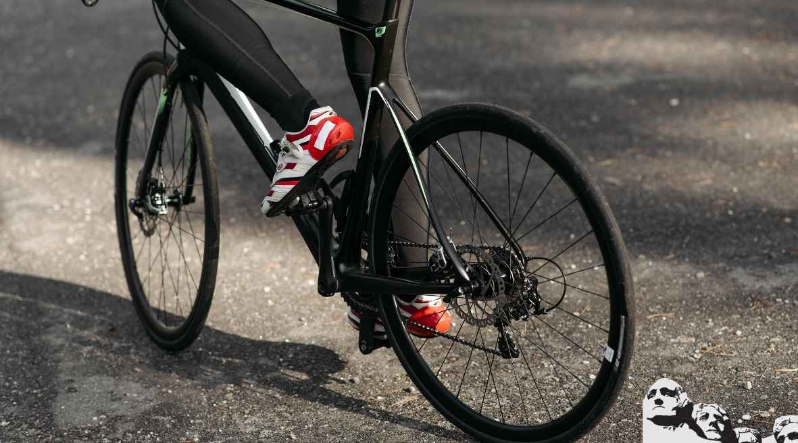
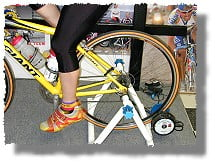
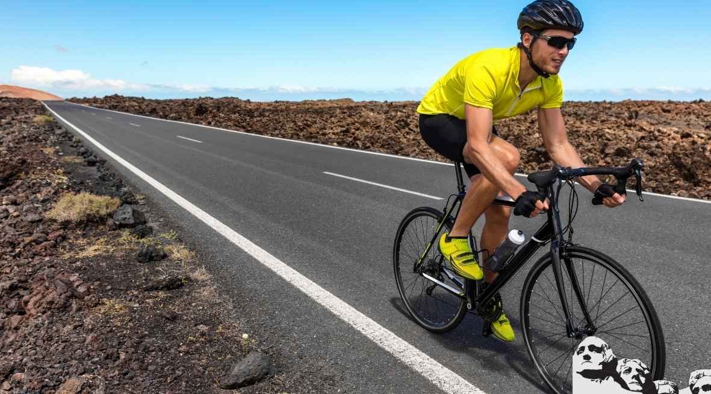
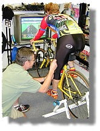
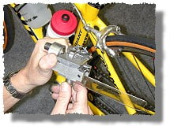

Cycling fitness can be evaluated in several ways: from a simple measure of speed in a time trial to the power delivered to the cranks to metabolic efficiency. But no matter which measure you choose, you will find that your fitness is highly influenced by the way you and your bike fit together.

For that reason, spending time on how your bike fits is an important aspect of your [training](https://mtbnz.com/how-to-train-for-a-century-ride/). Indeed, you might find that an hour or so with a tape measure, a wind trainer and a mirror or video camera may do more for your fitness than a whole month of training.

Few topics concerning bicycles can elicit more varied and passionate responses than bicycle fit. Any number of experts will claim to have the one, true approach and anything else is wrong. There are also some gentler approaches granting that no one rule works for everyone. This article will not attempt to be the final word on bicycle fit, nor will it be an exhaustive examination of the myriad methods for bicycle fit. The best thing to do is to go to a bike shop and seek the counsel of a trained person. In the absence of a trusted tech with a Fit Kit or Serotta Size Cycle to aid you in your quest for a better fit, a few simple tools can allow you to better tap your potential.

Because fit is largely a matter of personal physiology, any formula (including this one) will only get you into the ballpark. To finalize fit, you must fine-tune your position based on what your body tells you you need on rides. A cramped back may mean the handlebar needs adjustment. Sore knees may require a change in saddle height. If in doubt, see a shop with trained personnel.

## How to Attain The Correct Bicycle Fit

The good news is this won't cost a bundle to do. You'll merely need the assistance of a friend, a tape measure, a plumb bob, a few Allen wrenches, a screwdriver, a level and a wind trainer. A metric tape measure is best, but measurements taken in inches can be converted by multiplying by 2.54 to get centimeters. You can jury-rig a plumb bob by taping a piece of string to a small weight like a pen. You should already own the Allen wrenches, which you'll need to adjust saddle height and fore-aft placement as well as stem height. A level is only necessary if you are placing your bike on a wind trainer. If you don't have a wind trainer and can't borrow one, much of this can be done with the aid of a door jamb.

If you are in the process of buying a new bike, it is likely that most companies' stock offerings will work for you once you've determined your seat tube length. A standard 73-degree seat tube angle coupled with a top tube length 1 centimeter shorter than the seat tube works for most everyone. But if you are among those who have trouble finding shirts you can tuck in or with sleeves long enough, you'd do well to find a dealer with a Fit Kit or Serotta Size Cycle.

(For now, we'll assume your shoe's cleats are centered under the balls of your feet and are properly adjusted laterally so as not to induce tension into the ankles, knees or hips.)

The first, most important rule of thumb to be aware of is the one regarding basic frame size. Straddle your suggested size while barefoot and pick the bike up so that both wheels are an equal distance from the floor. For a road bike, 1 inch, or about 2.5 centimeters, is a good starting point.

\[caption id="" align="aligncenter" width="1024"\] One of the most famous examples of bad fit (arched back, cramped upper body from too-short top tube/stem), Irish rider Sean Kelly still managed a record four green jerseys at the Tour de France. Imagine how good he'd have been if his bike fit.\[/caption\]

### Seat Height

Seat height is perhaps the easiest adjustment to make and the most critical dimension on your bike. When the seat is too low or too high, it really impacts your [cycling fitness](https://mtbnz.com/improve-cycling/).

With proper leg extension, you can pedal completely from the hip with relaxed quadriceps. This occurs naturally because the angle formed by the hip, knee and pedal spindle should be greater than 90 degrees during the entire pushing phase on the pedal stroke, so extension at the hip also acts to extend the knee.

If your bike's saddle is too low, this angle is decreased and hip extension torque acts to flex the knee. Consequently, your quadriceps have to work to balance the torque generated by your gluteus maximus and biceps femoris at the hip. The result is a four-alarm fire in your quads and decreased power and efficiency.

Also, the more acute angle at the knee may cause pain just under the kneecap.

There are two dead giveaways for a seat that is too high: low back pain and quad fatigue.

When the seat is too high, your body tries to protect your knees from overextension by extending the ankles and rocking the hips. It's the hip motion that results in low back pain because the muscles that stabilize the lower back fatigue rapidly. This rocking is difficult to identify when viewed from the side but is quite easy to spot from behind.

Simply have a friend ride behind you. Ride either without a jersey or with a very tight one so the motion of your back can be easily observed. If your hips rock from side to side and your spine makes an S shape, the seat is too high.

Be aware that we all pedal differently depending on how hard we are working, so make this observation at the power you ride at most frequently--or the power that makes your back hurt.

Also, if your saddle is too high, you will find that your quads fail before the rest of you. For instance, if the going gets fast and you start to fatigue, ask yourself, "What is failing me first?" If the answer is localized pain in the outside of your quads, then the seat may be too high. Other tip-offs for a high saddle are pain behind the knees caused by overextending the knees to reach the bottom of the pedal stroke and numbness in your hands from using your arms to support your upper body.

All of these effects of low and high seat positions (fatigued quads, sore knees, low back pain and numb hands) compromise your riding but are easily corrected. The fit formulas given at the Colorado Cyclist Web site or in most cycling books (see sidebar) will get you in the general ballpark. Having a friend check to see if your hips are rocking is a good safeguard that you have not gone too high. Lastly, be alert to the symptoms previously listed because we all change our riding style as we gain experience. Remember, the perfect seat height today might not be so good next year.

### Saddle Fore-Aft Position

The fore-aft position of your saddle interacts with both your seat height and the reach to the bar. Seat fore-aft position is usually expressed as the horizontal distance from the nose of the saddle to the center of the bottom bracket.

This adjustment also affects the position of your knee in relation to the pedal, and most bike fitting guidelines recommend that your knee be located exactly above the pedal axle when the cranks are horizontal. They usually describe an iterative procedure that allows you to achieve the correct seat height and the correct fore-aft placement.

This measurement is intended to prevent you from having an acute angle formed by the hip, knee, and ankle (as previously described). As with other recommendations, you should view this as a general guideline and find the fore-aft position that works best for you in conjunction with the other constraints such as seat height and reach to the handlebar.

The type of riding you plan on doing should also be considered when setting up your position. If you plan on doing mostly climbing, you might want to set your seat farther back for greater climbing torque (not power!). Conversely, if you ride flats, time trials or triathlons, you might want to sit more forward so you can get a lower torso position without your knees hitting your chest.

### Reach to the Bar

If you are a beginner, you probably sit squarely on your butt with your pelvis nearly vertical. Over a number of years, you will learn to roll your pelvis forward, hence, your torso position becomes longer and lower. Consequently, the ideal reach from the tip of the saddle to the handlebar changes over time.

Initially, you will probably need a shorter reach to the bar with a higher stem position, but as you gain experience, strength, and flexibility, you will probably want to change to a longer reach and a lower hand position. Attaining the proper reach is further complicated by the fact that most frames are built with similar lengths for the top and seat tube, and many of us are proportionately longer in the legs or torso.

A sure sign that you have outgrown your current setup is if your elbows are bent to a very acute angle and you feel fatigued in your triceps when you are in the drops. The immediate fix is a longer stem, and you might also want to consider a new frame with a longer top tube.

Charlie Tarver, owner of The Hub of Aspen bike shop and one of the founders of the Aspen Cycling School, has an interesting way of selecting frame size for his customers. He uses a combination of body size and years of riding. For instance, if a customer is 5 feet 9 inches and is a beginner, Tarver might recommend a 54-centimeter frame with a shorter mountain bike stem. If another customer is the same size but has been riding for 10 years, Tarver may suggest a 56- or 57-centimeter frame with a longer road stem.

This is a good approach because having a short top tube is safer than having one that is too long. The worst that can come from having a shorter top tube is that you feel a little cramped up and you can't get as aero as you would like. On the other hand, if you go to a longer reach before you are ready, you can run into problems with your neck, back and bike handling. Thus, your own intuition and feeling fatigue in your arms when in the drops are the best indicators that you need to go longer.

Achieving a good fit with your road bike is equivalent in almost every respect to improving your fitness. You will increase your speed, increase your power, reduce your fatigue, [avoid injury and improve your bike handling](https://mtbnz.com/how-can-you-prevent-injury-while-cycling/)\--so train your position. Take a day off from riding and invest time in perfecting your bike fit. The time you spend will be paid back with interest the next time you ride.

#### Signs That Your Seat May Be Too High

1. Low back pain
2. Quad fatigue
3. Quads failing before
4. the rest of you
5. Pain behind the knees
6. Numbness in the hands

#### Signs That Your Seat May Be Too Low

1. Quad fatigue
2. Decreased power
3. Pain under the kneecaps

While most of these road bike fitting methods will get you reasonably close to your ideal position, everybody has individual characteristics that no single formula can take into account.

For instance, the way you use your ankle while pedaling has a huge effect on your effective seat height. A rider who pedals with his heel down requires a much different seat height than someone who pedals in a toe-down style. Therefore, you should use any bike fitment guide only as a starting point, and then finetune the fit to your individual characteristics.

## More Than Comfort

When you have proper road bike positioning, your bike handling improves.

Why?First, your weight will be properly distributed between the seat and the handlebar. This allows your bike to handle the way it was designed to be handled. Your neck, shoulders, and arms will be more relaxed, allowing you to be sensitive to input from the bike and to be more subtle in your steering.Additionally, your field of vision will be improved because of your relaxed neck muscles; thus, you will be able to avoid potholes or other riders well in advance of danger.As you develop a longer and lower position, you substantially improve your aerodynamics. Look at the film of the Tour de France or any of the classics and observe the torso positions of the riders in a breakaway. You will see a very nearly horizontal torso and arms that are fairly stretched out.If you measure these riders in a wind tunnel, you will find that their aerodynamic drags are much lower than that of a novice rider. Consequently, the more experienced you get, the less work you have to do to go fast.

Nothing is more important to the enjoyment of bicycle riding than a bicycle that is properly fit to the rider. It doesn't matter if the rider is a Sunday afternoon pleasure rider or a professional racer; the key to a pleasant experience is fit. I use several complimentary tools to achieve the best fit for your special needs. Those tools include the Computrainer with Spinscan, the FitStick, the Bicycle Fitting System by A Gear Higher, as well as traditional fitting measurement devices such as the goiniometer. I am familiar with the different philosophies of bicycle fitting, including those endorsed by the United States Cycling Federation, the Serotta Size-cycle method, and the Ergo-Fit method. There is no single fitting method appropriate for all cyclists. Each rider is different physically, with different ratios of torso length, arm length and leg length. Two cyclists of the same height and weight can be proportioned in dramatically different ways requiring different bike sizes and different positioning. Medical conditions and other individual factors must also be considered.Recreational cyclists are most often concerned about comfort. The majority of their comfort concerns can be dealt with by proper positioning on the bicycle. The common complaints include discomfort in the seat, the back/neck, the hands and the feet. For the recreational cyclist proper adjustment of the bicycle to the rider can also help avoid physical injuries that can occur from improper positioning. Most people will attempt to ease their pains by moving the seat or handlebars in ways that will only make things worse. Performance-oriented cyclists will attain the maximum performance possible through the optimal positioning for their specific events and needs. Road racers, triathletes, mountain bikers, time trialists, and track riders all have different positioning concerns. Each cyclist is an individual and as such I take into consideration their performance needs, individual physical characteristics including medical considerations, while finding the optimal balance of aerodynamics and bio-mechanical efficiency for the specific cycling sport. 

Proper positioning begins at the pedal-shoe interface and this is particularly important with modern clipless-pedal systems. Consequently all fittings begin with insuring that cleat placement (fore-aft, in-out, supination-pronation, and varus-valgus angle. This is normally the most time-consuming portion of the fitting. It is also one of the most important adjustments to minimize injuries to the knees and other joints.

Once the pedal-shoe positioning has been properly set, the proper height, fore-aft placement, and angle of the seat are determined. Seat height and fore-aft placement are interrelated and changing one requires adjustment of the other.

I then determine the correct size and positioning of the handlebar and stem. Proper stem length and angle as well as handlebar width and drop are established. Because it all must work together as a whole and each of these effects the rest, changes in one component often require adjustments of the others. A change here requires a change there.

Because it all must work together as a whole and each of these effects the rest, changes in one component often require adjustments of the others. A change here requires a change there.
