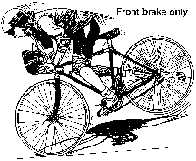
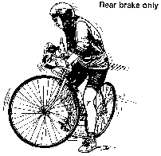
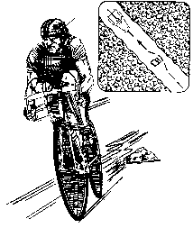
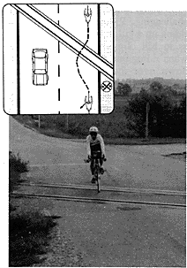
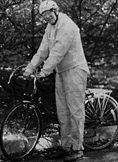

You're anxious to get out there and start enjoying your bike. Sure, anybody can ride a bike, but learning to pedal efficiently, to stop quickly, and to handle difficult situations takes preparation and practice.

Here's a short introduction to riding techniques that will help you enjoy biking more.

## 1\. Bike Braking Tips

Sounds simple, and it is. You just squeeze the brake levers. What many bicyclists don't know is that the front brakes provide more than 70% of the stopping power.

However, if you only apply the front brake, you run the risk of flying over the handlebars when the front wheel stops suddenly.

Squeezing the rear brake too hard will cause the rear wheel to [lock](https://mtbnz.com/best-lightweight-bike-locks/) and skid. To get the feel of using the front and rear brakes, practice at slow speeds and you'll soon understand what each of your brakes can do together and separately.

Braking on downhills is a different situation. You want to slow your descent, but not stop. Your first thought may be to apply the brakes lightly all the way down the hill.

Don't do it.

Friction will heat the brake pad and wheel, possibly causing a tire blowout or ruining the brake pads and leaving you brakeless. On long downhills, brake in short bursts, a few seconds on, a few seconds off. This prevents heat buildup along the wheel.

Coaster brakes are common on single speed bicycles. This type of brake is housed out of sight in the rear wheel hub (the center area where all the spokes come together). Coaster brakes are operated by pedaling backward.

There are no hand levers, and there is no front brake, though some bicycles come with front hand operated brakes and rear coaster brakes. Coaster brakes don't stop a bike as quickly as front and rear hand operated brakes, but they don't lose their stopping power in wet weather as hand brakes do.

## 2\. Bike Gearing Tips

Unless you own a single speed bike, you have to face the gear question -- when to change, and why?

Gears are simply a way of helping you pedal up hills and on flat terrain with a minimum of effort.

Multi-speed bikes come with a range of gears ("speeds") expressed in inches. Larger numbers (70 - 100 inches) are high gears for easy conditions such as flat terrain and downhills. Low numbers (20 - 40 inches) are low gears for more challenging conditions, such as pedal ranging up hills and into headwinds.

Most bikes have from 3 to 18 gears, depending on the model and its intended use. Three-speed bikes have the gears housed in the hub of the rear wheel.

Bikes with 5 to 18 speeds have devices called derailleurs that move the chain to a different sprocket each time you shift gears.

The number of gears you have depends on the number of different sprocket combinations on your bike. For example, a bike with one front sprocket (near the right pedal) and five rear sprockets (on the rear wheel) is a five-speed (1 x 5). A bike with 2 front sprockets and 6 rear sprockets is a 12-speed (2 x 6).

To change gears on a derailleur bike, simply ease up pressure on the pedals but keep them spinning, and move the gear shift lever. The chain will move to a new gear. If the chain clanks and grinds, move the lever slightly while still gently pedaling. When the noise stops, resume pressure on the pedals.

A 5-speed bike has one shift lever for the rear sprockets.

Bikes with 10 or more speeds have two shift levers one for the front sprockets and one for the rear sprockets. Shifting the chain towards the bike makes pedaling easier, and shifting away from the bike makes it harder to pedal.

When you shift in the front, it makes a bigger difference than shifting one sprocket in the back. On a three-speed bike, coast as you move the shift lever. The bike will go into a different gear. You won't see anything, but pedaling will either get easier or harder.

At first, it seems to take forever to change gears, but after a little practice, you'll be doing it quickly and smooth smoothly. When to change gears is a more different question. It's best to shift into a lower gear before pedaling becomes hard.

You can usually anticipate this. For example, you may want to shift to a low gear at the bottom of a hill before you begin climbing, or switch to high gear as you coast to the bottom of a hill and are about to begin pedaling again.

## 3\. Bike Pedaling and Cadence Tips

Once you've mastered changing gears, you're ready to develop a smooth, efficient riding style. Understanding pedaling technique and cadence - pedal revolutions per minute (rpm) - will send you over hill and dale with the least effort.

Don't worry about cadence at first. Just try to pedal smoothly. Keep the ball of your foot on the pedal and your legs parallel to the frame (don't let your knees stick out).

As you reach the bottom of the pedal's circle, flex your ankle so your toe points toward the ground and push the pedal back. This gives the pedal an extra push and helps distribute the effort of pedaling between your leg muscles.

Toe clips that attach to the [pedals](https://mtbnz.com/best-mountain-bike-pedals/) and hold the rider's feet firmly in place make it easier to maintain a steady cadence. Toe clips are used by most experienced bicyclists because they make pedaling more efficient by limit ranging side to side foot movement. However, toe clips do take some getting used to. Be sure to practice with them in a no-traffic area before riding in traffic.

You are riding most efficiently when you pedal along at a steady cadence. To check your cadence when riding, use the second hand of your watch and count the number of pedals turns you make in 60 seconds. Racers usually manage 90 or 100 rpm, while cyclists who are riding for fitness usually aim for 60 to 90 rpm. Put your bike in whichever gear lets you keep up the cadence.

Many cyclists mistakenly think that pedaling hard in a high gear is a better exercise than pedaling easily in a low gear. They huff and puff along in high gear, knees cracking and muscles straining. You'll get just as much exercise, and enjoy riding more if you switch to a lower gear and pedal faster. Your knees will thank you.

Keeping up a steady pace at a constant cadence is less tiring for you. It's also easier for motorists to understand your intentions. The pedal-coast, pedal-coast appropriate approach many bicyclists use leaves drivers wondering if you're slowing down to stop or turn.

## 4\. Bike Emergency Maneuver Tips

There's plenty to watch out for while you're riding - potholes and stones in the road, other vehicles darting in front of you, dogs, railroad tracks, a patch of gravel on the road.

Your best bet is to see these hazards early enough to avoid them safely. However, knowing a few emergency maneuvers will help you handle problems that come up quickly or unexpectedly.

Emergency maneuvers aren't difficult, but because they involve acting quickly, you should practice them at slow speeds away from traffic so you can do them easily when necessary.

### Dodging obstacles

In most cases, looking ahead for hazards will give you plenty of time to safely avoid them. You can check around for traffic and correct your course to ride around the hazard.

But what happens if you don't notice a rock or glass until you've almost reached it? Here's an approach that can get you safely out of this situation:

- Just as you reach the hazard, turn the front wheel sharply away from it. - Quickly turn the front wheel in the other direction as it passes the hazard.

- Straighten out your course. Using this method, you can quickly dodge an obstacle without veering off your path into other traffic. The obstacle dodge does require some skill, so be sure to practice it away from traffic, perhaps using sponges or pieces of plastic as the road hazards.

### Emergency turns

If a car unexpectedly turns across your path, you may need to make a very fast turn to avoid a collision. To make an emergency right turn, sharply steer the handlebars to the left, and then quickly back to the right.

Steering left first forces you into a deep right lean much faster than if you simply leaned right and turned. As a result, you can move into the fast, tight turn that emergency demands. See our guide on [countersteering bicycle](https://mtbnz.com/countersteering-bicycle/).

Making an emergency left turn works on the same principle. Steer the handlebars sharply to the right, and as you lean well to the left, steer quickly left to complete your turn. As with the obstacle dodge, you'll want to practice this skill often off the road so you can do it automatically if you need to.

### Emergency stops

Be sure to apply more pressure to your front brake. It will help you slow the bike if, as you brake, you push yourself backward on the saddle, fighting the momentum that wants to push your body forward over the handlebars.

Slippery spots, such as oil or pave pavement markings, should be approached with care. Go around them if you can. If you have to go through a slippery spot, coast through the problem spot if possible to prevent skidding. Don't brake, pedal, or turn unless it is absolutely necessary. If you must, act as if you riding on eggs - be very gentle.

Gravel on the road can cause a bike to skid and slide. When riding through gravel, go slowly, in a lower gear than is necessary on the pavement, and turn slowly.

Railroad tracks can tip you over if your wheel gets caught in the groove beside the track. To avoid this, appropriate approach the track slowly and straight on, never at an angle. If the tracks cross the road at an angle and you can't maneuver to approach them straight on, get off and walk your bike over the tracks.

Bike-chasing dogs are a fact of life in the country. You can usually outrun them because most dogs stop at the edge of their territory. Or you can slow down, quit pedaling and coast. Many dogs are attracted by the motion of your feet as you pedal, and if you quit pedaling, they lose interest.

Some times a sharp "NO" or "STAY" is enough to send a dog home. Some cyclists carry a squirt gun full of am ammonia water or similar dog repellent to discourage troublesome dogs. If all else fails, stop, dismount, put the bike between you and the dog and walk slowly away. Usually, stopping and getting off the bike causes dogs to lose interest.

## 5\. Tips for Riding Your Bike in Difficult Conditions

Rain, cold, wind, dark. These conditions can make it hard to see and be seen. They can hide potholes and other road obstacles. They can make you wet, cold and miserable. But you can ride safely and even enjoyable if you use caution and follow these suggestions:

#### Ride slowly

Wet wheels need a much longer braking distance to stop. Allow extra time and space to brake. In wet weather, try braking gently every few blocks to clear water off the wheels.

#### Being visible is extra important in darkness, fog, and rain

A bright yellow low rain jacket or rain suit helps keep you visible on gray rainy days. At night, in addition to your [headlight](https://mtbnz.com/best-mountain-biking-lights/) and reflective tape on helmet and clothing, use a red tail light and extra reflectors on the bike to make yourself more visible.

#### Wear appropriate clothing and get [mud fenders](https://mtbnz.com/best-mountain-bike-fenders/) for your bike

For cold, wet weather, rain suits are a good idea because they keep out both water and wind.

Don't use a long poncho for riding in the rain. It acts like a sail in the wind and can get caught in the bike's moving parts. It can be cool on a bike, especially coasting downhill, so windproof outer clothing is important on cool days.

A bright-colored nylon windbreaker worn over a sweater is a good combination.

Biking in cold weather increases the windchill factor, so you'll need to keep hands, feet and head warm. Take [gloves](https://mtbnz.com/best-mountain-bike-gloves/) and a [cycling balaclava](https://mtbnz.com/best-cycling-balaclavas-winter/) (a light knit one fits under [helmets](https://mtbnz.com/best-mountain-bike-helmets/)) with you on cool days even if you think you won't need them.

Windy conditions can be very challenging. Riding into the wind, like riding up a hill, takes extra effort. So, as in hill climbing, use a low gear when riding into the wind. Also, tuck down over the handlebars so your body doesn't catch the wind. If you're riding with a strong crosswind, try leaning slightly into it, and you won't get blown around as much.
