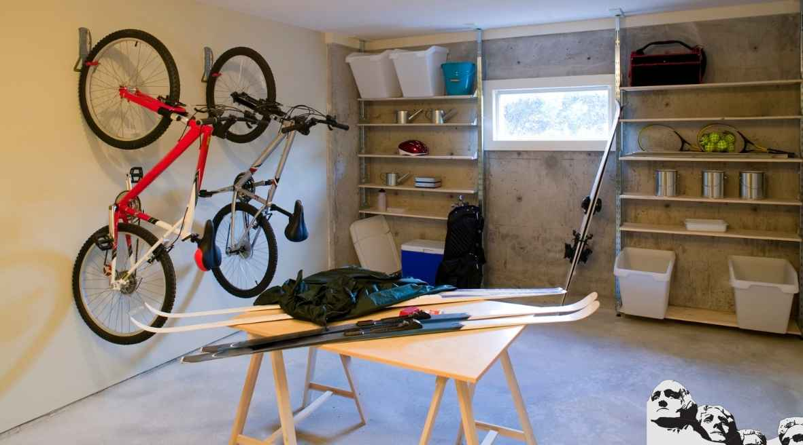
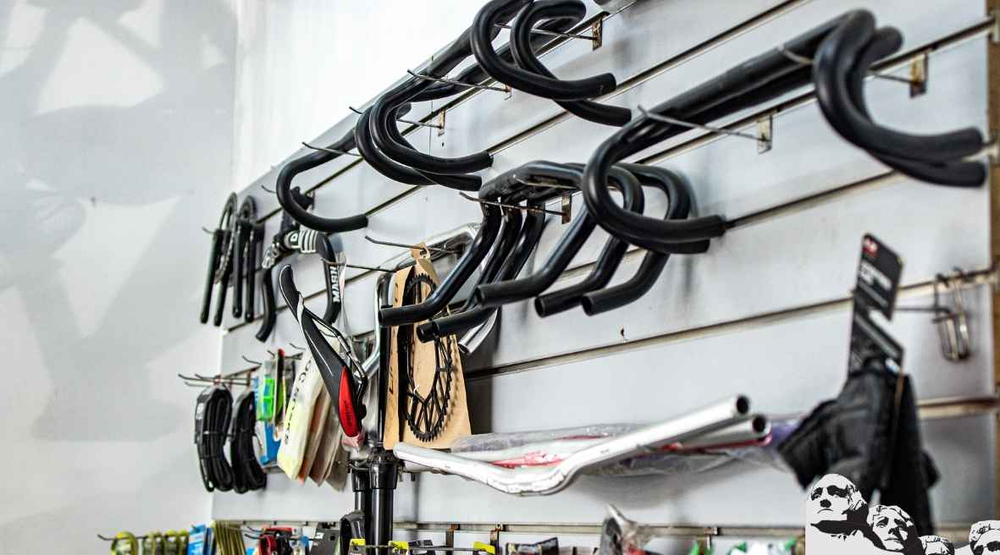
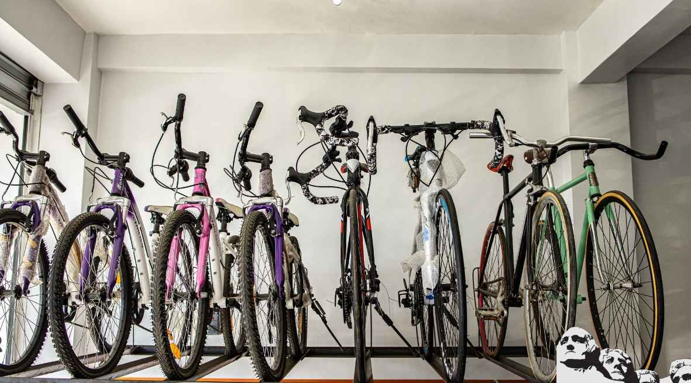

If you ride a bike, for sport or transportation, you'll need to address the subject of bike storage. You'll be more inclined to ride if it is easy to get your bike down to the street every day. Bikes weren't meant to be hung inside an apartment, never to see the pavement.

To be sure, you won't want to make a special trip to a storage locker or lug your bike down flights of stairs every morning. It's tempting to leave it outside, where it's ready to ride the next day. But, depending on your neighborhood, even a bike secured with the [best bike lock that money can buy](https://mtbnz.com/best-lightweight-bike-locks/) might not be there the next day.

If you want to be doubly sure that your bike will be there when you need it, you should keep it behind locked doors, and even lock the bike itself, . If you can put it somewhere where it can't be seen from the street, that's all the better. Porches and open garages are places that thieves target.

Your bike should also be protected from freezing and moisture.

- If you keep your bike outside, make sure it's under a deck roof, or cover it over with a tarp.
- If you bring it inside, use newspaper to catch any drips, if you've been riding in wet weather.

## Storing Your Bike Indoors

If you live in an apartment, you probably know that most bikes will fit inside elevators so you can take them up with you, but it may take some maneuvering to allow others in the elevator with you.

Some building managers and owners will provide you with designated bike storage areas. These areas will probably not be upstairs where you might prefer them, though, because the manager doesn't want you dragging in mud, rain or salt. And some managers may not allow bikes on elevators. If they offer you a place inside a parking garage, that may work, as long as the lot is locked and/or patrolled.

Make sure that you accommodate your bike-less neighbors when you store a bike. They don't understand why you use your bike so frequently and why it needs to be in a protected area. You can even offer to pay a partial car space payment, to keep your bike in the building's garage.

Whether you store your bike and equipment in a room of your house, or in a garage, it doesn't have to look dirty and messy. Clean your bike after you ride in bad weather, and keep the storage area convenient and attractive. In this way, your bike will be out of the way yet easy to get to.

Bicycle storage can be done in different areas, under different situations. A bike can be stored in a hall closet, or on a hook hung from the ceiling in a garage. You can buy racks that mount on the wall, and hold your bike at a convenient height. If you do minor repairs yourself, keep your other equipment and tools close by, so they are there when you need them. Bike storage doesn't need to be a headache if your location is well-planned-out and you keep it neat and clean.

## SIX SMART BIKE STORAGE METHODS

Living in an apartment might mean having to cope up with the small space available. Besides, you won’t have space for a car, making bikes your only option. Most cyclists admit that bikes are Eco-friendly and convenient, however, thieves are always looking for an opportunity to steal your bike. Luckily, we’ll compile some bike storage techniques you could use to store your bike indoors. You’ll no longer have to worry about your mountain bike getting stolen.

In this piece, we’ll look at both permanent and non-permanent bike storage methods. Also we’ll highlight some of the **cheap ways to store your bike** on the floor.

## **Horizontal Racks**

This method works best where the width of your house is small. When using these racks, you can hang your bike firmly at a horizontal position. Some of the options you might consider include foldable hangers and adjustable hooks designed to fit various frame types.

\[caption id="attachment\_158" align="aligncenter" width="560"\] Bike Storage\[/caption\]

## **Vertical Racks**

In case you are looking for a permanent way to store your bike, vertical racks might be an ideal choice. Incredibly, you can store several bikes together using these awesome racks. A vertical rack allows you to hold your bikes by their wheels. These **bike racks** come in form of hooks that are able to thread into a ceiling beam, wall plug or wall post.

\[caption id="attachment\_159" align="aligncenter" width="564"\] Bike Racks\[/caption\]

## **Hoists**

Hoists provide you with a solution to store your bike indoors. In fact, it might be suitable to those with plenty of wall and ceiling space. Apart from storing your bikes, you could still use the system for hanging ladders and kayaks.  This bike storage method might involve a lot of installation processes as compared to mounting fixed racks. For those who don’t use their bike often, hoists might be a suitable option for you.

## **Free Standing Racks**

Free standing racks are easy to install and use; you just require placing it at your favourite position and you’ll be good to go. They have a heavy tripod base that supports the pole to place your bikes. The main problem about these stands is that they do not give a clean look. If your crib does not have a solid ceiling, you could simply go for a free standing rack.

## **Ceiling-to-floor rack**

This bike storage method provides you with a temporary method to store your bike safely. The rack comes with a pole that clamps in between the ceiling and floor. The pole has some hooks that will hold your bike(s) in a firm position. It is an ideal solution for cyclists living in rental properties.

## **Cycloc Bike Storage**

The cycloc system allows you to hang your bike on the wall vertically or horizontally, based on your needs. The key advantage of the Cycloc Bike storage is that it is designed to fit various bike frames. A Cycloc device has an elegant design and enables you to lock your bike securely to mounts.

## Conclusion

We hope that the information above will help you choose the best method to store your bike indoors. Pedal power lovers no longer have to worry about the safety of their bikes. If you are looking to Invest in an awesome and durable storage outdoor cover, read our [**best bicycle cover**](http://mtbnz.com/bicycle-covers/) reviews

 

 

 

Save

Save

Save

Save

Save

Save
