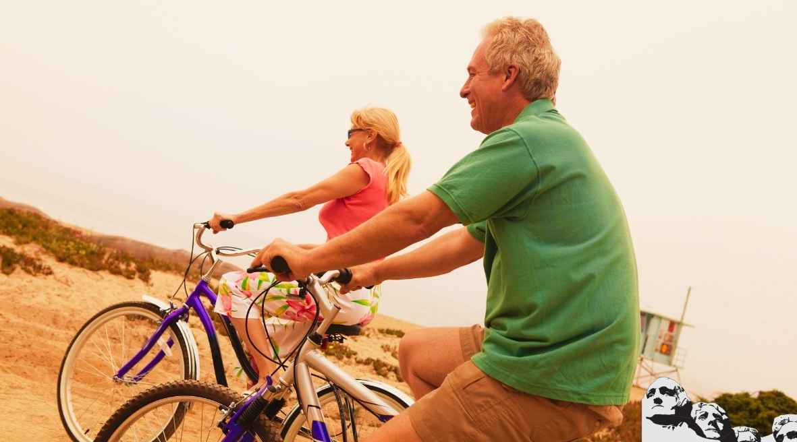

# **What are the benefits of cycling?**

Cycling has long been used in many countries around the world but very few people know the actual benefits of cycling other than having fun. In recent years, cycling has become one of the most preferred means of transport especially in major cities due to traffic. This article will focus on the key benefits of cycling to work and cycling as a sport.

1. **Cycling increases brain power**

Researchers have found that physical exercises such as cycling can greatly improve your cardio-respiratory function, which in turn enhances your mental activity. Regular exercises are said to boost blood and oxygen flow to the brain thus triggering the renewal of cells that are responsible for memory.

2. **Increases Stamina**

Not only does cycling increase your morale but it also increases your stamina. How? Look at it in this perspective, the more you ride your bike the more you’ll be able to sustain long rides with little or no rests. Turning your occasional rides to exercise routines will greatly improve your stamina levels.  And with the elevated levels of stamina your body will have an improved composure and resistance against environmental elements.

3. **Builds Muscle Mass**

Generally, cycling is perceived as an activity that only targets the leg muscles but research tends to disagree with this notion as cycling targets almost all muscles of the body. And although cycling involves a lot of pedaling it does not necessarily mean that it will only help in toning your calf and thigh muscles. In fact, cycling involves many parts of the body, for example, when cycling your arm muscles will also be involved in maintaining balance.

In children, cycling improves their overall muscle and bone health, it is even said that muscle health is directly related to biking. This can be attributed to the [aerobic fitness](https://mtbnz.com/is-biking-aerobic-or-anaerobic-exercise/) and increased flexibility associated with cycling.

4. **Weight Loss**

In recent years, many people have embarked on weight loss and fitness but most of these ignore some of the simplest and easiest ways of losing weight. A good example is cycling which is very easy and very efficient in burning excess calories. Cycling will not only be fun but also engaging, you will involve almost all muscles of your body. This way, you will not a reduction in weight coupled with improved health. Cycling will help you maintain a lean structure regardless of your age.

5. **Increases Longevity**

Cycling will significantly improve your health and better health means a higher lifespan. Cycling will not only improve the health of your heart and lungs but will also improve blood circulation. It is considered to be an ideal exercise for seniors.

It could be a good idea to start cycling to work instead of riding to work especially if you are elderly. A study conducted in King’s College London showed that those who cycle regularly are 9 years ‘younger’ than their counterparts who do not cycle. This was after factoring in smoking and Body Mass Index (BMI).

Exercising regularly also reduces your chances of conditions such as type two diabetes, obesity, high blood pressure, cardiovascular disease and even cancer. Simply, the body becomes effective in defending itself against diseases and also regenerating new cells.

Cycling has so many benefits, which couldn’t fit in this article; you just have to grab a bike and start enjoying the numerous benefits of cycling and have fun while at it.

Save
