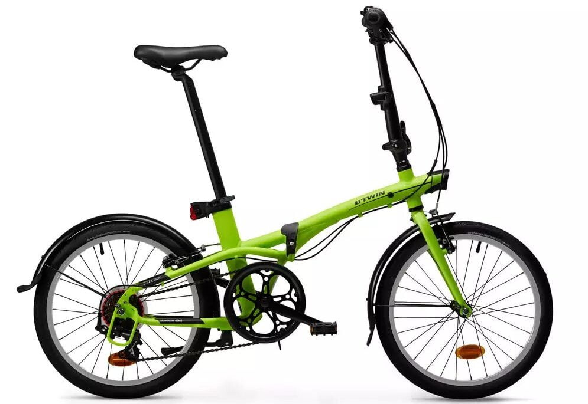

In this Decathlon B'twin Tilt 500 review, you’ll find out how this bike just might transform your riding experience.

If you’re looking for an easy transport solution, convenient storage, and security, then the Tilt 500 is a great choice. This is one bike that’s expertly designed to last and sustain many years of use without falling apart.

Best of all, you have the choice between the 20” and 14” models.

## Decathlon B'twin Tilt 500 20”

This 20” model has many similar features as the 14” model, with minor differences.

As you may know, folding bikes aren’t designed for rough use or racing, but that doesn’t mean they are fragile. The makeup of the Tilt 500 is very similar to some of the toughest bikes available. It actually uses many of the driving mechanisms and materials that you may find in MTBs.

Clearly, this is a tough, long-lasting machine.

https://www.youtube.com/embed/Ze5uFdegCsQ

However, you probably shouldn’t give away your MTB to solely rely on the Tilt 500.

This bicycle is meant for commuting – not high performance riding. It will deliver many  
years of use only if you use it right. Taking it through rough terrain will  
certainly cut down its lifespan.

Its design is specifically meant to deliver convenience more than high performance.

More importantly, it’s not overly complicated, making it cheap to maintain. That’s  
something you’ll be grateful for when you need to quickly fix an issue before your  
commute to work.

Here are thecritical features to consider.

### The Frame

The bike's 6061 T6 aluminium alloy frame produces a sturdy and lightweight machine.

Perhaps the most attractive feature of this product is its simple side-folding system. Yes! You can fold up the bike using a lever to make it portable for places where you cannot ride.

Additionally, the unique folding system ensures that the Decathlon B'twin Tilt 500 takes up minimal space in a camper, car boot, your office, or your home.

You simply fold the pedals up and push the stem down.

Thereafter, it only takes fifteen seconds to unfold and convert it from a luggage piece to a bicycle. 

Here are the measurements for the folded and unfolded forms:

-           Folded (L/ H/ W): 30.7" x 26" x 15"
-           Unfolded (L/ H/ W): 57.5" x 42.5" x 23"

### The Fork

Since the folk or front suspension takes most of your weight, it makes sense for any bike manufacturer to consider the strength of the material used to make this component.

That’s why the Decathlon B'twin is made of Hi-ten steel to enhance the fork’s strength and durability.

### Drivetrain

The drivetrain comprises of the derailleur, cogs, cranks, pedals, chain, and chainrings.

As the name suggests, this is the machine’s driving power source. It is equivalent to a motor vehicle drivetrain which powers transmission to the drive axles.

The B'twin Tilt 500 drivetrain has Shimano 7-speed derailleur gears which are custom-made to adapt to different ground levels with a subtle degree of automation.

Besides matching your cycling effort to the gradient, the drivetrain is set to accelerate in a straight line and slow down fast as you approach sensitive intersections like traffic lights. All thanks to the Shimano Revo-Shift shifter which is highly efficient and precise.

### Brakes

This bicycle features steely V-brakes and callipers to give you a secure, safe, and systematic braking system. The callipers are quite rigid because they are forged from aluminium to facilitate enhanced power transfer within the braking system.

Generally, these callipers are compatible with frames and forks with the V-brake pivot bolts.

### Handlebar, Stem, and Steering

The B'twin Tilt 500’s steely low-rise bars will definitely appeal to you.

They feature a rise of 60 millimetres to enable you to adjust your body position for comfort and convenience. Also, these handlebars measure 560 millimetres, which is wide enough to keep your armpits from sweating.

The bike also comes with a fixed aluminium stem with a quick-release lock that adds to its stiffness. This gives it a greater advantage over height-adjustable stems.

Depending on your saddle adjustment, the saddle and the bottom bracket are separated by 480 millimetres to 780 millimetres. And the handlebar and saddle are 540 millimetres apart.

### Saddle and Seat Post

This bike features a rather [comfortable saddle](https://cyclinghobby.com/mountain-biking-read-this-extensive-guide-before-you-start/) that is seamlessly covered to prevent water from slipping into the foam. What’s more, no thief can dismantle and walk away with the seat because it is mounted on a fixed post.

The fixed seat post has a 31.6-millimetre diameter.

### Wheels and Tires

The 20-inch rims accommodate 20-inch x 1.75-inch tires.

These tires are quite light to enhance their grip and performance.

### Accessories

Some of the accessories you can expect include:

-           A double chain guard which keeps the chain from slipping out of position as well as protecting it from dirt
-           Mudguard with stays
-           Foldable bike’s pannier rack
-           Rear and front reflectors

Overall, here are the key advantages and downfalls of the bike.

**Pros:**

-         Lightweight (weighs 12.9 kg)
-           7 speeds
-         A compact foldable design
-      Lifetime warranty on the handlebar, frame, rigid fork, and stem
-         Durable and rust resistant

**Cons:**

- One rider complained about noisy breaks which seems like a rare occurrence

## Decathlon B'twin Tilt 500 14”

The B’twin Tilt 500 14” folding bike  is a close variant of the 20” model. Of course, with the main difference being the size. However, there are several other differences and overlapping advantages, as we shall see in the following review.

### The Fork and Brakes

Like the 20” Tilt 500 folding bike, the 14” version features a 6061 T6 aluminium fork which  
is tough yet light.

The featured V-brakes and aluminium callipers are not only light but highly effective in  
enabling you to brake progressively.

Actually, themajority of mountain and race bikes use this type of brake.

Why is that so?

Because of the remarkable advantages, chief among them is that it’s efficient, inexpensive,  
and lightweight.

### Handlebar, Stem, and Steering

The 14-inch version has a 540-millimetre wide handlebar, unlike the 20” Tilt 500 folding bike that has a 560-millimetre wide handlebar.

Made of pure Aluminium, the semi-raised handlebars enjoy a 60 millimetres rise allowance. This enables you to adjust the steering to a suitable body position, and for improved handling.

The Aluminium folding stem features a fixed height to give it more rigidity too.

The distance from handlebar to the saddle is 400 millimetres, while the space between saddle and the bottom bracket measures 480 millimetres to 700 millimetres.

### Saddle and Seat Post

The bicycle features a fixed, theft-proof aluminium seat post measuring 31.6 millimetres in diameter. And the saddle is quite comfortable. It’s made of seamless foam, to prevent water from seeping in.

### Compact Design

So much bulk is reduced once this machine is folded.

Once you fold the pedals up and the stem down, it becomes so easy to store in your car boot since it takes very little space:

-           When folded (L/ H/ W): 23.6" x 26" x 15"
-           Unfolded (L/ H/ W): 45.7" x 42.5" x 22"

### Wheels and Tires

The wheels are made of 14" aluminium rims which are light enough to give adequate propulsion.

One feature that gives these tires an edge over ordinary bikes is the skin wall city tires with a robust, puncture-proof coating. They are made light to enhance performance with a sustained grip on the road.

Moreover, this bike’s aluminium chain set is designed for low weight and dynamic propulsion.

### Accessories

Some of the accessories that you can expect are:

-           Rear carrier
-           Bike bag
-           Basket
-           Kickstand
-           Mudguard with stays

Based on all those features, here are the key advantages and disadvantages of the 14” model.

**Pros:**

-           It's light (weighs 9.8 kg)
-           A lifetime warranty (on the bicycle frame, stem, rigid fork, and handlebar)
-           Puncture-proof coating

**Cons:**

-           More favourable to shorter riders

## B’twin Tilt 120 Folding Bike

If you have been looking to buy a B’twin Tilt 500 bike and for some reason were unable to get it, the Tilt 120 would be a perfectly good fall-back option.

In its own right, the Tilt 120 is a good addition to your list of intermodal transport.

It supplements the other regular means of transport, including trains, cars, buses, and others. This model, just like the Tilt 500, has all you need for those frequent short errands.

Have a look at these remarkable features.

### Frame

It features a Hi-Ten steel frame with a simple lateral fold system that allows the bike to occupy minimal space in your boot, office, or home.

You’ll hardly notice it even in small spaces.

To enhance your folded bike's stability, the frame has a bike stand beneath its base.

The fork is also made of Hi-Ten steel to give you a solid and durable product.

### The Drivetrain

Unlike the Tilt 500 which has a 7-speed derailleur, the Tilt 120 comes with a 6-speed derailleur.

You can change gears very easily using the grip shifter. It has a 52-teeth chain wheel that is supported by a 6-speed Shimano TZ20 14/28 freewheel.

Here are the gear’s meters of development (how far your bike travels every time you complete one revolution on the pedals):

-           Least development: 2.96 meters – twenty eight teeth
-           Largest development: 5.9 meters – fourteen teeth

### Brakes

Without good brakes on any vehicle, you’ll be facing potential calamity.

Fortunately, this bike comes with robust steel V-brakes to deliver, effective, timely, and progressive braking.

### Compact Design

This bicycle’s size is reduced significantly once you fold it.

When folded, the bike measures 36 centimetres wide – definitely taking up very little space. Therefore, you can comfortably store it against the wall in your office or bedroom after folding the pedals up and the stem down.

Here are the dimensions to expect:

-           Folded (L/ H/ W): 78 cm x 66 cm x 36 cm
-           Unfolded (L/ H/ W): 144 cm x 112 cm x 58 cm

### Handlebar, Stem, and Steering

The handlebar width is 560 millimetres, just like the Tilt 500. And it rests on a fixed aluminium stem. It also features steely bars that can rise to 60 millimetres to adjust to a position that gives you an easy time handling the bike.

The space between the saddle and the bottom bracket is a minimum of 520 millimetres and a maximum of 740 millimetres.

This bike measures 540 millimetres from the handlebar to the saddle.

### Saddle and Seat Post

The saddle is comfy and seamless to prevent moisture getting in.

It also has a well-made seat post with a diameter of 31.6 millimetres.

### Wheels

The 20-inch x 1.75-inch gum wall city tires rest on 20-inch single-wall rims.

The Tilt 120 has a wheel restraint feature that allows you to ferry and store the folded bike much more easily.

### Crankset

To ensure that your chain is free from dirt, and doesn’t slip and fall off, it has a 170 millimetre double chain wheel guard.

The bike also comes with various accessories and equipment, including:

-           Rear and front battery powered lights
-           B’twin pannier rack (for folding bikes)
-           Tilt transport cover

Unfortunately, it doesn’t support a child seat.

### User Size and Weight

This bike is geometrically designed to give maximum comfort for users with a height between 1.45 meters and 1.85 meters.

It perfectly meets the ISO 4210 standard requirement for a cyclist who weighs approximately 100 kg.

To sum it all up, here are the key benefits and disadvantages.

**Pros:**

-           A lifetime warranty on the handlebar, rigid fork, stem, and frame
-           Lightweight (weighing only 14.5 kg)
-           Very compact
-           Takes only 30 seconds to unfold
-           The frame is 100% steel
-           Sturdy and durable

**Cons:**

-           Not compatible with a child seat

## Final Verdict

Based on this Decathlon B’twin Tilt 500 review, it’s clear that this bicycle has all the features you would expect in the best folding bike.

Some of the features that a great folding bike would have include smaller wheels which are lighter, and more manoeuvrable. These allow your bike to fold down much smaller.

Also, in a few seconds, you can turn it from a bike to a compact storage form. The convenience and quick conversion makes it valuable when transitioning from riding mode to travelling in a bus or train.

The brightly coloured versions add an extra layer of safety too.

Visibility is critical to bicycle rider safety on the road. Therefore, having conspicuous colours not just on your clothes but also on your bike can have a major positive impact.
