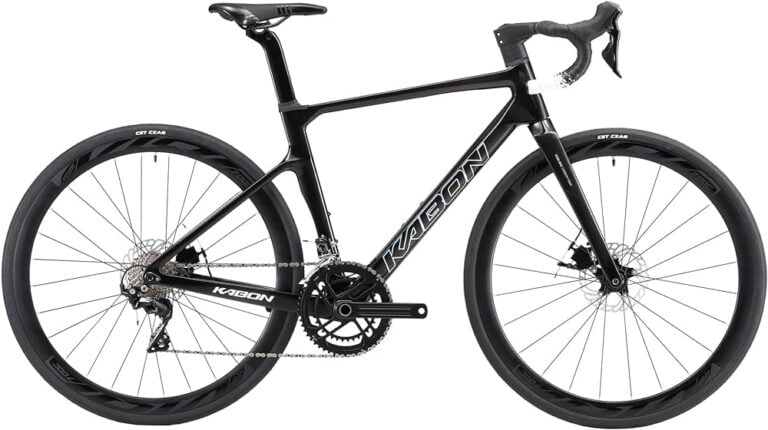
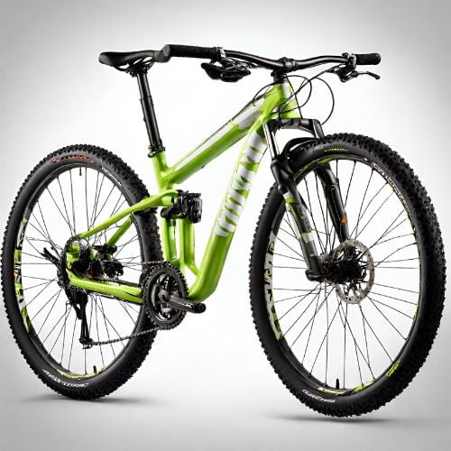
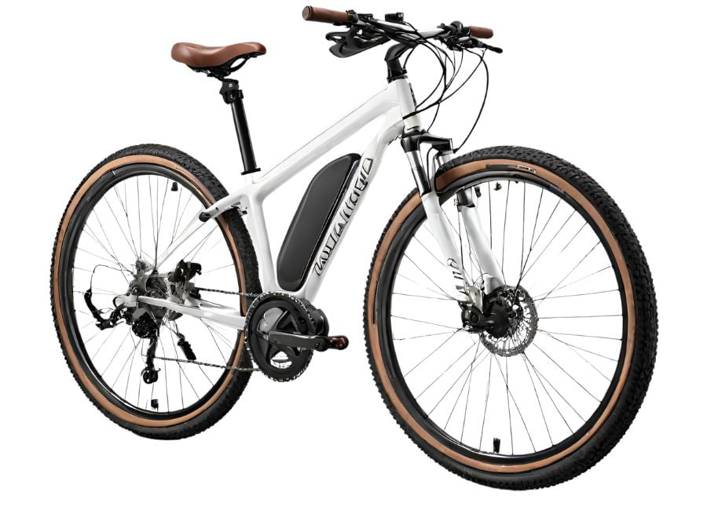
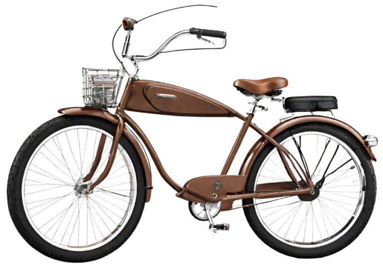

Have you ever been shredding some sweet singletrack and come across another rider absolutely sending it on a wild-looking bike? With so many different types of bikes out there, it can get confusing trying to figure out which rig is best for your riding style.

We're not just talking about your standard mountain bikes or road bikes. Oh no, we're going to explore the whole spectrum, from the dialed BMX bikes to the sleek and speedy triathlon bikes, and everything in between.

You might be thinking, "Why do I need to know about all these bikes? I just want to hit the trails!"

Well, knowledge is power. Understanding the different types of bikes can help you choose the right one for your riding style, terrain, and goals. Plus, it's always fun to learn something new, right?

So, strap on your helmet, grab a bottle of water, and get ready to embark on a two-wheeled journey through the diverse world of bikes. Let's roll!

Show Summary

Bicycles come in a variety of types, each designed for specific uses and terrains. Here are some of the most common types of bikes and their uses:

1. **Road Bikes**: These are designed for speed and efficiency on paved roads. They have smooth, skinny tires and drop handlebars, making them ideal for on-road racing and long-distance rides on smooth pavement.
2. **Mountain Bikes**: These are designed for off-road use, particularly on rough terrains. They have wide, knobby tires and a low gear range for pedaling up steep trails. Most mountain bikes have some type of shock absorbers or suspension to handle rough terrains.
3. **Hybrid Bikes**: These bikes combine the advantages of road bikes and mountain bikes. They are designed for casual riding, short-distance commuting, and errands around town. They can be ridden on paved roads and are also suitable for unpaved trails.
4. **Cruiser Bikes**: These are designed for casual riding with a very comfortable, upright riding position, and a large, comfortable seat. They are ideal for leisurely rides around the neighborhood or bike paths.
5. **City Bikes**: These bikes have characteristics of both a hybrid bike and a cruiser bike. They are designed for regular use in city environments and often have features like fenders, chain guards, and built-in lights for safety when riding after dark.
6. **BMX Bikes**: These are designed for off-road, trick, or stunt use. They are typically smaller and have a single-speed gear.
7. **Touring Bikes**: These are designed for long-distance travel and have a lower gear range to allow for carrying heavy loads up steep hills. They are durable and make good commuter bicycles.
8. **Adventure Road Bikes**: Also known as all-road bikes, any-road bikes, or gravel bikes, these are versatile sub-categories of road bikes. They are suitable for long days in the saddle, light touring, and commuting.
9. **Fitness Bikes**: These bikes are designed for people who want a light, high-performance bike, but don’t like the drop-handlebar riding position of a regular road bike. They are sometimes called flat-bar road bikes or performance hybrid bikes.
10. **Track/Fixed-Gear Bikes**: These bikes are designed for track racing and have a single gear and no freewheel mechanism. They are typically used on a velodrome (a type of track for cycling).
11. **Triathlon/Time Trial Bikes**: These are designed for triathlon or time trial racing. They have a specialized design that prioritizes aerodynamics to allow riders to go as fast as possible.
12. **Cyclocross Bikes**: These are designed for the sport of cyclocross—racing on a mix of pavement, trails, grass, and obstacles where riders often have to dismount and carry their bikes. They resemble road bikes but are designed to handle a wider range of conditions.

## The Different Types of Bikes Explained

### 1\. Road Bikes

<figure>

<figcaption>

A road bike is a bicycle designed for efficient cycling on paved roads. They are characterized by their lightweight frames, skinny tires, and drop handlebars that allow multiple hand positions

</figcaption>

</figure>

Road bikes are all about speed. Their large diameter wheels, narrow tires, and reach riding position enable the rider to pedal hard without dealing with too much wind resistance. They are ergonomically constructed, with a rigid frame and fork that save weight, making it easier for a rider to pedal uphill.

The frame is the heart of a road bike. It's the rigid structure that holds everything together. The most common style of frame is the diamond frame, which consists of two connected triangles. The frame is usually made from materials like aluminium alloy, carbon fiber, or titanium, which are chosen for their strength, lightness, and stiffness.

Road bikes are designed for speed, agility, and efficiency on paved surfaces. They are typically used by fitness enthusiasts, event riders, and competitive riders. Here are some key features and components that can help you identify a road bike:

- **Handlebars**: Road bikes typically have a drop (curled) handlebar, though some have a flat bar like a mountain bike. Drop handlebars offer a number of positions for the rider, which can be beneficial for steep climbs or cruising
- **Wheels and Tires**: Road bikes have narrow wheels and tires. The wheels of a road bike are typically 700c in size and are designed for speed and efficiency. They don't have to be as robust as those of mountain bikes, so they tend to have fewer spokes and lighter rims. The rims are sometimes deeper for better aerodynamics. The tires are also skinny, typically around 25mm for race-focused bikes, and run at high pressures of around 70 to 120psi

Road bikes usually do not have rack attachment points, which are found on urban, touring, and commuter bikes. This means that if you plan to [use a road bike for commuting](https://mtbnz.org/best-cheap-bike-for-commuting-city-riding/), you may need to carry your gear in a daypack or messenger bag instead of in rack-mounted panniers.

#### Key Differences

Compared to other types of bikes:

- **More aggressive geometry** than hybrid or commuter bikes for an aerodynamic, speed-focused riding position.
- **Lighter weight** than mountain bikes or cruisers as they don't need rugged frames or suspension.
- **Skinnier tires** than cyclocross or touring bikes for less rolling resistance on pavement.
- **Drop handlebars vs. flat handlebars** on hybrid/commuter bikes allow more hand positions.

Best Road Bikes of 2024

If you’re looking for the best road bikes, here are some top picks for 2024:

- **Best entry-level overall**: Specialized Allez
- **Best entry-level for racing**: Cannondale CAAD13 Disc
- **Best entry-level for value**: Giant Contend SL1

### 2\. Mountain Bikes

<figure>

<figcaption>

Mountain bikes are designed for off-road cycling and are characterized by features that enhance durability and performance in rough terrain.

</figcaption>

</figure>

Mountain bikes, often abbreviated as MTBs, are a popular type of bicycle designed for off-road cycling. They are built to withstand the demands of traversing rough terrains such as forests, mountainous landscapes, and gravel roads.

- **MTB Handlebars**: Mountain bikes have wider handlebars to improve maneuverability, making it easier to execute tight turns on trails.
- **Wheels and Tires**: Mountain bikes are equipped with wide, knobby tires for better traction on rough and uneven surfaces.

#### Main Characteristics of Mountain Bikes

Mountain bikes differ from other types of bicycles in several ways:

1. **Suspension**: Mountain bikes often include suspension on the frame to absorb shocks from rough terrains. There are three types of mountain bikes based on their suspension: full suspension bikes (both front and rear suspension), hardtail bikes (only front suspension), and rigid bikes (no suspension).
2. **Tires**: Mountain bikes have wide, knobby tires for better traction and stability on uneven surfaces.
3. **Gearing**: Mountain bikes usually have lower gearing to make climbing easier. However, this low gearing prevents them from reaching the high speeds of road bikes.
4. **Frame Geometry**: The frame geometry of mountain bikes is designed to shift your weight back, allowing you to be more responsive to rocks and obstructions.

### 3\. Hybrid Bikes

<figure>

<figcaption>

Hybrid bikes are often the best-priced bikes on the market, making them more accessible to people who may not have a lot to spend on a bike.

</figcaption>

</figure>

As the name suggests, hybrid bikes are a blend of different bike types, typically combining the best features of road and mountain bikes to create a versatile all-rounder.

Hybrid bikes are designed for a relaxed, upright riding position, which not only ensures comfort but also enhances visibility on the road. They're equipped with flat handlebars and easy-to-use brakes and gear shifters, making them a breeze to handle.

One of the standout features of hybrid bikes is their versatility. Whether you're [commuting to work](https://mtbnz.org/best-cheap-bike-for-commuting-city-riding/), going for a weekend ride in the countryside, or both, a hybrid bike can handle it all. They're designed to tackle various terrains with ease, thanks to their combination of road bike speed and mountain bike durability.

Hybrid bikes are generally lightweight, which makes them an excellent choice for commuters and beginners. They also tend to be more affordable than single-purpose bikes like road or mountain bikes, making them a popular choice among [beginner cyclists](/).

Hybrids are also popular because the parts for them are easily attained online or in a local bike shop. The parts are also far cheaper to buy than specialist parts for bikes that can be expensive and hard to source.

#### Comparison to Other Types of Bikes

1. **Vs. Road Bikes:** Hybrids are more comfortable and versatile but slower on pavement. Road bikes are faster but less comfortable.
2. **Vs. Mountain Bikes:** Hybrids can handle light off-roading but lack suspension and knobby tires for technical terrain
3. **Vs. Commuter Bikes:** Very similar to city hybrids but with more utilitarian parts like fenders, racks, lights.
4. **Vs. Cruiser Bikes:** Hybrids focus more on versatility while cruisers emphasize casual comfort.

#### The Pros and Cons of Hybrid Bikes

Like any other type of bike, hybrids have their strengths and weaknesses.

On the plus side, they offer a comfortable ride, versatility, and affordability. They're also equipped with features like rack and fender mounts, making them practical for daily use.

However, they're not without their drawbacks. While they're versatile, they're not as fast as a dedicated road bike or as capable on rough terrain as a mountain bike. 

Their frames can't fit [tires large enough for serious mountain biking](https://mtbnz.org/best-mountain-bike-wheels/), and their flat handlebars may limit hand positions, which could be a concern for longer rides.

Best Hybrid Bikes of 2024

If you’re considering getting a hybrid bike, here are some top picks for 2024:

1. **Marin Fairfax 1**: This bike is a favorite among many riders. It offers a stable, comfortable ride on city streets and is a great value for its price. It features durable components, a chrome-moly steel fork that’s forgiving on potholes and rough city streets, rack and fender mounts, and hill-friendly gearing.
2. **Cannondale Quick 4**: This bike features a lightweight aluminum frame, reflective decals and logos for visibility, rack and fender mounts, and a Shimano Altus / Acera 1×9-speed drivetrain for a wide gear range.
3. **Trek FX 2 Disc (Equipped)**: This bike comes with a pannier rack, mudguards, lights, and a kickstand as standard. It features an Alpha Gold aluminum frame with internal cable routing and mounts.

### 4\. Cruiser Bikes

<figure>

<figcaption>

Cruisers are great for casual riders of all ages. They're perfect for short trips around the neighborhood, riding along the beach, or just tooling around town.

</figcaption>

</figure>

Cruiser bikes, also known as beach cruisers, are designed for casual, comfortable riding around town, on bike paths, or along the beach. They are characterized by their upright riding position, wide handlebars, wide tires, and comfortable saddles.

_**Cruiser bikes are designed for an upright riding position. The handlebars are tall and wrap around towards the rider, allowing you to steer without having to lean forwards. This aids in maintaining a comfortable, upright riding stance.**_

Part of the fun of cruisers is making them your own with custom touches. Pick a color combo that matches your style, or go wild with some flashy decals. Add a basket, some tassels or a bell - the options are endless.

Here are some key features and benefits of cruiser bikes:

- **Unique Design and Comfort**: Cruiser bikes have a distinct design, with a low, stretched-out frame that allows for a more relaxed and comfortable riding position. The wide handlebars provide excellent control and stability, while the wide, cushioned seats offer ample support for a smooth and enjoyable ride.
- **Versatility**: Cruiser bikes are suitable for various terrains, including paved roads, bike paths, and even light off-road trails. Their wider tires provide better stability and cushioning, making them ideal for leisurely rides and short commutes.
- **Low Maintenance**: Cruiser bikes are known for their low maintenance requirements, making them a practical choice for riders who don't want to spend a lot of time and money on upkeep. With their simple designs and fewer gears, cruiser bikes are less likely to experience mechanical issues and require less frequent tune-ups.

#### When to Consider a Cruiser Bike

Here are a few common use cases for cruiser bikes:

1. **Beach and Boardwalk Riding**: As their nickname suggests, cruiser bikes are excellent for riding along the beach, boardwalks, and trails. Their durable and balanced nature can withstand the unsteady surfaces of sandy beaches, provided that the ground is relatively flat and without many large hills.
2. **Short-Distance Commuting**: Cruiser bikes work well for flat commutes under 5 miles thanks to their comfort and ease of use. They allow you to ride in work clothes without breaking a sweat.
3. **Leisurely Cruising**: If you enjoy cycling at a slow pace and soaking up the sun, a cruiser bike would serve you well. They are perfect for leisurely rides, allowing you to enjoy the sights and sounds of your surroundings.
4. **Exercise**: Cruiser bikes provide a smooth, low-impact cardio workout. The upright position engages core muscles. However, they are not ideal for high intensity training.
5. **Recreational riding for seniors or those with limited mobility**. The step-through frame, upright position, and stability help riders with back pain or limited flexibility.
6. **Riding with children**. Cruiser bikes can often accommodate child seats, trailers, or ride-along attachments. The stability helps with balancing extra weight.
7. **Running errands**. The stability and comfort of cruiser bikes make them practical for riding to the grocery store, post office, etc. Some models have rear racks for attaching baskets or panniers.

Cruiser bikes are not suitable for long-distance cycling or intense rides. They are best used in relatively flat areas due to their single-speed drivetrain and are not designed for competitive racing or stunts

https://www.youtube.com/embed/frZat6c5PYg

Road bicycles/ roadies are specifically designed for smooth pavement.

Roadies also fall under the general category of endurance bikes, designed for long rides. They feature smooth, skinny tires with drop handlebars, and are great for on-road racing. Compared to other types of bicycles, they are quite light.

Although you can ride on paved trails with relative comfort, riding on unpaved trails would be uncomfortable and unstable.

Also, they won’t carry heavy loads.

Fortunately, they are useful for commuting, which would benefit the [roughly 870,000](https://www.census.gov/library/stories/2019/05/younger-workers-in-cities-more-likely-to-bike-to-work.html) mainly young urban US residents who commute by bicycle.

## 2\. Fitness Bikes

Fitness bikes are good commuter bikes.

So, what are the features of a fitness bike?

Well, they typically have a lightweight frame with a flat or upright handlebar. The tires are relatively narrow for efficiency on pavement. That makes them great for people who want light, high-performance bikes without the drop-handlebar riding position found on regular roadies.

The bicycles are sometimes called performance hybrid or flat-bar road bikes.

Most designs allow for somewhat wider tires for use on unpaved trails. And you can even mount cargo racks and fenders.

## 3\. Folding Bikes

Folding bicycles are great if you need to travel with your bike; want to take it on a bus, train, boat, or plane; don’t have a safe parking space; or don’t have enough storage space.

They fall under the general category of utility or commuter bicycles.

Basically, utility bikes are designed for practical cycling like commuting, running errands or carrying family members or cargo. Other commuter bicycles include:

-  Fixie: A fixed-gear bicycle where the tires only move while you pedal.
- Single speed: A bicycle that can coast downhill and the wheels turn without pedalling.

Folding bikes typically have smaller wheels for easy storage. But that also makes them less efficient and trickier to handle compared to standard varieties.

## 4\. Cargo Bikes

The United Parcel Service and many disaster relief agencies use cargo bicycles to transport goods through traffic or in places where cars can’t go. You too can use it for groceries instead of a gas-guzzling SUV.

Nowadays, electrically assisted cargo bikes ease the load of carrying heavier goods.

Three main varieties exist:

- Bakfiets/ box bikes/ Long Johns: Front loaders that position loads in front of the rider, with a low-slung frame.
-  Longtails: It has an extension at the back for carrying loads.
-  Midtails: These are shortened longtails.

## 5\. E-Bike

https://www.youtube.com/embed/fbAly0Bodgc

Electric bicycles offer pedal assistance on the road so you can get to your destination without sweating.

Multiple e-bike options exist.

E-bikes for city use have fewer gears, unlike mountain e-bikes that have a wider gear range. However, the bike’s battery life is a key consideration for every option. Fortunately, you can extend battery life by using the "pedal assist" mode rather than the full-on boost mode.

Low-speed type 1 and 2 e-bikes (20 mph top-assisted speed) are almost like regular bikes. And, depending on the specific legislation in your area, they’ll [likely be allowed](https://www.calbike.org/go_for_a_ride/california_bicycle_laws/) wherever regular bikes are allowed.

On the other hand, type 3 e-bikes (28 mph top-assisted speed) may not be allowed on trails, bike paths, or lanes.

## 6\. Cyclocross Bikes

Cyclocross bicycles are also called cross or CX bikes.

They fit within the gravel/ adventure/ bikepacking bicycles category, which are drop-bar bikes having clearance for multiple tire sizes. They work for a range of on- and off-road riding experiences.

The cyclocross is designed to be raced on mixed surface courses that are a combination of pavement, gravel, unpaved trails, and grass. The tires are a little wider than regular roadies for more off-road traction.

To top it all, the bike has a style of brake that prevents mud build up in the frame.

## 7\. Touring Bikes

Touring bikes are good commuter bicycles.

They are a special type of roadie offering durability and the ability to carry heavy loads. Such two-wheelers are suited for self-supported long-distance riding on pavement.

You’ll also get all the necessary mounting bolts for fenders and cargo racks.

Despite having drop handlebars, they do have a more relaxed frame design so you can sit more upright. This delivers more comfort during long distance rides. Most importantly, they have lower gear ranges compared to regular roadies, so you can carry heavy loads up steep hills.

## 8\. Adventure Road Bikes

If you’re planning on long days in the saddle, regular commuting, and light touring, adventure roadies are a great choice.

Why are adventure road bikes so great?

They are one of the newest bicycle categories and the most versatile sub-category of roadies. They are also called all-road, any-road, or gravel bikes.

Being similar to the cyclocross, they have drop handlebars plus the capacity for wider tires. The frame geometry is the main difference with the cyclocross, since they are longer and more upright.

## 9\. Triathlon/ Time Trial Bikes

These are roadies specially designed to maximize their aerodynamic properties.

Essentially, triathlon/ time trial bikes are a form of performance or track bicycles.

So, what aerodynamic features do they have?

First, the handlebars allow you to crouch forward while riding; hence, minimizing wind resistance against your body. This is further complemented by deeper aerodynamic tube sections for the frame.

Specific requirements on the bike design apply for different events, such as USA Triathlon sanctioned events which limit the [length to 2 meters (6.5 feet)](https://www.teamusa.org/usa-triathlon/about/multisport/competitive-rules), and width to 75 centimeters (29.5 inches).

## 10\. Tracked/ Fixed-Gear Bike

With a fixie/ fixed-gear bicycle, the tires only move while you pedal.

Track fixies are specially designed for velodromes, which are banked, oval bicycle racing tracks. Because of their simple design, they are easy to maintain, making them an attractive option for some commuters.

Since the fixed-gear mechanism acts as a brake (fixies stop when you stop pedaling), some riders prefer not having brakes. But it’s probably advisable to [attach a handbrake for legal reasons](https://bikeportland.org/2006/07/28/judge-finds-fault-with-fixies-1727).

Most come with drop handlebars, but you can outfit it with flat or upright handlebars.

## 11\. Mountain Bikes

https://www.youtube.com/embed/Fd7TV4yorBk

Mountain bicycles (MTBs) are made for rough off-road trails.

These cross-country/ trail bikes are one of the [most popular types](https://www.pioneersportscolorado.com/bike-statistics-and-facts-2019/) of bicycles for adults in the US.

But what makes MTBs so special?

An important feature is a very low gear range suitable for pedaling up steep trails. Another critical feature is shock absorbers or suspension for the rough terrain. Some only have front suspension (hardtails) and others have both front and rear suspension (full-suspension bikes/ duallies).

Other MTBs have no suspension at all and are called rigid.

Since they have flat or upright handlebars, they can also provide comfortable touring or commuting experiences.

## 12\. Fat Bikes

Fat bikes are a subcategory of MTBs.

What makes them different from other MTBs is the 3.8-inch wide or wider tires. This gives great flotation and traction on sand, snow, or trail.

The large tires running at low pressure tend to float over soft surfaces like sand and snow. This smoothens out your ride even if the frame doesn’t have suspension.

The wide tires are also less likely to damage trails.

## 13\. Hybrid Bikes

Hybrids provide the combined advantages of roadies and MTBs.

They have large, padded seats with upright handlebars that produce a comfortable riding position. This makes them excellent for:

-           casual riding around your neighborhood
-           short-distance commuting
-           bike paths
-       errands around town

Although not as lightweight or efficient as roadies, hybrids are ideal for paved or unpaved bike trails. That’s made possible by the medium-width tires with a semi-smooth tread for a fairly smooth ride on pavement, and enough grip and cushioning for unpaved trails.

Just don’t ride them on rough off-road mountain trails.

## 14\. Dual-Sport Bikes

Dual-sport bicycles are a sub-category of hybrids.

They are good commuter bikes, and work well for touring on unpaved trails. This is the multi-surface versatility you would expect in a hybrid, plus a more aggressive style and riding position.

So, what makes dual-sports different from hybrids?

Well, the flat or upright handlebar isn’t as upright as regular hybrids. They also have a smaller, more performance-oriented seat, unlike a hybrid’s large comfort seat. And most have front suspension.

## 15\. Cruiser Bikes

Cruisers work well on fairly flat routes for short-distance commuting and errands.

That sounds much like hybrids, right?

So, what’s the difference between cruisers and hybrids?

The main similarity between the two is the comfortable, upright riding position; plus a large, comfortable seat for casual riding. However, cruisers usually have wide "balloon" tires; and even more upright handlebars that, in some cases, are swept back unlike hybrids.

Most cruisers are single- or 3-speed, and have coaster brakes (you pedal backwards to stop).

## 16\. Flat-Foot Comfort Bikes

https://www.youtube.com/embed/kCu6T8\_NOLI

Flat-foot comfort bicycles are a sub-category of cruisers.

The flat-foot’s elongated frame design places the pedals a few inches in front of the seat. That puts the seat low enough so you can plant your feet flat on the ground when you stop.

With that design, you still get full leg extension while pedaling.

## 17\. City Bikes

City bikes are also called "Dutch bikes," since they look like the popular types of bicycles for adults in Amsterdam or other bike-friendly European cities.

This isn’t really a specific category, but a general descriptive term for "commuter" or "urban" bikes. However, most people categorize them as bicycles that have the upright riding position of cruisers and the wheel size of hybrids.

They tend to have fenders, chain guards, and skirt guards on the rear wheels, so you can ride in regular clothes – no need for cycling-specific clothing.

They might also have internally-geared rear hubs and built-in generators and lights.

## 18\. BMX Bikes

BMX (bicycle motocross) bicycles are popular with kids and adults.

This type of park bike is intended for various styles of trick and stunt riding. Other park bikes include slopestyle (have suspensions to soak harsh impacts) and dirt jump bikes (designed for aerial stunts).

Park bikes are purpose-built for groomed terrain like bicycle park trails or skate parks.

With the BMX, you’ll have various options to choose from, including: race, dirt, park, street, and new “retro” bikes.

Due to their close relation, [multi-speed MTBs](https://www.usabmx.com/site/sections/78) might be accepted in BMX competitions based on the wheel diameter.

## 19\. Dirt Jump and Slopestyle Bikes

Dirt jump and slopestyle bikes have some basic similarities with a few differences.

The main difference between these two is due to the biking course. Slopestyle biking courses are generally a mix between dirt jump biking courses and downhill courses. That’s why slopestyle courses are typically dug into mountain or hill sides.

On the other hand, dirt jumps ride on flatter, slightly slanted slopes.

Therefore, dirt jumps are twitchier and more controllable in the air, but not as controllable at high speed and less comfortable on bumpy tracks when compared to slopestyle bikes. Dirt jump tires are also slicker than slopestyle bikes.

These bikes can withstand severe twisting forces and short or overshot landings.

## 20\. Recumbent Bikes

Recumbents give you an excellent workout while reclining in a comfortable position.

Since they are easy to ride, seniors and physically challenged riders are sure to enjoy them.

They have a long, low design with a full-size seat and a backrest. Some have two-wheels and others three-wheel designs. However, they aren’t designed for pedaling uphill.

Technically, in some jurisdictions, recumbents may not be strictly [classified as bikes](http://flbikelaw.org/2016/03/recumbent-with-motor/) because the seat height is no more than 25 inches above ground.

## 21\. Adult Tricycles

3 wheels are more stable and safer than two wheels.

Moreover, adult tricycles are easier on your knees and hips, more comfortable, and can accommodate larger riders. That makes trikes ideal for older riders or people with balance issues and other special needs.

In industrial or warehouse applications, you may also find cargo trikes.

They typically have several extra features like baskets for carrying loads, flags, and bells for safety.

## 22\. Tandem Bikes

https://www.youtube.com/embed/XYyLto\_SqAA

Tandems are great if you want to cycle with your roommate or partner.

These are "bicycles built for two" that come in all styles, including: cruiser, hybrid, off-road MTB, and high-performance road racing tandems.

Learning to ride in sync will require a bit of practice, plus good communication skills between the stoker (rider in the back) and pilot (rider up front).

Some advantages of tandems include:

-           introducing beginners to road riding
-           chatting with your friend while riding
-          riding faster than normal bikes

## Selecting the Right Types of Bicycles for Adults

Most people can easily fulfill their varied riding needs with the hybrid options.

This way, you don’t have to buy multiple bikes and crowd your storage space. However, if your goal is to excel in specific riding events, you definitely must get a specialized option.

In certain cases, you can apply more customization features to suit your unique needs.
