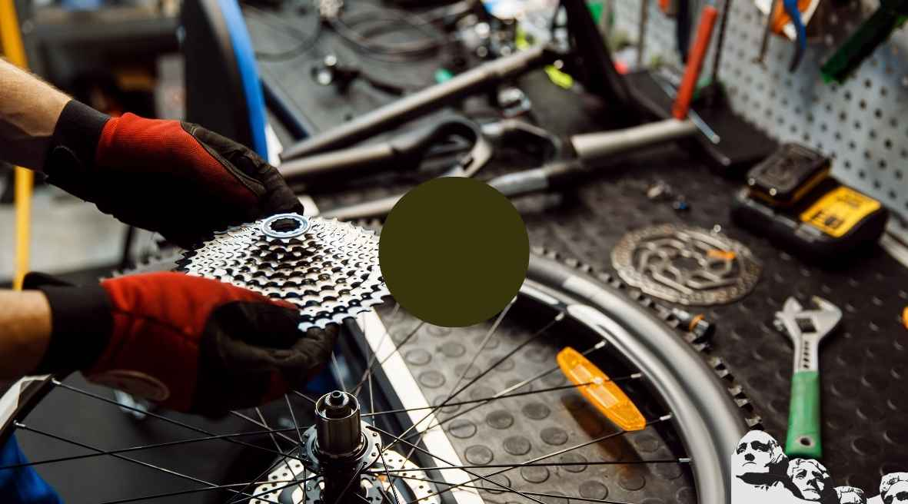

I don't know who first coined the phrase "appropriate technology" but they certainly were on to something.

When I was working at Lynch's Bicycles in Los Altos, as a fourteen year old mechanic, I used to see expensive racing bikes being ridden by the local High School kids. My fellow mechanic and teacher from Brazil referred to these bikes as "LA Rockets." To him, seeing kids ride Masis, Colnagos, and Cinellis back and forth to school was akin to using a rocket to travel to Los Angeles.

I'll never forget seeing Marty Brown's curly stay Hetchins being ridden around the campus at my local High School. happily he still owns that bicycle almost thirty years later as middle aged man. One of the few people to still be riding the same bike after thirty years. Hopefully there are others.

Too often I hear would be framebuilders say "if only they had..." this machine that machine, blah, blah, blah. As if owning a machine makes one a framebuilder. That's just like a budding violinist saying "if I had a Stradivarius I could play like Itzhak Perlman."

What's missing from the equation here is the time and effort that Itzhak spent learning to play the violin before he ever picked up a Stradivarius. My point being bike frames can be built with the most rudimentary tooling. I know this from personal experience. I've seen frame shops where hacksaws, a half a dozen hand files, an electric drill, maybe a grinder, a few reamers and taps, some straight edges and a brazing torch turned tubing into magic.

We are conditioned to take the problem to an expert and only later do we come to find out the expert is same as us only they wear a white coat or stand on the other side of the counter. I'm not talking triple bypass surgery with a Swiss army knife here.

I get a few calls every month by would be frame builders. I usually disappoint them when I encourage them to spend their time honing their brazing skills rather than investing in fancy machines.

There will be a place to bark with the big dogs and fire up the fancy machines but not for novice builders.

You see, it's really easy to invest in a machine, but it does not necessarily help your building skills at all. It might even hinder the learning process. Building with the least amount of tools is an elegant exercise. It gives one a baseline for problem solving and often shows us faster ways of getting around a problem.

I'm not sure when it happened in our culture, but somewhere along the line we became afraid to take that first step. Afraid of the risk.

Afraid of the process. Afraid of doing IT wrong. We simply want the end product without wanting to put the time in. Richard Sachs didn't build the beautiful frames he does today on his first effort twenty seven years ago. Somewhere we've bypassed the process and I think it is due to the affluence of society. We've become accustomed to buying our way out of problems instead of improvising. I still remember in horror as Bill Philbrook ground down an allen wrench to the size he needed right at the moment because he didn't want to wait until morning to buy one.

Whoever said if something is worth doing, it's worth doing well has stifled more creativity than any other cliché that I can think of. People expect perfection on their first try and anything less is unacceptable. Nonsense! That attitude has stopped many would be artists/craftsmen from picking up tools and beginning their personal journey into the wonders of creating things. Hopefully, it is the first step toward a series, each better than the previous. From my vantage point, I'd much prefer to hear a child play a tuba poorly than to see a master framebuilder braze or weld straight bladed forks, puke.

You see, I'm sure the most important tool in frame building is the guy who is building the frame. I'm constantly reminded of San Jose frame builder Dale Saso's talks to school children over the years. He would start by asking the children what the most important part of the bicycle was. The answers would pour in, the brakes, the wheels, the handlebars... Invariably they would overlook the obvious answer - the rider.

So to sum up, don't think I'm anti-machine because I'm not. But when the lack of a machine hinders initiative then I'm anti. I don't want to hear excuses. I want to see action!. All the information you need to build a frame is out there. There are frame building classes, there are books, there are videos, there is even a frame building newsgroup on the Internet. None of this existed when I was trying to learn the craft. Machines have their place in production frame building indeed. They make many businesses profitable and that's important. But the point is, pick up that hacksaw, file, brazing torch and get with it. We are wasting time talking and thinking about it. Take that first step. Maybe you will be the next Ritchey.

