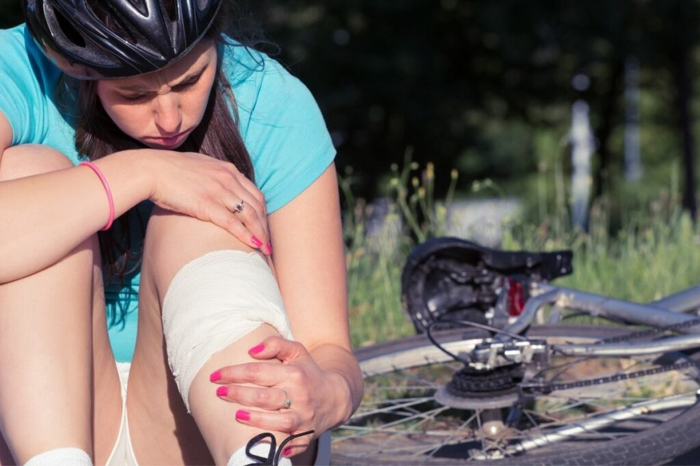

Cycling is a great way to stay in shape, but if you're new to the sport or haven't done it in awhile, then you need to take some precautions before you get on your bike. Cycling has some inherent risks that come with the territory of any sport- some more than others.

Here are some of the most common causes for cycling-related injuries.

- Improper bicycle fit 

- Exceeding your current skill and fitness level 

- Poor road conditions and sudden weather changes 

- Misjudging traffic situations and interruptions in flow on the roadway (e.g., construction or an accident) 

- Carrying too much weight, either on your body or in your bike frame (especially with a poorly adjusted saddle height) 

- Suffering from overuse syndromes such as arthritis, tendonitis, carpal tunnel syndrome or gout that limit function during prolonged use of wrists, hands or feet; this may be caused by poor maintenance.

Let's go over some ways that will help keep injuries at bay when you are cycling!

## General Precautions to Prevent Injury While Cycling

### 1\. Make sure to set your bike up correctly!

Bicycle fitment refers to how a professional bike fitter custom-tailors your bicycle to suit you. They will take into account many important factors including your weight, height, flexibility and body size.

The process usually takes approximately one hour.

A typical appointment starts with the client being assessed for natural flexibility by doing simple tests which are then graded on a scale of 1 to 5 where 1 is very flexible and 5 would be considered stiff. After assessing the natural flexibility level of the person consulting them they are asked to do some easy pedaling exercises on their own bike whilst seated in their normal cycling position - demos are shown using real bikes for maximum effect.

Different people have different body mechanics, so make sure that you are comfortable on your bike before hitting the road. If you feel like something is off or wrong with your bike, then it's time to take it in to get looked at by a pro.

A comfortable bike fit is critical to cycling injury prevention. When your bike fits you well, you'll experience fewer aches and pains after a ride because fingers won't feel numb, hands won't tingle, back pain will be alleviated.

### 2\. Wear Protective Gear!

Wearing protective gear will not eliminate the risk of injury, but it may lower the severity of an injury. Most protective clothing such as helmets and [bicycle specific clothing](https://mtbnz.com/bike-apparel/) is designed to absorb shock from unexpected contact with a hard surface such as pavement or walls.

Some also feel that it helps them stay safe because drivers take more notice of bike riders that wear protective gear than those who do not. There is no guarantee for this theory and there is much speculation on the topic so you should always call police if you were involved in any type of accident.

Protection includes clothing and elements such as a [helmet to protect the head](https://mtbnz.com/best-mountain-bike-helmets/), [gloves and wrist guards](https://mtbnz.com/best-mountain-bike-gloves/) to protect the hands and wrists, shin pads to cover and prevent damage on knees and shins, plus arm guards to improve arm safety. 

A helmet is regarded by some experts as one of the most important pieces of riding safety equipment that can be worn while cycling.

The brain is extremely sensitive, so any bump or blow on it could result in significant brain trauma leading serious permanent damage such as paralysis or death.

Statistics show that one out of six fatalities comes from head injuries sustained while cycling; wearing a helmet will significantly reduce your risk of suffering this fate. 

Wrist guards are great for preventing fractures of the radius bone, and knee pads are wonderful for protecting knees during falls.

### 3\. Warm up Before You Pedal!

Most cyclists are familiar with the concept of warming up before cycling. This habit is both a preventer of injury, as well as an effective way to improve your pedaling power.

The idea behind warming up is that it increases blood flow to the muscles, which causes them to pump out more lactic acid. Lactic acid is absorbed by muscle cells for fuel during exercise, so breaking down some lactic acid during a warm-up will help muscles finish long rides without cramping or running out of fuel.

Warming up before a ride is imperative to prevent injury. Make sure to spend at least 5-10 minutes on your bike getting your muscles ready to go before you actually start peddling hard. Stretching out after a ride will also keep you on the road longer without injuries .

It has been estimated that 5-15% of rider injuries are caused by cool or cold muscles.

### 4\. Keep your bike in good condition - check tire pressure, brakes, and gears before you ride

Maintaining a bicycle in great condition is essential for preventing injury while cycling. There are number of simple steps that can be taken to ensure safe and enjoyable rides.

Some way include checking tire pressure, lubricating the chain, ensuring good lighting for night time use, and maintaining brakes in good working order

### 5\. Ease into it!

If you haven't been cycling in awhile or are taking some time off, then ease back into things instead of starting where you left off all those years ago when you finally decided to give it up. Cycling is a great way to get and stay in shape, but if you don't ease into it then you can cause an injury .

### 6\. If something hurts, stop!

You're probably not going to win the Tour de France by taking breaks every time your legs start to hurt or your back starts hurting. But if something doesn't feel right then what's the point of continuing? Get off the bike and stretch or just take a little break and see how it feels. The last thing you want is for an injury to keep you from cycling!

### 7\. Don't Drink & Ride

Drinking alcohol while biking increases the risk of fatal accidents as alcohol impairs judgment and reflexes as well as slows reaction time. This can lead to a variety of trips and falls that could cause long lasting injury such as broken bones or head trauma.

The more we know about how alcohol affects the body on a molecular level, the more we see that drinking leads to decreased brain power and memory formation, not just impaired ability to walk and speak clearly. There is mounting evidence that moderate amounts of drinking will increase your chances of injury when biking due to poorer judgement skills (even without worrying about drunk driving). Alcohol also increases dehydration rates making one more susceptible for heat related risks such as heatstroke and dehydration.

### 8\. Be seen!

This is especially important if you ride during hours when it's dark outside or at dawn or dusk. Having a front light and rear reflectors will make you much more visible to cars and other vehicles, which will help prevent accidents and injuries .

### 9\. Remember: your responsibility!!

Cycling is a sport that requires the cyclist to be responsible for his or her own safety. You are wearing what amounts to wheeled armor, but there are no reinforcements covering your neck and head, which leaves those parts exposed.

## Prevention of Specific Injuries While Cycling

### Preventing Numb Toes

Particularly common in **enduro racing**, injury to the anterior tibial nerve can occur when cycling downhill. This results in numbness and pins-and-needles sensations in the toes, with simple tasks like removing socks or shoelaces proving very difficult owing to lack of sensation.

The two main causes are compression of related nerves or compression along the blood vessels that supply nerves to the foot - this is most commonly caused by pressure on the top of the sole where it connects with pedals connected to cranks.

Prevention—aside from getting into better form—involves raising saddle height so that there is clearance between ankles and front wheel at all times; adjusting cleats so they diverge slightly more than usual; redistributing weight in the saddle to move it forward; increasing the size of shoe cleats, using special shoes for cycling, or wearing stiff hiking boots when descending.

### Preventing Saddle Sore Injuries

Another common injury among cyclists is [saddle sores](https://mtbnz.com/prevent-saddle-sores/), caused by contacting the bicycle seat with one's buttocks over prolonged periods.

[Padded shorts](https://mtbnz.com/best-mountain-bike-shorts/) are frequently used to prevent this type of irritation during bicycling.

Special ergonomic seats are also available that attempt to decrease pressure exerted on certain areas of the body while riding. These seats vary in width and design, but they often have a high nose which reduces pressure on the soft tissue located within the pelvic area.

Sores can be avoided further through proper posture when sitting—sitting upright relieves any existing shear force which abrades the skin during rotation of the pelvis. Saddle sores can be prevented by rotating one's hips, moving about on the saddle, or standing up while cycling to relieve pressure for short periods of time.

### Preventing Knee Pain Injury

[Patellofemoral pain syndrome](https://rothmanortho.com/stories/blog/Cycling-Knee-Pain) (PFPS) is an umbrella term used to describe pain which affects the knee and is caused by a problem with tracking of one's kneecap. This can be caused by mal-alignment of the foot or problems with the contour of the bicycle seat.

PFPS has many potential contributing factors but most often, it is attributed to degradation of articular cartilage on one's knee cap.

Prevention—when cycling—involves regularly standing up out of the saddle to stretch and ensuring that proper form is used when applying pressure down into pedals; this means resisting the urge to reach forward with knees while pedaling, as this will cause them almost inescapably to come forward too much in relation to feet attached to pedals and in so doing strain patellofemoral joint and increase problems related to PFPS.

### Preventing Achilles Tendonitis and Tibialis Posterior Tendinopathy

Achilles tendonitis and tibialis posterior tendinopathy (also known as posterior tibial tendon dysfunction) are injuries caused by overuse of the aforementioned structures; they cause pain which ranges from mild discomfort with exertion to severe pain at rest, and can sometimes be debilitating for cyclists.

Prevention—when cycling—involves reducing the amount one rides and increasing time for recovery between workouts; ensuring that one's seat is high enough that knee remains straight when foot is at bottom of pedal stroke; using toe clips or straps to reduce pressure exerted on feet during pedaling; ensuring proper form when applying pressure to pedals; using correct cycling shoes with stiff soles but which aren't excessively heavy; and ensuring that cleats are correctly aligned on shoes.

### Preventing Cervical Spine Injury

A study concludes that cyclists were less able than non-cyclists to look backwards as far as 180°, demonstrating a considerable blind spot compared to those who do not ride bicycles.

Riding with one's head continuously angled over one's shoulder in order to see behind results in muscle fatigue and pain and eventually headaches and upper neck injury—the result of cervical facet joint impingement on the superior articular process of atlas.

This particular kind of injury can be avoided by making sure head is positioned so that line of vision is in line with one's shoulders and in so doing, avoid neck pain and injury.

### Preventing Lower Back Pain and Injury

Lower back pain and injury can be caused by stress placed on lumbar spine during cycling when someone leans too far forward when riding; another potential cause of this type of injury comes from muscle imbalances in the torso—specifically between abdominal muscles and hip flexors.

A cyclist who lacks flexibility in hip flexor muscles, will overuse the rectus femoris or quadriceps femoris. This can lead to tendonitis at either end of those muscles.

The best prevention for general lower back pain while cycling is to ensure that bicycle seat puts minimal pressure on perineum area—the space between one's anus and genitalia—and that it is tilted at a downward angle of roughly 20° from horizontal.

### Preventing cyclist's nipple

Cyclist's nipple is is caused by the continuous rubbing of clothes against the nipples. It is most common to cyclists, runners and those who wear tight compression gear. 

Prevention begins with wearing cycling jerseys made of fabrics that wick moisture away from skin as rapidly as possible. Two examples of such materials are polyester and spandex, which allow perspiration to evaporate rapidly. This prevents the clothing from sticking to the skin or producing a clammy feeling. Wearing a water-resistant sunscreen on nipples can help prevent them becoming sore during a ride..

### Preventing Shoulder Pain When Cycling

Shoulder pain in cycling typically is the result of poor riding posture and is caused by repetitive motions in which shoulder is held forward in order to hold onto handlebars; this causes strain on muscles and tendons in front of shoulder, specifically pectoralis major muscle.

Preventing injury includes practicing holding onto both bar ends. This will ensure that both arms are in a comfortable position and allows one to cycle longer before it results in pain.

## Conclusion

You can avoid injury while cycling by ensuring that your bike fits you properly, wearing a helmet, realizing your limits and not cycling outside of them, replacing the chain periodically (every 3-6 months), observing traffic laws (don't say hi to oncoming motorists!), and never cycling when you are sleepy.
