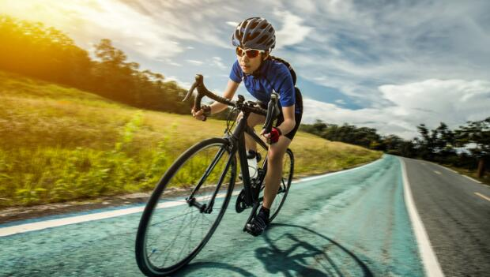
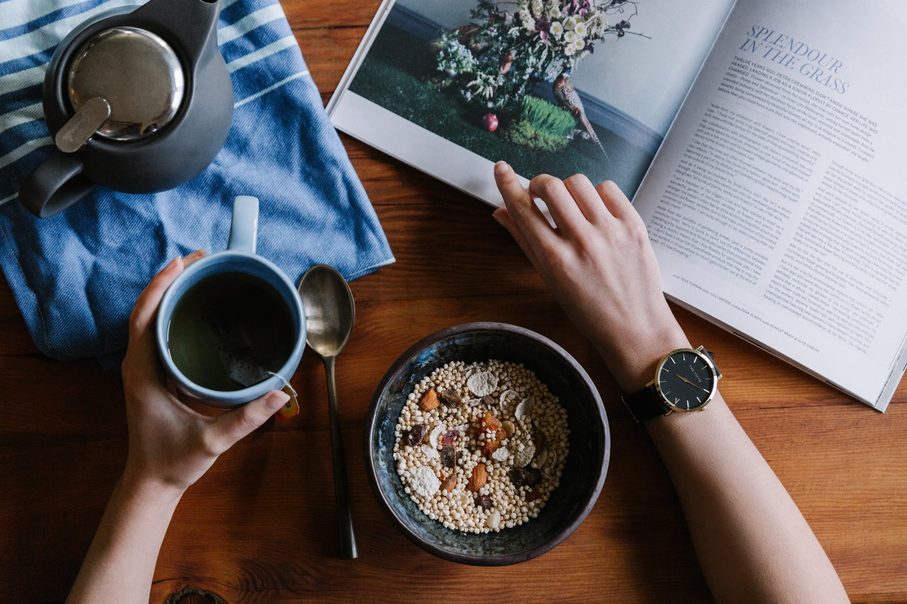

Many of us aspire to ride centuries. There is something about riding 100 miles in a day that is appealing--it brands you as a serious cyclist.

The trick is to do it without turning your body into a walking mass of sore, stiff muscles for a week afterward. Let's face it, you won't ride centuries again if you don't have any fun, and if there is anything that cycling is suppose to be about, it's fun.

## Start with a Cycling Century Training Plan

Going out and riding a century cold turkey will have you quitting cycling cold turkey.

We asked some experts the best ways to start training or add quality to existing workouts. Our cast included Jim Martin, director of sports science for team EDS and 1988 National Masters Match Sprint Champion; former Latvian national track coach Valentin Soungatoulin; and current men's national team road coach and former pro racer Roy Knickman.

It is impossible to devise one cycling century training plan for all types of riders, so we have broken it down into two general groups:

- Those who are just now dusting off their bikes, and
- those who are already logging 100 miles or so a week.

### Century Ride Training for Beginners

"For beginners," Martin said, "the number-one priority is to get your [bike fit](https://mtbnz.com/bike-fitment-guide/) dialed in.

The main problem you see with less experienced riders on centuries is that their position on the bike is atrocious." Martin highlighted seat height, stem length and cleat adjustment as the most important components of fit.

More advanced riders already have a workable position on their bike, but it can't hurt to get a fit kit or even the advice of the local club's Category 2 racer on fit, according to Martin.

An ill-fitting bike can cause more than discomfort on a ride--serious overuse injuries can result.Martin's timetable for a new rider to complete a training program for a century is two to three months, depending on time spent training and personal advancement.

"Physiologically, the demands of riding a century are not intense," he said. "Anyone can do it if you train a little." But how you train can make the difference between finishing a century easily and enjoying it or barely making it and being thoroughly miserable.

For the beginner, Martin suggested joining a club, which offers immediate riding partners and a constructive atmosphere.

For the first month or so, Martin said cyclists should work up to a point where they can ride two hours at low intensity several times a week--these are your base fitness miles.

Two rides a week are a minimum, said Martin. "What you accomplish by riding once a week is undone by resting the other six days," he said. Martin defines low intensity as a conversational pace, meaning one in which you have enough breath to hold a conversation.

"There are two ways to measure fitness," Martin said. "VO2 max measures your cardio fitness, which is not going to be a limiting factor on long rides like this. Lactate threshold is related to muscular (or metabolic) fitness."

Most of the riding on a century is done at a conversational pace. Martin suggested that most or all the training be done at a level between your resting heart rate and 50 percent of the reserve (the difference) between that and your max heart rate.

For example, if your resting heart rate is 75 beats per minute (bpm), and your max is 180 bpm, your training should not exceed 130 bpm \[(180-75)/2 + 75\].

Soungatoulin suggested using a [heart-rate monitor](https://mtbnz.com/best-fitness-tracker-cycling/) and strictly staying in the range of 50 to 70 percent of max heart rate initially. "Riders should stay in this range for the first four to six weeks. No racing, just moderate intensity," Soungatoulin advised.

Unless you are really hard core about your fitness, you probably don't have a heart-rate monitor, but there are ways to judge effort without one. You will be riding at three different levels: recovery, conversational and time trial.

Martin defines recovery rides as just that--very little effort. Most of your regular rides will be at a conversational pace, with periodic time-trial or paceline efforts. During these efforts, "It's mouth open, heavy breathing and no talking," Martin said.

A common mistake is to go out too hard and blow up early, ruining the benefit of the workout. "Start conservatively and after three minutes ask, 'Can I go any harder?' If you can, step it up," Martin said.

Chronically time-strapped riders will appreciate Knickman's advice. He said if you can just get out for an hour several times a week and ride at a good tempo, it will help immensely. "The more you can ride, the better off you'll be," he said.

Once you have the base miles, the next step is to ride short, intense efforts within longer rides.

"You should ride for one to two hours and have one 20-minute time-trial session at time-trial intensity--hard," Martin instructed. This is the difference between barely finishing a century and finishing it easily.

"If people do only one or two of these workouts a week for the month prior to the ride, they will increase their lactate threshold \[tolerance for anaerobic work\] very quickly. You will feel better during the ride and actually use less glycogen," Martin said.

Furthermore, hills, time trials and riding into headwinds are all good training aids. To prepare yourself for the 100 mile rides, Knickman advised going for a long ride, up to 80 miles, one day a week as long as it is paired with shorter rides at a higher intensity.

Group rides can also be a great training ground. For the rider already riding 100 miles or so a week, the best way to turn those miles into quality ones is to ride in small groups.

"If you ride in a paceline of about three people, you are doing intervals," Martin said. "Don't ride in a huge group because there is a point of diminishing returns," meaning you won't be doing enough work.

"There are two keys to paceline riding," Martin explained. "First, look after yourself. If you are tired, pull off early. Second, take care of your partners.

When you take the front, maintain that speed for 10 or 15 seconds before you try to speed up the line." This allows the rider who just pulled off to get in the draft again and keeps the paceline moving at a steady pace, not like an accordion.

#### Riding Hills

Another option for the experienced rider is to ride hills, with the time between climbs spent riding at a conversational pace. Fartlek, a Swedish word literally translated as speedplay (not the pedals, the technique) that signifies workouts with short, fast efforts, is also a great training aid.

"Find a benchmark ride," Martin said. "Do it often with other riders. You can have a set warm-up time and then at a certain stop sign or corner, you take off. Have little sprints for hilltops or traffic lights. Group cycling is by nature Fartlek."

Soungatoulin echoes Martin's advice. "Find a good loop and do a gradual warm-up, about 35 minutes. Then time trial hard for about 12 minutes and sprint the last 200 meters. Anything below your lactate threshold is fine," Soungatoulin said.

### Century Ride Training for Experienced Riders

Martin doesn't put the same kind of timetable on training for riders already training but gives them about a month of more structured workouts to get them to the fitness level that will make the century fun.

Soungatoulin says that going on group rides is enough for most people but also cautions riders to find groups of their own ability level.

Knickman also had some final words for prospective centenarians. "Don't group three or four days of riding or rest together. It's better if you ride and rest on alternate days," he said. "Also, use common sense. Don't go out there and hammer and then get left at mile 70 waiting for the sag wagon."

As Martin succinctly put it, "Keep your ego under control." Ride at a good pace, have fun and you'll become a century rider yourself.

## What to Bring On a Century Bike Ride

When you pay $30 or so for an organized ride, there are certain things included in that price. However, a personal sag wagon is not one of them.

You are still responsible for bringing basic tools and appropriate clothing. Cardinal rule number one for these rides: Don't try new things on a century, whether it be [shorts](https://mtbnz.com/best-mountain-bike-shorts/), [shoes](https://mtbnz.com/best-mtb-shoes-for-flat-pedals/) or a new energy bar or drink. You need time to break in new equipment such as shoes and [saddles](https://mtbnz.com/best-saddles/).

As for mechanical support, most rides have mechanics either on route and/or at rest stops. Shops provide tech support as a goodwill offering, but they are not your personal mechanic.

Bear in mind that there may be only a few mechanics for 5000 riders, so use them only for repairs you can't handle.

Carry a tool kit with an assortment of Allen wrenches and a chain tool, some spare tubes, a patch kit, [pump and tire levers](https://mtbnz.com/best-bike-pumps/). With these tools and the knowledge of how to use them, you will be self-sufficient for all but the worst breakdowns.

If you don't know how to use the tools, many shops offer basic wrenching seminars, or simply ask a friend to show you.

Centuries can take a long time. You will probably start in the cool morning hours and end in the hot afternoon, so use a layering approach to clothing.

Most rides go rain or shine, so be sure to include a jacket. [Padded shorts](https://mtbnz.com/best-mountain-bike-shorts/), a jersey, [padded gloves](https://mtbnz.com/best-mountain-bike-gloves/) and a [helmet](https://mtbnz.com/best-mountain-bike-helmets/) are the bare essentials.

Arm and leg warmers and a rain jacket will get you through most weather, but conditions vary. If you are riding a March century in the Midwest, plan accordingly (e.g., tights instead of shorts).

[Sunglasses are essential](https://mtbnz.com/best-cycling-sunglasses/).

This may sound like a lot of gear for a "fully supported ride," but the support is primarily at the rest stops and in the postride barbecue. On the road, you still have to carry your own stuff.

## Eating Tips for 100 Mile Bcycle Ride Training

So you woke up at four in the morning to eat your breakfast and give it time to digest. Or maybe you didn't.

Truthfully, most of us don't rise before the crack of dawn to fuel up. It's just too dang early. But cycling is not quite like swimming--you can ride immediately after eating.

Jim Martin, director of sports science for team EDS, gave us the skinny on fueling for a century.

If you eat immediately before a century ride, don't take off like a rocket at the sound of the gun. "If you eat right before a ride and then go out and hammer, you'll deplete your glycogen levels early," Martin said. "You'll have nothing left to finish on." Remember, this is not a 45-minute criterium--you have 100 miles to ride.

Eating and drinking regularly during the ride are important for keeping your glycogen stores high. Rest stops have water and a lot of good, [high-carb foods to speed replenishment](https://mtbnz.com/best-endurance-supplements-for-cyclists/).

Don't get in the habit of spending a lot of time at rest stops, though. "If you hang around the rest stop and eat, your body will think you are done riding for the day," Martin said.

"It will think you are carbo loading to replenish glycogen so it will trigger an insulin response to load glucose. If you begin riding again with a high insulin level, you will burn lots of glycogen and bonk. Keep the rest stops short," he advised.
