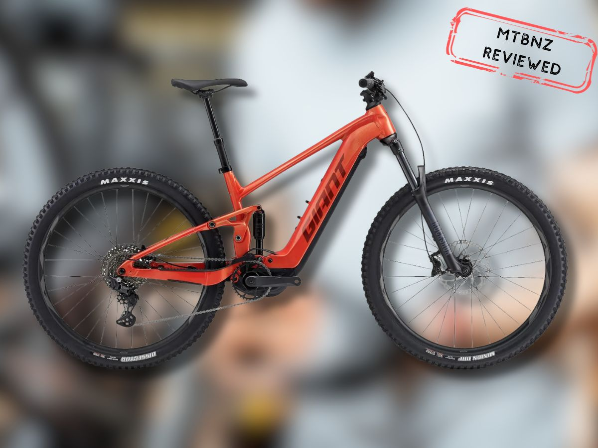
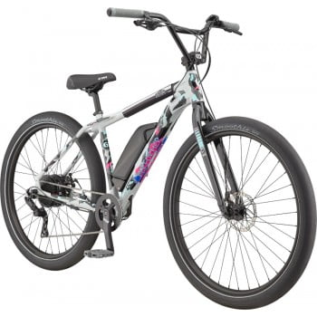
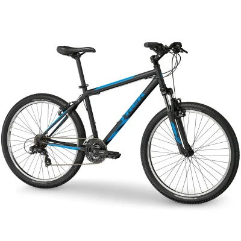
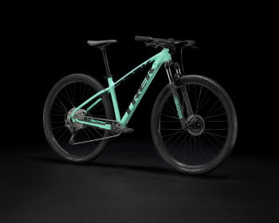

In 2019, [approximately 8.62 million Americans](about:blank) aged 6+ years participated in mountain/non-paved surface biking.

Clearly, this is a truly valuable activity for millions of people.

So, what is mountain biking and what makes it so great?

In simple terms, it’s all about riding your bicycle on different types of off-road trails. To enjoy the experience, you need to know as much as possible about mountain biking, get the right bicycle, have the right equipment/ accessories, and know how to maintain your MTB (mountain bike).

But is mountain biking harder than road biking?

It’s definitely a harder workout.

You’ll ride longer distances and use more muscle types compared to long-distance road cycling. There are also more obstacles requiring constant breaking and bursts of energy.

And the bikes are heavier.

This comprehensive guide provides the information you need to know before you start mountain biking.

## What You Need to Know Before Starting Mountain Biking

You cannot start mountain biking without the right [MTB gear and accessories](https://mtbnz.org/fun-and-functional-mountain-biking-accessories/).

Therefore, you must know how to [select a bike that’s the right size for you](https://mtbnz.org/bike-fitment-guide/). You should also know which accessories are important.

Most importantly, you must know the best places to ride.

## Mountain Bike Inner Tube Sizes

https://www.youtube.com/embed/c5dTZkh1Lvc

The wheel is one part that experiences the greatest wear and tear during mountain bike rides. And the inner tube will likely require frequent replacement.

Therefore, you must know how to select the right fit.

**So, do inner tubes come in different sizes?**

Yes, inner tubes are available in multiple sizes, as well as different valve types.

When selecting the right size, you must consider:

- **Wheel diameter**: Your inner tube should match the wheel diameter. This wheel diameter depends on the type of bicycle you have, varying from 12” up to 29”.
- **Tire width**: The inner tube should also match the tire width. This tire width varies depending on the bicycle, ranging from 19 mm road bikes to 4 inch mountain bikes.

Obviously, the next question would be, “What size inner tube does my bike need?”

Well, you can check the sidewall of your tire to determine what size inner tube you need. Look for numbers like ‘26×1.75’ (typical of mountain bikes) printed on the sidewall.

That’s the basic measurement structure for wheel sizes, referring to: diameter x width. That means ‘26×1.75’ refers to 26 inches diameter by 1.75 inches width.

However, some numbers might look slightly different.

For instance, what size is a 700C bike tube?

Or, what inner tube do I need for 700x35c wheels?

The letter ‘c’ is a carryover from an outdated French system that used such letters as **a**, **b**, and **c**. Here, you’ll simply ignore the c; hence, what you need is a 700×35 tube.

You’ll pick a 700” diameter tube and a width range that has 35” within it.

## How to Size a Mountain Bike

Picking the right-sized machine isn’t too complicated.

As an example, let’s examine the Giant bicycle.

So, how do you size a Giant bike?

Simply by using a size chart, you can quickly answer the question, “What size person is a 24-inch bike for?”

Here is the size chart for the Giant Trance, Talon, and Stance MTBs.

## Why Do I Need Mountain Bike Gloves?

When riding, some accessories might seem unnecessary.

One such accessory is a pair of mountain biking gloves.

But you’ll be surprised at just how valuable it is. Here are the benefits you get from such a small item:

- **Grip**: Just like any other physical activity, you’re sure to sweat when biking, especially on hot humid days. In such situations, the [best MTB gloves](https://mtbnz.org/best-mountain-bike-gloves/) will help you maintain a firm grip on the handlebars. This ensures firm control when riding gnarly, rocky downhill trails.
- **Protection**: Gloves protect your palms from calluses and blisters during extended periods on the trail. Such lengthy rides can be tough as you bear your weight on your palms, steer, brake, and shift. Most importantly, your hands will be protected in case you crash, and use your hands to cushion your fall.
- **Shock absorption**: Gloves with gel padding on the palms give extra cushioning. Such a design absorbs the shock from bumps along trails.

## “Where can I Find Mountain Bike Trails Near Me?”

https://www.youtube.com/embed/Wq8NfrUph5Y

One half of enjoying a mountain bike ride is having a good machine, and the other half is getting an excellent trail.

But, you’re probably asking, “Where can I find local mountain bike trails?”

That’s easy. Various websites provide such information for your specific area.

For example, if you live in the Atlanta, Peachtree City, McDonough, and Gwinnett County areas, you’ll get these exciting MTB and paved trails:

- **Dauset Trails in Jackson, GA**: Nature Center has various trails for all skill levels.
- **Atlanta Beach in Clayton County**: Has newly refurbished trails at the site of the ’96 Olympic Volleyball.
- **Fort Yargo in Gwinnett County**: Offers intermediate trails plus a camping facility.
- **Georgia International Horse Park in Conyers, GA**: Has very advanced trails and it’s the home of the first Olympic MTB course.
- **Yellow River Trails in Gwinnett County**: The trails are suitable for both beginners and advanced riders.
- **Blankets Creek in Woodstock, GA**: Features a trail network for all skill levels.
- **Stinky Trail in Peachtree City**: A 15-mile trail system sponsored by the Southside Cycling Club.
- **BSC Trail in Peachtree City**: A 2-mile beginner loop that’s great for families.
- **Boundary Waters Park in Douglasville, GA**: An 8-mile multiuse trail along the Chattahoochee River.
- **McIntosh Reserve in Whitesburg**: Another multiuse trail (a parking fee is required).
- **Chattahoochee Bend State Park in State Park, Newnan, GA**: This is GA’s newest 3-mile state park.
- **Kiwanis Trail in Griffin, GA**: A single-track trail accessed from the gate between the Armory and Kiwanis Fair Grounds.

## MTB Project Makes It Easy to Find Great Places to Ride

If you want to avoid the hassle of looking for great trails, try out [MTB project](about:blank).

MTB Project was started as an initiative for IMBA's (the International Mountain Bicycling Association’s) mapping program. It was supported by Shimano in partnership with Adventure Projects, LLC.

Essentially, MTB Project is a ride guide and trail map website.

It provides an extensive MTB trail catalog with detailed descriptions of 39,000+ worldwide trails, covering 128,000+ miles.

Most importantly, it makes the search for great places to ride incredibly easy.

You can find a ride on the website by picking a state, browsing the map, or using the search box. Alternatively, check out the Feature Ride, a recommended route including several trails.

For each trail, you’ll get the description, overview, photos, and trail stats (length, ascent, descent, % singletrack, and high & low elevation). A map with the elevation profile makes it even more valuable.

Extra options are available to obtain directions from Google Maps, send to phone, or download a GPX file.

The website is mobile friendly apart from providing an MTB Project app for Android and iOS.

## Best Mountain Bikes for Beginners

Now that you know what mountain biking is all about, you’re better placed to pick out the best two-wheeled machine for a beginner like you.

Here’s a selection of some of the best mountain bikes for beginners:

1. **Specialized Rockhopper Elite 29**: This bike is lightweight, balanced, and has a traditional cross-country feel. It climbs efficiently and is quite capable on singletrack. It features an 11-speed Shimano Deore drivetrain and Shimano MT-200 brakes with 180mm rotors.
2. **Vitus Sentier 29**: This is an aggressive hardtail bike that offers a good balance between performance and affordability.
3. **Trek Marlin 7 Gen 3**: This bike is a dependable choice for beginners. It offers a good balance of performance, durability, and value.
4. **Giant Talon 29 1**: This is a value hardtail bike that offers a good balance of performance and affordability.
5. **Marin Rift Zone 1**: This is a value full-suspension bike that offers a good balance of performance and affordability.
6. **Kona Mahuna**: This is a beginner trail bike that is best suited for flowy trails and mellow climbs.
7. **Ragley Marley 1.0**: This affordable bike offers good tech and features for entry-level riders. It features a Shimano Deore drivetrain and a smooth Marzocchi fork.
8. **Orbea Laufey H30**: This bike is a good choice for beginners due to its quality component packages and predictable handling.
9. **Vitus Escarpe 29 CR**: This bike is a good choice for beginners due to its quality component packages and predictable handling
10. **Commencal Meta HT AM Origin**: This bike is a good choice for beginners due to its quality component packages and predictable handling.
11. **Specialized Chisel**: This bike is a good choice for beginners due to its quality component packages and predictable handling

When choosing a mountain bike, consider factors such as your budget, the type of riding you'll be doing, and the bike's fit.

Frame and wheel size are critical factors in finding the right fit.

Most adult mountain bikes come in 27.5-inch or 29-inch wheels. Generally, 29-inch wheels offer more speed and stability, while 27.5-inch wheels deliver a more responsive feel.

Test both sizes before making a purchase to see which one suits you best

### Ancheer Electric Bike

https://www.youtube.com/embed/ujtHCDU-JUc

When getting a beginner-friendly mountain bike, you’ll first have to choose between a conventional and an electric mechanism.

Ancheer stands out as an affordable brand for the electric mechanism. The range of Ancheer models includes: folding, MTB, and fatbikes. Here’s a brief review of such models:

1. **Ancheer Power Plus Electric MTB:**

Apparently, the Power Plus is Ancheer’s most popular model. The 36V 8.8AH battery will give you roughly 18 miles of range, depending on various circumstances.

2. **Ancheer Electric MTB with Large Capacity Battery:**

Unlike the previous MTB, this model has a 36V 12AH lithium battery. When only using the throttle, it will give you up to 24 miles of range. You’ll get even more range riding in pedal-assist mode.

3. **Ancheer Fat Tire E-Bike:**

This model has a 26\*4.0 CST fat tire. With such a tire, you can ride on all types of roads, through snow, in the beach, and in dirt trails. That’s complemented by a powerful 300W motor.

4. **Ancheer Electric Commuter Bicycle:**

Ancheer’s City E-bike works well for urban commutes. It has a lightweight steel frame plus a 250W brushless gear motor to provide assistance on hill climbs and a burst of speed to pull away from traffic lights.

5. **20” Folding Electric Commuter Bike:**

This model features a collapsible lightweight aluminum frame. It also has 20-inch wheels and a 7-speed Shimano drivetrain. In throttle mode, you can achieve a top speed of 15mph, thanks to the 250W high-speed brushless gear motor.

### GT Aggressor Pro Mountain Bike

The GT Aggressor Pro Mountain Bike is a versatile and robust mountain bike that is perfect for beginners. Its design and features make it an excellent choice for those who are just starting their journey into the world of mountain biking. 

**For beginners, investing in an expensive mountain bike might not be the best idea.**

The GT Aggressor Pro offers a great balance between cost and performance.

It's affordable compared to other mountain bikes in its class, but it doesn't compromise on quality or performance. This makes it a great investment for those who are just starting out in mountain biking.

The Aggressor range features three models:

1. **Aggressor Comp**: The basic model.
2. **Aggressor Expert**: Has hydraulic lock-out forks and disc brakes.
3. **Aggressor Sport**: Has Shimano EZ Fire shifters and Suntour M3030 forks.

Note that the 2018 GT Aggressor Pro was replaced with the Aggressor Sport model.

Overall, the notable features in this brand include:

- a triple triangle frame made of lightweight 6061-T6 aluminum
- SR Suntour M3030 forks that have 80mm of adjustable and supple coil suspension
- 3×8 speed Shimano Tourney derailleurs

If you’re wondering, “How heavy is the GT Aggressor pro?” the size M version is only 14.5 kg.

And how does it perform in real life?

To figure that out, let’s look at three key aspects:

- **Braking**: GT Aggressor’s braking system is quite reliable, making it suitable for every riding terrain.
- **Gearing**: The Shimano 3×8 gearing offers multiple gears that make uphill climbs easier while giving you speed on level ground.
- **Traction**: The chunky tires deliver excellent traction even on sand.

Clearly, all those features make this model pretty good.

But what is the best GT bike out of those three versions?

The GT Aggressor Pro comes equipped with reliable components that are easy to use and maintain.

It features a Shimano drivetrain, which is known for its durability and smooth shifting.

The bike also has Tektro hydraulic disc brakes, providing reliable stopping power in all weather conditions.

These components are not only durable but also beginner-friendly, as they require minimal maintenance.

### Trek 820 Mountain Bike

If you want a brand that has a long track record of great performance, the Trek 820 is a great choice.

So, what year was the Trek 820 made? It has actually been in existence as [far back as 1987](about:blank).

Most importantly, is a Trek 820 mountain bike worth it?

Considering that it has many premium features, it’s certainly worth buying. It’s a reliable entry-level two-wheeler that’s capable and powerful enough for downhill, cross-country, and simple light trail rides. Best of all, you can expect it to last long due to its durable custom stainless steel frame.

The model is quite good as an MTB machine because of the front and rear Shimano Tourney TY500 & TY300 derailleurs. They deliver smooth power during your ride.

And what is a Trek 820 worth?

You can buy this model at about $400. That’s incredibly cheap.

It comes in 5 sizes (XS, S, M, L, and XL), ranging from 13 inches to 20 inches.

### Quick Trek Marlin 5 Review (2021)

The Trek Marlin 5, worth about $500, is a bit pricier than the Trek 820. Since it’s still quite cheap, is a Trek bike worth the money or is it a low-quality product?

Despite being low-priced, the Marlin 5 is certainly a good quality product.

The entry-level hardtail MTB is ideal for children, ordinary adventure seekers, or even someone new to mountain biking and looking for a real MTB.

Admittedly, it’s not great for jumps or handling extreme terrain. But, it will definitely give you a thrilling trail experience and enjoyable cross-country trips where there aren’t too many TTFs (Technical Trail Features).

**And what is the difference between the Trek Marlin 4 and 5?**

Several notable differences exist between versions 4 and 5, including:

- **Weight**: Version 4 is 32.0 lbs/ 14.5 kg, and version 5 is 31.8 lbs/ 14.4 kg.
- **Brakes**: Version 4 has a Tektro MD-M280 mechanical disc, and version 5 has a Tektro HD-M275 hydraulic disc.

### Trek Marlin 6

The Marlin 6 is yet another valuable product from Trek.

Is the Trek Marlin 6 a good bike?

Here’s a quick review of Trek Marlin 6 to answer that question.

This is a beginner cross country bicycle. It features a 2x drivetrain, and front lockout suspension. You can pick either the men- or women-specific model.

Since it’s an XC model, how many gears does the Trek Marlin 6 have?

It’s certainly up to the task, because it has as many as 16 gears. Despite being an XC model suited for trails, you can install a rear rack and easily turn it into a burly commuter.

The men’s and women’s models have the following similarities and differences:

- They have the same groupset, brakes, and wheels.
- The women’s Marlin 6 comes in four sizes (XS, S, M, M/L), but the men’s model comes in seven sizes.
- The women’s model has more feminine colors (purple and mint-green), unlike the men’s model (blue and gray).

How much is a Trek Marlin 6 worth?

Well, you can get this two-wheeler at roughly $600.

You’re probably asking, “What is the difference between Trek Marlin 5 and 6?” in order to choose either of the two models.

Here are the key differences:

- model 5 weighs 31.8 lbs/ 14.4 kg, and model 6 weighs 32.0 lbs/ 14.5 kg
- model 5 has a Tourney, Altus groupset, and model 6 has an Altus, Shimano groupset
- model 5 has a Shimano Tourney TY300 Rear Derailleur, and model 6 has a Shimano Altus M310 Rear Derailleur
- model 5 has a Shimano Tourney TY300 Front Derailleur, and model 6 has a Shimano Altus M315 Front Derailleur

And what is the difference between Trek Marlin 6 and 7?

Here are the key differences:

- model 7 is priced at about $800, and the model 6 price is roughly $600
- model 7 weighs 31.0 lbs/ 14.1 kg, and model 6 weighs 32.0 lbs/ 14.5 kg
- model 7 has an Acera, Altus groupset, and model 6 has an Altus, Shimano groupset
- model 7 has a 2 × 9 drivetrain, and model 6 has a 2 × 8 drivetrain

### New Cannondale Scalpel

https://www.youtube.com/embed/DbSgwzGcngY

If you need a high-end model with all the advanced features that you would ever dream of, a Cannondale Scalpel MTB is likely your best bet.

These two models stand out in the new 2021 Cannondale Scalpel brand:

1. **Scalpel Hi-Mod 1:**

This is the top model. It has the lightest carbon fiber frame that’s about 150g lighter than the other models.

The key highlights of this model include: Cannondale HollowGram cranks with a one-piece 34t SpideRing, a Shimano XTR groupset, carbon rims, carbon handlebar, a top-level Lefty Ocho fork, and an ENVE seatpost.

2. **Scalpel Carbon 2:**

This and all other models, use the standard-mod BallisTec carbon frame. It features an XT group and brakes, plus a Cannondale carbon seatpost.

Since this brand has so many features, you’re probably wondering, “How much does a Cannondale Scalpel weigh?”

Not as much as you might think. In fact, it’s surprisingly light, with the premium Hi-Mod version weighing only 1,910 g (medium size).

But having those advanced features, how much is a Cannondale Scalpel?

As you might expect from a high-end machine, the Scalpel Hi-Mod 1 model retails at roughly $9,000, and the Scalpel Carbon 2 model retails at about $6,000.

But why do Cannondale bikes have one fork?

Well, the top of a single-sided fork is attached as a dual crown downhill fork that’s much stiffer than single-crowns. And Cannondale markets the new Lefty Ocho fork as being stiffer laterally as well as being stiffer fore and aft compared to the previous generation.

So, what is the best Cannondale mountain bike model?

Without a doubt, the Scalpel Hi-Mod 1 model would be your go-to choice. After all, if you’re going to splurge on a high-end product, you might as well get a full-feature-packed model.

### Specialized Rockhopper

This review of bicycles wouldn’t be complete without the Specialized Rockhopper.

Is the Specialized Rockhopper a good bike?

Specialized Bicycles have a Long history (since 1974) of delivering quality products. That’s “30+ years of never settling for ‘good enough’.”

So, what is the best Specialized mountain bike?

Two models stand out when considering the best mountain bike for beginners:

1. **Rockhopper Elite:**

This hardtail MTB has a lightweight and durable Premium A1 aluminum frame. It also features RockShox’s Judy SoloAir for massive performance and air-sprung sensitivity.

To top it all, the 10-speed Rockhopper Elite comes with tubeless-ready rims and tires.

2. **Rockhopper Expert:**

This model is a hardtail too.

It features a Premium A1 aluminum frame and RockShox’s Judy SoloAir. However, it has a 1×12 drivetrain (SRAM ultra-wide-range SX Eagle), unlike the Elite model.

The rims and tires are tubeless-ready.

And how much does a Specialized Rockhopper cost?

Different models cost between $500 and $1,000+. The more advanced features it has, the higher the price.

## Accessories

For your personal safety and enjoyment, you’ll need a wide range of accessories.

Here is a selection of the important ones.

### Get the Best Mountain Bike Gloves

https://www.youtube.com/embed/FZWzJkXCMH8

Do you need mountain bike gloves?

If you doubt the importance of MTB gloves, you’ll definitely wish you had them on when your hands get cold from the weather, or you experience the inevitable falls and scrapes.

But you must get a high-quality product to enjoy the benefits.

So, what are the best gloves for mountain biking?

Here’s a review of the top products available:

1. **POC Resistance Pro DH:**

If you crash a lot, you’re sure to love this brand of gloves.

It has padding shod in its tear-proof resistance ceramic fabric. Despite the padding it still breathes pretty well.

2. **Giro Remedy X2:**

Here you get high-level protection at an affordable price.

It has palm and knuckle pads made of Poron XRD. That’s a non-Newtonian foam which hardens on impact to deliver better impact absorption.

3. **Troy Lee Designs XC:**

This product is best described as a do-everything glove.

It takes a different approach from other gloves that have padding on the palm. Instead, it has double-layer Clarino synthetic leather under the fingers and surrounding the heel of your hand up to your thumb.

4. **Fox Ranger Gloves:**

This budget-friendly glove offers excellent performance.

The design consists of a compression molded cuff. Four-way stretch polyester covers the upper and it’s completely padding free.

5. **POC Resistance Enduro:**

This light and comfortable glove is designed for enduro and trail riding.

You get a close comfortable feel from the thin vented palms which avoid heat build-up. It’s also paired with a moisture-wicking top material. Terry cloth covers the thumb while silicon print lines the braking fingers.

### Find the Best Mountain Bike Pedals

When considering pedals, you’ll first have to settle the clipless vs. flat pedals debate.

Basically, advocates of flat pedals often say, “flat pedals win medals.” On the other hand, the clipless faithful make the argument that clipless pedals give better pedaling efficiency.

For MTB enthusiasts, clipless pedals may be a better choice due to the pedaling efficiency.

Clipless pedals are actually pedals that you clip your shoes into. Therefore, you can use the terms “clips” and “clipless” interchangeably.

To help you pick out the best pedals, here’s a quick review of the best clipless MTB pedals:

1. **Crank Brothers Candy 7:**

This product ranks among the best all-around pedals.

It offers great performance at a reasonable price, an excellent weight-to-cost ratio, and superb mud shedding. The only drawback is its smaller platform compared to the Crank Brothers Mallet E, a similarly priced product.

2. **Shimano XT M8020:**

The Shimano XT M8020 ranks among the best all-around SPD pedals.

Purchasing this model gets you a high-end product for a mid-tier price. However, it’s a bit heavier than the Crank Brothers models.

3. **Crank Brothers Mallet E:**

This model is great for enduro, downhill, and aggressive trail riding.

It’s pretty lightweight based on the platform size, and the most adjustable model within the Crank Brothers series. Clipping into it is quite easy, but the pins might make clipping out challenging.

4. **Shimano Saint M820:**

The Shimano Saint M820 SPD MTB pedal works great for enduro, downhill, and aggressive trail riding.

It’s a truly adjustable pedal, offers a great pedal platform, and provides a satisfying SPD feel. But it’s not made for extremely muddy conditions.

If you’re looking for less costly options, here’s a review of the best mountain bike pedals under 100 dollars.

https://www.youtube.com/embed/BEHhvuDhZSU

### Bike Seat Cushion

If you’ve experienced the discomfort of riding through rocky trails, you’re probably asking, “How can I make my bike seat more comfortable?”

The answer is simply getting high quality covers and cushions.

So, what is the best bike seat cushion?

Here’s a quick review of the most comfortable gel seat covers and cushions:

1. **KT-Sports Gel Bicycle Seat Cover:**

Made with silicone gel, this cover’s padding offers the extra comfort you need. It’s also easy to install just by pulling it over your saddle and pulling the drawstring.

2. **Zacro Gel Seat Cover:**

This adjustable cover fits various types of narrow bike saddles, including: road, indoor exercise, and MTB bikes. It even works well as a padded gel bike seat cover for spinning, which peloton owners would appreciate. Moreover, the cover is water and dust resistant.

3. **Bikeroo Large Gel Seat Cushion:**

The Bikeroo might be the best wide gel cushion. This large seat cushion is excellent for overweight riders. It has a size of 10 inches (width) by 11 inches (length).

## Helmet (Fox MTB)

https://www.youtube.com/embed/l3ISpp23xAo

There’s hardly any debate against wearing a helmet on an MTB, and one particularly excellent option is made by Fox.

Here’s a brief Fox Proframe MIPS full face mountain bike helmet review.

The Fox Proframe MIPS is one of the best ventilated full face MTB helmets. It has massive vents and it’s ultra-lightweight, although the visor is non-adjustable.

Enduro riders are sure to love it.

It’s reasonably priced between $200 and $300.

The key features include:

- **Weight & ventilation:**

735 grams of weight make the Fox Proframe ultra light. Proper venting is facilitated by 24 vents, including huge cutouts in the chin bar.

- **Safety:**

A molded, dual density expanded polystyrene (EPS) foam liner protects against high and low G impacts. Additionally, it has the standard MIPS anti-rotational insert.

- **Visor and extra features:**

The Fox Proframe has a fixed visor. This visor does everything a visor should do, apart from raising for goggle storage underneath. But it does have the popular magnetic Fidlock buckle with well-padded straps designed not to irritate your ears.

### Specialized Mountain Bike Shoes

MTB and cross-country riding shoes are quite different from your normal cycling shoes.

Such shoes prioritize your ability to cover ground as easily as possible. They are typically lightweight, have a stiff underfoot, and give a snug fit to maximize your connection to the pedal.

Here are our picks of some of the best mountain bike shoes:

1. **Specialized 2FO Cliplite:**

Suited for trails, this shoe is compatible with clipless pedals and comes at roughly $200. Weighing only 1 lb. 10.8 oz. makes it lightweight and powerful.

Just don’t use it for hiking.

The Specialized 2FO Cliplite has wide, recessed two-bolt cleat pockets that work seamlessly with any clipless pedal. A composite nylon plate makes it stiff enough for XC rides.

Moreover, the reinforced toe cap and heel cup make it useful for trail and enduro bikers too.

2. **Specialized S-Works Recon:**

This $400 shoe is designed for XC biking.

It’s compatible with clipless pedals besides being ultralight, weighing 1 lb. 3 oz. Cross-country, cyclocross, and gravel racers are sure to appreciate this uncompromisingly powerful shoe.

The combination of a rigid Dyneema mesh upper plus dual Boa dials give it a very snug fit for maximum efficiency. A stiff sole is definitely uncomfortable and awkward for walking, but it’s exactly what helps you to instantaneously and effortlessly transfer power to the pedals.

## Maintenance

Whenever you buy any sort of equipment, you must know how to maintain it in proper condition. You also need a bit of knowledge concerning basic repair.

This guide provides insights on some of the common maintenance and repair issues.

### How to Change a Mountain Bike Tire Tube

When riding through rough terrain, you’ll definitely need to change the tube once in a while.

So, how do you change a tube on a mountain bike tire?

Here’s a simple video guide.

https://www.youtube.com/embed/FiudFrkw3GE

Alternatively, follow these steps:

1. **Step 1**: Take out the wheels.
2. **Step 2**: Use a tire lever to disengage the rim from the tire, and then slide off the bead and pull the tube out.
3. **Step 3**: Check for anything that can damage or puncture the tube such as nails, thorns, or debris.
4. **Step 4**: Pump up a new tube just to give it a circular shape and insert it on the rim, pushing it into the tire starting from the valve stem.
5. **Step 5**: Inflate your tire to the recommended pressure and screw the wheel back on.

### Bike Chain Slipping

The chain is one other part that’s likely to require regular maintenance and repair.

But you can actually prevent many problems by figuring out why the chain slips and avoiding such situations.

So, why does the chain keep slipping or skipping gears?

These are the issues that can cause slipping and skipping:

- **Dirty sprockets and chain**: Chain oil and dirt mixing up on the sprocket will create a thick black mixture that disrupts your chain.
- **Misalignment**: This occurs when the derailleur pulleys get out of alignment with your rear wheel cog on which the chain sits. It causes unnecessary tension on your chain, and makes it skip gears.
- **Bent derailleur pulley cage**: This too causes unnecessary tension on your chain.
- **Worn chain**: If your chain is worn down, the gear teeth won’t line up, causing the chain to bounce.
- **Stiff chain links**: These “frozen” chain links can also cause the chain to slip.
- **Worn cassette**: This occurs when the sprockets are so worn down that they reduce the sprockets’ effectiveness. To test if the cassette is worn down, use a sprocket wear indicator tool.

### You Need a Bike Tool Kit

Without the necessary tools, you cannot carry out maintenance and repair.

In that regard, here are the 7 essentials tools to have in your homemade bicycle tool kit:

1. **Cleaning material**: A car sponge or old clothes will do, plus a bucket.
2. **Bike stand**: This puts all the bicycle components at eye level.
3. **Tire levers**: For repairing flats.
4. **A chain checker**
5. **Needle-nose pliers**: This takes the place of multiple tools, including side cutter pliers, clamp pliers, master link pliers, and even utility pliers.
6. **Allen keys**: Tightens bolts on your seat post, rack, bottle cage, fender, and crankset.
7. **Screw drivers**: Fixes derailleurs, certain shifters, some brake systems, and various accessories.

For advanced repair work, these 4 tools will help:

1. **Torque wrench**: Tightens bolts to the right level of tension.
2. **Torx wrenches**: Same as a hex wrench or Allen key, but has a six-point, star-shaped pattern instead of a hexagonal shape. It tightens aero bars, disk rotors, and gear shifters.

- **Chain whip and cassette lockring**: Removes the cassette from the hub.

1. **Bottom bracket tools**

If you need a ready-to-use, good-quality tool kit with various essential tools, try out the Bikehand 17.

The Bikehand 17 is likely the best value for your money.

It weighs 2.3 kg, and it’s 33 x 24 x 8 cm in size. Within the box, you’ll get a total of 17 tools, including: pedal wrenches, cone spanners set to open hubs apart, crank puller, and spoke wrench, among others.

### Get the Best Bike Torque Wrench

Torque wrenches deserve a bit more attention because of their usefulness in maintenance and repair.

You absolutely must get the best torque wrench.

So, what is the best torque wrench for bikes?

Here are some of the top options:

1. **Venzo Toolkit:**

This kit features a complete set of torque wrenches with hex keys that fit most bikes. You have the option of either a standard or lockable box.

What is great about it is the wrenches are pre-calibrated and it has a preset lock ring for secure preset values. It also includes an extended 5mm hex key.

However, you may have to do a bit of recalibration.

2. **Park Tool Ratcheting Click Type Torque Wrench:**

This product is specifically designed for small nuts and bolts. Hence, it’s perfect for very specific torque levels.

The wrench is great for beginners since it offers maximum precision through a click design and sound. A comfortable handle gives you an optimal grip.

Perhaps the only downside is you have to buy separate tools to use it effectively.

3. **Pro Bike Tool Drive Torque Wrench:**

This torque wrench set has 3 Torx, a stainless steel handle, and 8 Hex/Allen heads. It’s great for unreachable fasteners due to the 100mm extension bar that increases the reach of your wrench.

Unfortunately, it doesn’t have Phillip screwdriver bits.

### Replaceable Derailleur Hangers Prevent Costly Repairs

A replaceable derailleur hanger is a tiny little part that can save you huge sums of money in costly repairs.

What is this replaceable derailleur hanger?

The replaceable rear derailleur hanger is essentially a sacrificial part of your MTB, which is designed to break and prevent damage on your bike frame. The part is attached to the frame using bolts and your rear derailleur bolts on to it.

You can go further to attach derailleur hanger extenders.

Extenders attach to the end of a derailleur hanger for large cogs on your rear cassette. Such large rear cogs help you ride up steep hills.

Follow this process to install rear derailleur hangers.

https://www.youtube.com/embed/dAZ2uaazr7o

You’re probably wondering, “Are derailleur hangers universal?”

Actually thousands of derailleur hanger types exist on the market. Fortunately, you can get two types of universal emergency derailleur hangers:

1. D99 universal derailleur hanger – beer opener: for QR (9/10mm, 5mm skewers) axle systems
2. Dropout-G emergency derailleur hanger: for through axle (12mm) systems

In case you’re wondering, “Why did my derailleur hanger break unexpectedly?” these are the likely causes:

- being in the wrong gear while your chain and derailleur are under heavy load (when the road inclines sharply or starting from a stationary position)
- a mis-shift
- a crash

### Conclusion

With these useful insights, you’re ready to get the right equipment, maintain it properly, and enjoy exciting MTB rides.
