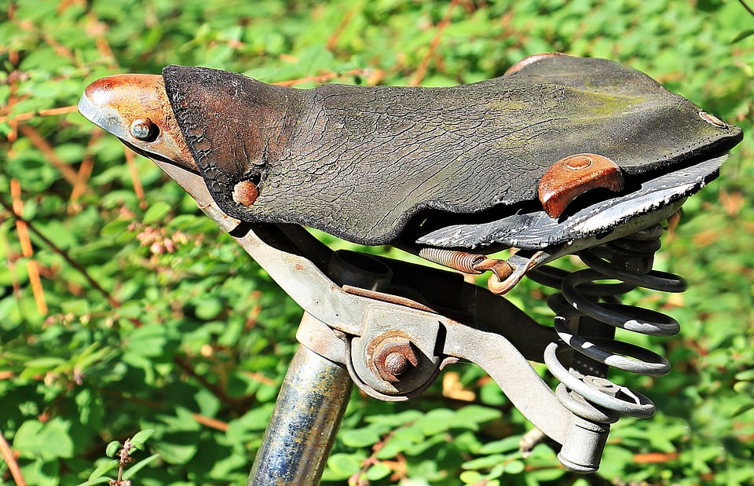
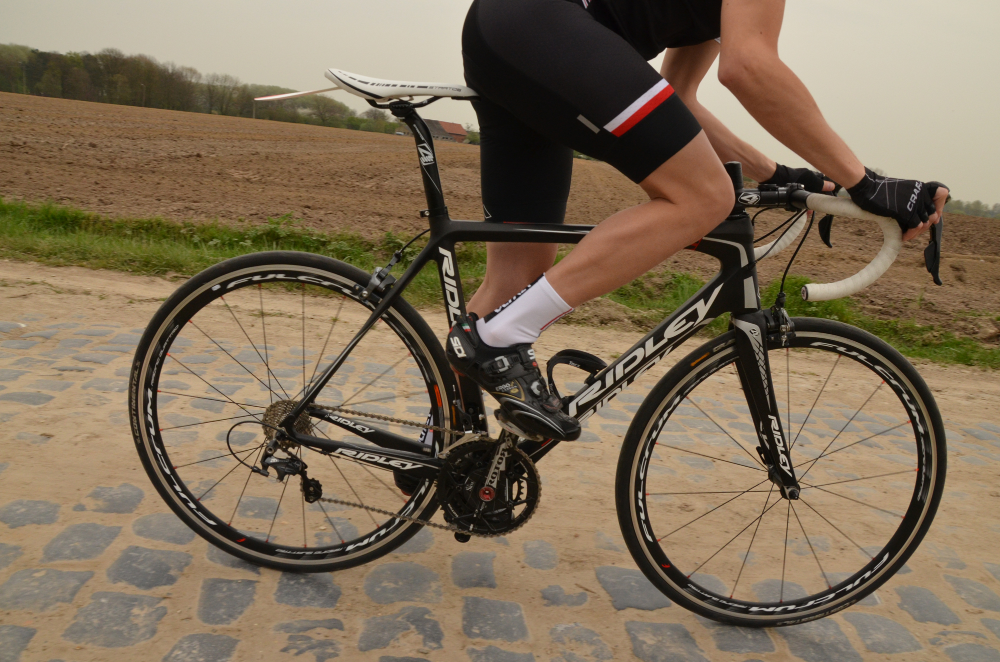

Sometimes back I used to experience biking saddle sores and discomfort around the butt area; the worst part was that it was so itchy and I couldn’t help but quit cycling for two weeks.

If you’ve experienced serious saddle sores then you can relate to my situation.  You’ll barely have a smooth ride if your backside begins to feel sore and painful. For this reason, I thought it wise to cover important tips to help relieve and prevent bike saddle sores.

## Who are the Most Affected by Biking Saddle Sores?

Saddle sores do not discriminate against one group; it can affect pro cyclists or even beginners. We’ve heard legends withdraw from competitions such as Tour de France just because of serious sores. In order to avoid such situations, it’s imperative to follow my advice on the ideal ways to prevent sores when cycling. Below are some of the main causes of saddle soreness

## Causes

Saddle soreness is a type of pain or discomfort that affects the groin, perineum, and butt area (Areas in contact with the saddle). Soreness is also attributed to aggressive riding positions that might cause chafing around your inner thighs.

If you are used to riding for long hours, you’ll note that temporary inflammation, soreness and redness is inevitable. The problem comes when the issues worsens to an extent that you can’t ride any more for a few days or weeks. Physiotherapists always advise cyclists to act on such problems early enough before they develop to actual sores.

Riding on an uncomfortable saddle can also be a major cause of soreness. It is always good to check if the saddle has enough padding so that it keeps you comfortable at all times.

## Types of Biking Saddle sores

There exists two main types of saddle soreness, the first category happens to be the soft tissue saddle soreness. This is the type of soreness I experienced when I first started the sports of cycling. The other type happens to be skin abrasion where you tend to feel like your skin stings or is on fire.

### Soft Tissue

Soft Tissues saddle soreness happens when you ride for long distances leading to deep and profound pain around the skin. As mentioned earlier, firs time cyclists tend to experience this type of soreness which is attributed to pressure around your butt’s soft tissues.

### Skin Abrasion

When you suffer from skin abrasion, you will feel like your skin is on fire. It happens to most long distance riders including pro cyclists. It even gets worse when you start sweating and you’ll feel like your skin is stinging. This type of soreness is attributed to high friction around your thighs or butt. This condition should not be allowed to get any worse as it may develop to a condition known as saddlesore.

## Smart Tips to help you Prevent Biking Saddle Sores

You’ve probably tried some weird methods to keep the sores away and they’ve not worked well. Good news is that these tips will help you in a significant manner and you will no longer have to stay away from the cycling sport.

### Ensure that your Saddle is well fitted

It is important that your saddle is fixed at the correct height such that you can reach your handlebar without stress. This way, you will have a comfortable ride and you will hardly feel soreness or discomfort after long rides.

### Choose a high-quality saddle

The choice of your bike saddle will determine whether you will have a comfortable or awful ride. People have different backsides and therefore it’s imperative to ensure that you pick the one that suits you best. Besides, a big and padded saddle might work best for some people and on the other hand some will prefer the ultra-light and thin saddles. It is always good to test the saddles before you choose.

#### How to Find a High-Quality Saddle

Choosing a comfortable bike saddle is about a lot more than the brand. Read on to learn about the features you need to consider when selecting a saddle for your bike.

**Multiple sizes**\- If you want a comfortable ride, don't settle for a one-size-fits-all saddle. Instead, look for a saddle that comes in multiple widths. This will allow you to find a saddle that fits your unique skeletal structure, thereby eliminating a lot of the pressure and soreness commonly associated with cycling. To determine the right saddle size for you, visit your local bike shop, and inquire about a "sit-bone" measurement. Most shops should be able to assist you with your request.

**Ride position**\- Do you prefer to ride in the aero position or fully-upright? If you answered "fully-upright" than you'll want to purchase a slightly wider saddle to maximize your ride comfort. (This is due to differences in bone placement between the two positions.)

Note: If you go to get measured for a bike saddle (a sit-bone measurement) be sure to mention your preferred bike position to the sales clerk, as this will have an impact on your saddle size.

**Upgraded rails**\- The two posts that help to attach the saddle to the seat post (known as the rails) have an affect on how a bike rides. In most cases rails are made of chromoly. However, the best saddles feature titanium rails, which are stronger and more flexible. Purchase a saddle with upgraded rails, and your saddle will last longer and perform better.

**Leather**\- If you plan to spend a lot of time on your bike, make sure your saddle is covered with a durable material like leather or synthetic leather. Vinyl and Lycra-covered saddles start out looking great, but these materials never hold up as well as leather.

**Weight**\- If you've put a lot of time and expense into shaving weight off of your bike, don't make the mistake of falling for a super-plush saddle that's going to add weight back onto your bike. Remember: Gel may feel more comfortable, but it's going to weigh more too, so decide how much weight your willing to add for the sake of comfort.

**Gender specific**\- If you're going to put money into a new bike saddle, go for one that's gender specific. Since men and women are built differently, you can't expect a unisex saddle to fully address the comfort needs of both genders.

Stick to the above criteria and you're sure to end up with a high quality bike saddle that's both comfortable and long-lasting.

### Buy Quality cycling shorts

Investing in some cheap bike shorts is always a bad idea. Ensure that you buy some quality [**padded bike shorts**](https://mtbnz.com/best-mountain-bike-shorts/) since they will be a good solution to a sore behind. Nowadays, manufacturers have improved cycling shorts to ensure that they provide maximum comfort.

For those who love bib shorts, ensure that you choose the one that suits you. Additionally, you should never wear underwear when riding otherwise they will retain moisture and lead to soreness and skin infections.

### Always apply butt butter/ Chamois cream

As much as it sounds weird, cyclists are always advised to apply butter or chamois cream on the short’s padding area. It has been proved effective in reducing friction and ultimately preventing saddle sores.

Besides, the cream has moisturizing properties that will aid in preventing cracking. You will also note that the best brands have antibacterial properties that will work well to keep bacteria away. Below are some of the best brands for both men and women.

### [DZNuts Bliss Chamois Cream for Women](http://amzn.to/2gfPDKt)

 \[themify\_button style="large pink" link="http://amzn.to/2gfPDKt"\]Buy Now\[/themify\_button\]

- This chamois cream is specifically designed for women.
- it has anti-inflammatory and anti-bacterial properties.
- It protects sensitive or delicate skins against the chamois padding.

 

 

### [Chamois Butt'r Original](http://amzn.to/2wxFgrF)

\[themify\_button style="large green" link="http://amzn.to/2wdvLLN"\]Order Now\[/themify\_button\]

- Chamois Butt'r makes the perfect cream for pros
- It is non-greasy & also gluten free
- It has no artificial ingredients or colors

 

### [\[/themify\_box\]](http://amzn.to/2gfPDKt)

### Always keep your cycling shorts clean

Wearing dirty shorts allows bacteria to thrive in the padding section. You should wear your cycling shorts only once and wash them after use. This is a great way to keep bacteria away and preventing sores. Cyclists are advised to shower using antibacterial soap, especially around the saddle contact area.

### Avoid sitting on the saddle for long

Even though you are cycling on a flat area, it is good to take a break and ride while standing for some time. This process will ensure that you backside has enough blood flow while riding.

## What If I Still Get a Saddle Sore?

Treat the first symptom (the hot spot) with Bag Balm®. This old fashion medication, designed for a milk cow's sore and irritated teats (from too much frictional rubbing) is available at many pharmacies and animal supply stores. Lot of Bag Balm® applied to irritated areas immediately after your shower will usually result in recovery overnight. This will help heal the superficial wound and prevent its worsening while you're off the bike.

If using a goop originally developed for cow teats makes you uneasy, get a prescription for a strength topical steroid ointment such as Temovate®. There are side effects and dangers with frequent usage, and it costs ten to forty times as much as Bag Balm®.

Whether you use Bag Balm® or prescription steroid ointments, apply it in the evening, and cover it with Vaseline the follow morning. If, after riding several hours, this area of irritation again appears, smear on more Vaseline.

### Stage 2: Folliculitis

This looks like acne -- small red bumps with puss-filled heads. These are found in hair follicles, and there's often a hair sprouting right out of the puss-filled bump. If this sounds like something you'd like to prevent, just ride with freshly-laundered cycling shorts each day, and/or use lots of Vaseline. Topical antibiotic gel or oral antibiotics may help, too.

Note: If you start your rides with a clean crotch and a clean, Vaseline-covered chamois, and you reapply Vaseline daily, you can go a week or two without laundering your shorts. That's how good Vaseline is.

### Stage 3: Abscess

This is an infected, red, hot, swollen, tender bump that varies in diameter between a third of an inch to two inches. These frequently scar over and may form sinus tracks with extensions going in multiple directions from the original lesion. In addition, cysts may form that totally surround the abscess after it has been resolved, or may develop directly from the folliculitis stage without abscess development.

If an abscess occurs, quit riding until they're healed. Go to your doctor (whom you should have seen before now), who then may prescribe oral antibiotics.

### Soap Tips For Folks With Problem Crotch Skin

Cetaphil®, Dove® or Purpose® soap. Wash gently and moisturize with simple emollients like Eucerin Creme®, Aquaphor®, Moisturel®, Curel® or Bag Balm®. You may actively reverse irritant dermatitis by using over-the-counter 1% Hydrocortisone Ointment, or prescription hydrocortisone ointments.

A little TLC to the groin to prevent irritation and lots of Vaseline will keep you riding long and pain-free.

## Conclusion

Controlling and preventing saddle sores can be so easy if you follow the tips discussed above. These tips are meant to help pro cyclists and beginners to stay comfortable during their everyday rides. Check the video below for more information

\[embed\]https://www.youtube.com/watch?v=BhZZnTgxrDM\[/embed\]
