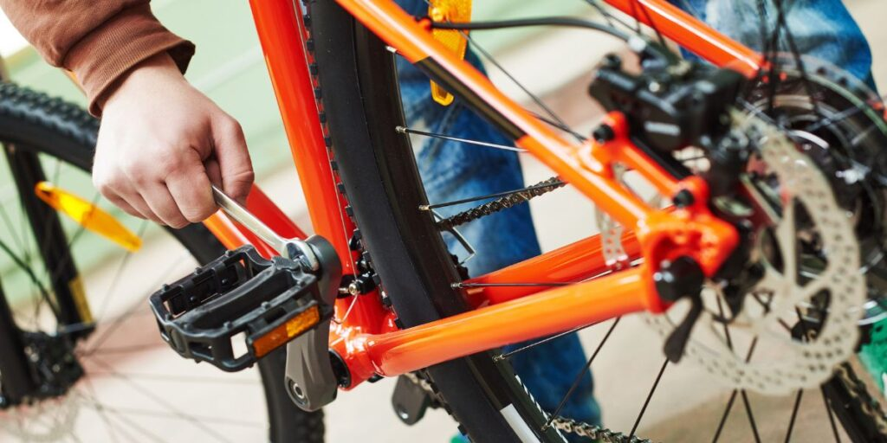
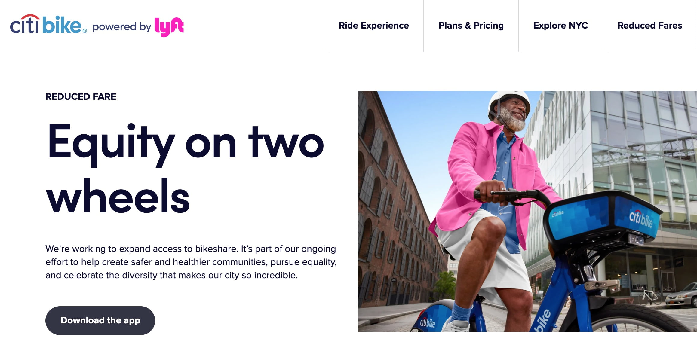
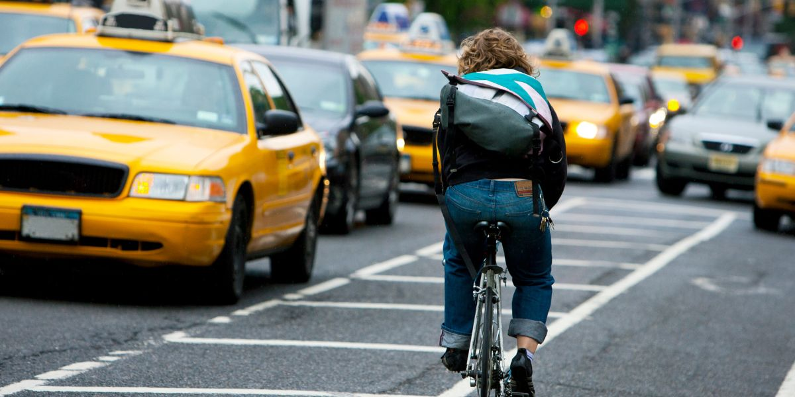

Picture this: it's a crisp Monday morning, and instead of being stuck in traffic or crammed into a crowded bus, you're breezing through the city streets, the wind in your hair, on your trusty two-wheeler. Sounds like a dream, right? 

Well, it's a reality for a growing number of Americans who are choosing to ride their bikes to work. According to the most recent American Community Survey, about 872,000 people, or 0.6% of all workers in the United States, bike to work.

While this might seem like a small percentage, it's a significant number of people swapping four wheels for two. And it's not just the young and fit who are hopping on their bikes. Workers of all ages are joining the trend, with 1.0% of workers aged 16-24, 0.7% of workers aged 25-44, and even 0.4% of workers aged 45 and older choosing to commute by bicycle

And why not? Biking to work is not only fun and healthy, but it's also a smart financial move. In 2021, the average American household spent more than $5,000 just on car payments and insurance. In contrast, a brand new commuter bike can cost anywhere from $250-$1,500 USD, with an average yearly maintenance cost of around $50 USD.

But the benefits of biking to work go beyond the individual. Cities with high levels of bicycle commuting, like Portland, Oregon (6.5%), and Washington, D.C. (4.6%), are vibrant, active communities with a strong sense of camaraderie among cyclists.

And let's not forget the environmental impact. Every person who chooses to bike rather than drive is helping to reduce traffic congestion and air pollution.

## Riding a Bike to Work Saves a Lot of Money

<figure>

<figcaption>

Maintaining a bike is generally less expensive than maintaining a car.

</figcaption>

</figure>

#### Cost of Biking to Work

- **Bicycle purchase**: A decent commuter bike costs around $500-$1,000 initially.
- **Maintenance**: Around $100-$350 per year for tune-ups, new tires, etc. 
- **Fuel (food)**: An extra 500-1000 calories per day for a 10-20 mile commute, which could cost $1-3 per day depending on food choices

Total yearly cost: Approximately $600-$1,500.

#### Cost of Driving to Work

- **Car payment**: Average $393 per month or $4,716 per year.
- **Insurance**: Average of $1,574 per year.
- **Gas**: Average of $2.88 per gallon currently, with an average fuel economy of 25 mpg. For a 20-mile round-trip commute, costs about $1,300 in gas per year.
- **Parking**: Average of $100-$300 per month based on location, or $1,200-$3,600 per year.
- **Maintenance and repairs**: Average of 9.5 cents per mile, so about $950 for 10,000 miles commuted.

Total yearly cost: $8,740-$12,140

According to data from the [Bureau of Labor Statistics](https://www.sj-r.com/story/business/columns/2020/08/25/money-on-brain-use-your-bicycle-for-transportation-to-save-money/114360262/), if you were to ditch your car altogether, you could save a whopping $4,280 per year. This includes savings on vehicle insurance ($1,575 per year), gas and other fuel ($1,568 per year), maintenance and repairs ($879 per year), and vehicle finance charges ($258 per year).

But let's say you're not ready to completely give up your car. Even if you just leave it parked while you bike to work, you'd still save $1,568 per year on gas, other fuel, and motor oil. That's a savings of $130.67 per month or $4.30 for every day you spend pedaling.

Now, let's consider the cost of fuel. With the current national average price of gas at $4.85 per gallon, a 10-mile commute to work would cost you around $1.94 each way, assuming your vehicle gets an average of 25 miles per gallon. That's nearly $4 per day, or about $20 per week, just on gas! Over the course of a year, that adds up to a staggering $981.30.

But the savings don't stop there. According to a 2021 study from AAA, vehicle maintenance and repairs cost an average of 9.55 cents per mile. So, if you were to bike those 5,200 miles instead of driving, you'd save an additional $497 per year.

And let's not forget about insurance. Most insurance companies allow up to 20 miles each way to work before they start increasing premiums. By reducing your commuting miles, you could potentially save on car insurance as well.

So, next time you're about to hop in your car to commute to work, consider grabbing your bike instead. Not only will you be doing your part to reduce carbon emissions and improve your health, but you'll also be saving a significant amount of money. Now that's something to pedal about!

[How to Start Biking to Work](https://mtbnz.org/how-to-start-biking-to-work/)

## Riding a Bike to Work Saves You More Time

<figure>

<figcaption>

Citi Bikes offer other advantages beyond speed. They provide a cost-effective and environmentally friendly alternative to cars and taxis.

</figcaption>

</figure>

You might be surprised to learn that riding a bike to work can actually be faster than driving a car or taking public transportation, especially if you're commuting in a bustling city like New York.

According to the [Mobility Report](https://www.nyc.gov/html/dot/downloads/pdf/mobility-report-2019-print.pdf) released by the New York City Department of Transportation (DOT), the average speed of a car in the city is a mere 5 mph. In contrast, [Citi Bikes](https://citibikenyc.com/), the city's bike-sharing system, go about 30 percent faster.

The report also found that a trip between a half-mile and a mile long takes an average of 10 minutes and 12 seconds by taxi, but only 7 minutes and 27 seconds via Citi Bike. And the longer the distance, the greater the speed benefits of the bike. A trip between 1.5 to 2 miles takes 21 minutes and 3 seconds by taxi, but just 14 minutes and 30 seconds by bike.

And it's not just New York. A study by Geotab found that during peak rush hour times, traffic speeds drop significantly in major U.S. cities. In New York City, for example, speeds drop 38% to 22 mph at 5-6 p.m

Aside from being faster, biking to work also saves time in other ways. For instance, you don't have to spend time searching for parking or waiting for public transportation. Additionally, biking to work doubles as a form of exercise, which means you can save time by combining your daily workout with your commute.

Ultimately, cyclists gain back precious hours to pursue hobbies, spend time with family, and fully recharge.

## Riding a Bike to Work Reduces Your Carbon Footprint

<figure>

<figcaption>

Bikes produce no noise or air pollution, improving urban livability

</figcaption>

</figure>

Did you know that the transportation sector in New York is responsible for the largest share of the state's total annual carbon dioxide (CO2) emissions? Yes, you heard it right! In fact, [transportation emissions](https://cbcny.org/research/4-facts-about-new-yorks-transportation-emissions) account for a whopping 47% of New York State's CO2 emissions.

Now, let's put that into perspective. Despite New York's relatively low per capita transportation emissions, largely driven by New York City's extensive use of mass transit, the state's transportation emissions have been on the rise. From 1990 to 2018, emissions per capita increased by 23% in New York.

But here's the kicker: a significant chunk of these emissions comes from motor gasoline, which accounts for the highest share of transportation-related emissions.

And guess what? A [Harvard study](https://nyc.streetsblog.org/2021/06/08/harvard-study-car-pollution-in-nyc-claims-1400-lives-billions-in-costs) found that car pollution in New York City alone claims around 1,400 lives every year.

Riding a bike to work is a fantastic way to help the planet. And if you're thinking, "But I can't possibly bike all the way to work," then [electric bikes](https://mtbnz.org/best-e-bike-under-1000-dollars-top-reviews-of-best-budget-electric-bikes/) (e-bikes) might just be the solution you're looking for.

E-bikes are not only easier to ride over long distances and hilly terrains, but they're also much better for the environment compared to cars.

Driving a car produces, on average, at least 130 g of CO2 per kilometer. In contrast, an e-bike can be ridden for at least [100 km with a kWh of electricity](https://www.ebike24.com/blog/co2-ebikes-vs-cars), producing approximately 1 to 2 g of CO2 per kilometer.

And let's not forget about the heat. A 2,000 cc car engine releases two liters of hot gases for every tour, contributing to global warming. On the other hand, e-bikes are cool, literally and figuratively.

- If just 5% of NYC commuters who currently drive switched to biking, it would reduce CO2 emissions by [150 million pounds per year](https://www.onecommunityglobal.org/climate-impact-of-biking-vs-driving/), equal to a forest 1.3 times the size of Manhattan.
- Over a 10-year lifespan, an e-bike ridden 10,000 km will produce about [50kg of CO2 from charging the battery](https://nyc.streetsblog.org/2021/06/08/harvard-study-car-pollution-in-nyc-claims-1400-lives-billions-in-costs), assuming a carbon-intensive electricity grid. A car driven the same distance will produce 27,100kg of CO2.

## Cycling to Work is a Great Way to Lose Weight

<figure>

<figcaption>

Cycling is a low-impact aerobic exercise that can help you lose weight, lower your cholesterol, and strengthen your legs

</figcaption>

</figure>

According to data from the 2017 National Household Travel Survey, the [average trip to work for Americans](https://nhts.ornl.gov/assets/2017_nhts_summary_travel_trends.pdf) is about 12 miles.  Now, imagine turning that daily drive into a bike ride. Not only would you be saving on gas and reducing your carbon footprint, but you'd also be burning calories and boosting your fitness levels.

Research shows that [cycling more than 1.5 hours per week](https://www.ncbi.nlm.nih.gov/pmc/articles/PMC6103342/) is associated with lower body weight, waist circumference, and percent body fat. So, if you're riding a bike to work and back five days a week, you're not just commuting - you're on a weight loss journey!

But wait, there's more! Cycling doesn't just burn calories while you're on the bike. Sports scientists say that even a leisurely urban ride of about five miles is enough to raise your metabolism for hours afterward. That's right, you'll be burning calories even after you've parked your bike and settled into your office chair.

According to a Harvard study, a 185-pound individual can burn around [355 calories in just 30 minutes of cycling](https://www.health.harvard.edu/diet-and-weight-loss/calories-burned-in-30-minutes-for-people-of-three-different-weights) at a moderate pace. That's comparable to a high-intensity circuit training session or a 5 pm run!

But here's the kicker: if you cycle for about 45 minutes at a moderate intensity, you can burn approximately 500 calories. Do this five times a week, and you're looking at a whopping 2,500 calories burned. That's the equivalent of about 0.7 pounds of fat, considering that one pound of fat is roughly 3,500 calories.

[Aerobic exercise](https://mtbnz.org/is-biking-aerobic-or-anaerobic-exercise/), like cycling, uses your body's large muscle groups in a rhythmic and repetitive manner, increasing your heart rate and oxygen use. This type of exercise is known for reducing the risk of heart disease, diabetes, high blood pressure, and high cholesterol

 

## Riding to Work Boosts Your Happiness Levels

- **Cycling boosts happiness and life satisfaction**. [Surveys](https://bikebiz.com/the-mental-health-benefits-of-cycling/amp/) have consistently shown that cyclists have higher overall well-being and are more satisfied with their commutes compared to drivers. One study found active commuters who biked were happier than any other mode of transport.
- **Cycling may help fight depression and anxiety**. [Research](https://www.sustrans.org.uk/our-blog/get-active/2020/everyday-walking-and-cycling/why-cycling-and-walking-are-great-for-your-mental-health) shows aerobic exercise like cycling can reduce symptoms of depression and anxiety by releasing endorphins and other neurotransmitters.

It turns out that riding a bike to work doesn't just save you from traffic jams and parking woes, it also significantly boosts your happiness and relaxation levels.

A [study](https://www.sciencedirect.com/science/article/abs/pii/S0966692318307269) published in the _Journal of Transport Geography_ found that workers who commute by bike are more productive and happier than those who drive or use public transportation.

The researchers collected data from 1,121 full-time workers and daily commuters and discovered that those who lived shorter distances from work, as well as those who walked or biked to work, reported feeling more calm, relaxed, enthusiastic, and satisfied with their commutes. They were also more productive on the job than folks who had long commutes and those who drove in cars or took subways, trains, or buses.

But how does cycling make us happier? Well, it's all about [the body's chemistry](https://www.webmd.com/fitness-exercise/bike-commuting-health-benefits). Biking releases feel-good chemicals in your brain called endorphins, which can make you feel better, especially if you're under stress.

Regular physical activity from biking also positively boosts your overall mental health, improving your mood, pumping up your self-esteem, and lowering depression and anxiety

Now, let's contrast this with driving a car in major US cities. Commuting by car exposes you to traffic-related air pollution, which can have detrimental effects on your health.

Moreover, [research](https://www.sciencedirect.com/science/article/abs/pii/S1369847815001370) shows that driving is the most stressful form of transportation. 

So, while you're stuck in traffic, inhaling exhaust fumes, and stressing about being late, cyclists are breezing past, breathing in relatively cleaner air, and getting a happiness boost from their endorphin release.

## Riding a Bike to Work Benefits the Local Economy

A [2018 study](https://www.forbes.com/sites/carltonreid/2018/11/16/cyclists-spend-40-more-in-londons-shops-than-motorists/?sh=168163d3641e) showed that cyclists spent 40% more at local businesses in London, and similar findings have been reported in many smaller cities worldwide. This makes sense—cyclists shop more frequently due to smaller carrying capacity, and it's easier to park a bike in front of a shop than to find a parking space for a car.

Biking to work has numerous economic benefits for individuals, cities, and society. Here are some key points:

1. **Health benefits**: Cities with good biking and walking infrastructure have [healthier residents](https://www.reuters.com/article/us-health-costbenefit-bike-lanes/bike-lanes-are-a-sound-public-health-investment-idUSKCN11Z23A/) and lower healthcare expenses, increasing the spending power of those residents.
2. **Local business support**: Cyclists tend to [spend more money](https://www.forbes.com/sites/carltonreid/2018/11/16/cyclists-spend-40-more-in-londons-shops-than-motorists/?sh=38e65e3c641e) at local businesses compared to car drivers. A study in London showed that cyclists spent 40% more at local businesses than car drivers.
3. **Job creation**: Bike infrastructure projects create more jobs than road-only projects. A [study](https://peri.umass.edu/publication/item/427-pedestrian-and-bicycle-infrastructure-a-national-study-of-employment-impacts) by the _Political Economy Research Institute_ showed that bike infrastructure projects create over 30% more jobs than road-only projects.
4. **Property value increase**: Houses in areas with [above-average bike and pedestrian infrastructure](https://www.peopleforbikes.org/statistics/environmental) are worth more than comparable houses in areas with average walkability/bikability.
5. **Tourism**: Bicycle tourism generates significant revenue for cities and towns. For example, bicycle tourism generates [$43 million each year](https://bikeleague.org/sites/default/files/Bicycling_and_the_Economy-Econ_Impact_Studies_web.pdf) in Western North Carolina.
6. **Cost savings**: Building bike lanes is cheaper than building highways. It costs about [$60 million to build a mile of urban freeway](https://www.fastcompany.com/3021074/making-the-economic-case-for-cycling-friendly-cities-with-bikeonomics), but on average, less than $250,000 to build a mile of bike lane

## Riding a Bike to Work Benefits Your Mobility

Cycling is a fantastic way to improve your balance and coordination. A [study](https://www.ncbi.nlm.nih.gov/pmc/articles/PMC3652161/) conducted on adults aged 44-79 found that those who had cycled in the last month performed significantly better on measures of decision time and response time, which are key indicators of balance.

Cycling at least one hour a week was associated with significant improvements in balance and timed [single-leg standing](https://www.ncbi.nlm.nih.gov/pmc/articles/PMC3652161/). This suggests that regular cycling can help enhance your balance, which is crucial in preventing falls and maintaining overall physical stability.

Flexibility is another area where cycling shines. Adequate flexibility in the back, hips, and hamstrings helps maintain a strong posture, especially when trying to be more aerodynamic. Without enough flexibility in these areas, your body will change your biomechanics to compensate, which can lead to discomfort or even injury. 

By improving your flexibility, you can achieve and maintain a more comfortable cycling posture, and even become more aerodynamic, making your ride smoother and faster.

Riding a bike to work is more than just an eco-friendly alternative to gas-guzzling cars or crowded public transport. It's a lifestyle, a statement, a way to reclaim your time and your city. It's about embracing the joy of movement, the thrill of speed, and the satisfaction of self-reliance. It's about seeing your city in a new light, and discovering hidden paths and scenic shortcuts. It's about the camaraderie among cyclists, the shared nods of understanding, the unspoken bond that connects all of us who choose two wheels over four.

But why should you consider swapping your car keys for a bike helmet? Well, the benefits are nearly innumerable.

We'll cover how to pick the perfect commuter bike, accessories that make your ride more comfortable, tips for hauling work items, staying visible and safe in traffic, and more. I'll even throw in some ideas for fun group rides so you can turn your commute into a social event.
