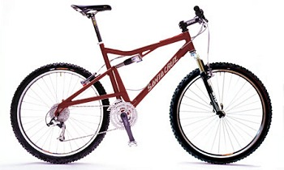
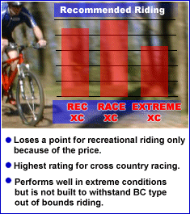

<table border="0" width="100%" cellspacing="0" cellpadding="0"><tbody><tr valign="TOP"><td colspan="2" bgcolor="#CC0000"><b>Santa Cruz Superlight</b></td></tr><tr valign="BOTTOM"><td colspan="2"> The Superlight, as the name implies, is a lightweight cross country mountain bike from Santa Cruz. You can get more info about the company and their bikes at their web site.

Santa Cruz's Color Picker is a great component/price comparison. It shows you a picture of the bike configured the way you want with the price and weight. Be sure to check it out at www.santacruzmtb.com.&nbsp;</td></tr><tr><td colspan="3"><table border="0" width="100%" cellspacing="2" cellpadding="0"><tbody><tr valign="TOP"><td>&nbsp;&nbsp;&nbsp; Find yourself an anchor to go with the Santa Cruz Superlight if you are fortunate enough to get to ride it.&nbsp; It may be the only thing that keeps you on the ground.

This bike is impressive in so many ways.

Before you ever touch it, the high points of the component setup dazzle you: Easton Monkey Lite CT2 carbon fiber riser bar, Fox Float Rear Shock, Rockshox SID HydraAir fork, Titec reinforced stem, Easton&nbsp; EA70 aluminum seatpost, do I have to go on? This sounds like a wish list for anyone who has ever upgraded their factory parts!

Once you do get past the mouth watering components you are ready to ride this steed.&nbsp; I have recently ridden Fisher’s Sugar and I would have to compare this bike to that one as far as the feel of the ride and heightened maneuverability it has.

When I rode the Sugar I never thought I’d be saying it this soon but I think this bike actually outperforms the Sugar, for one reason though...weightlessness.&nbsp; This bike feels so light that when braving technical terrain, you can spend precious time deciding which route around objects you will take, OR you can just go OVER it.

Seriously, I was able to clear obstacles easily on this bike that I usually have to work hard at. That combined with the tremendous amount of speed you can generate on this bike really open up that tired bit of single track you only hit when you’re bored.

The Racing Raptors really enable you to tear through single track like you have a pack of wild animals chasing you, or a couple buddies you just really want to wail on!&nbsp; The plush, yet responsive, suspension lets you tear through downhill terrain with a dangerous amount of abandon.

Until you realize just how fast you’re going and decide you’d like to ride again tomorrow, it’s hard to back off.&nbsp; Simply put, an incredibly light frame design by Santa Cruz, combined with some standout high-performance components, really make an amazing ride.&nbsp; Don’t plan on sightseeing with this bike, it will all be a blur.</td><td><table border="" width="100%" cellspacing="0"><tbody><tr><td><table border="0" width="100%" cellspacing="2" cellpadding="2" bgcolor="#FFFFFF"><tbody><tr bgcolor="#EFEFEF"><td colspan="2" bgcolor="#000099"><b>"The Specs"</b></td></tr><tr bgcolor="#CCCCCC"><td><b>Manufacturer</b></td><td>Santa Cruz</td></tr><tr><td><b>Model&nbsp;</b></td><td>Superlight X&nbsp;</td></tr><tr bgcolor="#CCCCCC"><td><b>Bike Category&nbsp;</b></td><td>Mountain Bike&nbsp;</td></tr><tr><td><b>Type&nbsp;</b></td><td>XC / Race</td></tr><tr bgcolor="#CCCCCC"><td><b>Suspension&nbsp;</b></td><td>Full Suspension&nbsp;</td></tr><tr><td>Price&nbsp;</td><td>$2195&nbsp;</td></tr><tr bgcolor="#CCCCCC"><td><b>frame material&nbsp;</b></td><td>6061 T6 aluminum, double-butted&nbsp;</td></tr><tr><td><b>fork&nbsp;</b></td><td>Rock Shox Sid XC, 3.15 travel</td></tr><tr bgcolor="#CCCCCC"><td><b>Rear Shock&nbsp;</b></td><td>Fox Float R, 4.0 travel</td></tr><tr><td><b>Rims&nbsp;</b></td><td>Front: Bontrager Valiant, Rear: Bontrager Valiant Assymetri</td></tr><tr bgcolor="#CCCCCC"><td><b>Front Hub&nbsp;</b></td><td>Shimano LX&nbsp;</td></tr><tr><td><b>Rear Hub&nbsp;</b></td><td>Shimano LX</td></tr><tr bgcolor="#CCCCCC"><td><b>Spokes&nbsp;</b></td><td>15g spokes, alloy nipples, radial lace front, 4x race lace rear&nbsp;</td></tr><tr><td><b>tires&nbsp;</b></td><td>Huthinson Air Lite Python 2.0 kevlar / 110g tubes&nbsp;</td></tr><tr bgcolor="#CCCCCC"><td><b>Pedals&nbsp;</b></td><td>Not included&nbsp;</td></tr><tr><td><b>Crankset&nbsp;</b></td><td>Shimano Deore LX, 22/32/44 teeth</td></tr><tr bgcolor="#CCCCCC"><td><b>Chain&nbsp;</b></td><td>Shimano CN-HG72, 1/2 x 3/32</td></tr><tr><td><b>Rear Cogs&nbsp;</b></td><td>9-speed, 11 - 34 teeth</td></tr><tr bgcolor="#CCCCCC"><td><b>Bottom Bracket&nbsp;</b></td><td>Shimano BB-ES70, 113mm spindle</td></tr><tr><td><b>Front Derailleur&nbsp;</b></td><td>Shimano Deore LX top-swing, top-pull/clamp-on 31.8mm</td></tr><tr bgcolor="#CCCCCC"><td><b>Rear Derailleur&nbsp;</b></td><td>Shimano Deore XT SGS&nbsp;</td></tr><tr><td><b>Shifters&nbsp;</b></td><td>Shimano Deore LX RapidFire SL&nbsp;</td></tr><tr bgcolor="#CCCCCC"><td><b>Handlebar&nbsp;</b></td><td>Azonic World Force riser 1.5" or Easton Monkey Bar (upcharge)</td></tr><tr><td><b>Stem&nbsp;</b></td><td>Titec Big AL&nbsp;</td></tr><tr bgcolor="#CCCCCC"><td><b>Headset&nbsp;</b></td><td>Dia-Compe Kontact 130g&nbsp;</td></tr><tr><td><b>Brakeset&nbsp;</b></td><td>Avid 1.0 V-brakes brakes, Avid SD-2.0 L levers</td></tr><tr bgcolor="#CCCCCC"><td><b>Saddle&nbsp;</b></td><td>WTB SST hollow cromo 270g&nbsp;</td></tr><tr><td><b>Seatpost&nbsp;</b></td><td>Kalloy Uno 230g 350mm</td></tr><tr bgcolor="#CCCCCC"><td><b>Weight&nbsp;</b></td><td>24.5&nbsp;</td></tr><tr><td><b>Colors&nbsp;</b></td><td>Gray, Red, Scuba Yellow</td></tr><tr bgcolor="#CCCCCC"><td><b>Sizes&nbsp;</b></td><td>large, medium, small, xlarge</td></tr></tbody></table></td></tr></tbody></table></td></tr><tr><td colspan="2"></td></tr></tbody></table></td></tr></tbody></table>
