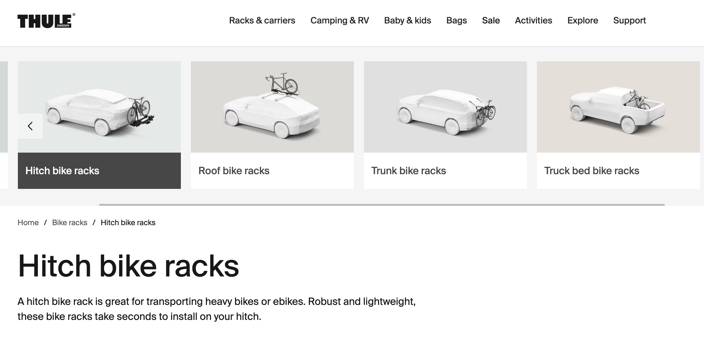
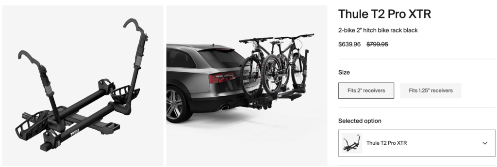

As an avid cyclist who regularly transports my bikes, I'm always on the lookout for a heavy-duty yet user-friendly bike rack.

After testing numerous options over the years, I can confidently say the Thule T2 Pro XTR 2-Bike Hitch Rack is hands-down the best I've ever used.

I purchased it a few months ago and have been nothing short of impressed with its performance.

Installation was an absolute breeze thanks to the tool-free AutoAttach system. I simply inserted it into my vehicle's hitch receiver and tightened it by hand - no tools required!

I'm also a big fan of how easily the rack tilts down so I can open my hatch without having to take the bikes off each time.

Loading and unloading the bikes is smooth and fast with the ratcheting arm that holds everything securely in place without ever touching the bike frames.

I've used it to transport my [lightweight carbon road bike](https://mtbnz.org/carbon-bike-fork-buyers-guide-reviews/) as well as my heavier downhill mountain bike with no issues at all. It can truly accommodate a wide variety of bike sizes and styles.

One of my favorite features is the integrated cable locks that give me peace of mind when leaving my bikes on the rack. I also appreciate the lock on the hitch receiver itself, adding an extra layer of security.

As someone who's had a rack stolen before, I find these integrated locking systems invaluable.

After using the T2 Pro XTR for several months and hundreds of miles, I can confirm it is built to last. The sturdy metal construction has held up perfectly despite being bounced around on bumpy dirt roads.

I expect to enjoy many more years of use of this high-quality rack. While it does come at a premium price point, the Thule T2 Pro XTR is worth every penny in my opinion.

The robust design, effortless usability, versatility, and integrated security features make it the ultimate bike rack for cyclists who don't compromise on quality. I couldn't recommend it more highly!

[Check the Latest Price on Amazon](https://amzn.to/3swHS8p)

## Why Choose the Thule T2 Pro XTR

1. **Robust Construction**

The first thing I noticed about the Thule T2 Pro XTR was its solid build. The metal construction is sturdy and durable, giving me the confidence to load my precious bikes onto it. With a weight capacity of 120 lbs (60 lbs per bike), it easily accommodated my heavy mountain bike and road bike without any signs of strain.

2. **Ease of Use**

The T2 Pro XTR is incredibly easy to use. The tool-free AutoAttach system made installation and removal a breeze. Loading and unloading my bikes was equally straightforward, thanks to the ratcheting arm that securely held the bikes without touching the frames. The tilt-down feature was a lifesaver when I needed to access the trunk of my car without removing the bikes.

3. **Versatility**

What I love about the T2 Pro XTR is its versatility. It accommodated my road bike and mountain bike with ease, thanks to its adjustable mounts and wide compatibility with wheel sizes from 20 to 29 inches and tires up to 5 inches wide. The adjustable bike mounts allowed me to optimize the spacing between bikes, preventing any contact during transport.

4. **Integrated Security**

The integrated cable locks on the T2 Pro XTR gave me peace of mind when I had to leave my bikes on the rack unattended. The hitch lock was also a great feature, preventing the rack from being removed from my vehicle.

5. **Value for Money**

While the Thule T2 Pro XTR is a bit of an investment, I believe it's worth every penny. The robust construction, ease of use, versatility, and integrated security features make it a reliable and long-lasting solution for transporting my bikes. [Check the Latest Price on Amazon](https://amzn.to/3swHS8p)

## Background Information About Thule Bike Racks

Founded in 1924, Thule ranks among the best manufactures of bike accessories, roof racks and car racks. So far, the company has been in business for 96 years. This is no mean achievement, and perhaps the company’s excellent and patented bike rack design is the main driver behind such an enduring and sustainable enterprise.

So, what makes this rack so unique, you may ask?

Well, you will realize that ****__Xt2 pro__**** is an upgraded version of the T2 Classic. Being an upgrade means it has added features for your convenience and guaranteed bike safety.

Let’s dive a bit deep to get a better understanding of why this rack is so popular. 

## Thule T2 Pro XTR Review: Features & Technical Specs

- It is perfectly designed to accommodate bikes with fat or wide tires. What’s more, it offers enough space between the bikes to keep them from bouncing against one another, as this can cause damage.
- The installation and removal process is simple thanks to the convenient Auto Attach system (tool-free)
-  It is customized to fit the 20-inch-29-inch wheels and up to 5-inch tires devoid of adapters.
- This is a compact bike rack, complete with secure cable locks and a user-friendly tilt lever, all made of high-grade material. When you don’t need it, the carrier folds and tilts away from your car to allow rear access. The Hitch Switch lever enables the folding.
- It is designed to load two bikes and is ideal for various models including e-bikes, downhill, mountain, and fat bikes.
-  You can also secure a bike without frame contact using the frame-free ratcheting arm.
-  Ideally, it is designed to carry two bikes, but it is simple; if you wish to load more, just acquire the **_T_****_2 Pro XT 2-Bike Add-On_** to add the carrying capacity to four bikes. It is bought as a separate accessory. 

## Technical specs

Weight       

- 1.25 IN 51 pounds
- 2 IN 52 pounds

Hitch Receiver

- 1.25 IN 1.25 inches
- 2 IN 2 inches

Expandable Capacity   

- 1.25 IN:
- 2 IN +2

Max Weight Per Bike (lbs)

- 60 pounds

Number of Bikes

- Two bikes

Integrated Security

- Yes

Rear Liftgate Access

- Yes 

**Arguably,** _Thule’s T2 Pro XT_ is the finest hitch-mounted bike-rack out there because it has all the features any modern rack user would anticipate in a such a product. It is masterfully designed to feature

- built-in lock system
- secure ratcheting arms
- User-friendly tilt lever

A particular group of users subjected this rack to two years of aggressive testing and concluded that it is a hardy, enduring product built to last. Additionally, they confirmed that it could accommodate just about any bike model and even shoulder more than its recommended weight without caving in.

If that fits in the description you have for a sturdy hitch-mounted rack, then go for _Thule’s T2 Pro XT_

### ****It is easy to set it up and use****

****As is the case with other similar bike racks, the**** __Xt2 pro__ must be assembled before it is mounted for use. However, compared to other models, for example, __Yakima Dr Tray or__ [__Kuat’s NV Base 2.0__](https://www.avantlink.com/click.php?tt=cl&merchant_id=e295c418-295a-447c-b265-734e25f82503&website_id=3968c905-b99c-41db-88ba-2eae2df15057&url=https%3A%2F%2Fwww.rei.com%2Fproduct%2F116850%2Fkuat-nv-base-20-2-bike-hitch-rack&ctc=t2review|xid:fr1612442476605ecc), it takes a little longer to set up the __Xt2 Pro__. 

On average, it may take you twenty-five minutes to fix it.

While fixing the front wheel cradles, please pay special attention to some underlying intricacies involved, for example, ensuring that they (__Wheel cradles__) are facing the right direction. Otherwise, you may place them wrongly and end up with a faulty installation.

If you have experience with the platform version of hitch racks, you must have realized just how user-friendly they are. The __Xt2 pro__ is no exception to this merit, and in fact, it is a trailblazing example.

It only takes about 10 seconds to load or unload one bike, which is really fast. What’s more, the ratcheting arms are straightforward to apply. You simply have to rest the bike on the rack and then close the arm over the front wheel before pulling down the handle to ensure that it has a proper grip on the tire.

Once you’ve fixed the front wheel, you can secure the rear wheel by looping the strap over it.

Despite subjecting the rack to aggressive use, most users have had little criticism to share regarding this aspect of the __Xt2 pro.__

### __Thule T2 Pro XTR Review: B__ike Capacity & Wheel Sizes

Both __Xt2 pro__ receiver models, i.e. the 2” and 1.25” can generally take two bikes. However, this product’s uniqueness is its capacity to accommodate a broader range of bikes without adapters.

Given the broader cradles which can take in tires measuring up to five inches wide, this product can comfortably ferry road bikes, mountain bikes, and fat bikes.

Competitors like __Kuat Racks, Yakima__, and __1Up USA__ need you to purchase swapping parts and extra hardware to enjoy the same functionality.

If you need to ferry more than two bikes, you can easily double up the rack’s capacity using a separate add-on. However, this extension is only available for the two-inch receiver model.

Unfortunately acquiring this extension is a pricey affair as you will need to dig out an extra $ 450.

### Thule T2 Pro XTR Weight Limit

****The**** __Xt2 pro__ can carry two 60-pound bikes that equate or make it better than its competitors. A test run once done by a user confirmed that this rack could hold two e-bikes weighing 65-70 pounds comfortably over a 60-mile distance.

While this is slightly above the recommended weight, this test run showed that the rack could handle some extra weight with minimal risk. However, you are strongly advised to remain within the manufacturer’s weight recommendations.

### Thule T2 Pro Build Quality

Well, what else would you expect from an elite rack like the __Xt2 Pro?__  

Clearly, the manufacturer did not compromise on the materials’ quality because it is noticeably among the heaviest-duty racks available today. Actually, it looks heavier than the Yakima Dr Tray, and it is even slightly more expensive (It costs approximately $21 more than the Yakima Dr Tray)

It features a relatively sturdy metal frame with plastic cradles and other parts that are equally robust.

However, if you compare the __Xt2 pro__ with __1Up USA__, you quickly notice that the latter is much stronger because of its Heavy Duty Double full metal construction.

We talked to one user who had put this rack to a two-year test run to qualify its durability. Apparently, the only issue he raised with the equipment was a tiny loose screw fixed on the tilt lever handle. To correct the problem, he simply applied a drop of __Loctite thread locker Blue 242__ and all was well again.

__“While I have experienced some durability challenges racks from Kuat and Yakima, Thule’s__ __Xt2 pro__ __has been outstanding and exceptional____,” he said__

Although __Xt2 Pro__ is a little more expensive and comparatively heavier, its long-term value is remarkable.

### The Rack’s Weight

The equipment weight is of great concern for any rack user because no one wants to drive around with something bulky weighing down their vehicle’s rear. Apparently, the __Xt2 pro__ features among the heavier gadgets, weighing approximately 52 pounds.

Not to worry much, though, because 52 pounds is reasonably within the range of the other quality racks. That weight is also justified by the strong metal and other quality elements in the mix.

A moment of quick comparison would reveal that.

- Kuat’s NV Base 2.0 is a little lighter, weighing 51 pounds.
- 1Up USA’s HDD Weighs 46 pounds
- Thule Helium Platform 2 Bike Hitch Rack weighs 43 pounds
- Yakima’s Dr Tray is much lighter than the rest weighing just 34 pounds

## Why We Recommend the Thule T2 Pro XTR

### The attachment system

This bike’s ratcheting arms are arguably the sturdiest in its category. They inspire a feeling of absolute security even when you pull them side to side deliberately. This sense of attachment easily manifests in other parts as well.

For example, the top arm that presses against the tire can secure different machines, including fat, road, and mountain bikes. You will undoubtedly notice a particular clicking sound to confirm that your tire is secured and that the bike is safe even on a bumpy ride.

The attachments for securing the rear wheel are equally sturdy and user-friendly. Its strap features deep notches and two stopping locations. One of these is ideal for standard mountain and road bikes while the other one serves the fat bikes better.

On various platform racks, all you have to do is pull the strap till tight using your bare hands.

### TheTilt Lever (Thule’s Hitch Switch)

The rack’s tilt system, popularly known as the HitchSwitch lever is strategically placed at the center of the car rack which is a fair distance away from the car and the bikes.

Unlike other rack brands, you can easily access that function on the __Xt2 pro__ even when your rack is fully loaded.

You will certainly be impressed by how simple it is to adjust your rack and bikes both ways (up and down) once you disengage the lever.

One user whom we interviewed on this said,

__“I am amazed at the magnitude of physics that the manufacturer put into this feature! It looks like pure magic how Thule created a pivot point that makes adjusting the bikes up and down much easier than all the racks I have used before__.”

Reaching the ****__1Up Heavy Duty Double__**** tilt lever is indeed more challenging. In fact, to address this issue, ****__1Up__**** will sell you a tilt lever extender for about $70

### The locks

Most hitch-mounted bike racks have a locking system for your rack and bikes. Indeed, this is a remarkable security feature designed to spare you the unforeseen expenditure resulting from loss or damage.

For the ****__Xt2 pro__****, each ratcheting arm has an integrated lock at its end. The expanding wedge knob that fixes the rack to the vehicle also features an integrated lock. Considering their position, it is easy to slip the cable locks through each bike’s fork.

For certain travel mountain bikes, you can run the cable locks through the frame. However, it is tricky to attempt securing the bikes through the frame and front wheel simultaneously as an extra six inches would be required.

You will undoubtedly appreciate how the three locks are concealed and superbly integrated into the carrier. Of course, this means that you won’t have to carry any extra cables in your vehicle.

## How the Thule T2 Pro Compares to the Competition

****There is little doubt that the**** __Xt2 pro__ is among the market leaders as far as hitch-mounted racks are concerned. However, some worthy competitors have kept ****the**** __Xt2 pro__ creators on their toes for a while.

1. [NV Base 2.0](https://www.avantlink.com/click.php?tt=cl&merchant_id=e295c418-295a-447c-b265-734e25f82503&website_id=3968c905-b99c-41db-88ba-2eae2df15057&url=https%3A%2F%2Fwww.rei.com%2Fproduct%2F116850%2Fkuat-nv-base-20-2-bike-hitch-rack&ctc=t2review|xid:fr1612537529538jgh)by Kuat Racks

Kuat Racks, with their NV Base 2.0 are among Thule’s fiercest competitors. Like the __Xt2 pro__, this rack boasts a cool feature set that comprises

- a sleek design
- sturdy arms
- integrated locks
- an expanding hitch wedge

 Why then would it play second fiddle to the __Xt2 pro__?

Well, the __NV Base 2.0__ doesn’t carry fat bikes without adapters, and unlike the __XT2 pro,__ its tilt lever is close to the car. For just 21 extra bucks, we think Thule is the real deal.

2. ****1Up Heavy Duty Double****

No doubt, the ****__Heavy Duty Double__**** takes the chuck of credit for durability. This is primarily due to its exceptional all-metal build that is lighter than the ****__xt2pro__**** by 6 pounds.

However, it shoulders slightly less weight than the Thule.  At 50 pounds, the ****__1Up__**** carries 2 pounds less than the Thule, and you will need an adapter to carry a bike with tires measuring over 3.1 inches. The ****__xt2 pro__**** can take up to 5 inches.

What’s more, its lever location is a bit hindered, meaning you have to access it under one of the mounted bikes to adjust.

Last but not least, the 1Up Heavy-duty double lacks a robust locking mechanism that you would expect of a rack of its caliber. Additionally, its attachment system, which comprises two metal arms that close over the tire is not as secure as the ****__xt2 pro__****
