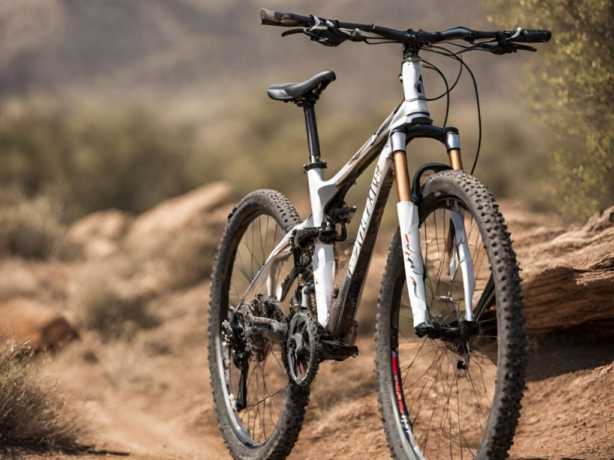
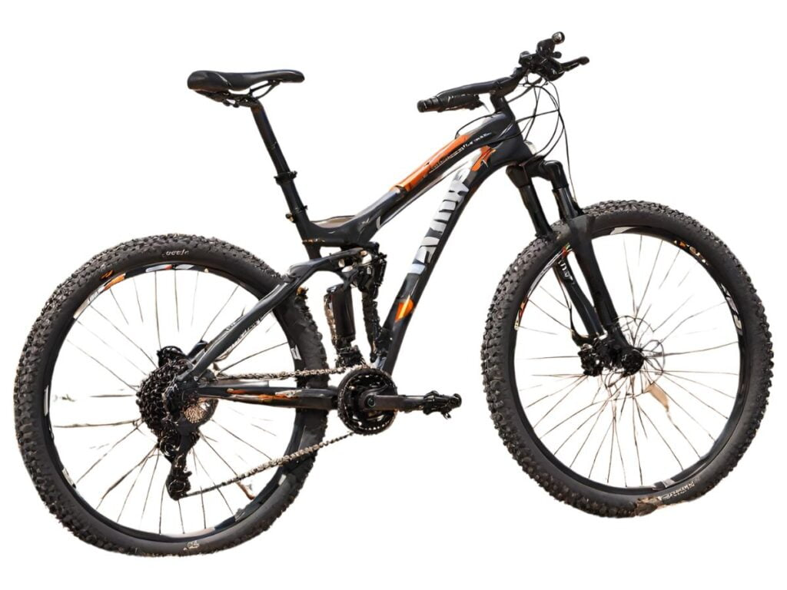

Choosing the right type of mountain bike is crucial to maximize your performance, comfort, and safety on the trails. Here is a comprehensive overview of the main mountain bike types and their key features:

Show Summary

Here are the main types of mountain bikes:

1. Cross-country mountain bikes
2. Trail mountain bikes
3. Enduro mountain bikes
4. Downhill mountain bikes
5. E-bike Mountain bikes

## Hardtail vs Full Suspension Mountain Bikes

The first decision is whether you want a hardtail or full suspension bike.

- **Hardtails** have front suspension but a rigid rear triangle. They tend to be lighter, more affordable and require less maintenance than full-suspension bikes. Hardtails excel on smoother trails and cross-country riding.
- **Full suspension bikes:** have front and rear suspension, allowing the wheels to better track over rough terrain. This makes them ideal for downhill, enduro, and aggressive all-mountain riding. The rear shock improves control and reduces fatigue on bumpy descents.

## Different Types of Mountain Bikes Explained

### Cross Country (XC) Mountain Bikes

#### Key Things to Remember

- Lightweight for efficiency over long distances
- Shorter suspension than other MTBs, less “bounce”
- Steeper geometry for climbing power
- Skinny tires with low rolling resistance
- Best for riders prioritizing distance over technical terrain

- **Best For**: XC bikes are best suited for riders who want to cover long distances efficiently, like road cyclists venturing onto trails. The lightweight design and shorter suspension prioritizes climbing performance over technical descending. So while you can still ride downhill on an XC bike, they really excel at helping you go fast and far.

Cross country mountain bikes are designed to be super lightweight and efficient so they can cover long distances quickly, even on rough terrain. But don't let the lightweight design fool you - these bikes are still strong and capable.

Now, if you're thinking about going downhill fast, cross country bikes might not be your first choice. They have less suspension, which is the bike's way of absorbing shocks, compared to other mountain bike types. So, if you're going over a jump, you'll feel the landing a bit more. But the shorter suspension makes it easier to pedal efficiently.

Riding a cross country bike might feel a bit like riding a road bike. They have a similar geometry, which is just a fancy way of saying the bike's shape and angles. They usually have a head angle - _the angle between the ground and the front fork_ - of around 67 or 68 degrees. This makes them responsive and agile.

The tires on cross country bikes are designed to give you good grip while being durable.

### Trail Mountain Bikes

#### Key Things to Remember

- Lightweight for efficiency over long distances
- Shorter suspension than other MTBs, less “bounce”
- Steeper geometry for climbing power
- Skinny tires with low rolling resistance
- Best for riders prioritizing distance over technical terrain

- **Best For**: Trail bikes are great for beginners who want a bike that climbs smoothly and descends confidently on custom trail centers. The suspension takes the edge off while pedaling uphill, and the geometry and components let you have fun flying downhill. With a trail bike, you'll be able to start honing your skills and tackling new challenges on a wide variety of trails.

#### Trail Mountain Bikes Explained

The key benefit is that trail bikes have suspension both on the front fork and on the rear of the bike. This suspension helps smooth out bumps and rocks on the trail so you don’t feel every little jolt. It makes for a much more comfortable and confidence-inspiring ride.

The suspension travel on trail bikes ranges from about 120-150mm. This is enough to handle most trails and obstacles, but not too much that it makes the bike feel sluggish or hard to pedal uphill. It strikes a nice balance between efficiency and capability.

Compared to cross country bikes, trail bikes will be a bit heavier and not quite as snappy when climbing. But they descend much better and won’t beat you up nearly as much on rough trails. The wider tires and slacker geometry also provide more stability and control.

Overall, trail bikes are super versatile. They can handle mellow green trails when you’re starting out but have the travel and geometry to tackle more advanced blue and black trails as your skills progress. And they’re just plain fun to ride!

I’d recommend starting out on a hardtail (front suspension only) trail bike. You can find very capable aluminum models from all the major brands like Trek, Specialized, Giant, etc. in the [$1000-1500 range](https://mtbnz.org/best-hardtail-mountain-bikes/). This helps keep the initial investment lower. Then if you really get into the sport, you can upgrade to a full-suspension trail bike later on.

The most important thing is getting out and riding the trails! Don’t overthink it too much. Start on some beginner trails, take your time, and have fun developing your skills. Trail bikes provide a perfect platform to progress as a new mountain biker.

It’s a lot to take in, but choosing your first mountain bike will usually be a big investment. Ask yourself the following: what do you plan to do with your bike? Do you want to perform jumps and stunts? Travel long distances cross country? Cycle downhill? Answering these questions will help you to decide on the right bike for you.

Did you know that a whopping 16 million bicycles were sold in the United States in 2013 – with mountain bikes being the biggest sellers? Or that 93 percent of bikes sold in the US were imported from China?

The statistics speak for themselves: more people are using mountain bikes than ever before, and these vehicles are perfect for exploring the great outdoors or keeping fit.

They say you always remember your first car, but the same can be said about your very first mountain bike. But with so many brands, makes, and models available on the market, it can all get a bit confusing. By the end of this article, you’re going to find out how to buy your first mountain bike and which components matter the most. Let’s get started.

## WHICH MOUNTAIN BIKE IS RIGHT FOR YOU?

If you’ve never purchased a mountain bike before, you might have heard terms like “cross country“ and “all-mountain”, but you might not know what they really mean. If you’re looking for information on how to buy your first mountain bike, you’ve come to the right place. Let’s start by clearing up some of the confusion.

### 3\. Downhill mountain bikes

Downhill mountain bikes are the perfect companion when riding across rocky terrain, and can survive huge drops – making them ideal for more accomplished cyclists. However, they are extremely difficult to pedal when riding uphill – definitely something to consider when purchasing your first-ever mountain bike.

Downhill bikes provide great suspension which will suck up large jumps and make it feel like you are landing on a soft mattress rather than rough terrain. With up to 200 mm of travel, these bikes absorb huge impacts at lightning speed.

Something else to bear in mind: these bikes have less than a 65-degree angle, and come with a low center of gravity, making them great for riding on steep terrain and tackling tough corners. The tires on downhill bikes are manufactured for traction, with double thick casings and spiked tread patterns for when cycling in mud.

Suitable for… daredevils who want speed and suspension when riding downhill

## CHOOSING THE RIGHT MOUNTAIN BIKE COMPONENTS

So, you’ve learned how to buy your first mountain bike? Great! Now it’s all about the components. These will vary depending on the manufacturer but can help to improve the speed and durability of your bike. Here are some of the components you really need to consider before you part with your cash…

### 1\. [Wheels](https://mtbnz.com/best-mountain-bike-wheels/)

A good pair of wheels can make all the difference between a good bike and a great one.

There are three wheel diameters to choose from (26, 27.5 and 29), with 29ers being the preferred option for most cyclists when riding cross country. 27.5s and 26s will often be used for cycling on more technical terrain and when going downhill respectively, and both of these sizes will usually cost less than 29ers.

So, how do you know what’s right for you? Take a test drive! Tackle different terrains with different-sized wheels and decide which one’s best.

### 2\. Drivetrain

There are plenty of drivetrain options to choose from, with double set-ups being the most popular. If you prefer lower gears, you might want to opt for a triple setup, but a double set-up is usually easier to deal with.

When it comes to chainring systems, a single chainring is lighter and requires only one shifter. These are easier to operate and maintain, even though double set-ups will make it easier to climb gears.

Again, it’s all about personal preference, so try several different types to see what works for you.

### 3\. Tires

Mountain bike tires are usually made of three main components – the bead, fabric, and rubber. The bead will hold the tire onto the rim of the bike, providing support, while the cloth fabric is woven into the two beads on the tire. The rubber will cover the fabric and provide the vehicle with durability, grip, and shock absorption.

When it comes to tire width, the general rule is that wider tires provide more cornering and stability when cycling fast (cross country cyclists use tires with a small width for example).

It’s important to note that width conversions can sometimes differ between brands, and might appear slightly smaller or larger depending on the manufacturer. It’s always best to check.

In addition, tubeless tires have become increasingly popular in recent years; these can be used without an inner tube sealant, and they tend to reduce air loss through the tire – making them more resistant to cuts.

### 4\. Dropper posts

Want to make quick height adjustments to your saddle when cycling? Dropper posts let you do that – and then some. These components make it easier to shift your weight in order to maintain balance and stability, but, again, you might find this feature superfluous to requirements depending on the type of bike you have.

For example, cross country vehicles probably don’t need a dropper post, to begin with, although they can come in useful when adjusting your seat at the top of a trail.

Some top-end mountain bikes already have dropper posts fitted as standard; if your bike doesn’t have one, you might want to purchase this additional component when you receive your next paycheck.

### 5\. [Pedals](https://mtbnz.com/best-mountain-bike-pedals/)

The type of pedals you opt for will depend on the type of mountain bike you have. Flat pedals are popular on road bikes and provide stability for the feet on both sides. They can be used with almost any type of footwear, and are lightweight and easy to operate.

Downhill mountain bikes will usually be fitted with flat pedals, especially because they can be easy to get out of if a crash happens. They are particularly good if you are looking for a strong grip!

Pedal toe clips can be attached to the front of the platform pedals and tend to surround the entire toes. These are affordable and sometimes come with an adjustable strap that is attached to the top and bottom of the clip.

Finally, clipless bike pedals operate by mounting a small plastic or metal cleat onto the sole of the shoe, which then snaps into several clips on the pedal. These pedals can provide you with a great deal of control if you are riding fast or performing jumps.

The result?

Your feet won’t bounce off the pedals. Although they can require a little bit of practice, these pedals are innovative, comfortable, and practical.

### 6\. Brakes

Just like pedals, there are three main types of brakes that you will want to consider when buying your first mountain bike. However, most mountain bike frames have been set up to handle either rim style or disc brakes. The latter do the job well, and can provide you with plenty of security and stability – perfect for when cycling on rough terrain or in a trail center.

Rim brakes come in various types, including Y-brakes and V-brakes and use two pads on either side of the bike wheel to slow you down when at high speeds. They offer limited stopping power when compared with disc brakes – especially in wet conditions.

Finally, coaster brakes have long been used on mountain bikes and lock the wheel when you back-peddle. Although much more basic than rim brakes and disc brakes, they are still fitted as standard on some models.

### 7\. Head angles degree

Head tube angles on a mountain bike will usually be around 66 degrees – significantly less than road bikes. A few things to remember: bikes with a steeper head angle will steer more sharply while slacker head angles are more likely to travel forward in a straight line.

Understanding the geometry of your vehicle is really important; you can find out how ‘stretched out’ you will be on the bike depending on the stem length and type of handlebar.

A good measurement to ascertain the [right bike fit](https://mtbnz.com/bike-fitment-guide/) is ‘effective top tube length’ or ETT. Basically, this is the length the tube would be if it was horizontal to the seat post. Find an ETT that makes you feel comfortable and then compare this to other makes and models.

## OTHER CONSIDERATION

### Here are a few more factors to consider when choosing your very first mountain bike…

#### \+ Price

The cost of the mountain bike will be a huge factor when deciding on the right make and model for you. Despite what you might have heard, some less-known brands offer all of the features, security, and stability that you would find with more famous manufacturers, so always do your research.

If you don’t mind having a lesser known name branded on your mountain bike, you could save a considerable amount of money.

#### \+ Components

You’ll get many features fitted as standard when you purchase some mountain bikes, but for everything else, you might want to add these as you go. Remember – it’s your first mountain bike, so dropper posts and expensive tyres might not be necessary if you are still trying to work out the basics.

#### \+ [Saddles](https://mtbnz.com/best-saddles/)

Cyclists sometimes forgo comfort for extra features, but a decent saddle should always be a priority – especially if you are planning to cycle for long distances.

A long, thin saddle can ensure efficient peddling and will save weight, but won’t always be the most comfortable shape to sit on. It’s probably best to find a happy medium – a saddle that saves weight and space, but one that won’t provide too much discomfort.

#### \+ Design

You’ll probably want a mountain bike that not only performs really well but one that looks good too. Bike frames will usually consist of the logo of the manufacturer but often come in different colors – providing you with more choice.

Choose a design that suits your personality, or opt for a relatively neutral design and then customize the bike at a later date. You’ll be able to change the color of your handlebar and wheel rim or add stickers to the bike frame.

## CONCLUSION

It’s a lot to take in, but choosing your first mountain bike will usually be a big investment. Ask yourself the following: what do you plan to do with your bike? Do you want to perform jumps and stunts? Travel long distances cross country? Cycle downhill? Answering these questions will help you to decide on the right bike for you. You should also think about the future, and whether you will still be happy to ride that style of bike in one or two years time. Mixing two different styles might serve you better; for example look for a bike that is able to handle cross country trails but will still be easy to use in trail centers. We’ve said it before, but we’ll say it again: go for a test drive to decide what’s right for you, and never buy your first mountain bike without at least trying it first.
