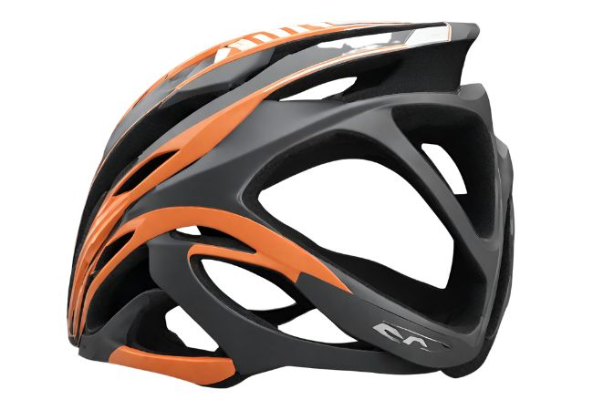
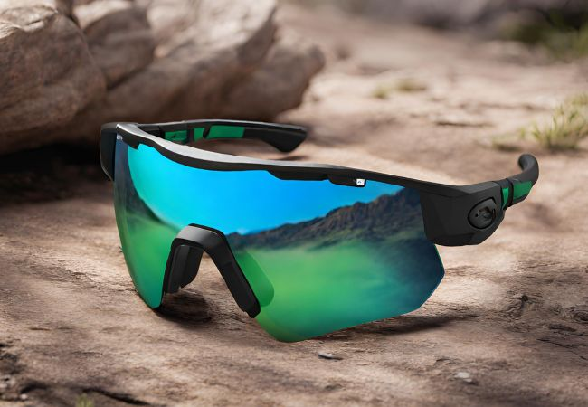
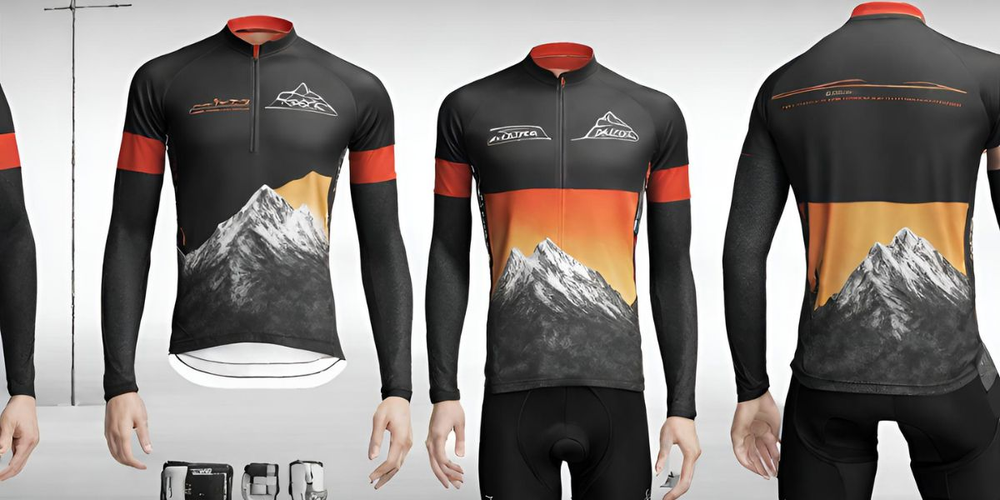
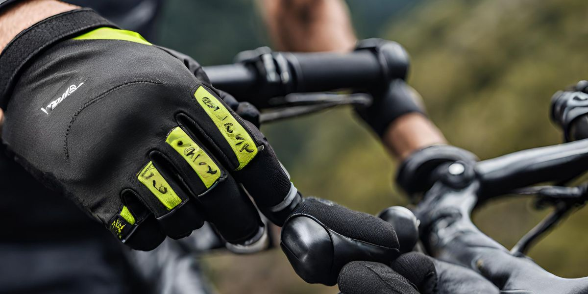
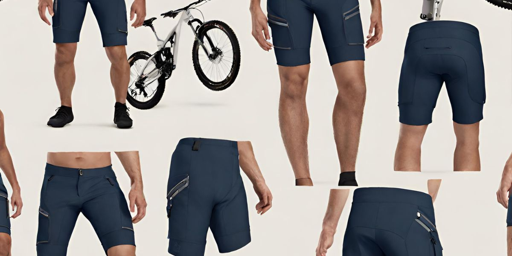
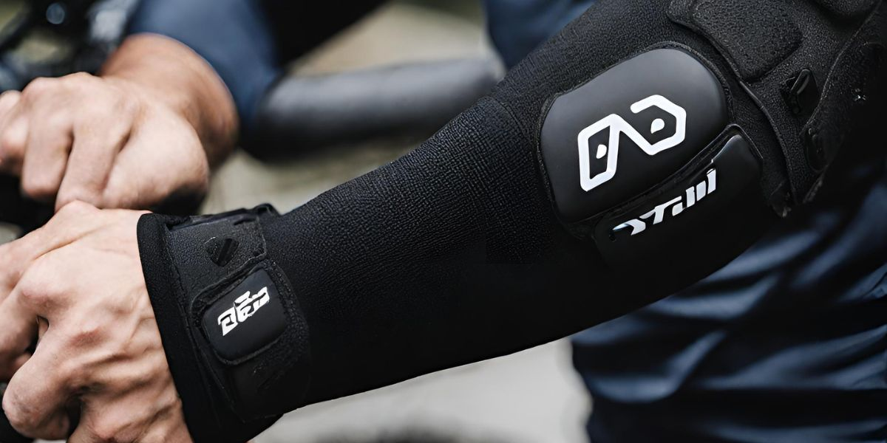
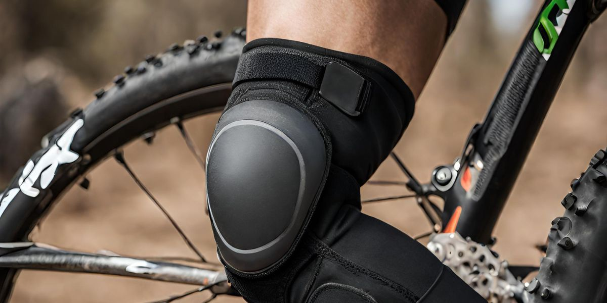
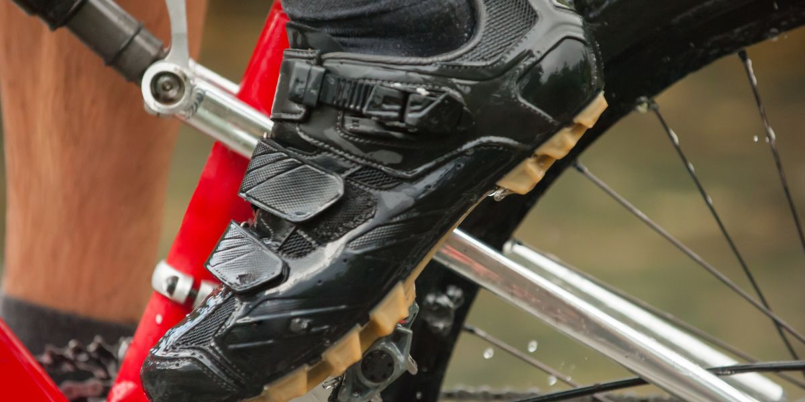

When you're just getting into mountain biking, figuring out what to wear can be tricky. The trails aren't like riding around your neighborhood - you need clothes that can handle dirt, rocks, mud, and whatever else the path throws at you. As an MTB enthusiast, I've helped many new riders gear up properly so they can focus on the ride, not their outfit. Here's my beginner's guide on what to wear for mountain biking.

## Mountain Biking Helmet

<figure>

<figcaption>

While high-end MTB helmets offer premium features and performance, there are quality options available at lower price points as well.

</figcaption>

</figure>

This is non-negotiable. A quality helmet designed for mountain biking is crucial for protecting your head in case of a crash or fall.

Look for a helmet with ample coverage around the sides and back of your head. It should have an adjustable fit system to dial in the right size, and plenty of vents to keep your head cool on hot rides. Don't cheap out here - this is the most important piece of safety gear.

### What Helmet Do I Need for MTB?

The first decision is selecting between a half-shell or full-face helmet.

- **Half-shell helmets** are the most common type of helmet worn by mountain bikers. As the name suggests, they cover the top half of your head, with coverage extending down the sides and back. Half-shells offer good ventilation for climbing and less aggressive riding. Popular half-shell helmets include the [Bell Super 3R MIPS](https://www.rei.com/product/163020/bell-super-3r-mips-bike-helmet), [Giro Montaro MIPS](https://www.giro.com/p/montaro-mips-mountain-bike-helmet/350080000100000025.html), and [Fox Speedframe Pro](https://www.foxracing.com/speedframe-pro-mips-helmet/24305.html?dwvar_24305_color=001&dwvar_24305_size=S&cgid=mtb-helmets-mens#start=1).
- **Full-face MTB helmets** provide maximum protection by fully enclosing the head. They have a chin guard and full shell covering the face. Full-faces are recommended for downhill, enduro, and aggressive trail riding where crashes are more likely. The best full-face MTB helmets are the [Bell Sanction](https://www.bellhelmets.com/bike/p/sanction-full-face-mountain-bike-helmet/100000000500000063.html), [Fox Rampage Pro Carbon](https://www.foxracing.com/rampage-pro-carbon-helmet/24305.html?dwvar_24305_color=001&dwvar_24305_size=S&cgid=mtb-helmets-mens#start=1), and [Troy Lee Designs D4 Carbon](https://troyleedesigns.com/products/d4-carbon-helmet).

When it comes to budget, you don't have to break the bank to get a quality helmet. There are plenty of budget-friendly options that offer excellent protection and comfort. For instance, the [Giro Isode MIPS](https://amzn.to/3R6RAYt) is an impressively comfortable, capable, and durable MTB helmet for its price.

Finding the right MTB helmet requires evaluating your riding style, budget, safety needs, and desired features. Take the time to try on different sizes and models to find the best helmet for fit and comfort. 

Premium safety features like MIPS and extended rear coverage provide an added layer of protection. Well-ventilated designs keep you cool on long climbs and rides. Prioritize safety first, then shop for MTB helmets offering the right blend of performance, features, and value to take your riding to the next level.

Remember to always wear your helmet when you're out on the trails. It's the best decision you can make for your safety and enjoyment of the sport.

Check out our guide on the [best MTB helmets in 2024](https://mtbnz.org/best-mountain-bike-helmets/).

## Mountain Bike Glasses

<figure>

<figcaption>

The best mountain bike glasses shield against all these dangers to provide critical protection for your vision. They also enhance trail visibility to improve riding performance.

</figcaption>

</figure>

When you're bombing down trails at 20 mph, there's all kinds of stuff that could fly up and poke you in the eye - sticks, rocks, roost from other riders. That's gonna hurt and could even damage your vision if you catch one wrong. Some impact-resistant glasses will shield your eyes and prevent a painful accident.

Glasses also cut down on bugs, dust, and dirt getting whipped into your eyes by the wind. Ever had a bee bounce off your cornea at speed? Not fun! Having lenses in front of your eyes keeps them clear and irritation-free so you can focus on the trail.

You'll get way better visibility too. Squinting into the wind and teary eyes make it tough to see obstacles and picklines. But with a pair of MTB glasses, your vision will stay crisp and clear no matter how fast you go. You'll spot roots, rocks, and ruts sooner and be able to react quicker.

And don't forget the sun! Those UV rays bouncing off the ground can damage your eyes over time. A good pair of shades will block those harmful rays and let you enjoy hours of worry-free riding under blue skies.

### Why Wear Glasses for Mountain Biking?

Mountain biking involves riding rough trails at high speeds, exposing your eyes to hazards like dirt, debris, bugs, and errant branches. That's why proper eyewear is essential gear for every mountain biker. 

Riding without proper eyewear leaves your eyes vulnerable to:

- **Debris** - Rocks, dirt, mud, and vegetation kicked up by your tires or other riders can strike your eyes at high speeds, leading to injuries.
- **Branches** - Protruding branches along the trail can whip across your face and eyes.
- **Bugs** - Swarms of insects on the trails can pelt your unprotected eyes.
- **UV damage** - Extended exposure to sunlight reflecting off surfaces raises your risk of eye damage from UV rays.
- **Wind** - Riding at speed creates drying and tearing of unshielded eyes.
- **Crashes** - Falling off your bike can cause your eyes to hit the ground, bike frame, rocks or branches.

The [best mountain bike glasses](https://mtbnz.org/best-cycling-sunglasses/) shield against all these dangers to provide critical protection for your vision. They also enhance trail visibility to improve riding performance.

### Glasses or Goggles for Mountain Biking?

For most trail and cross-country riding, high-end mountain bike glasses provide an ideal balance of protection, ventilation, and optical performance. Their lightweight design and versatility make them the top choice for all-around MTB eyewear.

However, downhill and aggressive enduro riders may benefit from the enhanced protection and anti-fog properties of MTB goggles. For these disciplines, goggles offer an advantage when riding in extremely dusty or muddy conditions

.While personal preference plays a role, matching your eyewear to the specific demands of your favorite mountain biking discipline will ensure you get the right mix of protection, clarity, and comfort on every ride.

Since there are many varieties of MTB glasses in the market, you’re probably wondering which to choose.

Well, preferably, pick out glasses with interchangeable lenses and multiple lens options. This way, you can use a clear lens when riding in dull or dark conditions, and tinted lenses to reduce glare or increase contrast in sunny days.

Here are some top mountain bike glasses to consider across price ranges:

- **Oakley Sutro** - Huge Prizm lens maximizes protection. Unobstructed view and secure grip.
- **Smith Attack** - ChromaPop lens excels at enhancing trail details. Durable and comfortable.
- **Julbo Vyper** - Spectron 3 lens transitions fast. Grippy yet slim frame.
- **Tifosi Sledge** - Fog-resistant with Glare Guard lens. Excellent value.
- **Rudy Project Cutline** - Photochromic option available. Adjustable vents prevent fogging.

## Mountain Bike Jersey

Getting a jersey designed for mountain biking makes a huge difference in how you feel out there.

First up, you gotta consider the sweat situation. When you're grinding up climbs or bombing down trails, you work up a serious sweat.

A cotton tee just gets soaked and starts feeling nasty. But a good MTB jersey uses technical fabrics that wick moisture away from your skin and dry super fast. It's like having a personal AC unit built into your shirt!

MTB jerseys are also cut longer in the back so they won't ride up on you in the riding position. Nothing worse than getting plumbers crack every time you lean forward! The sleeves are shaped to give your shoulders full range of motion too.

You'll also dig the storage options available on MTB jerseys. Most MTB jerseys have pockets on the back or sides to stash your phone, keys, tools, and snacks. No more cramming stuff into your shorts!

And don't forget protection. MTB jerseys are made from durable materials that can handle crashes and still look fresh. They'll save your skin from scrapes and scratches when you take a digger.

## MTB Gloves

<figure>

<figcaption>

Wearing MTB gloves when mountain biking is not just a matter of style, but also a matter of safety and comfort.

</figcaption>

</figure>

Wearing MTB gloves when mountain biking is highly recommended. They offer protection, enhance grip, and provide comfort, making your ride safer and more enjoyable.

The two main reasons mountain bikers wear gloves are to protect the hands in the event of a crash and to maintain a good connection to the handlebar grips regardless of weather conditions or sweat. 

When you're out on the trail, crashes can happen, and often, your instinct is to throw your hands out in front of you when you hit the dirt. Gloves can help prevent too much damage to your fingers and palms as you hit the ground.

Mountain biking gloves come in a variety of materials and designs. The majority of mountain bikers wear full-finger gloves, as these provide better protection during a crash and arguably offer better grip for riding in all conditions. 

The back of the gloves often features breathable material to allow your hands to cool down, while the palms and underside of fingers are usually made of tougher material to cope with the impact during a crash.

Some gloves even offer additional armoring in the form of rubber strips or ridges along the tops of the fingers or knuckles for extra protection. The 1[00% Cognito D3O gloves,](https://amzn.to/3G6rtdS) for instance, feature a thick, synthetic palm material that helps maintain grip on the handlebars and protects your hands.

### Why Do Some Pro Cyclists Not Wear Gloves?

While the benefits of wearing gloves are clear, some pro cyclists prefer not to wear them. They enjoy the "free" feeling of holding the grips directly with their uncovered hands and enjoy the sun and airflow on their skin. However, the consensus among most riders and experts is that the benefits of wearing gloves far outweigh the drawbacks.

## MTB Padded Shorts

<figure>

<figcaption>

Wearing MTB gloves when mountain biking is not just a matter of style, but also a matter of safety and comfort.

</figcaption>

</figure>

Wearing purpose-designed MTB shorts enhances comfort, performance, protection, and convenience compared to regular shorts.

Mountain biking shorts are designed to provide comfort during your ride. They often include a padded under-short, designed to make hours in the saddle more comfortable. This padding can help wick away sweat and provide a bit of cushioning for your backside region, making it more comfortable to perch on your bike seat.

The best MTB shorts are designed to strike a balance between breathability and durability. They aim to keep the rider cool while being tear-resistant.

Some shorts are designed with lighter materials for summer riding, allowing more air to pass through and helping evaporate sweat, keeping you cooler on hot days. 

On the other hand, winter riding shorts are typically made from thicker material, designed to be less breezy, and often have water-resistant coatings or panels.

### Should Mountain Bike Shorts be Padded?

Yes, mountain bike shorts should ideally be padded. The padding, often referred to as a chamois, is a crucial feature of biking shorts that can significantly enhance your comfort during rides. 

The padding in the shorts ensures that it stays exactly where you need it, even as you change your position on the bike. This is particularly beneficial during long rides or when navigating rough terrains, as it can help prevent blisters or sores

- The padded liner, known as a "chamois", provides cushioning for your sit bones and reduces pressure on sensitive areas. This helps [prevent saddle sores](https://mtbnz.org/prevent-saddle-sores/) and discomfort caused by sitting on a bike saddle for extended periods.
- Padding wicks away moisture and sweat, keeping you dry and preventing chafing on long rides.
- The padding absorbs vibrations from rough terrain, allowing you to stay seated and pedal more efficiently.

Some potential disadvantages of [padded MTB shorts](https://mtbnz.org/best-mountain-bike-shorts/) include a higher price tag, the need to wear them without underwear, and a less aerodynamic profile compared to road cycling shorts.

While there's no law requiring anyone to wear padded shorts while mountain biking, there are a lot of benefits to it. The padding in your bike shorts can help prevent uncomfortable issues like sweat pooling on your thigh and nether areas. It also reduces vibration, absorbing the shock that otherwise could cause pain and discomfort throughout your ride.

When choosing a chamois, consider the distance and frequency of your rides. For short distances, a thin, wicking foam chamois should suffice. If you're riding 10-15 miles several times per week, pick a shaped, dual-density sculpted foam or gel, preferably with thicker layers towards the center, and thinner edges for comfort. If you're riding long distances, it's advisable to invest in gel.

- Padded MTB shorts should be worn directly against your skin—wearing underwear adds seams, reduces breathability, and restricts your movement, reversing your chamois’ benefits.

## MTB Elbow Pads

<figure>

<figcaption>

If you're a beginner, or if you're planning to tackle challenging trails, wearing MTB elbow pads could provide an extra layer of protection and peace of mind.

</figcaption>

</figure>

 You should consider wearing elbow pads for mountain biking, especially if you're planning to tackle challenging trails, increase your speed, or engage in downhill biking.

Elbow pads can protect your joints from impact injuries in the event of a fall, reducing the severity of injury and protecting this essential joint. They can also help prevent cuts and scrapes, especially if you wipe out on a rocky surface.

When choosing MTB elbow pads, it's important to find a balance of safety and rider comfort. You should consider factors such as materials, fit, length, and impact protection. The [best MTB Elbow pads](https://mtbnz.org/best-mtb-elbow-pads/) should fit snugly around the elbow without restricting movement or causing discomfort. They should also be made of high-quality materials that can withstand the rigors of mountain biking. Durability is particularly important for riders who engage in frequent or intense riding.

Many elbow pads, like the [Pro-X2 Mountain Bike Elbow Guards](https://amzn.to/40P57qS), are designed with breathability in mind. They feature ventilated pads and moisture-wicking fabric to keep you cool and comfortable, even on the most challenging trails.

Some of the top-rated elbow pads for mountain biking include the Troy Lee Designs Speed D3O, 100% Ridecamp, 100% Teratec, 7iDP Sam Hill Lite, Fox Enduro D30, Kali Protectives Mission, Dakine Slayer, IXS Carve Evo+, Leatt Airflex, Ninja Hooligan, Ninja Speed King, and Troy Lee Speed Sleeve.

- The fit of your elbow pads is crucial. They should be close-fitting, but not so tight that you can't move your arms freely. A good fit will help the elbow pads stay in place and keep protective inserts in the right areas in the event of an impact

## Mountain Bike Knee Pads

<figure>

<figcaption>

Many knee pads use foam or gel materials that have good shock-absorbing properties.

</figcaption>

</figure>

MTB Knee pads serve as a protective layer between your knees and potential impacts. They are designed to absorb shocks and reduce the chances of bruises, abrasions, sprains, or even more severe injuries like twists or fractures.

The knee is a complex joint that can easily get injured in falls, collisions, or due to excessive strain. By wearing the [best MTB knee pads](https://mtbnz.org/best-mtb-knee-pads-reviews/), you create a buffer that can help prevent these injuries.

There are two main types of knee pads: **hard-shell and soft-shell**.

Hard Shell Knee Pads

**Hard-shell knee pads** are designed with a hardened polymer insert, often shaped in a shallow cup, to protect the knee against direct rock impacts. These knee pads are usually heavier and constrain pedalling, but they provide the highest level of protection

Soft Shell Knee Pads

Soft-shell knee pads, on the other hand, are lighter and forego the hardened inset of a hard-shell pad, providing reasonable impact protection. They won't prevent a deep tissue or bone injury if you suffer a direct rock strike with the knee, but they will mitigate moderate impacts and prevent lacerations and severe skin damage

In addition to protecting against direct impacts, MTB knee pads also provide protection against environmental factors.

During mountain biking, you often come into contact with rough and unpredictable terrains. Sharp branches, rocks, thorny bushes, and other obstacles can lead to unintended scrapes or cuts. Knee pads with abrasion-resistant materials and reinforced panels protect your knees from such injuries, even in the harshest environments.

But knee pads aren't just about [injury prevention](https://mtbnz.org/how-can-you-prevent-injury-while-cycling/). They also serve an essential function regarding rider confidence. By removing the anxiety of knee injury during a crash, riders can focus all their senses on correct body position, brake modulation, handlebar pressure, and pedal position. The result is a smoother, more confident ride. 

When you know your knees are well-protected, you can focus more on your ride and improve your skills without worrying about injuries. This gives you a mental boost and the freedom to push your limits.

When choosing mountain bike knee pads, it's essential to consider the type of riding you'll be doing. For cross-country riders, a low-profile foam or D3O knee pad without straps is recommended. These pads are unobtrusive, pedal well, and offer some protection.

For pure gravity riders, your knee pad needs are simple - it's all about protection. Look for something with good shin and knee coverage and a plastic shell that fits you well.

- Fit is the most important part of buying MTB bike knee pads. Poorly fitting pads will be uncomfortable, won't stay in place, and won't protect you as well. Measure your legs to get a feel for what size you should be looking at before you start shopping.

#### Best Knee Pads for Mountain Biking in 2024

Here are some of the best knee pads for mountain biking in 2024:

1. **Leatt Airflex Pro**: These knee pads offer a brilliant combination of protection and pedal-friendliness. They are comfortable and versatile, making them suitable for a wide range of weather conditions and terrain types.
2. **Sweet Protection Knee Pads**: These knee pads are highly rated for their comfort, secure fit, and coverage. They use SAS-TEC knee cups, which harden on impact, providing excellent protection. They warm up quickly and dry fast, making them suitable for multi-day trips.
3. **7iDP Project Knee Pads**: These knee pads offer substantial protection and comfort. They use a combination of D3O inserts behind hard plastic shells, providing excellent coverage.
4. **Troy Lee Designs Raid**: These knee pads are among the most protective options available. They feature substantial D3O padding that covers a large part of the knee area and extends far down the shin.
5. **Fox Racing Launch Pro D3O**: These knee pads are also highly recommended. They are relatively light and good for pedaling up and running into deep ruts.
6. **POC Joint VPD Air Knee Pads**: These knee pads are popular for their durability and comfort. They have saved many users’ knees several times and have not slipped during a crash.

## Mountain Bike Shoes

<figure>

<figcaption>

Investing in a good pair of MTB shoes can significantly improve your mountain biking experience by providing better power transfer, grip, protection, and comfort

</figcaption>

</figure>

Mountain bike (MTB) shoes are specifically designed to enhance your mountain biking experience by providing better power transfer, grip, protection, and comfort compared to regular shoes.

When choosing MTB shoes, consider the climate you ride in. If you ride in hot climates, choose shoes made from breathable material with lots of ventilation. If you live in a cold place, opt for insulated MTB shoes with features that seal you from bad weather.

### What Type of Shoe Should I Wear for Mountain Biking?

If you’re using flat pedals, flat-soled shoes designed for mountain biking are the best choice. These shoes have very stiff soles and a tacky rubber sole which allows the metal pins in the pedals to grip, providing excellent levels of grip even through very rough terrain. 

Some popular options for flat pedal shoes include the [Five Ten Freerider](https://amzn.to/3ulvGrv) and the [Ride Concepts](https://amzn.to/46njV1c).

If you’re using clipless pedals, you’ll need biking shoes with cleats that are designed to click into the pedal mechanism, attaching your shoe to the pedal until released. 

Some top-rated clipless shoes for mountain biking include the [**Crankbrothers Mallet BOA**](https://amzn.to/3umJlia) and the [Giro Empire VR90](https://amzn.to/3MU5WZA).

- Regardless of the type of shoe you choose, a good mountain bike shoe should be comfortable and breathable, provide a stable pedalling platform, protect your feet from trail debris and crashes, be easy to get on and off, dry fast, and not weigh too much.

## MTB Dressing For Different Seasons

### What Should I Wear on a Mountain Bike in the Summer?

Staying hydrated is crucial, especially during summer rides. A hydration pack allows you to drink without having to stop or even let go of the handlebars.

[Best hydration packs for mountain biking.](https://mtbnz.org/best-hydration-packs-for-mountain-biking/)

Here’s a short list of hot weather MTB accessories you want to make sure you have:

- Polarized sunglasses
- Sunscreen
- Gloves (to prevent your hands slipping)
- Towel (for wiping sweat off)
- Well-ventilated helmet
- Bike tools (to get your bike fixed and you out of the heat ASAP)
- Headband
- Breathable Socks
- WATER!!! (for during your ride AND after)

When shopping for summer clothing look for light colors, sun protection, breathable fabric, quick drying, antimicrobial, and anything mesh.

Do NOT buy anything cotton! You need something moisture wicking and while cotton is super comfortable, it’s definitely going to cling to your body when you start sweating.

### How Should I Dress for Mountain Biking in the Winter?

Dressing appropriately for winter mountain biking is crucial to ensure comfort, warmth, and safety. Here’s a comprehensive guide on how to dress for mountain biking in the winter:

1. **Base Layer**: This is the foundation of your winter biking outfit. It should fit tightly next to your skin, trap heat in, and wick moisture away. Some recommended options include the [Smartwool Merino 150 Base Layer](https://amzn.to/49HnK3X), [Under Armour ColdGear Base Layer](https://amzn.to/3SOlfH2), and Rapha Merino Mesh Base Layer.
2. **Mid Layer**: This layer provides additional warmth and insulation. Fleece is a popular choice for mid-layers because it’s lightweight, breathable, and quick-drying. The Patagonia R1 TechFace Jacket and The North Face Summit L3 Down Hoodie are good options.
3. **Outer Layer**: This is your first line of defense against the elements. It should be waterproof or water-resistant. The Outdoor Research Interstellar Jacket is a recommended option.
4. **Winter Mountain Bike Jerseys**: These can act as a mid-layer during the coldest of days while being effective on their own in milder conditions. Some top-rated jerseys include the Altura Esker Trail Long Sleeve Jersey, Endura Singletrack Fleece jersey, and Fox Defend Thermo Hooded Jersey.
5. **Mountain Bike Jackets**: The best mountain bike jackets will feature long sleeves, a dropped tail, and a high neck to protect you from the elements. Softshell jackets offer high levels of waterproofing and warmth.
6. **Waterproof Mountain Bike Trousers and Shorts**: These keep your legs dry whether the water is coming from above or splashing up from the trail.
7. **Winter Mountain Bike Onesies**: These offer full protection from the elements, combining a winter jacket and waterproof bottoms into one suit.
8. **Winter Mountain Biking Shoes**: These shoes keep your feet dry and warm, with most featuring waterproofing. Some shoes have built-in neoprene gators, which make them less breathable but more waterproof when submerged.
9. **Winter Mountain Biking Gloves**: A good pair of winter gloves are a necessity for winter mountain biking. Look for waterproof gloves if you are going out on wet days.
10. **Gilets**: Gilets are another great addition to your riding gear. They provide an extra layer of warmth for your core without adding bulk or restricting movement.

Remember, the key to dressing for winter mountain biking is layering. This allows you to adapt to weather and temperature changes throughout your ride, keeping you at your optimal temperature.

## Frequently Asked Questions About What to Wear for MTB

### Is it OK to Wear Jeans Mountain Biking?

Yes, you can wear jeans for mountain biking, but it’s important to consider the potential drawbacks. Jeans can restrict your movement, especially if they are tight, which could hinder your performance. They may also be uncomfortable to wear with knee pads, and if you get caught in the rain, jeans can take a long time to dry and may chafe your thighs.

There are better options available specifically designed for mountain biking. Mountain bike shorts and pants are made from technical materials that are stretchy, tough, and breathable. They are designed to be comfortable and functional, allowing you to perform at your best.

### What Not to Wear Mountain Biking

Here are some tips on what not to wear when mountain biking:

- **Avoid cotton clothes** – Cotton absorbs sweat and takes a long time to dry. It can get very heavy and uncomfortable when wet. Opt for technical fabrics like polyester or merino wool that wick moisture away from your skin.
- **Don’t wear baggy shorts** – Loose shorts can get caught on your saddle or pedals, causing crashes. Form-fitting mountain bike shorts are safer and more comfortable for riding.
- **Don’t wear jeans** – Jeans restrict movement, chafe, and take forever to dry when wet. They offer little abrasion resistance in crashes. Jeans are not well-suited for mountain biking.
- **Avoid open-toed shoes** – Exposure to trail debris, branches, rocks etc. makes open-toed shoes a bad choice. Wear shoes that protect your feet and have grippy soles.
- **Don’t wear a half-shell skateboard or road helmet** – These offer less coverage on the back and sides of your head than a mountain bike-specific helmet.
- **Avoid loose shirts** – Baggy shirts can snag on branches and interfere with your movement. Opt for athletic shirts that wick moisture.
- **Don’t wear jewelry** – Necklaces, bracelets, rings etc. can catch on things and cause injuries in a crash.
- **Skip the cargo shorts** – The extra pockets add unnecessary bulk and weight. If you need to carry items, use a hydration pack or jersey pockets instead.

In the US, mountain bikes are the [most popular type](https://www.pioneersportscolorado.com/bike-statistics-and-facts-2019/) of bikes. Even with such popularity, studies on mountain bike races have shown very [low injury rates](https://www.researchgate.net/publication/11299198_Mountain_Biking_Injuries_An_Update) of <1%. This is partly due to riders wearing proper mountain biking attire.

But how do you determine what to wear when mountain biking?

Well, the right choice depends on various factors, including:

- **Comfort:** This also impacts safety, especially in long rides.
- **Weather conditions:** This may be seasonal or sporadic changes.
- **Protection:** Certain requirements may apply in race events or generally.
- **Personal style:** Follow your preferences as long as it is safe.
- **Demands of your ride:** Like enduro races, downhill rides and others.

Based on these considerations, here are the essentials you’ll likely need.

1\. Helmet

https://www.youtube.com/embed/fb4LgOWlDHM

Helmets are crucial for head protection, due to the risk of slipping, crashing, and even bumping into trees or rocks.

Therefore, you must get the right helmet – not just any helmet.

If you’re participating in a mountain biking event under the [USA Cycling permit](https://usacycling.org/about-us/governance/policy-i), your helmet must meet either the U.S. Consumer Product Safety Commission (CPSC) standard or the US DOT helmet standards.

So, what features does an MTB (mountain biking) helmet have?

Generally, it will have an integrated peak to keep sun and rain out of your eyes and deflect low-hanging branches. It also provides better coverage by sitting lower around the back and sides of your head.

For all-round protection in bike parks, downhill riding, and enduro racing, go for a full-face helmet.

Some varieties have certain safety features like a neck brace, and MIPS technology (an additional slip-plane to reduce rotational forces on your brain during impact).

2\. Glasses or Goggles

Both glasses and goggles protect your eyes from sun glare or dirt thrown up by your bike’s front wheel.

But, when do you choose glasses instead of goggles?

When trail riding, glasses will serve you well. However, if the weather is grim and tracks muddy, goggles will provide sealed weather protection plus a wide range of vision.

Since there are many varieties of glasses, you’re probably wondering which to choose.

Well, preferably, pick out glasses with interchangeable lenses and multiple lens options. This way, you can use a clear lens when riding in dull or dark conditions, and tinted lenses to reduce glare or increase contrast in sunny days.

On the other hand, you can go ‘full enduro’ with goggles by pairing them with full-face helmets. This is excellent for downhillers because goggles are more secure and offer more protection.

**3\. Base Layer**

The base layer is typically a long sleeve shirt that sits next to your skin, so you can build other layers on top.

So, which is the best MTB base layer?

A good choice depends on your personal needs and budget.

A variety of options exist, made of synthetic and natural fibers. Generally, thicker options keep you warmer during winter; whereas, thinner options are better at wicking sweat.

Since you can get warmth from other clothing layers, your main focus should be the base layer’s moisture wicking capability.

A good base layer sits close to your skin, while feeling comfortable between your skin and underneath the outer layers. It shouldn’t feel restrictive or bunch up uncomfortably.

In sunny weather, your base layer can be your only layer, but don't expect much wind protection.

**4\. Jersey**

MTB jerseys usually have a loose cut.

When selecting jerseys, consider [biking safety tips](https://www.dnr.state.mn.us/biking/safety.html), such as recommendations to wear bright clothing so other mountain trail users and even drivers can see you.

But when should you choose a short-sleeve, three-quarter, or long-sleeve jersey?

It depends on the amount of insulation and protection you need.

In the heat of summer, a short-sleeve will keep you cooler. However, a long-sleeve offers more protection for your arms, against sunburns, branches, nettles, and thorns. A three-quarter offers the best of both worlds.

You might still stay cool with long-sleeves that have mesh panels for improved breathability.

For cross-country mountain bikers, Lycra jerseys are great, especially with rear pockets for stowing snacks, spare tubes, and tools.

**5\. Jacket** https://www.youtube.com/embed/\_22QIgwuaRQ

The [US Forest Service](https://www.fs.usda.gov/visit/know-before-you-go/mountain-biking) recommends that mountain bikers be prepared for sudden weather changes, and one way to achieve that is getting a jacket.

But it doesn’t have to be a heavy duty jacket.

You have the choice between three options:

1.   lightweight shell
2.  hybrid jacket
3. fully waterproof jacket

Lightweight jackets are water resistant, offer some wind protection, and retain breathability through mesh panels or perforations. They are also packable, so you can stow them in a backpack.

Fully waterproof jackets have a proper hardshell fabric to keep the rain out for hours. Such waterproof jackets for mountain biking typically have a looser fit compared to those made for road cycling. The loose fit can accommodate layers or potentially body armor underneath and allows greater freedom of movement.

Hybrid jackets offer the best of both worlds. They are made from softshell or padded fabric, giving additional warmth and stretch.

**6\. Vest**

A vest is much like a packable jacket.

This is something you can conveniently fit in your pockets when the weather is iffy. You can also pair it with a short sleeve jersey and arm warmers to get some of the benefits of a jacket.

A great vest will have a windproof front panel with a breathable rear.

Two-way zippers can make it easy to dump heat in a hurry, and access your jersey pockets. But some vests also have pockets.

**7\. Chamois, Liners & Underwear**

A pair of chamois, liner shorts, or underwear is just as valuable as your base layer. Maybe, even more valuable.

The chamois are padded shorts which ensure your comfort in the saddle when you hit the trails.

Based on your preference, you can have either chamois bibs or shorts.

For even greater comfort, you can also prepare with Chamois Butter, an anti-chaffing cream, for long rides.

If you don’t prefer chamois for short rides, downhill rides, or shuttling, consider non-cotton underwear with good wicking properties. Materials like merino wool have the added advantage of natural odor-fighting properties.

**8\. Baggy Shorts** https://www.youtube.com/embed/Vee82hpRvoA

Most mountain bikers prefer baggies.

These shorts are usually knee length. They are made of either stretchy material; or robust, tear-resistant fabric that has stretch panels around the back which allow your shorts to move with you.

You can wear baggies over your bibs, short liners, and knee pads.

Most baggies receive a durable water repellant (DWR) treatment that causes water to bead and run off instead of soaking into the material.

**9\. Waterproof Trousers/ Pants**

If you choose to wear riding trousers, always get the proper fit.

These pants should be close enough so the material doesn’t flap around or get in the way, but they should have enough room not to restrict pedaling.

Riding trousers keep you warm in cold weather, dry in the rain, and clean in mucky conditions. The water resistance comes from either softshell or hardshell fabric with a DWR coating.

For maximum abrasion resistance and full weather protection, go for hardshell fabric. To get greater breathability and stretching for maximum movement, go for softshell fabric.

**10\. Tights**

This is simply a long version of the skintight cycling shorts.

Cycling tights provide extra warmth during colder months, some protection, and even padding from an included chamois.

This attire is particularly useful in the chilly mornings of spring and autumn, or winter months. Winter tights are typically thicker than cool-weather or autumn tights.

Tights offer an optimum fit to your body contours, reflecting specific ergonomics of your on-bike position (featuring a long, stretched back).

**11\. Knee Pads**

In case you crash when cycling, quite often your knees will be the first part of your body to meet the ground.

Therefore, if you’re riding a challenging trail, it’s always wise to wear knee pads. Or, you can just wear them for peace of mind.

Various lightweight options are available which offer protection while giving you the freedom to pedal comfortably. You can also get chunkier pads for more technical riding.

Breathability is part of the design of high quality knee pads which are heavily perforated for maximum airflow.

**12\. Elbow Pads**

In a crash, your elbows are just as likely to hit the ground as your knees.

Elbow pads will serve you well in such situations.

Unlike the bulky, hard-shell options of the past, modern elbow pads are lower-profile and more comfortable.

These pads feature elastic compression sleeves and silicone grippers without straps. Therefore, you must get the right size, because there’s no room for further adjustment.

Moreover, the amount of protection you’ll get will depend on the specific option you select. Beefier options give DH (downhill) levels of protection, while lighter versions are more like padded arm warmers.

**13\. Chest and Back Protectors** https://www.youtube.com/embed/DnKGiIUS5Uk

Chest and back protectors are essential in downhill mountain biking, or any time you want to neglect the brakes to shave some time off your descent. Enduro races also require such protection throughout the event.

Most torso protectors are worn beneath a jersey.

Some varieties have added features like lumbar pockets, and protection sleeves that double as hydration bladder pouches which hold vertically-oriented water bags. The pouches will likely also have a hydration hose loop to keep your mouthpiece handy while riding.

Often, you can unzip during climbs to increase air flow, but the protectors are usually highly breathable and will dry fast on a windy descent.

**14\. Gloves**

Gloves provide extra protection, thermal insulation, and grip.

Most mountain bikers prefer full-finger gloves since they provide more comprehensive protection than mitts. They protect your hands from crashes or undergrowth, and some have padding on the palms for additional cushioning.

Downhill or enduro riders will benefit from gloves with more protection on the back of the hand, due to the higher likelihood of crashing in such types of riding.

You’ll also get extra traction on the handlebars if you select gloves that have carefully-placed grippers to help you get full control over bike brakes and shifters.

**15\. Socks**

Socks are a key statement of style.

But, they also play an important role in guarding your shins or calves against cuts and scratches from undergrowth or even bike pedals.

If you ride in wet conditions, waterproof socks are an ideal choice.

In cold weather, thick socks will keep you warm. 

On the other hand, lightweight and breathable socks are great for summer weather. Also consider the sock height, since taller socks may offer more protection, but will also run hotter compared to mid-rise or low socks.

**16\. Shoe Covers/ Overshoes**

You can wear road cycling overshoes over cycling cleat, slim-line, or clipless shoes.

Such shoe covers have a very thin sole and a hole for clipping on.

Since they have a tight fit, only use them with proper cycling footwear – not regular shoes. The covers are generally made of such fabric as nylon with a bit of insulation, and either a closure zipper or hook-and-loop strap.

Although the cover soles are abrasion resistant, you shouldn’t walk on them. 

The covers can keep your feet warm and dry in winter while being pretty breathable.

**17\. Shoes** https://www.youtube.com/embed/fGvqrAFGVuE

For mountain bikers, regular shoes just won’t cut it.

You need mountain-bike-specific shoes which have a [hardened toe box](about:blank), since smashing toes on roots and rocks is a common injury.

Here, two options exist: flat and clipless shoes.

Flat shoes are made for flat pedals which have rough-textured surfaces and ‘pins’ projecting outward to grip your shoes. The shoes have a sole with tread patterns suited to flat pedal pins, and made from extra-grippy rubber.

Clipless shoes work well for trail and cross-country riders.

A clipless shoe has a recessed cleat mechanism in the sole that connects it to the clipless pedal. This gives you more control and better power transfer, with the ability to pull up on a pedal stroke for increased pedaling efficiency and bunnyhop-ability.

## Conclusion

As you may have noticed, there’s a long list of items to wear, but you may not need all of them at once.

If you’re not participating in a serious event, you likely need just the bare essentials. These are items that directly impact your personal safety.

After all, you also have to get a bunch of mountain biking gear.
